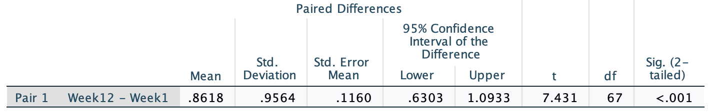

# Tests for the mean difference (paired data) {#TestPairedMeans}


<!-- Introductions; easier to separate by format -->
```{r, child = if (knitr::is_html_output()) {'./introductions/31-Testing-MeanDifference-HTML.Rmd'} else {'./introductions/31-Testing-MeanDifference-LaTeX.Rmd'}}
```


<!-- ```{r echo=FALSE} -->
<!-- insulate <- read.csv("./Data/InsulationBeforeAfter.csv")  -->

<!-- colnames(insulate) <- c("Before", "After") -->
<!-- insulate$Diff <- insulate$Before - insulate$After -->

<!-- mn.I <- mean(insulate$Diff) -->
<!-- sd.I <- sd(insulate$Diff) -->
<!-- n.I <- length(insulate$Diff) -->
<!-- se.I <- sd.I / sqrt(n.I) -->
<!-- ``` -->


## Introduction: weight gain {#Chap29-Intro}


<div style="float:right; width: 222x; border: 1px; padding:10px">

</div>


In Chap.\ \@ref(PairedIntro), data were introduced that studied the mean amount of weight gained between Week\ 1 and Week\ 12 when they began university (@levitsky2004freshman, @DASL:WeightChange).
We could also ask:

> For Cornell University students, does the *mean weight* of students *increase* after $12$ weeks at university?


The data collected are shown in
`r if( knitr::is_latex_output() ) {
    'Table\\ \\@ref(tab:DataWeightChange2).'
} else {
    'the table below.'
}`


For these data, finding the *difference* (or *gain*) in weight between Weeks\ 1 and\ 12 seems sensible.
The data are *paired* (Sect.\ \@ref(PairedIntro)): the same unit of analysis is measured twice on the same variable (weight in *Week\ 1* and *Week\ 12*), and the *mean* change is of interest.
That is, the comparison is *within* individuals (Sect.\ \@ref(Comparison)), and *not* between two different groups of individuals.
The parameter is $\mu_d$, the population mean *gain* in weight.


::: {.tipBox .tip data-latex="{iconmonstr-info-6-240.png}"}
Explaining *how* the differences are computed is important.  

Here, the differences could be computed as the *Week\ 1 weight* minus *Week\ 12 weight* (the weight *loss*), or the *Week\ 12 weight* minus the *Week\ 1 weight* (the weight *gain*).
Either is fine, as long as you are consistent throughout.
The meaning of any conclusions will be the same.  

Here we discuss weight *gain* as mentioned in the RQ.
:::


```{r DataWeightChange2}
data(StudentWt)

SWlen <- length(StudentWt$Week1) 

if( knitr::is_latex_output() ) {
  
  tb1 <- StudentWt[1:5, ] 
  
  T1 <- knitr::kable(surroundMaths(tb1,
                                   decDigits = 1),
                     format = "latex",
                     valign = 't',
                     align = c("r", "c", "c", "r"),
                     linesep = "",
                     col.names = c("Student", "Wk 1", "Wk 12", "Wt gain"),
                     row.names = FALSE,
                     escape = FALSE,
                     booktabs = TRUE) %>%
    row_spec(0, bold = TRUE) 
  
  tb2 <- StudentWt[(SWlen - 4):SWlen, ]
  T2 <- knitr::kable(surroundMaths(tb2,
                                   decDigits = 1),
                     format = "latex",
                     valign = 't',
                     align = c("r", "c", "c", "c"),
                     linesep = "",
                     col.names = c("Student", "Wk 1", "Wk 12", "Wt gain"),
                     row.names = FALSE,
                     escape = FALSE,
                     booktabs = TRUE) %>%
    row_spec(0, bold = TRUE)
  
  out <- knitr::kables(list(T1, T2),
                       format = "latex",
                       label = "DataWeightChange2",
                       caption = "The student weight-change data: The weight of students in Week 1 at university, in Week 12, and the weight gain (all in kg). These are the first five and the last five of the 68 observations.") %>% 
    kable_styling(font_size = 10)
  out2 <- prepareSideBySideTable(out) 
  out2 
}

if( knitr::is_html_output() ) {
  kable( StudentWt,
         format = "html",
         booktabs = TRUE,
         longtable = FALSE,
         col.names = c("Student", "Week 1", "After 12 weeks", "Weight gain"),
         caption = "The student weight-change data: The weight of students in Week 1 at university, in Week 12, and the weight gain (all in kg)") %>% 
    kable_styling(font_size = 10) %>%
    row_spec(0, bold = TRUE)
}
```


The data should be summarised numerically using software, such as jamovi or SPSS (Table\ \@ref(tab:WeightGainSummary)), and graphically (Fig.\ \@ref(fig:WeightGainHistogram)).


## Statistical hypotheses and notation

The RQ asks if the mean weight *in the population* increases; that is, is the mean difference is zero, or greater than zero.
The *parameter* is the *population mean difference*. 
To make things clear, notation is needed (recapping Sect.\ \@ref(PairedNotationCI)) to describe the *data*:

* $\mu_d$: The mean *difference* in the *population*.
* $\bar{d}$: The mean *difference* in the *sample*.
* $s_d$: The *sample* standard deviation of the *differences*.
* $n$: The number of *differences*.

The hypotheses, therefore, can be written in terms of the parameter $\mu_d$.
The *null* hypothesis is 'there is *no change* in weight, in the population':

* $H_0$: $\mu_d = 0$.

As noted in Sect.\ \@ref(AboutHypotheses), the null hypothesis states that there is 'no difference, no change, no relationship', as measured by a parameter value.
This hypothesis, the initial *assumption*, postulates that the mean weight difference may not be zero in the *sample* due to sampling variation.

Since the RQ asks specifically if weight *increase*, the alternative hypothesis will be a [*one-tailed* hypothesis](#AboutHypotheses):

* $H_1$: $\mu_d > 0$ (one-tailed).

This hypothesis says that the mean weight change in the population is *greater than* zero.
The alternative hypothesis is *one*-tailed because of the wording of the RQ.
Recall that the differences are defined as weight *gains*.


##  Describing the sampling distribution

Initially, assume that $\mu_d = 0$.
However, the *sample* mean weight gain will vary depending on which one of the many possible samples is randomly obtained, *even if* the mean weight gain in the population is zero.
That is, the value of $\bar{d}$ will vary across all possible samples even if $\mu_d = 0$.

The possible values of the sample mean differences can, under certain conditions (Sect.\ \@ref(ValiditySampleMeanDiffTest)), be described using an approximate normal distribution.
The mean of all the possible values of $\bar{d}$ is denoted $\mu(\bar{d})$.
Since we assume the average value of the mean difference in the population is $0$ (from the null hypothesis), here $\mu(\bar{d}) = 0$.

The standard deviation of all the possible values of $\bar{d}$ (called the *standard error*) is denoted $\text{s.e.}(\bar{d})$; it's value is  
\[
  \text{s.e.}(\bar{d}) = s_d/\sqrt{n} = 0.3212.
\]
This describes what can be *expected* from the possible values of $\bar{d}$ (Fig.\ \@ref(fig:WeightGainNormal2)), just through sampling variation if $\mu_d = 0$.


```{r WeightGainNormal2, fig.cap="The sampling distribution is a normal distribution; it shows how the sample mean weight gain varies in samples of size $n = 68$ when the population mean gain is $0$", fig.align="center", fig.width=9.0, fig.height=2.5, out.width='95%'}
mn <- mean(StudentWt$GainWt)
n <- length(StudentWt$GainWt)
stdd <- sd(StudentWt$GainWt)

se <- stdd/sqrt(n)

par( mar = c(4, 0.5, 0.5, 0.5) )
out <- plotNormal(mn,
                  se,
                  xlab = "Weight gain (kg)", 
                  cex.axis = 0.95,
                  showXlabels = c( 	
                    expression( -0.348),
                    expression( -0.232), 
                    expression( -0.116), 
                    expression( 0 ),
                    expression( 0.116), 
                    expression( 0.232), 
                    expression( 0.348) ) )
```


## Computing the test statistic

The sample mean difference can be located on the sampling distribution (Fig.\ \@ref(fig:WeightGainNormal2)) by computing the $t$-score:  
\[
	t
	= \frac{\bar{d} - \mu_{\bar{d}}}{\text{s.e.}(\bar{d})}
	= \frac{0.8618 - 0}{0.1160} = 7.43,
\]
following the ideas in Eq.\ \@ref(eq:tscore).
Software computes the $t$-score too (Fig.\ \@ref(fig:WeightGainTestOutputHT).
The $t$-score locates the *observed* sample statistic on the sampling distribution.


```{r WeightGainTestOutputHT, fig.cap="The weight-gain data: jamovi output (top) and SPSS output(bottom)", fig.align="center", out.width=c("95%","85%"), fig.show="hold"}
knitr::include_graphics("jamovi/WeightGain/WeightGain-PairedTOutput.jpg")
 
```


## Determining $P$-values

A $P$-value determines if the sample data are consistent with the assumption (Table\ \@ref(tab:PvaluesInterpretation)).
Since $t = 7.43$, and since $t$-scores are like $z$-scores, the *one-tailed* $P$-value is *very* small, based on the [68--95--99.7 rule](#def:EmpiricalRule).
Using Tables also shows that the one-tailed $P$-value is very small.
Software (Fig.\ \@ref(fig:WeightGainTestOutputHT)) reports that the *two-tailed* $P$-value is less than $0.001$.
Hence, the one-tailed $P$-value will be smaller than $0.001/2 = 0.0005$; small indeed.


::: {.importantBox .important data-latex="{iconmonstr-warning-8-240.png}"}
The software clarifies *how* the differences have been computed:

* **jamovi**: 
  At the left of the output, the order implies the differences are found as `Week12` minus `Week1`.

* **SPSS**: 
  At the left of the output, the difference is described as `Week12 - Week1`.
:::

`r if (knitr::is_latex_output()) '<!--'`
::: {.thinkBox .think data-latex="{iconmonstr-light-bulb-2-240.png}"}
<iframe src="https://learningapps.org/watch?v=pj3pt56fk22" style="border:0px;width:100%;height:500px" allowfullscreen="true" webkitallowfullscreen="true" mozallowfullscreen="true"></iframe>
:::
`r if (knitr::is_latex_output()) '-->'`


## Writing conclusions

The *one-tailed* $P$-value is less than $0.0005$, suggesting very strong evidence (Table\ \@ref(tab:PvaluesInterpretation)) to support $H_1$.
To write a conclusion, an *answer to the RQ* is needed, plus *evidence* leading to that conclusion; and some *summary statistics*, including a CI (indicating the precision of the statistic):

> very strong evidence exists in the sample (paired $t = 7.43$; one-tailed $P < 0.0005$) of a mean gain in weight in students from Week 1 to Week 12 (mean gain: $0.86$ kg; $n = 68$; $95$% CI from $0.63$ to $1.10$ kg).

The wording implies the direction of the differences (by talking of 'weight gains').

Statistically validity should be checked, which was done in Sect.\ \@ref(ValidityPaired), but the validity conditions are given again in the next section, for completeness.


::: {.example #HTMeanDiffCOVID name="COVID lockdown"}
A study of $n = 213$ Spanish health students [@romero2020physical] measured the number of minutes of vigorous physical activity (PA) performed by students *during* and *before* the COVID-19 lockdown (from March to April 2020 in Spain).
These numerical summary of the data are shown in Exercise\ \@ref(exr:MeanDiffCOVIDCI), so are not repeated here.
Define the *differences* as the number of minutes of vigorous PA *during* the COVID lockdown, minus the number of minutes of vigorous PA *before* the COVID lockdown.
A difference is computed for each participant, so the data are *paired*.

Using this definition, a *positive* difference means the *during* value is higher; hence, the differences correspond to the *increase* in PA during (compared to before) the COVID lockdown.
Similarly, a *negative * value means that the *before* value is higher.
The RQ is

> For Spanish health students, is there a mean change in the amount of vigorous PA during and before the COVID lockdown? 
  
In this situation, the *parameter* of interest is the population mean difference $\mu_d$, the mean *decrease* in vigorous PA *during* (compared to before) the lockdown.
The hypotheses are:  
\[
   \text{$H_0$}: \mu_d = 0\quad\text{and}\quad \text{$H_1$}: \mu_d \ne 0 \quad\text{(i.e., two-tailed)}.
\]
The mean *difference* is $\bar{d} = 2.68$\ mins, with a standard deviation of $s_d = 51.30$\ mins.
However, we know that the sample mean difference could vary from sample to sample, so has a standard error:
$\text{s.e.}(\bar{d}) = s_d\div \sqrt{n} = {51.30}\div{\sqrt{213}} = 3.515018$.
The test statistic is  
\[
  t = \frac{\bar{d} - \mu_{\bar{d}}}{\text{s.e.}(\bar{d})} = \frac{2.68 - 0}{3.515018} = 0.76.
\]

This is a very small value, so (using the 68--95--99.7 rule) the $P$-value will be very large: a sample mean difference of $2.68$\ mins could easily have happened by chance even if the population mean difference was zero.

We write:

> No evidence (paired $t = 0.76$, $P > 0.10$) exists in the sample of a mean difference in the mean change in vigorous PA *during* (compared to *before*) lockdown (sample mean $2.68$\ mins greater *during* lockdown; standard deviation: $51.30$\ mins; approximate $95$% CI: $-4.35$ to $9.71$) in the population.
:::


## Statistical validity conditions {#ValiditySampleMeanDiffTest}

As with any inferential procedure, these results apply [under certain conditions](#exm:StatisticalValidityAnalogy).
For a hypothesis test for the mean of paired data, these conditions are the same as for the CI for the mean difference for paired data (Sect.\ \@ref(ValidityPaired)), and similar to those for one sample mean.

The test above is statistically valid if *one* of these conditions is true:

1. The sample size of differences is at least $25$; *or*
1. The sample size of differences is smaller than $25$, *and* the *population* of *differences* has an approximate normal distribution.

The sample size of $25$ is a rough figure here, and some books give other values (such as $30$).
This condition ensures that the *distribution of the sample means has an approximate normal distribution* (so that, for example, the [68--95--99.7 rule](#def:EmpiricalRule) can be used).

Provided the sample size is larger than about $25$, this will be approximately true *even if* the distribution of the individuals in the population does not have a normal distribution.
That is, when $n > 25$ the sample means generally have an approximate normal distribution, even if the data themselves don't have a normal distribution.


::: {.example #StatisticalValidityWeightLossHT name="Statistical validity"}
For the weight-gain data used above, the sample size is $n = 68$, so the test will be statistically valid.
:::


::: {.example #StatisticalValidityHTMeanDiffCOVID name="COVID lockdown"}
In Example\ \@ref(exm:HTMeanDiffCOVID) concerning COVID lockdowns, the sample size was $213$ Spanish health students.
Since the sample size is much larger than $25$, the test is statistically valid.
:::


## Example: endangered species {#EndangeredHT}

A study of endangered species [@harnish2020attitudes] examined (p. 1703)

> ...whether perceived physical attractiveness of a species impacted participants' attitudes toward supporting and protecting the species...

To do so, $210$ undergraduate students were surveyed about $14$ animals on various aspects of supporting and protecting them.
Part of the data are summarised in Table\ \@ref(tab:AnimalsData), for two animals when asked about 'support to protect the animal from illicit trade'.
*Larger* values means *greater* support for protecting the animal from illicit trade.


```{r AnimalsData}
AnimalsArray <- array( dim = c(3, 2))

AnimalsArray[1, ] <- c(3.10,
                       1.06)
AnimalsArray[2, ] <- c(2.33,
                       1.13)
AnimalsArray[3, ] <- c(0.77,
                       1.07)
rownames(AnimalsArray) <- c("Bay Checkerspot Butterfly",
                            "Valley Elderberry Longhorn Beetle",
                            "Difference")

if( knitr::is_latex_output() ) {
  kable(surroundMaths(AnimalsArray,
                      decDigits = 2),
        format = "latex",
        booktabs = TRUE,
        longtable = FALSE,
        align = "c",
        escape = FALSE,
        col.names = c("Mean of scores",
                      "Standard deviation of scores"),
        caption = "The support for protecting two animals from illicit trade") %>%
    kable_styling(font_size = 10) %>%
    row_spec(0, bold = TRUE) %>%
    row_spec(3, italic = TRUE)
}

if( knitr::is_html_output() ) {
  kable(AnimalsArray,
        format = "html",
        booktabs = TRUE,
        longtable = FALSE,
        col.names = c("Mean of scores",
                      "Standard deviation of scores"),
        caption = "The support for protecting two animals from illicit trade") %>%
    kable_styling(font_size = 10) %>%
    row_spec(0, bold = TRUE) %>%
    row_spec(3, italic = TRUE)
}
```


(Notice that the standard deviation of the difference is **not** the difference between the two given values of the standard deviation.)

The *difference* is defined as each student's score for the butterfly (deemed more attractive) *minus* their score for the beetle (deemed less attractive).
A positive value therefore means more support (on average) for the butterfly.
The RQ is whether there is a mean difference between support for each animal, so the parameter is $\mu_d$, the population mean difference.

The researchers wished to test if (p. 1704)

> ...animals perceived as more physically attractive [i.e., the butterfly] compared to those which are perceived as less physically attractive [i.e., the beetle] will receive relatively more support to prevent the species from illicit trade

Given how the difference are defined, the hypotheses are:  
\[
   H_0: \mu_d = 0\quad\text{and}\quad H_1: \mu_d > 0 \quad\text{(i.e., one-tailed, based on the researchers' purpose)}
\]
The mean difference is $\bar{d} = 0.77$ and $s_d = 1.07$.
The value of $\bar{d}$ will vary from sample to sample with a mean of $\mu(\bar{d}) = 0$, and a standard error of:  
\[
   \text{s.e.}(\bar{d}) = \frac{s_d}{\sqrt{n}} = \frac{1.07}{\sqrt{210}} = 0.073837.
\]
The value of the test statistic is  
\[
   t = \frac{\bar{d} - \mu_{\bar{d}}}{\text{s.e.}(\bar{d})} = \frac{0.77 - 0}{0.073837} = 10.43,
\]
which is a *very* large value. 
Hence, the $P$-value will be very small, certainly less than $0.05$.
Since the sample size is much larger than $25$, the test will be statistically valid.

We write:

> There is very strong evidence ($t = 10.43$; one-tailed $P < 0.001$) that the mean difference in support for protecting the Bay Checkerspot Butterfly from illicit trade is greater than support for protecting the Valley Elderberry Longhorn Beetle from illicit trade (mean difference: $0.77$; standard deviation: $1.07$; $95$% CI for the difference: $0.62$ to $0.92$).


## Example: blood pressure {#Diabetes}


```{r}
data(Diabetes)

Diabetes$Diff <- Diabetes$SBPfirst - Diabetes$SBPsecond

n.D.diff <- length( Diabetes$Diff ) - sum( is.na(Diabetes$Diff) )
se.D.diff <- sd(Diabetes$Diff) / sqrt(n.D.diff)
```


<div style="float:right; width: 222x; border: 1px; padding:10px">

</div>


A US study [@data:Willems1997:CHD; @data:Schorling1997:smoking] was conducted to determine how CHD risk factors were assessed among parts of the population.
Subjects were required to report to the clinic on multiple occasions.

One RQ of interest is:

> Is there a mean difference in blood pressure measurements between the first and second visits? 

The parameter is $\mu_d$, the population mean *reduction* in blood pressure.
Each person has a *pair* of diastolic blood pressure (DBP) measurements: One each from their first and second visits.
The data
`r if (knitr::is_latex_output()) {
   '(Table\\ \\@ref(tab:DiabetesDataTable))'
} else {
   'shown below,'
}`
are from $141$ people.
(These data were also seen in Sect.\ \@ref(BloodPressure).)
The differences could be computed in one of two ways:   

* The observation from the first visit, minus the observation from the second visit: the *reduction* in BP; or
* The observation from the second visit, minus the observation from the first visit: the *increase* in BP.

Either way is fine, as long as the order remains consistent, and the direction is made clear.
Here, the observations from the *first* visit minus the observation from the *second* visit will be used, so that the differences represent the *decrease* in BP
from the first to second measurement.


```{r DiabetesDataTable2}
DiffExists <- complete.cases(Diabetes[, c("DBPfirst", 
                                      "DBPsecond", 
                                      "Diff")])
diabData <- Diabetes[DiffExists, c("DBPfirst", 
                               "DBPfirst", 
                               "Diff")]

if( knitr::is_latex_output() ) {
  diabData <- rbind( head(diabData),
                     c("$\\vdots$", "$\\vdots$", "$\\vdots$") )

knitr::kable(surroundMaths(diabData),
             format = "latex",
             booktabs = TRUE,
             longtable = FALSE,
             escape = FALSE,
             linesep = "",
             row.names = FALSE,
             align = "r",
             label = "DiabetesDataTable2",
             caption = "The diastolic blood pressure data; the first six patients only",
             col.names = c("DBP: 1st visit", "DBP: 2nd visit", "Reduction in DBP") ) %>%
  row_spec(row = 0, bold = TRUE) %>%
  #row_spec(row = 3, bold = TRUE) %>%
  kable_styling(font = 10)
}

if( knitr::is_html_output() ) {
  kable( head(diabData, 15),
         format = "html",
         booktabs = TRUE,
         longtable = FALSE,
             col.names = c("DBP: 1st visit", "DBP: 2nd visit", "Reduction in DBP"), 
             caption = "The diastolic blood pressure data; the first fifteen patients only") %>%
  kable_styling(font_size = 10) %>%
  #row_spec(row = 3, bold = TRUE) %>%
  row_spec(0, bold = TRUE)
}
```

The appropriate graphical summary is a histogram of differences 
`r if (knitr::is_latex_output()) {
   '(Fig.\\ \\@ref(fig:DiabetesHIST));'
} else {
   '(Fig.\\ \\@ref(fig:DiabetesHIST2));'
}`
the numerical summary is shown in  Table\ \@ref(tab:DiabSummTable2).
Notice that having the information about the differences is essential, as the RQ is about the differences.


```{r DiabSummTable2}
Diab.Table <- array( dim = c(3, 4))

n.diab <- function(x){
  length(x) - sum( is.na(x))
}

se.diab <- function(x) {
  sd(x, na.rm = TRUE) / sqrt(n.diab(x) )
}

Diab.Table[1, 1] <- mean(Diabetes$DBPfirst[DiffExists], na.rm = TRUE)
Diab.Table[2, 1] <- mean(Diabetes$DBPsecond[DiffExists], na.rm = TRUE)
Diab.Table[3, 1] <- mean(Diabetes$Diff[DiffExists], na.rm = TRUE)

Diab.Table[1, 2] <- sd(Diabetes$DBPfirst[DiffExists], na.rm = TRUE)
Diab.Table[2, 2] <- sd(Diabetes$DBPsecond[DiffExists], na.rm = TRUE)
Diab.Table[3, 2] <- sd(Diabetes$Diff[DiffExists], na.rm = TRUE)

Diab.Table[1, 3] <- se.diab(Diabetes$DBPfirst[DiffExists])
Diab.Table[2, 3] <- se.diab(Diabetes$DBPsecond[DiffExists])
Diab.Table[3, 3] <- se.diab(Diabetes$Diff[DiffExists])

Diab.Table[1, 4] <- n.diab(Diabetes$DBPfirst[DiffExists])
Diab.Table[2, 4] <- n.diab(Diabetes$DBPsecond[DiffExists])
Diab.Table[3, 4] <- n.diab(Diabetes$Diff[DiffExists])

rownames(Diab.Table) <- c("DBP: First visit", 
                          "DBP: Second visit", 
                          "Decrease in DBP")

if( knitr::is_latex_output() ) {
kable(surroundMaths(Diab.Table,
                    decDigits = c(2, 3, 3, 0)),
      format = "latex",
      booktabs = TRUE,
      longtable = FALSE,
      escape = FALSE,
      align = "r",
      col.names = c("Mean", 
                    "Standard deviation", 
                    "Standard error", 
                    "Sample size"),
      digits = c(2, 3, 3, 0),
      caption = "The numerical summary for the diabetes data (in mm Hg). The differences are the second visit value minus the first visit value: the decreases in diastolic blood pressure from the first to second visit") %>%
    row_spec(0, bold = TRUE) %>%
    row_spec(3, italic = TRUE) %>%
    kable_styling(font_size = 10)
}
if( knitr::is_html_output() ) {
kable(Diab.Table,
      format = "html",
      booktabs = TRUE,
      longtable = FALSE,
      col.names = c("Mean", 
                    "Standard deviation", 
                    "Standard error", 
                    "Sample size"),
      digits = c(2, 3, 3, 0),
      caption = "The numerical summary for the diabetes data (in mm Hg). The differences are the second visit value minus the first visit value: the decreases in diastolic blood pressure from the first to second visit") %>%
    row_spec(3, italic = TRUE)
}
```


As always (Sect.\ \@ref(AboutHypotheses)), the null hypothesis is the 'no difference, no change, no relationship' position, proposing that the mean difference in the population is non-zero due to sampling variation:

* $H_0$: $\mu_d = 0$ (differences: $\text{first} - \text{second}$); \quad\text{and}\quad $H_1$: $\mu_d \ne 0$.

The alternative hypothesis is *two-tailed* because of the wording of the RQ.
As usual, *assume* that $H_0$ is true, and then the evidence is evaluated to determine if it contradicts this assertion.

The sampling distribution describes how the sample mean difference is *expected*  to vary from sample to sample due to sampling variation, when $\mu_d = 0$.
Under certain circumstances, the sample mean differences are likely to vary with a normal distribution, with a mean of $\mu_{\bar{d}} = 0$ (from $H_0$) and a standard deviation of $\text{s.e.}(\bar{d}) = 0.676$.

The relative value of the *observed* sample statistic is found by computing a $t$-score, using software (jamovi: Fig.\ \@ref(fig:DiabetesTestjamovi); SPSS: Fig.\ \@ref(fig:DiabetesTestSPSS)), or manually (Eq.\ \@ref(eq:tscore), using the information in Table\ \@ref(tab:DiabSummTable2)):  
\begin{align*}
  t 
  &= \frac{\text{sample statistic} - \text{mean of all sample statistics}}
         {\text{standard error of the statistic}}\\
  &= \frac{\bar{d} - \mu_{\bar{d}}}{\text{s.e.}(\bar{d})} \\
  &= \frac{1.950 - 0}{0.676} = 2.885.
\end{align*}
Either way, the $t$-score is the same.


```{r DiabetesTestjamovi, fig.cap="jamovi output for the diabetes data", fig.align="center",  out.width="90%"}
knitr::include_graphics("jamovi/Diabetes/Diabetes-Test-All.png")
```

```{r DiabetesTestSPSS, fig.cap="SPSS output for the diabetes data", fig.align="center", out.width="80%"}

```


A $P$-value is then needed to decide if the sample is *consistent* with the assumption.
Using the [68--95--99.7 rule](#def:EmpiricalRule), the approximate two-tailed $P$-value is much smaller than $0.05$.
Alternatively, the software output (Fig.\ \@ref(fig:DiabetesTestjamovi); Fig.\ \@ref(fig:DiabetesTestSPSS)) reports the two-tailed $P$-value as $P = 0.005$.
We conclude:

> Strong evidence exists in the sample (paired $t = 2.855$; two-tailed $P = 0.005$) of a population mean difference between the first and second DBP readings (mean difference $1.95$\ mm Hg higher for first reading; $95$% CI\ from $0.61$ to $3.3$\ mm Hg; $n = 141$).

Since $n > 25$, the results are statistically valid.

::: {.importantBox .important data-latex="{iconmonstr-warning-8-240.png}"}
Just saying 'there is evidence of a difference' is insufficient.
You must state *which* measurement is, on average, higher (that is, what the differences *mean*).
:::


<iframe src="https://learningapps.org/watch?v=pj3pt56fk22" style="border:0px;width:100%;height:500px" allowfullscreen="true" webkitallowfullscreen="true" mozallowfullscreen="true"></iframe>


## Summary {#Chap29-Summary}

Consider testing a hypothesis about a population mean difference $\mu_d$, based on the value of the sample mean difference $\bar{d}$.
Under certain statistical validity conditions, the sample mean difference varies with an approximate normal distribution centred around $\mu_{\bar{d}}$ (whose value is the hypothesised value of $\mu_d$), and with a standard deviation of  
\[
   \text{s.e.}(\bar{d}) = \frac{s_d}{\sqrt{n}}.
\]
This distribution describes what values of the sample mean difference could be **expected** if the value of $\mu_d$ in the null hypothesis was true.
The *test statistic* is  
\[
   t = \frac{ \bar{d} - \mu_{\bar{d}}}{\text{s.e.}(\bar{d})},
\]
where $\mu(\bar{d})$ is mean of all the possible sample mean differences; its value is the hypothesised value in the null hypothesis.
The $t$-score describes what value of $\bar{d}$ was **observed** in the sample, relative to what was expected.
The $t$-value is like a $z$-score, so an approximate **$P$-value** can be estimated using the [68--95--99.7 rule](#def:EmpiricalRule), or is found using software.
The $P$-values helps determine if the sample evidence is consistent with the assumption, or contradicts the assumption.


`r if (knitr::is_html_output()){
  'The following short video may help explain some of these concepts:'
}`


<div style="text-align:center;">
```{r}
htmltools::tags$video(src = "./videos/PairedTTest.mp4", 
                      width = "550", 
                      controls = "controls", 
                      loop = "loop", 
                      style = "padding:5px; border: 2px solid gray;")
```
</div>


## Quick review questions {#Chap29-QuickReview}

::: {.webex-check .webex-box}
A study [@bacho2019effects] compared joint pain in stroke patients before and after a supervised exercise treatment.
The same participants ($n = 34$) were assessed *before* and *after* treatment.

The mean *improvement* in joint pain after $13$ weeks was $1.27$ (with a standard error of $0.57$) using a standardised tool.

1. True or false? Only 'before and after' studies can be \tightlist
`r if( knitr::is_html_output() ) { torf( answer=FALSE )}`
1. True or false? The null hypothesis is about the population mean *difference*.
`r if( knitr::is_html_output() ) { torf( answer=TRUE )}`
1. The value of the test statistic (to two decimal places) is
`r if( knitr::is_html_output() ) { fitb( answer = 2.23, num = TRUE, tol = 0.01 )} else {"________________."}`
1. The two-tailed $P$-value will be
`r if( knitr::is_html_output() ) {mcq( 
	c(answer = "Very small",
		"Small",
    "About 0.05",
		"Large",
		"Very large")
)} else {"________________."}`
:::


## Exercises {#TestPairedMeansExercises}

Selected answers are available in Sect.\ \@ref(TestPairedMeansAnswer).

::: {.exercise #TestPairedMeansTasteOfBrocolli}
(These data were also seen in Exercise\ \@ref(exr:PairedCIExercisesBrocolli).)
People often struggle to eat the recommended intake of vegetables.
In one study exploring ways to increase vegetable intake in teens [@data:Fritts2018:Vegetables], teens rated the taste of raw broccoli, and raw broccoli served with a specially-made dip.


Each teen ($n = 101$) had a *pair* of measurements: the taste rating of the broccoli *with* and *without* dip.
Taste was assessed using a '$100$\ mm visual analog scale', where a *higher* score means a *better* taste.
In summary:

* For raw broccoli, the mean taste rating was $56.0$ (with a standard deviation of $26.6$);
 <!-- %  (SDs); so if $n = 100$ we'd get SE: 2.647 -->
* For raw broccoli served with dip, the mean taste rating was $61.2$ (with a standard deviation of $28.7$).

Because the data are paired, the *differences* are the best way to describe the data.
The mean difference in the ratings was $5.2$, with standard error of $3.06$. 
<!-- (working backwards from the $t$-score). Looks like $n = 101$. -->

Perform a hypothesis test to see if the use of dip increases the mean taste rating.
:::


```{r}
data(Captopril)

blood <- Captopril

blood$Differences <- blood$Before - blood$After

bloodS <- subset(blood, BP=="S")
bloodS <- bloodS[, c("Before", 
                     "After", 
                     "Differences")]

bloodS2 <- cbind( "Before" = bloodS$Before[1:8], 
                  "After" = bloodS$After[1:8],
                  "Before" = c(bloodS$Before[9:15], NA), 
                  "After" = c(bloodS$After[9:15], NA) )
```


::: {.exercise #TestPairedMeansCaptopril}
(This study was also seen in Exercise\ \@ref(exr:PairedCIExercisesCaptopril).)
In a study of hypertension [@data:hand:handbook; @data:macgregor:essential], patients were given a drug (Captopril) and their systolic blood pressure measured (in mm Hg) immediately before and two hours after being given the drug (data with Exercise\ \@ref(exr:PairedCIExercisesCaptopril)).

The aim is to see if there is evidence of a *reduction* in blood pressure after taking Captopril.
Using these data and the software output (Fig.\ \@ref(fig:CaptoriljamoviHT)):

1. Explain why it is probably more sensible to compute differences as the *Before* minus the *After* measurements. 
   What do the differences *mean* when computed this way?
1. Compute the differences.
1. Construct a suitable graph for the differences.
1. Write down the hypotheses.
1. Write down the $t$-score.
1. Write down the $P$-value.
1. Write a conclusion.
:::

    

```{r CaptoriljamoviHT, fig.cap="jamovi (top) and SPSS (bottom) output for the Captoril data", fig.align="center", out.width="80%", fig.show="hold"}
knitr::include_graphics("jamovi/CaptoprilAll/CaptoprilAll-PairedTOutput.png") 
knitr::include_graphics("SPSS/CaptoprilAll/CaptoprilAll-PairedTOutput.png") 
```


::: {.exercise #TestPairedMeansSmokingAndExercise}
(This study was also seen in Exercise\ \@ref(exr:PairedCIExercisesSmokeExercise).)
A study [@data:Allen2018:Smoking] examined the effect of exercise on smoking.
Men and women were assessed on a range of measures, including the 'intention to smoke'.

'Intention to smoke', and other measures, were assessed both before and after exercise for each subject, using two quantitative questionnaires.
Smokers (defined as people smoking at least five cigarettes per day) aged $18$ to $40$ were enrolled for the study.
For the $23$ women in the study, the mean intention to smoke after exercise *reduced* by $0.66$ (with a standard error of $0.37$).

Perform a hypothesis test to determine if there is evidence of a population mean reduction in intention-to-smoke for women after exercising.
:::


```{r}
data(Ferritin)

FR <- Ferritin
FR <- dplyr::select(FR,
                    September,
                    March,
                    Reduction)
```


::: {.exercise #TestPairedMeansFerritin}
In a study [@cressie1984use] conducted at the Adelaide Children's Hospital:

> ...a group of beta thalassemia patients [...] were treated by a continuous infusion of desferrioxamine, in order to *reduce* their ferritin content...
>
> --- @cressie1984use, p. 107; emphasis added

Using the data 
`r if (knitr::is_latex_output()) {
   'in Table\\ \\@ref(tab:FerritinTable),'
} else {
   'shown below,'
}`
conduct a hypothesis test to determine if there is evidence that the treatment reduces the ferritin content, as intended.
:::

```{r FerritinTable}
if( knitr::is_latex_output() ) {
  T1 <- kable( surroundMaths(FR[1:7, ]),
               format = "latex",
               row.names = FALSE,
               escape = FALSE,
               align = "r",
               col.names = c("Sept.", "March", "Reduction"),
               booktabs = TRUE, 
               linesep = c("", "", "", "\\addlinespace"),
               longtable = FALSE) %>%
    row_spec(0, bold = TRUE)
  T2 <- kable( surroundMaths(rbind(FR[8:13, ], c(NA, NA, NA))),
               format = "latex",
               row.names = FALSE,
               escape = FALSE,
               align = "r",
               col.names = c("Sept.", "March", "Reduction"),
               booktabs = TRUE,
               linesep = c("", "", "", "\\addlinespace"),
               longtable = FALSE) %>%
    row_spec(0, bold = TRUE)
  T3 <- kable( surroundMaths(FR[14:20, ]),
               format = "latex",
               row.names = FALSE,
               escape = FALSE,
               align = "r",
               col.names = c("Sept.", "March", "Reduction"),
               booktabs = TRUE,
               linesep = c("", "", "", "\\addlinespace"),
               longtable = FALSE) %>%
    row_spec(0, bold = TRUE) 
  
  out <- knitr::kables(list(T1, T2, T3),
                       format = "latex",
                       label = "FerritinTable",
                       caption = "The ferritin content (in $\\mu$g/L) for 20 thalassemia patients at the Adelaide Children's Hospital") %>% 
    kable_styling(font_size = 10)  
  out2 <- prepareSideBySideTable(out, 
                                 numberOfTables = 3,
                                 gap = "\\quad") 
  out2
}
if( knitr::is_html_output()) {
  kable( head(FR, 10),
        format = "html",
        longtable = FALSE,
        caption = "The ferritin content (in $\\mu$g/L) for 20 thalassemia patients at the Adelaide Children's Hospital (first ten observations)",
        booktabs = TRUE)
}
```


::: {.exercise #StressSurgeryHT}
(This study was also seen in Exercise\ \@ref(exr:StressSurgeryHT).)
The concentration of beta-endorphins in the blood is a sign of stress.
One study (@data:hand:handbook, Dataset 232; @hoaglin2011exploring) measured the beta-endorphin concentration for $19$ patients about to undergo surgery.
The RQ was: "For patients approaching surgery, is there a mean increase in beta-endorphin concentrations?"

Each patient had their beta-endorphin concentrations measured $12$--$14$ hours before surgery, and also $10$ minutes before surgery.
A numerical summary can be produced from jamovi output (Fig.\ \@ref(fig:StressDescriptivesjamovi)).
Use the output to test the RQ.
:::

```{r StressDescriptivesjamovi, fig.cap="", fig.align="center", out.width='80%'}
data(Stress)

ST <- Stress

StressTab <- data.frame(
  "Means" = c( colMeans(ST),
               mean(ST$BeforeMins - ST$BeforeHours) ),
  "Std deviation" = c( apply(ST, 2, "sd"),
                       sd(ST$BeforeMins - ST$BeforeHours) ),
  "Std Error" = c( apply(ST, 2, function(x){sd(x)/sqrt(length(x))}),
                   sd(ST$BeforeMins - ST$BeforeHours)/sqrt(19) ),
  "Sample size" = c( apply(ST, 2, length),
                     length(ST$BeforeMins - ST$BeforeHours) )
)
rownames(StressTab) <- c("12--14 hours before surgery",
                         "10 minutes before surgery",
                         "Increase")
  
if( knitr::is_latex_output() ) {
  knitr::kable(surroundMaths(StressTab,
                             decDigits = c(2, 2, 2, 0)),
               format = "latex",
               align = "r",
               booktabs = TRUE,
               longtable = TRUE,
               escape = FALSE,
               caption = "The surgery-stress data",
               col.names = c("Sample mean",
                             "Std deviation",
                             "Std error",
                             "Sample size"),
               row.names = TRUE,
               digits = 2)%>%
     row_spec(0, bold = TRUE) %>%
     row_spec(3, italic = TRUE) %>%
     kable_styling(font_size = 10)
} 

if( knitr::is_html_output() ) {
  out <- kable(StressTab,
               format = "html",
               booktabs = TRUE,
               longtable = FALSE,
               align = "r",
               caption = "The surgery-stress data") %>%
    column_spec(1, bold = TRUE) %>%
     row_spec(1, bold = TRUE)
}
```


<!-- QUICK REVIEW ANSWERS -->
`r if (knitr::is_html_output()) '<!--'`
::: {.EOCanswerBox .EOCanswer data-latex="{iconmonstr-check-mark-14-240.png}"}
\textbf{Answers to \textit{Quick Revision} questions:}
**1.** False.
**2.** True.
**3.** $2.23$.
**4.** Very small.
:::
`r if (knitr::is_html_output()) '-->'`


