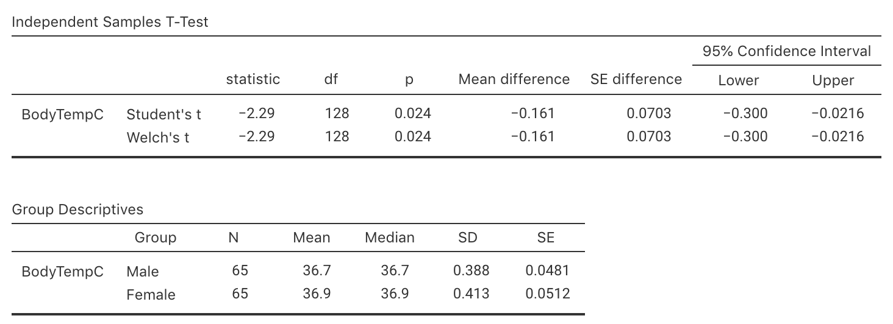

# Tests for means of two independent groups {#TestTwoMeans}


<!-- Introductions; easier to separate by format -->
```{r, child = if (knitr::is_html_output()) {'./introductions/32-Testing-TwoMeans-HTML.Rmd'} else {'./introductions/32-Testing-TwoMeans-LaTeX.Rmd'}}
```


## Introduction: reaction times {#Chap30-Intro}


<div style="float:right; width: 222x; border: 1px; padding:10px">

</div>


To study the reaction times of students while driving, two different groups of students were used: one group *used* a mobile phone, and a different group *did not use* a mobile phone.
Their reaction times were measured in a driving simulator [@data:Strayer2001:phones].
These data were seen previously in Sect. \@ref(MeansIndSamples).

The two groups of students receive different treatments: one group *used* a mobile phone while driving, and a different group *did not use* a mobile phone while driving.
This is an example of a [*between-individuals comparison*](#Comparison).
The data are not paired; instead, the means of two separate (or independent) samples are being compared.
The data would be [paired](#TestPairedMeans) if *each* student was measured twice: once using a phone, and once without using a phone.


Consider the RQ:

> For students, is the mean reaction time while driving the same for students who *are using* a mobile phone and students who *are not using* a mobile phone?


`r if (knitr::is_latex_output()) {
   'Part of the data are shown in Table \\@ref(tab:PhoneDataTableTest).'
} else {
   'The data are shown below.'
}`


```{r}
RT <- read.csv("./Data/ReactionTimePhoneInd.csv")
```
```{r PhoneDataTableTest}
RT.DataTable   <- cbind( RT$Reaction[RT$Group == "Phone"],
                         RT$Reaction[RT$Group == "Control"] )
RT.DataTable10 <- cbind( head(RT$Reaction[RT$Group == "Phone"], 10), 
                         head(RT$Reaction[RT$Group == "Control"], 10) ) 

if( knitr::is_latex_output() ) {
  tb1 <- cbind( RT$Reaction[RT$Group == "Phone"][1:4],
                RT$Reaction[RT$Group == "Phone"][5:8],
                RT$Reaction[RT$Group == "Phone"][9:12],
                RT$Reaction[RT$Group == "Phone"][13:16],
                RT$Reaction[RT$Group == "Phone"][17:20],
                RT$Reaction[RT$Group == "Phone"][21:24],
                RT$Reaction[RT$Group == "Phone"][25:28],
                RT$Reaction[RT$Group == "Phone"][29:32])
  T1 <- knitr::kable( tb1,
                      format = "latex",
                      #col.names = c("Using phone",
                      #              "Not using phone"),
                      valign = 't',
                      align = c("c", "c"),
                      #table.env = "@empty",
                      linesep = "",
                      row.names = FALSE,
                      escape = FALSE,
                      booktabs = TRUE) %>%
    row_spec(0, bold = TRUE) %>%
    add_header_above( c("Using phone" = 8),
                      bold = TRUE)

  tb2 <- cbind( RT$Reaction[RT$Group == "Control"][1:4],
                RT$Reaction[RT$Group == "Control"][5:8], 
                RT$Reaction[RT$Group == "Control"][9:12], 
                RT$Reaction[RT$Group == "Control"][13:16], 
                RT$Reaction[RT$Group == "Control"][17:20], 
                RT$Reaction[RT$Group == "Control"][21:24], 
                RT$Reaction[RT$Group == "Control"][25:28], 
                RT$Reaction[RT$Group == "Control"][29:32])
  T2 <- knitr::kable( tb2,
                      format = "latex",
                      #col.names = c("Using phone",
                      #              "Not using phone"),
                      align = c("c", "c"),
                      valign = 't',
                      #table.env = "@empty",
                      linesep = "",
                      row.names = FALSE,
                      escape = FALSE,
                      booktabs = TRUE) %>%
    row_spec(0, bold = TRUE) %>%
    add_header_above( c("Not using phone" = 8),
                      bold = TRUE)
  
  out <- knitr::kables(list(T1, T2),
                       format = "latex",
                       label = "PhoneDataTableTest",
                       caption = "Reaction times (in milliseconds) for students using, and not using, mobile phones") %>% 
    kable_styling(font_size = 10)
  out2 <- prepareSideBySideTable(out)
  out2
}
if( knitr::is_html_output() ) {
  DT::datatable( RT.DataTable,
                 colnames = c("Using phone", 
                              "Not using phone"),
         caption = "Reaction times (in milliseconds) for students using, and not using, mobile phones; 32 students are in each group",
         fillContainer = FALSE, # Make more room, so we don't just have ten values
                 #filter="top", 
                 #selection="multiple", 
                 #escape=FALSE,
                 options = list(searching = FALSE) # Remove searching: See: https://stackoverflow.com/questions/35624413/remove-search-option-but-leave-search-columns-option
  )
}
```


## Hypotheses and notation

Since two groups are being compared, using subscripts to distinguish between the statistics for the two groups (in general, Group A and Group B) is important (recapping Sect. \@ref(TwoMeansNotationCI)); see Table \@ref(tab:IndSampleNotationHT).
Using this notation, the *parameter* in the RQ is the difference between population means: $\mu_A - \mu_B$.
As usual, the population values are unknown, so this is estimated using the statistic $\bar{x}_A - \bar{x}_B$.


```{r IndSampleNotationHT}
Diff2Notation <- array(dim=c(5, 2))
colnames(Diff2Notation) <- c("Group A", 
                             "Group B")
rownames(Diff2Notation) <- c("Population means:",
                             "Sample means:",
			     "Standard deviations:",
			     "Standard errors:",
			     "Sample sizes:")

if( knitr::is_latex_output() ) {
  Diff2Notation[1, ] <- c(	"$\\mu_A$", 	
                           "$\\mu_B$")
  Diff2Notation[2, ] <- c(	"$\\bar{x}_A$",		
                           "$\\bar{x}_B$")
  Diff2Notation[3, ] <- c(	"$s_A$", 			
                           "$s_B$")
  Diff2Notation[4, ] <- c(	"$\\displaystyle\\text{s.e.}(\\bar{x}_A) = \\frac{s_A}{\\sqrt{n_A}}$",
  							            "$\\displaystyle\\text{s.e.}(\\bar{x}_B) = \\frac{s_B}{\\sqrt{n_B}}$")
  Diff2Notation[5, ] <- c(	"$n_A$",
  							            "$n_B$")

  kable( Diff2Notation,
         format = "latex",
         booktabs = TRUE,
         align = c("c", "c"),
         longtable = FALSE,
         escape = FALSE,
         col.names = colnames(Diff2Notation),
         caption = "Notation used to distinguish between the two independent groups") %>%
    row_spec(0, bold = TRUE) %>%
    kable_styling(font_size = 10)
}
if( knitr::is_html_output() ) {

  Diff2Notation[1, ] <- c(	"$\\mu_A$", 	
                           "$\\mu_B$")
  Diff2Notation[2, ] <- c(	"$\\bar{x}_A$",		
                           "$\\bar{x}_B$")
  Diff2Notation[3, ] <- c(	"$s_A$", 			
                           "$s_B$")
  Diff2Notation[4, ] <- c(	"$\\displaystyle\\text{s.e.}(\\bar{x}_A) = \\frac{s_A}{\\sqrt{n_A}}$",
  							            "$\\displaystyle\\text{s.e.}(\\bar{x}_B) = \\frac{s_B}{\\sqrt{n_B}}$")
  Diff2Notation[5, ] <- c(	"$n_A$",
  							            "$n_B$")

  kable( Diff2Notation,
                format = "html",
                booktabs = TRUE,
                longtable = FALSE,
                align = c("c", "c"),
                col.names = colnames(Diff2Notation),
               caption = "Notation used to distinguish between the two independent groups") %>%
    row_spec(0, bold = TRUE) 
}
```

For these data, the differences are computed as the mean reaction time for phone users ($P$), *minus* the mean reaction time for non-phone users ($C$; the control group): $\mu_P - \mu_C$.
By this definition, the differences refer to how much greater (on average) the reaction times are when students are using phones.
The parameter is $\mu_P - \mu_C$, the difference between the population mean reaction times (using phone, minus *not* using a phone).


::: {.importantBox .important data-latex="{iconmonstr-warning-8-240.png}"}
Here the difference is computed as the mean reaction time for phone users,  *minus* the mean reaction time for non-phone users.
Computing the difference as the mean reaction time for non-phone users, *minus* the mean reaction time for phone users is also correct.
You need to be clear about how the difference is computed, and be consistent throughout.
:::


As always (Sect. \@ref(AboutHypotheses)), the null hypothesis is the default 'no difference, no change, no relationship' position; any difference is due to sampling variation.
Hence, the null hypothesis is that there is 'no difference' between the population means of the two groups:

* $H_0$: $\mu_P - \mu_C = 0$ (or $\mu_P = \mu_C$).

This hypothesis proposes that any difference between the *sample* means is due to *sampling variation*, and is the initial *assumption*.
From the RQ, the alternative hypothesis will be *two*-tailed:

* $H_1$: $\mu_P - \mu_C\ne 0$ (or $\mu_P \ne \mu_C$).

This hypothesis proposes that any difference between the *sample* means is because a difference really exists between the *population means*. 


## Describing the sampling distribution {#sampling-distribution-expectation-twosampleHT}

The data for testing the hypothesis are shown 
`r if( knitr::is_latex_output() ) {
  'in Table \\@ref(tab:PhoneDataTableTest).'
} else {
  'below.'
}`
The numerical summary (Sect. \@ref(MeansIndSamples)) *must* summarise the difference between the means (since the RQ is about the difference), and should summarise each group.

All this information is found using software (jamovi: Fig. \@ref(fig:ReactionPhoneSummaryTestjamovi); SPSS: Fig. \@ref(fig:ReactionPhoneSummaryTestSPSS)), and can be compiled into a table (Table \@ref(tab:PhoneNumericalTest)).
The appropriate summary for graphically summarising the *data* is a boxplot (though a dot chart is also acceptable).
An error bar chart (Fig. \@ref(fig:PhoneErrorbar)), which compares the *sample means*, should also be produced.


```{r ReactionPhoneSummaryTestjamovi, fig.cap="jamovi output for the phone reaction time data", fig.align="center", out.width="90%"}
knitr::include_graphics("jamovi/ReactionPhone/ReactionPhone-Test-All.png")
```


```{r ReactionPhoneSummaryTestSPSS, fig.cap="SPSS output for the phone reaction time data", fig.align="center", out.width="85%"}
knitr::include_graphics("SPSS/ReactionPhone/ReactionPhone-Test.png")
```


The difference between the sample means is 51.59&nbsp;ms... but this value will vary from sample to sample; that is, there is *sampling variation*.
The sampling variation (*expectation*) for the values of $\bar{x}_A - \bar{x}_B$ can be described as having:

* an approximate normal distribution;
* centred around a sampling mean denoted by $\mu_{\bar{x}_P - \bar{x}_C}$, whose value is ${\mu_{P}} - {\mu_{C}} = 0$, the difference between the means (from $H_0$);
* with a standard deviation of $\displaystyle\text{s.e.}(\bar{x}_P - \bar{x}_C)$, called the *standard error for the difference between the means*.


::: {.softwareBox .software data-latex="{iconmonstr-laptop-4-240.png}"}
jamovi and SPSS give results from *two* similar hypothesis tests.
In this book, we will always use the second row of information: the "Welch's $t$" row in jamovi, and the "Equal variance not assumed" row in SPSS (these two are equivalent).
\smallskip

In both cases, this row of information *does not* assume that the population standard deviation are equal.
The top row of information *does* assume the population standard deviation are equal.
In most cases, the information in both rows are similar anyway.
:::


```{r PhoneNumericalTest}
Phone.DataSummary <- array(NA, 
                           dim = c(3, 4) )

Phone.DataSummary[1:2, 1] <- aggregate( Reaction ~ Group, 
                                        data = RT, 
					                              FUN = "mean")[, 2]
Phone.DataSummary[1:2, 2] <- aggregate( Reaction ~ Group, 
                                        data = RT, 
					                              FUN = "length")[, 2] 
Phone.DataSummary[1:2, 3] <- aggregate( Reaction ~ Group, 
                                        data = RT, 
					                              FUN = "sd")[, 2]
Phone.DataSummary[1:2, 4] <- aggregate( Reaction ~ Group, 
                                        data = RT, 
					FUN = function(x){ sd(x) / sqrt(length(x))})[, 2] 

Phone.DataSummary[3, 1] <- Phone.DataSummary[1, 1] - Phone.DataSummary[2, 1]
Phone.DataSummary[3, 4] <- sqrt( Phone.DataSummary[1, 3]^2/Phone.DataSummary[1, 2] +
                                 Phone.DataSummary[2, 3]^2/Phone.DataSummary[2, 2]  )

Phone.DataSummary[, 1] <- round( Phone.DataSummary[, 1], 
                                  2)
Phone.DataSummary[, 2] <- round( Phone.DataSummary[, 2], 
                                  0)
Phone.DataSummary[, 3] <- round( Phone.DataSummary[, 3], 
                                  2)
Phone.DataSummary[, 4] <- round( Phone.DataSummary[, 4], 
                                  3)

Phone.DataSummary[3, 2] <- ""
Phone.DataSummary[3, 3] <- ""

rownames(Phone.DataSummary) <- c("Using phone", 
                                 "Not using phone", 
                                 "All students")

if( knitr::is_latex_output() ) {
  kable(Phone.DataSummary,
        format = "latex",
        booktabs = TRUE,
        longtable = FALSE,
        align = "r",
        col.names = c("Mean", 
                      "Sample size", 
                      "Standard deviation", 
                      "Standard error"),
        caption = "Numerical summaries of the reaction-time data (in milliseconds)") %>%
   row_spec(0, bold = TRUE) %>%
   kable_styling(font_size = 10) 
}
if( knitr::is_html_output() ) {
  kable(Phone.DataSummary,
        format = "html",
        booktabs = TRUE,
        longtable = FALSE,
        align = "r",
        col.names = c("Mean", 
                      "Sample size", 
                      "Standard deviation", 
                      "Standard error"),
        caption = "Numerical summaries of the reaction-time data (in milliseconds)")  
}
```


## Computing the test statistic

The observed difference between sample means (*observations*), relative to what was expected, is found by computing the test statistic; in this case, a $t$-score.
The software output (jamovi: Fig. \@ref(fig:ReactionPhoneSummaryTestjamovi); SPSS: Fig. \@ref(fig:ReactionPhoneSummaryTestSPSS)) can be used, but the $t$-score can also be computed manually:

\begin{align*}
   t
  &= 
   \frac{\text{sample statistic} - \text{assumed population parameter, from $H_0$}}
        {\text{standard error for sample statistic}}\\
   &= 
   \frac{ (\bar{x}_P - \bar{x}_C) - (\mu_P - \mu_C)}
        {\text{s.e.}(\bar{x}_P - \bar{x}_C)}\\
  &= \frac{51.594 - 0}{19.612} = 2.631,
\end{align*}
as in the software output.


## Determining $P$-values

A $P$-value determines if the sample statistic is consistent with the assumption.
Since the $t$-score is large, the $P$-value will be small using the [68--95--99.7 rule](#def:EmpiricalRule).

This is confirmed by the software (jamovi: Fig. \@ref(fig:ReactionPhoneSummaryTestjamovi); SPSS: Fig. \@ref(fig:ReactionPhoneSummaryTestSPSS)): the two-tailed $P$-value is $0.011$.
The small $P$-value suggests the observations are *inconsistent* with the assumption (Table \@ref(tab:PvaluesInterpretation)), and the difference between the sample means could be reasonably explained by sampling variation.


`r if (knitr::is_latex_output()) '<!--'`
::: {.thinkBox .think data-latex="{iconmonstr-light-bulb-2-240.png}"}
`r if (knitr::is_html_output()){
  'Click on the pins in the following image, and describe what the jamovi output tells us.' 
}`

<iframe src="https://learningapps.org/watch?v=pd365s6bj22" style="border:0px;width:100%;height:500px" allowfullscreen="true" webkitallowfullscreen="true" mozallowfullscreen="true"></iframe>
:::
`r if (knitr::is_latex_output()) '-->'`


## Writing conclusions

In conclusion, write:

> Moderate evidence exists in the sample (two independent samples $t = 2.631$; two-tailed $P = 0.011$) that the population mean reaction time is different for students using a mobile phone (mean: 585.19 ms; $n = 32$) and students *not* using a mobile phone (mean: 533.59ms; $n = 32$; 95% CI for the difference: $12.4$ to $90.9$ms longer for phone users).

Again, the conclusions contains an *answer to the RQ*, the *evidence* leading to this conclusion ($t = 2.631$; two-tailed $P = 0.011$), and some *sample summary statistics*, including a CI.


## Statistical validity conditions {#Validity-Test-DiffMeans}

As usual, these results apply [under certain conditions](#exm:StatisticalValidityAnalogy), which are the same as those for forming a CI for the *difference* between two means.
The test above is statistically valid if *one* of these conditions is true:

1. *Both* sample sizes are at least 25; *or*
1. Either sample size is smaller than 25, *and* both *populations* have an approximate normal distribution.
  
The sample size of 25 is a rough figure here, and some books give other values (such as 30).
This condition ensures that the *distribution of the difference between sample means has an approximate normal distribution* (so that, for example, the [68--95--99.7 rule](#def:EmpiricalRule) can be used).
We can explore the histograms of the *samples* to determine if normality of the *populations* seems reasonable.


::: {.example #StatisticalValidityReactionHT name="Statistical validity"}
For the reaction-time data, both samples sizes are $n = 32$, so the results will be statistically valid.
The data in each group do not need be normally distributed, since both sample sizes are larger than 25.
:::


<!-- One example using data; one just based on summary data -->

## Example: speed signage {#SpeedSignageHT}


<div style="float:right; width: 222x; border: 1px; padding:10px">

</div>


In an attempt to reduce vehicle speeds on freeway exit ramps, a Chinese study added signage [@ma2019impacts].
At one site studied (Ningxuan Freeway), speeds were recorded for 38 vehicles before the extra signage was added, and then for 41 vehicles after the extra signage was added
`r if (knitr::is_latex_output()) {
   '(Table \\@ref(tab:SignageHT)).'
} else {
   '(data below).'
}`


```{r}
Speed <- read.csv("./Data/Speed.csv")

Speed$When <- factor(Speed$When,
                     levels = c("Before", "After"),
                     ordered = TRUE)
Speed2 <- data.frame( Before = Speed$Speed[ Speed$When == "Before" ][1:10],
                      After = Speed$Speed[ Speed$When == "After" ][1:10])
```

```{r}
if( knitr::is_latex_output() ) {
  tb1 <- cbind( Speed$Speed[Speed$When == "Before"][1:6],
                Speed$Speed[Speed$When == "Before"][7:12],
                Speed$Speed[Speed$When == "Before"][13:18],
                Speed$Speed[Speed$When == "Before"][19:24],
                Speed$Speed[Speed$When == "Before"][25:30],
                Speed$Speed[Speed$When == "Before"][31:36],
                c(Speed$Speed[Speed$When == "Before"][37:38], NA, NA, NA, NA) )
  T1 <- knitr::kable( tb1,
                      format = "latex",
                      valign = 't',
                      align = c("c", "c"),
                      linesep = "",
                      row.names = FALSE,
                      escape = FALSE,
                      booktabs = TRUE) %>%
    row_spec(0, bold = TRUE) %>%
    add_header_above( c("Speeds before signage added" = 7),
                      bold = TRUE)

  tb2 <- cbind( Speed$Speed[Speed$When == "After"][1:6],
                Speed$Speed[Speed$When == "After"][7:12], 
                Speed$Speed[Speed$When == "After"][13:18], 
                Speed$Speed[Speed$When == "After"][19:24], 
                Speed$Speed[Speed$When == "After"][25:30], 
                Speed$Speed[Speed$When == "After"][31:36], 
                c(Speed$Speed[Speed$When == "After"][37:41], NA) ) 
  T2 <- knitr::kable( tb2,
                      format = "latex",
                      align = c("c", "c"),
                      valign = 't',
                      linesep = "",
                      row.names = FALSE,
                      escape = FALSE,
                      booktabs = TRUE) %>%
    row_spec(0, bold = TRUE) %>%
    add_header_above( c("Speeds after signage added" = 7),
                      bold = TRUE)
  
  out <- knitr::kables(list(T1, T2),
                       format = "latex",
                       label = "SignageHT",
                       caption = "Vehicle speeds before and after adding extra signage") %>%
    kable_styling(font_size = 10)
  out2 <- prepareSideBySideTable(out, gap = "\\enskip")
  out2
}

if( knitr::is_html_output() ) {
  
   DT::datatable( Speed,
                 fillContainer = FALSE, # Make more room, so we don't just have ten values
                 colnames = c("When measured", "Speed (km/h)"),
                 options = list(searching = FALSE), # Remove searching: See: https://stackoverflow.com/questions/35624413/remove-search-option-but-leave-search-columns-option
                 caption = "The observations from the signage data")
}
```

The researchers are hoping the addition of extra signage will *reduce* the mean speed of the vehicles.
The RQ is:

> At this freeway exit, does the mean vehicle speed *reduce* after extra signage is added?

The data are *not* paired: different vehicles are measured before and after the extra signage is added.
The data are summarised in Table \@ref(tab:SignageSummaryHT).


```{r SignageSummaryHT}
SignageSummary <- array(dim = c(3, 4))
rownames(SignageSummary) <- c("Before", 
                            "After",
                            "Speed reduction")
colnames(SignageSummary) <- c("Mean",
                              "Std deviation",
                            "Std error",
                            "Sample size")

Speed.n <- tapply(Speed$Speed, 
                  list(Speed$When), 
                  "length") 
Speed.sd <- tapply(Speed$Speed, 
                   list(Speed$When), 
                   "sd") 

SignageSummary[1:2, 1] <- round( tapply(Speed$Speed, 
                                        list(Speed$When), 
                                        "mean"),
                                 2)
SignageSummary[1:2, 2] <- round( Speed.sd, 2)
SignageSummary[1:2, 3] <- round( Speed.sd / sqrt(Speed.n), 3)
SignageSummary[1:2, 4] <- Speed.n 

SignageSummary[3, 1] <- SignageSummary[1, 1] -  
                        SignageSummary[2, 1] 

sdB <- round( SignageSummary[1, 3], 2)
sdA <- round( SignageSummary[2, 3], 2)
SignageSummary[3, 3] <- round( sqrt( sdB^2/Speed.n[1] + 
                                     sdA^2/Speed.n[2] ), 
                               3)

SignageSummary[3, 4] <- NA 
SignageSummary[3, 2] <- NA
                          


if( knitr::is_latex_output() ) {
  kable(SignageSummary,
        format = "latex",
        longtable = FALSE,
        booktabs = TRUE,
        align = c("r", "r", "r", "r"),
        col.names = c("Mean", 
                      "Std deviation",
                      "Std error",
                      "Sample size"),
        caption = "The signage data summary (in km/h)"
  ) %>%
  row_spec(0, bold = TRUE) %>%
  kable_styling(font_size = 10)
}
if( knitr::is_html_output() ) {
  kable(SignageSummary,
               format = "html",
               longtable = FALSE,
               booktabs = TRUE,
               align = c("r", "r", "r", "r"),
               col.names = c("Mean", 
                            "Std deviation", 
                            "Std error",
                            "Sample size"),
    caption = "The signage data summary (in km/h)") %>%
  kable_styling(full_width = FALSE)
}
```

::: {.tipBox .tip data-latex="{iconmonstr-info-6-240.png}"}
You cannot *easily* calculate the standard error of the difference (i.e., $\text{s.e.}(\bar{x}_{\text{Before}} - \bar{x}_{\text{After}})$) from the other information.
You are not expected to do so; the *standard error must given* (e.g., from software output).
:::


A graphical summary of the data is a boxplot (Fig. \@ref(fig:SignageErrorBar), left panel); an error bar chart compares the means, with a CI for each group (Fig. \@ref(fig:SignageErrorBar), right panel).

The parameter is $\mu_{\text{Before}} - \mu_{\text{After}}$, the *reduction* in the populations mean speed after signage is added.
The hypotheses are:

* $H_0$: $\mu_{\text{Before}} - \mu_{\text{After}} = 0$: There is no change in the population mean speeds.
* $H_1$: $\mu_{\text{Before}} - \mu_{\text{After}} > 0$: The population mean speed has *reduced*.

The best estimate of the difference in *population* means is the difference between the *sample* means: $(\bar{x}_{\text{Before}} - \bar{x}_{\text{After}}) = 5.68$.
The table gives the standard error for estimating this *difference* as $\text{s.e.}(\bar{x}_{\text{Before}} - \bar{x}_{\text{After}}) = 0.472$.
Using the summary information in Table \@ref(tab:SignageSummaryHT), the $t$-score (using Equation \@ref(eq:tscore)) is:

\[
  t
  = \frac{(\bar{x}_B - \bar{x}_A) - (\mu_B - \mu_A)}{\text{s.e.}(\bar{x}_B - \bar{x}_{A})}
  = \frac{5.68 - 0}{2.96} = 1.92.
\]
(Recall that $\mu_{\text{Before}} - \mu_{\text{After}} = 0$ from the null hypothesis.)

Remembering that the alternative hypothesis is *one-tailed*, the $P$-value (using the [68--95--99.7 rule](#def:EmpiricalRule)) is larger than $0.025$, but smaller than $0.32$... so making a clear decision is difficult without using software.
However, since the $t$-score is *just* less than 2, we suspect that the $P$-value is likely to be closer to $0.025$ than $0.32$.

From software, $P = 0.02968$ (you cannot be this precise just using the 68--95--99.7 rule).
Using Table \@ref(tab:PvaluesInterpretation), this $P$-value only provides moderate evidence of a reduction in mean speeds.
We conclude:

> Moderate evidence exists in the sample ($t = 1.92$; one-tailed $P = 0.030$) that mean speeds have reduced after the addition of extra signage (Before: mean speed: $98.02$ km/h; $n = 38$; standard deviation: $13.18$ km/h; After:  mean speed: $92.34$ km/h; $n = 41$; standard deviation: $13.13$ km/h; 95% CI for the difference: -0.24 to 11.6 km/h).

Whether the mean speed reduction of 5.68 has [*practical importance*](#PracticalSignificance) is a different issue.
Using the [validity conditions](#ValidityTwoMeans), the CI is statistically valid.

::: {.tipBox .tip data-latex="{iconmonstr-info-6-240.png}"}
Remember: *which* mean is larger must be clear!
:::


## Example: health promotion services {#BHADP-Test}


<div style="float:right; width: 222x; border: 1px; padding:10px">

</div>


A study [@data:Becker1991:BHADP] compared access to health promotion (HP) services for people with and without a disability.
(This study was seen in  Sect. \@ref(BHADP).)
Access was measured using the
`r if (knitr::is_latex_output()) {
   '\\textit{Barriers to Health Promoting Activities for Disabled Persons}'
} else {
   '*Barriers to Health Promoting Activities for Disabled Persons* 
[BHADP scale](http://www.utexas.edu/nursing/chpr/resources/bhadp.html)'
}`,
where *higher* scores mean *greater* barriers.
The RQ is:

> Is the mean BHADP score the same for people with and without a disability?

The parameter is $\mu_D - \mu_N$, the difference between the population mean BHADP score (people with disabilities, minus people without disabilities).

In this case, only numerical summary data are available (Table \@ref(tab:BHADPSummaryTest)), not the original data.
(An appropriate graphical summary, an error bar chart, can be constructed from the summary information (Fig. \@ref(fig:BHADPErrorBar)), though a boxplot cannot be constructed from the information.)
Denoting those with and without a disability with subscripts $D$ and $N$ respectively, the hypotheses are:

* $H_0$: $\mu_D - \mu_N = 0$: There *is no* difference in the population mean BHADP scores.
* $H_1$: $\mu_D - \mu_N \ne 0$: There *is a* difference in the population mean BHADP scores.

        
```{r BHADPSummaryTest}
BHADPSummary <- array(dim = c(3, 4))
rownames(BHADPSummary) <- c("Disability", 
                            "No disability",
                            "Difference")

BHADPSummary[1, ] <- c(31.83, 
                       7.73, 
                       132, 
                       0.6728)
BHADPSummary[2, ] <- c(25.07, 
                       4.80, 
                       137, 
                       0.4101)
BHADPSummary[3, ] <- c(6.76, 
                       "", 
                       "", 
                       0.80285)

if( knitr::is_latex_output() ) {
  kable(BHADPSummary,
        format = "latex",
        longtable = FALSE,
        booktabs = TRUE,
        align = c("r", "r", "r", "l"),
        col.names = c("Sample mean", 
                      "Std deviation", 
                      "Sample size", 
                      "Std error"),
        caption = "The BHADP data summary"
  ) %>%
  row_spec(0, bold = TRUE) %>%
  kable_styling(font_size = 10)
}
if( knitr::is_html_output() ) {
  kable(BHADPSummary,
               format = "html",
               longtable = FALSE,
               booktabs = TRUE,
               align = c("r", "r", "r", "l"),
               col.names = c("Sample mean", 
                             "Std deviation", 
                             "Sample size", 
                             "Std error"),
               caption = "The BHADP data summary") %>%
    kable_styling(full_width = FALSE)
}
```

The best estimate of the difference between the *population* means is the difference between the *sample* means: $(\bar{x}_D - \bar{x}_{ND}) = 6.76$.
The table also gives the standard error for estimating this *difference* as $\text{s.e.}(\bar{x}_D - \bar{x}_{ND}) = 0.80285$ (*given* in the article), since the difference will vary for all possible samples.


::: {.tipBox .tip data-latex="{iconmonstr-info-6-240.png}"}
The *standard error is given*; you **cannot** easily calculate this from the given information.
You are not expected to do so.
:::


Using the summary information in Table \@ref(tab:BHADPSummaryTest), the $t$-score is computed using  Equation \@ref(eq:tscore):

\[
  t 
  = \frac{(\bar{x}_D - \bar{x}_{ND}) - (\mu_D - \mu_{ND})}{\text{s.e.}(\bar{x}_D - \bar{x}_{ND})}
  = \frac{6.76 - 0}{0.80285} = 8.42.
\]
(Recall that $\mu_D - \mu_N = 0$ from the null hypothesis.)
Using the [68--95--99.7 rule](#def:EmpiricalRule), this *very* large $t$-score implies the $P$-value will be *very* small.
We conclude:

> Strong evidence exists in the sample ($t = 8.42$; two-tailed $P < 0.001$) that people with a disability (mean: 31.83; $n = 132$; standard deviation: $7.73$) and people without a disability (mean: 25.07; $n = 137$; standard deviation: $4.80$) have different population mean access to health promotion services (95% CI for the difference: 5.17 to 8.35), as measured by BHADP scores.


## Summary {#Chap30-Summary}

To test a hypothesis about a difference between two population means $\mu_1 - \mu_2$, based on the value of the difference between two sample mean $\bar{x}_1 - \bar{x}_2$, *assume* the value of $\mu_1 - \mu_2$ in the null hypothesis to be true (usually zero).
Then, the difference between the sample means varies from sample to sample and, under certain statistical validity conditions, varies with an approximate normal distribution centred around the hypothesised value of $\mu_1 - \mu_2$, with a standard deviation of $\text{s.e.}(\bar{x}_1 - \bar{x}_2)$.
This distribution describes what values of the sample mean could be *expected* in the sample if the value of $\mu$ in the null hypothesis was true.
The *test statistic* is

\[
   t = \frac{ (\bar{x}_1 - \bar{x}_2) - (\mu_1 - \mu_2)}{\text{s.e.}(\bar{x}_1 - \bar{x}_2)},
\]
where $\mu_{\bar{x}_1 - \bar{x}_2} = \mu_1 - \mu_2$ is the hypothesised value given in the null hypothesis.
This describes the *observations*.
The $t$-value is like a $z$-score, and so an approximate *$P$-value* is estimated using the [68--95--99.7 rule](#def:EmpiricalRule) or normal-distribution tables, which is how we weigh the evidence to determine if it is *consistent* with the assumption.


`r if (knitr::is_html_output()){
  'The following short video may help explain some of these concepts:'
}`


<div style="text-align:center;">
```{r}
htmltools::tags$video(src = "./videos/TwoMeans.mp4", 
                      width = "550", 
                      controls = "controls", 
                      loop = "loop", 
                      style = "padding:5px; border: 2px solid gray;")
```
</div>


## Quick review questions {#Chap30-QuickReview}

::: {.webex-check .webex-box}
A study [@lee2016effect] compared using a vegan ($n = 46$) and a conventional ($n = 47$) diet for 12 weeks, for a group of Koreans with Type II diabetes.
A summary of the data for iron levels are shown in Table \@ref(tab:VeganDiet).


```{r VeganDiet}
VeganDiet <- array( dim = c(3, 3))

rownames(VeganDiet) <- c("Vegan diet",
                         "Conventional diet", 
                         "Difference")
colnames(VeganDiet) <- c("Mean", 
                         "Standard deviation", 
                         "n")

VeganDiet[1, ] <- c("13.9", "2.3", "46")
VeganDiet[2, ] <- c("15.0", "2.7", "47")
VeganDiet[3, ] <- c("1.1", "", "")


if( knitr::is_latex_output() ) {
  kable(VeganDiet,
        format = "latex",
        longtable = FALSE,
        booktabs = TRUE,
        caption = "Comparing the iron levels (mg) for subjects using a vegan or conventional diet for 12 weeks") %>%
   kable_styling(font_size = 10) %>%
   row_spec(0, bold = TRUE) %>%
   row_spec(3, italic = TRUE)
}

if( knitr::is_html_output() ) {
  kable(VeganDiet,
        format = "html",
        longtable = FALSE,
        booktabs = TRUE,
        caption = "Comparing the iron levels (mg) for subjects using a vegan or conventional diet for 12 weeks")
}
```

1. The sample size is missing from the 'Difference' row. \tightlist
   What should the sample size in this row be?
`r if( knitr::is_html_output() ) {longmcq( c(
  "46 + 47 = 93",
  "46 - 47 = -1",
  "47 - 46 = 1",
  answer = "A sample size makes no sense",
  "There is not enough information"
)  )}`

1. What is the *standard deviation* for the difference?
`r if( knitr::is_html_output() ) {mcq( c(
  "0.3391",
  "0.3928",
  answer = "A standard deviation makes no sense",
  "There is not enough information"
)  )}`

1. What is the *standard error* for the difference?
`r if( knitr::is_html_output() ) {mcq( c(
  "0.3391",
  "0.3928",
  "A standard error makes no sense",
  answer = "There is not enough information"
)  )}`

1. The two-tailed $P$-value for the comparison is given as $P = 0.046$.
   What does this mean?
`r if( knitr::is_html_output() ) {longmcq( c(
  "There is no evidence that the sample means are different",
  "There is some evidence that the sample means are different",
  "There is no evidence that the population means are different",
  answer = "There is some evidence that the population means are different",
  "There is not enough information"
)  )}`
:::


## Exercises {#TestTwoMeansExercises}

Selected answers are available in Sect. \@ref(TestTwoMeansAnswer).


::: {.exercise #TwoSampleHTWhalesHT}
(These data were also seen in Exercise \@ref(exr:MeansIndSamplesExercisesWhalesCI).)
A study of gray whales (*Eschrichtius robustus*) measured (among other things) the length of adult whales [@agbayani2020growth].
Are adult female gray whales longer than males, on average, in the population?
Summary information is shown in Table \@ref(tab:WhaleInfoHT).
In addition, the standard error of this difference is $\text{s.e.}(\bar{x}_F - \bar{x}_M) = 0.07079$.


```{r WhaleInfoHT}
WhaleInfo <- array( dim = c(2, 3))
colnames(WhaleInfo) <- c("Mean",
                         "Std deviation",
                         "Sample size")
rownames(WhaleInfo) <- c("Female",
                                      "Male")

WhaleInfo[1, ] <- c("4.66", 
                    0.379, 
                    26)
WhaleInfo[2, ] <- c("4.60", 
                    0.305,
                    30)

if( knitr::is_latex_output() ) {
  kable( WhaleInfo,
         format = "latex",
         longtable = FALSE,
         booktabs = TRUE,
         align = c("c", "c", "c"),
         col.names = colnames(WhaleInfo),
         caption = "Numerical summary of length of whales at birth (in m)") %>%
    row_spec(0, 
             bold = TRUE) %>%
    kable_styling(font_size = 10)
    
}
if( knitr::is_html_output() ) {
  out <- kable( WhaleInfo,
                format = "html",
                longtable = FALSE,
                booktabs = TRUE,
                align = c("c", "c", "c"),
                col.names = colnames(WhaleInfo),
                caption = "Numerical summary of length of whales at birth (in m)") %>%
    kable_styling(full_width = FALSE)
}
```

1. Define the *difference*.
1. Write the hypotheses to answer the RQ.
1. Compute the $t$-score, and approximate the $P$-value using the 68--95--99.7 rule.
1. Write a conclusion.
1. Is the test likely to be statistically valid?
:::


::: {.exercise #TestTwoMeansNHANES}
Earlier, the NHANES study (Sect.&nbsp;\@ref(NHANESGraphs); Exercise \@ref(exr:MeansIndSamplesExercisesNHANES)) was used to answer this RQ:

> Among Americans, is the mean direct HDL cholesterol different for current smokers and non-smokers?

Use the SPSS output in Fig. \@ref(fig:NHANESTest) to perform a hypothesis test to answer the RQ.
:::

   
```{r NHANESTest, fig.cap="SPSS output for the NHANES data", fig.align="center", out.width="85%"}
knitr::include_graphics("SPSS/NHANES/NHANES-TOutput.png")
```

::: {.exercise #TestTwoMeansFitnessOfParamedics}
A study of male paramedics in Western Australia compared conventional paramedics with special operations paramedics [@data:chapman2007:MaleParamedics].
Some information comparing their physical profiles is shown in Table \@ref(tab:ParamedicsTest).

1. Compute the missing standard errors.
1. Consider comparing the mean grip strength for the two groups of paramedics. 
   The *standard error for the difference between the means* is 3.3044. 
   a. Carefully write down the hypotheses.
   b. Compute the $t$-score for testing if a difference exists between the two types of paramedics.
   c. Approximate the $P$-value using the  [68--95--99.7 rule](#def:EmpiricalRule).
   d. Discuss the conditions required for statistical validity in this context.
   e. Make a conclusion.
1. Consider comparing the mean number of push-ups completed in one minute. 
   The *standard error for the difference between the means* is 4.0689. 
   a. Carefully write down the hypotheses.
   b. Compute the $t$-score for testing if a difference exists between the two types of paramedics.
   c. Approximate the $P$-value using the  [68--95--99.7 rule](#def:EmpiricalRule).
   d. Discuss the conditions required for statistical validity in this context.
   e. Make a conclusion.
:::


```{r ParamedicsTest}
ParaSummary <- array(dim = c(6, 2))
rownames(ParaSummary) <- c("Mean", 
                            "Std deviation",
                            "Std error",
                            "Mean", 
                            "Std deviation",
                            "Std error")
colnames(ParaSummary) <- c("Conventional", 
                            "Special Operations")
ParaSummary[1, ] <- c(51, 56)
ParaSummary[2, ] <- c(8, 9)
ParaSummary[3, ] <- c("", "")
ParaSummary[4, ] <- c(36, 47)
ParaSummary[5, ] <- c(10, 11)
ParaSummary[6, ] <- c("", "")
  

if( knitr::is_latex_output() ) {
  kable(ParaSummary,
        format = "latex",
        longtable = FALSE,
        booktabs = TRUE,
	 #linesep = c("", "", "", "\\addlinespace", "", "", "", "\\addlinespace", "", "", "", ""), # Otherwise addes a space after five lines... 
        align = c("r", "r"),
        caption = "The physical profile of conventional ($n=18$) and special operation ($n=11$) paramedics in Western Australia"
  ) %>%
    row_spec(0, bold = TRUE) %>%
  kable_styling("striped", 
                full_width = F, 
                font_size=10) %>%
  pack_rows("Grip strength (in kg)", 1, 3) %>%
  pack_rows("Push-ups (per minutes)", 4, 6)
}
if( knitr::is_html_output() ) {
  kable(ParaSummary,
        format = "html",
        longtable = FALSE,
        booktabs = TRUE,  
        align = c("r", "r"),
        caption = "The physical profile of conventional ($n=18$) and special operation ($n = 11$) paramedics in Western Australia") %>%
    kable_styling(full_width = FALSE) %>%
    pack_rows("Grip strength (in kg)", 1, 3) %>%
    pack_rows("Push-ups (per minutes)", 4, 6)
}
```


::: {.exercise #TestTwoMeansBodyTemperature}
Consider again the body temperature data from Sect. \@ref(BodyTemperature).
The researchers also recorded the gender of the patients, as they also wanted to compare the mean internal body temperatures  for males and females.

Use the jamovi output in Fig. \@ref(fig:BodyTempGenderjamovi) to perform this test and make a conclusion.
Also comment on the practical significance of your results.
:::

```{r BodyTempGenderjamovi, fig.cap="jamovi output for the body-temperature data", fig.align="center", out.width="85%"}

```


::: {.exercise #TestTwoMeansDental}
(These data were also seen in Exercise \@ref(exr:TestTwoMeansDentalCI).)
A study [@data:woodward:dental] examined the sugar consumption in industrialised (mean: 41.8 kg/person/year) and non-industrialised (mean: 24.6 kg/person/year) countries.
The jamovi output is shown in Fig. \@ref(fig:Dentaljamovi).

1. Write the hypotheses.
2. Write down and interpret the CI.
3. Write a conclusion for the hypothesis test.
:::


```{r Dentaljamovi, fig.cap="jamovi output for the sugar-consumption data", fig.align="center", out.width="85%"}
knitr::include_graphics("jamovi/Dental/WoodwardWalker1994-ttest.png")
```


```{r}
FF <- read.csv("./Data/forwardfall.csv")
```

::: {.exercise #FacePlantHT}
(This study was seen in Exercise \@ref(exr:FacePlantCI).)
A study [@data:Wojcik:ForwardFall] compared the lean-forward angle in younger and older women.
An elaborate set-up was constructed to measure this lean-forward angle, using harnesses.
Consider this RQ:

> Among healthy women, is the mean lean-forward angle *greater* for younger women compared to older women?

Use the software output (Fig. \@ref(fig:FallFowardTTestTestjamovi)) to answer these questions:

1. What is the parameter?
   Carefully describe what it means.
2. Is the test one- or two-tailed?
3. Write the statistical hypothesis.
4. Use the jamovi output to conduct the hypothesis test.
5. Write a conclusion.
:::

  
```{r FallFowardTTestTestjamovi, fig.cap="jamovi output for the face-plant data", fig.align="center", out.width="95%"}
knitr::include_graphics("jamovi/FallForward/FallForwardTTestOutput-All.png")
```


::: {.exercise #DecelerationHT}
(These data were also seen in Exercise \@ref(exr:DecelerationCI).)
In an attempt to reduce vehicle speeds on freeway exit ramps, a Chinese study tried using additional signage [@ma2019impacts].
At one site studied (Ningxuan Freeway), speeds were recorded at various points on the freeway exit for vehicles *before* the extra signage was added, and then for different vehicles *after* the extra signage was added.

From this data, the *deceleration* of each vehicle was determined (data below) as the vehicle left the 120 km/h speed zone and approached the 80 km/hr speed zone. 
Use the data, and the summary in Table \@ref(tab:SignageSummaryDecHT), to test the RQ:

> At this freeway exit, is the mean vehicle deceleration the same before extra signage is added and after extra signage is added?
:::


```{r SignageDecHT}
Decel <- read.csv("./Data/Deceleration.csv")

Decel$When <- factor(Decel$When,
                     levels = c("Before", 
                                "After"),
                     ordered = TRUE)
Decel2 <- data.frame( "Before" = head(Decel$Deceleration[Decel$When == "Before"], 
                                      n = 5),
                      "After" = head(Decel$Deceleration[Decel$When == "After"],
                                     n = 5) )
```

```{r}
if( knitr::is_latex_output() ) {
  tb1 <- cbind( Decel$Deceleration[Decel$When == "Before"][1:7],
                Decel$Deceleration[Decel$When == "Before"][8:14],
                Decel$Deceleration[Decel$When == "Before"][15:21],
                Decel$Deceleration[Decel$When == "Before"][22:28],
                Decel$Deceleration[Decel$When == "Before"][29:35],
                c(Decel$Deceleration[Decel$When == "Before"][36:38], NA, NA, NA, NA) )
  T1 <- knitr::kable( tb1,
                      format = "latex",
                      valign = 't',
                      align = "c",
                      linesep = "",
                      row.names = FALSE,
                      escape = FALSE,
                      booktabs = TRUE) %>%
    row_spec(0, bold = TRUE) %>%
    add_header_above( c("Deceleration before signage added" = 6),
                      bold = TRUE)

  tb2 <- cbind( Decel$Deceleration[Decel$When == "After"][1:7],
                Decel$Deceleration[Decel$When == "After"][8:14], 
                Decel$Deceleration[Decel$When == "After"][15:21], 
                Decel$Deceleration[Decel$When == "After"][22:28], 
                Decel$Deceleration[Decel$When == "After"][29:35], 
                c(Decel$Deceleration[Decel$When == "After"][36:41], NA) ) 
  T2 <- knitr::kable( tb2,
                      format = "latex",
                      align = "c",
                      valign = 't',
                      linesep = "",
                      row.names = FALSE,
                      escape = FALSE,
                      booktabs = TRUE) %>%
    row_spec(0, bold = TRUE) %>%
    add_header_above( c("Deceleration after signage added" = 6),
                      bold = TRUE)
  
  out <- knitr::kables(list(T1, T2),
                       format = "latex",
                       label = "SignageSummaryDecHT",
                       caption = "Vehicle decleration before and after adding extra signage") %>%
    kable_styling(font_size = 10)
  out2 <- prepareSideBySideTable(out, gap = "\\enskip")
  out2
}

if( knitr::is_html_output() ) {
   DT::datatable( Decel,
                 fillContainer = FALSE, # Make more room, so we don't just have ten values
                 colnames = c("When measured", "Deceleration (m/s-squared)"),
                 options = list(searching = FALSE), # Remove searching: See: https://stackoverflow.com/questions/35624413/remove-search-option-but-leave-search-columns-option
                 caption = "The observations from the signage data (negative values mean the vehicle has accelerated)")
}
```


```{r SignageSummaryDecHT}
SignageSummaryDec <- array(dim = c(3, 4))
rownames(SignageSummaryDec) <- c("Before", 
                            "After",
                            "Change")
colnames(SignageSummaryDec) <- c("Mean",
                              "Std deviation",
                              "Std error",
                              "Sample size")

Speed.n <- tapply(Decel$Decel, 
                  list(Decel$When), 
                  "length") 
Speed.sd <- tapply(Decel$Decel, 
                   list(Decel$When), 
                   "sd") 

SignageSummaryDec[1:2, 1] <- round( tapply(Decel$Decel, 
                                        list(Decel$When), 
                                        "mean"),
                                 4)
SignageSummaryDec[1:2, 2] <- round( Speed.sd, 4)
SignageSummaryDec[1:2, 3] <- round( Speed.sd / sqrt(Speed.n), 5)
SignageSummaryDec[1:2, 4] <- Speed.n 

SignageSummaryDec[3, 1] <- SignageSummaryDec[1, 1] -  
                           SignageSummaryDec[2, 1] 

sdB <- round( SignageSummaryDec[1, 3], 4)
sdA <- round( SignageSummaryDec[2, 3], 4)
SignageSummaryDec[3, 3] <- round( sqrt( sdB^2/Speed.n[1] + 
                                     sdA^2/Speed.n[2] ), 
                               5)

SignageSummaryDec[3, 4] <- NA 
SignageSummaryDec[3, 2] <- NA
                          


if( knitr::is_latex_output() ) {
  kable(SignageSummaryDec,
        format = "latex",
        longtable = FALSE,
        booktabs = TRUE,
        align = c("r", "r", "r", "l"),
        col.names = c("Mean", 
                      "Std deviation", 
                      "Sample size", 
                      "Std error"),
        caption = "The signage data summary (in m/s-squared)"
  ) %>%
  row_spec(0, bold = TRUE) %>%
  row_spec(3, italic = TRUE) %>%
  kable_styling(font_size = 10)
}
if( knitr::is_html_output() ) {
  out <- kable(SignageSummaryDec,
               format = "html",
               longtable = FALSE,
               booktabs = TRUE,
               align = c("r", "r", "r", "l"),
               col.names = c("Mean", 
                            "Std deviation", 
                            "Sample size", 
                            "Std error"),
    caption = "The signage data summary (in m/s-squared)") %>%
    kable_styling(full_width = FALSE)
}
```


<!-- QUICK REVIEW ANSWERS -->
`r if (knitr::is_html_output()) '<!--'`
::: {.EOCanswerBox .EOCanswer data-latex="{iconmonstr-check-mark-14-240.png}"}
**Answers to in-chapter questions:**

\textbf{\textit{Quick Revision} questions:}
**1.** A sample size makes no sense.
**2.** A standard deviation makes no sense
**3.** There is not enough information.
**4.** There is some evidence that the population means are different.
:::
`r if (knitr::is_html_output()) '-->'`

