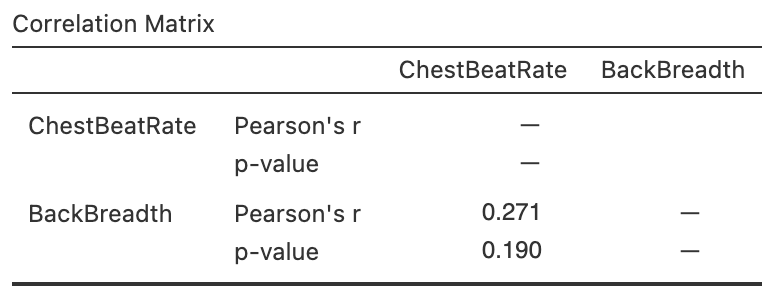

<!-- # (PART) Correlational RQs: correlation and regression {-} -->

# Correlation {#Correlation}


<!-- Introductions; easier to separate by format -->
```{r, child = if (knitr::is_html_output()) {'./introductions/33-Correlation-HTML.Rmd'} else {'./introductions/33-Correlation-LaTeX.Rmd'}}
```


<!-- Define colours as appropriate -->
```{r, child = if (knitr::is_html_output()) {'./children/coloursHTML.Rmd'} else {'./children/coloursLaTeX.Rmd'}}
```


## Introduction: red deer {#Chap33-Intro}
\index{Correlation}

So far, RQs about single variables (descriptive\ RQs) and RQs for comparisons (relational and repeated-measures\ RQs) have been studied.
In this chapter (and the next), the relationship between two quantitative variables is studied (correlational\ RQs) *when that relationship is approximately linear*.

Consider the age and the weight of the molars of $n = 78$ male red-deer [@data:Holgate1965:StraightLine], as seen in Chap.\ \@ref(TwoQuant)
`r if( knitr::is_latex_output() ) {
  '(and Table\\ \\@ref(tab:RedDeerData)).'
} else {
  '(and the data in that section).'
}`
The data comprises two quantitative variables, and the scatterplot is repeated in Fig.\ \@ref(fig:RedDeerScatter2).\index{Graphs!scatterplot}

```{r RedDeerScatter2, fig.width=5.25, out.width='60%', fig.align='center', fig.height=3.75, fig.cap="Molar weight verses age for the red-deer data."}
data(RedDeer)

plot(Weight ~ Age, 
     data = RedDeer,
     las = 1,
     pch = 19, 
     ylim = c(0, 5.5),
     xlim = c(4, 15),
     cex = 0.8,
     main = "Molar weight and age\nof male red deer",
     xlab = "Age (in years)",
     ylab = "Molar weight (in g)")
```


Knowing the age of the deer seems to provide some information about the weight of the molars; that is, a relationship between the variables seems evident.
Furthermore, the relationship seems somewhat *linear*, and in Sect.\ \@ref(CorrCoefficients) the *correlation coefficient*\index{Correlation coefficient (Pearson)} was found to be $r = -0.584$.


::: {.importantBox .important data-latex="{iconmonstr-warning-8-240.png}"}
Recall that the *sample* correlation coefficient is denoted by\ $r$, and the *population* correlation coefficient is denoted by\ $\rho$,
:::


Only one of the countless possible samples of deer have been studied, and the value of\ $r$ (an estimate of $\rho$, the *parameter*) will vary from sample to sample.
That is, the value of\ $r$ has a sampling distribution, and sampling variation exists.\index{Sampling variation}
The sampling distribution of\ $r$, however, does *not* have a normal distribution, so CIs for $\rho$ will not be discussed (indeed, software does not always provide a CI for $\rho$).


<div style="float:right; width: 222x; border: 1px; padding:10px">

</div>


## Hypothesis test for $\rho$ {#CorrelationTesting}
\index{Hypothesis testing!correlation coefficient}

A correlational RQ can be asked about the relationship between the variables in the *population*, as measured by the unknown *population* (Pearson) correlation coefficient:\index{Correlation}

> In the population, is there a linear relationship between the value of\ $y$ and the value of\ $x$?

In the context of the red-deer data, the RQ is:

> In male red deer, is there a linear relationship between molar weight and age?

This is a two-tailed RQ.\spacex
More realistically, a *one-tailed* research question could be asked, since it seems reasonable that teeth get lighter (worn down) as deer age:

> In male red deer, does molar weight *decrease* linearly as age increases?

This is a *one-tailed* RQ, about the population parameter $\rho$.
Clearly, the *sample* correlation coefficient $r$ for the red-deer data is not zero, and the RQ is effectively asking if sampling variation is the reason for this discrepancy.
The null hypothesis is:

* $H_0$: $\rho = 0$.

The parameter is $\rho$, the *population* correlation coefficient.
This null hypothesis is the 'no relationship' position, which proposes that the population correlation coefficient is zero, and the sample correlation coefficient is not zero due to sampling variation.
The alternative hypothesis is:

* $H_1$:  $\rho < 0$ \quad (*one-tailed* test, based on the RQ).

As usual, initially *assume* that $\rho = 0$ (from\ $H_0$), then describe what values of\ $r$ could be *expected* using the *sampling distribution*, under that assumption, across all possible samples (sampling variation).
Then the *observed* value of\ $r$ is compared to the expected values to determine if the value of\ $r$ supports or contradicts the assumption.

For a correlation coefficient, the sampling distribution of\ $r$ does not have a normal distribution^[For those interested: the value of\ $r$ only varies between $-1$ and $1$, so cannot have a normal distribution. A transformation of\ $r$ *does* exist that has an approximate normal distribution and *standard error*.], and software output usually does not provide a standard error, so we will not discuss CIs for the correlation coefficient.

However, the output (Fig.\ \@ref(fig:RedDeerCorrelationjamovi2))\index{Software output!correlation} contains the relevant $P$-value for the $t$-test.
The *two*-tailed $P$-value for the test is less than\ $0.001$, so the *one*-tailed $P$-value will be less than $0.001/2 = 0.0005$.
*Very strong evidence* exists to support\ $H_1$ (that the correlation in the population is less than zero).
We write:

> The sample presents very strong evidence (one-tailed $P < 0.0005$) that the molar weight decreases as the age of the male red deer increases ($r = -0.584$; $n = 78$) in the population.

Notice the three features of writing conclusions again:
An *answer to the RQ*; evidence to support the conclusion ('one-tailed $P < 0.0005$'; here no value for the test statistic is given in the output); and some *sample summary information* ('$r = -0.584$; $n = 78$').


```{r RedDeerCorrelationjamovi2, fig.cap="Software output for the red-deer data.", fig.align="center", out.width='45%'}
knitr::include_graphics("jamovi/RedDeer/RedDeer-Correlation.png")
```


::: {.tipBox .tip data-latex="{iconmonstr-info-6-240.png}"}
The evidence suggests that the correlation coefficient is *not zero* (in the population).
However, a *non-zero* correlation doesn't necessarily mean a *strong* correlation exists.
The correlation may be weak in the population (as estimated by the value of\ $r$), but evidence exists that the correlation is *not zero* in the *population*.

That is, the test is about statistical significance, not practical importance.\index{Practical importance}
:::


## Statistical validity conditions {#ValidityCorrelation}
\index{Statistical validity (for inference)!correlation coefficient}

As usual, these results hold under certain conditions.
The conditions for which the test is statistically valid are:

1. The relationship is approximately linear (necessary for the correlation coefficient to be appropriate).
1. The variation in the response variable is approximately constant for all values of the explanatory variable.
1. The sample size is at least\ $25$.

The sample size of\ $25$ is a rough figure; some books give other values.
The units of analysis are also assumed to be *independent* (e.g., from a simple random sample).

If the statistical validity conditions are not met, but the relationship is only increasing or only decreasing, other similar options include using a Spearman\index{Correlation coefficient!Spearman} or Kendall correlation coefficient\index{Correlation coefficient!Kendall} [@conover2003practical] or using resampling methods [@efron2021computer].


::: {.example #StatisticalValidityDeer name="Statistical validity"}
For the red-deer data, the scatterplot (Fig.\ \@ref(fig:RedDeerScatter2)) shows that the relationship is approximately linear, so using a (Pearson) correlation coefficient is appropriate.
For the hypothesis test, the variation in molar weights doesn't seem to be obviously getting larger or smaller for older deer, and the sample size is also greater than\ $25$.
The test in Sect.\ \@ref(CorrelationTesting) is statistically valid.
:::


<iframe src="https://learningapps.org/watch?v=pd07ft8ec22" style="border:0px;width:100%;height:500px" allowfullscreen="true" webkitallowfullscreen="true" mozallowfullscreen="true"></iframe>


## Example: removal efficiency {#Removal-Efficiency}


<div style="float:right; width: 222x; border: 1px; padding:10px">

</div>


[*Dataset*: `Removal`]
In wastewater treatment facilities, air from biofiltration is passed through a membrane and dissolved in water, and is transformed into harmless by-products.
The removal efficiency\ $y$ (in\ %) may depend on the inlet temperature (in\ $^\circ$C; $x$).
@chitwood2001treatment asked:

> In treating biofiltration wastewater, is the removal efficiency linearly associated with the inlet temperature?

The scatterplot of the $n = 32$ observations was shown (and described) in Sect.\ \@ref(ScatterplotsRemoval-Efficiency), and repeated here (Fig.\ \@ref(fig:CorrelationRemovalEfficiency), left panel); the relationship is approximately linear.

The output (Fig.\ \@ref(fig:CorrelationRemovalEfficiency), right panel) shows that the sample correlation coefficient is $r = 0.891$, and so $R^2 = (0.891)^2 = 79.4$%.\index{$R^2$}
This means that the unexplained variation in removal efficiency reduces by about\ $79.4$% by knowing the inlet temperature.


```{r CorrelationRemovalEfficiency, fig.cap="The relationship between removal efficiency and inlet temperature. Left: scatterplot. Right: software output.", fig.align="center", fig.width=5, fig.height=3.25, out.width=c("52%", "5%", "38%"), fig.show="hold"}
data(Removal)

plot(Removal ~ Temp, 
     data = Removal,
     main = "Removal efficiency",
     xlab = "Temperature (degrees C)",
     ylab = "Removal efficiency (%)",
     pch = 19,
     ylim = c(97.5, 99.0),
     xlim = c(5, 18),
     las = 1
     )
knitr::include_graphics("OtherImages/SPACER.png")
knitr::include_graphics("jamovi/Removal/RemovalCorrelation.png")
```


As always, the RQ is about the parameter, the correlation between the removal efficiency and inlet temperature in the population $\rho$.
To test if a linear relationship exists in the population, write:
$$
   \text{$H_0$: } \rho = 0\quad\text{and}\quad \text{$H_1$: } \rho \ne 0,
$$
where $\rho$ is the population correlation coefficient.
The alternative hypothesis is two-tailed (as implied by the RQ).
The software output (Fig.\ \@ref(fig:CorrelationRemovalEfficiency), right panel) shows that $P < 0.001$.
We conclude:

> The sample presents very strong evidence (two-tailed $P < 0.001$) that removal efficiency depends on the inlet temperature ($r = 0.891$; $n = 32$) in the population.

The relationship is approximately linear, there is no obvious non-constant variation in the removal efficiency, and the sample size is larger than\ $25$, so the hypothesis test result is statistically valid.


## Chapter summary {#Chap34-Summary}


To test a hypothesis about a correlation between two variables,\ $\rho$:

* Write the null hypothesis\ ($H_0$) and the alternative hypothesis\ ($H_1$).
* Initially *assume* the value of $\rho$ in the null hypothesis to be true (usually zero).
* Software output provides the $P$-value for the test, but no test statistic or CI.
* Make a decision, and write a conclusion.
* Check the statistical validity conditions.


`r if (knitr::is_html_output()){
  'The following short video may help explain some of these concepts:'
}`


<div style="text-align:center;">
<iframe width="560" height="315" src="https://www.youtube.com/embed/ZHwFJkpokMk" frameborder="0" allow="accelerometer; encrypted-media; gyroscope; picture-in-picture"></iframe>
</div>


## Quick review questions {#Chap38-QuickReview}

::: {.webex-check .webex-box}
@wong2018correlation studied the relationship between the $6$-minute walk distance ($6$MWD) and maximum oxygen uptake (VO$2$~max~) for $n = 29$ Chinese paediatric patients.
The correlation coefficient is $r = 0.457$, and the corresponding $P$-value is $P = 0.013$.

Are the following statements *true* or *false*?

1. The $x$-variable is the $6$-minute walk distance. \tightlist
`r if( knitr::is_html_output() ) { torf(answer=TRUE) }`
1. Since the $P$-value is small, the correlation is quite strong.
`r if( knitr::is_html_output() ) { torf(answer=FALSE) }`
1. The relationship is a *positive* relationship.
`r if( knitr::is_html_output() ) { torf(answer=TRUE) }`
1. The value of $R^2$ is $45.7$%.
`r if( knitr::is_html_output() ) { torf(answer=FALSE) }`
1. For statistical validity, we must *assume* that a linear relationship exists between the variables.
`r if( knitr::is_html_output() ) { torf(answer=TRUE) }`
:::


## Exercises {#CorrelationExercises}

Answers to odd-numbered exercises are available in App.\ \@ref(Answers).

`r if( knitr::is_latex_output() ) "\\captionsetup{font=small}"`


::::::: {.exercise #CorrelationConsistency1}
In a correlation analysis, the researchers find that $P = 0.0002$.
Which (if any) of these statements are *consistent* with this $P$-value?

::::: {.cols data-latex=""}

:::: {.col data-latex="{0.45\textwidth}"}

1. $r = 0.89$.
2. $r = -0.891$.
::::

:::: {.col data-latex="{0.025\textwidth}"}
\ 
<!-- an empty Div (with a white space), serving as
a column separator -->
::::

:::: {.col data-latex="{0.45\textwidth}"}

3. $r = 0.04$.
4. $r = -0.06$.
::::

:::::

:::::::


::::::: {.exercise #CorrelationConsistency2}
In a correlation analysis, the researchers find that $r  = 0.36$.
Which (if any) of these statements are *consistent* with this value of the correlation coefficient?

::::: {.cols data-latex=""}

:::: {.col data-latex="{0.45\textwidth}"}

1. The $P$-value is very small.
2. The $P$-value is very large.
::::

:::: {.col data-latex="{0.025\textwidth}"}
\ 
<!-- an empty Div (with a white space), serving as
a column separator -->
::::

:::: {.col data-latex="{0.45\textwidth}"}

3. The $P$-value is $0.36$.
4. The $P$-value is $0.36^2$, or $13$%.
::::

:::::

:::::::


::: {.exercise #CorTestDrug}
@leblanc2005paramedic studied $n = 30$ paramedicine students, and examined the relationship between the amount of stress experienced while performing drug-dose calculations (measured using the State–Trait Anxiety Inventory, STAI), and length of work experience.

1. Write the hypotheses for testing for a relationship between the STAI score and the length of work experience.
1. The article gives the correlation coefficient as $r = 0.346$ and $P = 0.18$.
   What do you conclude?
1. What must be *assumed* for the test to be statistically valid?
:::


::: {.exercise #CorTestPesticides}
@einsiedel2024investigating studied the relationship between amount of pesticide residue reported on a variety of fresh fruits and vegetables, and various weather measurements.
One pesticide studied was perchlorate. 

1. Write the hypotheses for testing for a relationship between the perchlorate residue and *maximum* temperature at the growing location.
1. The article gives the correlation coefficient as $r = -0.059$ and $P = 0.035$.
   What do you conclude?
1. Write the hypotheses for testing for a relationship between the perchlorate residue and *minimum* temperature at the growing location.
1. The article gives the correlation coefficient as $r = -0.025$ and $P = 0.365$.
   What do you conclude?
1. What must be *assumed* for the tests to be statistically valid?
:::


::: {.exercise #CorrelationSoftdrink}
[*Dataset*: `SDrink`]
A study examined the time taken to deliver soft drinks to vending machines [@others:Montgomery:regressionanalysis] using a sample of size $n = 25$ (Fig.\ \@ref(fig:MandibleGestationPlotHT), left panel).
To perform a test of the correlation coefficient, are the statistical validity conditions met?
:::


::: {.exercise #TwoQuantExercisesMandibleTEST}
[*Dataset*: `Mandible`]
@data:royston:mandible examined the mandible length and gestational age for $n = 167$ foetuses from the $12$th\ week of gestation onward (Fig.\ \@ref(fig:MandibleGestationPlotHT), right panel).
To perform a test of the correlation coefficient, are the statistical validity conditions met?
:::


```{r MandibleGestationPlotHT, fig.cap="Two scatterplots. Left: the time taken to deliver soft drinks to vending machines. Right: the relationship between gestational age and mandible length. In both plots, the solid line displays the linear relationship.", fig.align="center", fig.width=9, fig.height=3.25, out.width='100%'}
par(mfrow = c(1, 2), 
    mar = c(5.1, 5.1, 4.1, 2.1))

data(SDrink) ### Exercise

plot(Time ~ Cases, 
     data = SDrink,
     main = "Time to service vending machine\nand number of products stocked",
     xlab = "Number of cases of product stocked",
     ylab = "Time to service\nmachine (mins)",
     xlim = c(0, 30),
     ylim = c(0, 80),
     las = 1,
     pch = 19)
abline(coef(lm(Time ~ Cases, 
               data = SDrink)), 
       col = "grey")


### 

data(Mandible) ### Exercise

plot(Length ~ Age, 
     data = Mandible,
     main = "Gestational age and\nmandible length",
     xlab = "Gestational age (in weeks)",
     ylab = "Mandible length (in mm)",
     xlim = c(10, 40),
     ylim = c(0, 50),
     las = 1,
     pch = 19)
abline(coef(lm(Length ~ Age, 
            data = Mandible)), 
       col = "grey")
###


```


::: {.exercise #CorTestDogs}
[*Dataset*: `Dogs`]
@quan2017relation studied Phu Quoc Ridgeback dogs (*Canis familiaris*), and recorded many measurements of the dogs, including body length and body height.
The scatterplot displaying this relationship and the software output are shown in Fig.\ \@ref(fig:DogsScatter).
In this example, it does not matter which variable is used as\ $x$ or\ $y$.

1. Describe the relationship.
2. *Taller* dogs might be expected to be *longer*.
   To test this, write the hypotheses.
3. Perform the test, using the output.
   Write a conclusion.
4. Is the test statistically valid?
:::


```{r DogsScatter, fig.align = "center", fig.cap = "Phu Quoc ridgeback dogs. Left: a scatterplot of the body height vs length. Right: software output.", fig.width=c(4, 5), fig.height=3.25, out.width=c("50%", "5%", "40%"), fig.show="hold"}
data(Dogs) ### Exercise

plot( jitter(BL) ~ jitter(BH),
      data = Dogs,
      xlab = "Body length (in cm)",
      ylab = "Body height (in cm)",
      main = "Body height vs body length\nfor Phu Quoc ridgeback dogs",
      pch = 19,
      las = 1,
      ylim = c(44, 65),
      xlim = c(35, 60) )
abline( coef(lm(BL ~ BH, 
                data = Dogs)
             ),
        lwd = 2,
        col = "darkgrey")

knitr::include_graphics("OtherImages/SPACER.png")

```


::: {.exercise #CorrelationExercisePunting}
[*Dataset*: `Punting`]
@MyersRegression (p.\ 75) measured the right-leg strengths\ $x$ of $13$\ American football players (using a weight lifting test), and the distance\ $y$ they punted a football with their right leg (Fig.\ \@ref(fig:PuntPlotCor2)).
Use the software output (Fig.\ \@ref(fig:PuntPlotCor2)) to answer these questions.

1. Compute the value of\ $R^2$, and explain what this means.
1. Perform a hypothesis test to determine if a *positive* correlation exists between punting distance and right-leg strength.
:::


```{r PuntPlotCor2, fig.align = "center", fig.cap = "The punting data. Left: a scatterplot. Right: software output.", fig.width=c(3.25, 5), fig.height=3.25, out.width=c("50%", "5%", "40%"), fig.show="hold"}


data(Punting) ### Exercise

plot(Punt ~ Right, 
     data = Punting,
     las = 1,
     xlab = "Right leg strength (in pounds)",
     ylab = "Punting distance (in feet)",
     main = "Punting distance vs\nleg strength",
     pch = 19,
     xlim = c(110, 180),
     ylim = c(100, 200)
)
abline( 
  coef( 
    Punt.lm <- lm( Punt ~ Right, 
                   data = Punting)), 
  lwd = 2, 
  col = "grey")
knitr::include_graphics("OtherImages/SPACER.png")
knitr::include_graphics("jamovi/Punting/Punting-Correlation.png")
```


::: {.exercise #CorrelationExerciseBitumen}
[*Dataset*: `Bitumen`]
@data:Panda2018:Bitumen made $n = 42$ observations of hot mix asphalt, and measured the volume of air voids and the bitumen content by weight.
The scatterplot displaying this relationship is shown in Fig.\ \@ref(fig:BitumenSoilPlotCor) (left panel).

1. Describe the plot in words.
1. The value of\ $R^2$ is\ $99.29$%.
   What is the value of\ $r$?
1. Would you expect the $P$-value testing\ $H_0$: $\rho = 0$ to be small or large? 
   Explain.
1. Would the test be statistically valid?
:::


:::{.exercise #CorrelationExerciseSoil}
[*Dataset*: `Soils`]
The *California Bearing Ratio*\ (CBR) value is used to describe soil sub-grade for flexible pavements (such as in the design of air field runways).
@talukdar2014study examined the relationship between\ CBR and other properties of soil, including the plasticity index (PI, a measure of the plasticity of the soil).
The scatterplot from $16$\ different soil samples from Assam, India, is shown in Fig.\ \@ref(fig:BitumenSoilPlotCor) (right panel).

1. Describe the plot in words
1. The value of\ $R^2$ is\ $67.07$%.
   What is the value of\ $r$?
1. Would you expect the $P$-value testing $H_0$: $\rho = 0$ to be small or large? 
   Explain.
1. Would the test be statistically valid?
:::


```{r BitumenSoilPlotCor, fig.cap="The relationship between CBR and PI in sixteen soil samples.", fig.align="center", out.width='90%', fig.width=8, fig.height=3.25}
par(mfrow = c(1, 2))

###

data(Bitumen) ### Exercise

plot(AirVoids ~ Bitumen, 
     data = Bitumen,
     pch = 19,
     xlab = "Bitumen content by weight (%)",
     ylab = "Air voids by volume (%)",
     main = "The relationship between air voids\nand bitumen content",
     las = 1,
     cex = 0.9,
     xlim = c(4.7, 5.4),
     ylim = c(3.5, 5.5)
     )
abline( coef(lm(AirVoids ~ Bitumen, 
                data = Bitumen)
             ),
        lwd = 2,
        col = "darkgrey")

###


data(Soils) ### Exercise

plot(CBR ~ PI, 
     data = Soils,
     pch = 19,
     xlab = "Plasticity index (PI)",
     ylab = "CBR",
     main = "CBR vs PI in soil",
     las = 1,
     xlim = c(6.0, 8.5),
     ylim = c(5.5, 6.2)
     )
```


::: {.exercise #CorrelationExercisePossums}
[*Dataset*: `Possums`]
@data:Williams2022:Possums studied Leadbeater's possums in the Victorian Central Highlands.
They recorded, among other information, the body weight of the possums (in g) and their location, including the elevation of the location (in m; `DEM`), as shown in Fig.\ \@ref(fig:PossumsScatterjamovi).
Using the output (Fig.\ \@ref(fig:PossumsScatterjamovi)), determine the value of\ $r$ and\ $R^2$.
Perform a hypothesis test, and make a conclusion about the relationship between the body weight and elevations of the possums' location.
:::

```{r PossumsScatterjamovi, fig.cap="The relationship between weight of possums and the elevation of their location. Left: scatterplot. Right: software output.", fig.align="center", fig.width=5, fig.height=3.5, out.width=c("50%", "45%"), fig.show="hold"}
data(Possums) ### Exercise

plot(Wgt ~ DEM, 
     data = subset(Possums, Sex=="Male"),
     xlab = "Elevation (in m)",
     ylab = "Body weight (in g)",
     main = "Body weight and elevation\nfor male Leadbeaters possums",
     las = 1,
     xlim = c(600, 1600),
     ylim = c(100, 170),
     pch = 19)
abline( coef(lm(Wgt ~ DEM, 
                data = subset(Possums, Sex=="Male"))
             ),
        lwd = 2,
        col = "darkgrey")

knitr::include_graphics("jamovi/Possums/Possums-Correlation-jamovi.png")
```


::: {.exercise #CorrelationExercisesGorillas}
[*Dataset*: `Gorillas`]
@wright2021chest examined $25$\ gorillas and recorded information about their chest-beating rates and their size (measured by the breadth of the gorillas' backs).
The relationship is shown in Fig.\ \@ref(fig:GorillaPlotCorTest).
Using the software output (Fig.\ \@ref(fig:GorillaPlotCorTest)), determine the value of\ $r$ and\ $R^2$.
Perform a hypothesis test, and make a conclusion about the relationship between the chest-beating rate and size of gorillas.
:::


```{r GorillaPlotCorTest, fig.align = "center", fig.cap = "The chest-beating data. Left: a scatterplot. Right: software output.", fig.width=c(4, 5), fig.height=3.15, out.width=c("50%", "5%", "40%"), fig.show="hold"}
data("Gorillas") ### Exercise

plot(ChestBeatRate ~ BackBreadth, 
     data = Gorillas,
     las = 1,
     xlab = "Back breadth (in cm)",
     ylab = "Chest beating rate\n(per 10 hrs)",
     main = "Chest-beating rate and\nsize of gorillas",
     pch = 19,
     xlim = c(54, 66),
     ylim = c(0, 5)
)
abline( 
  coef( 
    Gorilla <- lm( ChestBeatRate ~ BackBreadth, 
                   data = Gorillas)), 
  lwd = 2, 
  col = "grey")
knitr::include_graphics("OtherImages/SPACER.png")


```


::: {.exercise #JeansCor}
[*Dataset*: `Jeans`]
@PuddingJeans recorded data on the size of pockets in men's and women's jeans.
This exercise considers the correlation between the maximum widths and maximum heights of front pockets(Fig.\ \@ref(fig:JeansPocketCorrelations)). 

1. The correlation for all jeans is $r = 0.38$, with $P = 0.00051$.
   What does this mean?
2. For men's jeans only, the correlation is $r = -0.09$, with $P = 0.59$.
   What does this mean?
3. For women's jeans only, the correlation is $r = 0.14$, with $P = 0.38$.
   What does this mean?
4. From the last three questions, how would you describe the relationship between the maximum widths and maximum heights of the front pockets of jeans?
:::

```{r JeansPocketCorrelations, out.width='100%', fig.width=6, fig.height=2.5, fig.align="center", fig.cap="The relationships between minimum and maximum heights of front pockets for all jeans (left), men's jeans only (centre) and women's jeans only (right)."}
data(Jeans)

par(mfrow = c(1, 3))

plot(MaxHeightFront ~ jitter(MaxWidthFront), 
     data = Jeans,
     las = 1,
     pch = ifelse(Sex == "men", 19, 1),
     ylim = c(10, 33),
     xlab = "Max. width (front)",
     ylab = "Max. height (front)",
     main = "Mens and women's jeans"
     )
legend( "top",
        pch = c(19, 1),
        legend = c("Men", "Women"),
#        bty = "n",
        ncol = 2)
abline( lm(MaxHeightFront ~ MaxWidthFront,
           data = Jeans),
        lwd = 2,
        col = "grey")
# cor(Jeans$MaxHeightFront, 
#     Jeans$MaxWidthFront) 

plot(MaxHeightFront ~ jitter(MaxWidthFront), 
     data = subset(Jeans, Sex == "men"),
     las = 1,
     ylim = c(10, 33),
     pch = 19,
#     ylim = c(20, 28),
     xlab = "Max. width (front)",
     ylab = "Max. height (front)",
     main = "Men's jeans"
     )
abline( lm(MaxHeightFront ~ MaxWidthFront,
           data = subset(Jeans, Sex == "men") ),
        lwd = 2,
        col = "grey")
# cor(Jeans$MaxHeightFront[Jeans$Sex == "men"], 
#     Jeans$MaxWidthFront[ Jeans$Sex == "men"]) 

plot(MaxHeightFront ~ jitter(MaxWidthFront), 
     data = subset(Jeans, Sex == "women"),
     las = 1,
     ylim = c(10, 33),
#     ylim = c(11, 22),
     xlab = "Max. width (front)",
     ylab = "Max. height (front)",
     main = "Women's jeans"
     )
abline( lm(MaxHeightFront ~ MaxWidthFront,
           data = subset(Jeans, Sex == "women") ),
        lwd = 2,
        col = "grey")
# cor(Jeans$MaxHeightFront[Jeans$Sex == "women"], 
#     Jeans$MaxWidthFront[ Jeans$Sex == "women"]) 
```

::: {.exercise #GraphsTypingCor}
[*Dataset*: `Typing`]
The `Typing` dataset contains four variables: typing speed (`mTS`), typing accuracy (`mAcc`), age (`Age`), and sex (`Sex`) for $1\,301$\ students [@pinet2022typing].
Is there evidence of a linear relationship between a person's mean typing speed and mean accuracy?
Explain.
:::

`r if( knitr::is_latex_output() ) "\\captionsetup{font=normalsize}"`


<!-- QUICK REVIEW ANSWERS -->
`r if (knitr::is_html_output()) '<!--'`
::: {.EOCanswerBox .EOCanswer data-latex="{iconmonstr-check-mark-14-240.png}"}
**Answers to *Quick Revision* questions:**
**1.** True.
**2.** False: relationship *may* or *may not* be strong; we do not learn this from the $P$-value.
**3.** True.
**4.** False: $20.9$%.
**5.** True.
:::
`r if (knitr::is_html_output()) '-->'`

