<!-- # (PART) Correlational RQs: correlation and regression {-} -->

# Correlation and regression: CIs and tests {#CorrelationRegression}


<!-- Introductions; easier to separate by format -->
```{r, child = if (knitr::is_html_output()) {'./introductions/33-CorrelationRegression-HTML.Rmd'} else {'./introductions/33-CorrelationRegression-LaTeX.Rmd'}}
```


<!-- Define colours as appropriate -->
```{r, child = if (knitr::is_html_output()) {'./children/coloursHTML.Rmd'} else {'./children/coloursLaTeX.Rmd'}}
```


## Introduction: sorghum yield and borers {#CorReg-Intro}
\index{Correlation}

So far, RQs about single variables (descriptive\ RQs) and RQs for comparisons (relational and repeated-measures\ RQs) have been studied.
In this chapter, the relationship between two quantitative variables is studied (correlational\ RQs) *when that relationship is approximately linear*.
The strength of the relationship (correlation) and the nature of that relationship (regression) are discussed.

For this chapter, consider this (one-tailed) RQ:

> In sorghum crops (AG1090 hybrid) in Brazil, is a larger sugarcane borer infestation associated with smaller yields?


@da2024potential recorded the borer infestation in sorghum crops, for $n = 24$ crops over three years [@da2024potentialDATA], shown in 
`r if( knitr::is_latex_output() ) {
  'Table\\ \\@ref(tab:BorersData).'
} else {
  'Fig.\\ \\@ref(fig:BorersDataDT).'
}`
The data comprises two quantitative variables (Fig.\ \@ref(fig:BorersScatterjamovi2), left panel).\index{Graphs!scatterplot}


```{r BorersData}
data(Borers) 
BorersSub <- subset(Borers,
                    Hybrids == "AG1090")
BorersSub <- BorersSub[, 7:8]

if( knitr::is_latex_output()){
  T1 <- knitr::kable( pad( rbind( head(BorersSub, 5),
                                  rep("$\\vdots$", 2) ),
                           surroundMaths = TRUE,
                           targetLength = c(5, 7),
                           decDigits = c(2, 2)),
                      format = "latex",
                      valign = 't',
                      booktabs = TRUE,
                      escape = FALSE,
                      row.names = FALSE,
                      align = c("c", "c"),
                      linesep = "",
                      col.names = c( "Infestation (\\%)",
                                     "Yield (kg.ha$^{-1}$)") ) %>%
    row_spec(0, bold = TRUE)
  
  T2 <- knitr::kable( pad( rbind( rep("$\\vdots$", 2),
                                  tail(BorersSub, 5)),
                           surroundMaths = TRUE,
                           targetLength = c(5, 7),
                           decDigits = c(2, 2)),
                      format = "latex",
                      valign = 't',
                      booktabs = TRUE,
                      escape = FALSE,
                      row.names = FALSE,
                      align = c("c", "c"),
                      linesep = "",
                      col.names = c( "Infestation (\\%)",
                                     "Yield (kg.ha$^{-1}$)") ) %>%
    row_spec(0, bold = TRUE)
  
  
  out <- knitr::kables(list(T1, T2),
                       format = "latex",
                       label = "BorersData",
                       caption = "Sorghum AG1090 yield and sugarcane borer infestation; the first five and last five of $n = 24$ observations.") %>%
    kable_styling(font_size = 8)
  out2 <- prepareSideBySideTable(out)
  out2
  
}
```


```{r BorersDataDT, fig.cap="The sorghum-yield data.", fig.align="center"}
data(Borers)

if( knitr::is_html_output() ) {
  DT::datatable(Borers,
              list(scrollX = TRUE, 
	            scrollY = TRUE, 
		          ordering = FALSE),
              caption = "The sorghum-yield data.") 
}
```


Knowing the amount of infestation provides some information about the yield: a moderate relationship between the variables seems evident.
The relationship also seems somewhat *linear*.
The *Pearson correlation coefficient* (Fig.\ \@ref(fig:BorersScatterjamovi2), right panel)\index{Correlation coefficient (Pearson)} is $r = -0.934$, so $R^2 = (-0.934)^2 = 87.2$%.
This means that the unexplained variation in yield reduces by $78.8$% by knowing the amount of infestation.


::: {.importantBox .important data-latex="{iconmonstr-warning-8-240.png}"}
Recall that the *sample* correlation coefficient is denoted by\ $r$, and the *population* correlation coefficient is denoted by\ $\rho$.
:::


```{r BorersScatterjamovi2, fig.width=5.25, out.width=c('54%', '45%'), fig.align='center', fig.height=3.75, fig.cap="Sorghum yield against borer infestation. Left: scatterplot. Right: correlation output.", fig.show='hold'}

par(mar = c(5, 5, 4, 2) + 0.1) # Makes room for the ^{-1} on ylab

plot(Yield ~ Infestation,  
     data = BorersSub, 
     las = 1,
     pch = 19, 
     xlim = c(0, 40),
     ylim = c(1000, 6000),
     cex = 0.8,
     main = "Yield and infestation in sorghum\n(AG1090 hybrid)",
     xlab = "Sugarcane borer infestation (in %)",
     ylab = expression(Yield~"(in"~kg.ha^-1*")"))
# with(BorersSub,
#      cor(Yield , Infestation) )

knitr::include_graphics("jamovi/Borers/Borers-Correlation-CI.png")

```


## Correlation: CIs and tests for $\rho$ {#CorrelationCITest}

### Correlation: CIs for $\rho$ {#CorrelationCI}
\index{Confidence intervals!correlation coefficient|(}

The sorghum data in 
`r if( knitr::is_latex_output() ) {
  'Table\\ \\@ref(tab:BorersData)'
} else {
  'Fig.\\ \\@ref(fig:BorersDataDT)'
}`
is only one of the countless possible samples of sorghum crops that could have been studied.
The value of\ $r$ (an estimate of $\rho$, the *parameter*) will vary from sample to sample; that is, the value of\ $r$ has a sampling distribution, and sampling variation exists.\index{Sampling variation}
The sampling distribution of\ $r$, however, does *not* have a normal distribution, so CIs for\ $\rho$ will be taken directly from software output (Fig.\ \@ref(fig:BorersScatterjamovi2), right panel).
For the sorghum data, the $95$% CI for\ $\rho$ is from $-0.971$ to\ $-0.851$.
This CI is not symmetrical: the value of\ $r$ is not halfway between these limits.
We write:

> For soghum crops, the correlation coefficient between yield and infestation percentage is\ $-0.934$, with a $95$% CI from $-0.971$ to\ $-0.851$ ($n = 24$).

In other words, a population with a correlation coefficient\ $\rho$ between $-0.971$ and\ $-0.851$ could reasonably have produced a sample correlation coefficient of $r = -0.934$ from a sample of size $n = 24$.


::: {.example #CycloneCorrelationCI name="Correlation"}
The relationship between the number of cyclones\ $y$ in the Australian region each year from\ 1969 to\ 2005, and a unitless climatological index called the *Ocean `r readr::parse_character( c("Niño"), locale=locale(encoding="UTF-8"))` Index* (ONI,\ $x$), averaged over October, November and December, is shown in Fig.\ \@ref(fig:ONIcyclonesCorrelation) (left panel) [@mypapers:dunnsmyth:glms].

The relationship has a *negative* direction, so the value of\ $r$ is *negative*.
From the software output, $r = -0.683$ with a $95$% CI from $-0.824$ to\ $-0.460$.
:::
\index{Confidence intervals!correlation coefficient|)}


```{r ONIcyclonesCorrelation, fig.width=5.25, fig.align="center", fig.cap="The number of cyclones in the Australian region each year from 1969 to 2005, and the ONI averaged over October, November, December. Left: scatterplot. Right: software output.",  fig.height=3.75, out.width=c('54%', '45%'), fig.show='hold'}
data(Cyclones)

plot(Total ~ OND, 
     data = Cyclones,
     xlim = c(-2.5, 3),
     ylim = c(0, 20),
     pch = 19,
     ylab = "Total number of cyclones",
     xlab = "ONI averaged over Oct., Nov., Dec.",
     main = "Cyclone numbers vs ONI",
     las = 1)

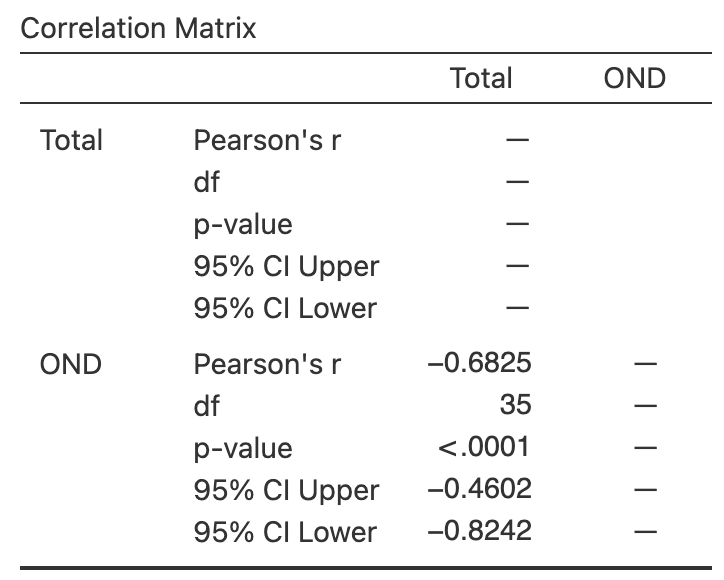

```


### Correlation: hypothesis test for $\rho$ {#CorrelationTesting}
\index{Hypothesis testing!correlation coefficient|(}

A hypothesis test can also be conducted regarding\ $\rho$, the Pearson correlation coefficient in the *population*.\index{Correlation}
The null hypothesis is, as always, the 'no difference, no change, no relationship' position which is, in this context:

* $H_0$: $\rho = 0$.

Clearly, the *sample* correlation coefficient $r$ for the data is not zero, and the RQ is effectively asking if sampling variation is the reason for this discrepancy between\ $r$ and the parameter\ $\rho$.

Since the RQ (in Sect.\ \@ref(CorReg-Intro)) is one-tailed (negative direction), the alternative hypothesis is:

* $H_1$:  $\rho < 0$ \quad (*one-tailed* test, based on the RQ).

As usual, initially *assume* that $\rho = 0$ (from\ $H_0$), then describe what values of\ $r$ could be *expected* using the *sampling distribution*, under that assumption, across all possible samples.
Then the *observed* value of\ $r$ is compared to the values expected through sampling variation to determine if the value of\ $r$ supports or contradicts the assumption.

For a correlation coefficient, the sampling distribution of\ $r$ does not have a normal distribution.^[For those interested: the value of\ $r$ only varies between $-1$ and $1$, so cannot have a normal distribution. A transformation of\ $r$ *does* exist that has an approximate normal distribution and *standard error*.]
However, the output (Fig.\ \@ref(fig:BorersScatterjamovi2), right panel)\index{Software output!correlation} contains the relevant two-tailed $P$-value for the test: less than\ $0.001$.
Hence, the one-tailed $P$-value for the test is less than\ $0.0005$.
*Very strong evidence* exists to support\ $H_1$ (that the correlation in the population is negative).

We write:

> The sample presents very strong evidence (one-tailed $P < 0.0005$) that the sorghum yield has a negative association with borer infestation percentage ($r = -0.934$ with $95$% CI from $-0.971$ to $-0.851$; $n = 24$) in the population.

Notice the three features of writing conclusions again: an answer to the RQ, evidence to support the conclusion, and some sample summary information.


::: {.tipBox .tip data-latex="{iconmonstr-info-6-240.png}"}
If the evidence suggests that the correlation coefficient is *not zero* (in the population), this does *not* necessarily mean a *strong* correlation exists.
The correlation may be weak in the population (as estimated by the value of\ $r$), but evidence exists that the correlation is *not zero* in the *population*.

That is, the test is about statistical significance, not practical importance.\index{Practical importance}
:::


::: {.example #CycloneCorrelationTest name="Correlation"}
The relationship between the number of cyclones\ $y$ in the Australian region each year from\ 1969 to\ 2005, and the ONI\ $x$ is shown in Fig.\ \@ref(fig:ONIcyclonesCorrelation) (left panel).
To test for a relationship, use
$$
   \text{$H_0$: $\rho = 0$} \qquad\text{ against}\qquad \text{$H_0$: $\rho \ne 0$};
$$
software reports that $P < 0.0001$ (Fig.\ \@ref(fig:ONIcyclonesCorrelation), right panel).
There is very strong evidence of a relationship between the number of cyclones in the Australian region and the ONI (averaged over October, November and December).
:::
\index{Hypothesis testing!correlation coefficient|)}


## Regression

### Introducting regression {#Chap35-Intro}

*Correlation* measures the *strength* and *direction* of the *linear* relationship between two quantitative variables\ $x$ (an explanatory variable) and\ $y$ (a response variable).
Sometimes, however, *describing* the nature of the relationship is useful.
This is called *regression*.

The regression relationship is described mathematically using an *equation*, and allows us to:

1. *Predict* the mean value of\ $y$ from a given value of\ $x$ (Sect.\ \@ref(RegressionForPrediction)).
2. *Understand* the relationship between\ $x$ and\ $y$ (Sect.\ \@ref(RegressionForUnderstanding)).

<!-- Of course, any prediction will not be a perfect prediction, due to natural variation in the data.\index{Natural variation} -->
<!-- In other words, for any given value of $x$, many possible values of $y$ could be observed. -->
<!-- This means that the prediction is actually a prediction of the *mean* of all the possible values of $y$ that could be observed for that given value of $x$. -->

An example of a *linear* regression equation, describing the linear relationship between the observed values of an explanatory variable\ $x$ and the observed values of a response variable\ $y$, is\index{Linear equations}
\begin{equation}
  \hat{y} = -4  + (2\times x), \qquad\text{usually written}\qquad \hat{y} = -4  + 2x.
  (\#eq:ExampleRegressionEqn)
\end{equation}
The notation\ $\hat{y}$ refers to the mean of all the $y$-values that could be observed for some given value of\ $x$.
That is, for some value of\ $x$, many different values of\ $y$ could be observed, and\ $\hat{y}$ is the value that regression equation predicts as the *mean* of all those possible values. 
This equation describes the connection between the values of\ $x$ and the corresponding average values of\ $y$. 


::: {.importantBox .important data-latex="{iconmonstr-warning-8-240.png}"}
$y$\ refers to the values of the response variable *observed* from individuals.
$\hat{y}$ refers to *predicted mean* value of\ $y$ for given values of\ $x$.
:::


:::: {.pronounceBox .pronounce data-latex="{iconmonstr-microphone-7-240.png}"}
$\hat{y}$ is pronounced as 'why-hat'; the 'caret' above the\ $y$ is called a 'hat'.
:::


More generally, the equation of a straight line is
$$
   \hat{y} = b_0 + (b_1 \times x), \qquad\text{usually written}\qquad \hat{y} = b_0 + b_1 x,
$$
where the values of\ $b_0$ and\ $b_1$ are unknown, and estimated from sample data.
Notice that\ $b_1$ is the number multiplied by\ $x$.
In Equation\ \@ref(eq:ExampleRegressionEqn), $b_0 = -4$ and $b_1 = 2$.


::: {.example #RegressionGirlsHt name="Regression equations"}
A report on the growth of Australian children [@data:AustralianGirls] found an approximate linear relationship between the age (in years) $x$ and height (in\ cm)\ $y$ of girls aged between four and seven.
The regression equation was approximately
$$
   \hat{y} = 73 + 7x.
$$
The regression equation is the same if written as
$$
   \hat{y} = 7x + 73.
$$
In both cases, $b_0 = 73$ and $b_1 = 7$.
This regression equation describes the connection between ages\ $x$ and heights\ $y$ for girls aged between four and seven.
:::


### Reviewing linear equations {#RegressionEquationsReview}
\index{Linear equations}\index{Regression}

To introduce, or revise, the idea of a linear equation, consider the (artificial) data in 
`r if (knitr::is_latex_output()) {
   'Fig.\\ \\@ref(fig:ExampleScatterLATEX) (left panel),'
} else {
   'Fig.\\ \\@ref(fig:ExampleScatterHTML),'
}`
with an explanatory variable\ $x$ and a response variable\ $y$.\index{Response variable}\index{Explanatory variable}\index{Graphs!scatterplot}
In the graph, a sensible line is drawn on the graph that seems to capture the relationship between\ $x$ and\ $y$.
(You may have drawn a slightly different, but similar, line.)
The line describes the predicted mean values of\ $y$ (i.e., values of $\hat{y}$) for various values of\ $x$.
The relationship is *positive* and *linear*.

A *regression equation* specifies the line.\index{Regression!equation}
In the regression equation $\hat{y} = b_0 + b_1 x$, the numbers\ $b_0$ and\ $b_1$ are called *regression coefficients*,\index{Regression!coefficients} where

* $b_0$ is the *intercept* (or the *$y$-intercept*),\index{Regression!equation!intercept}\index{Linear equations!intercept}
  whose value corresponds to the *predicted* mean value of\ $y$ when $x = 0$.
* $b_1$ is the *slope*,\index{Regression!equation!slope}\index{Linear equations!slope}
  whose value measures how much the value of\ $\hat{y}$ changes, on average, when the value of\ $x$ *increases* by\ $1$.

We will use software to find the values of\ $b_0$ and\ $b_1$ (as the formulas are tedious to use).
However, a rough approximation of the values of\ $b_0$ and\ $b_1$ can be obtained using the rough straight line drawn on the scatterplot
`r if (knitr::is_latex_output()) {
   '(Fig.\\ \\@ref(fig:ExampleScatterLATEX)).'
} else {
   '(Fig.\\ \\@ref(fig:ExampleScatterHTML)).'
}`

A rough approximation of the value of the *intercept*\ $b_0$ is the value of\ $\hat{y}$ when $x = 0$, from the drawn line.
When $x = 0$, the regression line suggests the value of\ $\hat{y}$ is about\ $2$
`r if (knitr::is_latex_output()) {
   'in Fig.\\ \\@ref(fig:ExampleScatterLATEX) (left panel)'
}`; 
that is, the value of\ $b_0$ is approximately\ $2$.

A rough approximation of the *slope*\ $b_1$ is found using\index{Regression!equation!rise over run|(}
`r if (knitr::is_html_output()) '<!--'`
\begin{equation}
     \frac{\text{Change in $\hat{y}$}}{\text{Corresponding \emph{increase} in $x$}}
   = \frac{\text{rise}}{\text{run}}
   (\#eq:RiseOverRun)
\end{equation}
`r if (knitr::is_html_output()) '-->'`
`r if (knitr::is_latex_output()) '<!--'`
\begin{equation}
     \frac{\text{Change in $y$}}{\text{Corresponding INCREASE in $x$}}
   = \frac{\text{rise}}{\text{run}}
   (\#eq:RiseOverRun)
\end{equation}
`r if (knitr::is_latex_output()) '-->'`
from the drawn line.
This approximation of the slope is the *change* in the value of\ $\hat{y}$ (the 'rise') divided by the corresponding *increase* in the value of\ $x$ (the 'run').


<!-- FOR LaTeX: Put this example data plot and the static rise/run in the same plot -->
<!-- FOT HTML, separate plots -->

```{r ExampleScatterHTML, fig.cap="An example scatterplot.", fig.align="center", fig.width=5, fig.height=4}
if (knitr::is_html_output()){
  set.seed(5000)
x <- seq(0.5, 5, 
        length = 10)
mu <- 2 + 3 * x 
y <- mu + rnorm(length(x), 0, 0.5) 
m1 <- lm(y ~ x)

plot(y ~ x, 
     xlim = c(-0.5, 5), 
     ylim = c(0, 20), 
     las = 1, 
     xlab = expression(paste("Explanatory, ", italic(x)) ), 
     ylab = expression(paste("Response, ", italic(y)) ), 
     pch = 19)
grid()

abline( coef(m1), 
        col = "grey",
        lwd = 2)
}
```

```{r AnimateRiseRun, animation.hook="gifski", interval=0.85, dev=if (is_latex_output()){"pdf"}else{"png"}}
if (knitr::is_html_output()){
  NumPlots <- 9

  set.seed(5000)

  x <- seq(0.5, 5,  
           length = 10)
  b0 <- 2
  b1 <- 3
    
  mu <- b0 + b1 * x
  y <- mu + rnorm(length(x), 0, 0.5)

  x1 <- 1
  x2 <- 5
  y1 <- b0 + (b1 * x1) 
  y2 <- b0 + (b1 * x2)
    

  for (i in (1:NumPlots)){
    par( mar = c(5, 4, 4, 2) + 0.1)
    # DATA
    
    plot(y ~ x, 
         xlim = c(-0.5, 5), 
         ylim = c(0, 20), 
         type = "n",
         las = 1, 
         xlab = expression(paste("Explanatory, ", italic(x)) ), 
         ylab = expression(paste("Response, ", italic(y)) ), 
         pch = 19)
    rug(1:20, 
        side = 2, 
        ticksize = -0.02)
    grid()
    points(y ~ x, 
           pch = 19) 
    
    if ( i >=2 ){ # DATA + LINE
      abline(b0, b1,
             col = "black", 
             lwd = 2)
    }
    if (i >= 3) { # DATA + LINE + x1 
      lines( c(x1, x1), 
             c(0, y1),
             lwd = 2, 
             col = "darkgrey",
             lty = 2)
    }
    
    if ( i >= 4){  # DATA + LINE + x1 + y1
      lines( c(0, x1), 
             c(y1, y1),
             lwd = 2, 
             col = "darkgrey",
             lty = 2)
    }
    
    if ( i >= 5 ){  # DATA + LINE + x1 + y1 + x2
      lines( c(x2, x2), 
             c(0, y2),
             lwd = 2, 
             col = "darkgrey",
             lty = 2)
    }
    
    if ( i >= 6) {  # DATA + LINE + x1 + y1 + x2 + y2
      lines( c(0, x2), 
             c(y2, y2),
             lwd = 2, 
             col = "darkgrey",
             lty = 2)
    }
    
    if (i >= 7 ) {  # DATA + LINE + x1 + y1 + x2 + y2 + RUN
      run <- x2 - x1
      arrows(x1, 2, 
             x2, 2,
             lwd = 2,
             length = 0.15,
             col = "darkgrey",
             code = 2)
      text( mean( c(x1, x2)), 2.5, 
            labels = bquote("Run: "~ .(x2)-.(x1) == .(run)),
            pos = 2 )  
    }
    
    if (i >= 8 ){ # DATA + LINE + x1 + y1 + x2 + y2 + RUN + RISE
      rise <- y2 - y1
      arrows(0.5, y1, 
             0.5, y2,
             lwd = 2,
             length = 0.15,
             col = "darkgrey",
             code = 2)
      text( 0.5, 
            mean( c(y1, y2)), 
            labels = bquote("Rise: "~ .(y2)-.(y1) == .(rise)),
            pos = 4 )  
    }
    
    
    if (i >= 9 ) {  # DATA + LINE + x1 + y1 + x2 + y2 + RUN + RISE + SLOPE
      slope <- rise / run
      polygon( c(2.15, 2.15, 4.85, 4.85), 
               c(6, 8, 8, 6), 
               border = NA, # No border
               col = "antiquewhite1")
      text(3.5, 
           7, 
            labels = bquote("Slope: "~ .(rise) %/%  .(run) == .(slope)) )
    }
  }
}
```


<!-- FOR LaTeX: Put this example data plot and the static rise/run in the same plot -->
```{r ExampleScatterLATEX, fig.cap="Estimating the regression equation from a line using an example scatterplot. Left: approximating $b_0$. Right: approximating $b_1$ using rise-over-run.", fig.align="center", fig.width=9, fig.height=4, out.width='100%'}
set.seed(5000)
x <- seq(0.5, 5, 
         length = 10)

b0 <- 2
b1 <- 3 

mu <- 2 + 3 * x
y <- mu + rnorm(length(x), 0, 0.5)

if (knitr::is_latex_output()){
  
  par(mfrow = c(1, 2))
  
  plot(y ~ x, 
       xlim = c(-0.5, 5), 
       ylim = c(0, 20), 
       las = 1, 
       main = expression(Approximating~italic(b)[0]),
       xlab = expression(Explanatory~italic(x) ), 
       ylab = expression(Response~italic(y) ), 
       pch = 19,
       axes = FALSE,
       col = "grey")
  
  box()
  axis(side = 2,
       las = 2)
  grid()
   rug(1:20, 
      side = 2, 
      ticksize = -0.02)
  
  axis(side = 1,
       at = 0:5,
       labels = c( expression( italic(x) == 0),
                       1 : 5))
     abline( c(b0, b1), 
          col = "black",
          lwd = 2)
  
  text(x = 2,
       y = 15,
       pos = 3,
       label = "Regression line")
  arrows(x0 = 2,
         x1 = 2.75,
         y0 = 15,
         y1 = b0 + (b1 * 2.75),
         lwd = 2,
         angle = 15,
         length = 0.25,
         col = "darkgrey")
  
  
  # Beta 0
  abline(v = 0,
         lwd = 2,
         col = "darkgrey")
  lines( x = c(0, 0),
         y = c(0, b0),
         lty = 1,
         lwd = 2,
         col = "darkgrey")
  lines( x = c(-1, 1.5),
         y = c(b0, b0),
         lty = 1,
         lwd = 2,
         col = "darkgrey")
  
  arrows(x0 = 3,
         x1 = 1.75,
         y0 = 4,
         y1 = b0,
         angle = 10,
         length = 0.125,
         lwd = 2)
  text(x = 4,
       y = 2.5,
       #pos = 4,
       labels = expression( atop(Approximate,
                                 value~of~italic(b)[0])) )
  
######

  x1 <- 1
  x2 <- 5
  y1 <- b0 + (b1 * x1) 
  y2 <- b0 + (b1 * x2)
  
  NumPlots <- i <- 9
  #  for (i in (NumPlots:NumPlots)){
  
  # DATA
  plot(y ~ x, 
       xlim = c(-0.5, 5), 
       ylim = c(0, 20), 
       type = "n",
       las = 1, 
       main = expression(Approximating~italic(b)[1]),
       xlab = expression(Explanatory~italic(x) ), 
       ylab = expression(Response~italic(y) ), 
       pch = 19)
  rug(1:20, 
      side = 2, 
      ticksize = -0.02)
  grid()
  
  
  points(y ~ x, 
         pch = 19,
         col = "grey") 
  
  if ( i >=2 ){ # DATA + LINE
    abline(b0, b1,
           col = "black", 
           lwd = 2)
  }
  if (i >= 3) { # DATA + LINE + x1 
    lines( c(x1, x1), 
           c(0, y1),
           lwd = 2, 
           col = "darkgrey",
           lty = 2)
  }
  
  if ( i >= 4){  # DATA + LINE + x1 + y1
    lines( c(-1, x1), 
           c(y1, y1),
           lwd = 2, 
           col = "darkgrey",
           lty = 2)
  }
  
  if ( i >= 5 ){  # DATA + LINE + x1 + y1 + x2
    lines( c(x2, x2), 
           c(0, y2),
           lwd = 2, 
           col = "darkgrey",
           lty = 2)
  }
  
  if ( i >= 6) {  # DATA + LINE + x1 + y1 + x2 + y2
    lines( c(-1, x2), 
           c(y2, y2),
           lwd = 2, 
           col = "darkgrey",
           lty = 2)
  }
  
  if (i >= 7 ) {  # DATA + LINE + x1 + y1 + x2 + y2 + RUN
    run <- x2 - x1
    arrows(x1, 2, 
           x2, 2,
           lwd = 2,
           length = 0.15,
           angle = 15,
           col = "darkgrey",
           code = 2)
    text( mean( c(x1, x2)), 
          2, 
          labels = bquote("Run: "~ .(x2)-.(x1) == .(run)),
          pos = 3 )  
  }
  
  if (i >= 8 ){ # DATA + LINE + x1 + y1 + x2 + y2 + RUN + RISE
    arrows(0.5, y1, 
           0.5, y2,
           lwd = 2,
           length = 0.15,
           angle = 15,
           col = "darkgrey",
           code = 2)
    rise <- y2 - y1
    text( 0.5, 
          mean( c(y1, y2)) + 1.5, 
          labels = bquote("Rise: "~ .(y2)-.(y1) == .(rise)),
          pos = 4 )  
  }
  #  }
}
```


Consider what happens in 
`r if (knitr::is_latex_output()) {
   'Fig.\\ \\@ref(fig:ExampleScatterLATEX) (right panel)'
} else {
   'the animation below'
}`
when the value of\ $x$ increases from\ $1$ to\ $5$ (a *run* of $5 - 1 = 4$).
The corresponding value of\ $y$ changes from about\ $5$ to about\ $17$, a *rise* of $17 - 5 = 12$.
So, using Equation\ \@ref(eq:RiseOverRun),
$$
   \frac{\text{rise}}{\text{run}} 
   = \frac{17 - 5}{5 - 1}
   = \frac{12}{4} 
   = 3.
$$
The value of\ $b_1$ is about\ $3$.
When using rise-over-run, better guesses for\ $b_1$ are found when using one value of\ $x$ near the left-side of the scatterplot, and another value of\ $x$ near the right-side of the scatterplot, but any two values can be used (try using $x = 0$ and $x = 3$).

Combing the rough guesses for $b_0$ and $b_1$, the regression line is approximately $\hat{y} = 2 + (3\times x)$, usually written
$$
  \hat{y} = 2 + 3x.
$$

::: {.importantBox .important data-latex="{iconmonstr-warning-8-240.png}"}
The regression equation has\ $\hat{y}$ (not\ $y$) on the left-hand side.
That is, the equation *predicts* the *mean* values of\ $y$, which may not be equal to any of the observed values (which are denoted by\ $y$).

A 'good' regression equation would produce predicted values\ $\hat{y}$ close to the observed values\ $y$; that is, the line passes close to each point on the scatterplot.\index{Graphs!scatterplot}
:::


The *intercept*\ $b_0$ has the same measurement units as the response variable.\index{Regression!equation!intercept}
The measurement units for the *slope*\ $b_1$ is the 'measurement units of the response variable', per 'measurement units of the explanatory variable'.\index{Regression!equation!intercept}


:::{.example name="Measurement units of regression parameters"}
In Example\ \@ref(exm:RegressionGirlsHt), the regression line for the relationship between the age of Australian girls\ $x$ (in years) and their height (in\ cm)\ $y$ was $\hat{y} = 73 + 7x$ (for girls aged between four and seven years).

In the equation, the intercept is $b_0 = 73\cms$ and the slope is $b_1 = 73\cms$/y (the growth *rate*).
:::


:::{.example name="A rough approximation of the regression equation"}
For the sorghum data, a rough estimate of the regression line can be drawn on a scatterplot to estimate\ $b_0$ and\ $b_1$ (Fig.\ \@ref(fig:BorersRiseRun)).
The estimate of\ $b_0$ (the value of\ $\hat{y}$ when $x = 0$) is roughly\ $4\,800\kgs.\xhas^{-1}$.

The estimate of\ $b_1$ can be found using the rise-over-run idea.
When $x = 0$, the value of\ $\hat{y}$ (according to the drawn line) is about\ $4\,800$.
At the other extreme of the plot, where $x = 40$, the value of\ $\hat{y}$ is about\ $1\,000$.
(Any two points on the line can be used, but using two points at each end gives better guesses of the slope.)
So, as\ $x$ increases from\ $0$ to about\ $40$, the value of\ $\hat{y}$ *reduces* from about\ $4\,800$ to about\ $1\,000$, a change of about\ $-3\,800$.
That is, for a 'run' of $40 - 0 = 40$, the 'rise' is $4\,800 - 1\,000 = -3\,800$ (i.e., a drop of\ $3\,800$), and so a rough estimate of the slope is $-3\,800/40 = -95$.\index{Linear equations!rise over run}
(The relationship is *negative*, so the slope is *negative*.)

The rough guess of the regression line is therefore
$$
  \hat{y} = 4\,800 - 95x,
$$
where\ $x$ is the infestation percentage, and\ $y$ is yield (in\ $\kgs.\xhas^{-1}$).
The rough guess of the intercept\ $b_0$ is\ $4\,800\kgs.\xhas^{-1}$, while the rough guess of the slope\ $b_1$ is\ $-95\kgs.\xhas^{-1}/\%$.
:::


```{r BorersRiseRun, fig.cap="Obtaining rough guesses for the regression equation for the sorghum data. Left: approximating $b_0$. Right: approximating $b_1$ using rise-over-run. The plus signs on the right plot indicate the points used to estimate the slope.", fig.align="center", fig.width=9, fig.height=4, out.width='100%'}
mSorghum <- lm( Yield ~ Infestation,
             data = BorersSub) 

  
  b0 <- 4800
  b1 <- (1000 - 4800) / 40

  par(mfrow = c(1, 2))
  
  par(mar = c(5, 5, 4, 2) + 0.1)
  plot(Yield ~ Infestation, 
       data = BorersSub,
       col = "darkgrey",
       xlim = c(-1, 40), 
       ylim = c(900, 6000), 
       las = 1, 
       axes = FALSE,
       main = expression(Sorghum~yield*":"~approximating~italic(b)[0]),
       xlab = expression(Infestation~italic(x)~"(in %)" ), 
       ylab = expression(Yield~italic(y)~"(in"~kg.ha^-1*")"), 
       pch = 19)
  
  box()
  grid()
  axis(side = 1,
       las = 1,
       at = c(0, 10, 20, 30, 40),
       labels = c(expression(italic(x)==0),
                  10, 20, 30, 40))
  
  axis(side = 2,
       las = 1,
       at = c(1000, 2000, 3000, 4000, 4800, 6000) )
  axis(side = 2,
       at = 13.5, 
       las = 1,
       cex.axis = 0.8)

  
    abline(b0, b1,
           col = "black", 
           lwd = 2)
  
  # Beta 0
  abline(v = 0,
         lwd = 2,
         col = "darkgrey")
  lines( x = c(-15, 20),
         y = c(4800, 4800),
         lty = 1,
         lwd = 2,
         col = "darkgrey")
  
  
  arrows(x0 = 25,
         x1 = 20,
         y0 = 5100,
         y1 = 4800,
         #angle = 15,
         length = 0.1,
         lwd = 2)
  text(x = 23,
       y = 5000,
       pos = 4,
       labels = expression( atop(Approximate,
                                 value~of~italic(b)[0])) )
  
  ##################################################################
  x1 <- 0
  x2 <- 40
  y1 <- b0 + (b1 * x1) 
  y2 <- b0 + (b1 * x2)
  
  # DATA
  par(mar = c(5, 5, 4, 2) + 0.1)
  plot(Yield ~ Infestation,
       data = BorersSub, 
       xlim = c(-1, 40), 
       ylim = c(900, 6000), 
       las = 1, 
       axes = FALSE,
       col = "darkgrey",
       main = expression(Sorghum~yield*":"~approximating~italic(b)[1]),
       xlab = expression(Infestation~italic(x)~"(in %)" ), 
       ylab = expression(Yield~italic(y)~"(in"~kg.ha^-1*")"), 
       pch = 19)
  box()
  grid()

  axis(side = 1,
       las = 1,
       at = c(0, 10, 20, 30, 40) )
  
  axis(side = 2,
       las = 1,
       at = c(1000, 1800, 3000, 4000, 4800, 6000) )

  axis(side = 2,
       at = 13.5,
       las = 1,
       cex.axis = 0.8)
  axis(side = 2,
       at = 5.5,
       las = 1,
       cex.axis = 0.8)

  

#  rug(1:20, 
#      side = 2, 
#      ticksize = -0.02)
  grid()
  
    abline(b0, b1,
           col = "black", 
           lwd = 2)

    # DATA + LINE + x1 
    # lines( c(x1, x1), 
    #        c(-2, y1),
    #        lwd = 2, 
    #        col = "black",
    #        lty = 2)
    # 
    # # # DATA + LINE + x1 + y1
    # lines( c(-2, x1), 
    #        c(y1, y1),
    #        lwd = 2, 
    #        col = "black",
    #        lty = 2)
    # 
    # # DATA + LINE + x1 + y1 + x2
    # lines( c(x2, x2), 
    #        c(0, y2),
    #        lwd = 2, 
    #        col = "black",
    #        lty = 2)
    # 
    # # DATA + LINE + x1 + y1 + x2 + y2
    # lines( c(-2, x2), 
    #        c(y2, y2),
    #        lwd = 2, 
    #        col = "black",
    #        lty = 2)
    # 
    # DATA + LINE + x1 + y1 + x2 + y2 + RUN
    # RUN
    run <- x2 - x1
    arrows(x0 = x1, 
           y0 = 4800, 
           x1 = x2, 
           y1 = 4800,
           lwd = 2,
           length = 0.15,
           angle = 10,
           col = "darkgrey",
           code = 2)
    text( mean( c(x1, x2)), 
          5300, 
          labels = bquote("Run: "~ .(x2)-.(x1) == .(run)) ) # Get proper minus sign, not dash, for run
    
    # DATA + LINE + x1 + y1 + x2 + y2 + RUN + RISE
    # RISE
    arrows(x0 = 0, 
           y0 = y1 - 3, 
           x1 = 0, 
           y1 = y2 + 3,
           lwd = 2,
           length = 0.15,
           angle = 10,
           col = "darkgrey",
           code = 2)
    rise <- y2 - y1
    text( x = 0.5, 
          y = 2300, 
          labels = "Rise: ",
          pos = 4)  
    text( x = 0.5, 
          y = 1700, 
          labels = bquote( .(y2)-.(y1) == .("\u2212") * .(abs(rise))), # To get a proper negative sign
          pos = 4 )  
    
    # MARK THE POINTS from which rise and run are determined
    points(x1, y1,
           cex = 1.75,
           pch = 3)
    points(x2, y2,
           cex = 1.75,
           pch = 3)
```


`r if (knitr::is_html_output()){
  'You may like the following interactive activity, which explores slopes and intercepts.'}`

<iframe src="https://phet.colorado.edu/sims/html/graphing-slope-intercept/latest/graphing-slope-intercept_en.html" width="600" height="450" scrolling="no" allowfullscreen="allowfullscreen"></iframe>


  
::: {.example #CycloneRegressionGuesses name="Estimating regression parameters"}
The relationship between the number of cyclones\ $y$ in the Australian region each year from\ 1969 to\ 2005, and the ONI\ $x$ is shown in Fig.\ \@ref(fig:ONIcyclonesCorrelation) (left panel).

To make a guess of the regression coefficients, a sensible line can be drawn through the data (Fig.\ \@ref(fig:ONIcyclones)).
When the value of\ $x$ is zero, the predicted value of\ $y$ is about\ $12$, so\ $b_0$ is about\ $12$\ cyclones.
Recall: the intercept is the predicted value of\ $y$ when $x = 0$, which is *not* at the left of the graph in Fig.\ \@ref(fig:ONIcyclones).

To approximate the value of\ $b_1$, use the rise-over-run idea.\index{Linear equations!rise over run}
When\ $x = -2$, the predicted mean value of\ $y$ is about\ $17$; when\ $x = 2$, the predicted mean value of\ $y$ is about\ $8$.
The value of\ $x$ increases by $2 - (-2) = 4$,  while the value of\ $\hat{y}$ changes by $7.5 - 17 = -9.5$ (a *decrease* of about $9.5$).
Hence, $b_1$ is approximately $-9.5/4 = -2.375$ cyclones per unit change in ONI.
(You may get a slightly different value from a slightly different line.)

The relationship has a *negative* direction, so the slope must be *negative*.
The regression line is approximately $\hat{y} = 12 - 2.375x$.
:::


```{r ONIcyclones, out.width="70%", fig.align="center", fig.cap="The number of cyclones in the Australian region each year from 1969 to 2005, and the ONI averaged over October, November, December. An estimate of the reggression line is shown. The plus sign ${}+{}$ is located on the line where $x = 0$. The crosses ${}\\times{}$ are located to find rise-over-run.", fig.width=6, fig.height=4}

plot(Total ~ OND, 
     data = Cyclones,
     xlim = c(-2.65, 3),
     ylim = c(0, 20),
     pch = 19,
     col = "darkgrey",
     ylab = "Total number of cyclones",
     xlab = "ONI averaged over Oct., Nov., Dec.",
     main = "Cyclone numbers vs ONI",
     las = 1)

clm <- lm( Total ~ OND, 
           data = Cyclones)
abline( coef(clm), 
        lwd = 2)
grid(lty = 2)

axis(side = 2,
     at = c(7.5, 17),
     las = 1,
     cex.axis = 0.8)


rise1 <- predict( clm,
                  newdata = data.frame(OND = -2))
lines(x = c(-2, -2),
      y = c(1, rise1),
      lty = 5,
      lwd = 2,
      col = plotDark)

rise2 <- predict( clm,
                  newdata = data.frame(OND = 2))
lines(x = c(2, 2),
      y = c(1, rise2),
      lty = 5,
      lwd = 2,
      col = plotDark)

text(x = 0,
     y = 1,
     pos = 3,
     labels = "'Run'")


points(x = 0,
       y = coef(clm)[1],
       pch = 3,
       cex = 1.75)

arrows(x0 = -2, 
       x1 =  2, 
       y0 = 1,
       y1 = 1,
       angle = 15,
       length = 0.175,
      col = plotDark)
points(x = -2,
       y = 1,
       pch = 19,
       cex = 0.75)
points(x = 2,
       y = 1,
       pch = 19,
       cex = 0.75)


arrows(x0 = -2.45, 
       x1 =  -2.45, 
       y0 = rise1,
       y1 = rise2,
       angle = 15,
       length = 0.175,
      col = plotDark)
points(x = -2.45,
       y = rise1,       
       pch = 19,
       cex = 0.75)
points(x = -2.45,
       y = rise2,       
       pch = 19,
       cex = 0.75)
text(x = -2.55,
     y = 11.4,
     pos = 3,
     srt = 90,
     labels = "'Rise'")


points(-2,
       rise1,
       pch = 4,
       cex = 1.75)
points(2,
       rise2,
       pch = 4,
       cex = 1.75)
```


The\index{Regression!equation!rise over run|)} above method gives a crude approximation to the values of the intercept\ $b_0$ and the slope\ $b_1$.
In practice, *many* reasonable lines could be drawn through a scatterplot of data, each giving slightly different rough guesses for\ $b_0$ and\ $b_1$.
However, one of those lines is the 'best' line in some sense,^[For those interested: the 'line of best fit' is the line for which the sum of the *squared* vertical distances between the observations\ $y$ and the predicted values\ $\hat{y}$ (i.e, the regression line) is as small as possible.] and is sometimes called the 'line of best fit'.\index{Regression!equation!line of best fit}


<iframe src="https://learningapps.org/watch?v=p84zyy2ot22" style="border:0px;width:100%;height:850px" allowfullscreen="true" webkitallowfullscreen="true" mozallowfullscreen="true"></iframe>


### Regression: finding equations using software {#Regression-Software}
\index{Regression!equation!using software}\index{Software output!regression}

```{r}
Borers.lm <- lm(Yield ~ Infestation, 
            data = BorersSub)
DB.bo <- round( coef(Borers.lm)[1], 1)
DB.b1 <- round( coef(Borers.lm)[2], 1)
```


Software is almost always used to find the estimates for the intercept\ $b_0$ and slope\ $b_1$, as the formulas are complicated and tedious to use.
For the sorghum data (Fig.\ \@ref(fig:BorersScatterjamovi2)), the relevant software output is shown in Fig.\ \@ref(fig:BorersRegression).

In the output, the values of\ $b_0$ and\ $b_1$ are in the column labelled `Estimate`; the value of the sample $y$-intercept is $b_0 = 4\,814.1\kgs.\xhas^{-1}$, and the value of the sample *slope* is $b_1 = -101.4\kgs.\xhas^{-1}/\%$.
These are the values of the two *regression coefficients*.\index{Regression!coefficients}
The regression equation is, after rounding:
\begin{equation}
	\hat{y} = 4\,814.1 + (-101.4\times x),
	\qquad\text{usually written as}\qquad  
	\hat{y} = 4\,814.1 - 101.4 x.
  (\#eq:BorersRegressionEqn)
\end{equation}
These are close to the values obtained using the rough method in Sect.\ \@ref(RegressionEquationsReview) (which gave $b_0 = 4\,800$ and $b_1 = -95$ approximately).


::: {.tipBox .tip data-latex="{iconmonstr-info-6-240.png}"}
The *sign* of the slope $b_1$ and the *sign* of correlation coefficient $r$ are always the same.
For example, if the slope is negative, the correlation coefficient will be negative.
However, the *value* of the slope cannot be deduced solely from the value of the correlation coefficient, nor can the *value* of the correlation coefficient be deduced solely from the value of the slope.
:::


```{r BorersRegression, fig.cap="The regression output for the sorghum data.", fig.align="center", out.width=c("55%"), fig.show="hold"}
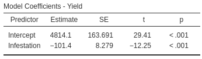
```
\index{Software output!correlation}


```{r}
cyclone.lm <- lm(Total ~ OND, 
                 data = Cyclones)
```

::: {.example #RegressionCoefficients name="Regression coefficients"}
The regression equation for the cyclone data (Fig.\ \@ref(fig:ONIcyclones)) is found from the software output (Fig.\ \@ref(fig:CyclonesRegressionjamoviCI)) as
$$
  \hat{y} = 12.1 - 2.23x,
$$
where\ $x$ is the ONI (averaged over October, November, December) and\ $y$ is the number of cyclones; that is, $b_0 = 12.1$\ cyclones and $b_1 = -2.23$ cyclones per unit change in ONI.
These values are close to the approximations made in Example\ \@ref(exm:CycloneRegressionGuesses) ($b_0 = 12$ and $b_1 = -2.375$ respectively).
:::


```{r CyclonesRegressionjamoviCI, fig.cap="The software output for the cyclone data.", fig.align="center", out.width=c("75%"), fig.show="hold"}
knitr::include_graphics( "jamovi/Cyclones/Cyclones-RegressionCI.png")
```


`r if (knitr::is_html_output()){
  'You may like the following interactive activity, which explores regression equations.'}`

<div style="text-align:center;">
<iframe src="https://phet.colorado.edu/sims/html/least-squares-regression/latest/least-squares-regression_en.html" width="600" height="450" scrolling="no" allowfullscreen="true"></iframe>
</div>


### Regression: making predictions {#RegressionForPrediction}
\index{Regression!equation!making predictions}

Regression equations can be used to make *predictions* of the mean value of\ $y$ for a given value of\ $x$.
For example, the regression equation for the sorghum data in Equation\ \@ref(eq:BorersRegressionEqn) can be used to make *predictions* of the mean yield for a given infestation percentage.
For example, the equation can be used to predict the *average* yield of crops with an infestation percentage of $30\%$.
Since\ $x$ represents the infestation percentage, use $x = 30$ in the regression equation:
\begin{align*}
  \hat{y} 
  &= 4\,814.1 - (101.4\times 30)\\
  &= 4\,814.1 - 3\,042 = 1\,772.1.
\end{align*}
Crops with an infestation percentage of $30\%$ are predicted to have a *mean* yield of $1\,772.1\kgs.\xhas^{-1}$ (though individual crops with an infestation percentage of\ $30\%$ may have smaller or greater yields).
The model predicts that the *mean* yield for crops with an infestation percentage of\ $30\%$ will be about $1\,772.1\kgs.\xhas^{-1}$.


:::: {.importantBox .important data-latex="{iconmonstr-warning-8-240.png}"}
The value of\ $\hat{y}$ is computed using the estimates\ $b_0$ and\ $b_1$, which are computed from sample data. 
Hence, the value of\ $\hat{y}$ also depends on which one of the countless possible samples is used.
This means that\ $\hat{y}$ also has a sampling distribution and a standard error.
:::


Suppose we were interested in crops with an infestation percentage of $50\%$; the mean yield is
$$
  \hat{y} = 4\,814.1 - (101.4.39 \times 50) = -255.9,
$$
or about\ $-256\kgs.\xhas^{-1}$, which is clearly silly (negative yields are impossible).
In the data, the heaviest infestation is about\ $40\%$, so no data exists beyond a\ $40\%$ infestation percentage.
As a result, the regression line does not even apply for infestations exceeding\ $40\%$.
(This means that the relationship must be non-linear after $40\%$.)

Making predictions outside the range of the available data is called *extrapolation*, and *extrapolation* beyond the data may lead to nonsense predictions.


::: {.definition #Extrapolation name="Extrapolation"}
*Extrapolation* refers to making predictions outside the range of the available data.
Extrapolation beyond the data may lead to nonsense.\index{Extrapolation}
:::


::: {.example #GirlsHtExtrapolation name="Extrapolation"}
The regression equation (Example\ \@ref(exm:RegressionGirlsHt)) used to predict the mean height of girls\ $\hat{y}$ from their age\ $x$ (for girls aged between four and seven) was given as
$$
   \hat{y} = 73 + 7x.
$$
For girls five years-of-age (i.e., $x = 5$), the predicted mean height is
$$
   \hat{y} = 73 + (7\times 5) = 73 + 35 = 108.
$$
The heights of girls will vary around a *mean* height of\ $108\cms$; some individual girls aged five will be taller than\ $108\cms$, and some will be shorter than\ $108\cms$.

Using the equation to estimate the height of girls aged\ $21$ would predict a mean height of\ $220\cms$.
However, this is extrapolation and the prediction is nonsense.
Young children grow at a fast rate, but growth rate slows as children age.
:::


### Regression: understanding relationships {#RegressionForUnderstanding}
\index{Regression!equation!for understanding}

The regression equation can be used to *understand* the relationship between the two variables.
Consider again the sorghum regression equation:
\begin{equation}
   \hat{y}
   = 
   4\,814.1 
   - 
   101.4 x.
   (\#eq:BorersEquation)
\end{equation}
What does this equation reveal about the relationship between\ $x$ and\ $y$?

$b_0$ is the *predicted* value of\ $\hat{y}$ when $x = 0$ (Sect.\ \@ref(Regression-Software)).
Using $x = 0$ in Equation\ \@ref(eq:BorersEquation) predicts a mean yield of
$$
  \hat{y} = 4\,814.1 - (101.4\times 0) = 4\,814.1
$$
for crops with an infestation of zero; this is the value of $b_1$.
Sometimes, using $x = 0$ is *extrapolating*,\index{Extrapolation} as no data exists near $x = 0$, so sometimes this interpretation of $b_0$ produces nonsense.


::: {.tipBox .tip data-latex="{iconmonstr-info-6-240.png}"}
The value of the intercept\ $b_0$ is sometimes (but not always) meaningless.
The value of the slope\ $b_1$ is usually of greater interest, as it explains the *relationship* between the two variables.
:::

The slope\ $b_1$ quantifies how the value of $\hat{y}$ changes (on average) when the value of\ $x$ *increases* by one (Sect.\ \@ref(Regression-Software)).
For the sorghum data, $b_1$ is the change in predicted mean yield for each percentage point^[A 'percentage point' increase means a change from, say, $10$% to\ $11$%, or $35$% to $36$%.] increase in borer infestation.

Specifically, each extra percentage point of borer infestation is associated with a mean change in yield of $-101.4\kgs.\xhas^{-1}$ (from Equation\ \@ref(eq:BorersEquation)); that is, a *decrease* in yield by a mean of $`r abs(-101.4)`\kgs.\xhas^{-1}$ for each extra percentage point of infestation.

To demonstrate, consider the case where $x = 10$, when the regression equation predicts $\hat{y} = 3\,800.1\kgs.\xhas^{-1}$.
For infestations one percentage point greater than this (i.e., $x = 11$), the value of the prediction $\hat{y}$ will increase by an average of $-101.4\kgs.\xhas^{-1}$ (or, equivalently, *decrease* by an average of $101.4\kgs.\xhas^{-1}$).
That is, we would predict $\hat{y} = 3\,800.1 - 101.4 = 3\,698.7\kgs.\xhas^{-1}$.
This is the same prediction made by using $x = 11$ in Equation\ \@ref(eq:BorersEquation).


::: {.tipBox .tip data-latex="{iconmonstr-info-6-240.png}"}
If the value of\ $b_1$ is *positive*, then the predicted mean values of\ $y$ *increase* as the values of\ $x$ *increase*.
If the value of\ $b_1$ is *negative*, then the predicted mean values of\ $y$ *decrease* as the values of\ $x$ *increase*.
:::


This interpretation of $b_1$ explains the relationship: the predicted mean yield is, on average, about $101.4\kgs.\xhas^{-1}$ less for each extra percentage point increase of infestation.


::: {.importantBox .important data-latex="{iconmonstr-warning-8-240.png}"}
In general, we say that a change in the value of\ $x$ is *associated* with a change in the value of\ $\hat{y}$.
Unless the study is experimental (Sect.\ \@ref(ExperimentalStudies)), we cannot say that the change in the value of\ $x$ *causes* the change in the value of\ $\hat{y}$. 
:::


::: {.importantBox .important data-latex="{iconmonstr-warning-8-240.png}"}
If the value of the slope is zero, there is *no linear relationship* between\ $x$ and\ $\hat{y}$.
A slope of zero means that a change in the value of\ $x$ is associated with a change of zero in the value of\ $\hat{y}$.
In this case, the correlation coefficient is also zero.
:::


## Regression: CIs and $t$-test for regression parameters {#RegressionCIHT}

### Introduction {#RegressionTests-Intro}

A regression equation exists in the *population* that connects the values of\ $x$ and\ $\hat{y}$.
This regression line is estimated from one of the countless possible samples, and is an estimate of the regression line in the population.

In the *population*, the intercept is denoted by\ $\beta_0$ and the slope by\ $\beta_1$.
The values of the parameters\ $\beta_0$ and\ $\beta_1$ are unknown, and are estimated by the statistics\ $b_0$ and\ $b_1$ respectively.


:::: {.pronounceBox .pronounce data-latex="{iconmonstr-microphone-7-240.png}"}


::: {style="display: flex;"}
The symbol\ $\beta$ is the Greek letter 'beta', pronounced 'beater' (as in 'egg beater').
So\ $\beta_0$ is pronounced as 'beater-zero', and\ $\beta_1$ as 'beater-one'.
:::

::: {}
```{r}
htmltools::tags$video(src = "./Movies/beta.mp4", 
                      width = "121", 
                      loop = "FALSE", 
                      controls = "controls", 
                      loop = "loop", 
                      style = "padding:5px; border: 2px solid gray;")
```
:::

::::


Every sample is likely to produce slightly different values for both\ $b_0$ and\ $b_1$ (sampling variation),\index{Sampling variation} so both\ $b_0$ and\ $b_1$ have a sampling distribution and a standard error.
The formulas for computing the values of\ $b_0$ and\ $b_1$ (and their standard errors) are intimidating, so we will use software to perform the calculations.
The sampling distributions for $b_0$ and\ $b_1$ have approximate normal distributions under certain conditions (Sect.\ \@ref(ValidityCorrelationRegression)).

Usually the slope is of greater interest than the intercept, because the slope explains the *relationship* between the two variables (Sect.\ \@ref(RegressionForUnderstanding)).
For this reason, the sampling distribution for the slope only is given below, but the sampling distribution for the intercept is analogous.


:::{.definition #Beta1SamplingDistn name="Sampling distribution of a sample slope"}
The sampling distribution of the sample regression slope is (when certain conditions are met; Sect.\ \@ref(ValidityCorrelationRegression)) described by

* an approximate normal distribution,
* with a mean of\ $\beta_1$, and 
* a standard deviation, called the *standard error of the slope* and denoted $\text{s.e.}(b_1)$.

A formula exists for finding $\text{s.e.}(b_1)$, but is tedious to use, and we will not give it.
:::


### CIs for the regression parameters {#RegressionCI}
\index{Sampling distribution!regression parameters}\index{Confidence intervals!regression parameters|(}


The sampling distribution describes all possible values of the sample slope from all possible samples, through *sampling variation*.
For the sorghum data then, the values of the sample slope across all possible samples is described (Fig.\ \@ref(fig:BorersSlopeSampDistCI)) as, using Def.\ \@ref(def:Beta1SamplingDistn):

* an approximate normal distribution,
* with a sampling mean whose value is\ $\beta_1$, and
* a standard deviation of $\text{s.e.}(b_1) = 8.279$ (from software;\index{Software output!regression} Fig.\ \@ref(fig:BorersRegression)).


```{r BorersSlopeSampDistCI, fig.cap="The distribution of sample slope for the sorghum data, around the population slope\\ $\\beta_1$.", fig.align="center", fig.height=2.9, fig.width=8.25, out.width='85%'}
mn <- 0
se <- 8.279

par( mar = c(4, 0, 0, 1))
out <- plotNormal(mu = mn, 
                  sd = se,
                  round.dec = 4,
                  cex.axis = 0.95,
                  ylim = c(0, 0.0675),
                  showXlabels = c( expression(beta[1] - 24.837),
                                   expression(beta[1] - 16.558),
                                   expression(beta[1] - 8.279),
                                   expression(beta[1]),
                                   expression(beta[1] + 8.279),
                                   expression(beta[1] + 16.558),
                                   expression(beta[1] + 24.837)),
                  main = "", # Main title
                  xlab = "Sample regression slopes", # horizontal axis labels
                  showZ = TRUE) # Whether to show z = -3:3 or not

arrows( x0 = 0,
        x1 = 0,
        y0 = 0.06,
        y1 = 0.05,
        angle = 15,
        length = 0.15)
text(x = 0,
     y = 0.06,
     pos = 3,
     labels = "Sampling mean")

arrows(x0 = 0,
       x1 = 8.279,
       y0 = 0.01,
       y1 = 0.01,
       angle = 15,
       length = 0.15)
text(x = 8.279/2,
     y = 0.01,
     pos = 3,
     labels = "Std error")
text(x = 8.279/2,
     y = 0.01,
     pos = 1,
     labels = expression(s.e.(italic(b)[1])) )
```


Since the sampling distribution is an approximate normal distribution, CIs have the form
$$
  \text{statistic} \pm ( \text{multiplier} \times \text{standard error}),
$$
where the multiplier is\ $2$ for an *approximate* $95$%\ CI (from the $68$--$95$--$99.7$ rule).
In this context, a CI for the slope is
$$
  b_1 \pm \big( \text{multiplier} \times \text{s.e.}(b _1)\big).
$$
Thus, an approximate $95$%\ CI  for the slope is 
$$
  -101.4 \pm (2\times 8.279)\qquad\text{or}\qquad -101.4 \pm 16.558,
$$
which is from\ $-118.0$ to\ $-84.8\kgs.\xhas^{-1}$ (after rounding).

Software can be used to produce *exact* CIs too; the exact $95$% CI is from\ $-118.6$ to\ $-84.3\kgs.\xhas^{-1}$ (Fig.\ \@ref(fig:BorersRegressionCI)).\index{Software output!regression}
The *approximate* and *exact* $95$%\ CIs are very similar.
We write:

> For each increase of one percentage point in borer infestation, the mean yield *increases* by\ $-101.4\kgs.\xhas^{-1}$ ($95$%\ CI: $-118.6$ to\ $-84.3$; $n = 24$).

Alternatively (and equivalently, but easier to understand):

> For each increase of one percentage point in borer infestation, the mean yield *decreases* by\ $101.4\kgs.\xhas^{-1}$ ($95$%\ CI: $84.3$\ to $118.6$; $n = 24$).


```{r BorersRegressionCI, fig.cap="Output for the sorghum data, including the CIs for the regression parameters.", fig.align="center", out.width=c("75%"), fig.show="hold"}
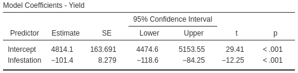
```


::: {.example #CyclonesCI name="Cyclones"}
Using the software output (Fig.\ \@ref(fig:CyclonesRegressionjamoviCI)) for the cyclone data, $\text{s.e.}(b_1) = 0.404$, so the approximate $95$%\ CI for the regression slope $\beta_1$ is
$$
   -2.23 \pm (2 \times 0.404)\text{\qquad {or}\qquad} -2.23 \pm 0.808.
$$
The interval from\ $-3.04$ to\ $-1.42$ is likely to straddle the population slope.
This approximate CI is very similar to the exact CI shown in Fig.\ \@ref(fig:CyclonesRegressionjamoviCI).
:::
\index{Confidence intervals!regression parameters|)}


### Regression: $t$-tests for regression parameters {#RegressionHT}
\index{Hypothesis testing!regression parameters|(}

Since the regression line describing the relationship between\ $x$ and\ $\hat{y}$ is computed from one of countless possible samples, any relationship observed in the sample may be due to sampling variation; possibly, no relationship actually exists in the population (i.e., $\beta_1 = 0$).
In other words, a hypothesis test can be conducted for the slope to determine if sampling variation can explain the discrepancy between $\beta_1$ and\ $b_1$.
(Similar hypothesis tests can be conducted for testing if the intercept is zero, but are usually of less interest.)

The null hypothesis for tests about the slope is the usual 'no relationship' hypothesis.
In this context, 'no relationship' means that the slope is zero (Sect.\ \@ref(RegressionForUnderstanding)), so the null hypothesis (about the *population*) is $H_0$: $\beta_1 = 0$.
A slope of $\beta_1 = 0$ is equivalent to *no relationship* between the variables.
(We would also find $\rho = 0$.)

For the sorghum data, the RQ implies these hypotheses about the slope:
$$
   \text{$H_0$: } \beta_1 = 0\quad\text{and}\quad\text{$H_1$: } \beta_1 < 0.
$$
The parameter is\ $\beta_1$, the population slope for the regression equation predicting yield from infestation percentage.
The alternative hypothesis is one-tailed, based on the RQ.


```{r}
DB.fitinfo <- summary(Borers.lm)$coefficients
DB.t <- DB.fitinfo[, "t value"]
DB.P <- DB.fitinfo[, "Pr(>|t|)"]
```


Assuming the null hypothesis is true (i.e., that $\beta_1 = 0$), the possible values of the sample slope\ $b_1$ can be described (Def.\ \@ref(def:Beta1SamplingDistn)).

For the sorghum data, the variation in the sample slope across all possible samples when $\beta_1 = 0$ is described (Fig.\ \@ref(fig:BorersSlopeSampDist)) using:

* an approximate normal distribution,
* with a sampling mean whose value is $\beta_1 = 0$ (from $H_0$), and 
* a standard deviation of $\text{s.e.}(b_1) = 8.279$ (from software; Fig.\ \@ref(fig:BorersRegressionCI)).


```{r BorersSlopeSampDist, fig.cap="The distribution of sample slopes for the sorghum data, if the population slope is $\\beta_1 = 0$.", fig.align="center", fig.height=3.25, fig.width=8.25, out.width='85%'}
par( mar = c(5, 2, 1, 2))
mn <- 0
se <- 8.279

out <- plotNormal(mu = mn, 
                  sd = se,
                  round.dec = 4,
                  cex.axis = 0.95,
                  ylim = c(0, 0.0675),
                  showXlabels = c( expression( -24.837),
                                   expression(-16.558),
                                   expression(-8.279),
                                   expression(0),
                                   expression(+8.279),
                                   expression(+16.558),
                                   expression(+24.837)),
                  main = "", # Main title
                  xlab = "Sample regression slopes", # horizontal axis labels
                  showZ = TRUE) # Whether to show z = -3:3 or not

arrows( x0 = 0,
        x1 = 0,
        y0 = 0.06,
        y1 = 0.05,
        angle = 15,
        length = 0.15)
text(x = 0,
     y = 0.06,
     pos = 3,
     labels = "Sampling mean")


arrows(x0 = 0,
       x1 = 8.279,
       y0 = 0.01,
       y1 = 0.01,
       angle = 15,
       length = 0.15)
text(x = 8.279/2,
     y = 0.01,
     pos = 3,
     labels = "Std error")
text(x = 8.279/2,
     y = 0.01,
     pos = 1,
     labels = expression(s.e.(italic(b)[1])) )
```


The *observed* sample slope for the sorghum data is $b_1 = -101.4$.
Locating this value on Fig.\ \@ref(fig:BorersSlopeSampDist) shows that it is *very* unlikely that any of the many possible samples would produce such a slope, just through sampling variation, if the population slope really was $\beta_1 = 0$.
The *test statistic* is found using the usual approach when the sampling distribution has an approximate normal distribution, using a $t$-score:\index{Test statistic!t@$t$-score}
\begin{align*}
   t 
   &= \frac{\text{observed value} - \text{mean of the distribution of the statistic}}{\text{std deviation of the distribution of the statistic}}\\
   &= \frac{ b_1 - \beta_1}{\text{s.e.}(b_1)} 
    = \frac{-101.4 - 0}{8.279} = -12.25,
\end{align*}
where the values of\ $b_1$ and\ $\text{s.e.}(b_1)$ are taken from the software output (Fig.\ \@ref(fig:BorersRegressionCI)).
This $t$-score is the same value reported by the software. 

To determine if the statistic is *consistent* with the null hypothesis, the $P$-value can be approximated using the $68$--$95$--$99.7$ rule, approximated using tables, or taken from software output (Fig.\ \@ref(fig:BorersRegressionCI)).
Since $t = -12.25$, the $P$-value will be very small; software shows the *two*-tailed $P$-value is $P < 0.001$ (so the one-tailed $P$-value is $P < 0.0005$).

We write:

> The sample presents very strong evidence ($t = -11.23$; one-tailed $P < 0.0005$) that, in the population, the yield of sorghum decreases as infestation percentage increases (slope: $-101.4$; $95$%\ CI from\ $-84.3$ to\ $-118.6$; $n = 24$).

Notice the three features of writing conclusions:
an answer to the RQ; evidence to support the conclusion (a $t$-score and $P$-value); and sample summary information (including a CI).


::: {.importantBox .important data-latex="{iconmonstr-warning-8-240.png}"}
The $P$-value for a test of $H_0$: $\rho = 0$ will be the same as the $P$-value from a test of $H_0$: $\beta_1 = 0$.
The test are effectively equivalent, both testing if the relationship observed in the sample can be explained by sampling variation.
:::


::: {.example #ONIRegression name="Hypothesis testing"}
For the cyclone data (Example\ \@ref(exm:RegressionCoefficients)), the RQ is:

> In the Australian region, is there a relationship between ONI and the number of cyclones?

This RQ implies these hypotheses:
$$
   \text{$H_0$: } \beta_1 = 0\quad\text{and}\quad\text{$H_1$: } \beta_1 \ne 0.
$$
From the output (Fig.\ \@ref(fig:CyclonesRegressionjamoviCI)), $t = -5.52$ and the $P$-value is small: $P < 0.0001$.
We write:

> The sample presents very strong evidence ($t = -5.52$; two-tailed $P < 0.0001$) that, in the population, the number of cyclones is related to the ONI (slope: $-2.23$; $95$%\ CI from\ $-3.04$ to\ $-1.42$; $n = 37$).
:::
\index{Hypothesis testing!regression parameters|)}


<iframe src="https://learningapps.org/watch?v=phxny7fec22" style="border:0px;width:100%;height:500px" allowfullscreen="true" webkitallowfullscreen="true" mozallowfullscreen="true"></iframe>


## Statistical validity conditions {#ValidityCorrelationRegression}
\index{Statistical validity (for inference)!correlation coefficient}\index{Statistical validity (for inference)!regression parameters}

As usual, these results hold under certain conditions.
The conditions for which the CIs and tests are statistically valid are:

1. The relationship is approximately linear (necessary for the (Pearson) correlation coefficient and regression line to be appropriate).
1. The variation in the response variable is approximately constant for all values of the explanatory variable.
1. The sample size is at least\ $25$.

The sample size of\ $25$ is a rough figure; some books give other values.
The units of analysis are also assumed to be *independent* (e.g., from a simple random sample).

If the relationship non-linear but is increasing-only or decreasing-only, alternatives to the Pearson correlation coefficient include the Spearman\index{Correlation coefficient!Spearman} or Kendall correlation coefficients\index{Correlation coefficient!Kendall} [@conover2003practical].
Depending on which statistical validity conditions are not met, other regression-like options may be available.
For example, generalised linear models [@mypapers:dunnsmyth:glms] may be appropriate for some non-linear relationships and/or relationships with non-constant variation in\ $y$.


::: {.example #StatisticalValidityBorers name="Statistical validity"}
For the sorghum data, the scatterplot (Fig.\ \@ref(fig:BorersScatterjamovi2), left panel) shows the relationship is approximately linear, so using a (Pearson) correlation coefficient and a regression line is appropriate.
For the hypothesis test, the variation in yield doesn't seem to be obviously getting consistently larger or smaller for heavier infestations, and the sample size is only just smaller than\ $25$ (with $n = 24$).
The CIs and tests are very likely to be statistically valid.
:::


::: {.example #ONIValidity name="Cyclones"}
The scatterplot for the cyclone data (Fig.\ \@ref(fig:ONIcyclones)) shows the relationship is approximately linear, that the variation in the number of cyclones seems reasonably constant for different values of the ONI, and the sample size is larger than\ $25$ ($n = 37$).
The CIs (Examples\ \@ref(exm:CycloneCorrelationCI) and\ \@ref(exm:CyclonesCI)) and the tests (Example\ \@ref(exm:CycloneCorrelationTest) and\ \@ref(exm:ONIRegression)) are statistically valid.
:::
                    
                    

<iframe src="https://learningapps.org/watch?v=pd07ft8ec22" style="border:0px;width:100%;height:500px" allowfullscreen="true" webkitallowfullscreen="true" mozallowfullscreen="true"></iframe>


## Example: removal efficiency {#Removal-Efficiency}


<div style="float:right; width: 222x; border: 1px; padding:10px">

</div>


In wastewater treatment facilities, air from biofiltration is passed through a membrane and dissolved in water, and is transformed into harmless by-products.
The removal efficiency\ $y$ (in\ %) may depend on the inlet temperature\ $x$ (in\ $^\circ$C).
@chitwood2001treatment asked:

> In treating biofiltration wastewater, is the removal efficiency linearly associated with the inlet temperature?

The scatterplot of the $n = 32$ observations was shown (and described) in Sect.\ \@ref(ScatterplotsRemoval-Efficiency), and repeated here (Fig.\ \@ref(fig:CorrelationRemovalEfficiency)); the relationship is positive and approximately linear.

The output (Fig.\ \@ref(fig:OutputRemovalEfficiency)) shows that the sample correlation coefficient is $r = 0.891$ (with a $95$% CI from $0.79$ to\ $0.95$), and so $R^2 = (0.891)^2 = 79.4$%.\index{R@$R^2$}
This means that the unexplained variation in removal efficiency reduces by about\ $79.4$% by knowing the inlet temperature.


```{r CorrelationRemovalEfficiency, fig.cap="The scatterplot showing the relationship between removal efficiency and inlet temperature.", fig.align="center", fig.width=7, fig.height=3.5, out.width="80%", fig.show="hold"}
data(Removal)

plot(Removal ~ Temp, 
     data = Removal,
     main = "Removal efficiency",
     xlab = "Temperature (degrees C)",
     ylab = "Removal efficiency (%)",
     pch = 19,
     ylim = c(97.5, 99.0),
     xlim = c(5, 18),
     las = 1
     )
```

```{r OutputRemovalEfficiency, fig.cap="The software output exploring the relationship between removal efficiency and inlet temperature.", fig.align="center", fig.width=5, fig.height=5, out.width=c("45%", "54%"), fig.show="hold"}
knitr::include_graphics( "jamovi/Removal/RemovalCorrelation.png")
knitr::include_graphics( "jamovi/Removal/RemovalRegression.png")
```


As always, the RQ is about the parameter, the correlation between the removal efficiency and inlet temperature in the population $\rho$.
To test if a linear relationship exists in the population, write:
$$
   \text{$H_0$: } \rho = 0\quad\text{and}\quad \text{$H_1$: } \rho \ne 0.
$$
The alternative hypothesis is two-tailed (as implied by the RQ).
The software output (Fig.\ \@ref(fig:CorrelationRemovalEfficiency), right panel) shows that $P < 0.001$.

The scatterplot of the data (Fig.\ \@ref(fig:CorrelationRemovalEfficiency)) shows the relationship is approximately linear, so a regression line is appropriate.
From the software output (Fig.\ \@ref(fig:OutputRemovalEfficiency)), $b_0 = 97.5$ and $b_1 = 0.0757$; hence
$$
  \hat{y} = 97.5 + 0.0757x
$$
for\ $x$ and\ $y$ defined above.
The slope quantifies the relationship, so we can test
$$
   \text{$H_0$: } \beta_1 = 0 \qquad\text{and}\qquad \text{$H_1$: } \beta_1 \ne 0.
$$
From the output, $t = 10.7$ which is huge; the $P$-value is small as expected: $P < 0.001$. 
The output does not include the CI for the slope, but since $\text{s.e.}(b_1) = 0.0070$, the *approximate* $95$%\ CI is
$$
  0.0757 \pm (2 \times 0.0070), \quad\text{ or }\quad 0.0757 \pm 0.0140.
$$
We write:

> Very strong evidence exists ($t = 10.7$; $P < 0.001$) that inlet temperature is linearly related to removal efficiency (slope:\ $0.0757$; approximate $95$%\ CI: $0.0616$ to\ $0.0898$).

The CI and test are statistically valid: the relationship is approximately linear, the variation in $y$ is approximately constant for all values of $x$, and $n = 32$.


<iframe src="https://learningapps.org/watch?v=pbefaxc9t22" style="border:0px;width:100%;height:500px" allowfullscreen="true" webkitallowfullscreen="true" mozallowfullscreen="true"></iframe>


## Chapter summary {#Chap34-Summary}


The CI for the correlation coefficient is found from software output. 
These steps are used to test a hypothesis about a correlation between two variables in the population,\ $\rho$.

* Write the null hypothesis\ ($H_0$: $\rho = 0$) and the alternative hypothesis\ ($H_1$); initially *assume* the value of $\rho$ in the null hypothesis to be true (usually zero).
* Find the $P$-value for the test from software.
* Use the $P$-value to make a decision, and write a conclusion.
* Check the statistical validity conditions.

`r if (knitr::is_html_output()){
  'The following short video may help explain some of these concepts:'
}`

*Regression* mathematically describes the relationship between two *quantitative* variables: the response variable\ $y$, and the explanatory variable\ $x$.
The linear relationship between\ $x$ and\ $y$ (the *regression equation*), in the sample, is
$$
   \hat{y} = b_0 + b_1 x,
$$
where\ $b_0$ is a number (the *intercept*), $b_1$ is a number (the *slope*), and the 'hat' above the\ $y$ indicates that the equation gives a *predicted mean* value of\ $y$ for a given $x$-value.
Software provides the values of $b_0$ and $b_1$.

The *intercept* is the predicted mean value of\ $y$ when the value of\ $x$ is zero.
The *slope* is how much the predicted mean value of\ $y$ changes, on average, when the value of\ $x$ *increases* by\ $1$.

The regression equation can be used to make *predictions* or to *understand* the relationship between the two variables.
Predictions made with values of\ $x$ outside the values of\ $x$ used to create the regression equation (called *extrapolation*)\index{Extrapolation} may not be reliable.

To compute a CI for the population slope of a regression equation\ $\beta_1$, software provides the standard error of\ $b_1$; then, the CI is
$$
   {b_1} \pm \big( \text{multiplier}\times\text{s.e.}(b_1) \big).
$$
The *margin of error* is (multiplier${}\times{}$standard error), where the multiplier is\ $2$ for an approximate $95$%\ CI (using the $68$--$95$--$99.7$ rule).

These steps are used to test a hypothesis about a population slope $\beta_1$:

* Write the null hypothesis ($H_0$: $\beta_1 = 0$) and the alternative hypothesis\ ($H_1$); initially *assume* the value of\ $\beta_1$ in the null hypothesis to be true.
* Describe the *sampling distribution*, which describes what to *expect*  from the sample slope under this assumption: under certain statistical validity conditions, the sample slope varies with:
   *  an approximate normal distribution,
   *  with sampling mean whose value is $\beta_1 = 0$ (from\ $H_0$), and
   *  having a standard deviation of $\displaystyle \text{s.e.}(b_1)$.
* Compute the value of the *test statistic*:
$$
   t = \frac{b_1 - \beta_1}{\text{s.e.}(b_1)},
$$
where\ $b_1$ is sample slope.
* The $t$-value is like a $z$-score, and so an approximate *$P$-value* can be approximated using the $68$--$95$--$99.7$ rule, or found using software.
  Use the $P$-value to make a decision, and write a conclusion.
* Check the statistical validity conditions.


<div style="text-align:center;">
<iframe width="560" height="315" src="https://www.youtube.com/embed/4sl8xhLG6Ls" frameborder="0" allow="accelerometer; encrypted-media; gyroscope; picture-in-picture"></iframe>
</div>


<div style="text-align:center;">
<iframe width="560" height="315" src="https://www.youtube.com/embed/ZHwFJkpokMk" frameborder="0" allow="accelerometer; encrypted-media; gyroscope; picture-in-picture"></iframe>
</div>


## Quick review questions {#Chap39-QuickReview}


```{r, results='hide'}
data(AISsub)
AIS.out <- lm(Wt ~ Ht, 
              data = subset(AISsub, Sport == "Rowing") )
summary(AIS.out)
```


::: {.webex-check .webex-box}
@data:Telford1991:sexsportsize examined the relationship between the height and weight of $n = 37$ rowers at the *Australian Institute of Sport* (AIS; Fig.\ \@ref(fig:ScatterAISRowers)).
The regression equation is $\hat{y} = -138 + 1.2 x$, and $P < 0.0001$ for the two-tailed $P$-value for a test of the correlation.


```{r ScatterAISRowers, results ='hide', fig.cap="Scatterplot of weight against height for rowers at the AIS.", fig.width=5, fig.height=3.5, fig.align="center"}
plot( Wt ~ Ht,
      data = subset(AISsub, Sport == "Rowing"),
      las = 1,
      xlim = c(150, 200),
      ylim = c(50, 100),
      main = "Weight vs Height: AIS rowers",
      xlab = "Height (in cm)",
      ylab = "Weight (in kg)",
      pch = 19)
```

Are the following statements *true* or *false*?

1. The $x$-variable is the height of the rower. \tightlist
`r if( knitr::is_html_output() ) { torf(answer=TRUE) }`
1. Since the $P$-value is small, the correlation is quite strong.
`r if( knitr::is_html_output() ) { torf(answer=FALSE) }`
1. The relationship is a *positive* relationship.
`r if( knitr::is_html_output() ) { torf(answer=TRUE) }`
1. Based on the scatterplot, 'weight of the rower' is considered the $y$-variable.  \tightlist
`r if( knitr::is_html_output() ) { torf(answer=TRUE) }`
1. Using the rise-over-run idea, a very rough estimate of the value of the slope is $1.2$.
`r if( knitr::is_html_output() ) { torf(answer=TRUE) }`
1. The measurements units for the slope are kg.
`r if( knitr::is_html_output() ) { torf(answer=FALSE) }`
1. The measurements units for the intercept are kg.
`r if( knitr::is_html_output() ) { torf(answer=TRUE) }`
1. The standard error of the slope is $0.112$, so the value of the *test statistic* to test if the population slope is zero is $t = 10.7$.
`r if( knitr::is_html_output() ) { torf(answer=TRUE) }`
1. The $P$-value for this test will be *very small*.
`r if( knitr::is_html_output() ) {torf( answer = TRUE)}`
1. Predicting the mean weight of a $220\cms$-tall rower would be *extrapolation*.
`r if( knitr::is_html_output() ) { torf(answer=TRUE) }`

Select the correct answer:

11. What does the 'hat' above the $y$ mean?
`r if( knitr::is_html_output() ) {longmcq( c(
  "That the weights are not measured accurately.",
  "That the weights are population values.",
  "That the regression model gives poor estimates.",
  "That the regression model gives good estimates.", 
  "That the regression model estimates the weight for a given height.",
  answer = "That the regression model estimates the mean weight for a given height.") )
} else {
  " 
    a. That the weights are not measured accurately.
    b. That the weights are population values.
    c. That the regression model gives *poor* estimates.
    d. That the regression model gives *good* estimates.
    e. That the regression model estimates the weight for a given height.
    f. That the regression model estimates the mean weight for a given height." 
}`
12. What mean weight is predicted for a rower who is $180\cms$ tall?  
`r if( knitr::is_html_output() ) {
  fitb( answer = 78, num = TRUE, tol = 0.1 )
} else {
  '**a.**\\ $-24\\,624\\kgs$;\\ \\ **b.**\\ $78\\kgs$; \\ **c.** $138\\kgs$.'
}`


:::


## Exercises {#CorrelationExercises}

[Answers to odd-numbered exercises] are given at the end of the book. 

`r if( knitr::is_latex_output() ) "\\captionsetup{font=small}"`


::: {.exercise #RegressionGuess}
For each of the plots in Fig.\ \@ref(fig:RegressionGuesstimate), where appropriate:

1. estimate the value of\ $r$ (this is hard!).
1. estimate the intercept of the regression line.
1. estimate the slope of the regression line, using the rise-over-run idea.
1. write down the estimated regression equation.
:::


```{r RegressionGuesstimate, fig.align="center", out.width='90%', fig.width=6.5, fig.height=5.0, fig.cap="Four scatterplots."}
par( mfrow = c(2, 2),
     oma = rep(0.1, 4) )

set.seed(14075)

addLine <- function(x, y){
  abline( coef( lm( y ~ x)),
          lwd = 2,
          col = "darkgrey")
}


x <- runif(55,
           min = -2, 
           max = 4)

y1 <- 3.75 + 1.45 * x + 
  rnorm( length(x),
         mean = 0,
         sd = 1.25)
y2 <- 7 + 2.4 * x + 
  rnorm( length(x),
         mean = 0,
         sd = 1.05)
y3 <- 4 + 0.75 * x +  + 
  rnorm( length(x),
         mean = 0,
         sd = 0.35 + 0.08 * (x + 3 )^2 )
y4 <- 7.25 - 1.5* x + 1.0 + 
  rnorm( length(x),
         mean = 0,
         sd = 0.6)

plot( y1 ~ x,
      las = 1,
      pch = 19,
      xlim = c(-2, 4),
      ylim = c(0, 12),
      main = "Plot A",
      xlab = expression(italic(x)*"-"*values),
      ylab = expression(italic(y)*"-"*values) )
addLine(x, y1)

plot( y2 ~ x,
      las = 1,
      pch = 19,
      xlim = c(-2, 4),
      ylim = c(0, 20),
      main = "Plot B",
      xlab = expression(italic(x)*"-"*values),
      ylab = expression(italic(y)*"-"*values) )
addLine(x, y2)

plot( y3 ~ x,
      las = 1,
      pch = 19,
      xlim = c(-2, 4),
      ylim = c(0, 12),
      main = "Plot C",
      xlab = expression(italic(x)*"-"*values),
      ylab = expression(italic(y)*"-"*values) )
addLine(x, y3)

plot( y4 ~ x,
      las = 1,
      pch = 19,
      xlim = c(-2, 4),
      ylim = c(0, 12),
      main = "Plot D",
      xlab = expression(italic(x)*"-"*values),
      ylab = expression(italic(y)*"-"*values) )
addLine(x, y4)

```


::: {.exercise #RegressionExerciseManifold}
[*Dataset*: `Throttle`]
@amin2019robust measured the throttle angle\ ($x$) and the manifold air pressure\ ($y$), as a fraction of the maximum value, in gas engines.

1. The value of\ $r$ is given in the article as\ $0.972986604$. 
   Comment on this, and what it means.
1. Comment on the use of a regression model, based on the scatterplot (Fig.\ \@ref(fig:ThrottleAngle); reconstructed from @amin2019robust). 
1. The authors fitted the following regression model: $y = 0.009 + 0.458x$.
   Identify errors that the researchers have made when giving this regression equation.
1. Critique the researchers' approach.
:::


```{r ThrottleAngle, fig.cap="Manifold air pressure and throttle angle for an internal-combustion gas engine.", fig.align="center", fig.width=5, fig.height=3.25}

par(mar = c(5.1, 5.1, 4.1, 2.1))

data(Throttle) ### Exercise

plot(Throttle, 
     pch = 19, 
     xlab = "Throttle angle (degrees)", 
     ylab = "Manifold air pressure\n(as fraction of the max.)", 
     main = "Manifold air pressure and\n throttle angle",
     ylim = c(0, 1),
     xlim = c(0, 90),
     las = 1)
par(mar = c(5.1, 4.1, 4.1, 2.1))

TAlm <- lm(MAPvalue ~ ThrottleAngle, 
           data = Throttle)
abline(coef(TAlm), 
       lwd = 2, 
       col = "grey")
```


::::::: {.exercise #CorrelationConsistency1}
In a correlation analysis, the researchers find that $P = 0.0002$.
Which (if any) of these statements are *consistent* with this $P$-value?

::::: {.cols data-latex=""}

:::: {.col data-latex="{0.45\textwidth}"}

1. $r = 0.89$.
2. $r = -0.891$.
::::

:::: {.col data-latex="{0.025\textwidth}"}
\ 
<!-- an empty Div (with a white space), serving as
a column separator -->
::::

:::: {.col data-latex="{0.45\textwidth}"}

3. $r = 0.04$.
4. $r = -0.06$.
::::

:::::

:::::::


::::::: {.exercise #CorrelationConsistency2}
In a correlation analysis, the researchers find that $r  = 0.36$.
Which (if any) of these statements are *consistent* with this value of the correlation coefficient?

::::: {.cols data-latex=""}

:::: {.col data-latex="{0.45\textwidth}"}

1. The $P$-value is very small.
2. The $P$-value is very large.
::::

:::: {.col data-latex="{0.025\textwidth}"}
\ 
<!-- an empty Div (with a white space), serving as
a column separator -->
::::

:::: {.col data-latex="{0.45\textwidth}"}

3. The $P$-value is $0.36$.
4. The $P$-value is $0.36^2$, or $13$%.
::::

:::::

:::::::


::::::: {.exercise #RegressionValues}
For each regression equation below, identify the values of\ $b_0$ and\ $b_1$.

::::: {.cols data-latex=""}

:::: {.col data-latex="{0.45\textwidth}"}
1. $\hat{y} = 3.5 - 0.14x$.
2. $\hat{y} = -0.0047x + 2.1$.
::::


:::: {.col data-latex="{0.025\textwidth}"}
\ 
<!-- an empty Div (with a white space), serving as
a column separator -->
::::

:::: {.col data-latex="{0.45\textwidth}"}

3. $\hat{y} = -25.2 - 0.95x$.
4. $\hat{y} = -0.22x + 0.15$.
::::

:::::

:::::::

::::::: {.exercise #RegressionValues2}
For each regression equation below, identify the values of\ $b_0$ and\ $b_1$.

::::: {.cols data-latex=""}

:::: {.col data-latex="{0.45\textwidth}"}
1. $\hat{y} = -1.03 +  7.2x$.
2. $\hat{y} = -1.88x -  0.46$.
::::

:::: {.col data-latex="{0.025\textwidth}"}
\ 
<!-- an empty Div (with a white space), serving as
a column separator -->
::::

:::: {.col data-latex="{0.45\textwidth}"}

3. $\hat{y} = 201x + 16$.
4. $\hat{y} = 3.04x -  0.032$.
::::

:::::

:::::::


:::{.exercise #PlotAndPoints1}
Draw the regression line $\hat{y} = 5 + 2x$ for values of\ $x$ between $0$ and $10$.

1. Add some points to the scatterplot such that the correlation is approximately $r = 0.9$.
2. Add some more points to the scatterplot such that the correlation is approximately $r = 0.3$.
:::


:::{.exercise #PlotAndPoints2}
Draw the regression line $\hat{y} = 20 - 3x$ for values of\ $x$ between $0$ and $5$.

1. Add some points to the scatterplot such that the correlation is approximately $r = -0.95$.
2. Add some more points to the scatterplot such that the correlation is approximately $r = -0.2$.
:::


::: {.exercise #CorTestDrug}
@leblanc2005paramedic studied $n = 30$ paramedicine students, using *correlations* to study the relationship between the amount of stress experienced while performing drug-dose calculations (measured using the State–Trait Anxiety Inventory, <span style="font-variant:small-caps;">stai</span>), and length of work experience.

1. Write the hypotheses for testing if a relationship exists between the <span style="font-variant:small-caps;">stai</span> score and the length of work experience.
1. The article gives the correlation coefficient as $r = 0.346$ and $P = 0.18$.
   What do you conclude?
1. What must be *assumed* for the test to be statistically valid?
:::


::: {.exercise #CorTestPesticides}
@einsiedel2024investigating used *correlations* to study the relationship between amount of pesticide residue reported on a variety of fresh fruits and vegetables, and various weather measurements.
One pesticide studied was perchlorate. 

1. Write the hypotheses for testing if a relationship exists between the perchlorate residue and *maximum* temperature at the growing location.
1. The article gives the correlation coefficient as $r = -0.059$ and $P = 0.035$.
   What do you conclude?
1. Write the hypotheses for testing if a relationship exists between the perchlorate residue and *minimum* temperature at the growing location.
1. The article gives the correlation coefficient as $r = -0.025$ and $P = 0.365$.
   What do you conclude?
1. What must be *assumed* for the tests to be statistically valid?
:::


::: {.exercise #CorrelationSoftdrink}
[*Dataset*: `SDrink`]
A study examined the time taken to deliver soft drinks to vending machines [@others:Montgomery:regressionanalysis] using a sample of size $n = 25$ (Fig.\ \@ref(fig:MandibleGestationPlotHT), left panel).
To test if a linear relationship exists, are the statistical validity conditions met?
:::


::: {.exercise #TwoQuantExercisesMandibleTEST}
[*Dataset*: `Mandible`]
@data:royston:mandible examined the mandible length and gestational age for $n = 167$ foetuses from the $12$th\ week of gestation onward (Fig.\ \@ref(fig:MandibleGestationPlotHT), right panel).
To test if a linear relationship exists, are the statistical validity conditions met?
:::


```{r MandibleGestationPlotHT, fig.cap="Two scatterplots. Left: the time taken to deliver soft drinks to vending machines. Right: gestational age and mandible length. In both plots, the solid line displays the linear relationship.", fig.align="center", fig.width=9, fig.height=3.25, out.width='100%'}
par(mfrow = c(1, 2), 
    mar = c(5.1, 5.1, 4.1, 2.1))

data(SDrink) ### Exercise

plot(Time ~ Cases, 
     data = SDrink,
     main = "Time to service vending machine\nand number of products stocked",
     xlab = "Number of cases of product stocked",
     ylab = "Time to service\nmachine (mins)",
     xlim = c(0, 30),
     ylim = c(0, 80),
     las = 1,
     pch = 19)
abline(coef(lm(Time ~ Cases, 
               data = SDrink)), 
       col = "grey")


### 

data(Mandible) ### Exercise

plot(Length ~ Age, 
     data = Mandible,
     main = "Gestational age and\nmandible length",
     xlab = "Gestational age (in weeks)",
     ylab = "Mandible length (in mm)",
     xlim = c(10, 40),
     ylim = c(0, 50),
     las = 1,
     pch = 19)
abline(coef(lm(Length ~ Age, 
            data = Mandible)), 
       col = "grey")
###


```


::: {.exercise #RegressionExerciseSunscreen}
@data:Heerfordt2018:sunscreen studied the relationship between the time (in minutes) spent on sunscreen application\ $x$, and the amount (in\ g) of sunscreen applied\ $y$, using $n = 31$ people.
The fitted regression equation was $\hat{y} = 0.27 + 2.21x$.

1. Interpret the meaning of\ $b_0$ and\ $b_1$. 
   Do they seem sensible?
1. What are the units of measurement for the slope and intercept?
1. According to the article, a hypothesis test for testing\ $H_0$: $\beta_0 = 0$ produced a $P$-value *much* larger than\ $0.05$.
   What does this mean?
1. For people who spend $8\mins$ applying sunscreen, how much sunscreen would they use, on average?
1. The article reports that $R^2 = 0.64$. 
   Interpret this value.
1. What is the value of the correlation coefficient?
1. What would a test of $H_0$: $\beta_0 = 0$ *mean*?
:::


::: {.exercise #RegressionPredictBirthWeight}
@bhargava1985mid stated (p.\ $1\,617$):

> In developing countries [...] logistic problems prevent the weighing of every newborn child.
> A study was performed to see whether other simpler measurements could be substituted for weight to identify neonates of low birth weight and those at risk.

One relationship they studied was between infant chest circumference (in\ cm)\ $x$ and birth weight (in\ grams)\ $y$.
The regression equation was given as:
$$
   \hat{y} = -3440.2403 + 199.2987x.
$$
The correlation coefficient was $r = 0.8696$ with $P < 0.001$.

1. Critique the way in which the regression equation and correlation coefficient are reported. 
1. Based on the *correlation* information, could chest circumference be used as a useful predictor of birth weight?
   Explain.
1. Interpret the intercept and the slope of the regression equation.
1. What are the units of measurement for the intercept and slope?
1. Predict the mean birth weight of an infant with a chest circumference of\ $30\cms$.
:::


::: {.exercise #CorTestDogs}
[*Dataset*: `Dogs`]
@quan2017relation studied Phu Quoc Ridgeback dogs (*Canis familiaris*), and recorded many measurements of the dogs, including body length and body height.
The scatterplot displaying this relationship and the software output are shown in Fig.\ \@ref(fig:DogsScatter).
In this example, it does not matter which variable is used as\ $x$ or\ $y$.

1. Describe the relationship.
2. *Taller* dogs might be expected to be *longer*.
   To test this, write the hypotheses in terms of correlations.
3. Perform the test, using the output.
   Write a conclusion.
4. Is the test statistically valid?
:::


```{r DogsScatter, fig.align = "center", fig.cap = "Phu Quoc ridgeback dogs. Left: a scatterplot of the body height vs length. Right: software output.", fig.width=c(4, 5), fig.height=3.75, out.width=c("50%", "5%", "40%"), fig.show="hold"}
data(Dogs) ### Exercise

plot( jitter(BL) ~ jitter(BH),
      data = Dogs,
      xlab = "Body length (in cm)",
      ylab = "Body height (in cm)",
      main = "Body height vs body length\nfor Phu Quoc ridgeback dogs",
      pch = 19,
      las = 1,
      ylim = c(44, 65),
      xlim = c(35, 60) )
abline( coef(lm(BL ~ BH, 
                data = Dogs)
             ),
        lwd = 2,
        col = "darkgrey")

knitr::include_graphics("OtherImages/SPACER.png")
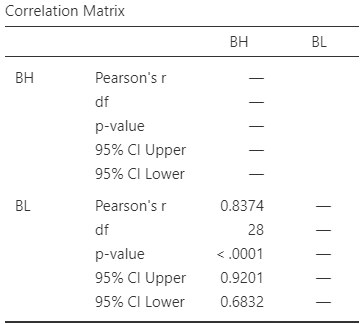
```


:::{.exercise #CorrelationExerciseSoil}
[*Dataset*: `Soils`]
The *California Bearing Ratio*\ (CBR) value is used to describe soil sub-grade for flexible pavements (such as in the design of air field runways).
@talukdar2014study examined the relationship between\ CBR and other properties of soil, including the plasticity index (PI, a measure of the plasticity of the soil).
The scatterplot and software output from $16$\ different soil samples from Assam, India, are shown in Fig.\ \@ref(fig:SoilPlotCor).

1. Describe the plot in words
1. Find and interpret the value of\ $R^2$.
1. Write down the CI for the correlation coefficient.
1. Conduct a hypothesis test for $\rho$.
1. Would the test be statistically valid?
:::


```{r SoilPlotCor, fig.cap="The relationship between CBR and PI in $16$ soil samples. Left: scatterplot. Right: software output.", fig.align="center", out.width=c("50%","5%", "40%"), fig.width=c(4, 5), fig.height=3.75, fig.show="hold"}
data(Soils) ### Exercise

plot(CBR ~ PI, 
     data = Soils,
     pch = 19,
     xlab = "Plasticity index (PI)",
     ylab = "CBR",
     main = "CBR vs PI in soil",
     las = 1,
     xlim = c(6.0, 8.5),
     ylim = c(5.5, 6.2)
     )

knitr::include_graphics("OtherImages/SPACER.png")
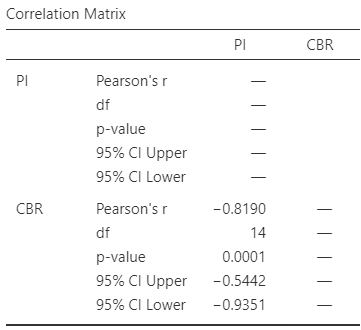

```


::: {.exercise #Apnoea}
[*Dataset*: `OSA`]
@carvalho2020stop studied obstructive sleep apnoea\ (OSA) in $60$\ adults with Down Syndrome.
The response variable $y$ is OSA severity.
The explanatory variable $x$ is the average number of episodes of sleep disruption (according to specific criteria) per hour of sleep, the Respiratory Event Index (REI).
One RQ is:

> Among Down Syndrome adults, is there a linear relationship between REI and neck size?

The data are plotted in Fig.\ \@ref(fig:OSAscatter) (left panel).

1. Using the software output (Fig.\ \@ref(fig:OSAscatter)), determine the value of $r$.
1. Interpret the value of\ $R^2$.
1. Write down the values of the intercept and the slope, and hence the regression equation.
1. Explain what the slope in the regression equation means.
1. Find an approximate $95$%\ CI for the slope.
1. Perform a hypothesis to test if a relationship exists between the variables.
1. Are the test and CI statistically valid?
:::


```{r OSAscatter, fig.show="hold", fig.width=4, fig.height = 3.25, out.width=c('45%', '54%'), fig.align="center", fig.cap="Neck circumference vs REI for Down Syndrome adults. Left: scatterplot. Right: software output."}
data(OSA) ### Exercise

plot( REI ~ Neck,
      data = OSA,
      xlab = "Neck circumference (in cm)",
      ylab = "REI",
      main = "REI vs neck circumference\nfor Down Syndrome adults",
      pch = 19,
      las = 1,
      ylim = c(0, 100),
      xlim = c(30, 50) )

knitr::include_graphics( "jamovi/OSA/OSARegression.png") 

```


```{r OSADT, fig.cap="The obstructive sleep apnoea dataset.", fig.align="center"}
if( knitr::is_html_output() ) {
  DT::datatable(OSA,
              list(scrollX = TRUE, 
                   scrollY = TRUE, 
                   ordering = FALSE),
              caption = "The Obstructive sleep apnoea dataset")
}
```


::: {.exercise #EDpatientsCI}
[*Dataset*: `EDpatients`]
@brunette1991correlation studied the relationship between the number of emergency department\ (ED) patients and the number of days following the distribution of monthly welfare monies, from\ 1986 to\ 1988 in Minneapolis, MN (Fig.\ \@ref(fig:EDScatterjamovi)).

1. Write down the estimated regression equation.
2. Interpret the slope in the regression equation.
3. Find an approximate $95$%\ CI for the slope.
4. Conduct a hypothesis test for the slope, and explain what the result means.
5. What is the value of the correlation coefficient?
:::


```{r EDScatterjamovi, fig.align = "center", fig.cap = "The number of emergency department patients, and the number of days since distribution of welfare. Left: scatterplot. Right: software output.", fig.width=3.35, fig.height=3, out.width=c("38%", "61%"), fig.show="hold"}
data(EDpatients) ### Exercise

plot( ED ~ Days,
      data = EDpatients,
      xlab = "Days after distribution",
      ylab = "Mean number patients",
      main = "Mean number of ED patients\nvs days after welfare",
      pch = 19,
      las = 2,
      xlim = c(0, 30),
      ylim = c(135, 155) )
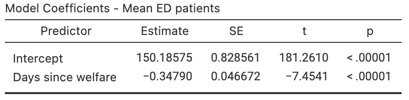
```


::: {.exercise #CorrelationRegressionExerciseBitumen}
[*Dataset*: `Bitumen`]
@data:Panda2018:Bitumen made $n = 42$ observations of hot mix asphalt, and measured the volume of air voids and the bitumen content by weight (Fig.\ \@ref(fig:BitumenPlot)).

1. Describe the plot in words.
1. For the data, $R^2 = 99.29$%. 
   Determine, and interpret, the value of\ $r$.
1. Write down the regression equation using the software output.
1. Interpret what the regression equation means.
1. Perform a test to determine if there is a relationship between the variables.
1. What is the $P$-value for testing\ $H_0$: $\rho = 0$?
1. Predict the mean percentage of air voids by volume when the percentage bitumen is\ $5.0$%. 
   Do you expect this to be a good prediction? 
   Why or why not?
1. Predict the mean percentage of air voids by volume when the percentage bitumen is\ $6.0$%. 
   Do you expect this to be a good prediction? 
1. Would the test be statistically valid?
:::


```{r BitumenPlot, fig.cap="Air voids in bitumen. Left: scatterplot. Right: software output", fig.align="center", fig.width=4.25, fig.height=3, out.width=c("45%", "54%"), fig.show="hold"}

data(Bitumen) ### Exercise

plot(AirVoids ~ Bitumen, 
     data = Bitumen,
     pch = 19,
     xlab = "Bitumen content\nby weight (%)",
     ylab = "Air voids by volume (%)",
     main = "The relationship between air voids\nand bitumen content",
     las = 1,
     xlim = c(4.7, 5.4),
     ylim = c(3.5, 5.5)
     )

###

knitr::include_graphics("jamovi/Bitumen/Bitumen-Regression.png")

```


::: {.exercise #CorrelationRegressionExercisePossums}
[*Dataset*: `Possums`]
@data:Williams2022:Possums studied Leadbeater's possums in the Victorian Central Highlands.
They recorded, among other information, the body weight of the possums (in g) and their location, including the elevation (in m; `DEM`), as shown in Fig.\ \@ref(fig:PossumPlot).

1. The value of $R^2$ is $23.0$%.
   Determine, and interpret, the value of\ $r$.
1. Write down the regression equation.
1. Determine if there is a relationship between the possum weight and the elevation.
1. What is the $P$-value for a test of $H_0$: $\rho = 0$?
1. Interpret the meaning of the slope.
1. Predict the mean weight of male possums at an elevation of\ $1\,000\ms$.
   Do you expect this to be a good prediction? 
   Why or why not?
1. Predict the mean weight of male possums at an elevation of\ $200\ms$.
   Do you expect this to be a good prediction? 
   Why or why not?
:::

```{r PossumPlot, fig.cap="The relationship between weight of possums and the elevation of their location. Left: scatterplot. Right: software output.", fig.align="center", fig.width=4.25, fig.height=3.25, out.width=c("45%", "54%"), fig.show="hold"}


data(Possums)  ### Exercise
plot(Wgt ~ DEM, 
     data = subset(Possums, Sex=="Male"),
     xlab = "Elevation (in m)",
     ylab = "Body weight (in g)",
     main = "Body weight and elevation\nfor male Leadbeaters possums",
     las = 1,
     xlim = c(600, 1600),
     ylim = c(100, 170),
     pch = 19)
abline( coef(lm(Wgt ~ DEM, 
                data = subset(Possums, Sex=="Male"))
             ),
        lwd = 2,
        col = "darkgrey")

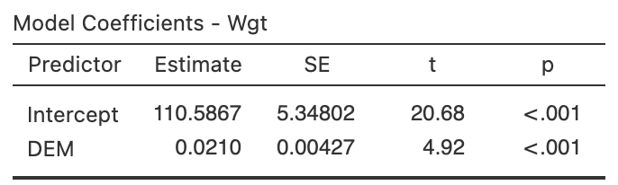
```


::: {.exercise #CorrelationExercisesGorillas}
[*Dataset*: `Gorillas`]
@wright2021chest examined $25$\ gorillas and recorded their chest-beating rates and size (the breadth of the gorillas' backs).
The relationship is shown in Fig.\ \@ref(fig:GorillaPlotCorTest).
Use the software output (Fig.\ \@ref(fig:GorillajamoviHT)) to study the relationship.

1. Determine the value of\ $r$ and\ $R^2$.
1. Perform a hypothesis test for the slope, and write a conclusion.
1. Find the regression equation.
:::


```{r GorillaPlotCorTest, fig.align = "center", fig.cap = "The scatterplot for the chest-beating data.", fig.width=7, fig.height=3.15, out.width="80%", fig.show="hold"}
data("Gorillas") ### Exercise

par(mar = c(5.1, 5.1, 4.1, 2.1))
plot(ChestBeatRate ~ BackBreadth, 
     data = Gorillas,
     las = 1,
     xlab = "Back breadth (in cm)",
     ylab = "Chest beating rate\n(per 10 hrs)",
     main = "Chest-beating rate and\nsize of gorillas",
     pch = 19,
     xlim = c(54, 66),
     ylim = c(0, 5)
)
abline( 
  coef( 
    Gorilla <- lm( ChestBeatRate ~ BackBreadth, 
                   data = Gorillas)), 
  lwd = 2, 
  col = "grey")

```


```{r GorillajamoviHT, fig.cap="Software regression output for the gorilla data.", fig.align="center", out.width=c("49%", "50%"), fig.show='hold'}
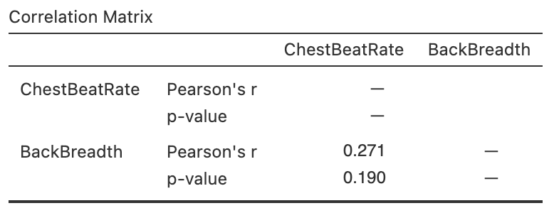
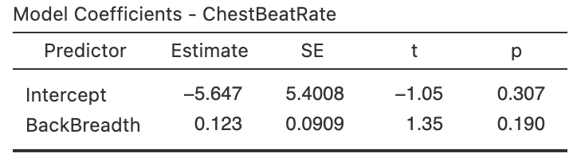
```


:::{.exercise #CorollaPrice}
[*Dataset*: `Corollas`]
On 25\ June 2014, I searched
`r if (knitr::is_latex_output()) {
   '*Gum Tree*'
} else {
   '[*Gum Tree*](https://www.gumtree.com.au)'
}` 
(an Australian online marketplace), for `Toyota Corolla` in the 'Cars, Vans \& Utes' category.
I recorded the age and the price of each (second-hand) car from the first two pages of results that were returned.

I restricted the data to cars less than\ $14$ years old at the time, removed one $13$-year-old Corolla advertised for sale for $$390\,000$, then produced the scatterplot in Fig.\ \@ref(fig:CorollasPriceAgeYear) (left panel).


(ref:CorollasScatter) The price of second-hand Toyota Corollas ($n = 38$) as advertised on *Gum Tree* on 25\ June 2014, plotted against age (left) and year of manufacture (right).

```{r CorollasPriceAgeYear, echo=FALSE, fig.cap="(ref:CorollasScatter)", fig.align="center", fig.width=9, fig.height=3.25, out.width='100%'}
data(Corollas) ### Exercise

par(mfrow = c(1, 2))

CP <- Corollas
#CP <- rbind(CP, c(2008, 13000, 6) )  ### Add as it looks better
CP <- subset( CP, Year > 2000)
CP <- subset( CP, Price < 20000) # Remove outlier
CP$PriceThous <- CP$Price/1000

mCorollas <- lm(PriceThous ~ Age,
                data = CP)

### PRICE vs AGE
plot( PriceThous ~ Age, 
      data = CP,
      xlab = "Age (in years)",
      ylab = "Price (thousands of dollars)",
      main = "Prices of second-hand Corollas\non gumtree.com.au in 2014",
      pch = 4,
      las = 1,
      xlim = c(0, 15),
      ylim = c(0, 20),
      axes = FALSE
)
axis(side = 1, 
     at = seq(0, 15, by = 2), 
     las = 1 )
axis(side = 2, 
     at = seq(0, 20, by = 5), 
     las = 1 )
rug(x = seq(0, 20, by = 1),
    side = 2)
box()

grid(ny = NULL,
     nx = NA)
abline( v = seq(0, 14,
               by = 2),
        lty = 3,
        col = "grey")

### PRICE vs YEAR

plot( PriceThous ~ Year, 
      data = CP,
      xlab = "Year of manufacture",
      ylab = "Price (thousands of dollars)",
      main = "Prices of second-hand Corollas\non gumtree.com.au in 2014",
      pch = 4,
      las = 1,
      xlim = c(2000.5, 2012),
      ylim = c(0, 20),
      axes = FALSE
)
axis(side = 1, 
     at = seq(2001, 2012, by = 1), 
     las = 2 )
axis(side = 2, 
     at = seq(0, 20, by = 5), 
     las = 1)
rug(x = seq(0, 20, by = 1),
    side = 2)
box()


```


1. Describe the relationship displayed in the graph, in words.
2. What else could influence the price of a second-hand Corolla besides the age? 
3. Consider a seven-year-old Corolla selling for $$15\,000$.
   Would this be cheap or expensive?
   Explain.
4. As stated, I removed one observation: a $13$-year-old Corolla for sale at $$390\,000$.
   What do you think the price was meant to be listed as, by looking at the scatterplot?
	 Explain.
5. `r if (knitr::is_latex_output()) {
      'With a ruler or another straight edge (such as a book), draw an estimate of the regression line on the scatterplot.'
   } else {
      'From the scatterplot, draw (if you can), or estimate by eye, an approximation of the regression line.'
   }`
   Then, *estimate* the value of\ $b_0$ (the intercept) from the line you drew.
   What does this mean?
   Do you think this value is meaningful?
6. *Estimate* the value of\ $b_1$ (the slope) from the line you drew.
   What does this mean?
   Do you think this value is meaningful?
7. From the line you drew above, write down an *estimate* of the regression equation.
8. What are the units of the intercept and the slope?
9. Use the software output (Fig.\ \@ref(fig:Corollasjamovi)) relating the price (in thousands of dollars) to age to write down the regression equation.
10. Using the software output, write down the value of\ $r$.
    Using this value of\ $r$, compute the value of\ $R^2$.
    What does this mean? 


```{r Corollasjamovi, echo=FALSE, fig.cap="The jamovi output, analysing the Corolla data", fig.align="center", out.width=c("49%","50%"), fig.show="hold"}
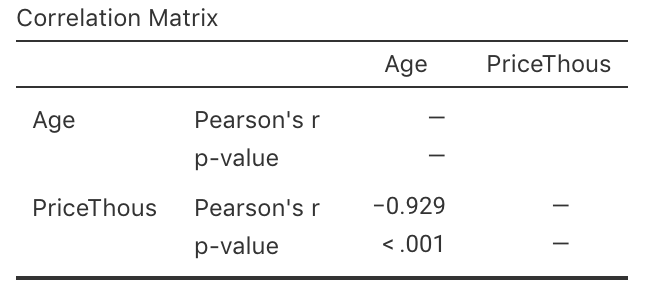
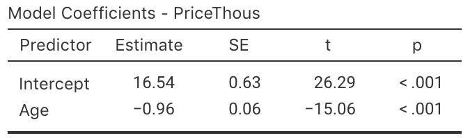
```


11. Use the regression equation from the software output to estimate the sale price of a Corolla that is $20$-years-old, and explain your answer. \tightlist
12. Using the software output, perform a suitable hypothesis test to determine if there is evidence that lower prices are associated with older Corollas.
13. Compute an approximate $95$% CI for the population slope (use the software output).
14. I could have drawn a scatterplot with Price on the vertical axis and Year of manufacture on the horizontal axis (Fig. \@ref(fig:CorollasPriceAgeYear), right panel).
    For this graph:

    a. What is the value of the correlation coefficient?
    b. How would the value of $R^2$ change (if at all)?
    c. How would the value of the slope change (if at all)?
    d. How would the value of the intercept change (if at all)?
:::


::: {.exercise #ElephantsCor}
[*Dataset*: `Elephants`]
Weighing elephants is not easy due to their size.
Height (to the shoulder) is easier to measure, and may be a useful proxy for the mass [@lalande2022sex].
Two scatterplots of some relevant data [@lalande2022sexDATA] are shown in Fig.\ \@ref(fig:ElephantPlots).

1. Which graph do you think is for males and which for female elephants?
   Explain.
1. Which plot has a correlation coefficient closest to one? 
   Explain.
1. Use software to find the correlation coefficients for each sex.
1. For which sex is the height likely to be better for estimating mass? 
   Explain.
1. Use software to find the regression equations for predicting mass from height (one for each sex).
1. Test to confirm the relationship between mass and height, for each sex.
1. Use the regression lines to predict the mass of an elephant with a height of\ $225\ms$, for each sex.
1. Discuss the statistical validity conditions.
:::


```{r ElephantPlots, echo=FALSE, fig.cap="Mass and height of elephants.", fig.align="center", fig.width=9, fig.height=3.5, out.width='100%'}
data(Elephants)  ### Exercise

par( mfrow = c(1, 2))

plot(Mass ~ Height,
     data = subset(Elephants, Sex == "A"),
     las = 1,
     ylim = c(1400, 4600),
     xlim = c(150, 300),
     main = "Mass vs Height for elephants:\nSex A",
     xlab = "Height (in m)",
     ylab = "Mass (in kg)")
plot(Mass ~ Height,
     data = subset(Elephants, Sex == "B"),
     las = 1,
     ylim = c(1400, 4600),
     xlim = c(150, 300),
     main = "Mass vs Height for elephants:\nSex B",
     xlab = "Height (in m)",
     ylab = "Mass (in kg)")
```

::: {.exercise #JeansCor}
[*Dataset*: `Jeans`]
@PuddingJeans recorded data on the size of front pockets in men's and women's jeans.
This exercise considers the correlation between the maximum widths and maximum heights of front pockets (Fig.\ \@ref(fig:JeansPocketCorrelations)). 

1. The correlation for all jeans is $r = 0.38$, with $P = 0.00051$.
   What does this mean?
2. For men's jeans only, the correlation is $r = -0.09$, with $P = 0.59$.
   What does this mean?
3. For women's jeans only, the correlation is $r = 0.14$, with $P = 0.38$.
   What does this mean?
4. Compute the means for both variables for the combined data, for men's jeans only, and for women's jeans only. 
5. From the last four questions, how would you describe the relationship between the maximum widths and maximum heights of the front pockets of jeans?\index{Simpson's paradox}\index{Confounding}
:::

```{r JeansPocketCorrelations, out.width='100%', fig.width=6, fig.height=2.5, fig.align="center", fig.cap="The relationships between minimum and maximum heights of front pockets for all jeans (left), men's jeans only (centre) and women's jeans only (right)."}
data(Jeans)  ### Exercise

par(mfrow = c(1, 3))

plot(MaxHeightFront ~ jitter(MaxWidthFront), 
     data = Jeans,
     pch = ifelse(Sex == "men", 19, 1),
     ylim = c(10, 33),
     xlim = c(12, 19),
     las = 2,
     xlab = "Max. width (front; in cm)",
     ylab = "Max. height (front; in cm)",
     main = "Mens and women's jeans"
     )
legend( "top",
        pch = c(19, 1),
        legend = c("Men", "Women"),
#        bty = "n",
        ncol = 2)
abline( lm(MaxHeightFront ~ MaxWidthFront,
           data = Jeans),
        lwd = 2,
        col = "grey")
# cor(Jeans$MaxHeightFront, 
#     Jeans$MaxWidthFront) 

plot(MaxHeightFront ~ jitter(MaxWidthFront), 
     data = subset(Jeans, Sex == "men"),
     ylim = c(10, 33),
     xlim = c(12, 19),
     las = 2,
     pch = 19,
     xlab = "Max. width (front; in cm)",
     ylab = "Max. height (front; in cm)",
     main = "Men's jeans"
     )
abline( lm(MaxHeightFront ~ MaxWidthFront,
           data = subset(Jeans, Sex == "men") ),
        lwd = 2,
        col = "grey")
# cor(Jeans$MaxHeightFront[Jeans$Sex == "men"], 
#     Jeans$MaxWidthFront[ Jeans$Sex == "men"]) 

plot(MaxHeightFront ~ jitter(MaxWidthFront), 
     data = subset(Jeans, Sex == "women"),
     las = 2,
     ylim = c(10, 33),
     xlim = c(12, 19),
     xlab = "Max. width (front; in cm)",
     ylab = "Max. height (front; in cm)",
     main = "Women's jeans"
     )
abline( lm(MaxHeightFront ~ MaxWidthFront,
           data = subset(Jeans, Sex == "women") ),
        lwd = 2,
        col = "grey")
# cor(Jeans$MaxHeightFront[Jeans$Sex == "women"], 
#     Jeans$MaxWidthFront[ Jeans$Sex == "women"]) 
```


::: {.exercise #RegressionDogsLife}
[*Dataset*: `DogsLife`]
The `DogsLife` dataset gives the average breed weight and average breed lifetime for $73$ breeds of dogs.
Determine if a relationship exists between breed weight and breed lifetime.
:::


::: {.exercise #GraphsTypingCor}
[*Dataset*: `Typing`]
The `Typing` dataset contains four variables: typing speed (`mTS`), typing accuracy (`mAcc`), age (`Age`), and sex (`Sex`) for $1\,301$\ students [@pinet2022typing].
Is there evidence of a linear relationship between a person's mean typing speed and mean accuracy?
Explain.
:::


`r if( knitr::is_latex_output() ) "\\captionsetup{font=normalsize}"`


<!-- QUICK REVIEW ANSWERS -->
`r if (knitr::is_html_output()) '<!--'`
::: {.EOCanswerBox .EOCanswer data-latex="{iconmonstr-check-mark-14-240.png}"}
**Answers to *Quick review* questions:**
**1.** True.
**2.** Not necessarily true.
**3.** True.
**4.** True.
**5.** True (*very* roughly).
**6.** False: kg/cm.
**7.** True.
**8.** True.
**9.** True.
**10.** True.
**11.** f.
**12.** b. $78\kgs$.
:::
`r if (knitr::is_html_output()) '-->'`


