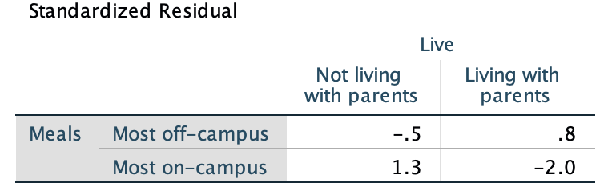
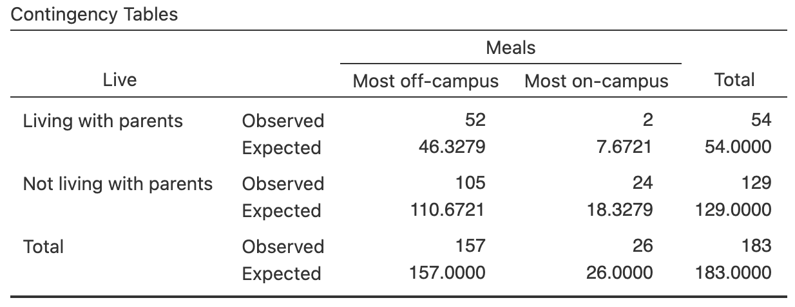
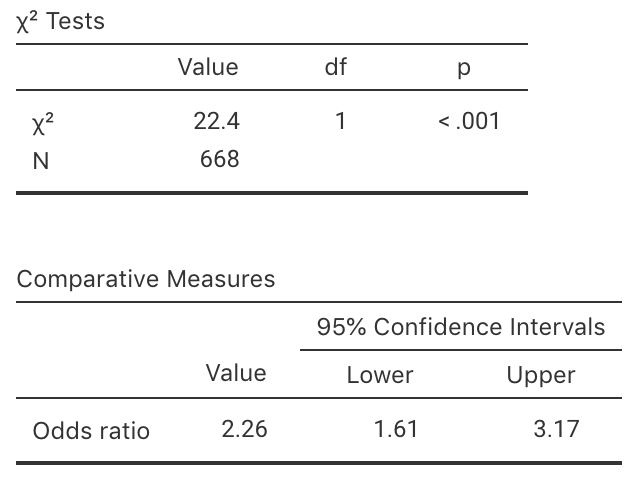
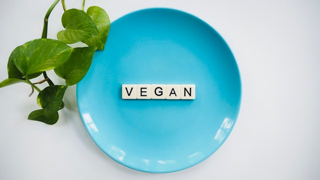
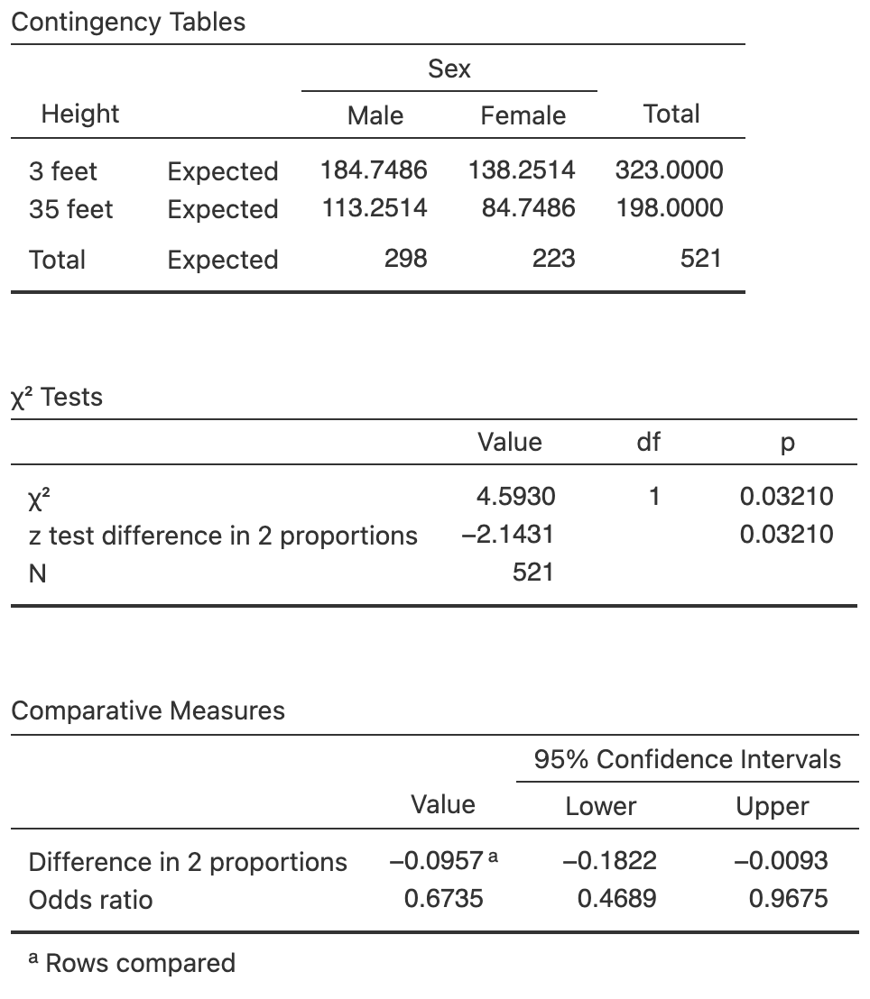
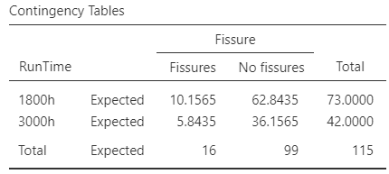

# Tests for comparing odds {#TestsOddsRatio}


<!-- Introductions; easier to separate by format -->
```{r, child = if (knitr::is_html_output()) {'./introductions/33-Testing-OddsRatios-HTML.Rmd'} else {'./introductions/33-Testing-OddsRatios-LaTeX.Rmd'}}
```


## Introduction: Meals on-campus {#MealsOnCampus}


<div style="float:right; width: 222x; border: 1px; padding:10px">

</div>


`r if (knitr::is_html_output()) '<!--'`
\begin{wrapfigure}[6]{R}{.25\textwidth}
  \begin{center}
    \includegraphics[width=.20\textwidth]{Illustrations/pexels-startup-stock-photos-7096.jpg}
  \end{center}
\end{wrapfigure}
`r if (knitr::is_html_output()) '-->'`


In Sect. \@ref(OddsRatioIntro) a study [@data:Mann12017:UniStudents] was introduced to examine the eating habits of university students.
Researchers classified $n = 183$ students into groups according to two qualitative variables (Table \@ref(tab:MealsDataTableHT)):

* Where they live: With their parents, or not with their parents;
* Whether they eat most of their meals *off-campus*, or most of their meals *on-campus*.


::: {.importantBox .important data-latex="{iconmonstr-warning-8-240.png}"}
The two groups (either students who live with parents or do *not* live with parents; or students who eat most meals at home or do *not*) contain different students.
Hence, the comparison here is **between** individuals.
:::


```{r MealsDataTableHT, echo=FALSE}
Counts <- c(52, 105, 2, 24)
Live <- rep( c(1, 2), 2)
Live <- ordered(Live,
                levels = 1:2,
                labels = c("Lives with parents", 
                           "Doesn't live with parents") )
Meals <- c( rep(1, 2), 
            rep(2, 2))
Meals <- ordered(Meals, 
                 levels = 1:2,
                 labels = c("Most off-campus", 
                            "Most on-campus"))

Eating <- data.frame( Counts = Counts,
                      Live = Live,
                      Meals = Meals)

Eating.tab <- Eating.tab.Counts <- xtabs(Counts ~ Meals + Live + Meals, 
                                         data = Eating)

Eating.tab <- cbind( Eating.tab, 
                     "Total" = rowSums(Eating.tab))
Eating.tab <- rbind( Eating.tab, 
                     "Total" = colSums(Eating.tab))


if( knitr::is_latex_output() ) {
  kable(Eating.tab,
        format = "latex",
        booktabs = TRUE,
        longtable = FALSE,
        align = "r",
        caption = "Where university students live and eat"
  ) %>%
     column_spec(4, bold = TRUE)  %>%
     row_spec(3, bold = TRUE) %>%
     row_spec(0, bold = TRUE) %>%
	kable_styling(font_size = 10)
 }


 if( knitr::is_html_output() ) {
  out <- kable(Eating.tab,
               format = "html",
               booktabs = TRUE,
               longtable = FALSE,
               align ="r",
               caption = "Where university students live and eat"
  ) 
  if ( knitr::is_html_output(excludes = "epub")) {
    column_spec(out, 4, bold = TRUE) %>%
     row_spec(3, bold = TRUE)
  } else {
    out
  }
     
 }    
```

Since both qualitative variables have two levels, the table is a $2\times 2$ table.
A **graphical summary** is shown in Fig. \@ref(fig:EatingGraphs), and a **numerical summary** in Table \@ref(tab:EatingNumericalSummaryHT).
(The details of the computations appear in Sect. \@ref(OddsRatioIntro)).


```{r echo=FALSE}
UniS <- matrix( ncol = 2,
                data = c(52, 2, 105, 24), 
                byrow = TRUE)
rownames(UniS) <- c("Lives\nwith parents", 
                    "Doesn't live\nwith parents")
colnames(UniS) <- c("Most meals off-campus", 
                    "Most meals on-campus")
```


```{r EatingNumericalSummaryHT, echo=FALSE}
EatingNumericalSummary <- array( dim = c(3, 3))

EatingNumericalSummary[1, ] <- c(round(UniS[1,1]/UniS[1,2], 4),
                                 round(UniS[1,1]/sum(UniS[1,]) * 100, 1),
                                 sum(UniS[1,]) )
EatingNumericalSummary[2, ] <- c(round(UniS[2,1]/UniS[2,2], 4),
                                 round(UniS[2,1]/sum(UniS[2,]) * 100, 1),
                                 sum(UniS[2,]) )
EatingNumericalSummary[3, ] <- c(round( (UniS[1, 1] / UniS[1, 2] ) / (UniS[2, 1] / UniS[2, 2]), 3), 
                                 "",
                                 "")
rownames(EatingNumericalSummary) <- c("Living with parents",
                                      "Not living with parents",
                                      "Odds ratio")
    
if( knitr::is_latex_output() ) {
  kable(EatingNumericalSummary,
        format = "latex",
        longtable = FALSE,
        booktabs = TRUE,
        #align=c(">{\\raggedleft\\arraybackslash}p{38mm}", ">{\\raggedleft\\arraybackslash}p{38mm}", "r"),
        col.names = c("Odds of having most\n meals off-campus",
                      "Percentage having most\n meals off-campus", 
                      "Sample size"),
       caption = "The odds and percentage of university students eating most meals off-campus" 
  ) %>%
     row_spec(2, hline_after = TRUE) %>%
     row_spec(0, bold = TRUE) %>%
	 kable_styling(font_size = 10) %>%
    column_spec(1, width = "35mm") %>%
    column_spec(2, width = "33mm") %>%
    column_spec(3, width = "33mm") %>%
    column_spec(4, width = "15mm")
}
if( knitr::is_html_output() ) {
  out <- kable(EatingNumericalSummary,
               format = "html",
               longtable = FALSE,
               booktabs = TRUE,
               align = c("r", "r", "r"),
               col.names = c("Odds of having most\n meals off-campus", 
                             "Percentage having most\n meals off-campus", 
                             "Sample size"),
               caption = "The odds and percentage of university students eating most meals off-campus"
  )
  if ( knitr::is_html_output(excludes = "epub")) {
    kable_styling(out, full_width = FALSE)
  } else {
    out
  }
   
}
```


The parameter is the population OR, comparing the odds of eating most meals *off*-campus for students living with their parents to students *not* living with their parents.


::: {.softwareBox .software data-latex="{iconmonstr-laptop-4-240.png}"}
Understanding how software computes the odds ratio is **very** important for understanding the output.  
In jamovi and SPSS, the odds ratio can be interpreted in *either* of these two ways (i.e., both are correct):
  
* The *odds* are the odds of eating most meals *off-campus* (Row 1 of Table \@ref(tab:MealsDataTableHT)).
  Then, the odds ratio compares these odds for students living with their parents (Column 1 of Table \@ref(tab:MealsDataTableHT)) to those *not* living with their parents (Row 2 of Table \@ref(tab:MealsDataTableHT)).   
  That is, the odds are $52/2 = 26$ (for those living with parents) and  $105/24 = 4.375$ (for those not living with parents), so the OR is then $26/4.375 = 5.943$, as in the output (jamovi: Fig. \@ref(fig:UniMealsTestOutputHTjamovi); SPSS: Fig. \@ref(fig:UniMealsTestOutputHTSPSS)).

* The *odds* are the odds of living with parents (Column 1 of Table \@ref(tab:MealsDataTableHT)).
  Then, the odds ratio compares these odds for students eating most meals off-campus (Row 1 of Table \@ref(tab:MealsDataTableHT)) to the odds of students eating most meals on-campus (Row 2 of Table \@ref(tab:MealsDataTableHT)).  
  That is, the odds of living with parents are $52/105 = 0.49524$ (for those eating most meals off-campus) and $2/24 = 0.083333$ (for those eating most meals on-campus), so the OR is then $0.49524/0.083333 = 5.943$, as in the output (jamovi: Fig. \@ref(fig:UniMealsTestOutputHTjamovi); SPSS: Fig. \@ref(fig:UniMealsTestOutputHTSPSS)).
  
In other words, the odds and odds ratios are relative to the first row or first column.
:::


Unlike the previous decision-making RQs, this RQ does not concerns means.
Instead,  the RQ can be written in terms of comparing proportions, odds, or odds ratios.
Usually the odds ratio (OR) is used as the parameter; one reason is that software produces output related to testing the OR. 
Using the OR,  the RQ could be written as

> Is the *population odds ratio* of eating most meals off-campus, comparing students who live *with their* parents to students *not living with* their parents, equal to one?

Alternatively, but probably easier to understand, is to write the RQ in terms of comparing the odds in the two groups explicitly:

> Are the *population odds* of students eating most meals off-campus the same for students *living with* their parents and for students *not living with* their parents?

The RQ can also be worded as comparing the percentages (or proportions) of students eating meals off-campus in each group. 
This is equivalent to the RQs above, but is not directly related to the software output, which works with odds ratios.

Another alternative, which sounds less direct but is useful for two-way tables larger than $2\times 2$ (Sect. \@ref(ORTestDumping)), is worded in terms of *relationships* or *associations* between the variables:

> Is there a relationship (or association) between where students eat most of their meals and whether or not the student lives with their parents?

All of these are equivalent.
Usually, for $2 \times2$ tables, working with *odds* or *odds ratios* is best, because most software (including jamovi and SPSS)  readily produces CIs for the odds ratio.


## Hypotheses and notation: Comparing odds

For two-way tables of counts, the *parameter* is the population odds ratio.
As usual, the null hypothesis is the 'no difference, no change, no relationship' position. 
So in this context:

* $H_0$: The *population* OR is one; or (equivalently):  The *population* odds are the same in each group.

This hypothesis proposes that the *sample* odds are not the same due to sampling variation.
This is the initial **assumption**.

The alternative hypothesis is

* $H_1$: The *population* OR is not one; or (equivalently):  The *population* odds are *not* the same in each group.

The alternative hypothesis is *always* two-tailed for analysing two-way tables of counts.


::: {.importantBox .important data-latex="{iconmonstr-warning-8-240.png}"}
For analysing two-way tables of counts, the alternative hypotheses **are always two-tailed**.
:::


The hypotheses can also be written in terms of differences in percentages (or proportions), though the software output is usually expressed in terms of odds.
The hypotheses can also be written in terms of associations:

* $H_0$: In the *population*, there is *no association* between the two variables
* $H_1$: In the *population*, there is *an association* between the two variables


::: {.importantBox .important data-latex="{iconmonstr-warning-8-240.png}"}
The RQ and hypothesis only needs to be given in *one* of these ways.
The RQ and hypotheses should be consistent; for example, if the RQ is written in terms of odds, the hypotheses should be written in terms of odds.
:::


As usual, following the [decision-making process](#DecisionMaking), start by **assuming** that the null hypothesis is true: that the *population* odds ratio is one.


## Expected values: Comparing odds {#ExpectedValues}

Assuming that the odds of having most meals off-campus is the same for both groups (that is, the population OR is one), how would the sample OR be **expected** to vary from sample to sample just because of *sampling variation*?
If the population OR was one, the odds are the same in both groups; equivalently, the percentages are the same in both groups.
That is, the percentage of students eating most meals off-campus is the same for students *living with* and *not living with* their parents.

Let's consider the implication.
From Table \@ref(tab:MealsDataTableHT), 157 students out of 183 ate most meals off-campus, so that

\[
   \frac{157}{183} \times 100 = 85.79\%
\]
of the students in the entire sample  ate most of their meals off-campus.

If the percentage of students who eat most of their meals off-campus is the *same* for those who live with their parents and those who don't, then we'd **expect** 85.79% of students in *both* groups to be equal to this value.
That is, we would expect

* 85.79% of the 54 students (that is, 46.33) who *live with their parents* to eat most meals off-campus; and
* 85.79% of the 129 students (that is, 110.67) who *don't live with their parents* to eat most meals off-campus.

In ther words, the percentage (and hence the odds) is the same in each group.
Those are the numbers that are *expected* to appear if the percentage was exactly the same in each group (Table \@ref(tab:MealsDataTableHTExpected)), if the null hypothesis (the assumption) was true.


::: {.thinkBox .think data-latex="{iconmonstr-light-bulb-2-240.png}"}
Consider the expected counts in Table \@ref(tab:MealsDataTableHTExpected).
Confirm that the *odds* of having most meals off-campus is the same for students living with their parents, and for students not living with their parents.
:::

How do those *expected values* compare to what was *observed*?

* 46.33 of the 54 students who *live with their parents* are **expected** to eat most meals off-campus; yet we observed 52.
* 110.67 of the 129 students who *don't live with their parents* are **expected** to eat most meals off-campus; yet we observed 105.

The observed and expected counts are similar, but not the exactly same.
The difference between what the observed and expected counts may be explained by sampling variation (that is, the null hypothesis explanation).


::: {.importantBox .important data-latex="{iconmonstr-warning-8-240.png}"}
You do not have to compute the expected values when you answer one of these types of RQs (software does it for you in the background).
However, seeing how the decision-making process works in this context is helpful.
:::


When discussing previous hypothesis tests, the *sampling distribution* of the sample statistic (in this case, the sampling distribution of the sample odds ratio) was described, and this sampling distribution had an approximate normal distribution (whose standard deviation is called the *standard error*).
However, the sampling distribution of the odds ratio is more involved^[For those interested: The *logarithm* of the sample ORs have an approximate normal distribution, and a *standard error*.] so will not be presented.


```{r MealsDataTableHTExpected, echo=FALSE}
Eating.tab.ExpCounts <- chisq.test(Eating.tab[1:2, 1:2])$expected
Eating.tab.ExpCounts <- cbind( Eating.tab.ExpCounts, 
                               "Total" = round( rowSums(Eating.tab.ExpCounts)) )
Eating.tab.ExpCounts <- rbind( Eating.tab.ExpCounts, 
                               "Total" = round( colSums(Eating.tab.ExpCounts)) )

if( knitr::is_latex_output() ) {
  kable(Eating.tab.ExpCounts,
        format = "latex",
        booktabs = TRUE,
        longtable = FALSE,
        digits = 2,
        align = "r",
        caption = "Where university students live and eat: Expected counts"
  ) %>%
     column_spec(4, bold = TRUE)  %>%
     row_spec(3, bold = TRUE) %>%
     row_spec(0, bold = TRUE) %>%
	kable_styling(font_size = 10)
}
if( knitr::is_html_output() ) {
  out <- kable(Eating.tab.ExpCounts,
               format = "html",
               booktabs = TRUE,
               longtable = FALSE,
               digits = 2,
               align = "r",
               caption = "Where university students live and eat: Expected counts"
  )
  if ( knitr::is_html_output(excludes = "epub")) {
     column_spec(out, 4, bold = TRUE)  %>%
     row_spec(3, bold = TRUE)
  } else {
    out
  }
     
 }        
```


## The test statistic: Comparing odds {#TestStatObs}

The [decision-making process](#DecisionMaking) compares what is *expected* from the sample statistic if the null hypothesis about the parameter is true (Table \@ref(tab:MealsDataTableHTExpected)) to what is **observe** in the sample (Table \@ref(tab:MealsDataTableHT)).
Previously, when the summary statistics were means, $t$-tests were used.
However, these data are not summarised by means, and a different test statistic is used.

Rather than using a $t$-score as the *test-statistic*, the test-statistic here is a 'chi-squared' statistic,  written $\chi^2$.
A $\chi^2$ statistic measures the overall size of the differences between the expected counts and observed counts, over the entire table.


:::: {.pronounceBox .pronounce data-latex="{iconmonstr-microphone-7-240.png}"}

::: {style="display: flex;"}
The Greek letter $\chi$ is pronounced 'ki', as in **ki**te.  
The test statistic $\chi^2$ is pronounced as 'chi-squared'.
:::


::: {}
```{r, echo=FALSE}
htmltools::tags$video(src = "./Movies/chi.mp4", 
                      width = "121", 
                      loop = "FALSE", 
                      controls = "controls", 
                      loop = "loop", 
                      style = "padding:5px; border: 2px solid gray;")
```
:::

::::


From the software (jamovi: Fig. \@ref(fig:UniMealsTestOutputHTjamovi); SPSS: Fig. \@ref(fig:UniMealsTestOutputHTSPSS)), $\chi^2 = 6.934$.
In a $2\times 2$ table of counts (when the 'degrees of freedom', or `df`, is equal to 1, as shown in the computer output), the *square root* of the $\chi^2$ value is  approximately equivalent to a $z$-score. 
So here, the equivalent $z$-score is about $\sqrt{6.934} = 2.63$, which is fairly large: a small $P$-value is expected.

More generally, for two-way tables of any size,

\[
  \sqrt{\chi^2 \div \text{df}}
\]
is like a $z$-score, where df is the 'degrees of freedom' (related to the size of the table^[For those interested: the degrees of freedom in a two-way table is the number of rows of data minus one, times the number of columns of data minus one. So, for a $2\times 2$ table, the degrees of freedom is $(2 - 1) \times (2 - 1) = 1$.]), as shown in the software output.
This allows a $P$-value to be estimated using the 68--95--99.7 rule from the value of the $\chi^2$ statistic.


```{r UniMealsTestOutputHTjamovi, echo=FALSE, fig.show="hold", fig.cap="The jamovi output for computing a CI and conducting a test", fig.align="center", out.width="70%"}
knitr::include_graphics( "jamovi/UniStudents/UniStudents-Chisq-All.png")
```


```{r UniMealsTestOutputHTSPSS, echo=FALSE, fig.show="hold", fig.cap="The SPSS output for computing a CI and conducting a test", fig.align="center", out.width="75%"}
knitr::include_graphics( "SPSS/UniStudents/UniStudents-Chisq-CI.png")
```


::: {.tipBox .tip data-latex="{iconmonstr-info-6-240.png}"}
In a chi-squared test, with a given number of 'degrees of freedom' (written `df` in the software output), the value of
\[
  \sqrt{ \chi^2 \div {\text{df}}}
\]
is like a $z$-score.
This allows the $P$-value to be estimated using the [68--95--99.7 rule](#def:EmpiricalRule).
:::


## $P$-values: Comparing odds

The differences between the observated sample statistic (the sample OR) and the hypothesised population parameter (the population OR of one) is summarised by $\chi^2 = 6.934$, approximately equivalent to $z = 2.63$.
Using the [68--95--99.7 rule](#def:EmpiricalRule), a small $P$-value is expected.

The corresponding two-tailed $P$-value reported by jamovi (Fig. \@ref(fig:UniMealsTestOutputHTjamovi), under the `p` column) and SPSS (Fig. \@ref(fig:UniMealsTestOutputHTSPSS), in the `Asymptotic Significance (2-sided)` column and `Pearson Chi-Square` row) is very small: $0.008$ to three decimals.

   
::: {.importantBox .important data-latex="{iconmonstr-warning-8-240.png}"}
Recall that, for two-way tables of counts, the alternative hypotheses *are always two-tailed*, so a two-tailed $P$-value is always reported.
:::


<iframe src="https://learningapps.org/watch?v=ptw49fp0322" style="border:0px;width:100%;height:600px" allowfullscreen="true" webkitallowfullscreen="true" mozallowfullscreen="true"></iframe>


`r if (knitr::is_latex_output()) '<!--'`
::: {.thinkBox .think data-latex="{iconmonstr-light-bulb-2-240.png}"}
`r if (knitr::is_html_output()){
  'Click on the hotspots in the following image, and describe what the jamovi output tells us.'
}`


<iframe src="https://learningapps.org/watch?v=p54msvghc22" style="border:0px;width:100%;height:500px" allowfullscreen="true" webkitallowfullscreen="true" mozallowfullscreen="true"></iframe>
:::
`r if (knitr::is_latex_output()) '-->'`


## Conclusions: Comparing odds

As usual, a very small $P$-value ($0.008$ to three decimals) means there is [very strong evidence](#tab:PvaluesInterpretation) supporting $H_1$: the evidence suggests a difference in the *population* odds in the two groups.
We write:

> The *sample* provides strong evidence ($\chi^2 = 6.934$; two-tailed $P = 0.008$) that the odds in the *population* of having most meals off-campus is different for 
> students living with their parents (odds: 26) and students *not* living with their parents (odds: 4.375; OR: $5.94$; 95% CI from $1.35$ to $26.1$).

Again, as seen in Sect. \@ref(WordingConclusion), the conclusion includes three components:
The *answer to the RQ*; the *evidence* used to reach that conclusion  ('$\chi^2 = 6.934$; two-tailed $P = 0.008$'); and some *sample summary statistics*  (inclding the 95% CI for the odds ratio).

The conclusion also makes clear what the odds and the odds ratio *mean*.
The odds are describing as the 'odds... of having most meals off-campus', and the OR as then comparing these odds between 'students living with their parents...  and students *not* living with their parents'.


::: {.importantBox .important data-latex="{iconmonstr-warning-8-240.png}"}
For two-way tables, RQs are best framed in terms of ORs or odds (but can be framed in terms of proportions or percentages, or associations or relationships).
\smallskip

For consistency: if the RQ is about the odds ratio, the hypotheses and conclusion should be about the odds ratio; if the RQ is about odds, the hypotheses and conclusion should be about the odds; and so on.
:::
      

<!-- ## Standardised residuals -->


<!-- The $\chi^2$ value, and hence the $P$-value, tells us  -->
<!-- *if* there is evidence that a difference exists. -->
<!-- It does not tell us *where* the difference lies, or *what* the difference is. -->
<!-- (That is, it doesn't tell us if students who live with their parents -->
<!-- are more likely to eat meals *on-* or *off-*campus.) -->
<!-- In $2\times2$ tables, -->
<!-- this is rarely hard to determine, -->
<!-- but in other size two-way table (such as a $4\times 3$ table, for example) it can be more challenging. -->
<!-- To help determine where the difference are located, -->
<!-- we can ask SPSS^[Using `Analyze> Descriptive Statistics> Crosstabs...`, and then in the `Cells` tab select `Residuals> Standardized`.] to produce  -->
<!-- *standardized residuals* -->
<!-- (Table \@ref(fig:UniMealsTestSPSSStdRes)). -->


<!-- ```{r UniMealsTestSPSSStdRes, echo=FALSE, fig.cap="The standardized residuals from SPSS for the two-way table for the uni-students eating data", fig.align="center", out.width="60%"} -->
<!--  -->
<!-- ``` -->


<!-- Standardised residuals are like $z$-scores, -->
<!-- so that cells in the table with a standardized residual larger than about $2$ -->
<!-- mean that the observed counts were *higher* than we would have expected, -->
<!-- and -->
<!-- that cells in the table with a standardized residual smaller than about $-2$ -->
<!-- mean that the observed counts were *smaller* than we would have expected. -->
<!-- So for the uni-student data -->
<!-- (Table \@ref(fig:UniMealsTestSPSSStdRes)), -->
<!-- we can find the largest and smallest standardized residuals: -->

<!-- * $-2.0$: Students *living with their parents* are *less likely* (because the residual is *negative*) to eat most meals on-campus -->
<!--    (compared to what we'd expect by chance). -->
<!-- * $1.3$: Students *not living with their parents*  are *more likely* (because the residual is *positive*) to eat mostmeals on-campus -->
<!--    (compared to what we'd expect by chance); -->

<!-- So while the $\chi^2$-square suggests there is a difference, -->
<!-- the standardised residuals tells us *how* they are different: -->
<!-- students living *with* their parents are -->
<!-- *less* likely to eat most meals on-campus. -->
<!-- Again, -->
<!-- standardized residuals may not be needed here to reach these conclusions, -->
<!-- but they can be used in larger two-way tables -->
<!-- (for example,  -->
<!-- see Sect. \@ref(ORTestDumping)). -->


## Statistical validity conditions {#Validity-Test-ChiSq}

As usual, these results hold [under certain conditions](#exm:StatisticalValidityAnalogy).
The test above is statistically valid if: 

* All *expected* counts are at least five.

Some books may give other (but similar) conditions.

The statistical validity condition refers to the *expected* (not the *observed*) counts.
SPSS tells us if a problem exists with the expected count condition, underneath the *first* output table in Fig.&nbsp;\@ref(fig:UniMealsTestOutputSPSS).
In jamovi, the *expected* counts must be explicitly requested to see if this condition is satisfied (Fig. \@ref(fig:UniMealsTestExpectedjamovi)).


```{r UniMealsTestExpectedjamovi, echo=FALSE, fig.cap="The expected values, as computed in jamovi", fig.align="center", out.width="65%"}

```

For the student-eating data, the smallest *observed* count is 2 (living with parents; most meals off-campus), but the smallest *expected* count is 7.67, which is greater than five.
The size of the *expected* counts is important for  the statistical validity condition.


::: {.example #StatisticalValidityEatingHT name="Statistical validity"}
For the university-student eating data, *all* the cells have an expected count of at least five so the statistical validity condition is satisfied.
:::


```{r echo=FALSE}
PB <- structure(list(LC = structure(c(1L, 1L, 2L, 2L), .Label = c("Adults with lung cancer", 
"Adults without lung cancer"), class = "factor"), Pets = structure(c(1L, 
2L, 1L, 2L), .Label = c("Kept pet birds", "Did not keep pet birds"
), class = "factor"), Counts = c(98, 141, 101, 328)), .Names = c("LC", 
"Pets", "Counts"), row.names = c(NA, -4L), class = "data.frame", variable.labels = structure(character(0), .Names = character(0)), codepage = 28591L)

PB2 <- xtabs( Counts ~ Pets + LC, data=PB)

PB2.exp <- chisq.test(PB2)$expected 
```


## Example: Pet birds {#ExampleHTPetBirds}


<div style="float:right; width: 222x; border: 1px; padding:10px">

</div>


A study examined people with lung cancer, and a matched set of similar controls who did not have lung cancer, and compared the proportion in each group that had pet birds [@data:Kohlmeier1992:BirdsCancer].
These data were studied in Sect. \@ref(PetBirdsOR); the data are shown again in Table \@ref(tab:BirdsData2), and the numerical summary in Table \@ref(tab:BirdsDataSummary) (the computations are shown in Sect. \@ref(PetBirdsOR)).


```{r BirdsData2,  echo=FALSE}
PB2T <- cbind( PB2, 
               "Total" = rowSums(PB2))
PB2T <- rbind( PB2T, 
               "Total" = colSums(PB2T))

if( knitr::is_latex_output() ) {
  kable(PB2T,
        format = "latex",
        booktabs = TRUE,
        longtable = FALSE,
        caption = "The pet bird data") %>% 
    column_spec(4, bold = TRUE) %>%
    row_spec(3, bold = TRUE) %>%
    row_spec(0, bold = TRUE) %>%
    kable_styling(font_size = 10)
}
if( knitr::is_html_output() ) {
  out <- kable(PB2T,
               format = "html",
               booktabs = TRUE,
               longtable = FALSE,
               caption = "The pet bird data")
  if ( knitr::is_html_output(excludes = "epub")) {
     column_spec(out, 4, bold = TRUE) %>%
     row_spec(3, bold = TRUE)
  } else {
    out
  }
     
}
```

One RQ in the study was:

> Are the **odds** of having a pet bird the same for people *with* lung cancer (cases) and for people *without* lung cancer (controls)?

The parameter is the population OR, comparing the odds of keeping a pet bird, for adults with lung cancer to adults who do not have lung cancer.


::: {.tipBox .tip data-latex="{iconmonstr-info-6-240.png}"}
The RQ could also be written as:
  
*  Is the **percentage** of people having a pet bird the same for people *with* lung cancer (cases) and for people *without* lung cancer (controls)?
*  Is the **odds ratio** of people having a pet bird, comparing people *with* lung cancer (cases) and for people *without* lung cancer (controls), equal to one?
*  Is there a **relationship** between having a pet bird and having lung cancer?
  
Of these, the first is probably the easiest to understand.
:::


From this RQ (which is written in terms of *odds*), the hypotheses could be written as:

* $H_0$: The *odds* of having a pet bird is *the same* for people *with* lung cancer (cases) and for people *without* lung cancer (controls).
* $H_1$: The *odds* of having a pet bird is *not the same* for people *with* lung cancer (cases) and for people *without* lung cancer (controls).


::: {.tipBox .tip data-latex="{iconmonstr-info-6-240.png}"}
The null hypothesis could also be written as:
  
*  The **percentage** of people having a pet bird is *the same* for people *with* lung cancer (cases) and for people *without* lung cancer (controls).
*  The **odds ratio** of people having a pet bird, comparing people *with* lung cancer (cases) and for people *without* lung cancer (controls), is equal to one.
*  There is **no relationship** between having a pet bird and having lung cancer.
  
Of these, the first is probably the easiest to understand.
:::


Begin by **assuming** the null hypothesis is true: no difference exists between the odds in the *population*.
Based on this assumption, the **expected** counts can be found.
From the data (Table \@ref(tab:BirdsData2)), overall $199\div 668 = 29.79$% of people own a pet bird.

If there really was no difference in the odds (or the percentages) of owning a pet bird between those with and without lung cancer, about $29.79$% of the people in *both* lung cancer groups are **expected** to own a pet bird.
 

```{r BirdsDataSummary,  echo=FALSE}
PBsummary <- array( dim = c(3, 3) )

colnames(PBsummary) <- c( "Odds of keeping pet bird",
                          "Percentage keeping pet bird",
                          "Sample size")
rownames(PBsummary) <- c("With lung cancer:",
                         "Without lung cancer:",
                         "Odds ratio:")
  
  
PBsummary[1, ] <- c("0.6950", 
                    "41.0%", 
                    "239")
PBsummary[2, ] <- c("0.3079", 
                    "25.5%", 
                    "429")
PBsummary[3, ] <- c("2.26", 
                    "", 
                    "")


if( knitr::is_latex_output() ) {
  kable(PBsummary,
        format = "latex",
        booktabs = TRUE,
        longtable = FALSE,
        #align=c("p{28mm}", "p{28mm}", "c"),
        caption = "The odds and percentage of subjects keeping pet birds") %>%
    row_spec(0, bold = TRUE) %>%
    row_spec(2, hline_after = TRUE) %>%
    kable_styling(font_size = 10)
}
if( knitr::is_html_output() ) {
  kable(PBsummary,
        format = "html",
        booktabs = TRUE,
        longtable = FALSE,
        align = c("l", "r", "c"),
        caption = "The odds and percentage of subjects keeping pet birds")
}
```

About 29.79% of the 239 lung-cancer cases (or 71.20) would be expected to have a pet bird, and about 29.79% of the 429 non-lung-cancer cases (or 127.80) would be expected to have a pet bird.
A table of these *expected counts* (Table \@ref(tab:PetBirdsExpected)) shows that all expected counts are greater than five.
In practice, you do not need to compute the expecte counts; software does this automatically.


```{r PetBirdsExpected,  echo=FALSE}
PBExp <- PB2T 

PBExp[1, ] <- c(71.20, 
                127.80, 
		199)
PBExp[2, ] <- c(167.80,
                301.20, 
		469) 

if( knitr::is_latex_output() ) {
  kable(PBExp,
        format = "latex",
        booktabs = TRUE,
        longtable = FALSE,
        caption = "The expected counts for the pet bird data, if the proportion owning pet birds was the same for lung cancer cases and non-lung-cancer cases") %>%
   column_spec(4, bold = TRUE) %>%
   row_spec(3, bold = TRUE) %>%
   kable_styling(font_size = 10)
}
if( knitr::is_html_output() ) {
  out <- kable(PBExp,
               format = "html",
               booktabs = TRUE,
               longtable = FALSE,
               caption = "The expected counts for the pet bird data, if the proportion owning pet birds was the same for lung cancer cases, and non-lung-cancer cases")
  if ( knitr::is_html_output(excludes = "epub")) {
     column_spec(out, 
                 4, 
		 bold = TRUE) %>%
     row_spec(3, bold = TRUE)
  } else {
    out
  }
     
}
```
            
         
The numbers in Table \@ref(tab:PetBirdsExpected) are what is *expected*, *if* the percentage of people owning a pet bird is the same for lung cancer and non-lung cancer cases.
How close are the expected and observed counts (in Table \@ref(tab:BirdsData2))?

To compare the sample statistic (what we **observed**) with the hypothesised population parameter, software is used to compute the value of $\chi^2$ (jamovi: Fig. \@ref(fig:PetBirdsjamovi); SPSS: Fig. \@ref(fig:PetBirdsSPSS)): $\chi^2 = 22.374$, approximately equivalent to a $z$-score of

\[
  \sqrt{22.374/1} = 4.730,
\]
which is very large.
Hence, a small $P$-value is expected.

The software shows that the $P$-value is very small ($P < 0.001$).
As usual, a small $P$-value means that there is [very strong evidence](#tab:PvaluesInterpretation) supporting $H_1$, if $H_0$ is assumed true.
That is, the evidence suggests there is a *difference* in the odds in the *population*.
We write:

> The *sample* provides very strong evidence ($\chi^2 = 22.374$; two-tailed  $P < 0.001$) that the odds in the *population* of having a pet bird is not the same for people with lung cancer (odds: 0.695) and for people without lung cancer (odds: 0.308; OR: $2.26$; 95% CI from $1.6$ to $3.2$).


```{r PetBirdsjamovi, echo=FALSE, fig.show="hold", fig.cap="jamovi output for the pet-birds data", fig.align="center", out.width="80%"}
 
```


```{r PetBirdsSPSS, echo=FALSE, fig.show="hold", fig.cap="SPSS output for the pet-birds data", fig.align="center", out.width="75%"}
knitr::include_graphics("SPSS/PetBirds/Pets-Chisq-OR.png") 
```


::: {.thinkBox .think data-latex="{iconmonstr-light-bulb-2-240.png}"}
This doesn't imply that owning a pet bird *causes* lung cancer.
Why not?

`r if (knitr::is_latex_output()) '<!--'`
`r webexercises::hide()`
Because the study *observational*. 
Confounders may explain the relationship (can you think of one?).
In addition, maybe having lung cancer means that people seek companionship in the form of a pet.
`r webexercises::unhide()`
`r if (knitr::is_latex_output()) '-->'`
:::


## Example: B12 deficiency {#B12Deficiency}


<div style="float:right; width: 222x; border: 1px; padding:10px">

</div>


A study in New Zealand [@data:Gammon2012:B12] asked:

> Among a certain group of women, are the odds of being vitamin B12 deficient different for women on a vegetarian diet compared to women on a non-vegetarian diet?

The population was 'predominantly overweight/obese women of South Asian origin living in Auckland'.
The RQ could be worded in terms of odds ratios or proportions, too.
To test the claim, the statistical hypotheses are:
 
* $H_0$: $\text{population odds for vegetarians} = \text{population odds for non-vegetarians}$:
  The odds of B12 deficiency are the same in both groups.
* $H_1$:  $\text{population odds for vegetarians} \ne \text{population odds for non-vegetarians}$:
  The odds of B12 deficiency are *not* the same in both groups.

The parameter is the population OR, comparing the odds of being B12 deficient, for vegetarians to non-vegetarians.

```{block2, type="extraInfo"}
Again (see Sect. \@ref(ExampleHTPetBirds)), the RQ and the hypotheses could be written in terms of comparing the **percentages**, in terms of the **odds ratio** being equal to one, or in terms of **relationships** between the variables.
```

Here, the odds refer to the odds of a woman being B12 deficient.
As with the RQ, the hypotheses could be worded in terms of odds ratios, proportions (or percentages), or relationships.
The data are shown in Table \@ref(tab:B12Data), and the numerical summary in Table \@ref(tab:B12DataSummary).
Since the RQ is about odds, a side-by-side bar chart is produced (Fig. \@ref(fig:B12Barcharts)) as the graphical summary.


```{r B12Data,  echo=FALSE}
B12Data <- array( dim = c(3, 3) )

rownames(B12Data) <- c("Vegetarians",
                       "Non-vegetarians",
                       "Total")
colnames(B12Data) <- c("B12 deficient",
                       "Not B12 deficient",
                       "Total")

B12Data[1, ] <- c(8, 26, 34)
B12Data[2, ] <- c(8, 82, 90)
B12Data[3, ] <- c(16, 108, 124)
  
if( knitr::is_latex_output() ) {
  kable(B12Data,
        format = "latex",
        booktabs = TRUE,
        longtable = FALSE,
        align = c("r", "r", "r"),
        caption = "The number of vegetarian and non-vegetarian women who are (and are not) B12 deficient") %>%
    row_spec(0, bold = TRUE) %>%
    row_spec(3, bold = TRUE) %>%
    column_spec(4, bold = TRUE) %>%
    row_spec(2, hline_after = TRUE) %>%
    kable_styling(font_size = 10)
  
}
if( knitr::is_html_output() ) {
  out <- kable(B12Data,
               format = "html",
               booktabs = TRUE,
               longtable = FALSE,
               align = c("r","r", "r"),
               caption = "The number of vegetarian and non-vegetarian women who are (and are not) B12 deficient")
  if ( knitr::is_html_output(excludes = "epub")) {
    row_spec(out, 0, bold = TRUE) %>%
    row_spec(3, bold = TRUE) %>%
    column_spec(4, bold = TRUE)
  } else {
    out
  }
    
}
```


```{r B12DataSummary,  echo=FALSE}
B12summary <- array( dim=c(3, 3) )

colnames(B12summary) <- c( "Odds B12 deficient",
                          "Percentage B12 deficient",
                          "Sample size")
rownames(B12summary) <- c("Vegetarians:",
                         "Non-vegetarians:",
                         "Odds ratio:")
  
  
B12summary[1, ] <- c("0.3077", 
                     "23.5%", 
                     "34")
B12summary[2, ] <- c("0.0976", 
                     "8.9%", 
                     "90")
B12summary[3, ] <- c("3.15", 
                     "", 
                     "")

if( knitr::is_latex_output() ) {
  kable(B12summary,
        format = "latex",
        booktabs = TRUE,
        longtable = FALSE,
        #align=c("p{20mm}", "p{25mm}", "c"),
        caption = "The odds and percentage of subjects that are B12 deficient") %>%
    row_spec(0, bold = TRUE) %>%
    row_spec(2, hline_after = TRUE) %>%
    kable_styling(font_size = 10)
}
if( knitr::is_html_output() ) {
  kable(B12summary,
        format = "html",
        booktabs = TRUE,
        longtable = FALSE,
        align = c("l", "r", "c"),
        caption = "The odds and percentage of subjects that are B12 deficient")
}
```


```{r B12Barcharts, echo=FALSE, fig.cap="A side-by-side barchart comparing the number of women B12 deficient", fig.align="center", fig.width=4.5, fig.height=3.5}
### B12 example
counts <- matrix( c(8, 26, 8, 82), 
                  byrow = TRUE, 
                  nrow = 2)
rownames(counts) <- c("Veg.", 
                      "Non-veg.")
colnames(counts) <- c("B12 def.", 
                      "Not B12 def.")

mp <- barplot(t(counts),
             las = 1,
             ylab = "Number of women",
             col = c("blue", plot.colour),
             legend.text = TRUE,
             ylim = c(0, 100),
             args.legend = list(x = "topleft", 
                                bty = "n"),
             main = "Number of women who are\nand who are not B12 deficient",
            beside = TRUE)
box()
```

The software output (jamovi: Fig. \@ref(fig:B12jamoviOutputHT); SPSS: Fig. \@ref(fig:B12SPSSOutputHT)) shows that the OR (and 95% CI) is $3.154$ ($1.077$ to $9.238$).
The chi-square value is $4.707$, approximately equivalent to $z$-score of 

\[
  \sqrt{ {4.707}\div{1}} = 2.17;
\]
a small $P$-value is expected using the [68--95--99.7 rule](#def:EmpiricalRule).
The software output shows that the two-tailed $P$-value is $0.030$, which is indeed 'small'.
We conclude:

> The sample provides *moderate evidence* ($\chi^2 = 4.707$; $P=0.030$) that the odds in the population of being vitamin B12 deficient is different for vegetarian women (odds: 0.3077) compared to non-vegetarian women (odds: 0.0976; OR: $3.2$; 95% CI: $1.1$ to $9.2$).


```{r B12jamoviOutputHT, echo=FALSE, fig.show="hold", fig.cap="jamovi output for the B12 data", fig.align="center", out.width="70%"}
knitr::include_graphics( "jamovi/B12/B12-All.png")
```


```{r B12SPSSOutputHT, echo=FALSE, fig.show="hold", fig.cap="SPSS output for the B12 data", fig.align="center", out.width="80%"}
knitr::include_graphics( "SPSS/B12/B12-Chisq-OR.png")
```

The statistically valid shoud be checked.
The jamovi output (Fig. \@ref(fig:B12jamoviOutputHT)) shows that the smallest expected count is 4.39.
Likewise, the text under the *first* table of SPSS output in Fig. \@ref(fig:B12SPSSOutputHT) says 

> 1 cells (25.0%) have expected count less than 5. 
> The minimum expected count is 4.39.

The smallest expected count is *smaller* than five, so the results may be statistically invalid.
Nonetheless, only *one* cell has an expected count less than five, and only *just* under 5, so we shouldn't be too concerned (but it should be noted).


## Example: Kerbside dumping {#ORTestDumping}


<div style="float:right; width: 222x; border: 1px; padding:10px">

</div>


A study of dumping households goods on the kerbside in Brisbane [@comerford2018motivations] asked people about their opinions on the dumping.
All participants were from Brisbane suburbs where a high level of kerbside dumping occurred.
The data are summarised in Table \@ref(tab:DumpingTable).
Notice that this is a $2\times 3$ table of counts, so it is more difficult to define a parameter.


```{r DumpingTable, echo=FALSE}
DumpTab <- array( dim = c(2, 3))

DumpTab[1, ] <- c(22, 18, 15)
DumpTab[2, ] <- c(6, 36, 1)
colnames(DumpTab) <- c("Acceptable", 
                       "Not acceptable", 
                       "Conditionally acceptable")
rownames(DumpTab) <- c("Reuseable", 
                       "Non-reuseable")

if( knitr::is_latex_output() ) {
  kable(DumpTab,
        format = "latex",
        longtable = FALSE,
        caption = "The opinion of Brisbane residents about kerbside dumping",
        booktabs = TRUE) %>%
    kable_styling(font_size = 10)
}
if( knitr::is_html_output() ) {
  kable(DumpTab,
        format = "html",
        longtable = FALSE,
        caption = "The opinion of Brisbane residents about kerbside dumping",
        booktabs = TRUE)
}
```

The software output is shown in Fig. \@ref(fig:KerbsideChisqjamovi) (for jamovi), and Fig. \@ref(fig:KerbsideChisqSPSS) (for SPSS); a graphical summary in Fig. \@ref(fig:KerbsideSidebysideBar).


```{r KerbsideChisqjamovi, echo=FALSE, fig.show="hold", fig.cap="jamovi output for the kerbside-dumping data", fig.align="center", out.width="80%"}

```

```{r KerbsideChisqSPSS, echo=FALSE, fig.show="hold", fig.cap="SPSS output for the kerbside-dumping data", fig.align="center", out.width="60%"}

```

```{r KerbsideSidebysideBar, echo=FALSE, fig.cap="A side-by-side bar chart for the kerbside-dumping data", fig.align="center", out.width="55%", fig.height=3, fig.width=5}
barplot(t(DumpTab), 
        beside = TRUE,
        las = 1,
        ylab = "Counts",
        xlab = "Type of rubbish",
        main = "Side-by-side bar chart\n for kerbside-dumping data")

#knitr::include_graphics( "SPSS/Kerbside/Kerbside-SidebysideBar.png")
```

Most of the numerical summary must be produced manually (Table \@ref(tab:KerbsideHTNumerical)), since software only produces odds ratios for $2\times 2$ tables.


```{r KerbsideHTNumerical,  echo=FALSE}
DumpSummary <- array( dim = c(3, 4) )

colnames(DumpSummary) <- c( "Odds",
                            "Odds ratio",
                           "Percentage",
                           "Sample size")
rownames(DumpSummary) <- c("Acceptable:",
                           "Not acceptable:",
                           "Conditionally acceptable:")
  
  
DumpSummary[1, ] <- c( 3.667, 
                       "(Reference)", 
                       "78.6%", 
                       28)
DumpSummary[2, ] <- c( 0.500, 
                       0.136, 
                       "33.3%", 
                       54)
DumpSummary[3, ] <- c(15.000, 
                      4.09, 
                      "93.4%", 
                      16)


cap.tab <- "Odds and percentage that the opinion listed is held for reuseable rubbish; the odds ratios are computed relative to the `Acceptable' opinion"

if( knitr::is_latex_output() ) {
  kable(DumpSummary,
        format = "latex",
        booktabs = TRUE,
        longtable = FALSE,
        align = c("r", "r", "r", "r"),
        caption = cap.tab) %>%
    row_spec(0, bold = TRUE) %>%
    kable_styling(font_size = 10)
}
if( knitr::is_html_output() ) {
  kable(DumpSummary,
        format = "html",
        booktabs = TRUE,
        longtable = FALSE,
        align = c("r", "r", "r", "r"),
        caption = cap.tab)
}
```

In Table \@ref(tab:KerbsideHTNumerical), the odds are that the given opinion refers to **Reusable** goods.
Here are some of the details of these calculations:

* For **Acceptable** goods: the **odds** that these are reusable goods is $22/6 = 3.667$.
* For **Not acceptable** goods: the **odds** that these are reusable goods is $18/36 = 0.5$.
* For **Conditionally acceptable** goods: the **odds** that these are reusable goods is $15/1 = 15$.

Then the **odds ratios** can be computed:

* Comparing the odds of **Not acceptable** to **Acceptable**: $0.5/3.667 = 0.136$.
* Comparing the odds of **Conditionally acceptable** to **Acceptable**: $15/3.667 = 4.09$.

Note that Table \@ref(tab:KerbsideHTNumerical) has *three* groups to compare, so three odds calculations.
However, the summary has $3 - 1 = 2$ odds ratios, since odds *ratios* compare two odds.
The level to which the other two are compared is called the **Reference level**.
In Table \@ref(tab:KerbsideHTNumerical), the reference level is 'Acceptable'.
(In a $2\times 2$ table, with *two* groups to compare,  the summary has only $2 - 1 = 1$ odds ratio.)

The easiest way to write the null hypothesis with two-way tables larger than $2\times 2$ is worded in terms of *relationships* or *associations* between the two variables:

* $H_0$: There *is no* association between the type of rubbish and the opinion of kerbside dumping.
* $H_1$: There *is an* association between the type of rubbish and the opinion of kerbside dumping.

From the software output, the $\chi^2$-value is 26.318 and the degrees of freedom is two, so this $\chi^2$ value is approximately equivalent to a $z$-score of 

\[
  \sqrt{{26.318\div}{2}} = 3.63.
\]
This is a large $z$-score so, using the [68--95--99.7 rule](#def:EmpiricalRule), a very small $P$-value is expected; indeed, the software output reports $P < 0.001$.
This suggests very strong evidence in the sample that opinions are not the same for reuseable and non-reuseable rubbish.

The conclusion could be written as

> The *sample* provides very strong evidence ($\chi^2 = 26.318$; $\text{df} = 2$) that there is a relationship in the *population*  between opinions about kerbside dumping and the type of rubbish.

While sample summary information could be added, the conclusion statements then become cumbersome.
Instead, pointing readers to the numerical summary (Table \@ref(tab:KerbsideHTNumerical)) is probably better.
Furthermore, CIs are not reported since the software does not produce CIs for tables larger than $2\times 2$.

NEED  SOMETHING ABOUT DIFFS THOUGH> WHAT IS HIGHER.


All *expected* values all exceed 5 (Fig. \@ref(fig:KerbsideChisqjamovi); Fig. \@ref(fig:KerbsideChisqSPSS)), even though one *observed* count is less than five.
The results are statistically valid.


## Summary {#Chap31-Summary}

To test a hypothesis about a population odds ratio, based on the value of the sample odds ratio, initially **assume** the value of the population odds ratio  in the null hypothesis (usually one) to be true.
Then, **expected counts (Step 2)** can be computed.
Since the sample odds ratio varies from sample to sample, under certain statistical validity conditionsa quantity closely-related to the sample odds ratio  varies with an approximate normal distribution.
This distribution describes what values of the sample odds ratio could be **expected** in the sample if the value of the populations odds ratio  in the null hypothesis was true.
The *test statistic* is a $\chi^2$ statistic, which compares the expected and observed counts. 

The value of $\sqrt{\chi^2/\text{df}}$ is like a $z$-score,  where 'df' is the 'degrees of freedom' reported by software, and so an approximate **$P$-value** can be estimated using the [68--95--99.7 rule](#def:EmpiricalRule).
Software reports the $P$-value to assess whether the data are **consistent (Step 4)** with the assumption.


## Quick review questions {#Chap31-QuickReview}

<div style="float:right; width: 222x; border: 1px; padding:10px">

</div>


A study [@egbue2017mass] of the adoption of electric vehicle (EVs) by a certain group of professional Americans (Example \@ref(exm:CFSamplePop)) compiled the data in Table \@ref(tab:EV10yearsHT).
Output from using jamovi is shown in Fig. \@ref(fig:EVjamoviHT).


```{r EV10yearsHT, echo=FALSE}
EV10 <- array(dim = c(2, 2))

colnames(EV10) <- c("Yes", 
                    "No")
rownames(EV10) <- c("No post-grad", 
                    "Post-grad study")

EV10[1, ] <- c(24, 8)
EV10[2, ] <- c(51, 29)


if( knitr::is_latex_output() ) {
  kable(EV10,
        format = "latex",
        longtable = FALSE,
        booktabs = TRUE,
        caption = "Responses to the question 'Would you purchase an electric vehicle in the next 10 years?' by education") %>%
	kable_styling(font_size = 10) %>%
	row_spec(0, bold = TRUE)
}

if( knitr::is_html_output(exclude = "epub") ) {
  kable(EV10,
        format = "html",
        longtable = FALSE,
        booktabs = TRUE,
        caption = "Responses to the question 'Would you purchase an electric vehicle in the next 10 years?' by education")
}
if( knitr::pandoc_to("epun3") ) {
  kable(EV10,
        format = "html",
        longtable = FALSE,
        booktabs = TRUE,
        caption = "Responses to the question 'Would you purchase an electric vehicle in the next 10 years?' by education") 
}
```

1. The $\chi^2$ value is:  
`r if( knitr::is_html_output(exclude = "epub") ) {mcq(
  c(answer=1.31,
    1,
    0.253,
    112)  )} else {"________________"}`
    
1. The approximately-equivalent $z$-score (to two decimal places) is:  
`r if( knitr::is_html_output(exclude = "epub") ) {fitb(answer = 1.144, tol = 0.01, num = TRUE)} else {"________________"}`

1. Using the 68--95--99.5 rule, the approximate $P$-value is:  
`r if( knitr::is_html_output(exclude = "epub") ) {longmcq(
  c("Smaller than 0.05",
    answer = "Larger than 0.05",
    "About 0.05",
    "There is not enough information") )} else {"________________"}`
    
1. From the software output, the $P$-value is:  
`r if( knitr::is_html_output(exclude = "epub") ) {mcq(
  c("1.31",
    answer = "0.253",
    "1.71",
    "There is not enough information")  )} else {"________________"}`
    
1. The alternative hypothesis will be:  
`r if( knitr::is_html_output(exclude = "epub") ) {longmcq(
  c("One-tailed",
    answer = "Two-tailed",
    "There is not enough information")  )} else {"________________"}`
    
1. True or false: 
There is *no* evidence of a difference 
in the odds of buying a car in the next 10 years, 
between those with and without post-graduate study.  
`r if( knitr::is_html_output(exclude = "epub") ) {torf(answer=TRUE)}`


```{r EVjamoviHT, echo=FALSE, fig.show="hold", fig.cap="jamovi output for the EV study", fig.align="center", out.width="50%"}
knitr::include_graphics( "jamovi/EVs/EVs-Tests-CI.png")
```


`r if (!knitr::is_html_output()) '<!--'`
::: {.progressBox .progress}
**Progress:**  `r webexercises::total_correct()`
:::
`r if (!knitr::is_html_output()) '-->'`


## Exercises {#TestsOddsRatioExercises}

Selected answers are available in Sect. \@ref(TestsOddsRatioAnswer).


::: {.exercise #TestsOddsSandflies}
Researchers [@data:Christensen:sandflies] studied the number of sandflies caught in light traps set at 3 and 35 feet above ground in eastern Panama.
They asked:

> In eastern Panama, are the odds of finding a male sandfly the same at 3 feet above ground as at 35 feet above ground?

The data are compiled into a table (Table \@ref(tab:SandfliesHT)), and summarised numerically (Table \@ref(tab:SandfliesHTNumerical); partially edited) and graphically (Fig. \@ref(fig:SandfliesPlot)).
Use the jamovi output (Fig. \@ref(fig:Sandfliesjamovi)) to evaluate the evidence, complete Table \@ref(tab:SandfliesHTNumerical), and write a conclusion.
:::

  
```{r SandfliesHT, echo=FALSE}
FliesData <- array( dim = c(2, 2))

FliesData[1, ] <- c(173, 125)
FliesData[2, ] <- c(150, 73)
colnames(FliesData) <- c("3 feet above ground", 
                         "35 feet above ground")
rownames(FliesData) <- c("Males", 
                         "Females")

if( knitr::is_latex_output() ) {
  kable(FliesData,
        format = "latex",
        longtable = FALSE,
        caption = "The sex of sandflies at two heights",
        booktabs = TRUE) %>%
    row_spec(0, bold = TRUE) %>%
    kable_styling(font_size = 10)
}
if( knitr::is_html_output() ) {
  out <- kable(FliesData,
               format = "html",
               longtable = FALSE,
               caption = "The sex of sandflies at two heights",
               booktabs = TRUE)
  if ( knitr::is_html_output(excludes = "epub")) {
      kable_styling(out, full_width = FALSE) 
  } else {
    out
  }

}
```


```{r SandfliesHTNumerical,  echo=FALSE}
FliesSummary <- array( dim = c(3, 3) )

colnames(FliesSummary) <- c( "Odds",
                             "Percentage",
                             "Sample size")
rownames(FliesSummary) <- c("3 feet:",
                            "35 feet:",
                            "Odds ratio:")
  
  
FliesSummary[1, ] <- c( "??", "??", 298)
FliesSummary[2, ] <- c( 1.71, "67.3%", 223)
FliesSummary[3, ] <- c(0.67, "", "")


cap.tab <- "Odds and percentages of male sandflies at two heights above ground level"

if( knitr::is_latex_output() ) {
  kable(FliesSummary,
        format = "latex",
        booktabs = TRUE,
        longtable = FALSE,
        align = c("r", "r", "r"),
        caption = cap.tab) %>%
    row_spec(0, bold=TRUE) %>%
    kable_styling(font_size=10)
}
if( knitr::is_html_output() ) {
  out <- kable(FliesSummary,
               format = "html",
               booktabs = TRUE,
               longtable = FALSE,
               align = c("r", "r", "r"),
               caption = cap.tab)
  if ( knitr::is_html_output(excludes = "epub")) {
    kable_styling(out, full_width = FALSE) 
  } else {
    out
  }
   
}
```

```{r SandfliesPlot, echo=FALSE, fig.cap="A side-by-side barchart of the sandflies data", fig.align="center", fig.width=5.5, fig.height=3.5}
counts <- matrix( c(173, 125, 150, 73), 
                  byrow = TRUE, 
                  nrow = 2)
rownames(counts) <- c("M", 
                      "F")
colnames(counts) <- c("3 ft", 
                      "35 ft")

mp <- barplot( counts,
               las = 1,
               ylim = c(0, 200),
               col = c("lightblue", 
                       "thistle3"),
               ylab = "Number of sandflies",
               main = "Number of female and male\nsandflies at different heights",
               xlab = "Height above ground",
               beside = TRUE)

text(1.5, 50, "M")
text(2.5, 50, "F")
text(4.5, 50, "M")
text(5.5, 50, "F")

box()
```


```{r Sandfliesjamovi, echo=FALSE, fig.show="hold", fig.cap="Using jamovi to compute a CI for the sandflies data", fig.align="center", out.width="75%"}

```


::: {.exercise #TestsOddsRatioScars}
A [forward-direction](#ForwardsStudies) observational study in Western Australia compared the heights of scars from burns received [@data:Wallace2017:Sunburn].
The data are shown in Table \@ref(tab:ScarsDataHT).
SPSS was used to analyse the data (Fig. \@ref(fig:ScarHeightRisk)).
(This study also appeared in Exercise \@ref(exr:OddsRatiosCIScarHeights), where the odds ratio, and the CI for the odds ratio, were computed.)

1. Perform a hypothesis test to determine if the odds of having a smooth scar are the same for women and men.
1. Write down the conclusion.
1. Is the test statistically valid?
:::


```{r ScarsDataHT,  echo=FALSE}
ScarsData <- array( dim = c(2, 2) )

rownames(ScarsData) <- c("Scar height 0mm (smooth)",
                         "Scar height more than 0mm, less than 1mm")
colnames(ScarsData) <- c("Women",
                         "Men")

ScarsData[1, ] <- c(99, 216)
ScarsData[2, ] <- c(62, 115)

if( knitr::is_latex_output() ) {
  kable(ScarsData,
        format = "latex",
        booktabs = TRUE,
        longtable = FALSE,
        align = c("r", "r"),
        caption = "The number of men and women, with scars of different heights") %>%
    row_spec(0, bold = TRUE) %>%
  kableExtra::kable_styling(latex_options = "hold_position", 
                            font_size = 10)
}
if( knitr::is_html_output() ) {
  out <- kable(ScarsData,
               format = "html",
               booktabs = TRUE,
               longtable = FALSE,
               align = c("r","r"),
               caption = "The number of men and women, with scars of different heights")
  if ( knitr::is_html_output(excludes = "epub")) {
    row_spec(out, 0, bold = TRUE) %>%
    kable_styling(full_width = FALSE) 
  } else {
    out
  }  
}
```


```{r ScarHeightRisk, echo=FALSE, fig.show="hold", fig.cap="Using jamovi to compute a CI for the scar-height data", fig.align="center", out.width="65%"}
knitr::include_graphics( "jamovi/ScarHeight/ScarHeight-All.png")
```


::: {.exercise #OddsRatiosCITurbinesHT}
In a study of turbine failures [@MyersBook; @NelsonLifeData], 73 turbines were run for around 1800 hours, and seven developed fissures (small cracks).
Forty-two different turbines were run for about 3000 hours, and nine developed fissures.

1. Use the jamovi output (Fig. \@ref(fig:TurbinesOutputHT)) to test for a relationship.
1. Compute, then carefully interpret, the OR.
1. Write down, then carefully interpret, the test results.
1. Is the CI likely to be statistically valid (Fig. \@ref(fig:TurbinesOutputExpectedHT))?
:::


```{r TurbinesOutputHT, echo=FALSE, fig.show="hold", fig.cap="jamovi output for the turbine data", fig.align="center", out.width="50%"}

```

```{r TurbinesOutputExpectedHT, echo=FALSE, fig.show="hold", fig.cap="jamovi output for the turbine data: expected counts", fig.align="center", out.width="45%"}

```


```{r echo=FALSE}
data(emeraldaug)

emeraldaug$SOIpos <- factor( emeraldaug$SOI>0 )

#emeraldaug$SOIpos <- factor(emeraldaug$SOIpos,
#                          levels(emeraldaug$SOIpos)[ c(2,1)] )
                         

SOI.tab <- xtabs( ~ (SOIpos) + (Rain > 0), 
                  data = emeraldaug)

colnames(SOI.tab) <- c("No rainfall recorded", 
                       "Rainfall recorded")
rownames(SOI.tab) <- c("Non-positive SOI", 
                       "Positive SOI")

#prop.table(SOI.tab, margin=1 )

#chisq.test(SOI.tab)
#chisq.test(SOI.tab, correct=FALSE)
#chisq.test(SOI.tab, correct=FALSE)$expected
```

::: {.exercise #TestsOddsRatioAugustRainfallInEmerald}
The *Southern Oscillation Index* (SOI) is a standardised measure of the air pressure difference between Tahiti and Darwin, and has been shown to be related to rainfall in some parts of the world [@climate:stone:1996], and especially Queensland [@climate:stone:1992; @mypapers:Dunn:bootstrap:2001].

As an example [@mypapers:dunnsmyth:glms], the rainfall at Emerald (Queensland) was recorded for Augusts between 1889 to 2002 inclusive, in Augusts when the monthly average SOI was positive, and when the SOI was non-positive (that is, zero or negative), as shown in Table \@ref(tab:SOItableHT).
(This study also appeared in Exercise \@ref(exr:OddsRatiosCIAugustRainfall).)

1. Using the jamovi output in Fig. \@ref(fig:EmeraldRainjamoviOutput), perform a hypothesis test to determine if the odds of having no rain is the same Augusts 
   with non-positive and negative SOI.
1. Write down the conclusion.
1. Is the test statistically valid?
:::


```{r SOItableHT, echo=FALSE}
if( knitr::is_latex_output() ) {
  kable( t(SOI.tab),
         format = "latex",
         longtable = FALSE,
         booktabs = TRUE,
         caption = "The SOI, and whether rainfall was recorded in Augusts between 1889 and 2002 inclusive") %>%
    kable_styling(font_size = 10)
}
if( knitr::is_html_output() ) {
  out <- kable( t(SOI.tab),
                format = "html",
                longtable = FALSE,
                booktabs = TRUE,
                caption = "The SOI, and whether rainfall was recorded in Augusts between 1889 and 2002 inclusive")
  if ( knitr::is_html_output(excludes = "epub")) {
     kable_styling(out, full_width = FALSE)
  } else {
    out
  }
   
}
```


```{r EmeraldRainjamoviOutput, echo=FALSE, fig.show="hold", fig.cap="jamovi output for the Emerald-rain data", fig.align="center", out.width="70%"}
knitr::include_graphics( "jamovi/EmeraldRain/EmeraldRain-All.png" )
```


```{r echo=FALSE}
SG <- structure(list(Gender = structure(c(1L, 1L, 1L, 1L, 1L, 1L, 1L, 
1L, 2L, 2L, 2L, 2L, 2L, 2L, 2L, 2L), .Label = c("Male", "Female"
), class = "factor"), Hat = structure(c(2L, 2L, 2L, 2L, 1L, 1L, 
1L, 1L, 2L, 2L, 2L, 2L, 1L, 1L, 1L, 1L), .Label = c("No", "Yes"
), class = "factor"), Sunglasses = structure(c(2L, 2L, 1L, 1L, 
2L, 2L, 1L, 1L, 2L, 2L, 1L, 1L, 2L, 2L, 1L, 1L), .Label = c("No", 
"Yes"), class = "factor"), Phone = structure(c(2L, 1L, 2L, 1L, 
2L, 1L, 2L, 1L, 2L, 1L, 2L, 1L, 2L, 1L, 2L, 1L), .Label = c("Not easy", 
"Easy"), class = "factor"), Count = c(6L, 15L, 14L, 44L, 21L, 
81L, 51L, 154L, 2L, 7L, 3L, 10L, 40L, 77L, 94L, 133L)), .Names = c("Gender", 
"Hat", "Sunglasses", "Phone", "Count"), row.names = c(NA, -16L
), class = "data.frame")

SG.Table.GenderHat <- xtabs(Count ~ Hat + Gender, 
                            data = SG)
```

::: {.exercise #TestOddsRatioSunglasses}
A research study conducted in Brisbane [@data:Dexter2019:SunProtection] recorded the number of people at the foot of the Goodwill Bridge, Southbank, who wore sunglasses and hats.
The data were recorded between 11:30am to 12:30pm. 
Table \@ref(tab:GenderHatTable) records the number of females and males wearing hats.

1. Compute the percentages of females wearing a hat.
1. Compute the percentages of males wearing a hat.
1. Compute the odds of a female wearing a hat.
1. Compute the odds of a male wearing a hat.
1. Compute the odds ratio of wearing a hat, comparing females to males.
1. Compute the odds ratio of wearing a hat, comparing males to females.
1. Find the 95% CI for the appropriate OR.
1. Using the SPSS output in Fig. \@ref(fig:SunglassesSPSSOutput), perform a hypothesis test to determine if the odds of wearing a hat is the same for females and males.
1. Write down the conclusion.
1. Is the test statistically valid?
:::


```{r GenderHatTable, echo=FALSE}
rownames(SG.Table.GenderHat) <- c("Not wearing hat", 
                                  "Wearing hat")

if( knitr::is_latex_output() ) {
  kable( t(SG.Table.GenderHat), 
         format = "latex",
         booktabs = TRUE,
         longtable = FALSE,
         caption = "The number of people wearing hats, for males and females") %>%
    kable_styling(font_size = 10)
}
if( knitr::is_html_output() ) {
  kable( t(SG.Table.GenderHat),
         format = "html",
         booktabs = TRUE,
         longtable = FALSE,
         caption = "The number of people wearing hats, for males and females")
}
```


```{r SunglassesSPSSOutput, echo=FALSE, fig.show="hold", fig.cap="SPSS output for the hats data", fig.align="center", out.width="80%"}
knitr::include_graphics( c("SPSS/Sunglasses/SunglassesSPSS.png") )
```


::: {.exercise #TestOddsRatioPedestrianPhones}
A study [@lennon2017pedestrian] asked people about their mobile-phone interactions while crossing the road as pedestrians.
Part of the data are summarised in Table \@ref(tab:PedestrianPhonesData).

1. Compute the column percentages.
1. Compute the odds of low exposure to each behaviour.
1. Write the hypothesis for conducting a hypothesis test.
1. Compute the *expected counts*.
1. After analysis in jamovi, the value of $\chi^2$ is 20.923 with two degrees of freedom. 
   What is the approximately-equivalent $z$-score? 
   Would you expect a large or small $P$-value?
1. The $P$-value is given as $P < 0.000$. 
   Write a conclusion.
:::


```{r PedestrianPhonesData, echo=FALSE}
PhoneTable <- array( dim = c(2,3))
PhoneTable[1, ] <- c(263, 259, 302)
PhoneTable[2, ] <- c(94, 98, 51)
colnames(PhoneTable) <- c("Answer call", 
                          "Respond to text", 
                          "Reply to email")
rownames(PhoneTable) <- c("Low exposure", 
                          "High exposure")

if( knitr::is_latex_output() ) {
  kable(PhoneTable,
        format = "latex",
        longtable = FALSE,
        caption = "Mobile-phone behaviour of pedestrians. (`Low exposure' means the behaviour was displayed less than once per week; `High exposure' means the behaviour was displayed one per week or more.) ",
      booktabs = TRUE)
}


if( knitr::is_html_output() ) {
  kable(PhoneTable,
        format = "html",
        longtable = FALSE,
        caption = "Mobile-phone behaviour of pedestrians. ('Low exposure' means the behaviour was displayed less than once per week; 'High exposure' means the behaviour was displayed one per week or more.) ",
      booktabs = TRUE)
}
```


<!-- QUICK REVIEW ANSWERS -->
`r if (knitr::is_html_output()) '<!--'`
::: {.QRanswerBox .QRanswer data-latex="{iconmonstr-check-mark-14-240.png}"}
\textbf{Answers to \textit{Quick Revision} questions:}
**1.** 1.31.
**2.** 1.144.
**3.** Larger than 0.05.
**4.** 0.253.
**5.** Two-tailed.
**6.** True.
:::
`r if (knitr::is_html_output()) '-->'`


