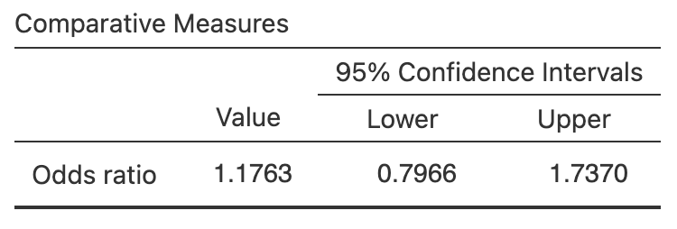

# CIs for odds ratios {#OddsRatiosCI}


```{r, child = if (knitr::is_html_output()) {'introductions/34-CIs-OddsRatios-HTML.Rmd'} else {'introductions/34-CIs-OddsRatios-LaTeX.Rmd'}}
```


## Introduction: eating habits {#OddsRatioIntro}


<div style="float:right; width: 222x; border: 1px; padding:10px">

</div>


A study examined the eating habits of university students [@data:Mann12017:UniStudents].
One interest was the relationship between where the students ate, and where the student lived.
The researchers cross-classified the $n = 183$ students (the units of analysis) on two *qualitative* variables:

* Where they lived: with their parents, or *not* with their parents;
* Where they ate most meals: *off-campus* or *on-campus*.

Since both variables are qualitative, *means are not appropriate* for summarising the data.
A two-way table of counts is appropriate (Table\ \@ref(tab:MealsDataTable)), called a *contingency table*.
Both qualitative variables have two levels, so the table is a $2\times 2$ table.


```{r MealsDataTable}
Counts <- c(52, 105, 2, 24)
Live <- rep( c(1, 2), 2)
Live <- ordered(Live,
                levels = 1:2,
                labels = c("Lives with parents", 
                           "Doesn't live with parents") )
Meals <- c( rep(1, 2), 
            rep(2, 2))
Meals <- ordered(Meals, 
                 levels = 1:2,
                 labels = c("Most meals off-campus", 
                            "Most meals on-campus"))

Eating <- data.frame(Counts = Counts,
                     Live = Live,
                     Meals = Meals)

Eating.tab <- Eating.tab.Counts <- xtabs(Counts ~ Meals + Live + Meals, 
                                         data=Eating)

Eating.tab <- cbind( Eating.tab, 
                     "Total" = rowSums(Eating.tab))
Eating.tab <- rbind( Eating.tab, 
                     "Total" = colSums(Eating.tab))


if( knitr::is_latex_output() ) {
  kable( pad(Eating.tab,
             surroundMaths = TRUE,
             targetLength = c(2, 3, 3),
             digits = 0),
        format = "latex",
        booktabs = TRUE,
        longtable = FALSE,
        escape = FALSE,
        align = "c",
        caption = "Where university students live and eat") %>%
     column_spec(4, bold = TRUE) %>%
     column_spec(1, bold = TRUE) %>%
     row_spec(0, bold = TRUE) %>%
     row_spec(3, bold = TRUE) %>%
     row_spec(2, hline_after = TRUE) %>%
     kable_styling(font_size = 10)
}
if( knitr::is_html_output() ) {
  out <- kable(Eating.tab,
               format = "html",
               booktabs = TRUE,
               longtable = FALSE,
               align = "r",
               caption = "Where university students live and eat"
)
  out
}
UniS <- Eating.tab
```

The purpose of the research is to compare the odds (or proportion) of students who eat most meals off-campus, comparing those who live with their parents and those who do *not* live with their parents.


::: {.importantBox .important data-latex="{iconmonstr-warning-8-240.png}"}
Every cell in the $2\times 2$ table contains different students, so the comparison is *between* individuals.
:::


The parameter the [*odds ratio* (OR)](#OddsRatio); specifically, the odds ratio of eating most meals off-campus, comparing those living with parents to those not living with parents.
Another sensible parameter would be the difference between the *proportions* (or *percentages*) in each group, but the odds ratio usually is used as the parameter (for reason beyond the scope of this book).
For this reason, writing the RQ in terms of odds ratios or odds is also most appropriate.

Using the OR, the RQ could be written as:

> Among university students, what is the odds ratio of students eating most meals off-campus, comparing those who *do* and *do not* live with their parents?

Using odds, the RQ could be written as:

> Among university students, what the odds of students eating most meals off-campus compared students who *do* and *do not* live with their parents?

Either way, the parameter is the population OR, comparing the odds of eating most meals *off*-campus for students living with their parents to students *not* living with their parents.


::: {.importantBox .important data-latex="{iconmonstr-warning-8-240.png}"}
Take care defining the odds ratios in the parameter! 
Recall (Sect. \@ref(QualOdds)): software usually compares Row\ 1 to Row\ 2, and Column\ 1 to Column\ 2.
For this reason, it makes sense to define your OR in the same way.
:::
::: {.thinkBox .think data-latex="{iconmonstr-light-bulb-2-240.png}"}
What are P, O, C and I for this RQ?
:::


## Summarising data {#CIOddsRatiosSummaries}

With two qualitative variables, an appropriate numerical summary includes the odds and percentages for the outcome (for each comparison group) and the sample sizes.
From these data, the [odds](#Odds) of eating most meals *off-campus* is:

* $52\div 2 = 26$     for students     *living with their parents*.
* $105\div 24 = 4.375$ for students *not living with their parents*.

(Notice the *last* column is always on the bottom of the fraction.)
So the [*odds ratio* (OR)](#OddsRatio) of eating most meals *off-campus* (the *first* row), comparing students living with parents to students *not* living with parents, is $26 \div 4.375 = 5.943$.
The numerical summary (Table\ \@ref(tab:EatingNumericalSummary)) shows the percentage and odds of eating most meals off-campus, comparing students living at home and those not living at home.


::: {.softwareBox .software data-latex="{iconmonstr-laptop-4-240.png}"}
Understanding how software computes the odds ratio is *very* important for understanding the output.
In jamovi, the odds ratio can be interpreted in *either* of these two ways (i.e., both are correct):

* The *odds* are the odds of eating most meals *off-campus* (Row\ 1 of Table\ \@ref(tab:MealsDataTable)) compared to *on-campus* (Row\ 2): $52/2 =  26$ (for those living with parents) and $105/24 = 4.375$ (for those not living with parents).
   \smallskip
   
  Then, the *odds ratio* compares these odds for students living with their parents (Column\ 1 of Table\ \@ref(tab:MealsDataTable)) to those *not* living with their parents (Column\ 2): the OR is $26/4.375 = 5.943$, as in the output (Fig.\ \@ref(fig:EatingGraphsCI), right panel).

* The *odds* are the odds of living with parents (Column\ 1 of Table\ \@ref(tab:MealsDataTable)) compared to *not* living with parents (Column\ 2): $52/105 = 0.49524$ (for those eating most meals off-campus) and $2/24 = 0.083333$ (for those eating most meals on-campus).
\smallskip

Then, the *odds ratio* compares these odds for students eating most meals off-campus (Row\ 1 of Table\ \@ref(tab:MealsDataTable)) to the odds of students eating most meals on-campus (Row\ 2): the OR is $0.49524/0.083333 = 5.943$, as in the output (Fig.\ \@ref(fig:EatingGraphsCI), right panel).
  
The odds and odds ratios are relative to the *second row* or *second column*.
:::


```{r EatingNumericalSummary}
EatingNumericalSummary <- array( dim = c(3, 3))

EatingNumericalSummary[1, ] <- c(format(round(UniS[1, 1]/UniS[2, 1 ], 4), nsmall = 3),
                                 round(UniS[1, 1]/sum(UniS[1, ]) * 100, 1),
                                 UniS[3,1] )
EatingNumericalSummary[2, ] <- c(round(UniS[1, 2]/UniS[2, 2], 4),
                                 round(UniS[2, 1]/sum(UniS[2, ]) * 100, 1),
                                 UniS[3,2] )
EatingNumericalSummary[3, ] <- c(round( (UniS[1, 1] / UniS[1, 2] ) / (UniS[2, 1] / UniS[2, 2]), 3), 
                                 NA,
                                 NA)
rownames(EatingNumericalSummary) <- c("Living with parents",
                                      "Not living with parents",
                                      "Odds ratio")
    
if( knitr::is_latex_output() ) {
  kable(pad(EatingNumericalSummary,
            surroundMaths = TRUE,
            targetLength = c(6, 4, 3),
            digits = c(3, 1, 0)),
        format = "latex",
        longtable = FALSE,
        booktabs = TRUE,
        escape = FALSE,
        align = "c",
        col.names = c("most meals off-campus",
                      "most meals off-campus", 
                      "size"),
       caption = "The odds and percentage of university students eating most meals off-campus" 
  ) %>%
     row_spec(3, italic = TRUE) %>%
     row_spec(0, bold = TRUE) %>%
   add_header_above( c(" ", "Odds of having" = 1, 
                       "Percentage having" = 1,
                       "Sample" = 1),
                     line = FALSE,
                     bold = TRUE) %>%
	 kable_styling(font_size = 10) 
}
if( knitr::is_html_output() ) {
  out <- kable(EatingNumericalSummary,
               format = "html",
               longtable = FALSE,
               booktabs = TRUE,
               align = c("r", "r", "r"),
               col.names = c("Odds of having most\n meals off-campus", 
                             "Percentage having most\n meals off-campus", 
                             "Sample size"),
               caption = "The odds and percentage of university students eating most meals off-campus"
  )
  out
}
```


An appropriate graph (Fig.\ \@ref(fig:EatingGraphsCI), left panel) is a *side-by-side* bar chart or a *stacked* bar chart.
For comparing the *odds*, the side-by-side bar chart is better. 
(A *stacked* bar chart is better for comparing *proportions*, but either is correct.)


```{r EatingGraphsCI, fig.cap="The uni-student eating data. Left: A side-by-side bar chart; right: the jamovi output for computing a CI", fig.align="center", fig.height=4, fig.width=4, out.width=c("45%", "53%"), fig.show='hold'}
par( xpd = TRUE,
     mar = c(7, 4, 4, 2) + 0.1) # DEFAULT: c(5, 4, 4, 2) + 0.1

barplot( t(prop.table(Eating.tab.Counts, margin = 1)) * 100,
	col = viridis::viridis(10)[c(3, 8)],     #plot.colour, "steelblue"),
	ylab = "Percentage",
	beside = TRUE,
	main = "Side-by-side bar chart of where\nstudents live and eat", 
	ylim = c(0, 100),
	las = 1,
	legend.text = TRUE,
	args.legend = list(x = 5.0,
	                   y = 100,
	                   bty = "n",
	                   cex = 0.9,
	                   ncol = 1,
	                   horiz = FALSE))


```


## Describing the sampling distribution {#OddsRatiosOR}

From the numerical summary table (Table\ \@ref(tab:EatingNumericalSummary)), the odds of a student eating most meals *off-campus* is $26$ for students *living with their parents*, and $4.375$ for students *not living with their parents*.
So the OR of eating most meals *off-campus*, comparing students living with parents to students *not* living with parents, is $26 \div 4.375 = 5.943$.
The odds are different in each group, and hence the OR is not one *in the sample*: the odds of eating most meals off-campus for students living *with* their parents is $5.943$ times the odds for students living *not* living with their parents.

Of course, every sample of students is likely to be different, so the OR *varies* from sample to sample, so there is *sampling variation*.
This means that the odds ratio has a *sampling distribution* and a *standard error*.

Unfortunately, the sampling distribution of the sample OR is not a normal distribution^[For those interested (this is *optional*): The OR is only defined for *non-negative* values so a normal distribution is inappropriate. However, the *logarithm* of the OR has an approximate normal distribution under certain conditions.].
Fortunately, a simple transformation to the sample OR *does* have a normal distribution, though we omit the details.
For this reason, we will use software output for finding the CI for the odds ratio, and not discuss the sampling distribution directly.
In other words, we will rely on software to find CIs for odds ratios.


<!-- ```{r NotationOddsRatioCI} -->

<!-- OddsRatioNotation <- array( dim = c(6, 2)) -->

<!-- OddsRatioNotation[1, ] <- c("Individual values in the population", -->
<!--                           "Group A: Population odds ratio") -->
<!-- OddsRatioNotation[2, ] <- c("", -->
<!--                           "Group B: Population odds ratio") -->

<!-- OddsRatioNotation[3, ] <- c("Individual values in a sample", -->
<!--                           "Group A: Sample odds ratio") -->
<!-- OddsRatioNotation[4, ] <- c("", -->
<!--                           "Group B: Sample odds ratio") -->

<!-- OddsRatioNotation[5, ] <- c("Odds ratio of sample odds", -->
<!--                           "Vary with a distribution related to the normal distribution") -->
<!-- OddsRatioNotation[6, ] <- c("across all possible samples", -->
<!--                           " (under certain conditions), with a mean and standard deviation") -->


<!-- if( knitr::is_latex_output() ) { -->
<!--   kable( OddsRatioNotation, -->
<!--          format = "latex", -->
<!--          booktabs = TRUE, -->
<!--          longtable = FALSE, -->
<!--          escape = FALSE, -->
<!--          caption = "The notation used for describing means, and the sampling distribution of the sample means", -->
<!--          align = c("r", "l"), -->
<!--          linesep = c("", "\\addlinespace", -->
<!--                      "", "\\addlinespace", -->
<!--                      ""), -->
<!--          col.names = c("Quantity", -->
<!--                        "Description") ) %>% -->
<!-- 	row_spec(0, bold = TRUE) %>% -->
<!--   kable_styling(font_size = 10) -->
<!-- } else { -->
<!--   OddsRatioNotation[5, 1] <- paste(OddsRatioNotation[5, 1],  -->
<!--                                  OddsRatioNotation[6, 1]) -->
<!--   OddsRatioNotation[6, 2] <- paste(OddsRatioNotation[5, 2],  -->
<!--                                  OddsRatioNotation[6, 2]) -->
<!--   OddsRatioNotation[6, ] <- NA -->

<!--     kable( OddsRatioNotation, -->
<!--          format = "html", -->
<!--          booktabs = TRUE, -->
<!--          longtable = FALSE, -->
<!--          escape = FALSE, -->
<!--          caption = "The notation used for describing means, and the sampling distribution of the sample means", -->
<!--          align = c("r", "l"), -->
<!--          linesep = c("", "\\addlinespace", -->
<!--                      "", "\\addlinespace", -->
<!--                      ""), -->
<!--          col.names = c("Quantity", -->
<!--                        "Description") ) %>% -->
<!-- 	row_spec(0, bold = TRUE)  -->
<!-- } -->
<!-- ``` -->


## Constructing confidence intervals

As noted, software will be used to find the CI for the odds ratio.
Using jamovi (Fig.\ \@ref(fig:EatingGraphsCI), right panel), the sample OR is $5.94$ (as computed manually), and the (exact) $95$% CI is from $1.35$ to $26.1$.


<!-- ```{r UniMealsTestOutputjamovi, fig.show="hold", fig.cap="The jamovi output for computing a CI", fig.align="center", out.width="49%"} -->
<!--  -->
<!-- #knitr::include_graphics( "SPSS/UniStudents/UniStudentsRiskOutput.png") -->
<!-- ``` -->


::: {.tipBox .tip data-latex="{iconmonstr-info-6-240.png}"}
Recall that the jamovi output can be interpreted in either of these ways:

* Odds are Row\ 1 divided by Row\ 2.  
  Then the odds ratio is computed as Column\ 1 odds divided by Column\ 2 odds (i.e., *comparing* Column\ 1 odds to Column\ 2 odds); or
* Odds are Column\ 1 divided by Column\ 2.  
  Then the odds ratio is computed as Row\ 1 odds divided by Row\ 2 odds (i.e., *comparing* Row\ 1 odds to Row\ 2 odds).

Both are correct, but one is usually easier to understand.
:::

We write:

> Based on the sample, the OR comparing the odds of eating most meals off-campus, comparing students living with parents (odds: $26.0$; $n = 54$) to students *not* living with parents (odds: $4.38$; $n = 129$), is $5.94$, with the $95$% CI from $1.35$ to $26.1$ .

There is a $95$% chance that this CI straddles the population OR.
Notice that the *meaning* of the OR is explained in the conclusions: the odds of eating most meals *off*-campus, and comparing students living with parents to *not* living with parents.

*The CI for an OR is not symmetrical*, like the others we have seen^[For those interested (this is *optional*): This is because the OR has no upper limit, but the lower limit is zero. 
The *logarithm* of the limits of the CI form a symmetric interval.].


::: {.tipBox .tip data-latex="{iconmonstr-info-6-240.png}"}
Interpreting ORs can be challenging, so care is needed!
:::


<iframe src="https://learningapps.org/watch?v=pqzmnub7n22" style="border:0px;width:100%;height:500px" allowfullscreen="true" webkitallowfullscreen="true" mozallowfullscreen="true"></iframe>


::: {.example #CIORcrashes name="Crashes in China"}
A study of car crashes in a rural, mountainous county in western China [@wang2020driver] recorded the data in Table\ \@ref(tab:CrashDataTable).
Clearly the *number* of crashes is larger in 2015, in the *sample*.
However, the interest is in comparing the *odds* (or percentage) of crashes involving pedestrians (i.e., Row\ 1) in 2011 and 2015, in the *population*.

The data can be summarised as shown in Table\ \@ref(tab:CrashDataSummary).
For consistency with software output, the odds calculation uses the vehicle data on the bottom of the fraction (Row\ 2), and the odds ratio is computed using the 2015 data on bottom of the fraction (i.e., Column\ 2).
For example:

* In 2011, the odds of a crash involving a pedestrian is $15\div 35 = 0.429$;
* In 2015, the odds of a crash involving a pedestrian is $37\div 85 = 0.435$;
* The odds ratio of a crash involving a pedestrian, comparing 2011 to 2015, is $0.429\div 0.435 = 0.985$.

Hence, the parameter of interest is the odds of a crash involving pedestrians in 2011, compared to the odds of a crash involving pedestrians in 2015.

Both the percentage and odds columns, and the odds ratio, suggest that the relative proportion of crashes involving pedestrians is very similar in 2011 and 2015, in the *sample*.
The sample OR is $0.986$, but this value would change from sample to sample.
From software, the $95$% CI for the odds ratio is from $0.480$ to $2.018$.
We write

> The population odds ratio for a crash involving pedestrians, comparing 2011 (odds: $0.429$; $n = 50$) to 2015 (odds: $0.435$; $n = 122$) is $0.986$, and has a $95$% chance of being between $0.480$ and $2.018$.
:::


```{r CrashDataTable}
Counts <- c(15, 37, 35, 85)
Year <- rep( c(1, 2), 2)
Year <- ordered(Year,
                levels = 1:2,
                labels = c("In 2011", 
                           "In 2015") )
Type <- c( rep(1, 2), 
            rep(2, 2))
Type <- ordered(Type, 
                 levels = 1:2,
                 labels = c("Involving pedestrians", 
                            "Involving vehicles"))

Crashes <- data.frame(Counts = Counts,
                     Year = Year,
                     Type = Type)

Crash.tab <- xtabs(Counts ~ Type + Year, 
                   data = Crashes)

if( knitr::is_latex_output() ) {
  kable(pad(Crash.tab,
            surroundMaths = TRUE,
            targetLength = 2,
            digits = 0),
        format = "latex",
        booktabs = TRUE,
        longtable = FALSE,
        escape = FALSE,
        align = "c",
        caption = "Types of crashes in different years") %>%
    row_spec(0, bold = TRUE) %>%
    kable_styling(font_size = 10)
}
if( knitr::is_html_output() ) {
  kable(Crash.tab,
               format = "html",
               booktabs = TRUE,
               longtable = FALSE,
               align = "c",
        caption = "Types of crashes in different years") %>%
    row_spec(0, bold = TRUE)
}
```


```{r CrashDataSummary}
CrashSum <- array( dim = c(3, 3) )
colnames(CrashSum) <- c("Percentage involving pedestrians",
                        "Odds involving pedestrians",
                        "Sample size")
rownames(CrashSum) <- c("In 2011",
                        "In 2015",
                        "Odds ratio:")
CrashSum[1, ] <- c("30.0", 
                   "0.429", 
                   "50")
CrashSum[2, ] <- c("30.3", 
                   "0.435", 
                   "122")
CrashSum[3, ] <- c(NA,
                   0.985,
                   NA)

if( knitr::is_latex_output() ) {
  kable( pad(CrashSum,
             surroundMaths = TRUE,
             targetLength = c(4, 5, 3),
             digits = c(1, 3, 0)),
        format = "latex",
        booktabs = TRUE,
        longtable = FALSE,
        escape = FALSE,
        align = "c",
        caption = "Numerical summary of crashes in different years") %>%
    column_spec(1, width = "18mm") %>%
    column_spec(2, width = "32mm") %>%
    column_spec(3, width = "32mm") %>%
    column_spec(4, width = "17mm") %>%
     row_spec(0, bold = TRUE) %>%
     row_spec(3, italic = TRUE) %>%
     kable_styling(font_size = 10)
}
if( knitr::is_html_output() ) {
  kable(CrashSum,
               format = "html",
               booktabs = TRUE,
               longtable = FALSE,
               align = "r",
        caption = "Numerical summary of crashes in different years") %>%
    row_spec(0, bold = TRUE) %>%
     row_spec(3, bold = TRUE) 
}
```


## Statistical validity conditions {#ValidityConditionsORCI}

As usual, these results hold [under certain conditions](#exm:StatisticalValidityAnalogy).
The CI computed above is statistically valid if 

* All *expected* counts are at least five.

Some books may give other (but similar) conditions.
Note that this condition is based on the *expected* frequencies, not the *observed* frequencies.
The *expected* counts are what we would expect to find if there was no relationship between the two variables in the two-way table.
This statistical validity condition is explained further in Sect.\ \@ref(ExpectedValues).
In jamovi, the *expected* counts can be computed explicitly to determine if this condition is satisfied.


::: {.example #StatisticalValidityMeals name="Statistical validity"}
For the uni-students eating data, jamovi can be used to compute the *expected* counts (Fig.\ \@ref(fig:UniMealsTestOutputExpectedOnlyjamovi)).
None are less than five, and so the conclusion is statistically valid.
:::


```{r UniMealsTestOutputExpectedOnlyjamovi, fig.show="hold", fig.cap="The expected counts in jamovi, for the uni-students data", fig.align="center", out.width="70%"}
knitr::include_graphics( "jamovi/UniStudents/UniStudents-ExpectedOnly.png")
```


::: {.example #CIORcrashesValidity name="Car crashes in China"}
In Example\ \@ref(exm:CIORcrashes), all the *observed* counts are larger than five.
The *expected* counts are shown in Table\ \@ref(tab:ExpCrashDataTable).
Since all *expected* counts are larger than five, the CI will be statistically valid:

These counts are what we would *expected* to find if there was no relationship between the type of crash in 2011 and 2015; that is, if the proportion of crashes involving pedestrians was the same in 2011 and 2015.
The observed counts are *very* close to these *expected* counts, meaning that what we observe is very close to what we expected if there was no relationship.
:::


```{r ExpCrashDataTable}
ExpCounts <- c(15.11, 36.88, 34.88, 85.12)
Year <- rep( c(1, 2), 2)
Year <- ordered(Year,
                levels = 1:2,
                labels = c("In 2011", 
                           "In 2015") )
Type <- c( rep(1, 2), 
            rep(2, 2))
Type <- ordered(Type, 
                 levels = 1:2,
                 labels = c("Involving pedestrians", 
                            "Involving vehicles"))

ExpCrashes <- data.frame(ExpCounts = ExpCounts,
                     Year = Year,
                     Type = Type)

ExpCrash.tab <- xtabs(ExpCounts ~ Type + Year, 
                   data = ExpCrashes)

if( knitr::is_latex_output() ) {
  kable(surroundMaths(ExpCrash.tab,
                      decDigits = 2),
        format = "latex",
        booktabs = TRUE,
        longtable = FALSE,
        escape = FALSE,
        align = "r",
        caption = "Expected counts of types of crashes in different years") %>%
    row_spec(0, bold = TRUE) %>%
    kable_styling(font_size = 10)
}
if( knitr::is_html_output() ) {
  kable(ExpCrash.tab,
               format = "html",
               booktabs = TRUE,
               longtable = FALSE,
               align = "r",
        caption = "Expected counts of types of crashes in different years") %>%
    row_spec(0, bold = TRUE)
}
```


## Example: turtle nests {#TurtleNestsOR}

The hatching success of loggerhead turtles on Mediterranean beaches is often compromised by fungi and bacteria.
A study [@candan2021first] compared the proportion of infected nests between nest relocated due to the risk of tidal inundation, and non-relocated nests (Table\ \@ref(tab:TurtleNestDataTable)).
The researchers were interested in knowing:

> For Mediterranean loggerhead turtles, what are the odds of infections comparing natural to relocated nests?


```{r TurtleNestDataTable}
TurtleData <- array( dim = c(2, 2))
TurtleData[, 1] <- c(29, 14)
TurtleData[, 2] <- c(10, 8)

rownames(TurtleData) <- c("Natural",
                          "Relocated")
colnames(TurtleData) <- c("Non-infected",
                          "Infected")

if( knitr::is_latex_output() ) {
  kable(pad(TurtleData,
            surroundMaths = TRUE,
            targetLength = 2,
            digits = 0),
        format = "latex",
        booktabs = TRUE,
        longtable = FALSE,
        escape = FALSE,
        align = "c",
        caption = "Infected and non-infected turtle nests") %>%
    row_spec(0, bold = TRUE) %>%
    kable_styling(font_size = 10)
}
if( knitr::is_html_output() ) {
  kable(TurtleData,
               format = "html",
               booktabs = TRUE,
               longtable = FALSE,
               align = "r",
        caption = "Infected and non-infected turtle nests") %>%
    row_spec(0, bold = TRUE)
}
```


The parameter is the odds ratio of infection, comparing natural to relocated nests.
The odds ratio can be defined in other ways also, but this definition is consistent with how software computes odds given Table\ \@ref(tab:TurtleNestDataTable) (i.e., first row to second row; first column to second column).

A graphical summary is shown in Fig.\ \@ref(fig:TurtleNestsGraphs).
A numerical summary table (Table\ \@ref(tab:TurtleNestsNumericalSummary)) shows that the odds of natural nest being infected is $1.657$ times the odds of a relocated nest being infected.
From the jamovi output (Fig.\ \@ref(fig:TurtleNestsOutputjamovi)), the $95$% CI for this odds ratio is from $0.537$ to $5.12$.
The smallest *expected* count is $6.49$ (Fig.\ \@ref(fig:TurtleNestsOutputjamovi)), so this CI is statistically valid.
We write:

> Based on the sample, the OR of an infected nest, comparing natural nests (odds: $2.90$; $n = 39$) to relocated nests (odds: $1.75$; $n = 22$), is $1.66$ with a $95$% CI from $0.537$ to $5.12$.


<!-- and Table 5 (BTW, Table 6 is  not $2\times 2$): -->


```{r}
TNsummary <- array( dim = c(3, 3) )

colnames(TNsummary) <- c( "Odds infected",
                          "Percentage infected",
                          "Sample size")
rownames(TNsummary) <- c("Natural",
                         "Relocated",
                         "Odds ratio:")
  
  
TNsummary[1:2, 1] <- TurtleData[, 1] / TurtleData[, 2]
TNsummary[1:2, 2] <- TurtleData[, 1] / rowSums(TurtleData) * 100
TNsummary[1:2, 3] <- apply(TurtleData, 1, "sum")
TNsummary[3, 1] <- TNsummary[1, 1] / TNsummary[2, 1]
```


\begin{figure}
\begin{minipage}{0.52\textwidth}
\captionof{table}{The odds and percentage of infected turtle nests\label{tab:TurtleNestsNumericalSummary}}
\fontsize{10}{12}\selectfont
```{r}
  kable( surroundMaths(TNsummary,
                       decDigits = c(3, 2, 0)),
        format = "latex",
        booktabs = TRUE,
        longtable = FALSE,
        align = "c",
        escape = FALSE,
        table.env = "@empty",
        col.names = c("infected",
                     "infected",
                     "size")) %>%
    row_spec(0, bold = TRUE) %>%
    row_spec(3, italic = TRUE) %>%
    add_header_above( c( " " = 1,
                         "Odds" = 1,
                         "Percentage" = 1,
                         "Sample" = 1),
                      bold = TRUE,
                      line = FALSE)
```
\end{minipage}
\hspace{0.05\textwidth}
\begin{minipage}{0.40\textwidth}%
\centering
```{r, out.width='99%', fig.width=3.75, fig.height=3}
par(xpd = TRUE,
    mar = c(2, 4, 4, 1) + 0.1) # DEFAULT: c(5, 4, 4, 2) + 0.1

barplot(TurtleData, 
	las = 1,
	ylab = "Count",
	xlab = "Type of nest",
	main = "Number of turtle\nnest infections",
	beside = TRUE,
	names.arg = c("Natural", 
	              "Relocated"),
	ylim = c(0, 30),
	col =  viridis::viridis(10)[c(3, 8)]
)
box()

legend(6.2, 
       400, 
	     fill =  viridis::viridis(10)[c(3, 8)],
	     title = "Infection",
	     legend = c("Not infected", 
	                "Infected"), 
	     bty = "n")
```
\caption{A plot of the turtle-nest data}\label{fig:TurtleNestsGraphs}
\end{minipage}
\end{figure}


```{r TurtleNestsNumericalSummary}
if( knitr::is_html_output() ) {
  kable(TNsummary,
        format = "html",
        booktabs = TRUE,
        longtable = FALSE,
        align = "c",
        digits = c(3, 2, 0),
        caption = "The odds and percentage of infected nests")
}
```

<!-- The figure for LaTeX is in the minipage (combined with data table), so only need show it for the HTML -->
`r if (knitr::is_latex_output()) '<!--'`
```{r TurtleNestsGraphs, fig.show="hold", fig.cap="jamovi output for the EV study", fig.align="center", out.width="50%"}
par(xpd = TRUE,
    mar = c(5, 4, 4, 8) + 0.1) # DEFAULT: c(5, 4, 4, 2) + 0.1

barplot(TurtleData, 
	las = 1,
	ylab = "Count",
	xlab = "Type of nest",
	beside = TRUE,
	names.arg = c("Natural", 
	              "Relocated"),
	ylim = c(0, 30),
	col =  viridis::viridis(10)[c(3, 8)]
)
box()

legend(6.2, 
       400, 
	     fill =  viridis::viridis(10)[c(3, 8)],
	     title = "Infection",
	     legend = c("Not infected", 
	                "Infected"), 
	     bty = "n")
```
`r if (knitr::is_latex_output()) '-->'`


```{r TurtleNestsOutputjamovi, fig.show="hold", fig.cap="The jamovi output for the turtle-nesting data", fig.align="center", out.width=c("48%", "48%")}
knitr::include_graphics("jamovi/TurtleNests/TurtleNests-OR.png")
knitr::include_graphics("jamovi/TurtleNests/TurtleNests-Expected.png")
```


## Example: B12 deficiency {#B12DeficiencyCI}


<div style="float:right; width: 222x; border: 1px; padding:10px">

</div>


A study in New Zealand [@data:Gammon2012:B12] examined B12 deficiencies in 'predominantly overweight/obese women of South Asian origin living in Auckland', some of whom were on a vegetarian diet and some of whom were on a non-vegetarian diet.
One RQ was:

> What is the odds ratio of these women being B12 deficient, comparing vegetarians to non-vegetarians?

The parameter is the population OR, comparing the odds of being B12 deficient, for vegetarians to non-vegetarians.

The data appear in Table\ \@ref(tab:B12DataCI).
From the jamovi output (Fig.\ \@ref(fig:B12SPSSOutputCIjamovi)), the OR (and $95$% CI) is $3.15$ ($1.08$ to $9.24$).
The numerical summary table (Table \@ref(tab:B12DataSummaryCI)) and graphical summary (Fig.\ \@ref(fig:B12BarchartsCI)) can hence be constructed.


```{r B12DataCI}
B12Data <- array( dim = c(3, 3) )

rownames(B12Data) <- c("Vegetarians",
                       "Non-vegetarians",
                       "Total")
colnames(B12Data) <- c("B12 deficient",
                       "Not B12 deficient",
                       "Total")

B12Data[1, ] <- c(8, 26, 34)
B12Data[2, ] <- c(8, 82, 90)
B12Data[3, ] <- c(16, 108, 124)
  
if( knitr::is_latex_output() ) {
  kable(pad(B12Data,
            surroundMaths = TRUE,
            targetLength = c(2, 3, 3),
            digits = 0),
        format="latex",
        booktabs = TRUE,
        longtable=FALSE,
        escape = FALSE,
        align = "c",
        caption="The number of vegetarian and non-vegetarian women who are (and are not) B12 deficient") %>%
    row_spec(0, bold = TRUE) %>%
    row_spec(3, bold = TRUE) %>%
    column_spec(4, bold = TRUE) %>%
    row_spec(2, hline_after = TRUE) %>%
    kable_styling(font_size = 10)
  
}
if( knitr::is_html_output() ) {
  out <- kable(B12Data,
               format = "html",
               booktabs = TRUE,
               longtable = FALSE,
               align = c("r","r", "r"),
               caption = "The number of vegetarian and non-vegetarian women who are (and are not) B12 deficient")
  out
}
```


```{r B12BarchartsCI, fig.cap="A side-by-side barchart comparing the number of women B12 deficient", fig.align="center", fig.width=4.5, fig.height=3, out.width="45%"}
### B12 example
counts <- matrix( c(8, 26, 8, 82), 
                  byrow = TRUE, 
                  nrow = 2)
rownames(counts) <- c("Veg.", 
                      "Non-veg.")
colnames(counts) <- c("B12 def.", 
                      "Not B12 def.")

mp <- barplot(t(counts),
        las = 1,
        ylab = "Number of women",
        col =  viridis::viridis(10)[c(3, 8)], 
        legend.text = TRUE,
        ylim = c(0, 100),
        args.legend = list(x = "topleft", 
                           bty = "n"),
        main = "Number of women who are\nand who are not B12 deficient",
        beside = TRUE)
box()
```


```{r B12DataSummaryCI}
B12summary <- array( dim = c(3, 3) )

colnames(B12summary) <- c( "Odds B12 deficient",
                          "Percentage B12 deficient",
                          "Sample size")
rownames(B12summary) <- c("Vegetarians:",
                          "Non-vegetarians:",
                          "Odds ratio:")
  
  
B12summary[1, ] <- c("0.3077", 
                     "23.5", 
                     "34")
B12summary[2, ] <- c("0.0976", 
                     " 8.9", 
                     "90")
B12summary[3, ] <- c("3.15", 
                     NA, 
                     NA)


if( knitr::is_latex_output() ) {
  kable(pad(B12summary,
            surroundMaths = TRUE,
            targetLength = c(5, 4, 2),
            digits = c(3, 1, 0)),
        format = "latex",
        booktabs = TRUE,
        longtable = FALSE,
        escape = FALSE,
        align = "c",
#      align=c("p{20mm}", "p{25mm}", "c"),
        caption = "The odds and percentage of subjects that are B12 deficient") %>%
    row_spec(0, bold = TRUE) %>%
    row_spec(3, italic = TRUE) %>%
    kable_styling(font_size = 10)
}
if( knitr::is_html_output() ) {
  kable(B12summary,
        format = "html",
        booktabs = TRUE,
        longtable = FALSE,
        align = c("l", "r", "c"),
        caption = "The odds and percentage of subjects that are B12 deficient")
}
```


```{r B12SPSSOutputCIjamovi, fig.show="hold", fig.cap="jamovi output for the B12 data", fig.align="center", out.width="48%"}
knitr::include_graphics( "jamovi/B12/B12OR.png")
#knitr::include_graphics( "SPSS/B12/B12OR.png")
```


To check if these results statistically valid, the jamovi output (Fig.\ \@ref(fig:B12jamoviExpectedCounts)) shows that one expected count is less than five.
Nonetheless, only *one* cell has an expected count less than five, and only *just* under 5, so we shouldn't be too concerned about statistical validity (but it should be noted).

We write:

> Based on the sample, the OR of being B12 deficient (comparing vegetarians (odds: $0.308$; $n = 34$) to *non*-vegetarians (odds: $0.098$; $n = 90$) is $3.15$, and the $95$% CI is from $1.08$ to $9.24$.


```{r B12jamoviExpectedCounts, fig.show="hold", fig.cap="The expected counts from jamovi for the B12 data", fig.align="center", out.width="70%"}
knitr::include_graphics( "jamovi/B12/B12-Expected.png")
```


## Chapter summary 

## Quick review questions {#Chap25-QuickReview}

::: {.webex-check .webex-box}
A study [@egbue2017mass] of the adoption of electric vehicle (EVs) by a certain group of professional Americans compiled the data in Table\ \@ref(tab:EV10years).
Output from using jamovi is shown in Fig.\ \@ref(fig:EVjamovi).


```{r}
EV10 <- array(dim = c(2, 2))

colnames(EV10) <- c("Yes", 
                    "No")
rownames(EV10) <- c("No post-grad", 
                    "Post-grad study")

EV10[1, ] <- c(24, 8)
EV10[2, ] <- c(51, 29)
```

\begin{figure}
\begin{minipage}{0.32\textwidth}
\captionof{table}{Responses to the question `Would you purchase an electric vehicle in the next $10$ years?' by education\label{tab:EV10years}}
\fontsize{10}{12}\selectfont
```{r}
knitr::kable( pad(EV10,
                  surroundMaths = TRUE,
                  targetLength = 2,
                  digits = 0),
         format = "latex",
         booktabs = TRUE,
         longtable = FALSE,
         align = "c",
         escape = FALSE,
         table.env = "@empty") %>%
   row_spec(0, bold = TRUE)
   #kable_styling(font_size = 10) %>% # CANNOT USE THIS IS THE MINIPAGE
   #column_spec(1, width = "13mm") %>%
   #column_spec(2, width = "22mm")
```
\end{minipage}
\hspace{0.05\textwidth}
\begin{minipage}{0.60\textwidth}%
\centering
```{r, out.width='92%'}
knitr::include_graphics( "jamovi/EVs/EVs-CI.png")
```
\caption{jamovi output for the EV study}\label{fig:EVjamovi}
\end{minipage}
\end{figure}


```{r EV10years}
EV10 <- array(dim = c(2, 2))

colnames(EV10) <- c("Yes", 
                    "No")
rownames(EV10) <- c("No post-grad", 
                    "Post-grad study")

EV10[1, ] <- c(24, 8)
EV10[2, ] <- c(51, 29)


#if( knitr::is_latex_output() ) {
#   kable(EV10,
#         format = "latex",
#         longtable = FALSE,
#         booktabs = TRUE,
#         caption = "Responses to the question 'Would you purchase an electric vehicle in the next 10 years?' by education") %>%
# 	kable_styling(font_size = 10) %>%
# 	row_spec(0, bold = TRUE)
#}

if( knitr::is_html_output() ) {
  kable(EV10,
        format = "html",
        longtable = FALSE,
        booktabs = TRUE,
        caption = "Responses to the question 'Would you purchase an electric vehicle in the next $10$ years?' by education")
}
```

<!-- The figure for LaTeX is in the minipage (combined with data table), so only need show it for the HTML -->
`r if (knitr::is_latex_output()) '<!--'`
```{r EVjamovi, fig.show="hold", fig.cap="jamovi output for the EV study", fig.align="center", out.width="50%"}
knitr::include_graphics( "jamovi/EVs/EVs-CI.png")
```
`r if (knitr::is_latex_output()) '-->'`


1. The *percentage* of people without post-grad study who would buy an EV in the next $10$ years is\tightlist `r if (knitr::is_html_output()) '(**do not** add the percentage symbol)'`:  
`r if( knitr::is_html_output() ) {fitb(num=TRUE, tol=0.001, answer=75)}`

1. The *odds* that a person without post-grad study would buy an EV in the next $10$ years is:  
`r if( knitr::is_html_output() ) {fitb(num=TRUE, tol=0.001, answer=3)}`

1. Using the output, what is the OR of buying an electric vehicle in the next $10$ years, comparing those *without* post-grad study to those *with* post-grad study?  
`r if( knitr::is_html_output() ) {mcq(
  c(answer=1.71,
    0.68,
    4.28)  )}`

1. True or false: The CI means that the sample OR is likely to be between $0.68$ and $4.28$.  
`r if( knitr::is_html_output() ) {torf(answer=FALSE)}`

1. True or false: The analysis is likely to be statistically valid?  
`r if( knitr::is_html_output() ) {torf(answer=TRUE)}`
:::


`r if (!knitr::is_html_output()) '<!--'`
`r webexercises::hide()`
1. The number *without* post-grad study: $24 + 8 = 32$.
   The *percentage* of people without post-grad study who would buy an EV in the next $10$ years is $24/32 = 0.75$, or 75%. 
1. The people with post-grad study are in the *bottom* row.
   The *odds* of people without post-grad study who would buy an EV in the next $10$ years is $24/8 = 3$. 
1. The odds of people *without* post-grad study who would by an electric vehicle is $24/8 = 3$.  
   The odds of people *with* post-grad study who would by an electric vehicle is $51/29 = 1.7586$.  
   So the OR is $3/1.7586 = 1.706$.
1. Not at all. We know *exactly* what the sample OR is (it is $1.706$).
   CIs always give an interval in which the *population parameter* is likely to be within.
1. The CI is statistically valid if all the *expected* counts exceed 5.
   So we don't really know for sure from the given information.
   But the *observed* counts are all reasonably large, so it is *very probably* statistically valid. 
`r webexercises::unhide()`
`r if (!knitr::is_html_output()) '-->'`


## Exercises {#OddsRatiosCIExercises}

Selected answers are available in Sect.&nbsp;\@ref(OddsRatiosCIAnswer).


::: {.exercise #OddsRatiosCIScarHeights}
A [forward-direction](#ForwardsStudies) observational study in Western Australia [@data:Wallace2017:Sunburn] compared the heights of scars from burns received (Table\ \@ref(tab:ScarsData)).

jamovi was used to analyse the data (Fig.\ \@ref(fig:ScarHeightRiskCIjamovi)).

1. Compute the *odds* of having a smooth scar (that is, height is $0$\ mm) for women.
1. Compute the *odds* of having a smooth scar (that is, height is $0$\ mm) for men.
1. Compute the *odds ratio* of having a smooth scar, comparing women to men.
1. Interpret what this odds ratio means.
1. Sketch a suitable graph to display the data.
1. Construct an appropriate numerical summary table for the data.
1. Write down the CI.
1. Carefully interpret what this CI means.
:::

```{r ScarHeightRiskCIjamovi, fig.show="hold", fig.cap="jamovi output for the scar-height data", fig.align="center", out.width="50%"}

```


<!-- ```{r ScarHeightRiskCISPSS, echo=FALSE, fig.show="hold", fig.cap="SPSS output for the scar-height data", fig.align="center", out.width="65%"} -->
<!-- knitr::include_graphics( "SPSS/ScarHeight/ScarHeight-Chisq-OR.png") -->
<!-- ``` -->


```{r ScarsData}
ScarsData <- array( dim = c(2, 2) )

rownames(ScarsData) <- c("Scar height 0mm (smooth)",
                         "Scar height more than 0mm, less than 1mm")
colnames(ScarsData) <- c("Women",
                         "Men")

ScarsData[1, ] <- c(99, 216)
ScarsData[2, ] <- c(62, 115)

if( knitr::is_latex_output() ) {
  kable(pad(ScarsData,
            surroundMaths = TRUE,
            targetLength = c(2, 3),
            digits = 0),
        format = "latex",
        booktabs = TRUE,
        longtable = FALSE,
        escape = FALSE,
        align = "c",
        caption = "The number of men and women, with scars of different heights") %>%
    row_spec(0, bold = TRUE) %>%
    kableExtra::kable_styling(latex_options = "hold_position") %>%
    kable_styling(font = 10)
}
if( knitr::is_html_output() ) {
  out <- kable(ScarsData,
               format = "html",
               booktabs = TRUE,
               longtable = FALSE,
               align = c("r","r"),
               caption = "The number of men and women, with scars of different heights")
  out
}
```


::: {.exercise #OddsRatiosCIEarInf}
A study of ear infections in Sydney swimmers [@data:smyth:ozdasl] recorded whether people reported an ear infection or not, and where they usually swam.
The jamovi output is shown in Fig.\ \@ref(fig:EarInfPSSOutputCI).
Explain carefully the meaning of the OR and the corresponding CI.
:::


```{r EarInfPSSOutputCI, fig.show="hold", fig.cap="jamovi output for the ear-infection data", fig.align="center", out.width=c("45%", "50%"), fig.show='hold'}
knitr::include_graphics( "jamovi/EarInfections/EarInfections-Data.png" )

```


::: {.exercise #OddsRatiosCITurbines}
A study of turbine failures [@MyersBook; @NelsonLifeData] ran $73$ turbines for around $1800$\ hrs, and found that seven developed fissures (small cracks).
They also ran a different set of $42$ turbines for about $3000$\ hrs, and found that nine developed fissures.

1. Construct the two-way table for the data.
1. Use the jamovi output (Fig.\ \@ref(fig:TurbinesOutputCI)) to construct a $95$% CI for the odds ratio.
1. Compute, then carefully interpret, the OR.
1. Write down, then carefully interpret, the CI for the OR.
1. Is the CI likely to be statistically valid (Fig.\ \@ref(fig:TurbinesOutputCI))?
:::


```{r TurbinesOutputCI, fig.show="hold", fig.cap="jamovi output for the turbine data", fig.align="center", out.width=c("49%", "44%")}

knitr::include_graphics( "jamovi/Turbines/TurbinesExpected-jamovi.png" )
```


<!-- ```{r TurbinesOutputExpected, echo=FALSE, fig.show="hold", fig.cap="jamovi output for the turbine data: expected counts", fig.align="center", out.width="44%"} -->
<!-- knitr::include_graphics( "jamovi/Turbines/TurbinesExpected-jamovi.png" ) -->
<!-- ``` -->


```{r}
data(EmeraldAug)

EmeraldAug$SOIpos <- factor( EmeraldAug$SOI>0 )

#emeraldaug$SOIpos <- factor(emeraldaug$SOIpos,
#                          levels(emeraldaug$SOIpos)[ c(2,1)] )
                         

SOI.tab <- xtabs( ~ (SOIpos) + (Rain>0), 
                  data = EmeraldAug)

colnames(SOI.tab) <- c("No rain", 
                       "Rain")
rownames(SOI.tab) <- c("Non-positive SOI", 
                       "Positive SOI")

#prop.table(SOI.tab, margin=1 )

#chisq.test(SOI.tab)
#chisq.test(SOI.tab, correct=FALSE)
#chisq.test(SOI.tab, correct=FALSE)$expected
```


::: {.exercise #OddsRatiosCIAugustRainfall}
The *Southern Oscillation Index* (SOI) is a standardised measure of the air pressure difference between Tahiti and Darwin, and is related to rainfall in some parts of the world [@climate:stone:1996], and especially Queensland [@climate:stone:1992; @mypapers:Dunn:bootstrap:2001].

The rainfall at Emerald (Queensland) was recorded for Augusts between 1889 to 2002 inclusive [@mypapers:dunnsmyth:glms], where the monthly average SOI was positive, and when the SOI was non-positive (that is, zero or negative), as shown in Table\ \@ref(tab:SOItableCI).

Using the jamovi output in Fig.\ \@ref(fig:EmeraldRainOutputCIjamovi):

1. Find a $95$% CI for the OR.
1. Carefully explain what this OR means.
:::


\begin{figure}
\begin{minipage}{0.38\textwidth}
\captionof{table}{The SOI, and whether rainfall was recorded in Augusts between 1889 and 2002 inclusive\label{tab:SOItableCI}}
\fontsize{10}{12}\selectfont
```{r}
knitr::kable( pad(t(SOI.tab),
                  surroundMaths = TRUE,
                  targetLength = 2,
                  digits = 0),
         format = "latex",
         booktabs = TRUE,
         longtable = FALSE,
         col.names = c("SOI",
                       "SOI"),
         escape = FALSE,
         #row.names = c("No rain", "Rain"),
         align = "c",
         table.env = "@empty") %>%
  add_header_above( c(" " = 1,
                      "Non-pos." = 1,
                      "Positive" = 1),
                    bold = TRUE,
                    line = FALSE) %>%
   row_spec(0, bold = TRUE)
   #kable_styling(font_size = 10) %>% # CANNOT USE THIS IS THE MINIPAGE
   #column_spec(1, width = "13mm") %>%
   #column_spec(2, width = "22mm")
```
\end{minipage}
\hspace{0.05\textwidth}
\begin{minipage}{0.55\textwidth}%
\centering
```{r, out.width='95%'}

```
\caption{jamovi output for the Emerald-rain data}\label{fig:EmeraldRainOutputCIjamovi}
\end{minipage}
\end{figure}


```{r SOItableCI}
# if( knitr::is_latex_output() ) {
#   kable( t(SOI.tab),
#          format = "latex",
#          booktabs = TRUE,
#          longtable = FALSE,
#          caption = "The SOI, and whether rainfall was recorded in Augusts between 1889 and 2002 inclusive") %>%
#   row_spec(0, bold = TRUE) %>%
#   kableExtra::kable_styling(latex_options = "hold_position") %>%
#   kable_styling(font_size = 10)
# }
if( knitr::is_html_output() ) {
  out <- kable( t(SOI.tab),
         format = "html",
         booktabs = TRUE,
         longtable = FALSE,
         caption = "The SOI, and whether rainfall was recorded in Augusts between 1889 and 2002 inclusive")
  out
}
```

<!-- The figure for LaTeX is in the minipage (combined with data table), so only need show it for the HTML -->
`r if (knitr::is_latex_output()) '<!--'`
```{r EmeraldRainOutputCIjamovi, fig.show="hold", fig.cap="jamovi output for the Emerald-rain data", fig.align="center", out.width="50%"}

```
`r if (knitr::is_latex_output()) '-->'`


```{r}
data(HatSunglasses)

SG.Table.GenderHat <- xtabs(Count ~ Hat + Gender, 
                            data = HatSunglasses)
```

::: {.exercise #CIOddsRatioSunglasses}
A research study conducted in Brisbane [@data:Dexter2019:SunProtection] recorded the number of people at the foot of the Goodwill Bridge, Southbank, who wore sunglasses and hats between $11$:$30$am to $12$:$30$pm.
Of the $386$ males observed, $79$ wore hats; of the $366$ females observed, $22$ wore hats.

Using the jamovi output in Fig.\ \@ref(fig:SunglassesSPSSOutputCI), find a $95$% CI for the OR, and carefully explain what OR this CI applies to.
Also, construct the numerical summary table.
:::


```{r SunglassesSPSSOutputCI, fig.show="hold", fig.cap="jamovi output for the hats data", fig.align="center", out.width=c("45%", "50%"), fig.show='hold'}
knitr::include_graphics( "jamovi/HatSunglasses/HatSunglasses-Data.png" )
knitr::include_graphics( "jamovi/HatSunglasses/HatSunglasses-CI.png" )
```


::: {.exercise #PetBirdsCI}
A study examined people with lung cancer, and a matched set of controls who did not have lung cancer, and compared the proportion in each group that kept pet birds [@data:Kohlmeier1992:BirdsCancer]. 
One RQ of the study was:

> What is the odds ratio of keeping a pet bird, comparing people *with* lung cancer (cases) compared to people *without* lung cancer (controls)?

The data, compiled in a $2\times2$ *contingency table*, are given in Table \@ref(tab:BirdsData).

1. Construct a numerical summary table.
1. Sketch a graphical summary.
1. Use the software output to find a $95$% CI, making to to describe the odds ratio carefully.
1. Is the CI likely to be statistically valid?
:::

```{r BirdsData}
data(PetBirds)

PB2 <- xtabs( Counts ~ Pets + LC, 
              data = PetBirds)

if( knitr::is_latex_output() ) {
  kable( pad(PB2,
             surroundMaths = TRUE,
             digits = 0,
             targetLength = 3),
         align = "c",
        format = "latex",
        booktabs = TRUE,
        escape = FALSE,
        longtable = FALSE,
        caption = "The pet bird data") %>%
    kable_styling(font_size = 10) %>%
    row_spec(0, bold = TRUE)
}
if( knitr::is_html_output() ) {
  kable(PB2,
        format = "html",
        booktabs = TRUE,
        longtable = FALSE,
        caption = "The pet bird data")
}
```


```{r PetBirdsCIjamovi, fig.show="hold", fig.cap="jamovi output for the pet-birds data", fig.align="center", out.width="49%"}
knitr::include_graphics( "jamovi/PetBirds/PetsOR.png")
```


```{r PetBirdsCIjamoviExpected, fig.show="hold", fig.cap="The expected (and observed) counts as computed by jamovi for the pet-birds data", fig.align="center", out.width="80%"}

knitr::include_graphics("jamovi/PetBirds/Pets-ExpectedCounts.png")
```


<!-- QUICK REVIEW ANSWERS -->
`r if (knitr::is_html_output()) '<!--'`
::: {.EOCanswerBox .EOCanswer data-latex="{iconmonstr-check-mark-14-240.png}"}
**Answers to in-chapter questions:**

- \textbf{\textit{Quick Revision} questions:}
**1.** 75.
**2.** 3.
**3.** 1.71.
**4.** False
**5.** True.
:::
`r if (knitr::is_html_output()) '-->'`

