# Regression {#Regression}


<!-- Introductions; easier to separate by format -->
```{r, child = if (knitr::is_html_output()) {'./introductions/34-Regression-HTML.Rmd'} else {'./introductions/34-Regression-LaTeX.Rmd'}}
```


<!-- Define colours as appropriate -->
```{r, child = if (knitr::is_html_output()) {'./children/coloursHTML.Rmd'} else {'./children/coloursLaTeX.Rmd'}}
```


```{r}
data(RedDeer)
```


## Introduction {#Chap35-Intro}

Chapters\ \@ref(TwoQuant) and \@ref(Correlation) studied *correlation*, which measures the *strength* of the *linear* relationship between two quantitative variables\ $x$ (an explanatory variable) and\ $y$ (a response variable).
We now study *regression*, which describes *what* the linear relationship is between\ $x$ and\ $y$.
The relationship is described mathematically, using an *equation*, which allows us to:

1. *Predict* the mean value of\ $y$ from given values of\ $x$ (Sect.\ \@ref(RegressionForPrediction)); and
2. *Understand* the relationship between\ $x$ and\ $y$ (Sect.\ \@ref(RegressionForUnderstanding)).

<!-- Of course, any prediction will not be a perfect prediction, due to natural variation in the data.\index{Natural variation} -->
<!-- In other words, for any given value of $x$, many possible values of $y$ could be observed. -->
<!-- This means that the prediction is actually a prediction of the *mean* of all the possible values of $y$ that could be observed for that given value of $x$. -->

An example of a linear regression equation, describing the relationship between the observed values of an explanatory variable\ $x$ and the observed values of a response variable\ $y$, is
\begin{equation}
  \hat{y} = -4  + (2\times x), \qquad\text{usually written}\qquad \hat{y} = -4  + 2x.
  (\#eq:ExampleRegressionEqn)
\end{equation}
The notation\ $\hat{y}$ refers to the mean of all the $y$-values that could be observed for some given value of\ $x$.
That is, for some value of\ $x$, many values of\ $y$ could be observed, and\ $\hat{y}$ is the value that regression equation predicts as the *mean* of all those possible values. 


::: {.importantBox .important data-latex="{iconmonstr-warning-8-240.png}"}
$y$\ refers to the values of the response variable observed from individuals.
$\hat{y}$ refers to *mean predicted* value of\ $y$ for given values of\ $x$.
:::

Equation\ \@ref(eq:ExampleRegressionEqn) can be used to explore the relationship between the variables.
For instance, suppose $x = 7$; then the equation gives
$$
  \hat{y} = -4 + (2\times 7) = -4 + 14 = 10.
$$
This means that, when the value of\ $x$ is\ $7$, the observed values of\ $y$ will vary around a predicted mean of $\hat{y} = 10$.

:::: {.pronounceBox .pronounce data-latex="{iconmonstr-microphone-7-240.png}"}
$\hat{y}$ is pronounced as 'why-hat'; the 'caret' above the\ $y$ is called a 'hat'.
:::


More generally, the equation of a straight line is
$$
   \hat{y} = b_0 + (b_1 \times x), \qquad\text{usually written}\qquad \hat{y} = b_0 + b_1 x,
$$
where\ $b_0$ and\ $b_1$ are (unknown) numbers estimated from sample data.
Notice that\ $b_1$ is the number multiplied by\ $x$.
In Eq.\ \@ref(eq:ExampleRegressionEqn), $b_0 = -4$ and $b_1 = 2$.


::: {.example #RegressionGirlsHt name="Regression equations"}
A report on the growth of Australian children [@data:AustralianGirls] found an approximate linear relationship between the age of girls in years $x$ and their height (in\ cm)\ $y$ for girls between four and seven years-of-age.
The regression equation was approximately
$$
   \hat{y} = 73 + 7x.
$$
The regression equation is the same when written as
$$
   \hat{y} = 7x + 73.
$$
In boftediouth cases, $b_0 = 73$ and $b_1 = 7$.

The regression equation can be used to *predict* the *mean* height for any given age\ $x$.
For example, girls aged five years-of-age (i.e., $x = 5$) are predicted to have a mean height of 
$$
   \hat{y} = 73 + (7\times 5) = 73 + 35 = 108.
$$
The heights of girls will vary around a *mean* height of\ $108$\cms; some individual girls aged five will be taller than\ $108$\cms, and some will be shorter than\ $108$\cms.
:::


## Linear equations: review {#RegressionEquationsReview}
\index{Linear equations}\index{Regression}

To introduce, or revise, the idea of a linear equation, consider the (artificial) data in 
`r if (knitr::is_latex_output()) {
   'Fig.\\ \\@ref(fig:ExampleScatterLATEX) (left panel),'
} else {
   'Fig.\\ \\@ref(fig:ExampleScatterHTML),'
}`
with an explanatory variable\ $x$ and a response variable\ $y$.\index{Response variable}\index{Explanatory variable}\index{Graphs!scatterplot}
In the graph, a sensible line is drawn on the graph that seems to capture the relationship between\ $x$ and\ $y$.
(You may have drawn a slightly different line.)
The line describes the predicted mean values of\ $y$ for various values of\ $x$.

A *regression equation* specifies the line.\index{Regression!equation}
In the regression equation $\hat{y} = b_0 + b_1 x$, the numbers\ $b_0$ and\ $b_1$ are called *regression coefficients*,\index{Regression!coefficients} where

* $b_0$ is the *intercept* or the *$y$-intercept*,\index{Regression!equation!intercept}\index{Linear equations!intercept}
  whose value corresponds to the *predicted* mean value of\ $y$ when $x = 0$.
* $b_1$ is the *slope*,\index{Regression!equation!slope}\index{Linear equations!slope}
  whose value measures how much the value of\ $y$ changes, on average, when the value of\ $x$ *increases* by\ $1$.

We will use software to find the values of\ $b_0$ and\ $b_1$ (the formulas are tedious to use).
However, a rough approximation of the value of\ $b_0$ and\ $b_1$ can be obtained using the rough straight line drawn on the scatterplot
`r if (knitr::is_latex_output()) {
   '(Fig.\\ \\@ref(fig:ExampleScatterLATEX)).'
} else {
   '(Fig.\\ \\@ref(fig:ExampleScatterHTML)).'
}`

A rough approximation of the value of the *intercept*\ $b_0$ is the value of\ $\hat{y}$ when $x = 0$, from the drawn line.
When $x = 0$, the regression line suggests the value of\ $\hat{y}$ is about\ $2$
`r if (knitr::is_latex_output()) {
   '(left panel)'
}`; 
that is, the value of\ $b_0$ is approximately\ $2$.

A rough approximation of the *slope*\ $b_1$ is\index{Regression!equation!rise over run}
\begin{equation}
     \frac{\text{Change in $y$}}{\text{Corresponding \emph{increase} in $x$}}
   = \frac{\text{rise}}{\text{run}}
   (\#eq:RiseOverRun)
\end{equation}
from the drawn line.
This approximation of the slope is the *change* in the value of\ $y$ (the 'rise') divided by the corresponding *increase* in the value of\ $x$ (the 'run').


<!-- FOR LaTeX: Put this example data plot and the static rise/run in the same plot -->
<!-- FOT HTML, separate plots -->

```{r ExampleScatterHTML, fig.cap="An example scatterplot.", fig.align="center", fig.width=5, fig.height=4}
if (knitr::is_html_output()){
  set.seed(5000)
x <- seq(0.5, 5, 
        length = 10)
mu <- 2 + 3 * x
y <- mu + rnorm(length(x), 0, 0.5) 
m1 <- lm(y ~ x)

plot(y ~ x, 
     xlim = c(0, 5), 
     ylim = c(0, 20), 
     las = 1, 
     xlab = expression(paste("Explanatory, ", italic(x)) ), 
     ylab = expression(paste("Response, ", italic(y)) ), 
     pch = 19)
grid()

abline( coef(m1), 
        col = "grey",
        lwd = 2)
}
```

```{r AnimateRiseRun, animation.hook="gifski", interval=0.85, dev=if (is_latex_output()){"pdf"}else{"png"}}
if (knitr::is_html_output()){
  NumPlots <- 9

  set.seed(5000)

  x <- seq(0.5, 5,  
           length = 10)
  b0 <- 2
  b1 <- 3
    
  mu <- b0 + b1 * x
  y <- mu + rnorm(length(x), 0, 0.5)

  x1 <- 1
  x2 <- 5
  y1 <- b0 + (b1 * x1) 
  y2 <- b0 + (b1 * x2)
    

  for (i in (1:NumPlots)){
    par( mar = c(5, 4, 4, 2) + 0.1)
    # DATA
    
    plot(y ~ x, 
         xlim = c(0, 5), 
         ylim = c(0, 20), 
         type = "n",
         las = 1, 
         xlab = expression(paste("Explanatory, ", italic(x)) ), 
         ylab = expression(paste("Response, ", italic(y)) ), 
         pch = 19)
    rug(1:20, 
        side = 2, 
        ticksize = -0.02)
    grid()
    points(y ~ x, 
           pch = 19) 
    
    if ( i >=2 ){ # DATA + LINE
      abline(b0, b1,
             col = "black", 
             lwd = 2)
    }
    if (i >= 3) { # DATA + LINE + x1 
      lines( c(x1, x1), 
             c(0, y1),
             lwd = 2, 
             col = "darkgrey",
             lty = 2)
    }
    
    if ( i >= 4){  # DATA + LINE + x1 + y1
      lines( c(0, x1), 
             c(y1, y1),
             lwd = 2, 
             col = "darkgrey",
             lty = 2)
    }
    
    if ( i >= 5 ){  # DATA + LINE + x1 + y1 + x2
      lines( c(x2, x2), 
             c(0, y2),
             lwd = 2, 
             col = "darkgrey",
             lty = 2)
    }
    
    if ( i >= 6) {  # DATA + LINE + x1 + y1 + x2 + y2
      lines( c(0, x2), 
             c(y2, y2),
             lwd = 2, 
             col = "darkgrey",
             lty = 2)
    }
    
    if (i >= 7 ) {  # DATA + LINE + x1 + y1 + x2 + y2 + RUN
      run <- x2 - x1
      arrows(x1, 2, 
             x2, 2,
             lwd = 2,
             length = 0.15,
             col = "darkgrey",
             code = 2)
      text( mean( c(x1, x2)), 2.5, 
            labels = bquote("Run: "~ .(x2)-.(x1) == .(run)),
            pos = 2 )  
    }
    
    if (i >= 8 ){ # DATA + LINE + x1 + y1 + x2 + y2 + RUN + RISE
      rise <- y2 - y1
      arrows(0.5, y1, 
             0.5, y2,
             lwd = 2,
             length = 0.15,
             col = "darkgrey",
             code = 2)
      text( 0.5, 
            mean( c(y1, y2)), 
            labels = bquote("Rise: "~ .(y2)-.(y1) == .(rise)),
            pos = 4 )  
    }
    
    
    if (i >= 9 ) {  # DATA + LINE + x1 + y1 + x2 + y2 + RUN + RISE + SLOPE
      slope <- rise / run
      polygon( c(2.15, 2.15, 4.85, 4.85), 
               c(6, 8, 8, 6), 
               border = NA, # No border
               col = "antiquewhite1")
      text(3.5, 
           7, 
            labels = bquote("Slope: "~ .(rise) %/%  .(run) == .(slope)) )
    }
  }
}
```


<!-- FOR LaTeX: Put this example data plot and the static rise/run in the same plot -->
```{r ExampleScatterLATEX, fig.cap="Estimating the regression equation from a line using an example scatterplot. Left: approximating $b_0$. Right: approximating $b_1$ using rise-over-run.", fig.align="center", fig.width=9, fig.height=4, out.width='100%'}
set.seed(5000)
x <- seq(0.5, 5, 
         length = 10)

b0 <- 2
b1 <- 3

mu <- 2 + 3 * x
y <- mu + rnorm(length(x), 0, 0.5)

if (knitr::is_latex_output()){
  
  par(mfrow = c(1, 2))
  
  plot(y ~ x, 
       xlim = c(0, 5), 
       ylim = c(0, 20), 
       las = 1, 
       main = expression(Approximating~italic(b)[0]),
       xlab = expression(Explanatory~italic(x) ), 
       ylab = expression(Response~italic(y) ), 
       pch = 19,
       axes = FALSE,
       col = "grey")
  
  box()
  axis(side = 2,
       las = 2)
  grid()
   rug(1:20, 
      side = 2, 
      ticksize = -0.02)
  
  axis(side = 1,
       at = 0:5,
       labels = c( expression( italic(x) == 0),
                       1 : 5))
     abline( c(b0, b1), 
          col = "black",
          lwd = 2)
  
  text(x = 2,
       y = 15,
       pos = 3,
       label = "Regression line")
  arrows(x0 = 2,
         x1 = 2.75,
         y0 = 15,
         y1 = b0 + (b1 * 2.75),
         lwd = 2,
         angle = 15,
         length = 0.25,
         col = "darkgrey")
  
  
  # Beta 0
  abline(v = 0,
         lwd = 2,
         col = "darkgrey")
  lines( x = c(0, 0),
         y = c(0, b0),
         lty = 1,
         lwd = 2,
         col = "darkgrey")
  lines( x = c(-1, 1.5),
         y = c(b0, b0),
         lty = 1,
         lwd = 2,
         col = "darkgrey")
  
  arrows(x0 = 3,
         x1 = 1.75,
         y0 = 4,
         y1 = b0,
         angle = 10,
         length = 0.125,
         lwd = 2)
  text(x = 4,
       y = 2.5,
       #pos = 4,
       labels = expression( atop(Approximate,
                                 value~of~italic(b)[0])) )
  
######

  x1 <- 1
  x2 <- 5
  y1 <- b0 + (b1 * x1) 
  y2 <- b0 + (b1 * x2)
  
  NumPlots <- i <- 9
  #  for (i in (NumPlots:NumPlots)){
  
  # DATA
  plot(y ~ x, 
       xlim = c(0, 5), 
       ylim = c(0, 20), 
       type = "n",
       las = 1, 
       main = expression(Approximating~italic(b)[1]),
       xlab = expression(Explanatory~italic(x) ), 
       ylab = expression(Response~italic(y) ), 
       pch = 19)
  rug(1:20, 
      side = 2, 
      ticksize = -0.02)
  grid()
  
  
  points(y ~ x, 
         pch = 19,
         col = "grey") 
  
  if ( i >=2 ){ # DATA + LINE
    abline(b0, b1,
           col = "black", 
           lwd = 2)
  }
  if (i >= 3) { # DATA + LINE + x1 
    lines( c(x1, x1), 
           c(0, y1),
           lwd = 2, 
           col = "darkgrey",
           lty = 2)
  }
  
  if ( i >= 4){  # DATA + LINE + x1 + y1
    lines( c(0, x1), 
           c(y1, y1),
           lwd = 2, 
           col = "darkgrey",
           lty = 2)
  }
  
  if ( i >= 5 ){  # DATA + LINE + x1 + y1 + x2
    lines( c(x2, x2), 
           c(0, y2),
           lwd = 2, 
           col = "darkgrey",
           lty = 2)
  }
  
  if ( i >= 6) {  # DATA + LINE + x1 + y1 + x2 + y2
    lines( c(0, x2), 
           c(y2, y2),
           lwd = 2, 
           col = "darkgrey",
           lty = 2)
  }
  
  if (i >= 7 ) {  # DATA + LINE + x1 + y1 + x2 + y2 + RUN
    run <- x2 - x1
    arrows(x1, 2, 
           x2, 2,
           lwd = 2,
           length = 0.15,
           angle = 15,
           col = "darkgrey",
           code = 2)
    text( mean( c(x1, x2)), 
          2, 
          labels = bquote("Run: "~ .(x2)-.(x1) == .(run)),
          pos = 3 )  
  }
  
  if (i >= 8 ){ # DATA + LINE + x1 + y1 + x2 + y2 + RUN + RISE
    arrows(0.5, y1, 
           0.5, y2,
           lwd = 2,
           length = 0.15,
           angle = 15,
           col = "darkgrey",
           code = 2)
    rise <- y2 - y1
    text( 0.5, 
          mean( c(y1, y2)) + 1.5, 
          labels = bquote("Rise: "~ .(y2)-.(y1) == .(rise)),
          pos = 4 )  
  }
  #  }
}
```


Consider what happens in 
`r if (knitr::is_latex_output()) {
   'Fig.\\ \\@ref(fig:ExampleScatterLATEX) (right panel)'
} else {
   'the animation below'
}`
when the value of\ $x$ increases from\ $1$ to\ $5$ (an *increase* of $5 - 1 = 4$).
The corresponding values of\ $y$ change from about\ $5$ to about\ $17$, a change (specifically, an *increase*) of $17 - 5 = 12$.
So, using Eq.\ \@ref(eq:RiseOverRun),
$$
   \frac{\text{rise}}{\text{run}} 
   = \frac{17 - 5}{5 - 1}
   = \frac{12}{4} 
   = 3.
$$
The value of\ $b_1$ is about\ $3$.
When using 'rise-over-run', better guesses for\ $b_1$ are found when using one value of\ $x$ near the left-side of the scatterplot, and another value of\ $x$ near the right-side of the scatterplot.

Combing the rough guesses for $b_0$ and $b_1$, the regression line is approximately $\hat{y} = 2 + (3\times x)$, usually written
$$
  \hat{y} = 2 + 3x.
$$

::: {.importantBox .important data-latex="{iconmonstr-warning-8-240.png}"}
The regression equation has\ $\hat{y}$ (not\ $y$) on the left-hand side.
That is, the equation *predicts* the *mean* values of\ $y$, which may not be equal to the observed values (which are denoted by\ $y$).

A 'good' regression equation would produce predicted values\ $\hat{y}$ close to the observed values\ $y$; that is, the line passes close to each point on the scatterplot.\index{Graphs!scatterplot}
:::


The *intercept*\ $b_0$ has the same measurement units as the response variable.\index{Regression!equation!intercept}
The measurement unit for the *slope*\ $b_1$ is the 'measurement units of the response variable', per 'measurement units of the explanatory variable'.\index{Regression!equation!intercept}


:::{.example name="Measurement units of regression parameters"}
In Example\ \@ref(exm:RegressionGirlsHt), the regression line for the relationship between the age of Australian girls in years\ $x$ and their height (in\ cm)\ $y$ was $\hat{y} = 73 + 7x$ (for girls between four and seven years).

In this equation, the intercept is $b_0 = 73$\cms and the slope is $b_1 = 73$\cms/year.
:::


:::{.example name="A rough approximation of the regression equation"}
For the red-deer data used in the previous chapters (Fig.\ \@ref(fig:RedDeerScatter2)), a rough estimate of the regression line can be drawn on a scatterplot to estimate\ $b_0$ and\ $b_1$ (Fig.\ \@ref(fig:RedDeerRiseRun)).
The estimate of\ $b_0$ is roughly\ $4.4$.

The estimate of\ $b_1$ can be found using the 'rise-over-run' idea.
When $x = 4$, the value of\ $\hat{y}$ (according to the drawn line) is about\ $3.6$; similarly, when the value of\ $x$ increases to\ $14$, the value of\ $\hat{y}$ *reduces* to about\ $1.6$.
That is, for a 'run' of $14 - 4 = 10$, the 'rise' is $1.6 - 3.6 = -2.0$, and so a rough estimate of the slope is $-2/10 = -0.2$.\index{Regression!equation!rise over run}
This is a *negative* rise (i.e., a fall), since the value of\ $y$ is smaller as the value of\ $x$ increases.
(The relationship is *negative*, so the slope is *negative*.)

The rough guess of the regression line is therefore
$$
  \hat{y} = 4.4 - 0.2x,
$$
where\ $x$ is the age (in\ years), and\ $y$ is molar weight (in\ g).
The rough guess of the intercept\ $b_0$ is\ $4.4$\gs, while the rough guess of the slope\ $b_1$ is\ $-0.2$\gs/year.
:::


```{r RedDeerRiseRun, fig.cap="Obtaining rough guesses for the regression equation for the red-deer data. Left: approximating $b_0$. Right: approximating $b_1$ using rise-over-run.", fig.align="center", fig.width=9, fig.height=4, out.width='100%'}
mDeer <- lm( Weight ~ Age,
             data = RedDeer) 


  par(mfrow = c(1, 2))
  
  plot(Weight ~ Age, 
       data = RedDeer,
       col = "darkgrey",
       xlim = c(-1, 15), 
       ylim = c(0, 6), 
       las = 1, 
       axes = FALSE,
       main = expression(Red~deer*":"~approximating~italic(b)[0]),
       xlab = expression(Age~italic(x) ), 
       ylab = expression(Molar~weight~italic(y) ), 
       pch = 19)
  
  box()
  grid()
  axis(side = 1,
       las = 1,
       at = c(0, 5, 10, 15),
       labels = c(expression(italic(x)==0),
                  5, 10, 15))
  
  axis(side = 2,
       las = 1,
       at = 0:6 )
  axis(side = 2,
       at = 4.4,
       las = 1,
       cex.axis = 0.8)

  
  abline( a = 4.4, 
          b = -0.2, 
          col = "black",
          lwd = 2)
  
  # Beta 0
  abline(v = 0,
         lwd = 2,
         col = "darkgrey")
  lines( x = c(-2, 3),
         y = c(4.4, 4.4),
         lty = 2,
         lwd = 2,
         col = "black")
  #lines( x = c(-, 3),
  #       y = c(coef(mDeer)[1], coef(mDeer)[1]),
  #       lty = 1,
  #       lwd = 2,
  #       col = "grey")
  
  arrows(x0 = 1.75,
         x1 = 1.75,
         y0 = 5.75,
         y1 = coef(mDeer)[1],
         #angle = 15,
         length = 0.1,
         lwd = 2)
  text(x = 1.75,
       y = 5.75,
       pos = 4,
       labels = expression(Approximate~value~of~italic(b)[0]))
  
  ######
  
  b0 <-  4.4
  b1 <- -0.2 
          
  x1 <- 4
  x2 <- 14
  y1 <- b0 + (b1 * x1) 
  y2 <- b0 + (b1 * x2)
  
  # DATA
  plot(Weight ~ Age,
       data = RedDeer, 
       xlim = c(-2, 15), 
       ylim = c(0, 6), 
       type = "n",
       las = 1, 
       axes = FALSE,
       main = expression(Red~deer*":"~approximating~italic(b)[1]),
       xlab = expression(Age~italic(x) ), 
       ylab = expression(Molar~weight~italic(y) ), 
       pch = 19)
  axis(side = 1,
       at = c(0, 10))
  axis(side = 2,
       at = 0:6,
       las = 1)
  axis(side = 2,
       at = c(1.6, 3.6),
       cex.axis = 0.8,
       las = 1)
  axis(side = 1,
       at = c(4, 14),
       labels = c(expression(italic(x)==4),
                  expression(italic(x)==14) ),
       cex.axis = 1,
       las = 1)
  box()
#  rug(1:20, 
#      side = 2, 
#      ticksize = -0.02)
  grid()
  
  
  points(Weight ~ Age,
         data = RedDeer,
         col = "darkgrey",
         pch = 19) 
  
    abline(b0, b1,
           col = "black", 
           lwd = 2)

    # DATA + LINE + x1 
    lines( c(x1, x1), 
           c(-2, y1),
           lwd = 2, 
           col = "black",
           lty = 2)
    
    # DATA + LINE + x1 + y1
    lines( c(-2, x1), 
           c(y1, y1),
           lwd = 2, 
           col = "black",
           lty = 2)
  
    # DATA + LINE + x1 + y1 + x2
    lines( c(x2, x2), 
           c(0, y2),
           lwd = 2, 
           col = "black",
           lty = 2)
    
    # DATA + LINE + x1 + y1 + x2 + y2
    lines( c(-2, x2), 
           c(y2, y2),
           lwd = 2, 
           col = "black",
           lty = 2)
    
    # DATA + LINE + x1 + y1 + x2 + y2 + RUN
    run <- x2 - x1
    arrows(x0 = x1, 
           y0 = 0.15, 
           x1 = x2, 
           y1 = 0.15,
           lwd = 2,
           length = 0.1,
           col = "black",
           code = 2)
    text( mean( c(x1, x2)), 
          0.15, 
          labels = bquote("Run: "~ .(x2)-.(x1) == .(run)),
          pos = 3 )
    
    # DATA + LINE + x1 + y1 + x2 + y2 + RUN + RISE
    arrows(x0 = -1.5, 
           y0 = y1, 
           x1 = -1.5, 
           y1 = y2,
           lwd = 2,
           length = 0.1,
           col = "black",
           code = 2)
    rise <- y2 - y1
    text( x =  -1.75, 
          y = mean( c(y1, y2)) + 0.5, 
          labels = "Rise: ",
          pos = 4 )  
    text( x = -1.75, 
          y = mean( c(y1, y2)) - 0.2, 
          labels = bquote( .(y2)-.(y1) ), # To get a proper negative sign
          pos = 4 )  
    text( x = -1.75, 
          y = mean( c(y1, y2)) - 0.8, 
          labels = bquote( ~~~ phantom() == phantom() - .(abs(rise))), # To get a proper negative sign
          pos = 4 )  
```


`r if (knitr::is_html_output()){
  'You may like the following interactive activity, which explores slopes and intercepts.'}`

<iframe src="https://phet.colorado.edu/sims/html/graphing-slope-intercept/latest/graphing-slope-intercept_en.html" width="600" height="450" scrolling="no" allowfullscreen="allowfullscreen"></iframe>


  
::: {.example #CycloneRegressionGuesses name="Estimating regression parameters"}
The relationship between the number of cyclones\ $y$ in the Australian region each year from\ 1969 to\ 2005, and a climatological index called the *Ocean `r readr::parse_character( c("Niño"), locale=locale(encoding="UTF-8"))` Index* (ONI,\ $x$), is shown in Fig.\ \@ref(fig:ONIcyclones) [@mypapers:dunnsmyth:glms].

When the value of\ $x$ is zero, the predicted value of\ $y$ is about\ $12$, so\ $b_0$ is about\ $12$.
Notice that the intercept is the *predicted* value of\ $y$ when $x = 0$, which is *not* at the left of the graph in Fig.\ \@ref(fig:ONIcyclones).

To approximate the value of\ $b_1$, use the 'rise-over-run' idea.\index{Regression!equation!rise over run}
When\ $x$ is about\ $-2$, the predicted mean value of\ $y$ is about\ $17$; when\ $x$ is about\ $2$, the predicted mean value of\ $y$ is about\ $8$.
The value of\ $x$ increases by $2 - (-2) = 4$,  while the value of\ $y$ changes by $8 - 17 = -9$ (a *decrease* of about $9$).
Hence,\ $b_1$ is approximately $-9/4 = -2.25$.
(You may get something slightly different.)

The relationship has a *negative* direction, so the slope must be *negative*.
The regression line is approximately $\hat{y} = 12 - 2.25x$.
:::

```{r ONIcyclones, fig.width=4, fig.align="center", fig.cap="The number of cyclones in the Australian region each year from 1969 to 2005, and the ONI averaged over October, November, December. The grey diamond is located on the line where $x = 0$.", fig.width=5, fig.height=4}
data(Cyclones)

plot(Total ~ OND, 
     data = Cyclones,
     xlim = c(-2.5, 3),
     ylim = c(0, 20),
     pch = 19,
     ylab = "Total number of cyclones",
     xlab = "ONI averaged over Oct., Nov., Dec.",
     main = "Cyclone numbers vs ONI",
     las = 1)

clm <- lm( Total ~ OND, 
           data = Cyclones)
abline( coef(clm), 
        lwd = 2, 
        col = "darkgrey")
grid(lty = 2)

points(x = 0,
       y = coef(clm)[1],
       pch = 23,
       cex = 1.35,
       bg = "darkgrey",
       col = "darkgrey")

arrows(x0 = -2, 
       x1 =  2, 
       y0 = 1,
       y1 = 1,
       angle = 15,
       length = 0.10)
points(x = -2,
       y = 1,
       pch = 19,
       cex = 0.75)

rise1 <- predict( clm,
                  newdata = data.frame(OND = -2))
lines(x = c(-2, -2),
      y = c(1, rise1),
      lty = 5,
      lwd = 2)

rise2 <- predict( clm,
                  newdata = data.frame(OND = 2))
lines(x = c(2, 2),
      y = c(1, rise2),
      lty = 5,
      lwd = 2)

text(x = 0,
     y = 1,
     pos = 3,
     labels = "'Run'")

```


The above method gives a crude approximation to the values of the intercept\ $b_0$ and the slope\ $b_1$.
In practice, *many* reasonable lines could be drawn through a scatterplot of data, each giving slightly different rough guesses for\ $b_0$ and\ $b_1$.
However, one of those lines is the 'best' line in some sense^[For those interested: The 'line of best fit' is the line for which the sum of the *squared* vertical distances between the observations\ $y$ and the predicted values\ $\hat{y}$ (i.e, the regression line) is as small as possible.].
Software calculates this 'line of best fit'.\index{Regression!equation!line of best fit}


<iframe src="https://learningapps.org/watch?v=p84zyy2ot22" style="border:0px;width:100%;height:800px" allowfullscreen="true" webkitallowfullscreen="true" mozallowfullscreen="true"></iframe>


## Finding regression equations using software {#Regression-Software}
\index{Regression!equation!using software}\index{Software output!regression}

```{r}
RD.lm <- lm(Weight ~ Age, 
            data = RedDeer)
RD.b0 <- round( coef(RD.lm)[1], 3)
RD.b1 <- round( coef(RD.lm)[2], 3)
```


Software is almost always used to find the 'best' estimates for the intercept\ $b_0$ and slope\ $b_1$, as the formulas are complicated and tedious to use.
For the red-deer data (Fig.\ \@ref(fig:RedDeerScatter2)), the relevant software output is shown in Fig.\ \@ref(fig:RedDeerRegressionjamoviSPSSraw).

In the output, the values of\ $b_0$ and\ $b_1$ are in the column labelled `Estimate`; the value of the sample $y$-intercept is $b_0 = `r RD.b0`$, and the value of the sample *slope* is $b_1 = `r RD.b1`$.
These are the values of the two *regression coefficients*.\index{Regression!coefficients}
The regression equation is
\begin{equation}
	\hat{y} = `r RD.b0` + (`r RD.b1`\times x),
	\qquad\text{usually written as}\qquad  
	\hat{y} = `r RD.b0` - `r abs(RD.b1)` x.
  (\#eq:RedDeerRegressionEqn)
\end{equation}
These are close to the values obtained using the rough method in Sect.\ \@ref(RegressionEquationsReview) (where $b_0 = 4.4$ and $b_1 = -0.2$ approximately).


::: {.tipBox .tip data-latex="{iconmonstr-info-6-240.png}"}
The *sign* of the slope $b_1$ and the *sign* of correlation coefficient $r$ are always the same.
For example, if the slope is negative, the correlation coefficient will be negative.
:::


```{r RedDeerRegressionjamoviSPSSraw, fig.cap="The software output for the red-deer data.", fig.align="center", out.width=c("55%"), fig.show="hold"}
knitr::include_graphics( "jamovi/RedDeer/RedDeer-Regression.png")
#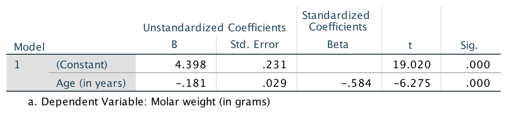
```


```{r}
cyclone.lm <- lm(Total ~ OND, 
                 data = Cyclones)
```

::: {.example #RegressionCoefficients name="Regression coefficients"}
The regression equation for the cyclone data (Fig.\ \@ref(fig:ONIcyclones)) is found from the software output (Fig.\ \@ref(fig:CyclonesRegressionjamoviSPSS)):
$$
  \hat{y} = 12.14 - 2.23x,
$$
where\ $x$ is the ONI (averaged over October, November, December) and\ $y$ is the number of cyclones; that is, $b_0 = 12.14$ and $b_1 = -2.23$.
These values are close the approximations made in Example\ \@ref(exm:CycloneRegressionGuesses) ($b_0 = 12$ and $b_1 = -2.25$ respectively).
:::


```{r CyclonesRegressionjamoviSPSS, fig.cap="The software output for the cyclone data.", fig.align="center", out.width=c("55%"), fig.show="hold"}
knitr::include_graphics( "jamovi/Cyclones/Cyclones-Regression.png")
#knitr::include_graphics( "SPSS/Cyclones/SPSS-Cycones-Regression.png")
```


`r if (knitr::is_html_output()){
  'You may like the following interactive activity, which explores regression equations.'}`

<div style="text-align:center;">
<iframe src="https://phet.colorado.edu/sims/html/least-squares-regression/latest/least-squares-regression_en.html" width="600" height="450" scrolling="no" allowfullscreen="true"></iframe>
</div>


## Using regression equations for making predictions {#RegressionForPrediction}
\index{Regression!equation!making predictions}

<div style="float:right; width: 222x; border: 1px; padding:10px">

</div>

The regression equation for the red-deer data in Eq.\ \@ref(eq:RedDeerRegressionEqn) can be used to make *predictions* of the mean value of\ $y$ for a given value of\ $x$.
For example, the equation can be used to predict the *average* molar weight for $10$-year-old male red deer.
Since\ $x$ represents the age, use $x = 10$ in the regression equation:
\begin{align*}
         \hat{y} 
         &= `r RD.b0` - (`r abs(RD.b1)`\times 10)\\
         &= `r RD.b0` - `r abs(RD.b1 * 10)` = `r RD.b0 + RD.b1*10`.
\end{align*}
Male red deer $10$-years-old are predicted to have a *mean* molar weight of $`r  RD.b0 + RD.b1*10`$\gs.
Some individual deer aged\ $10$ will have molars weighing *more* than this, and some weighing *less* than this; the model predicts that the *mean* molar weight for male red deer aged\ $10$ will be about $`r RD.b0 + RD.b1*10`$\gs.


:::: {.importantBox .important data-latex="{iconmonstr-warning-8-240.png}"}
The value of\ $\hat{y}$ is computed using the estimates\ $b_0$ and\ $b_1$, which are computed from sample data. 
Hence, the value of\ $\hat{y}$ is also depends on which one of the countless possible samples is used.
This means that\ $\hat{y}$ also has a standard error.
:::


Suppose we were interested in male red deer $20$-years-of-age; the mean predicted weight of the molars is
$$
  \hat{y} = 4.398 - (0.181 \times 20) = 0.778,
$$
or about\ $0.78$\gs.
This prediction *may* be a useful prediction, but it also *may* be rubbish.
In the data, the oldest deer is aged $14.4$\ years, so the regression line may not even apply for deer aged over $14.4$\ years of age.
For example, the relationship may be non-linear after $14$\ years of age, or red deer may not even live to $20$\ years of age.
The prediction *may* be sensible, but it *may not* be either.
We don't know whether the prediction is sensible or not, because we have no data for deer aged over $14.4$\ years to inform us.

Making predictions outside the range of the available data is called *extrapolation*, and *extrapolation* beyond the data may lead to nonsense predictions.
As an extreme example, deer aged\ $25$ would be predicted to have a mean molar weight of $-0.127$\gs, which is clearly nonsense (molars cannot have a negative weight).


::: {.definition #Extrapolation name="Extrapolation"}
*Extrapolation* refers to making predictions outside the range of the available data.
Extrapolation beyond the data may lead to nonsense predictions.\index{Extrapolation}
:::


## Using regression equations for understanding relationships {#RegressionForUnderstanding}
\index{Regression!equation!for understanding}

The regression equation can be used to *understand* the relationship between the two variables.
Consider again the red-deer regression equation in Eq.\ \@ref(eq:RedDeerRegressionEqn):
\begin{equation}
   \hat{y}
   = 
   `r RD.b0` 
   - 
    `r abs(RD.b1)` x.
   (\#eq:RedDeerEquation)
\end{equation}
What does this equation reveal about the relationship between\ $x$ and\ $y$?


### The meaning of $b_0$

$b_0$ is the *predicted* value of\ $y$ when $x = 0$ (Sect.\ \@ref(Regression-Software)).
Using $x = 0$ in Eq.\ \@ref(eq:RedDeerEquation) predicts a mean molar weight of
$$
  \hat{y} = 4.398 - (0.181\times 0) = 4.398
$$
for deer zero years of age (i.e., newborn male red deer).
This prediction is the predicted *mean* molar weight; some individual deer will have molars weights greater than this, and some less than this.

This predicted mean may be nonsense: it is *extrapolating*\index{Extrapolation} beyond the data (the youngest deer in the sample is aged $4.4$\ years).
Indeed, young deer are born with molars that are replaced as they grow, so the regression line does not even apply.


::: {.tipBox .tip data-latex="{iconmonstr-info-6-240.png}"}
The value of the intercept\ $b_0$ is sometimes (but not always) meaningless.
The value of the slope\ $b_1$ is usually of greater interest, as it explains the *relationship* between the two variables.
:::


### The meaning of $b_1$ {#SlopeMeaning}

The slope\ $b_1$ tells us how much the value of $y$ changes (on average) when the value of\ $x$ *increases* by one (Sect.\ \@ref(Regression-Software)).
For the red-deer data, $b_1$ tells us how much the molar weight changes (on average) when age increases by one year.

Specifically, each extra year older is associated with an average change of $`r RD.b1`$\gs in molar weight (see Eq.\ \@ref(eq:RedDeerEquation)); that is, a *decrease* in molar weight by a mean of $`r abs(RD.b1)`$\gs.
The molars of some individual deer will lose more weight than this in some years, and some will lose less; the value is a *mean* weight loss per year.

To demonstrate, consider the case where $x = 10$, and\ $y$ is predicted to be $\hat{y}= `r RD.b0 + 10 * RD.b1`$\gs.
For deer one year older than this (i.e., $x = 11$) we predict\ $y$ to increase by $b_1 = `r RD.b1`$\gs (or, equivalently, *decrease* by $0.181$\gs).
That is, we would predict $\hat{y}= `r RD.b0 + 10*RD.b1`  - `r abs(RD.b1)` = `r RD.b0 + 11*RD.b1`$\gs.
This is the same prediction made by using $x = 11$ in Eq.\ \@ref(eq:RedDeerEquation).


::: {.tipBox .tip data-latex="{iconmonstr-info-6-240.png}"}
If the value of\ $b_1$ is *positive*, then the predicted values of\ $y$ *increase* as the values of\ $x$ *increase*.
If the value of\ $b_1$ is *negative*, then the predicted values of\ $y$ *decrease* as the values of\ $x$ *increase*.
:::


This interpretation of $b_1$ explains the relationship: the average wear of molars is, on average, about $0.181$\gs per year in male red deer.


::: {.importantBox .important data-latex="{iconmonstr-warning-8-240.png}"}
In general, we say that a change in the value of\ $x$ is *associated* with a change in the value of\ $y$.
Unless the study is experimental (Sect.\ \@ref(ExperimentalStudies)), we cannot say that the change in the value of\ $x$ *causes* the change in the value of\ $y$. 
:::


::: {.importantBox .important data-latex="{iconmonstr-warning-8-240.png}"}
If the value of the slope is zero, there is *no linear relationship* between\ $x$ and\ $y$.
The slope means that a change in the value of\ $x$ is associated with a change of zero in the value of\ $y$.
In this case, the correlation coefficient is also zero.
:::


## Confidence intervals for the regression parameters {#RegressionCI}

### Introduction {#RegressionTests-Intro}
\index{Confidence intervals!regression parameters}

A regression equation exists in the *population*, and is estimated using the sample information.
The regression line is estimated using the observed *sample* data.
That is, the regression line is estimated from one of the countless possible samples, and is an estimate of the regression line in the population.

In the *population*, the intercept is denoted by\ $\beta_0$ and the slope by\ $\beta_1$.
The regression line is
$$
  \hat{y} = \beta_0 + \beta_x.
$$
The values of the parameters\ $\beta_0$ and\ $\beta_1$ are unknown, and are estimated by the statistics\ $b_0$ and\ $b_1$ respectively.


:::: {.pronounceBox .pronounce data-latex="{iconmonstr-microphone-7-240.png}"}


::: {style="display: flex;"}
The symbol\ $\beta$ is the Greek letter 'beta', pronounced 'beater' (as in 'egg beater').
So\ $\beta_0$ is pronounced as 'beater-zero', and\ $\beta_1$ as 'beater-one'.
:::

::: {}
```{r}
htmltools::tags$video(src = "./Movies/beta.mp4", 
                      width = "121", 
                      loop = "FALSE", 
                      controls = "controls", 
                      loop = "loop", 
                      style = "padding:5px; border: 2px solid gray;")
```
:::

::::


Every sample is likely to produce a slightly different value for both\ $b_0$ and\ $b_1$ (*sampling variation*),\index{Sampling variation} so both\ $b_0$ and\ $b_1$ have a standard error and a sampling distribution.
The formulas for computing the values of\ $b_0$ and\ $b_1$ (and their standard errors) are intimidating, so we will use software to perform the calculations.


### Describing the sampling distribution {#SamplingDistributionSlopeCI}
\index{Sampling distribution!regression parameters}

The sample estimates\ $b_0$ and\ $b_1$ can vary across all possible samples, and so have *sampling distributions*.\index{Sampling distribution}
Under certain conditions (Sect.\ \@ref(RegressionStatValidity)), the sampling distributions for both\ $b_0$ and\ $b_1$ are normal distributions.

Usually the slope is of greater interest than the intercept, because the slope explains the *relationship* between the two variables (Sect.\ \@ref(RegressionForUnderstanding)).
For this reason, the sampling distribution for the slope only is given below, but the sampling distribution for the intercept is analogous.
The ideas below apply similarly to\ $\beta_0$.


:::{.definition #Beta1SamplingDistn name="Sampling distribution of a sample slope"}
The sampling distribution of the sample regression slope is (when certain conditions are met; Sect.\ \@ref(RegressionStatValidity)) described by

* an approximate normal distribution,
* with a mean of\ $\beta_1$, and 
* a standard deviation, called the *standard error of the slope* and denoted $\text{s.e.}(b_1)$.

A formula exists for finding $\text{s.e.}(b_1)$, but is tedious to use, and we will not give it.
:::


This sampling distribution describes all possible values of the sample slope from all possible samples, through *sampling variation*.
For the red-deer data then, the values of the sample slope across all possible samples is described (Fig.\ \@ref(fig:RedDeerSlopeSampDistCI)) as:

* an approximate normal distribution,
* with a sampling mean whose value is\ $\beta_1$, and 
* a standard deviation of $\text{s.e.}(b_1) = 0.029$ (from software;\index{Software output!regression} Fig.\ \@ref(fig:RedDeerRegressionjamoviSPSSraw)).


```{r RedDeerSlopeSampDistCI, fig.cap="The distribution of sample slope for the red-deer data, around the population slope\\ $\\beta_1$.", fig.align="center", fig.height=2.9, fig.width=8.25, out.width='85%'}
mn <- 0
se <- 0.0289

par( mar = c(4, 0, 0, 1))
out <- plotNormal(mu = mn, 
                  sd = se,
                  round.dec = 4,
                  cex.axis = 0.95,
                  ylim = c(0, 23),
                  showXlabels = c( expression(beta[1] - 0.087),
                                   expression(beta[1] - 0.058),
                                   expression(beta[1] - 0.029),
                                   expression(beta[1]),
                                   expression(beta[1] + 0.029),
                                   expression(beta[1] + 0.058),
                                   expression(beta[1] + 0.087)),
                  main = "", # Main title
                  xlab = "Sample regression slopes", # horizontal axis labels
                  showZ = TRUE) # Whether to show z = -3:3 or not

arrows( x0 = 0,
        x1 = 0,
        y0 = 20,
        y1 = 14,
        angle = 15,
        length = 0.15)
text(x = 0,
     y = 20,
     pos = 3,
     labels = "Sampling mean")

arrows(x0 = 0,
       x1 = 0.029,
       y0 = 3,
       y1 = 3,
       angle = 15,
       length = 0.15)
text(x = 0.029/2,
     y = 3,
     pos = 3,
     labels = "Std error")
```


As seen earlier, when the sampling distribution is an approximate normal distribution, CIs have the form
$$
  \text{statistic} \pm ( \text{multiplier} \times \text{standard error}),
$$
where the multiplier is\ $2$ for an *approximate* $95$%\ CI (from the $68$--$95$--$99.7$ rule).
In this context, a CI for the slope is
$$
  b_1 \pm \big( \text{multiplier} \times \text{s.e.}(b _1)\big).
$$
Thus, an approximate $95$%\ CI is 
$$
  -0.181 \pm (2\times 0.029)\qquad\text{or}\qquad -0.181 \pm 0.058,
$$
which is from\ $-0.239$ to\ $-0.123$\gs/year.

Software can be used to produce *exact* CIs too (Fig.\ \@ref(fig:RedDeerRegressionjamoviSPSSCI)); the exact $95$% CI is from\ $-0.239$ to\ $-0.124$\gs/year.\index{Software output!regression}
The *approximate* and *exact* $95$%\ CIs are very similar.
We write:

> For each increase of one year in the age of male red deer, the mean molar weight *increases* by\ $-0.181$ grams per year (approx.\ $95$%\ CI: $-0.239$ to\ $-0.123$; $n = 78$).

Alternatively (and equivalently, but probably easier to understand):

> For each increase of one year in the age of male red deer, the mean molar weight *decreases* by\ $0.181$ grams per year (approx.\ $95$%\ CI: $0.239$ to\ $0.123$; $n = 78$).


```{r RedDeerRegressionjamoviSPSSCI, fig.cap="Output for the red-deer data, including the CIs for the regression parameters.", fig.align="center", out.width=c("75%"), fig.show="hold"}
knitr::include_graphics( "jamovi/RedDeer/RedDeer-Regression-CI.png")
#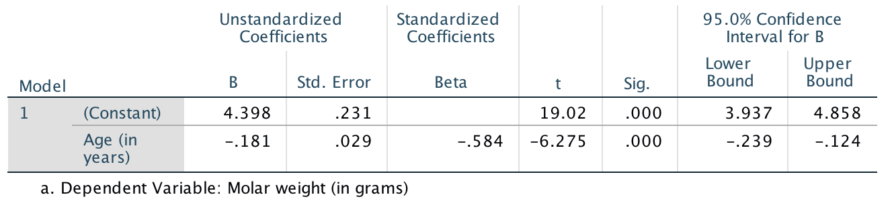
```


::: {.example #CyclonesCI name="Cyclones"}
Using the software output (Fig.\ \@ref(fig:CyclonesRegressionjamoviSPSS)) for the cyclone data, $\text{s.e.}(b_1) = 0.404$, so the approximate $95$%\ CI for the regression slope $\beta_1$ is
$$
   -2.23 \pm (2 \times 0.404)\text{\qquad {or}\qquad} -2.23 \pm 0.808.
$$
The interval from\ $-3.04$ to\ $-1.42$ is likely to straddle the population slope.
:::


## Hypothesis tests for the regression parameters: $t$-tests {#RegressionHT}
\index{Hypothesis testing!regression parameters}

For the red-deer data, the RQ posed in Sect.\ \@ref(CorrelationTesting) is

> In male red deer, does the molar weight *decrease* linearly as age increase?

Since the regression line describing this relationship is computed from one of countless possible samples, any relationship between\ $x$ and\ $y$ observed in the sample may be due to sampling variation. 
Possibly, no relationship exists in the population (i.e., $\beta_1 = 0$); the only reason why a relationship appears in the *sample* is due to sampling variation.
That is, a hypothesis test can be conducted for the slope.
(Similar hypothesis tests can be conducted for the intercept, but are usually of less interest.)

The null hypothesis for tests about the slope is the usual 'no relationship' hypothesis.
In this context, 'no relationship' means that the slope is zero (Sect.\ \@ref(SlopeMeaning)), so the null hypotheses (about the *population*) is $H_0$: $\beta_1 = 0$.
A slope of *zero* is equivalent to *no relationship* between the variables.
(We would also find $\rho = 0$.)
The RQ implies these hypotheses about the slope:
$$
   \text{$H_0$: } \beta_1 = 0\quad\text{and}\quad\text{$H_1$: } \beta_1 < 0.
$$
The parameter is\ $\beta_1$, the population slope for the regression equation predicting molar weight from age.
The alternative hypothesis is one-tailed, based on the RQ.


```{r}
RD.fitinfo <- summary(RD.lm)$coefficients
RD.t <- RD.fitinfo[, "t value"]
RD.P <- RD.fitinfo[, "Pr(>|t|)"]
```


Assuming the null hypothesis is true (i.e., that $\beta_1 = 0$), the possible values of the sample slope\ $b_1$ can be described (Def.\ \@ref(def:Beta1SamplingDistn)).
The variation in the sample slope across all possible samples when $\beta_1 = 0$ is described (Fig.\ \@ref(fig:RedDeerSlopeSampDist)) using:

* an approximate normal distribution,
* with a sampling mean whose value is $\beta_1 = 0$ (from $H_0$), and 
* a standard deviation of $\text{s.e.}(b_1) = 0.0289$ (from software; Fig.\ \@ref(fig:RedDeerRegressionjamoviSPSSCI)).


```{r RedDeerSlopeSampDist, fig.cap="The distribution of sample slopes for the red-deer data, if the population slope is $\\beta_1 = 0$.", fig.align="center", fig.height=3.25, fig.width=8.25, out.width='85%'}
par( mar = c(5, 2, 1, 2))
mn <- 0
se <- 0.0289

out <- plotNormal(mu = mn, 
                  sd = se,
                  ylim = c(0, 27),
                  round.dec = 4,
                  main = "", # Main title
                  xlab = "Sample regression slopes", # horizontal axis labels
                  showZ = TRUE) # Whether to show z = -3:3 or not

arrows( x0 = 0,
        x1 = 0,
        y0 = 22,
        y1 = 14,
        angle = 15,
        length = 0.15)
text(x = 0,
     y = 22,
     pos = 3,
     labels = "Sampling mean")

arrows(x0 = 0,
       x1 = 0.029,
       y0 = 3,
       y1 = 3,
       angle = 15,
       length = 0.15)
text(x = 0.029/2,
     y = 3,
     pos = 3,
     labels = "Std error")
```


The *observed* sample slope for the red-deer data is $b_1 = -0.181$.
Locating this value on Fig.\ \@ref(fig:RedDeerSlopeSampDist) shows that it is *very* unlikely that any of the many possible samples would produce such a slope, just through sampling variation, if the population slope really was $\beta_1 = 0$.
The *test statistic* is found using the usual approach when the sampling distribution has an approximate normal distribution:
\begin{align*}\index{Test statistic!t@$t$-score}
   t 
   &= \frac{\text{observed value} - \text{mean of the distribution of the statistic}}{\text{standard dev. of the distribution of the statistic}}\\
   &= \frac{ b_1 - \beta_1}{\text{s.e.}(b_1)} 
    = \frac{-0.181 - 0}{0.0289} = -6.27,
\end{align*}
where the values of\ $b_1$ and\ $\text{s.e.}(b_1)$ are taken from the software output (Fig.\ \@ref(fig:RedDeerRegressionjamoviSPSSCI)).
This $t$-score is the same value reported by the software.


To determine if the statistic is *consistent* with the null hypothesis, the $P$-value can be approximated using the $68$--$95$--$99.7$ rule, approximated using tables, or taken from software output (Fig.\ \@ref(fig:RedDeerRegressionjamoviSPSSCI)).
Here, the $P$-value will be very small; software shows the *two*-tailed $P$-value is $P < 0.001$, so the *one*-tailed $P$-value is $P < 0.0005$.


We write:

> The sample presents very strong evidence ($t = -6.27$; one-tailed $P < 0.0005$) that, in the population, the mean weight of molars decreases linearly as male red deer get older (slope: $-0.181$; $95$%\ CI from\ $-0.239$ to\ $-0.124$; $n = 78$).

Notice the three features of writing conclusions again:
an *answer to the RQ*; evidence to support the conclusion ($t = -6.27$; one-tailed $P < 0.0005$); and some *sample summary information* (slope: $-0.181$; $95$%\ CI from\ $-0.239$ to\ $-0.124$; $n = 78$).


<!-- ```{r RedDeerRegressionjamoviSPSS, fig.cap="Output for the red-deer data. Top: jamovi; bottom: SPSS", fig.align="center", out.width=c("60%", "80%"), fig.show="hold"} -->
<!-- knitr::include_graphics( "jamovi/RedDeer/RedDeer-Regression.png") -->
<!--  -->
<!-- ``` -->


::: {.example #ONIRegression name="Hypothesis testing"}
For the cyclone data (Example\ \@ref(exm:RegressionCoefficients)), the RQ is 

> In the Australian region, is there a relationship between ONI and the number of cyclones?

This RQ implies these hypotheses:
$$
   \text{$H_0$: } \beta_1 = 0\quad\text{and}\quad\text{$H_1$: } \beta_1 \ne 0.
$$
From the output (Fig.\ \@ref(fig:CyclonesRegressionjamoviSPSS)), $t = -5.52$ and the $P$-value is small: $P < 0.001$.
We write:

> The sample presents very strong evidence ($t = -5.52$; two-tailed $P < 0.001$) that, in the population, the number of cyclones is related to the ONI (slope: $-2.23$; $95$%\ CI from\ $-3.04$ to\ $-1.42$; $n = 37$).
:::


<iframe src="https://learningapps.org/watch?v=phxny7fec22" style="border:0px;width:100%;height:500px" allowfullscreen="true" webkitallowfullscreen="true" mozallowfullscreen="true"></iframe>


## Statistical validity conditions {#RegressionStatValidity}
\index{Statistical validity (for inference)!regression parameters}

The results for the CI and the hypothesis test hold when certain conditions are met.
The conditions for which the test is statistically valid are the same as for correlation (Sect.\ \@ref(ValidityCorrelation)):

1. The relationship is approximately linear (necessary for the regression equation to be appropriate).
1. The variation in the response variable is approximately constant for all values of the explanatory variable.
1. The sample size is at least\ $25$.

The sample size of\ $25$ is a rough figure; some books give other values.
The units of analysis are also assumed to be *independent* (e.g., from a simple random sample).

Depending on which statistical validity conditions are not met, other options may be available.
For example, generalized linear models [@mypapers:dunnsmyth:glms] may be appropriate for some non-linear relationships.


::: {.example #StatisticalValidityDeerReg name="Statistical validity"}
For the red-deer data, the relationship is approximately linear, and the variation in molar weight appears to be somewhat constant for various ages (Fig.\ \@ref(fig:RedDeerScatter)), so regression is appropriate.
The sample size is $n = 78$.
The CI and hypothesis test are statistically valid.
:::


::: {.example #ONIValidity name="Cyclones"}
The scatterplot for the cyclone data (Fig.\ \@ref(fig:ONIcyclones)) shows the relationship is approximately linear, that the variation in the number of cyclones seems reasonably constant for different values of the ONI, and the sample size is larger than\ $25$ ($n = 37$).
The CI (Example\ \@ref(exm:CyclonesCI)) and the test (Example\ \@ref(exm:ONIRegression)) are statistically valid.
:::
                    

## Example: removal efficiency {#RegressionRemovalEfficiency}

[*Dataset*: `Removal`]
(This study was seen in Sect.\ \@ref(Removal-Efficiency).)
In wastewater treatment facilities, air from biofiltration is passed through a membrane and dissolved in water, and is transformed into harmless by-products.
The removal efficiency\ $y$ (in percent) may depend on the inlet temperature (in\ ^o^C; $x$).
One RQ is

> In treating biofiltration wastewater, is removal efficiency related to the inlet temperature?

The scatterplot of the data (Fig.\ \@ref(fig:CorrelationRemovalEfficiency)) shows the relationship is approximately linear.
From the software output (Fig.\ \@ref(fig:RemovalEfficiencyjamoviSPSSRegression)), $b_0 = 97.5$ and $b_1 = 0.0757$, so the regression equation is
$$
  \hat{y} = 97.5 + 0.0757x
$$
for\ $x$ and\ $y$ defined above.
The slope quantifies the relationship, so we can test
$$
   \text{$H_0$: } \beta_1 = 0 \qquad\text{and}\qquad \text{$H_1$: } \beta_1 \ne 0.
$$
From the output, $t = 10.7$ which is huge; the $P$-value is small as expected: $P < 0.001$. 
The output does not include the CI, but since $\text{s.e.}(b_1) = 0.00705$, the *approximate* $95$%\ CI is
$$
  0.0757 \pm (2 \times 0.00705), \quad\text{ or }\quad 0.0757 \pm 0.0141.
$$
We write:

> Very strong evidence exists ($t = 10.7$; $P < 0.001$) that inlet temperature is linearly related to removal efficiency (slope:\ $0.0757$; approximate $95$%\ CI: $0.0616$ to\ $0.0898$).


<!-- ```{r RegressionRemovalEfficiency, fig.cap="The relationship between removal efficiency and inlet temperature", fig.align="center", out.width='90%', fig.width=8, fig.height=3.5} -->
<!-- data(Removal) -->

<!-- par(mfrow = c(1, 2)) -->

<!-- plot(Removal ~ Temp,  -->
<!--      data = Removal, -->
<!--      xlab = "Temperature (degrees C)", -->
<!--      ylab = "Removal efficiency (%)", -->
<!--      pch = 19, -->
<!--      las = 1 -->
<!--      ) -->

<!-- ### -->

<!-- plot(Removal ~ Temp,  -->
<!--      data = Removal, -->
<!--      xlab = "Temperature (degrees C)", -->
<!--      ylab = "Removal efficiency (%)", -->
<!--      pch = 19, -->
<!--      las = 1 -->
<!--      ) -->
<!-- abline( lm( Removal ~ Temp, -->
<!--             data = Removal), -->
<!--         col = "grey", -->
<!--         lwd = 2) -->

<!-- ``` -->


```{r RemovalEfficiencyjamoviSPSSRegression, fig.cap="Regression output for the removal-efficiency data.", fig.align="center", out.width=c("55%", "75%"), fig.show="hold"}
knitr::include_graphics("jamovi/Removal/RemovalRegression.png")
#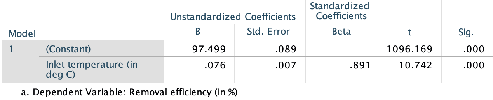
```

The CI and test are statistically valid: the relationship is approximately linear, the variation in $y$ is approximately constant for all values of $x$, and $n = 32$.


<iframe src="https://learningapps.org/watch?v=pbefaxc9t22" style="border:0px;width:100%;height:500px" allowfullscreen="true" webkitallowfullscreen="true" mozallowfullscreen="true"></iframe>


## Chapter summary {#Chap35-Summary}

*Regression* mathematically describes the relationship between two *quantitative* variables: the response variable\ $y$, and the explanatory variable\ $x$.
The linear relationship between\ $x$ and\ $y$ (the *regression equation*), in the sample, is
$$
   \hat{y} = b_0 + b_1 x,
$$
where\ $b_0$ is a number (the *intercept*), $b_1$ is a number (the *slope*), and the 'hat' above the\ $y$ indicates that the equation gives a *predicted mean* value of\ $y$ for the given $x$-value.
Software provides the values of $b_0$ and $b_1$.

The *intercept* is the predicted mean value of\ $y$ when the value of\ $x$ is zero.
The *slope* is how much the predicted mean value of\ $y$ changes, on average, when the value of\ $x$ *increases* by\ $1$.

The regression equation can be used to make *predictions* or to *understand* the relationship between the two variables.
Predictions made with values of\ $x$ outside the values of\ $x$ used to create the regression equation (called *extrapolation*)\index{Extrapolation} may not be reliable.

The regression equation in the population is
$$
  \hat{y} = \beta_0 + \beta_1 x.
$$
To compute a confidence interval (CI) for the slope of a regression equation, software provides the standard error of\ $b_1$, and the CI is
$$
   {b_1} \pm \left( \text{multiplier}\times\text{standard error} \right).
$$
The *margin of error* is (multiplier${}\times{}$standard error), where the multiplier is\ $2$ for an approximate $95$%\ CI (using the $68$--$95$--$99.7$ rule).

To test a hypothesis about a population correlation coefficient $\rho$:

* Write the null hypothesis ($H_0$) and the alternative hypothesis\ ($H_1$).
* Initially *assume* the value of\ $\beta_1$ in the null hypothesis to be true.
* Then, describe the *sampling distribution*, which describes what to *expect*  from the sample correlation coefficient on this assumption: under certain statistical validity conditions, the sample correlation coefficients vary with:
   *  an approximate normal distribution,
   *  with sampling mean whose value is the value of $\beta_1 = 0$ (from\ $H_0$), and
   *  having a standard deviation of $\displaystyle \text{s.e.}(b_1)$.
* Compute the value of the *test statistic*:
$$
   t = \frac{b_1 - \beta_1}{\text{s.e.}(b_1)},
$$
where\ $b_1$ is sample slope.
* The $t$-value is like a $z$-score, and so an approximate *$P$-value* can be estimated using the $68$--$95$--$99.7$ rule, or found using software.
* Make a decision, and write a conclusion.
* Check the statistical validity conditions.


<div style="text-align:center;">
<iframe width="560" height="315" src="https://www.youtube.com/embed/4sl8xhLG6Ls" frameborder="0" allow="accelerometer; encrypted-media; gyroscope; picture-in-picture"></iframe>
</div>


## Quick review questions {#Chap39-QuickReview}


```{r, results='hide'}
data(AISsub)
AIS.out <- lm(Wt ~ Ht, 
              data = subset(AISsub, Sport == "Rowing") )
summary(AIS.out)
```


::: {.webex-check .webex-box}
@data:Telford1991:sexsportsize examined the relationship between the height and weight of $n = 37$ rowers at the *Australian Institute of Sport* (AIS; Fig.\ \@ref(fig:ScatterAISRowers)).
The regression equation is $\hat{y} = -138 + 1.2 x$.


```{r ScatterAISRowers, results ='hide', fig.cap="Scatterplot of weight against height for rowers at the AIS.", fig.width=5, fig.height=3.5, fig.align="center"}
plot( Wt ~ Ht,
      data = subset(AISsub, Sport == "Rowing"),
      las = 1,
      xlim = c(150, 200),
      ylim = c(50, 100),
      main = "Weight vs Height: AIS rowers",
      xlab = "Height (in cm)",
      ylab = "Weight (in kg)",
      pch = 19)
```

Are the following statements *true* or *false*?

1. Based on the scatterplot, 'weight of the rower' is considered the $y$-variable.  \tightlist
`r if( knitr::is_html_output() ) { torf(answer=TRUE) }`
1. Using the 'rise-over-run' idea, a rough estimate of the value of the slope is $1.2$.
`r if( knitr::is_html_output() ) { torf(answer=TRUE) }`
1. The measurements units for the slope are kg.
`r if( knitr::is_html_output() ) { torf(answer=FALSE) }`
1. The measurements units for the intercept are kg.
`r if( knitr::is_html_output() ) { torf(answer=TRUE) }`
1. In the regression, $x$ represents the height of the rower.
`r if( knitr::is_html_output() ) { torf(answer=TRUE) }`
1. The standard error of the slope is $0.112$, so the value of the *test statistic* to test if the population slope is zero is $t = 10.7$.
`r if( knitr::is_html_output() ) { torf(answer=TRUE) }`
1. The $P$-value for this test will be *very small*.
`r if( knitr::is_html_output() ) {torf( answer = TRUE)}`
1. Predicting the mean weight of a $220$\cms-tall rower would be *extrapolation*.
`r if( knitr::is_html_output() ) { torf(answer=TRUE) }`

Select the correct answer:

9. What does the 'hat' above the $y$ mean?
`r if( knitr::is_html_output() ) {longmcq( c(
  "That the weights are not measured accurately.",
  "That the weights are population values.",
  "That the regression model gives poor estimates.",
  "That the regression model gives good estimates.", 
  "That the regression model estimates the weight.",
  answer = "That the regression model estimates the mean weight.") )
} else {
  " 
    a. That the weights are not measured accurately.
    b. That the weights are population values.
    c. That the regression model gives *poor* estimates.
    d. That the regression model gives *good* estimates.
    e. That the regression model estimates the weight.
    f. That the regression model estimates the mean weight." 
}`
10. What mean weight is predicted for a rower who is $180$\cms tall?  
`r if( knitr::is_html_output() ) {
  fitb( answer = 78, num = TRUE, tol = 0.1 )
} else {
  '**a.**\\ $-24\\,624$\\kgs;\\ \\ **b.**\\ $78$\\kgs; \\ **c.** $138$\\kgs'
}`


:::


## Exercises {#RegressionExercises}

Answers to odd-numbered exercises are available in App.\ \@ref(Answers).

`r if( knitr::is_latex_output() ) "\\captionsetup{font=small}"`

::: {.exercise #RegressionGuess}
For each of the plots in Fig.\ \@ref(fig:RegressionGuesstimate), where appropriate:

1. estimate the value of\ $r$ (this is hard!).
1. estimate the intercept of the regression line.
1. estimate the slope of the regression line, using the rise-over-run idea.
1. write down the estimated regression equation.
:::


```{r RegressionGuesstimate, fig.align="center", out.width='90%', fig.width=6.5, fig.height=5.0, fig.cap="Four scatterplots."}
par( mfrow = c(2, 2))

set.seed(1075)

addLine <- function(x, y){
  abline( coef( lm( y ~ x)),
          lwd = 2,
          col = "darkgrey")
}


x <- runif(35,
           min = -2, 
           max = 4)

y1 <- 3.75 + 1.45 * x + 
  rnorm( length(x),
         mean = 0,
         sd = 1.25)
y2 <- 7 + 2.4 * x + 
  rnorm( length(x),
         mean = 0,
         sd = 1.05)
y3 <- 4 + 0.75 * x +  + 
  rnorm( length(x),
         mean = 0,
         sd = 0.45 + 0.05 * (x + 3 )^2 )
y4 <- 7.25 - 1.5* x + 1.0 + 
  rnorm( length(x),
         mean = 0,
         sd = 0.6)

plot( y1 ~ x,
      las = 1,
      pch = 19,
      xlim = c(-2, 4),
      ylim = c(0, 12),
      main = "Plot A",
      xlab = expression(italic(x)*"-"*values),
      ylab = expression(italic(y)*"-"*values) )
addLine(x, y1)

plot( y2 ~ x,
      las = 1,
      pch = 19,
      xlim = c(-2, 4),
      ylim = c(0, 20),
      main = "Plot B",
      xlab = expression(italic(x)*"-"*values),
      ylab = expression(italic(y)*"-"*values) )
addLine(x, y2)

plot( y3 ~ x,
      las = 1,
      pch = 19,
      xlim = c(-2, 4),
      ylim = c(0, 10),
      main = "Plot C",
      xlab = expression(italic(x)*"-"*values),
      ylab = expression(italic(y)*"-"*values) )
addLine(x, y3)

plot( y4 ~ x,
      las = 1,
      pch = 19,
      xlim = c(-2, 4),
      ylim = c(0, 12),
      main = "Plot D",
      xlab = expression(italic(x)*"-"*values),
      ylab = expression(italic(y)*"-"*values) )
addLine(x, y4)

```


::: {.exercise #RegressionExerciseManifold}
[*Dataset*: `Throttle`]
@amin2019robust measured the throttle angle\ ($x$) and the manifold air pressure\ ($y$), as a fraction of the maximum value, in gas engines.

1. The value of\ $r$ is given in the article as\ $0.972986604$. 
   Comment on this, and what it means.
1. Comment on the use of a regression model, based on the scatterplot (Fig.\ \@ref(fig:ThrottleAngle)). 
1. The authors fitted the following regression model: $y = 0.009 + 0.458x$.
   Identify errors that the researchers have made when giving this regression equation.
1. Critique the researchers' approach.
:::


```{r ThrottleAngle, fig.cap="Manifold air pressure plotted against throttle angle for an internal-combustion gas engine.", fig.align="center", fig.width=5, fig.height=3.5}

par(mar = c(5.1, 5.1, 4.1, 2.1))

data(Throttle) ### Exercise

plot(Throttle, 
     pch = 19, 
     xlab = "Throttle angle (degrees)", 
     ylab = "Manifold air pressure\n(as fraction of the max.)", 
     main = "Manifold air pressure and\n throttle angle",
     ylim = c(0, 1),
     xlim = c(0, 90),
     las = 1)
par(mar = c(5.1, 4.1, 4.1, 2.1))

TAlm <- lm(MAPvalue ~ ThrottleAngle, 
           data = Throttle)
abline(coef(TAlm), 
       lwd = 2, 
       col = "grey")
```


::: {.exercise #RegressionValues}
For each regression equation below, identify the values of\ $b_0$ and\ $b_1$.

1. $\hat{y} = 3.5 - 0.14x$.
2. $\hat{y} = -0.0047x + 2.1$.
:::


::: {.exercise #RegressionValues2}
For each regression equation below, identify the values of\ $b_0$ and\ $b_1$.

1. $\hat{y} = -1.03 +  7.2x$.
2. $\hat{y} = -1.88x -  0.46$.
:::


:::{.exercise #PlotAndPoints1}
Draw the regression line $\hat{y} = 5 + 2x$ for values of\ $x$ between $0$ and $10$.

1. Add some points to the scatterplot such that the correlation is approximately $r = 0.9$.
2. Add some more points to the scatterplot such that the correlation is approximately $r = 0.3$.
:::


:::{.exercise #PlotAndPoints2}
Draw the regression line $\hat{y} = 20 - 3x$ for values of\ $x$ between $0$ and $5$.

1. Add some points to the scatterplot such that the correlation is approximately $r = -0.95$.
2. Add some more points to the scatterplot such that the correlation is approximately $r = -0.2$.
:::


::: {.exercise #Apnoea}
[*Dataset*: `OSA`]
@carvalho2020stop studied obstructive sleep apnoea\ (OSA) in adults with Down Syndrome.
Sixty adults participated in a sleep study and had information recorded.
The response variable is OSA severity: the average number of episodes of sleep disruption (according to specific criteria) per hour of sleep (called the Respiratory Event Index, REI).
One research question is:

> Among Down Syndrome adults, is there a linear relationship between the REI and neck size?

Here,\ $x$ is the neck size (in cm), and\ $y$ is the REI value.
`r if( knitr::is_html_output() ) {
  'The data are shown in Fig.\\ \\@ref(fig:OSADT);'
} else
{
  'Part of the data are shown in Table\\ \\@ref(tab:OSAKable);'
}
`
all the data are plotted in Fig.\ \@ref(fig:OSAscatter) (left panel).

1. Using the software output (Fig.\ \@ref(fig:OSAscatter)), determine the value of $r$.
1. Interpret the value of\ $R^2$.
1. Write down the values of the intercept and the slope, and hence the regression equation.
1. Explain what the slope in the regression equation means.
1. Find an approximate $95$%\ CI for the slope.
1. Perform a hypothesis to test if a relationship exists between the variables.
1. Are the test and CI statistically valid?
:::


```{r}
data(OSA) ### Exercise

OSAoriginal <- OSA

OSA <- OSA[ -c(1, 7) ] # Remove ID (col1 ) and SAOS (col 6)
OSA$Gender <- factor(OSA$Gender, 
                     levels = 1:2, 
                     labels = c("Male", 
                                "Female"))
useOSA <- array( dim = c(9, 5))

useOSA[1:4, ] <- as.matrix(head(OSA, 4))
useOSA[6:9, ] <- as.matrix(tail(OSA, 4))
useOSA[5, ] <- rep("$\\vdots$", 5)
```


```{r OSAKable}
useOSATable <- useOSA

knitr::kable( pad(useOSATable, 
                  surroundMaths = TRUE,
                  targetLength = c(2, 6, 4, 4, 4),
                  textAlign = "left",
                  decDigits = c(0, 1, 1, 1, 1)),
              format = "latex",
              longtable = FALSE,
              booktabs = TRUE,
              escape = FALSE,
              linesep = "",
              caption = "Part of the sleep apnoea data ($n = 60$).",
              align = "c",
              col.names = c("(in years)",
                            "",
                            "",
                            "(in cm)",
                            "")) %>%
  row_spec(0, bold = TRUE) %>%
  add_header_above( c("Age" = 1,
                      "Gender" = 1,
                      "BMI" = 1,
                      "Neck circumference" = 1,
                      "REI" = 1),
                    line = FALSE,
                    bold = TRUE) %>%
  kable_styling(font_size = 8) 
```


```{r OSAscatter, fig.show="hold", fig.width=4, fig.height = 3.25, out.width=c('45%', '54%'), fig.align="center", fig.cap="Left: Scatterplot of the neck circumference vs REI for Down Syndrome adults. Right: software output."}
plot( REI ~ Neck,
      data = OSA,
      xlab = "Neck circumference (in cm)",
      ylab = "REI",
      main = "REI vs neck circumference\nfor Down Syndrome adults",
      pch = 19,
      las = 1,
      ylim = c(0, 100),
      xlim = c(30, 50) )

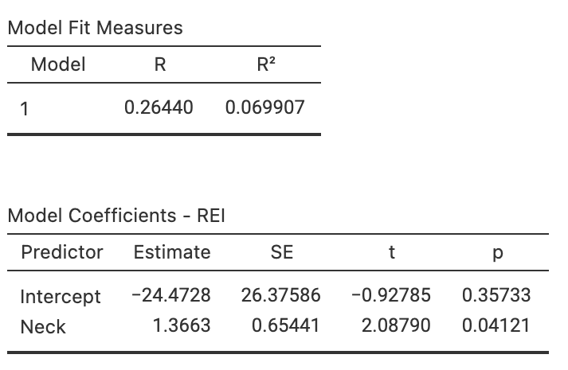 

```


```{r OSADT, fig.cap="The obstructive sleep apnoea dataset.", fig.align="center"}
if( knitr::is_html_output() ) {
  DT::datatable(OSA,
              list(scrollX = TRUE, 
                   scrollY = TRUE, 
                   ordering = FALSE),
              caption = "The Obstructive sleep apnoea dataset")
}
```


::: {.exercise #RegressionExercisePunting}
[*Dataset*: `Punting`]
(This study was seen in Exercise\ \@ref(exr:CorrelationExercisePunting).)
@MyersRegression (p.\ 75) measured the right-leg strengths\ $x$ of $13$\ American footballer players (using a weight lifting test), and the distance\ $y$ they punt a football (with their right leg).

1. Use the scatterplot (Fig.\ \@ref(fig:PuntPlot)) to find rough estimates of the values of the intercept and slope.
1. Using the software output (Fig.\ \@ref(fig:PuntPlot)), write down the value of the slope\ ($b_1$) and $y$-intercept\ ($b_0$).
1. Using these values, write down the regression equation.
1. Interpret the slope\ ($b_1$).
1. Write the hypotheses for testing for a relationship in the population
1. Write down the $t$-score and $P$-value from the output.
1. Determine an *approximate* $95$%\ CI for the population slope\ $\beta_1$.
1. Write a conclusion.
:::


```{r PuntPlot, fig.align="center", fig.cap="Punting distance and right leg strength. Left: scatterplot. Right: software output.", fig.width=4, fig.height=3.5, out.width=c("45%", "50%"), fig.show="hold"}
data(Punting) ### Exercise

plot(Punt ~ Right, 
     data = Punting,
     las = 1,
     xlab = "Right leg strength (in pounds)",
     ylab = "Punting distance (in feet)",
     main = "Punting distance vs\nleg strength",
     pch = 19,
     xlim = c(110, 180),
     ylim = c(100, 200)
)
abline( coef( Punt.lm <- lm( Punt ~ Right, 
                             data = Punting)), 
        lwd = 2, 
        col = "grey")

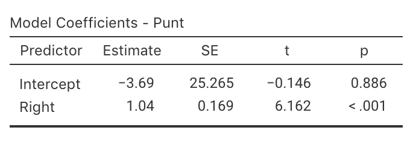
```


```{r}
data(Bitumen) ### Exercise
```


::: {.exercise #RegressionExerciseBitumen}
[*Dataset*: `Bitumen`]
(This study was seen in Exercise\ \@ref(exr:CorrelationExerciseBitumen).)
@data:Panda2018:Bitumen made $n = 42$ observations of hot mix asphalt, and measured the volume of air voids and the bitumen content by weight (Fig.\ \@ref(fig:BitumenPlotReg), left panel).

1. Write down the regression equation using the software output (Fig.\ \@ref(fig:BitumenPlotReg), right panel).
1. Interpret what the regression equation means.
1. Perform a test to determine if there is a relationship between the variables.
1. Predict the mean percentage of air voids by volume when the percentage bitumen is\ $5.0$%. 
   Do you expect this to be a good prediction? 
   Why or why not?
1. Predict the mean percentage of air voids by volume when the percentage bitumen is\ $6.0$%. 
   Do you expect this to be a good prediction? 
   Why or why not?
:::


```{r BitumenPlotReg, fig.cap="Air voids in bitumen samples. Left: scatterplot. Right: software output.", fig.align="center", fig.width=4, fig.height=3.35, out.width=c("45%", "50%"), fig.show="hold"}
plot(AirVoids ~ Bitumen, 
     data = Bitumen,
     pch = 19,
     xlab = "Actual bitumen content\nby weight (%)",
     ylab = "Air voids by volume (%)",
     main = "The relationship between air voids\nand bitumen content",
     las = 1,
     xlim = c(4.7, 5.4),
     ylim = c(3.5, 5.5)
     )

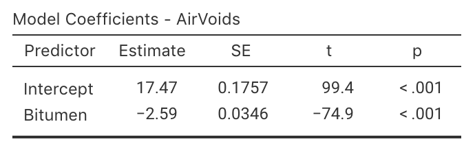
```


::: {.exercise #EDpatientsCI}
[*Dataset*: `EDpatients`]
@brunette1991correlation studied the relationship between the number of emergency department\ (ED) patients and the number of days following the distribution of monthly welfare monies, from\ 1986 to\ 1988 in Minneapolis, MN.\spacex
The data (extracted from @brunette1991correlation) and the software output are displayed in Fig.\ \@ref(fig:EDScatterjamovi).

1. Write down the estimated regression equation.
2. Interpret the slope in the regression equation.
3. Find an approximate $95$%\ CI for the slope.
4. Conduct a hypothesis test for the slope, and explain what the results mean.
:::


```{r EDScatterjamovi, fig.align = "center", fig.cap = "The number of emergency department patients, and the number of days since distribution of welfare. Left: scatterplot. Right: software output.", fig.width=3.35, fig.height=3., out.width=c("38%", "61%"), fig.show="hold"}
data(EDpatients) ### Exercise

plot( ED ~ Days,
      data = EDpatients,
      xlab = "Days after distribution",
      ylab = "Mean number of ED patients",
      main = "Mean number of ED patients\nvs days after welfare",
      pch = 19,
      las = 2,
      xlim = c(0, 30),
      ylim = c(135, 155) )
knitr::include_graphics( "jamovi/ED/EDRegression-crop.png")
```


::: {.exercise #RegressionExercisePossums}
[*Dataset*: `Possums`]
(This study was seen in Exercise\ \@ref(exr:CorrelationExercisePossums).)
@data:Williams2022:Possums studied Leadbeater's possums in the Victorian Central Highlands.
They recorded, among other information, the body weight of the possums (in g) and their location, including the elevation of the location (in m; `DEM`).
A scatterplot of the data is shown in Fig.\ \@ref(fig:PossumsScatterjamovi).
The software output for fitting the regression line is shown in Fig.\ \@ref(fig:PossumRegressionjamovi).

1. Write down the regression equation.
1. Determine if there is a relationship between the possum weight and the elevation.
1. Interpret the meaning of the slope.
1. Predict the mean weight of male possums at an elevation of\ $1\,000$\ms.
   Do you expect this to be a good prediction? Why or why not?
1. Predict the mean weight of male possums at an elevation of\ $200$\ms.
   Do you expect this to be a good prediction? Why or why not?
:::

```{r PossumRegressionjamovi, fig.cap="The relationship between weight of possums and the elevation of their location.", fig.align="center", fig.width=5, fig.height=3.5, out.width="55%", fig.show="hold"}
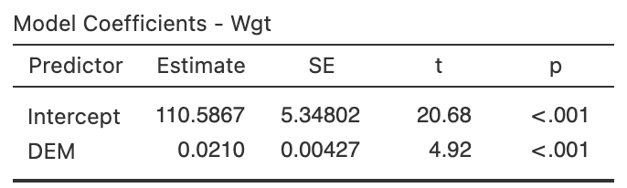
```


::: {.exercise #RegressionExercisesGorillas}
[*Dataset*: `Gorillas`]
(This study was seen in Exercise\ \@ref(exr:CorrelationExercisesGorillas).)
@wright2021chest examined $25$\ gorillas and recorded information about their chest-beating rates and their size (measured by the breadth of the gorillas' backs).
The relationship is shown in Fig.\ \@ref(fig:GorillaWindmillPlot) (left panel).

Use the software output (Fig.\ \@ref(fig:GorillajamoviHT)) to find the regression equation, and perform a hypothesis test for the slope.
Write a conclusion.

:::

```{r GorillajamoviHT, fig.cap="Software regression output for the gorilla data.", fig.align="center", out.width="55%"}
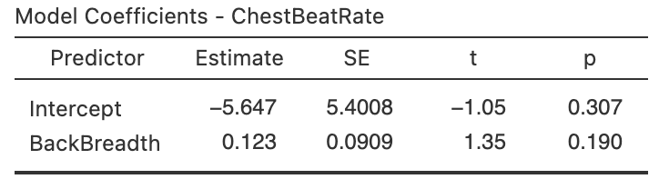
```


::: {.exercise #RegressionExerciseSunscreen}
@data:Heerfordt2018:sunscreen studied the relationship between the time (in minutes) spent on sunscreen application\ $x$, and the amount (in\ grams) of sunscreen applied\ $y$, using $n = 31$ people.
The fitted regression equation was $\hat{y} = 0.27 + 2.21x$.

1. Interpret the meaning of\ $b_0$ and\ $b_1$. 
   Do they seem sensible?
1. According to the article, a hypothesis test for testing\ $\beta_0 = 0$ produced a $P$-value *much* larger than\ $0.05$.
   What does this mean?
1. If someone spent $84$\mins applying sunscreen, how much sunscreen would they use on average?
1. The article reports that $R^2 = 0.64$. 
   Interpret this value.
1. What is the value of the correlation coefficient?
1. What would a test of $H_0$: $\beta_0 = 0$ *mean*?
:::


::: {.exercise #RegressionPredictBirthWeight}
@bhargava1985mid stated (p.\ $1\,617$):

> In developing countries [...] logistic problems prevent the weighing of every newborn child.
> A study was performed to see whether other simpler measurements could be substituted for weight to identify neonates of low birth weight and those at risk.

One relationship they studied was between infant chest circumference (in\ cm)\ $x$ and birth weight (in\ grams)\ $y$ was given as:
$$
   \hat{y} = -3440.2403 + 199.2987x.
$$
The correlation coefficient was $r = 0.8696$ with $P < 0.001$.

1. Critique the way in which the regression equation and correlation coefficient are reported. 
1. Based on the *correlation* information, could chest circumference be used as a useful predictor of birth weight?
   Explain.
1. Interpret the intercept and the slope of the regression equation.
1. What units of measurement are the intercept and slope measured in?
1. Predict the mean birth weight of an infant with a chest circumference of\ $30$\cms.
:::


:::{.exercise #SixMWTAge}
[*Dataset*: `SixMWT`]
The Six-Minute Walk Test (6MWT) measures how far subjects can walk in six minutes, and is used as a simple, low-cost evaluation of fitness and other health-related measures.
@saiphoklang2022comparison measured the 6MWT distance and the age of subjects:

> For Thai patients with chronic obstructive pulmonary disease, is there a linear relationship between the 6MWT and age?

Some data collected to answer this RQ are shown
`r if (knitr::is_latex_output()) {
   'in  Table\\ \\@ref(tab:Data6MWTAge).'
} else {
   'below.'
}`
The data are plotted in Fig.\ \@ref(fig:SixMWTAgePlot) (left panel), and software output shown in Fig.\ \@ref(fig:SixMWTAgePlot) (right panel).


```{r Data6MWT}
data(SixMWT)

WTlen <- dim(SixMWT)[1]

Labels <- paste("No.", 
                1 : WTlen)

tb1 <- array( cbind( Labels[1:5 ],
                     SixMWT$Distance30[1:5],
                     SixMWT$Age[1:5]),
              dim = c(5, 3) )
                     

T1 <- knitr::kable(pad(tb1,
                       surroundMaths = TRUE,
                       targetLength = c(0, 5, 2),
                       decDigits = c(0, 2, 0)),
                   format = "latex",
                   valign = 't',
                   align = "c",
                   linesep = "",
                   col.names = c(" ", 
                                 "6WMT (in m)",  
                                 "Age (in years)"),
                   row.names = FALSE,
                   escape = FALSE,
                   booktabs = TRUE) %>%
  row_spec(0, bold = TRUE)


tb2 <- array( cbind( Labels[(WTlen - 4):WTlen ],
                     SixMWT$Distance20[(WTlen - 4):WTlen ],
                     SixMWT$Age[(WTlen - 4):WTlen ] ),
              dim = c(5, 3) )


T2 <- knitr::kable(pad(tb2,
                       surroundMaths = TRUE,
                       targetLength = c(0, 5, 2),
                       decDigits = c(0, 2, 0)),
                   format = "latex",
                   valign = 't',
                   align = "c",
                   linesep = "",
                   col.names = c(" ", 
                                 "6MWT (in m)", 
                                 "Age (in years)"),
                   row.names = FALSE,
                   escape = FALSE,
                   booktabs = TRUE) %>%
  row_spec(0, bold = TRUE)

out <- knitr::kables(list(T1, T2),
                     format = "latex",
                     label = "Data6MWTAge",
                     caption = "The six-minute walk test (6MWT) distance using a $30$\\ms walkway, and the subjects age. Ten of the $50$ observations are shown.") %>% 
  kable_styling(font_size = 8)
out2 <- prepareSideBySideTable(out,
                               gap = "\\qquad\\qquad") 
out2

```

```{r}
if( knitr::is_html_output() ) {
  DT::datatable(SixMWT,
               fillContainer = FALSE, # Make more room, so we don't just have ten values
               colnames = c("Subject", 
                            "Distance (30m walkway)",
                            "Age"),
               filter = "none",
               options = list(searching = FALSE), # Remove searching: See: https://stackoverflow.com/questions/35624413/remove-search-option-but-leave-search-columns-option
               caption = "The six-minute walk test (6MWT) distance, for walkways of $20$\\ms and $30$\\ms length. (A negative difference means the $20$\\ms distance is greater than the $30$\\ms distance.)")
}
```


1. What is the value of the correlation coefficient?
   Explain.
1. Use the output to write down the fitted regression equation.
1. Interpret the meaning of the intercept and slope.
   Are these both sensible?
   Explain.
1. Determine if a relationship exists between the 6MWT and age in the population.
1. Construct an approximate $95$%\ CI for the slope.
1. Are the test and CI statistically valid?
1. What is the predicted mean 6MWT distance for a patient who is $60$-years-old?


```{r SixMWTAgePlot, fig.align="center", fig.cap="Left: the 6MWT plotted against age. The solid grey line is the regression line. Right: software output.", fig.width=4, fig.height=3.5, out.width=c("45%", "50%"), fig.show="hold"}
plot(Distance30~Age, 
     data = SixMWT,
     pch = 19,
     las = 1,
     xlim = c(50, 80),
     ylim = c(200, 560),
     xlab = "Age (in years)",
     ylab = "6MWT (in m)",
     main = "6MWT and age,\n for 50 Thai patients")
abline(coef( lm(Distance30 ~ Age, 
                data = SixMWT),
            ),
       lwd = 2,
       col = "grey")

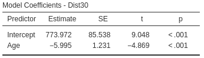

```
:::


:::{.exercise #CorollaPrice}
[*Dataset*: `Corollas`]
I was wondering about how the age of second-hand cars impact their price.
On 25\ June 2014, I searched
`r if (knitr::is_latex_output()) {
   '*Gum Tree*'
} else {
   '[*Gum Tree*](https://www.gumtree.com.au)'
}` 
(an Australian online marketplace), for `Toyota Corolla` in the 'Cars, Vans \& Utes' category.
I recorded the age and the price of each (second-hand) car from the first two pages of results that were returned.

I restricted the data to cars manufactured after the year\ 2000, removed one $13$-year-old Corolla advertised for sale for $$390\,000$ (assuming this was an error), then produced the scatterplot in Fig.\ \@ref(fig:CorollasPriceAgeYear) (left panel).


(ref:CorollasScatter) The price of second-hand Toyota Corollas ($n = 38$) as advertised on *Gum Tree* on 25\ June 2014, plotted against age (left) and year of manufacture (right).

```{r CorollasPriceAgeYear, echo=FALSE, fig.cap="(ref:CorollasScatter)", fig.align="center", fig.width=9, fig.height=3.5, out.width='100%'}
data(Corollas)

par(mfrow = c(1, 2))

CP <- Corollas
#CP <- rbind(CP, c(2008, 13000, 6) )  ### Add as it looks better
CP <- subset( CP, Year > 2000)
CP <- subset( CP, Price < 20000) # Remove outlier
CP$PriceThous <- CP$Price/1000

mCorollas <- lm(PriceThous ~ Age,
                data = CP)

### PRICE vs AGE
plot( PriceThous ~ Age, 
      data = CP,
      xlab = "Age (in years)",
      ylab = "Price (in thousands of dollars)",
      main = "Prices of second-hand Corollas\non gumtree.com.au in 2014",
      pch = 4,
      las = 1,
      xlim = c(0, 15),
      ylim = c(0, 20),
      axes = FALSE
)
axis(side = 1, 
     at = seq(0, 15, by = 2), 
     las = 1 )
axis(side = 2, 
     at = seq(0, 20, by = 5), 
     las = 1 )
rug(x = seq(0, 20, by = 1),
    side = 2)
box()

grid(ny = NULL,
     nx = NA)
abline( v = seq(0, 14,
               by = 2),
        lty = 3,
        col = "grey")

### PRICE vs YEAR

plot( PriceThous ~ Year, 
      data = CP,
      xlab = "Year of manufacture",
      ylab = "Price (in thousands of dollars)",
      main = "Prices of second-hand Corollas\non gumtree.com.au in 2014",
      pch = 4,
      las = 1,
      xlim = c(2000.5, 2012),
      ylim = c(0, 20),
      axes = FALSE
)
axis(side = 1, 
     at = seq(2001, 2012, by = 1), 
     las = 2 )
axis(side = 2, 
     at = seq(0, 20, by = 5), 
     las = 1)
rug(x = seq(0, 20, by = 1),
    side = 2)
box()


```


1. Describe the relationship displayed in the graph, in words.
2. What else could influence the price of a second-hand Corolla besides the age? 
3. Consider a seven-year-old Corolla selling for $15\,000.
   Would this be cheap or expensive?
   Explain.
4. As stated, I removed one observation: a $13$-year-old Corolla for sale at $390\,000.
   What do you think the price was meant to be listed as, by looking at the scatterplot?
	 Explain.
5. `r if (knitr::is_latex_output()) {
      'With a ruler or another straight edge (such as a book), draw an estimate of the regression line on the scatterplot.'
   } else {
      'From the scatterplot, draw (if you can), or estimate by eye, an approximation of the regression line.'
   }`
   Then, *estimate* the value of\ $b_0$ (the intercept) from the line you drew.
   What does this mean?
   Do you think this value is meaningful?
6. *Estimate* the value of\ $b_1$ (the slope) from the line you drew.
   What does this mean?
   Do you think this value is meaningful?
7. From the line you drew above, write down an *estimate* of the regression equation.
8. Use the software output (Fig.\ \@ref(fig:Corollasjamovi)) relating the price (in thousands of dollars) to age to write down the regression equation.
9. Using the software output, write down the value of\ $r$.
    Using this value of\ $r$, compute the value of\ $R^2$.
    What does this mean? 


```{r Corollasjamovi, echo=FALSE, fig.cap="The jamovi output, analysing the Corolla data", fig.align="center", out.width=c("49%","50%"), fig.show="hold"}
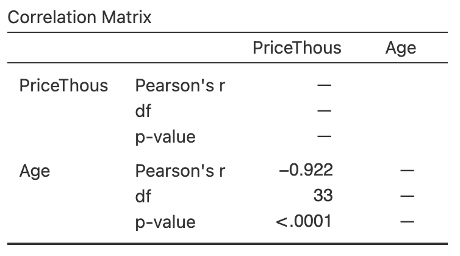
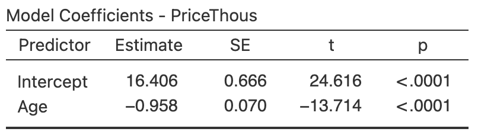
```


11. Use the regression equation from the software output to estimate the sale price of a Corolla that is $20$-years-old, and explain your answer. \tightlist
12. Would a Corolla $6$-years-old advertised for sale at $$15\,000$ appear to be good value?
    Estimate the sale price and explain your answer.
13. Using the software output, perform a suitable hypothesis test to determine if there is evidence that lower prices are associated with older Corollas.
14. Compute an approximate $95$% confidence interval for the population slope (use the software output in Fig.\ \@ref(fig:Corollasjamovi)).
15. I could have drawn a scatterplot with Price on the vertical (up-and-down) axis and Year of manufacture on the horizontal (left-to-right) axis (Fig. \@ref(fig:CorollasPriceAgeYear), right panel).
    For this graph:

    a. What is the value of the correlation coefficient?
    b. How would the value of $R^2$ change?
    c. How would the value of the slope change?
    d. How would the value of the intercept change?
:::


`r if( knitr::is_latex_output() ) "\\captionsetup{font=normalsize}"`


<!-- QUICK REVIEW ANSWERS -->
`r if (knitr::is_html_output()) '<!--'`
::: {.EOCanswerBox .EOCanswer data-latex="{iconmonstr-check-mark-14-240.png}"}
**Answers to *Quick Revision* questions:**
**1.** True.. 
**2.** True. (*very* roughly).
**3.** False: kg per cm.
**4.** True.
**5.** True.
**6.** True.
**7.** True.
**8.** True.
**9.** f.
**10.** $78$\kgs.
:::
`r if (knitr::is_html_output()) '-->'`


