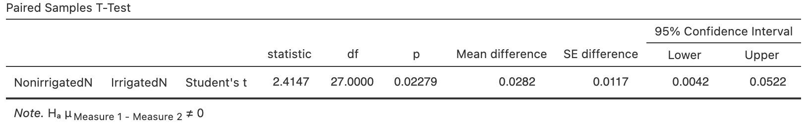
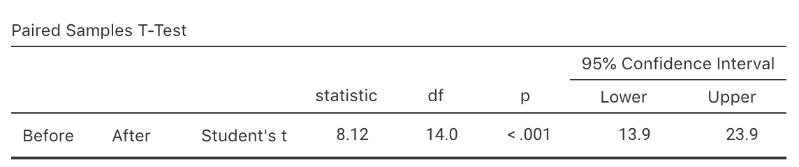

# Tests for the mean difference (paired data) {#TestPairedMeans}
\index{Research question!relational}


<!-- Introductions; easier to separate by format -->
```{r, child = if (knitr::is_html_output()) {'./introductions/34-Testing-MeanDifference-HTML.Rmd'} else {'./introductions/34-Testing-MeanDifference-LaTeX.Rmd'}}
```


## Introduction: soil nitrogen {#PairedTTest-SoilN}


<div style="float:right; width: 222x; border: 1px; padding:10px">

</div>


@lambie2021microbial compared the percentage nitrogen (%N) in soils from irrigated and non-irrigated intensively-grazed pastures.
The researchers *paired* similar irrigated and non-irrigated sites (p. 338):

> The irrigated and non-irrigated pairs within each site were within $100$\ m of each other and were on the same soil, landform and usually the same farm with the same farm management on both treatments.

Pairing (Sect.\ \@ref(PairedIntro)) is a form of blocking (Sect.\ \@ref(ExpManagingConfounding)) and is used to manage confounding.
One RQ in the study was:

> For intensively grazed pastures sites, is there a mean reduction in percentage soil nitrogen (%N) when sites are irrigated, compared to non-irrigated?

The data are shown in
`r if( knitr::is_latex_output() ) {
    'Table\\ \\@ref(tab:SoilCN).'
} else {
    'the table below.'
}`
The parameter is $\mu_d$, the population mean *reduction* in %N when sites are irrigated, compared to non-irrigated.


::: {.tipBox .tip data-latex="{iconmonstr-info-6-240.png}"}
Explaining *how* the differences are computed is important.  
The differences here are the %N in *non-irrigated* sites minus %N in *irrigated* sites.

The differences could be computed as the %N in *irrigated* sites minus %N in *non-irrigated* sites.
*Either is fine*, as long as you remain consistent throughout.
The meaning of any conclusions will be the same.  
:::


```{r}
data(SoilCN)

SoilN <- subset(SoilCN, 
                select = c(IrrigatedN, NonirrigatedN))
SoilN$Change <- SoilN$NonirrigatedN - SoilN$IrrigatedN

Nlen <- length(SoilN$TotalCI) 

if( knitr::is_latex_output() ) {
  
 T1 <- knitr::kable(pad(SoilN[1:14, ],
                        surroundMaths = TRUE,
                        targetLength = 5,
                        digits = 2),
                     format = "latex",
                     valign = 't',
                     align = "c",
                     linesep = "",
                     col.names = c("irrigated", 
                                   "irrigated", 
                                   "reduction"),
                     row.names = FALSE,
                     escape = FALSE,
                     booktabs = TRUE) %>%
   add_header_above( c("%N:" = 1, 
                       "%N: Not" = 1, 
                       "%N:" = 1),
                    line = FALSE,
                    bold = TRUE) %>%
   row_spec(0, bold = TRUE) 
  
  
  T2 <- knitr::kable(pad(SoilN[15:28, ],
                        surroundMaths = TRUE,
                        targetLength = 5,
                        digits = 2),
                     format = "latex",
                     valign = 't',
                     align = "c",
                     linesep = "",
                     col.names = c("irrigated", 
                                   "irrigated", 
                                   "reduction"),
                     row.names = FALSE,
                     escape = FALSE,
                     booktabs = TRUE) %>%
   add_header_above( c("%N:" = 1, 
                       "%N: Not" = 1, 
                       "%N:" = 1),
                    line = FALSE,
                    bold = TRUE) %>%
    row_spec(0, bold = TRUE)
  
  out <- knitr::kables(list(T1, T2),
                       format = "latex",
                       label = "SoilCN",
                       caption = "The percentage total soil nitrogen (\\%N) in irrigated and non-irrigated soils in $n = 28$ sites") %>% 
    kable_styling(font_size = 8)
  out2 <- prepareSideBySideTable(out,
                                 gap = "\\enskip") 
  out2 
}

if( knitr::is_html_output() ) {
  kable( pad(SoilN,
                        surroundMaths = TRUE,
                        targetLength = 5,
                        digits = 2),
         format = "html",
         align = "c",
         booktabs = TRUE,
         longtable = FALSE,
         col.names = c("Irrigated", "Not irrigated", "Reduction"),
         caption = "The percentage total nitrogen in irrigated and non-irrigated soils in $n = 28$ sites") %>% 
    row_spec(0, bold = TRUE)
}
```


The data are summarised graphically (Fig.\ \@ref(fig:SoilNGraphs)) and numerically (Table\ \@ref(tab:SoilNSummary)), using information provided by software (Fig.\ \@ref(fig:Nitrogenjamovi)).


```{r SoilNSummary}
SoilSummary <- array( dim = c(3, 4))

rownames(SoilSummary) <- c("Irrigated sites",
                           "Non-irrigated sites",
                           "Change")
colnames(SoilSummary) <- c("Mean",
                           "Std. dev.",
                           "Std. error",
                           "Sample size")

SoilSummary[, 1] <- colMeans(SoilN)
SoilSummary[, 2] <- apply(SoilN,
                          2,
                          "sd")
SoilSummary[, 3] <- apply(SoilN,
                          2,
                          "findStdError")
SoilSummary[, 4] <- apply(SoilN,
                          2,
                          "length")

# Do some appropriate rounding
SoilSummary <- round(SoilSummary, 6)
SoilSummary[1:2, 1] <- round(SoilSummary[1:2, 1], 6)

if( knitr::is_latex_output() ) {
  
  knitr::kable(pad(SoilSummary,
                   surroundMaths = TRUE,
                   targetLength = c(5, 6, 6, 0),
                   digits = c(4, 4, 4, 0)),
               format = "latex",
               align = "c",
               linesep = "",
               caption = "The percentage total soil N in irrigated and non-irrigated sites",
               col.names = c("Mean", "Std. dev.", "Std. error", "Sample size"),
               row.names = TRUE,
               escape = FALSE,
               booktabs = TRUE) %>%
    row_spec(0, bold = TRUE) %>%
    row_spec(3, italic = TRUE) %>%
    kable_styling(font_size = 8)
  
}

if( knitr::is_html_output() ) {
  kable( pad(SoilSummary,
                   surroundMaths = TRUE,
                   targetLength = c(5, 6, 6, 0),
                   digits = c(4, 4, 4, 0)),
         format = "html",
         align = "c",
         booktabs = TRUE,
         longtable = FALSE,
         col.names = c("Mean", "Std. dev.", "Std. error", "Sample size"),
         caption = "The percentage total soil N in irrigated and non-irrigated sites") %>% 
    row_spec(0, bold = TRUE)
}
```


```{r, SoilNGraphs, fig.align="center", fig.cap="The reduction in \\%N when sites are irrigated, compared to non-irrigated. Left: A histogram of the differences (boundary values in the lower box). Right: a case-profile plot (solid lines, solid dots for lower percentage N in irrigated sites).", fig.show="hold", out.width='100%', fig.width = 9.25, fig.height = 3.5}
par( mfrow = c(1, 2))

hist(SoilN$Change,
     right = FALSE,
     breaks = seq(-0.15, 0.20, by = 0.05),
     main = "Histogram of percentage\nsoil nitrogen reduction",
     xlab = "Reduction in %N",
     ylab = "No. of sites",
     las = 1)

box()

plot( x = c(0.75, 2.25),
      y = c(0.15, 0.7),
      axes = FALSE,
      type = "n",
      main = "Case-profile plot of percentage\nsoil nitrogen changes",
      xlab = "",
      ylab = "Soil %\ N")
axis(side = 1,
     at = 1:2,
     labels = c("Non-Irrigated",
                "Irrigated") )
axis(side = 2,
     las = 1)
box()

delta <- 0.02
for (i in 1:length(SoilN$Change)){
  lines( x = c(1 + ifelse(SoilN$Change[i] > 0, delta, -delta), 
               2 + ifelse(SoilN$Change[i] > 0, delta, -delta)),
         y = c( SoilN$NonirrigatedN[i], 
                SoilN$IrrigatedN[i]),
         lty = ifelse(SoilN$Change[i] > 0, 1, 2),
         type = "b",
         pch = ifelse(SoilN$Change[i] > 0, 19, 1))
}
box()

```


```{r Nitrogenjamovi, fig.cap="jamovi output for the nitrogen data", fig.align="center", out.width=c("60%","100%"), fig.show='hold'}
knitr::include_graphics("jamovi/SoilCN/SoilCN-Summary.png")

```


## Statistical hypotheses and notation

The RQ asks if the mean %N *reduces* in the *population* when sites are irrigated.
If the differences are defined as the %N for *non-irrigated* sites minus *irrigated* sites, then positive values refer to non-irrigated sites having larger %N than irrigated sites, on average. 
Then, the RQ is asking if the mean difference is zero, or if it is *greater* than zero.
The *parameter* is the *population mean difference*. 
The notation used (recapping Sect.\ \@ref(MeanDiffCI)) is:

* $\mu_d$: the mean *difference* in the *population* (in %N).
* $\bar{d}$: the mean *difference* in the *sample* (in %N).
* $s_d$: the *sample* standard deviation of the *differences* (in %N).
* $n$: the number of *differences*.

The *null* hypothesis is that 'there is *no mean change* in %N, in the population' (Sect.\ \@ref(AboutHypotheses)):

* $H_0$: $\mu_d = 0$.

This hypothesis, which we initially *assume* to be true, postulates that the mean reduction may not be zero in the *sample*, due to sampling variation.

Since the RQ asks specifically if mean %N *decreases*, the alternative hypothesis is *one-tailed* (Sect.\ \@ref(AboutHypotheses)).
According to how the differences have been defined, the alternative hypothesis is:

* $H_1$: $\mu_d > 0$ (i.e., one-tailed).

This hypothesis says that the mean change in the population is *greater than* zero, because of the wording of the RQ, and because of how the differences were defined.
(If the differences were defined in the opposite way---as '%N in *irrigated* sites minus *non-irrigated* sites'--- then the alternative hypothesis would be $\mu_d < 0$, which has the same *meaning*.)


## Tests for the mean difference: $t$-test
\index{Sampling distribution!mean difference}

The *sample* mean %N reduction varies depending on which one of the countless possible samples is randomly obtained, *even if* the mean reduction in the population is zero.
That is, the value of $\bar{d}$ varies across all possible samples even if $\mu_d = 0$.
The value of $\bar{d}$ has a sampling distribution.


::: {.definition #DEFSamplingDistributionMeanDiff name="Sampling distribution of a sample mean difference"}
The *sampling distribution of the sample mean difference* is (when certain conditions are met; Sect.\ \@ref(ValiditySampleMeanDiffTest)) described by

* an approximate normal distribution,
* centred around the sampling mean difference, whose value is $\mu_d$ (from $H_0$),
* with a standard deviation (called the *standard error* of $\bar{d}$) of  
\begin{equation}
   \text{s.e.}(\bar{d}) = \frac{s_d}{\sqrt{n}},
   (\#eq:StdErrorDifferencesTest)
\end{equation}
where $n$ is the number of differences, and $s_d$ is the standard deviation of the differences.
:::


The value of the *standard error of the differences* here is  
\[
  \text{s.e.}(\bar{d}) = s_d/\sqrt{n} = 0.0618/\sqrt{28} = 0.0117.
\]
This sampling distribution of $\bar{d}$ is shown in Fig.\ \@ref(fig:PercentageNSamplingDist).


```{r PercentageNSamplingDist, fig.cap="The sampling distribution is a normal distribution; it describes how the sample mean reduction in percentage N varies in samples of size $n = 28$ when the population mean reduction is $0$.", fig.align="center", fig.width=9.0, fig.height=2.5, out.width='95%'}
mn <- mean(SoilN$Change)
n <- length(SoilN$Change)
stdd <- sd(SoilN$Change)

se <- stdd/sqrt(n)

par( mar = c(4, 0.5, 0.5, 0.5) )
out <- plotNormal(0,
                  se,
                  xlab = "Sample mean reduction in %N", 
                  cex.axis = 0.95,
                  ylim = c(0, 55),
                  showXlabels = c( 	
                    expression( -0.0352),
                    expression( -0.0234), 
                    expression( -0.0117), 
                    expression( 0 ),
                    expression( 0.0117), 
                    expression( 0.0234), 
                    expression( 0.0352) ) )

arrows(x0 = 0,
       x1 = 0,
       y0 = 45,
       y1 = max(out$y),
       angle = 15,
       length = 0.1)

text(x = 0,
     y = 45,
     pos = 3,
     labels = expression(Sampling~mean~difference))


arrows(x0 = 0,
       x1 = 0 + se,
       y0 = 0.30 * max(out$y),
       y1 = 0.30 * max(out$y),
       code = 3, # Arrows both ends
       angle = 15,
       length = 0.1)

text(x = 0 + (se / 2),
     y = 0.30 * max(out$y),
     labels = expression( atop(Std.~error,
                               s.e.(bar(italic(d)))==0.0117)) )


arrows(x0 = mn,
       x1 = mn,
       y0 = 0.7 * max(out$y),
       y1 = 0,
       angle = 15,
       length = 0.1)
text(x = mn,
     y = 0.7 * max(out$y),
     pos = 3,
     labels = expression(bar(italic(d)) == 0.0282) )

points(x = mn,
       y = 0,
       pch = 19,
       cex = 0.6)
mtext(text = expression( italic(z) == 2.41),
      side = 1,
      at = mn,
      cex = 0.8,
      line = 0
      )
```


The sample mean difference can be located on the sampling distribution (Fig.\ \@ref(fig:PercentageNSamplingDist)) by computing the $t$-score:\index{Hypothesis testing!mean difference}\index{Test statistic!F@$F$-score}
  
\[
	t
	= \frac{\bar{d} - \mu_{d}}{\text{s.e.}(\bar{d})}
	= \frac{0.0282 - 0}{0.0117} = 2.41,
\]
following the ideas in Eq.\ \@ref(eq:tscore).
Software also displays the $t$-score (Fig.\ \@ref(fig:Nitrogenjamovi)).


A $P$-value determines if the sample data are consistent with the assumption (Table\ \@ref(tab:PvaluesInterpretation)).
Since $t = 2.41$, and since $t$-scores are like $z$-scores, the *one*-tailed $P$-value is smaller $0.025$ (based on the $68$--$95$--$99.7$ rule).\index{68@$68$--$95$--$99.7$ rule}
Software (Fig.\ \@ref(fig:Nitrogenjamovi)) reports that the *two*-tailed $P$-value is $0.02279$.
Hence, the *one*-tailed $P$-value is $0.02279/2 = 0.0114$.


::: {.importantBox .important data-latex="{iconmonstr-warning-8-240.png}"}
The jamovi software clarifies *how* the differences have been computed.
At the left of the output (Fig.\ \@ref(fig:Nitrogenjamovi)), the order implies the differences are found as `NonirrigatedN` minus `IrrigatedN`, the same as our definition.

:::

`r if (knitr::is_latex_output()) '<!--'`
<iframe src="https://learningapps.org/watch?v=pj3pt56fk22" style="border:0px;width:100%;height:500px" allowfullscreen="true" webkitallowfullscreen="true" mozallowfullscreen="true"></iframe>
`r if (knitr::is_latex_output()) '-->'`


## Writing conclusions

The one-tailed $P$-value is $0.0114$, suggesting moderate evidence (Table\ \@ref(tab:PvaluesInterpretation)) to support $H_1$.
A conclusion requires an *answer to the RQ*, a summary of the *evidence* leading to that conclusion, and some *summary statistics*:

> Moderate evidence exists in the sample (paired $t = 2.41$; one-tailed $P = 0.0114$) of a mean reduction in percentage soil N  from non-irrigated to irrigated sites (mean reduction: $0.0282$%; $n = 28$; $95$% CI from $0.0042$% to $0.0522$%).

The CI is found using the process described in Chap.\ \@ref(PairedIntro).
The wording implies the direction of the differences.


::: {.importantBox .important data-latex="{iconmonstr-warning-8-240.png}"}
Saying 'there is evidence of a difference' is insufficient.
You must state *which* measurement is, on average, higher (that is, what the differences *mean*).
:::


## Statistical validity conditions {#ValiditySampleMeanDiffTest}
\index{Sampling distribution!mean difference}

As with any hypothesis test, these results apply under certain conditions.
For a hypothesis test for the mean of paired data, these conditions are the same as for the CI for the mean difference for paired data (Sect.\ \@ref(ValidityPaired)), and similar to those for one sample mean.

Statistical validity can be assessed using these criteria:

* When $n > 25$, the test is statistically valid provided the distribution of differences is *not* highly skewed.
* When $n \le 25$, the test is statistically valid only if the data come from a *population* of differences with a normal distribution.

The sample size of $25$ is a rough figure; some books give other values (such as $30$).
Data with severe skewness or large outliers may need a larger sample size for the test to be statistically valid.

This condition ensures that the *distribution of the sample mean differences has an approximate normal distribution* (so that, for example, the $68$--$95$--$99.7$ rule can be used).
Provided $n > 25$, this will be approximately true *even if* the distribution of the differences in the population does not have a normal distribution.

If the statistical validity conditions are not met, other similar options include using a sign test of the differences\index{Sign test} or a Wilcoxon signed-rank test of the differences\index{Wilcoxon signed ranks test} [@conover2003practical], or using resampling methods [@efron2021computer].


::: {.example #StatisticalValidityWeightLossHT name="Statistical validity"}
For the %N data, the sample size is $n = 28$, so the test is statistically valid.
:::


## Example: invasive plants {#PairedInvasivePlantsHT}

(This study was seen in Sect.\ \@ref(PairedInvasivePlantsCI).)
Skypilot is a alpine wildflower native to the Colorado Rocky Mountains (USA).
In recent years, a willow shrub (*Salix*) has been encroaching on skypilot territory and, because willow often flowers early, @kettenbach2017shrub studied whether the willow may 'negatively affect pollination regimes of resident alpine wildflower species' (p.\ 6965).

Data for both species was collected at $n = 25$ different sites, so the data are *paired* by site (Sect.\ \@ref(PairedIntro)).
The data are shown in
`r if( knitr::is_latex_output() ) {
    'Table\\ \\@ref(tab:FloweringData).'
} else {
    'Sect.\\ \\@ref(PairedInvasivePlantsCI).'
}`
The parameter is $\mu_d$, the population mean *difference* in day of first flowering for skypilot, less the day of first flowering for willow.
A *positive* value for the difference means that the skypilot values are larger, and hence that willow flowered first.
The RQ is:

> In the Colorado Rocky Mountains, is there a mean difference between first-flowering day for the native skypilot and encroaching willow?

The hypotheses are
\[
   \text{$H_0$: $\mu_d = 0$}\quad\text{and}\quad\text{$H_1$: $\mu_d\ne 0$}
\]
where the alternative hypothesis is two-tailed.


::: {.tipBox .tip data-latex="{iconmonstr-info-6-240.png}"}
Explaining *how* the differences are computed is important.
The differences here are skypilot minus willow first-flowering days.

However, the differences could be computed as willow minus skypilot first-flowering days.
*Either is fine*, as long as you remain consistent.
The *meaning* of any conclusions will be the same.  
:::


The data are summarised graphically in Fig.\ \@ref(fig:FloweringPlots).
The numerical summary (Table\ \@ref(tab:FloweringSummaryHT)) and software output (Fig.\ \@ref(fig:FloweringjamoviHT)) are repeated here.


```{r FloweringjamoviHT, fig.cap="jamovi output for the flowering-day data", fig.align="center", out.width=c("100%"), fig.show='hold'}
knitr::include_graphics("jamovi/Flowering/FloweringAll.png")
```


```{r FloweringSummaryHT}
data(Flowering)
FloweringSummary <- array( dim = c(3, 4))

FloweringTab <- cbind( Flowering[, 1:2], 
                       Change = Flowering[, 2] - Flowering[, 1])

rownames(FloweringSummary) <- c("Willow (encroaching)",
                                "Skypilot (native)",
                                "Differences")
colnames(FloweringSummary) <- c("Mean",
                                "Std. dev.",
                                "Std. error",
                                "Sample size")

FloweringSummary[, 1] <- colMeans(FloweringTab,
                                  na.rm = TRUE)
FloweringSummary[, 2] <- apply(FloweringTab,
                               2,
                               "sd",
                               na.rm = TRUE)
FloweringSummary[, 3] <- apply(FloweringTab,
                               2,
                               "findStdError",
                               na.rm = TRUE)
FloweringSummary[, 4] <- apply(FloweringTab,
                               2,
                               "realLength")

# Do some appropriate rounding
FloweringSummary <- round(FloweringSummary, 4)
FloweringSummary[1:2, 1] <- round(FloweringSummary[1:2, 1], 3)

if( knitr::is_latex_output() ) {
  
  knitr::kable(pad(FloweringSummary,
                   surroundMaths = TRUE,
                   targetLength = c(6, 6, 5, 0),
                   digits = c(2, 3, 3, 0)),
               format = "latex",
               align = "c",
               linesep = "",
               caption = "The day of first flowering for encroaching willow and native skypilot",
               col.names = c("Mean", "Std. dev.", "Std. error", "Sample size"),
               row.names = TRUE,
               escape = FALSE,
               booktabs = TRUE) %>%
    row_spec(0, bold = TRUE) %>%
    row_spec(3, italic = TRUE) %>%
    kable_styling(font_size = 8)
  
}

if( knitr::is_html_output() ) {
  kable( pad(FloweringSummary,
             surroundMaths = TRUE,
             targetLength = c(6, 6, 5, 0),
             digits = c(2, 3, 3, 0)),
         format = "html",
         align = "c",
         booktabs = TRUE,
         longtable = FALSE,
         col.names =  c("Mean", "Std. dev.", "Std. error", "Sample size"),
         caption = "The day of first flowering for encroaching willow and native skypilot") %>% 
    row_spec(0, bold = TRUE)
}
```

The standard error of the mean difference is $\text{s.e.}(\bar{d}) = 0.9396$ (Fig.\ \@ref(fig:Floweringjamovi) or Table\ \@ref(tab:FloweringSummary)).
The value of the test statistic (i.e., the $t$-score) is
\begin{align*}
  t 
  = \frac{\bar{d} - \mu_d}{\text{s.e.}(\bar{d})}
  = \frac{1.36 - 0}{0.9396} = 1.45,
\end{align*}
as in the output.
This is a relatively small value of $t$, so a large $P$-value is expected using the $68$--$95$--$99.7$ rule.
Indeed, the output shows that $P = 0.161$: there is *no evidence* of a mean difference in first-flowering day (i.e., the sample mean difference could reasonably be explained by sampling variation if $\mu_d = 0$).
We write:

> No evidence exists ($t = 1.45$; two-tailed $P = 0.161$) that the day of first-flowering is different for the encroaching willow and the native skypilot (mean difference: $1.36$ days earlier for willow; $95$% CI from $-0.57$ to $3.30$; $n = 25$).

The test is statistically valid since $n = 25$.


:::: {.importantBox .important data-latex="{iconmonstr-warning-8-240.png}"}
We *do not* say whether the evidence supports the null hypothesis.
We assume the null hypothesis is true, so we state how strong the evidence is to support the alternative hypothesis.
The current sample presents no evidence to contradict the assumption, but future evidence may emerge.
That is:

> No evidence of a difference *does not* mean evidence of no difference.
:::


::: {.importantBox .important data-latex="{iconmonstr-warning-8-240.png}"}
Be clear in your conclusion about *how* the differences are computed.
Make sure to interpret the CI consistent with how the differences were defined.
:::


## Example: chamomile tea {#ChamomileTea-Paired-HT}

(This study was seen in Sects.\ \@ref(ChamomileTea-Paired-CI) and\ \@ref(ChamomileTea-TwoMeans-CI).)
@rafraf2015effectiveness studied patients with Type\ 2 diabetes mellitus (T2DM).
They randomly allocated $32$ patients into a control group (who drank hot water), and another $32$ patients to receive chamomile tea.
Summary data are shown in Table\ \@ref(tab:TGsummaryTable).

In Sect.\ \@ref(ChamomileTea-Paired-CI), a CI was formed for the mean reduction in total glucose (TG) for the hot water and the tea groups separately.
However, we can also ask about whether the mean differences in TG are non-zero due to sampling variation or not.
The following descriptive RQs can be asked:

> * For patients with T2DM, is there a mean *change* in TG after eight weeks drinking *chamomile tea*?
> * For patients with T2DM, is there a mean *change* in TG after eight weeks drinking *hot water*?

The hypotheses are:

\begin{align*}
  \text{Chamomile tea group}: \qquad & \text{$H_0$: } \mu_d = 0\quad \text{vs}\quad\text{$H_1$: } \mu_d \ne 0;\\
  \text{Hot water group:}.    \qquad & \text{$H_0$: } \mu_d = 0\quad \text{vs}\quad\text{$H_1$: } \mu_d \ne 0.
\end{align*}

For the two groups, the test statistics are (using the standard errors in Sect.\ \@ref(ChamomileTea-Paired-CI)):  
\[
  t_T = \frac{38.62 - 0}{5.37} = 7.19\qquad\text{and}\qquad t_W = \frac{-7.12 - 0}{6.48} = -1.10,
\]
where the subscripts $T$ and $W$ refer to the tea and hot-water groups respectively.
The $t$-score for the tea-drinking group is *huge*, so the two-tailed $P$-value will be *very small* using the $68$--$95$--$99.7$ rule, and certainly smaller than $0.001$.
This means that there is evidence that chamomile tea had an impact on the mean change in TG.

In contrast, the $t$-score for the water-drinking group is *small*, so the two-tailed $P$-value will be *large* using the $68$--$95$--$99.7$ rule, and certainly larger than $0.10$.
This means there is no evidence that placebo treatment (hot water) had any impact on mean change in TG (as one might expect for a placebo).

We can write:

> There is very strong evidence ($t = 7.19$; two-tailed $P < 0.001$) of a mean change in TG for the chamomile-drinking groups (mean reduction: $38.62$\ mg.dl^$-1$^; $n = 32$; approx. $95$% CI: $27.88$ to $49.36$\ mg.dl^$-1$^), but *no* evidence ($t = -1.10$; two-tailed $P > 0.10$) of a mean change in the hot-water drinking group (mean reduction: $-7.12$\ mg.dl^$-1$^; $n = 32$; approx. $95$% CI: $-20.08$ to $5.84$\ mg.dl^$-1$^).

The sample sizes are larger than $25$, so the results are statistically valid.

The two groups appear to show different mean reductions in TG, depending on which group the subject is in.
This may suggest that chamomile tea reduces TG compared to the control... but perhaps the difference in TG between the hot water and tea groups is simply due to sampling variation.
This is considered in Sect.\ \@ref(ChamomileTea-TwoMeans-HT).


<iframe src="https://learningapps.org/watch?v=pj3pt56fk22" style="border:0px;width:100%;height:500px" allowfullscreen="true" webkitallowfullscreen="true" mozallowfullscreen="true"></iframe>


## Chapter summary {#Chap29-Summary}


To test a hypothesis about a population mean difference $\mu_d$:

* Write the null hypothesis ($H_0$) and the alternative hypothesis ($H_1$).
* Initially *assume* the value of $\mu_d$ in the null hypothesis to be true.
* Then, describe the *sampling distribution*, which describes what to *expect*  from the sample mean difference based on this assumption: under certain statistical validity conditions, the sample mean difference varies with:
   *  an approximate normal distribution,
   *  with sampling mean whose value is the value of $\mu_d$ (from $H_0$), and
   *  having a standard deviation of $\displaystyle \text{s.e.}(\bar{d}) =\frac{s_d}{\sqrt{n}}$.
* Compute the value of the *test statistic*:  
\[
   t = \frac{ \bar{d} - \mu}{\text{s.e.}(\bar{d})},
\]
where $\mu_d$ is the hypothesised value given in the null hypothesis.
* The $t$-value is like a $z$-score, and so an approximate *$P$-value* can be estimated using the $68$--$95$--$99.7$ rule, or found using software.


`r if (knitr::is_html_output()){
  'The following short video may help explain some of these concepts:'
}`


<div style="text-align:center;">
```{r}
htmltools::tags$video(src = "./videos/PairedTTest.mp4", 
                      width = "550", 
                      controls = "controls", 
                      loop = "loop", 
                      style = "padding:5px; border: 2px solid gray;")
```
</div>


## Quick review questions {#Chap34-QuickReview}

::: {.webex-check .webex-box}
@bacho2019effects compared joint pain in stroke patients before and after a supervised exercise treatment.
The same participants ($n = 34$) were assessed *before* and *after* treatment.

The mean *improvement* in joint pain after $13$ weeks was $1.27$ (with a standard error of $0.57$) measured using a standardised tool.

1. True or false: Only 'before and after' studies can be paired. \tightlist
`r if( knitr::is_html_output() ) { torf( answer=FALSE )}`
1. True or false: The null hypothesis is about the *population* mean difference.
`r if( knitr::is_html_output() ) { torf( answer=TRUE )}`
1. What is the value of the test statistic (to two decimal places)?
`r if( knitr::is_html_output() ) { fitb( answer = 2.23, num = TRUE, tol = 0.01 )}`
1. What is the value of the two-tailed $P$-value?
`r if( knitr::is_html_output() ) {mcq( 
	c(answer = "Very small",
		"Small",
    "About 0.05",
		"Large",
		"Very large")
)}`
1. True or false: The 'test statistic' is a $t$-score for this test.
`r if( knitr::is_html_output() ) { torf( answer=TRUE )}`
:::


## Exercises {#TestPairedMeansExercises}

Answers to odd-numbered exercises are available in App.\ \@ref(Answers).

`r if( knitr::is_latex_output() ) "\\captionsetup{font=small}"`


::: {.exercise #MeanDiffGDiffsA}
A group of primary school children were asked to complete a certain task on both a personal computer (PC) and using a tablet computer.

If the differences were defined as the time to complete the task on the PC, minus the time to complete the same task on a tablet (one difference for each child), what do the difference *mean*?
:::


::: {.exercise #MeanDiffGDiffsB}
Suppose water quality was recorded $500$\ m upstream and $500$\ m downstream of $28$ different copper mines.

If the differences were defined as the pH downstream minus the water pH upstream for each river, what do the differences *mean*?
:::


::: {.exercise #MeanDiffGrowingSquashHT}
[*Dataset*: `Fruit`]
(These data were also seen in Exercise\ \@ref(exr:MeanDiffGrowingSquashCI).)
@mukherjee2019diversity studied the effect of rainfall on growing Chayote squash (*Sechium edule*).
They compared the size of the fruit in a year with normal rainfall (2015) compared to a dry year (2014) on $24$ farms:

> For Chayote squash grown in Bangalore, what is the mean difference in fruit weight between a normal and dry year?

Ten fruits were gathered from each farm in both years, and the average (mean) weight of the fruit recorded for the farm.
Since the same farms are used in both years, the data are *paired* 
`r if( knitr::is_latex_output() ) {
  '(Table\\ \\@ref(tab:FruitsData)).'
} else {
  '(Exercise\\ \\@ref(exr:MeanDiffGrowingSquashCI)).'
}`
Data is missing for Farm\ 20 in the dry year (2014), so there are $n = 23$ differences.

1. Construct a suitable graph for the differences.
1. What is the parameter?
   Carefully describe what it means.
1. Write down the hypotheses.
1. Compute the $t$-score.
1. Determine the $P$-value.
1. Write a conclusion.
1. Is the test statistically valid?
:::


::: {.exercise #TestPairedMeansCaptopril}
(This study was also seen in Exercise\ \@ref(exr:PairedCIExercisesCaptopril).)
In a study of hypertension [@data:hand:handbook; @data:macgregor:essential], patients were given a drug (Captopril) and their systolic blood pressure measured (in mm Hg) immediately before and two hours after being given the drug (data with Exercise\ \@ref(exr:PairedCIExercisesCaptopril)).

The aim is to see if there is evidence of a *reduction* in blood pressure after taking Captopril.
Using these data (Table\ \@ref(tab:CICaptoprilData)) and the software output (Fig.\ \@ref(fig:CaptoriljamoviHT)):

1. Explain why it is probably more sensible to compute differences as the *Before* minus the *After* measurements. 
   What do the differences *mean* when computed this way?
1. What is the parameter?
   Carefully describe what it means.
1. Construct a suitable graph for the differences.
1. Write down the hypotheses.
1. Write down the $t$-score.
1. Write down the $P$-value.
1. Write a conclusion.
1. Is the test statistically valid?
:::

    

```{r CaptoriljamoviHT, fig.cap="jamovi output for the Captopril data", fig.align="center", out.width="80%", fig.show="hold"}
 
```


::: {.exercise #TestPairedMeansTasteOfBrocolli}
(These data were also seen in Exercise\ \@ref(exr:PairedCIExercisesBrocolli).)
People often struggle to eat the recommended intake of vegetables.
@data:Fritts2018:Vegetables explored ways to increase vegetable intake in teens.
Teens rated the taste of raw broccoli, and raw broccoli served with a specially-made dip.

Each teen ($n = 100$) had a *pair* of measurements: the taste rating of the broccoli *with* and *without* dip.
Taste was assessed using a '$100$\ mm visual analog scale', where a *higher* score means a *better* taste.
In summary:

* For raw broccoli, the mean taste rating was $56.0$ (with a standard deviation of $26.6$);
 <!-- %  (SDs); so if $n = 100$ we'd get SE: 2.647 -->
* For raw broccoli served with dip, the mean taste rating was $61.2$ (with a standard deviation of $28.7$).

Because the data are paired, the *differences* are the best way to describe the data.
The mean difference in the ratings was $5.2$, with standard error of $3.06$. 
<!-- (working backwards from the $t$-score). Looks like $n = 101$. -->

Perform a hypothesis test to see if the use of dip increases the mean taste rating.
:::


::: {.exercise #TestPairedMeansSmokingAndExercise}
(This study was also seen in Exercise\ \@ref(exr:PairedCIExercisesSmokeExercise).)
@data:Allen2018:Smoking examined the effect of exercise on smoking.
Men and women were assessed on their 'intention to smoke', both before and after exercise for each subject (using two quantitative questionnaires).
Smokers ('smoking at least five cigarettes per day') aged\ $18$ to\ $40$ were enrolled for the study.
For the $23$ women in the study, the mean intention to smoke after exercise *reduced* by $0.66$ (with a standard error of $0.37$).

Perform a hypothesis test to determine if there is evidence of a population mean reduction in intention-to-smoke for women after exercising.
:::


::: {.exercise #TestPairedMeansFerritin}
In a study [@cressie1984use] conducted at the Adelaide Children's Hospital (p. 107; emphasis added):

> ...a group of beta thalassemia patients [...] were treated by a continuous infusion of desferrioxamine, in order to *reduce* their ferritin content...


Using the data 
`r if (knitr::is_latex_output()) {
   'in Table\\ \\@ref(tab:FerritinTable),'
} else {
   'shown below,'
}`
conduct a hypothesis test to determine if there is evidence that the treatment reduces the ferritin content, as intended.
:::

```{r FerritinTable}
data(Ferritin) ### Exercise

FR <- Ferritin

if( knitr::is_latex_output() ) {
  T1 <- kable( pad(FR[1:10, ],
                   surroundMaths = TRUE,
                   targetLength = c(4, 4, 5),
                   digits = 0),
               format = "latex",
               row.names = FALSE,
               escape = FALSE,
               align = "c",
               col.names = c("Sept.", "March", "Reduction"),
               booktabs = TRUE, 
               linesep = c("", "", "", "\\addlinespace"),
               longtable = FALSE) %>%
    row_spec(0, bold = TRUE)
  T2 <- kable( pad( FR[11:20, ],
                    surroundMaths = TRUE,
                    targetLength = c(4, 4, 5),
                    digits = 0),
               format = "latex",
               row.names = FALSE,
               escape = FALSE,
               align = "c",
               col.names = c("Sept.", "March", "Reduction"),
               booktabs = TRUE,
               linesep = c("", "", "", "\\addlinespace"),
               longtable = FALSE) %>%
    row_spec(0, bold = TRUE)
  
  out <- knitr::kables(list(T1, T2),
                       format = "latex",
                       label = "FerritinTable",
                       caption = "The ferritin content (in $\\mu$g/L) for 20 thalassemia patients at the Adelaide Children's Hospital") %>% 
    kable_styling(font_size = 8)  
  out2 <- prepareSideBySideTable(out, 
                                 gap = "\\quad") 
  out2
}
if( knitr::is_html_output()) {
  kable( pad(head(FR, 10),
                   surroundMaths = TRUE,
                   targetLength = c(4, 4, 5),
                   digits = 0),
        format = "html",
        align = "c",
        longtable = FALSE,
        caption = "The ferritin content (in $\\mu$g/L) for 20 thalassemia patients at the Adelaide Children's Hospital (first ten observations)",
        booktabs = TRUE)
}
```


::: {.exercise #StressSurgeryHT}
(This study was also seen in Exercise\ \@ref(exr:StressSurgeryCI).)
The concentration of beta-endorphins in the blood is a sign of stress.
@hoaglin2011exploring measured the beta-endorphin concentration for $19$ patients about to undergo surgery [@data:hand:handbook].
Each patient had their beta-endorphin concentrations measured $12$--$14$ hours before surgery, and also $10$ minutes before surgery.

A numerical summary (Table\ \@ref(tab:StressDescriptivesjamoviHT)) can be produced from jamovi output.
Use the output to test the RQ.
:::

```{r StressDescriptivesjamoviHT, fig.cap="", fig.align="center", out.width='80%'}
data(Stress) ### Exercise

ST <- Stress

StressTab <- data.frame(
  "Means" = c( colMeans(ST),
               mean(ST$BeforeMins - ST$BeforeHours) ),
  "Std deviation" = c( apply(ST, 2, "sd"),
                       sd(ST$BeforeMins - ST$BeforeHours) ),
  "Std Error" = c( apply(ST, 2, function(x){sd(x)/sqrt(length(x))}),
                   sd(ST$BeforeMins - ST$BeforeHours)/sqrt(19) ),
  "Sample size" = c( apply(ST, 2, length),
                     length(ST$BeforeMins - ST$BeforeHours) )
)
rownames(StressTab) <- c("12--14 hours before surgery",
                         "10 minutes before surgery",
                         "Increase")
  
if( knitr::is_latex_output() ) {
  knitr::kable(pad(StressTab,
                   surroundMaths = TRUE,
                   targetLength = c(5, 5, 4, 2),
                   digits = c(2, 2, 2, 0)),
               format = "latex",
               align = c("c", "c", "c", "c"),
               booktabs = TRUE,
               longtable = TRUE,
               escape = FALSE,
               caption = "The surgery-stress data",
               col.names = c("Sample mean",
                             "Std. dev.",
                             "Std. error",
                             "$n$"),
               row.names = TRUE,
               digits = 2) %>%
     row_spec(0, bold = TRUE) %>%
     row_spec(3, italic = TRUE) %>%
     kable_styling(font_size = 8)
} 

if( knitr::is_html_output() ) {
  kable(StressTab,
               format = "html",
               booktabs = TRUE,
               longtable = FALSE,
               align = "r",
               caption = "The surgery-stress data") %>%
    column_spec(1, bold = TRUE) %>%
     row_spec(1, bold = TRUE)
}
```


`r if( knitr::is_latex_output() ) "\\captionsetup{font=normalsize}"`


<!-- QUICK REVIEW ANSWERS -->
`r if (knitr::is_html_output()) '<!--'`
::: {.EOCanswerBox .EOCanswer data-latex="{iconmonstr-check-mark-14-240.png}"}
\textbf{Answers to \textit{Quick Revision} questions:}
**1.** False.
**2.** True.
**3.** $2.23$.
**4.** Very small.
**5.** True.
:::
`r if (knitr::is_html_output()) '-->'`


