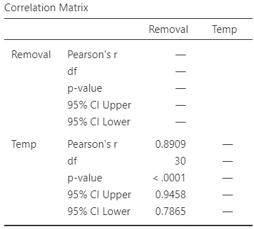

# Correlation {#Correlation}


::: {.objectivesBox .objectives data-latex="{objectives}"}
So far,
you have learnt to
ask a RQ, 
identify different ways of obtaining data,
design the study,
collect the data
describe the data,
summarise data graphically and numerically,
understand the tools of inference,
to form *confidence intervals*,
and
to perform *hypothesis tests*.

**In this chapter**,
you will learn about *correlation*.
You will learn to:

* produce correlation coefficients for exploring the relationship between two quantitative variables.
* produce and interpret $R^2$.
* conduct hypothesis tests for correlation coefficients.
:::


```{r echo=FALSE, fig.cap="", fig.align="center", fig.width=3, out.width="35%"}
SixSteps(5, "Correlation")
```


```{r echo=FALSE}
RD <- structure(list(Age = c(4.4, 4.4, 4.4, 4.4, 4.4, 4.4, 4.4, 4.8, 
4.8, 5.4, 5.4, 5.4, 5.4, 5.4, 5.4, 5.4, 5.4, 5.4, 5.4, 5.4, 5.4, 
5.8, 6.4, 6.4, 6.4, 6.4, 6.4, 6.4, 6.4, 6.4, 6.4, 6.4, 6.4, 7.4, 
7.4, 7.4, 7.4, 7.4, 7.4, 7.4, 7.4, 7.8, 7.8, 8.4, 8.4, 8.4, 8.4, 
8.4, 8.4, 8.4, 8.4, 8.4, 8.4, 8.4, 8.4, 8.4, 9.4, 9.4, 9.4, 9.4, 
9.4, 9.4, 9.4, 9.4, 9.4, 9.4, 9.4, 9.8, 10.4, 10.4, 10.4, 10.4, 
11.4, 12.4, 12.8, 13.4, 13.4, 14.4), Weight = c(2.42, 4.45, 5.24, 
3.19, 3.9, 3.26, 3.07, 4.48, 3.18, 3.36, 3.61, 3.71, 3.57, 3.33, 
2.72, 3.64, 2.61, 3.89, 3.3, 2.62, 3.1, 4.03, 3.36, 3.19, 3.32, 
2.78, 3.38, 3.07, 3.22, 3.05, 3.79, 3.15, 2.69, 3.92, 3.07, 2.54, 
3.82, 3.1, 3.56, 2.6, 3.56, 3.8, 3.49, 3.25, 1.84, 2.41, 2.86, 
2.88, 2.35, 2.94, 2.99, 2.76, 2.4, 2.67, 2.97, 2.61, 1.89, 1.8, 
2.62, 1.92, 3.75, 4.6, 2.31, 2.26, 3.48, 2.86, 2.38, 2.82, 1.09, 
2.69, 2.48, 2.72, 2.1, 2.72, 1.71, 2.14, 2.76, 1.57)), .Names = c("Age", 
"Weight"), class = "data.frame", row.names = c(NA, -78L))
```


## Correlation coefficients {#CorrCoefficients}

Describing the *linear* relationship between two *quantitative* variables,
requires a description of the form, direction and variation.
A *correlation coefficient* is a single number encapsulating all this information.

In the *population*,
the unknown value of the correlation coefficient is denoted $\rho$ ('rho');
in the *sample* the value of the correlation coefficient is denoted $r$.
As usual,
$r$ (the *statistic*) is an estimate of $\rho$ (the *parameter*),
and the value of $r$ is likely to be different in every sample
(that is, *sampling variation* exists).


:::: {.pronounceBox .pronounce data-latex="{pronounce}"}

::: {style="display: flex;"}
The symbol $\rho$ is the Greek letter 'rho', pronounced 'row', as in ['row your boat'](https://youtu.be/7otAJa3jui8).
:::

::: {}
```{r, echo=FALSE}
htmltools::tags$video(src = "./Movies/rho.mp4", 
                      width = "121", 
                      loop = "FALSE", 
                      controls = "controls", 
                      loop = "loop", 
                      style = "padding:5px; border: 2px solid gray;")
```
:::

::::


Correlation coefficients only apply if the form is approximately *linear*,
so checking if the relationship is linear first (using a scatterplot) is important.
Here,
the *Pearson* correlation coefficient is discussed,
which is suitable for describing linear relationships between quantitative 
data^[Other types of correlation coefficients also exist, such as the *Spearman* correlation, which may be used for monotonic, non-linear relationships.].


::: {.importantBox .important data-latex="{important}"}
The Pearson correlation coefficient only make sense if the relationship is approximately linear.
:::


The values of $\rho$ and $r$ are *always* between $-1$ and $+1$.
The *sign* indicates whether the relationship has a positive or negative linear association, 
and the *value* of the correlation coefficient tells us the strength of the relationship:

* $r = 0$ means *no linear relationship* between the two variables:
  Knowing how the value of $x$ changes tells us nothing about how the value of $y$ changes.
* $r= +1$ means a *perfect, positive* relationship:
  knowing the value of $x$ means we can perfectly predict the value of $y$ 
  (and *larger* values of $y$ are associated with *larger* values of $x$, in general).
* $r = -1$ means a *perfect, negative* relationship:
  knowing the value of $x$ means we can perfectly predict the value of $y$
  (and *larger* values of $y$ are associated with *smaller* values of $x$, in general).

`r if (knitr::is_html_output()) {
   'The animation below demonstrates how the values of the correlation coefficient work.'
}`


```{r echo=FALSE, animation.hook="gifski", cache=FALSE, interval=0.5, message=FALSE, warning = FALSE, dev=if (is_latex_output()){"pdf"}else{"png"}}
if (knitr::is_html_output()){
  set.seed(12345)

    num.obs <- 120
    
    rho.list <- seq(-1, 1, 
                    by = 0.1)
    num.plots <- length(rho.list)
    
    xx <- runif(num.obs, 0, 10)
    
    for (i in 1:num.plots){
      out <- MASS::mvrnorm(num.obs, 
                           mu = c(mean(xx), 10), 
                           Sigma = matrix(c(1, 
                                            rho.list[i] , 
                                            rho.list[i], 1), 
                                          ncol = 2), 
                           empirical = TRUE)
      
      plot(out[, 1], out[, 2], 
           pch = 19,
           las = 1, 
           xlim = c(2, 8),
           ylim = c(6, 14),
           xlab = expression(paste("Explanatory variable ", italic(x)) ),
           ylab = expression(paste("Response variable ", italic(y)) ),
           main = paste("Correlation:", format(round(rho.list[i], 2), nsmall = 2)))
      abline( coef(lm(out[, 2] ~ out[, 1]) ), 
              lwd = 2, 
              col = "grey")
    }
  }
```


Numerous example scatterplots were shown in Sect. \@ref(UnderstandingScatterplots);
a correlation coefficient is not relevant for 
`r if (knitr::is_html_output()) {
  'Plots C, D, E or H,'
} else {
  'Plots C, D or E,'
}`
as those relationships are not linear.

* In **Plot A**, the correlation coefficient will be *positive*, and reasonably close to one.
* In **Plot B**, the correlation coefficient will be *negative*, but not that close to $-1$.
* In **Plot F**, the correlation coefficient will close to zero.


::: {.example #Correlations name="Correlation coefficients"}
For the red deer data 
(Fig. \@ref(fig:RedDeerScatter)),
$r = -0.584$.

The value of $r$ is *negative*,
because,
in general,
*older* deer ($x$)
are associated with *smaller* weight molars ($y$).
:::


```{r SheepScatter2, echo=FALSE, fig.cap="Scatterplot for the sheep-food data", fig.align="center", fig.width=5, fig.height=3.5}
data(ruminant)

#par(mfrow=c(2,1))

plot(Energy ~ DryMatterDigest, 
     data = ruminant,
     las = 1,
     xlim = c(30, 80),
     ylim = c(1, 3.5),
     xlab = "Dry matter digestibility (%)",
     ylab = "Digestible energy (in Cal/gram)",
     pch = 19)
```


::: {.example #NHANESBPdiaCor name="Correlation coefficients"}
Consider the plot in 
Fig. \@ref(fig:NHANESBPdiaPlot)
from the NHANES data.
This scatterplot of *diastolic* BP against age is not linear,
so a correlation coefficient is *not appropriate*.
:::

```{r NHANESBPdiaPlot, echo=FALSE, fig.cap="A scatterplot of the diastolic blood pressure against age for the NHANES data", fig.align="center", fig.width=5, fig.height=3.5}
# Replace 0 DBP with NA
NHANES$BPDia1[ NHANES$BPDia1 == 0 ] <- NA


plot(BPDia1 ~ Age,
	   las = 1,
     ylab = "Diastolic BP (in mm Hg)",
     xlab = "Age (in years)",
	   ylim = c(0, 120),
	   cex = 0.7,
     data = NHANES)
```


::: {.example #NHANESBPsysCor name="Correlation coefficients"}
Consider the plot in 
Fig. \@ref(fig:NHANESBPsysPlot)
from the NHANES data.
This scatterplot of *systolic* BP against age is approximately linear,
so a correlation coefficient is *appropriate*.
The correlation coefficient is $r = 0.532$. 
:::


```{r NHANESBPsysPlot, echo=FALSE, fig.cap="A scatterplot of the systolic blood pressure against age for the NHANES data", fig.align="center", fig.width=5, fig.height=3.5}
plot(BPSys1 ~ Age,
     las = 1,
     cex = 0.7,
     ylim = c(50, 250),
     ylab = "Systolic BP (in mm Hg)",
     xlab = "Age (in years)", 
     data = NHANES)
```


::: {.thinkBox .think data-latex="{think}"}
A study evaluated various food mixtures for sheep
[@data:Moir1961:RuminantDiet].
One combination of variables that was assessed is shown in
Fig. \@ref(fig:SheepScatter2).

Estimate the value of $r$.

(Answer is here^[$r$ will be a positive number (since the scatterplot shows a positive linear relationship), and its value will be close to 1 as the relationship looks very strong.].)
:::


::: {.thinkBox .think data-latex="{think}"}
Earlier, we looked at the NHANES data to explore
the relationship between direct HDL cholesterol and current smoking status.

The NHANES project is an observational study,
so confounding is a potential issue.
For this reason,
relationships between the 
response and extraneous variables, and between explanatory and extraneous variables,
should be examined.

For example,
the relationship between
Age (an extraneous variables) and direct HDL cholesterol (the response variable) is shown 
in Fig. \@ref(fig:NHANESCholAge).

How would you describe the relationship?
What do you guess for the value of $r$?

(Answer is here^[Not much relationship: the mean of the direct HDL cholesterol concentration is similar for any age. Perhaps describe the scatterplot as 'little relationship'. We cannot make good guess about the value of $r$, but it will be near zero.].)
:::

```{r NHANESCholAge, echo=FALSE, fig.cap="Direct HDL cholesterol plotted against age for the NHANES data", fig.align="center", fig.width=5, fig.height=3.5}
#NHANES$BPDia1[ NHANES$BPDia1 == 0 ] <- NA

par(mar = c(5, 5, 4, 2) + 0.1 )

plot(DirectChol ~ Age,
     las = 1,
     cex = 0.7,
     xlab = "Age (in years)",
     ylab = "Direct HDL cholesterol\n(in mmol/L)", 
     data = NHANES)
```


::: {.tipBox .tip data-latex="{tip}"}
The web page [http://guessthecorrelation.com](http://guessthecorrelation.com) makes a game out of trying to guess the correlation coefficient!
:::


## Using software


<div style="float:right; width: 222x; border: 1px; padding:10px">

</div>


Software is used to compute the value of $r$.
For the red deer data
(Fig. \@ref(fig:RedDeerScatter)),
the relationship is approximately linear,
and the
jamovi output
(Fig. \@ref(fig:RedDeerCorrelationjamovi))
and
SPSS output
(Fig. \@ref(fig:RedDeerCorrelationSPSS))
show that $r = -0.584$:

* Direction: The *sign* of $r$ indicates the direction.
  Here we see a *negative* relationship:
  Higher ages are associated with lighter molars (in general),
  which makes sense.
* Variation:
  The *value* of $r$ indicates the strength of the relationship.
  Here,
  perhaps we could describe the variation as moderate.


```{r RedDeerCorrelationjamovi, echo=FALSE, fig.cap="jamovi correlation output for the red deer data", fig.align="center", out.width="45%"}
knitr::include_graphics("jamovi/RedDeer/RedDeer-Correlation.png")
```

```{r RedDeerCorrelationSPSS, echo=FALSE, fig.cap="SPSS correlation output for the red deer data", fig.align="center", out.width="75%"}
knitr::include_graphics("SPSS/RedDeer/RedDeer-Correlation.png")
```

 
 


## R-squared ($R^2$) {#R2}

While using $r$ tells us about the strength and direction of the linear relationship,
knowing exactly what the value *means* is tricky.
Interpretation is easier using $R^2$, or 'R-squared':
the square of the value of $r$.

`r if (knitr::is_html_output()) {
   'The animation below shows some values of $R^2$.'
}`


::: {.tipBox .tip data-latex="{tip}"}
The value of $R^2$ is *never* negative, and is usually expressed as a percentage.
:::


::: {.softwareBox .software data-latex="{software}"}
The value of $R^2$ is never negative.
However, you need to be careful when using your calculator!
  
With most calculators,
entering `-0.5^2` will return `-0.25`.
This is correct, because the calculator interprets your input as meaning
`-(0.25^2)`.

You need to enter 
`(-0.5)^2`.
This will give you the expected answer of `0.25`.
:::


```{r R2Plots, echo=FALSE, warning=FALSE, animation.hook="gifski", cache=FALSE, message = FALSE, interval=0.5, dev=if (is_latex_output()){"pdf"}else{"png"}}
if (knitr::is_html_output()){
  set.seed(12345)

   num.obs <- 120
    
   rho2.list <- seq(0.1, 1, 
                    by = 0.1)
   rho.list <- c( -rev(sqrt(rho2.list)), 0, sqrt(rho2.list) )
   num.plots <- length(rho.list)
    
   xx <- runif(num.obs, 0, 10)
    
   for (i in 1:num.plots){
      out <- MASS::mvrnorm(num.obs, 
                           mu = c(mean(xx), 10), 
                           Sigma = matrix(c(1, 
                                            rho.list[i] , 
                                            rho.list[i], 
                                            1), 
                                          ncol = 2), 
                           empirical = TRUE)
      
      plot(out[, 1], 
           out[,2 ], 
           pch = 19,
           las = 1, 
           xlim = c(2, 8),
           ylim = c(6, 14),
           xlab = "Explanatory variable",
           ylab = "Response variable",
           sub = paste("(r: ", format(round(rho.list[i], 2), nsmall = 2),")", sep = ""),
           main = paste("R-squared: ", format(round(rho.list[i]^2 * 100, 0), nsmall = 0), "%", sep = "") )
      abline( coef(lm(out[, 2] ~ out[, 1]) ), 
              lwd = 2, 
              col = "grey")
    }
}
```


The value of $R^2$ is
the percentage
reduction in the unknown variation of $y$
because the value of $x$ is known.

In other words,
it is the percentage of the variation in $y$
explained by using the linear relationship, 
rather than just the mean value of $y$.


::: {.example #R2Deer name="Values of $R^2$"}
For the red deer data 
(Fig. \@ref(fig:RedDeerScatter)),
the value of $R^2$ from the
software output
(Fig. \@ref(fig:RedDeerCorrelationjamovi); Fig. \@ref(fig:RedDeerCorrelationSPSS))
is
$R^2= (-0.584)^2 = 0.341$, 
usually written as a percentage: 34.1%.

The value of $R^2$ is positive,
even though the value of $r$ is negative.
:::


For the red deer data,
$R^2$ means that 
about 
34.1% of the variation in molar weights
can be explained by variation in the age of the deer.
The rest of the variation in molar weights
is due to extraneous variables,
such as weight, diet, amount of exercise, genetics, etc.


::: {.thinkBox .think data-latex="{think}"}
From Example \@ref(exm:NHANESBPsysCor),
the correlation coefficient between the systolic blood pressure and age in the NHANES data
is $r = 0.532$.

What is the value of $R^2$?
What does it mean?

(Answer is here^[$R^2 = (0.532)^2 = 0.283$: about 28.3% of the variation in systolic BP is due to age;
extraneous variable (weight, gender, amount of exercise, genetics, etc.)
explain the remaining 71.7% of the variation in SBP values.].)
:::


## Hypothesis testing {#CorrelationTesting}

### Introduction {#CorTesting-Intro}


<div style="float:right; width: 222x; border: 1px; padding:10px">

</div>


For the red deer data (Sect. \@ref(RedDeerData); Sect. \@ref(CorrCoefficients)),
the population correlation coefficient 
between the weight of molars $y$ and age of the deer $x$
is unknown and denoted by $\rho$.

The sample correlation coefficient is
$r = `r round(cor(RD$Age, RD$Weight), 3)`$,
but the value of $r$ varies from sample to sample
(there is *sampling variation*).\index{sampling variation!correlation coefficient}

The size of the sampling variation is measured with a *standard error*.
However,
there is a complication for correlation coefficients^[For those who want to know: 
the value of $r$ only varies between $-1$ and $1$, so the sampling distribution is not a normal distribution.

Instead, a transformation of the correlation coefficient has an approximate normal distribution and *standard error*.
Software automatically does this transforming.];
so we will not produce CIs for the correlation coefficient.


### Hypothesis testing details

As usual, 
questions can be asked about the relationship between the variables,
as measured by the unknown *population* correlation coefficient:

> Is the *population* correlation coefficient zero, or not?

In the context of the red deer data:

> In male red deer, 
> is there a correlation between age and the weight of molars?

The RQ is about the population parameter $\rho$.
Clearly,
the *sample* correlation coefficient $r$ is not zero,
and the RQ is asking
whether this could be attributed to sampling variation.
The null hypotheses is:

* $H_0$: $\rho = 0$ 

The parameter is $\rho$,
the population correlation between the age and molar weight in the red deer.

This is the usual 'no relationship' position,
which proposes that the population correlation coefficient is zero.
The alternative hypothesis is:

* $H_1$:  $\rho \ne 0$

This is a *two-tailed* test here, based on the RQ.

The approach is to **assume** that $\rho=0$ (from $H_0$),
then describe what values of $r$ could be **expected**, under that assumption,
just through sampling variation.
Then the **observed** value of $r$ is compared to the
expected values to determine if the valuew of $r$ supports or contradicts the assumption.

Software is used to test the hypotheses; 
the output in
Figs. \@ref(fig:RedDeerCorrelationjamovi) (jamovi) 
and \@ref(fig:RedDeerCorrelationSPSS) (SPSS) 
contains the relevant $P$-value 
(twice in the SPSS output!).

The two-tailed $P$-value for the test 
(labelled `Sig.` by SPSS) is less than 0.001
(`0.000` in SPSS).
That is,
the $P$-value is zero *to three decimal places*,
so there is *very strong evidence* to support $H_1$
(that the correlation in the population is not zero).

We write:

> The sample presents very strong evidence 
> (two-tailed $P < 0.001$)
> of a correlation between molar weight and the age of the male red deer
> ($r = -0.584$; $n = 78$)
> in the population.

Notice the three features of writing conclusions again:
An *answer to the RQ*;
evidence to support the conclusion ('two-tailed $P < 0.001$'; no test statistic is given);
and some *sample summary information* ('$r = -0.584$; $n = 78$').


::: {.tipBox .tip data-latex="{tip}"}
The evidence suggests that the correlation is not zero (in the population).
However,
a *non-zero* correlation
doesn't necessarily mean a *strong* correlation.

The correlation may be weak in the population (as estimated by the value of $r$), 
but there is evidence that it is not zero in the *population*.
:::


This may be a useful analogy:
If a rain forecast says 'there is a very high chance of rain tomorrow',
it doesn't mean there will be a *lot* of rain, 
just a high chance of *some* rain.


<iframe src="https://h5p.org/h5p/embed/495425" width="1090" height="608" frameborder="0" allowfullscreen="allowfullscreen"></iframe><script src="https://h5p.org/sites/all/modules/h5p/library/js/h5p-resizer.js" charset="UTF-8"></script>


### Statistical validity conditions {#ValidityCorrelation}

As usual, 
these results hold under 
[certain conditions to be met](#exm:StatisticalValidityAnalogy).
The conditions for which the test is statistically valid are:

1. The relationship is approximately linear.
1. The variation in the response variable is approximately constant 
   for all values of the explanatory variable.
1. The sample size is at least 25.

The sample size of 25 is a rough figure here, 
and some books give other values.

In addition to the statistical validity condition,
the test will be 
[**externally valid**](#def:ExternalValidity) 
if the
the sample is a [simple random sample](#SRS) from the population.
The test will also be 
[**internally valid**](#def:InternalValidity)
if the study was well designed.


::: {.example #StatisticalValidityDeer name="Statistical validity"}
For the red deer data,
the scatterplot
(Fig. \@ref(fig:RedDeerScatter))
shows that the relationship is approximately linear,
and the variation in molar weights doesn't seem to be 
obviously getting larger or smaller for older deer,
so correlations are sensible.
The sample size is also greater than 25.

The test in Sect. \@ref(CorrelationTesting) will be statistically valid.
:::


::: {.example #StatisticalValidityBiomass name="Statistical validity"}
A study
[@data:ForestBiomass2017; @mypapers:dunnsmyth:glms]
examined  the foliage biomass of small-leaved lime trees.
A plot of the foliage biomass against diameter
(Fig. \@ref(fig:LimeScatter))
shows that the relationship is non-linear.
In addition,
the variation in foliage biomass *increases* for larger diameters
(for values of $x$ near 10, the values of $y$ do not vary much at all, 
but for values of $x$ near 30, the values of $y$ vary greatly). 

Both of these issues mean that correlations are not appropriate.
A hypothesis test similar to that in 
Sect. \@ref(CorrelationTesting) 
is inappropriate.
:::


```{r LimeScatter, echo=FALSE, fig.cap="Foliage biomass plotted against diameter for small-leaved lime trees", fig.align="center", fig.width=4, fig.height=4}

data(lime)

plot(Foliage ~ DBH, 
     data = lime,
     las = 1,
     pch = 19, 
     ylim = c(0, 14),
     xlim = c(0, 40),
     xlab = "Diameter (in cm)",
     ylab = "Foliage biomass (in kg)")


LM.lm <- lm(Foliage ~ DBH, 
            data = lime)
abline( coef(LM.lm), 
        lwd = 2, 
        col = "grey")
```


```{r echo = FALSE}
dogs <- structure(list(Number = c("PQ33", "PQ34", "PQ35", "PQ36", "PQ37", 
"PQ38", "PQ39", "PQ40", "PQ41", "PQ42", "PQ43", "PQ44", "PQ45", 
"PQ46", "PQ47", "PQ51", "PQ52", "PQ53", "PQ54", "PQ55", "PQ57", 
"PQ58", "PQ59", "PQ60", "PQ62", "PQ48", "PQ49", "PQ50", "PQ56", 
"PQ61"), BL = c(47L, 48L, 50L, 50L, 51L, 53L, 52L, 57L, 50L, 
52L, 48L, 57L, 57L, 50L, 52L, 58L, 62L, 50L, 53L, 46L, 48L, 55L, 
53L, 54L, 45L, 50L, 50L, 60L, 53L, 55L), BH = c(45L, 44L, 45L, 
48L, 50L, 45L, 45L, 50L, 46L, 47L, 45L, 52L, 51L, 48L, 47L, 57L, 
55L, 40L, 50L, 43L, 45L, 48L, 49L, 52L, 37L, 47L, 49L, 55L, 52L, 
50L), BH.BL = c(0.957, 0.917, 0.9, 0.96, 0.98, 0.849, 0.865, 
0.877, 0.92, 0.904, 0.938, 0.912, 0.895, 0.96, 0.904, 0.983, 
0.887, 0.8, 0.943, 0.935, 0.938, 0.873, 0.925, 0.963, 0.822, 
0.94, 0.98, 0.917, 0.981, 0.909), Chest = c(56L, 48L, 50L, 57L, 
60L, 54L, 43L, 60L, 61L, 52L, 57L, 70L, 57L, 60L, 58L, 60L, 64L, 
46L, 58L, 60L, 50L, 53L, 58L, 58L, 50L, 54L, 59L, 63L, 52L, 60L
), Waist = c(48L, 41L, 42L, 49L, 54L, 46L, 38L, 45L, 51L, 45L, 
47L, 57L, 44L, 48L, 46L, 52L, 49L, 37L, 48L, 50L, 40L, 42L, 51L, 
50L, 39L, 43L, 49L, 52L, 43L, 50L), CH.WA = c(1.167, 1.17, 1.19, 
1.163, 1.111, 1.174, 1.132, 1.333, 1.196, 1.156, 1.213, 1.228, 
1.295, 1.25, 1.26, 1.154, 1.306, 1.243, 1.208, 1.2, 1.25, 1.262, 
1.137, 1.16, 1.282, 1.256, 1.204, 1.212, 1.209, 1.2), HaplotypeE = c(0L, 
0L, 0L, 0L, 0L, 0L, 0L, 0L, 0L, 0L, 0L, 0L, 0L, 0L, 0L, 0L, 0L, 
0L, 0L, 0L, 0L, 0L, 0L, 0L, 0L, 1L, 1L, 1L, 1L, 1L)), class = "data.frame", row.names = c(NA, 
-30L))
```

::: {.example #CorTestDogs name="Phu Quoc ridgeback dogs"}
A study of Phu Quoc Ridgeback dogs (*Canis familiaris*)
recorded many measurements of the dogs, including body length and body height [@quan2017relation].

The scatterplot (Fig. \@ref(fig:DogsScatter))
shows an approximate linear relationship.
We know that each sample could produce a different sample correlation coefficient.
We expect that taller dogs would also be longer, so we may ask:

> For these dogs,
> are longer dogs also taller dogs, in general?
  
The hypotheses are:
  
* $H_0$: $\rho = 0$
* $H_1$: $\rho > 0$ (i.e., one-tailed)


The correlation co-efficient is $r = 0.837$ and software notes that the two-tailed $P < 0.001$,
based on $n = 30$ dogs.

We write:

> There is very strong evidence that longer Phu Quoc ridgeback dogs are also taller ($r = 0.837$; one-tailed $P<0.001$; $n = 30$).

Since 
(a) the sample size is larger than 25; 
(b) the relationship is approximately linear; *and* 
(c) the variation in heights do not seem to differ for different lengths, the test is statistically valid.
:::


```{r DogsScatter, echo=FALSE, fig.align = "center", fig.cap = "Scatterplot of the body height vs body length for Phu Quoc ridgeback dogs", fig.width=5, fig.height=4}

plot( jitter(BL) ~ jitter(BH),
      data = dogs,
      xlab = "Body length (in cm)",
      ylab = "Body height (in cm)",
      main = "Body height vs body length\nfor Phu Quoc ridgeback dogs",
      pch = 19,
      las = 1,
      ylim = c(45, 65),
      xlim = c(35, 60) )
```


::: {.example #CorTestDrug name="Drug calculations"}
A study of $n = 30$ paramedicine students examined (among other things)
the relationship between the amount of stress experienced (measured using the State–Trait Anxiety Inventory (STAI) while performing drug-dose calculation, and length of work experience [@leblanc2005paramedic].

The hypotheses are:
  
* $H_0$: $\rho = 0$
* $H_1$: $\rho \ne 0$

The correlation co-efficient is given as  $r = 0.346$ and $P = 0.18$.


No scatterplot is provided, so the test is statistically valid only if the relationship is approximately linear
and that the variation in STAI scores does not vary for different levels of work experience.
The sample size is larger than 25, however.

We write:

> There is no evidence ($r = 0.346$; two-tailed $P = 0.18$) that the length of work experience is associated with STAI stress levels when performing drug-dose calculations.
:::


## Example: Removal efficiency {#Removal-Efficiency}


<div style="float:right; width: 222x; border: 1px; padding:10px">

</div>


`r if (knitr::is_html_output()) '<!--'`
\begin{wrapfigure}{R}{.25\textwidth}
  \begin{center}
    \includegraphics[width=.20\textwidth]{Illustrations/pexels-lisa-fotios-3264779.jpg}
  \end{center}
\end{wrapfigure}
`r if (knitr::is_html_output()) '-->'`


In wastewater treatment facilities,
air from biofiltration is passed through a membrane and dissolved in water,
and is transformed into harmless byproducts.
The removal efficiency $y$ (in %)
may depend on the inlet temperature (in $^\circ$C; $x$).

The RQ is

> In treating biofiltation wastewater,
> is the removal efficiency associated with the inlet temperature?

The population parameter is $\rho$,
the correlation between the removal efficiency and inlet temperature.

A scatterplot of $n=32$ samples
(Fig. \@ref(fig:CorrelationRemovalEfficiency))
suggests an approximately linear relationship
[@chitwood2001treatment; @DevoreBerk2007].

The output 
(jamovi: Fig. \@ref(fig:RemovalEfficiencyjamovi);
SPSS: Fig. \@ref(fig:RemovalEfficiencySPSS))
shows that the sample correlation coefficient is $r=0.891$, 
and so $R^2 = (0.891)^2 = 79.4$%.
This means that about 79.4% of the variation in removal efficiency can be explained 
by knowing the inlet temperature.


```{r CorrelationRemovalEfficiency, echo=FALSE, fig.cap="The relationship between removal efficiency and inlet temperature", fig.align="center", fig.width=5, fig.height=3.5}
RE <- structure(list(Removal = c(98.09, 98.25, 97.82, 97.82, 97.82, 
97.93, 98.38, 98.89, 98.96, 98.9, 98.68, 98.69, 98.51, 98.09, 
98.25, 98.36, 98.27, 98, 98.09, 98.25, 98.41, 98.51, 98.71, 98.79, 
98.87, 98.76, 98.58, 98.73, 98.45, 98.37, 98.36, 98.45), Temp = c(7.68, 
6.51, 6.43, 5.48, 6.57, 10.22, 15.69, 16.77, 17.13, 17.63, 16.72, 
15.45, 12.06, 11.44, 10.17, 9.64, 8.55, 7.57, 6.94, 8.32, 10.5, 
16.02, 17.83, 17.03, 16.18, 16.26, 14.44, 12.78, 12.25, 11.69, 
11.34, 10.97)), class = "data.frame", row.names = c(NA, -32L))

plot(Removal ~ Temp, 
     data = RE,
     xlab = "Temperature (degrees C)",
     ylab = "Removal efficiency (%)",
     pch = 19,
     las = 1
     )
```


To test if a relationship exists in the population, 
write:

* $H_0$: $\rho = 0$;
* $H_1$: $\rho \ne 0$: Two-tailed (as implied by the RQ).

The software output 
(jamovi: Fig. \@ref(fig:RemovalEfficiencyjamovi);
SPSS: Fig. \@ref(fig:RemovalEfficiencySPSS))
shows that $P < 0.001$ (which is what $P = 0.000$ in SPSS means).
We conclude:

> The sample presents very strong evidence (two-tailed $P < 0.001$)
> that removal efficiency depends on the inlet temperature ($r = 0.891$; $n = 32$)
> in the population.

The relationship is approximately linear and there is no obvious non-constant variance, 
and the sample size is larger than 25,
so the hypothesis test results will be statistically valid.


```{r RemovalEfficiencyjamovi, echo=FALSE, fig.cap="jamovi output for the removal-efficiency data", fig.align="center", out.width="45%"}

```

```{r RemovalEfficiencySPSS, echo=FALSE, fig.cap="SPSS output for the removal-efficiency data", fig.align="center", out.width="65%"}
knitr::include_graphics("SPSS/Removal/RemovalCorrelation.png")
```


## Summary {#Chap34-Summary}

In this chapter,
**correlation** was used to
describe the *strength* and direction of *linear* relationships
between two *quantitative* variables.

**Correlation coefficients**
(denoted $r$ in the sample; $\rho$ in the population)
are always between $-1$ and $+1$.

*Positive* values denote *positive* relationships between the two variables:
as one values gets larger, the other tends to get larger too.

*Negative* values denote *negative* relationships between the two variables:
as one values gets larger, the other tends to get *smaller*.
Values close to $-1$ or $+1$ are very strong relationships;
values near zero shows very little linear relationship between the variables.
Hypothesis tests for $r$ can be conducted using software.

Sometimes,
$R^2$ is used to describe the relationship:
it indicates what percentage of the variation in the response variable
can be explained by knowing the value of the explanatory variables.


<iframe src="https://usc.h5p.com/content/1291012285338851609/embed" width="1088" height="637" frameborder="0" allowfullscreen="allowfullscreen" allow="geolocation *; microphone *; camera *; midi *; encrypted-media *"></iframe><script src="https://usc.h5p.com/js/h5p-resizer.js" charset="UTF-8"></script>


`r if (knitr::is_html_output()){
  'The following short video may help explain some of these concepts:'
}`


<div style="text-align:center;">
<iframe width="560" height="315" src="https://www.youtube.com/embed/ZHwFJkpokMk" frameborder="0" allow="accelerometer; encrypted-media; gyroscope; picture-in-picture"></iframe>
</div>


## Quick review questions {#Chap34-QuickReview}

A study of Chinese paedatric patients
[@wong2018correlation]
studied the relationship between the 6-minute walk distance (6MWD)
and maximum oxygen uptake (VO2~max~)
for $n= 2 9$ patients.

The correlation coefficient is reported as $r = 0.457$,
and the corresponding $P$-value as $P = 0.013$.

1. The $x$-variable is  
`r if( knitr::is_html_output() ) {longmcq( c(
  answer = "6-minute walk distance",
  "Maximum oxygen uptake"
) )}`
1. True or false: Since the $P$-value is small, the correlation must be quite strong.  
`r if( knitr::is_html_output() ) {torf(answer=FALSE)}`
1. The relationship is best described as  
`r if( knitr::is_html_output() ) {longmcq( c(
  "Negative",
  answer = "Positive"
) )}`
1. The value of $R^2$ (to one decimal place, expressed as a percentage) is:  
`r if( knitr::is_html_output() ) {fitb(answer = 20.9, num=TRUE, tol=0.1)}`
1. For statistical validity, we need to *assume* that:  
`r if( knitr::is_html_output() ) {longmcq( c(
  "The response variable has a normal distribution",
  "The explanatory variable has a normal distribution",
  "The sample size is larger than 25",
  answer = "A linear relationship exists between the variables"
) )}`

**Progress:** `r webexercises::total_correct()`


## Exercises {#CorrelationExercises}

Selected answers are available in Sect. \@ref(CorrelationAnswer).


::: {.exercise #CorrelationExerciseDrawNegR}
Draw a scatterplot with:

1. A negative correlation coefficient, 
   with the value of $r$ very close to (but not equal to) $-1$. 
1. A positive correlation coefficient, 
   with the value of $r$ very close to (but not equal to) $+1$. 
1. A correlation coefficient very close to $0$. 
:::


::: {.exercise #CorrelationExercisePunting}
A study
(@MyersRegression, p. 75)
of American footballers measured the 
right-leg strengths $x$ of 13 players 
(using a weight lifting test), 
and the distance $y$ they punted a football (with their right leg)
(Fig. \@ref(fig:PuntPlotCor)).


1. The value of the correlation coefficient is 0.881. 
   Compute the value of $R^2$, and explain what this means.
1. jamovi was used to study the correlation 
   (Fig. \@ref(fig:Puntingjamovi)).
   Using this output, 
   perform a hypothesis test to determine if a correlation exists 
   between punting distance and right-leg strength.
:::

```{r PuntOutputRCor, echo=FALSE, results='hide'}
data(punting)
with( punting, cor.test(Punt, Right))
```


```{r PuntPlotCor, echo=FALSE, results='hide', fig.width=5, fig.height=3.5, fig.align="center", fig.cap="Punting distance and right leg strength", fig.width=4.5, fig.height=4}
punting <- structure(list(Left = c(170L, 130L, 170L, 160L, 150L, 150L, 180L, 
110L, 110L, 120L, 140L, 130L, 150L), Right = c(170L, 140L, 180L, 
160L, 170L, 150L, 170L, 110L, 120L, 130L, 120L, 140L, 160L), 
    Punt = c(162.5, 144, 174.5, 163.5, 192, 171.75, 162, 104.83, 
    105.67, 117.58, 140.25, 150.17, 165.17)), class = "data.frame", row.names = c(NA, 
-13L))

plot(Punt ~ Right, 
     data = punting,
     las = 1,
     xlab = "Right leg strength (in pounds)",
     ylab = "Punting distance (in feet",
     pch = 19,
     xlim = c(110, 180),
     ylim = c(100, 200)
)
abline( 
  coef( 
    Punt.lm <- lm( Punt ~ Right, data = punting)), 
  lwd = 2, 
  col = "grey")
```


```{r Puntingjamovi, echo=FALSE, fig.cap="jamovi output for the punting data", fig.align="center", out.width="45%"}
knitr::include_graphics("jamovi/Punting/Punting-Correlation.png")
```


::: {.exercise #CorrelationSoftdrink}
A study examined the time taken to deliver soft drinks to vending machines
[@others:Montgomery:regressionanalysis]
using a sample of size $n = 25$
(Fig. \@ref(fig:SoftdrinkPlots2)).

To perform a test of the correlation coefficient,
are the statistical validity conditions met?
:::


```{r SoftdrinkPlots2, echo=FALSE, fig.cap="The time taken to deliver soft drinks to vending machines", fig.align="center", fig.width=5, fig.height=3.5}
data(sdrink)

plot(Time ~ Cases, 
     data = sdrink,
     xlab = "Number of cases of product stocked",
     ylab = "Time to service machine (in mins)",
     main = "The relationship between service time\nand number of cases of soft drink sold",
     xlim = c(0, 30),
     ylim = c(0, 80),
     las = 1,
     pch = 19)
abline( coef( lm(Time ~ Cases, 
                 data = sdrink)), 
        col = "grey")
```


```{r echo=FALSE}
Bit <- structure(list(Bitumen = c(5.18, 5.26, 4.79, 5.3, 5.04, 5.08, 
5.35, 5.14, 4.77, 4.88, 5.24, 5.24, 4.86, 4.79, 5.2, 5.23, 5.27, 
5.15, 5.38, 5.25, 5.09, 5.14, 4.98, 5.13, 4.96, 5.21, 4.95, 4.96, 
5.05, 4.99, 5, 4.97, 5.07, 4.98, 5.06, 4.92, 5.02, 4.89, 5.05, 
5, 5.02, 5.17), AirVoids = c(4.01, 3.79, 5.04, 3.75, 4.4, 4.32, 
3.59, 4.14, 5.09, 4.81, 3.9, 3.87, 4.85, 5.02, 3.96, 3.91, 3.78, 
4.09, 3.54, 3.81, 4.21, 4.1, 4.51, 4.13, 4.56, 3.95, 4.58, 4.56, 
4.41, 4.55, 4.53, 4.6, 4.35, 4.59, 4.37, 4.74, 4.49, 4.82, 4.41, 
4.54, 4.47, 4.16)), .Names = c("Bitumen", "AirVoids"), class = "data.frame", row.names = c(NA, 
-42L))
```


::: {.exercise #CorrelationExerciseBitumen}
A study of hot mix asphalt 
[@data:Panda2018:Bitumen]
created $n = 42$ samples of asphalt and measured the volume of air voids
and the bitumen content by weight
(Fig. \@ref(fig:BitumenPlotCor)).

1. Using the plot, estimate the value of $r$.
1. The value of $R^2$ is 99.29%.
   What is the value of $r$? (Hint: Be careful!)
1. Would you expect the $P$-value testing $H_0$: $\rho=0$ to be small or large? 
   Explain.
1. Would the test be statistically valid?
:::

```{r BitumenPlotCor, echo=FALSE, fig.cap="Air voids in bitumen samples", fig.align="center", fig.width=5, fig.height=3.5}
plot(AirVoids ~ Bitumen, 
     data = Bit,
     pch = 19,
     xlab = "Bitumen content by weight (%)",
     ylab = "Air voids by volume (%)",
     main = "The relationship between air voids\nand bitumen content",
     las = 1,
     xlim = c(4.7, 5.4),
     ylim = c(3.5, 5.5)
     )
```


::: {.exercise #CorrelationExerciseSoil}
The *California Bearing Ratio* (CBR) value is used to describe soil-sub grade for flexible pavements
(such as in the design of air field runways).

One study [@talukdar2014study]
examined the relationship between CBR and other properties of soil,
including the plasticity index (PI, a measure of the plasticity of the soil).

The scatterplot from 16 different soil samples from Assam, India, is shown in 
Fig. \@ref(fig:SoilPlotCor).

1. Using the plot, estimate the value of $r$.
1. The value of $R^2$ is 67.07%.
   What is the value of $r$? (Hint: Be careful!)
1. Would you expect the $P$-value testing $H_0$: $\rho=0$ to be small or large? 
   Explain.
1. Would the test be statistically valid?
:::


```{r SoilPlotCor, echo=FALSE, fig.cap="The relationship between CBR and PI in sixteen soil samples", fig.align="center", fig.width=5, fig.height=3.5}
Soils <- structure(list(Sample = 1:16, Gravel = c(0, 2.35, 1.31, 0.64, 
4.71, 2.39, 1.44, 0.35, 2.35, 1.87, 0, 2.65, 1.25, 3.81, 3.35, 
2.38), Sand = c(27.15, 28.94, 28.94, 30.14, 36.52, 35.23, 35.01, 
29.44, 28.94, 26.92, 25.94, 18.12, 27.64, 26.92, 13.44, 28.21
), Clay = c(72.85, 68.71, 68.71, 69.22, 58.77, 62.38, 63.55, 
70.21, 68.71, 71.21, 74.06, 79.23, 71.11, 69.27, 83.21, 69.41
), Type = c("Fine grained ", "Fine grained ", "Fine grained", 
"Fine grained", "Fine grained", "Fine grained", "Fine grained", 
"Fine grained", "Fine grained", "Fine grained", "Fine grained", 
"Fine grained", "Fine grained", "Fine grained", "Fine grained", 
"Fine grained"), LL = c(28.46, 34.62, 34.92, 35.2, 34.42, 29.35, 
30.34, 36.78, 32.21, 34.25, 35.69, 36.29, 35.23, 36.23, 34.56, 
35.36), PL = c(20.24, 26.65, 27.4, 27.51, 27.47, 23.23, 23.78, 
28.32, 25.69, 27.53, 28.54, 28.18, 27.88, 28.98, 26.44, 28.34
), PI = c(8.22, 7.97, 7.52, 7.69, 6.95, 6.12, 6.56, 8.46, 6.52, 
6.72, 7.15, 8.11, 7.35, 7.25, 8.12, 7.02), Type2 = c("ML", "ML", 
"ML", "MI", "ML", "ML", "ML", "MI", "ML", "ML", "MI", "MI", "MI", 
"MI", "ML", "MI"), MDD = c(1.65, 1.7, 1.71, 1.69, 1.72, 1.77, 
1.76, 1.64, 1.75, 1.74, 1.73, 1.62, 1.66, 1.68, 1.71, 1.74), 
    OMC = c(14.56, 15.11, 15.2, 15.35, 15.62, 14.39, 14.92, 15.82, 
    14.42, 14.16, 15.62, 15.76, 15.52, 15.62, 15.4, 14.65), CBR = c(5.56, 
    5.62, 5.77, 5.69, 5.81, 6.12, 6.1, 5.72, 6.2, 6.05, 5.95, 
    5.67, 5.92, 5.88, 5.98, 6.02)), class = "data.frame", row.names = c(NA, 
-16L))


plot(CBR ~ PI, 
     data = Soils,
     pch = 19,
     xlab = "Plasticity index (PI)",
     ylab = "CBR",
     las = 1,
     xlim = c(6.0, 8.5),
     ylim = c(5.5, 6.2)
     )
```


