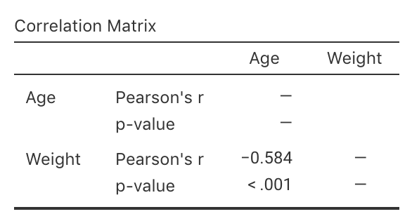
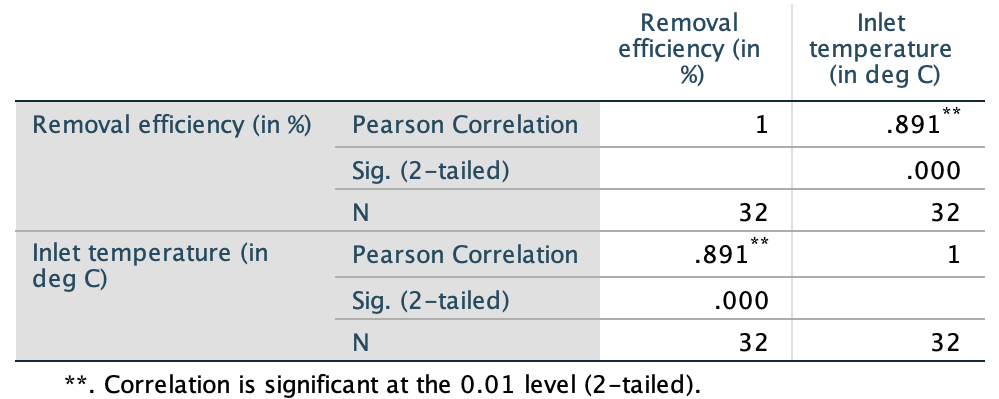
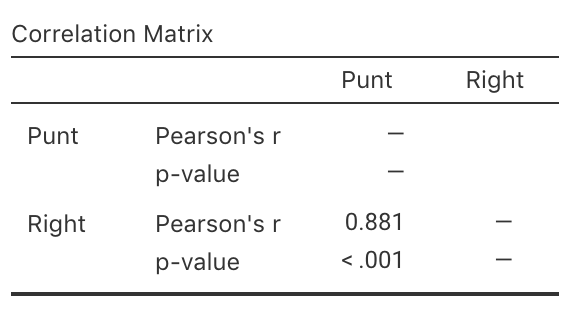

# Correlation {#Correlation}


<!-- Introductions; easier to separate by format -->
```{r, child = if (knitr::is_html_output()) {'./introductions/36-Correlation-HTML.Rmd'} else {'./introductions/36-Correlation-LaTeX.Rmd'}}
```


```{r echo=FALSE}
RD <- read.csv("./Data/RedDeer.csv")
```


## Correlation coefficients {#CorrCoefficients}

Describing the *linear* relationship between two *quantitative* variables requires describing the form, direction and variation.
A *correlation coefficient* is a single number encapsulating all this information.
In the *population*, the unknown value of the correlation coefficient is denoted $\rho$ ('rho'); in the *sample* the value of the correlation coefficient is denoted $r$.
As usual, $r$ (the *statistic*) is an estimate of $\rho$ (the *parameter*), and the value of $r$ is likely to be different in every sample (that is, *sampling variation* exists).


:::: {.pronounceBox .pronounce data-latex="{iconmonstr-microphone-7-240.png}"}

::: {style="display: flex;"}
The symbol $\rho$ is the Greek letter 'rho', pronounced 'row', as in 'row your boat'.
:::

::: {}
```{r, echo=FALSE}
htmltools::tags$video(src = "./Movies/rho.mp4", 
                      width = "121", 
                      loop = "FALSE", 
                      controls = "controls", 
                      loop = "loop", 
                      style = "padding:5px; border: 2px solid gray;")
```
:::

::::


Here, the *Pearson* correlation coefficient is discussed, suitable for describing *linear* relationships between *quantitative* data^[Other types of correlation coefficients also exist, such as the *Spearman* correlation, which may be used for monotonic, non-linear relationships.].
Pearson correlation coefficients only apply if the form is approximately *linear* (so check with a scatterplot first).


::: {.importantBox .important data-latex="{iconmonstr-warning-8-240.png}"}
The Pearson correlation coefficient only make sense if the relationship is approximately linear.
:::


The values of $\rho$ and $r$ are *always* between $-1$ and $+1$.
The *sign* indicates whether the relationship has a positive or negative linear association, and the *value* of the correlation coefficient describes the strength of the relationship:

* $r = 0$ means *no linear relationship* between the variables:
  Knowing how the value of $x$ changes tells us nothing about how the value of $y$ changes.
  The best prediction for *any* value of $x$ is the mean of $y$.
* $r = +1$ means a *perfect, positive* relationship:
  knowing the value of $x$ produces a perfect prediction of the value of $y$, and *larger* values of $y$ are associated with *larger* values of $x$ (in general).
* $r = -1$ means a *perfect, negative* relationship:
  knowing the value of $x$ produces a perfect prediction of the value of $y$, and *larger* values of $y$ are associated with *smaller* values of $x$ (in general).

`r if (knitr::is_html_output()) {
   'The animation below demonstrates how the values of the correlation coefficient work.'
}`


```{r echo=FALSE, animation.hook="gifski", cache=FALSE, interval=0.5, message=FALSE, warning = FALSE, dev=if (is_latex_output()){"pdf"}else{"png"}}
if (knitr::is_html_output()){
  set.seed(12345)

    num.obs <- 120
    
    rho.list <- seq(-1, 1, 
                    by = 0.1)
    num.plots <- length(rho.list)
    
    xx <- runif(num.obs, 0, 10)
    
    for (i in 1:num.plots){
      out <- MASS::mvrnorm(num.obs, 
                           mu = c(mean(xx), 10), 
                           Sigma = matrix(c(1, 
                                            rho.list[i] , 
                                            rho.list[i], 1), 
                                          ncol = 2), 
                           empirical = TRUE)
      
      plot(out[, 1], out[, 2], 
           pch = 19,
           las = 1, 
           xlim = c(2, 8),
           ylim = c(6, 14),
           xlab = expression(paste("Explanatory variable ", italic(x)) ),
           ylab = expression(paste("Response variable ", italic(y)) ),
           main = paste("Correlation:", format(round(rho.list[i], 2), nsmall = 2)))
      abline( coef(lm(out[, 2] ~ out[, 1]) ), 
              lwd = 2, 
              col = "grey")
    }
  }
```

Numerous example scatterplots were shown in Sect. \@ref(UnderstandingScatterplots).
A correlation coefficient is not relevant for 
`r if (knitr::is_html_output()) {
  'Plots C, D, E or H,'
} else {
  'Plots C, D or E,'
}`
as those relationships are not linear.
For the others:

* In **Plot A**, the correlation coefficient will be *positive*, and reasonably close to one.
* In **Plot B**, the correlation coefficient will be *negative*, but not that close to $-1$.
* In **Plot F**, the correlation coefficient will close to zero.


::: {.example #Correlations name="Correlation coefficients"}
For the red deer data (Fig. \@ref(fig:RedDeerScatter)), $r = -0.584$.
The value of $r$ is *negative* because, in general, *older* deer ($x$) are associated with *smaller* weight molars ($y$).
:::


```{r NHANESBPdiaPlot, echo=FALSE, fig.cap="A scatterplot of the diastolic blood pressure against age for the NHANES data", fig.align="center", fig.width=5, fig.height=3.5}
# Replace 0 DBP with NA
NHANES$BPDia1[ NHANES$BPDia1 == 0 ] <- NA
```


::: {.example #NHANESBPCor name="Correlation coefficients"}
Consider the plot in Fig. \@ref(fig:NHANESBPPlot) (left panel) from the NHANES data.
This scatterplot of *diastolic* BP against age is not linear: a correlation coefficient is *not appropriate*.

Consider the plot in Fig. \@ref(fig:NHANESBPPlot) (right panel) from the NHANES data.
This scatterplot of *systolic* BP against age is approximately linear, so a correlation coefficient is *appropriate*.
The correlation coefficient is $r = 0.532$. 
:::


```{r NHANESBPPlot, echo=FALSE, fig.cap="Two scatterplots from the NHANES data: diastolic blood pressure against age (left panel); of the systolic blood pressure against age (right panel)", fig.align="center", fig.width=8, fig.height=3.5, out.width='90%'}
par(mfrow = c(1, 2))

plot(BPDia1 ~ Age,
	   las = 1,
     ylab = "Diastolic BP (in mm Hg)",
     xlab = "Age (in years)",
	   ylim = c(0, 120),
	   cex = 0.7,
     data = NHANES)

plot(BPSys1 ~ Age,
     las = 1,
     cex = 0.7,
     ylim = c(50, 250),
     ylab = "Systolic BP (in mm Hg)",
     xlab = "Age (in years)", 
     data = NHANES)
```


::: {.thinkBox .think data-latex="{iconmonstr-light-bulb-2-240.png}"}
A study evaluated various food mixtures for sheep [@data:Moir1961:RuminantDiet].
One combination assessed is shown in Fig. \@ref(fig:SheepScatter2).
Estimate the value of $r$.\label{thinkBox:EstimateR}

`r if (knitr::is_latex_output()) '<!--'`
`r webexercises::hide()`
$r$ will be a positive number (since the scatterplot shows a positive linear relationship), and its value will be close to 1 as the relationship looks very strong.
`r webexercises::unhide()`
`r if (knitr::is_latex_output()) '-->'`
:::


```{r SheepScatter2, echo=FALSE, fig.cap="Scatterplot for the sheep-food data", fig.align="center", fig.width=5, fig.height=3.5}
data(ruminant)

plot(Energy ~ DryMatterDigest, 
     data = ruminant,
     las = 1,
     xlim = c(30, 80),
     ylim = c(1, 3.5),
     xlab = "Dry matter digestibility (%)",
     ylab = "Digestible energy (in Cal/gram)",
     pch = 19)
```


<!-- ::: {.thinkBox .think data-latex="{iconmonstr-light-bulb-2-240.png}"} -->
<!-- Earlier, we looked at the NHANES data to explore the relationship between direct HDL cholesterol and current smoking status. -->
<!-- The NHANES project is an observational study, so confounding is a potential issue. -->
<!-- For this reason, relationships between the response and extraneous variables, and between explanatory and extraneous variables, should be examined. -->
<!-- \smallskip -->

<!-- For example, the relationship between Age (an extraneous variables) and direct HDL cholesterol (the response variable) is shown in Fig. \@ref(fig:NHANESCholAge). -->
<!-- How would you describe the relationship? -->
<!-- What do you guess for the value of $r$? -->

<!-- `r webexercises::hide()` -->
<!-- Not much relationship: the mean of the direct HDL cholesterol concentration is similar for any age.  -->
<!-- Perhaps describe the scatterplot as 'little relationship'.  -->
<!-- We cannot make good guess about the value of $r$, but it will be near zero. -->
<!-- `r webexercises::unhide()` -->
<!-- ::: -->


<!-- ```{r NHANESCholAge, echo=FALSE, fig.cap="Direct HDL cholesterol plotted against age for the NHANES data", fig.align="center", fig.width=5, fig.height=3.5} -->
<!-- #NHANES$BPDia1[ NHANES$BPDia1 == 0 ] <- NA -->

<!-- par(mar = c(5, 5, 4, 2) + 0.1 ) -->

<!-- plot(DirectChol ~ Age, -->
<!--      las = 1, -->
<!--      cex = 0.7, -->
<!--      ylim = c(0, 4), -->
<!--      xlab = "Age (in years)", -->
<!--      ylab = "Direct HDL cholesterol\n(in mmol/L)",  -->
<!--      data = NHANES) -->
<!-- ``` -->


::: {.tipBox .tip data-latex="{iconmonstr-info-6-240.png}"}
The web page [http://guessthecorrelation.com](http://guessthecorrelation.com) makes a game out of trying to guess the correlation coefficient.
:::


<iframe src="https://learningapps.org/watch?v=psq8a3mfj22" style="border:0px;width:100%;height:500px" allowfullscreen="true" webkitallowfullscreen="true" mozallowfullscreen="true"></iframe>


## Using software


<div style="float:right; width: 222x; border: 1px; padding:10px">

</div>


Software is used to compute the value of $r$ (formulas exist, but are tedious to use).
For the red deer data (Fig. \@ref(fig:RedDeerScatter)), the relationship is approximately linear, and the jamovi output (Fig. \@ref(fig:RedDeerCorrelationjamovi)) and SPSS output (Fig. \@ref(fig:RedDeerCorrelationSPSS)) show that $r = -0.584$.
The *sign* of $r$ is negative, indicating a *negative* relationship: Higher ages are associated with lighter molars (in general).
The *value* of $r$ indicates that the strength of the relationship is, perhaps, "moderate".


```{r RedDeerCorrelationjamovi, echo=FALSE, fig.cap="jamovi correlation output for the red deer data", fig.align="center", out.width="45%"}

```


```{r RedDeerCorrelationSPSS, echo=FALSE, fig.cap="SPSS correlation output for the red deer data", fig.align="center", out.width="75%"}
knitr::include_graphics("SPSS/RedDeer/RedDeer-Correlation.png")
```


## R-squared ($R^2$) {#R2}

The value of $r$ describes the strength and direction of the linear relationship, but knowing exactly what the value *means* is tricky.
Interpretation is easier using $R^2$, or 'R-squared': the square of the value of $r$.
`r if (knitr::is_html_output()) {
   'The animation below shows some values of $R^2$.'
}`


::: {.tipBox .tip data-latex="{iconmonstr-info-6-240.png}"}
The value of $R^2$ is *never* negative.
It is usually multiplied by 100 and hence expressed as a percentage.
:::


::: {.softwareBox .software data-latex="{iconmonstr-laptop-4-240.png}"}
Even though the value of $R^2$ is never negative, you need to be careful when using your calculator!
With most calculators, entering `-0.5^2` returns `-0.25`.
The calculator interprets your input as meaning `-(0.25^2)`.
\smallskip

You need to use brackets: enter `(-0.5)^2`, which will give the expected answer of `0.25`.
:::


```{r R2Plots, echo=FALSE, warning=FALSE, animation.hook="gifski", cache=FALSE, message = FALSE, interval=0.5, dev=if (is_latex_output()){"pdf"}else{"png"}}
if (knitr::is_html_output()){
  set.seed(12345)

   num.obs <- 120
    
   rho2.list <- seq(0.1, 1, 
                    by = 0.1)
   rho.list <- c( -rev(sqrt(rho2.list)), 0, sqrt(rho2.list) )
   num.plots <- length(rho.list)
    
   xx <- runif(num.obs, 0, 10)
    
   for (i in 1:num.plots){
      out <- MASS::mvrnorm(num.obs, 
                           mu = c(mean(xx), 10), 
                           Sigma = matrix(c(1, 
                                            rho.list[i] , 
                                            rho.list[i], 
                                            1), 
                                          ncol = 2), 
                           empirical = TRUE)
      
      plot(out[, 1], 
           out[,2 ], 
           pch = 19,
           las = 1, 
           xlim = c(2, 8),
           ylim = c(6, 14),
           xlab = "Explanatory variable",
           ylab = "Response variable",
           sub = paste("(r: ", format(round(rho.list[i], 2), nsmall = 2),")", sep = ""),
           main = paste("R-squared: ", format(round(rho.list[i]^2 * 100, 0), nsmall = 0), "%", sep = "") )
      abline( coef(lm(out[, 2] ~ out[, 1]) ), 
              lwd = 2, 
              col = "grey")
    }
}
```


The value of $R^2$ is the reduction in the unexplained variation of $y$ because the value of $x$ is known.
When expressed as a percentage, $R^2$ is the percentage of the variation in $y$ explained by using the linear relationship, rather than just the mean value of $y$.


::: {.example #R2Deer name="Values of R-squared"}
For the red deer data (Fig. \@ref(fig:RedDeerScatter)), the value of $R^2$ is $R^2 = (-0.584)^2 = 0.341$, usually written as a percentage: 34.1%.
The value of $R^2$ is positive, even though the value of $r$ is negative.
:::


For the red deer data, $R^2$ means that about 34.1% of the variation in molar weights can be explained by variation in the age of the deer.
The rest of the variation in molar weights is due to extraneous variables, such as weight, diet, amount of exercise, genetics, etc.


::: {.thinkBox .think data-latex="{iconmonstr-light-bulb-2-240.png}"}
From Example \@ref(exm:NHANESBPCor), the correlation coefficient between the systolic blood pressure and age in the NHANES data is $r = 0.532$.
What is the value of $R^2$?
What does it mean?\label{thinkBox:MeaningOfR2}

`r if (knitr::is_latex_output()) '<!--'`
`r webexercises::hide()`
$R^2 = (0.532)^2 = 0.283$: about 28.3% of the variation in systolic BP is due to age; extraneous variable (weight, gender, amount of exercise, genetics, etc.) explain the remaining 71.7% of the variation in SBP values.
`r webexercises::unhide()`
`r if (knitr::is_latex_output()) '-->'`
:::


## Hypothesis testing {#CorrelationTesting}

### Introduction {#CorTesting-Intro}


<div style="float:right; width: 222x; border: 1px; padding:10px">

</div>


For the red deer data (Sect. \@ref(RedDeerData); Sect. \@ref(CorrCoefficients)), the population correlation coefficient between the weight of molars $y$ and age of the deer $x$ is unknown, and denoted by $\rho$.
The sample correlation coefficient is $r = `r round(cor(RD$Age, RD$Weight), 3)`$, but the value of $r$ varies across all possible samples (*sampling variation* exists).

The size of the sampling variation is measured with a *standard error*.
However, the sampling distribution of $r$ does not have a normal distribution^[For those interested: the value of $r$ only varies between $-1$ and $1$, so cannot have a normal distribution. A transformation of the sample correlation coefficient does have an approximate normal distribution and *standard error*.], so we will not discuss CIs for the correlation coefficient.


### Hypothesis testing details

As usual, questions can be asked about the relationship between the variables in the *population*, as measured by the unknown *population* correlation coefficient:

> Is the *population* correlation coefficient zero, or not?

In the context of the red deer data:

> In male red deer, is there a correlation between age and the weight of molars?

The RQ is about the population parameter $\rho$.
Clearly, the *sample* correlation coefficient $r$ is not zero, and the RQ is asking if sampling variation if the reason for this.
The null hypotheses is:

* $H_0$: $\rho = 0$.

The parameter is $\rho$, the population correlation coefficient.
This hypothesis is the 'no relationship' position, which proposes that the population correlation coefficient is zero, and the sample correlation coefficient is not zero due to sampling variation.
The alternative hypothesis is:

* $H_1$:  $\rho \ne 0$ \quad (*two-tailed* test, based on the RQ).

As usual, we *assume* that $\rho = 0$ (from $H_0$), then describe what values of $r$ could be *expected*, under that assumption, across all possible samples (sampling variation).
Then the *observed* value of $r$ is compared to the expected values to determine if the value of $r$ supports or contradicts the assumption.

Software is used to conduct the hypotheses test.
The output (Figs. \@ref(fig:RedDeerCorrelationjamovi) (jamovi) and \@ref(fig:RedDeerCorrelationSPSS) (SPSS)) contains the relevant $P$-value (twice in the SPSS output!).
The two-tailed $P$-value for the test (labelled `Sig.` by SPSS) is less than 0.001 (`0.000` in SPSS).
The $P$-value is zero *to three decimal places*, so *very strong evidence* exists to support $H_1$ (that the correlation in the population is not zero).
We write:

> The sample presents very strong evidence (two-tailed $P < 0.001$) of a correlation between molar weight and the age of the male red deer ($r = -0.584$; $n = 78$) in the population.

Notice the three features of writing conclusions again:
An *answer to the RQ*; evidence to support the conclusion ('two-tailed $P < 0.001$'; no test statistic is given in the output); and some *sample summary information* ('$r = -0.584$; $n = 78$').


::: {.tipBox .tip data-latex="{iconmonstr-info-6-240.png}"}
The evidence suggests that the correlation coefficient is not zero (in the population).
However, a *non-zero* correlation doesn't necessarily mean a *strong* correlation exists.
The correlation may be weak in the population (as estimated by the value of $r$), but evidence exists that the correlation is *not zero* in the *population*.
:::


### Statistical validity conditions {#ValidityCorrelation}

As usual, these results hold under [certain conditions to be met](#exm:StatisticalValidityAnalogy).
The conditions for which the test is statistically valid are:

1. The relationship is approximately linear.
1. The variation in the response variable is approximately constant for all values of the explanatory variable.
1. The sample size is at least 25.

The sample size of 25 is a rough figure here, and some books give other values.


::: {.example #StatisticalValidityDeer name="Statistical validity"}
For the red deer data, the scatterplot (Fig. \@ref(fig:RedDeerScatter)) shows that the relationship is approximately linear, and the variation in molar weights doesn't seem to be obviously getting larger or smaller for older deer, so correlations are sensible.
The sample size is also greater than 25.
The test in Sect. \@ref(CorrelationTesting) will be statistically valid.
:::


::: {.example #StatisticalValidityBiomass name="Statistical validity"}
A study [@data:ForestBiomass2017; @mypapers:dunnsmyth:glms] examined the foliage biomass of small-leaved lime trees.
A plot of the foliage biomass against diameter (Fig. \@ref(fig:LimeScatter)) shows that the relationship is non-linear.
In addition, the variation in foliage biomass *increases* for larger diameters (for values of $x$ near 10, the values of $y$ do not vary much at all, but for values of $x$ near 30, the values of $y$ vary greatly). 
Both of these issues mean that correlations are not appropriate.
A hypothesis test similar to that in Sect. \@ref(CorrelationTesting) is inappropriate.
:::


```{r LimeScatter, echo=FALSE, fig.cap="Foliage biomass plotted against diameter for small-leaved lime trees", fig.align="center", fig.width=5, fig.height=3.5}

data(lime)

plot(Foliage ~ DBH, 
     data = lime,
     las = 1,
     pch = 19, 
     ylim = c(0, 14),
     xlim = c(0, 40),
     xlab = "Diameter (in cm)",
     ylab = "Foliage biomass (in kg)")


LM.lm <- lm(Foliage ~ DBH, 
            data = lime)
abline( coef(LM.lm), 
        lwd = 2, 
        col = "grey")
```


```{r echo = FALSE}
dogs <- read.csv("Data/Dogs.csv")
```

::: {.example #CorTestDogs name="Phu Quoc ridgeback dogs"}
A study of Phu Quoc Ridgeback dogs (*Canis familiaris*) recorded many measurements of the dogs, including body length and body height [@quan2017relation].
The scatterplot (Fig. \@ref(fig:DogsScatter)) shows an approximate linear relationship.
Each sample of dogs could produce a different value for $r$.
In this example, it does not matter which variable is used as $x$ or $y$.

Since taller dogs might be expected to be longer, we may ask:

> For these dogs, are longer dogs also taller dogs, in general?
  
The hypotheses are:

\[
    H_0: \rho = 0\quad\text{and}\quad H_1: \rho > 0\quad \text{(i.e., one-tailed)}
\]
From software, $r = 0.837$ and the two-tailed is $P < 0.001$, based on $n = 30$ dogs.
We write:

> Very strong evidence exists that longer Phu Quoc ridgeback dogs are also taller ($r = 0.837$; one-tailed $P < 0.001$; $n = 30$).

Since (a) the sample size is larger than 25; (b) the relationship is approximately linear; *and* (c) the variation in heights do not seem to differ for different lengths, the test is statistically valid.
:::


```{r DogsScatter, echo=FALSE, fig.align = "center", fig.cap = "Scatterplot of the body height vs body length for Phu Quoc ridgeback dogs", fig.width=5, fig.height=3.5}
plot( jitter(BL) ~ jitter(BH),
      data = dogs,
      xlab = "Body length (in cm)",
      ylab = "Body height (in cm)",
      main = "Body height vs body length\nfor Phu Quoc ridgeback dogs",
      pch = 19,
      las = 1,
      ylim = c(45, 65),
      xlim = c(35, 60) )
```


::: {.example #CorTestDrug name="Drug calculations"}
A study of $n = 30$ paramedicine students examined (among other things) the relationship between the amount of stress experienced (measured using the State–Trait Anxiety Inventory (STAI)) while performing drug-dose calculation, and length of work experience [@leblanc2005paramedic].
The hypotheses are:
\[
   H_0: \rho = 0\quad\text{and}\quad H_1: \rho \ne 0.
\]
The correlation coefficient is given as $r = 0.346$ and $P = 0.18$ (from software).
No scatterplot is provided, so the test is statistically valid only if the relationship is approximately linear, and if the variation in STAI scores does not change for different levels of work experience.
The sample size is larger than 25, however.
We write:

> No evidence exists ($r = 0.346$; two-tailed $P = 0.18$) that the length of work experience is associated with STAI stress levels when performing drug-dose calculations.
:::


<iframe src="https://learningapps.org/watch?v=pd07ft8ec22" style="border:0px;width:100%;height:500px" allowfullscreen="true" webkitallowfullscreen="true" mozallowfullscreen="true"></iframe>


## Example: Removal efficiency {#Removal-Efficiency}


<div style="float:right; width: 222x; border: 1px; padding:10px">

</div>


In wastewater treatment facilities, air from biofiltration is passed through a membrane and dissolved in water, and is transformed into harmless byproducts.
The removal efficiency $y$ (in %) may depend on the inlet temperature (in $^\circ$C; $x$).
The RQ is

> In treating biofiltation wastewater, is the removal efficiency associated with the inlet temperature?

The population parameter is $\rho$, the correlation between the removal efficiency and inlet temperature.
A scatterplot of $n = 32$ samples (Fig. \@ref(fig:CorrelationRemovalEfficiency)) suggests an approximately linear relationship [@chitwood2001treatment; @DevoreBerk2007].

The output (jamovi: Fig. \@ref(fig:RemovalEfficiencyjamovi); SPSS: Fig. \@ref(fig:RemovalEfficiencySPSS)) shows that the sample correlation coefficient is $r = 0.891$, and so $R^2 = (0.891)^2 = 79.4$%.
This means that about 79.4% of the variation in removal efficiency can be explained by knowing the inlet temperature.


```{r CorrelationRemovalEfficiency, echo=FALSE, fig.cap="The relationship between removal efficiency and inlet temperature", fig.align="center", fig.width=5, fig.height=3.5}
RE <- read.csv("Data/Removal.csv")

plot(Removal ~ Temp, 
     data = RE,
     xlab = "Temperature (degrees C)",
     ylab = "Removal efficiency (%)",
     pch = 19,
     ylim = c(97.5, 99.0),
     xlim = c(5, 18),
     las = 1
     )
```

To test if a relationship exists in the population, write:

\[
   H_0: \rho = 0;\quad\text{and}\quad H_1: \rho \ne 0
\]
The alternative hypothesis is two-tailed (as implied by the RQ).
The software output (jamovi: Fig. \@ref(fig:RemovalEfficiencyjamovi); SPSS: Fig. \@ref(fig:RemovalEfficiencySPSS)) shows that $P < 0.001$.
We conclude:

> The sample presents very strong evidence (two-tailed $P < 0.001$) that removal efficiency depends on the inlet temperature ($r = 0.891$; $n = 32$) in the population.

The relationship is approximately linear, there is no obvious non-constant variance, and the sample size is larger than 25, so the hypothesis test results will be statistically valid.


```{r RemovalEfficiencyjamovi, echo=FALSE, fig.cap="jamovi output for the removal-efficiency data", fig.align="center", out.width="45%"}
knitr::include_graphics("jamovi/Removal/RemovalCorrelation.png")
```

```{r RemovalEfficiencySPSS, echo=FALSE, fig.cap="SPSS output for the removal-efficiency data", fig.align="center", out.width="65%"}

```


## Summary {#Chap34-Summary}

In this chapter, *correlation* was used to describe the *strength* and direction of *linear* relationships between two *quantitative* variables.

*Correlation coefficients* (denoted $r$ in the sample; $\rho$ in the population) are always between $-1$ and $+1$.
*Positive* values denote *positive* relationships between the two variables: as one values gets larger, the other tends to get larger too.
*Negative* values denote *negative* relationships between the two variables: as one values gets larger, the other tends to get *smaller*.
Values close to $-1$ or $+1$ are very strong relationships; values near zero shows very little linear relationship between the variables.
Hypothesis tests for $r$ can be conducted using software.

Sometimes, $R^2$ is used to describe the relationship: it indicates what percentage of the variation in the response variable can be explained by knowing the value of the explanatory variables.


`r if (knitr::is_html_output()){
  'The following short video may help explain some of these concepts:'
}`


<div style="text-align:center;">
<iframe width="560" height="315" src="https://www.youtube.com/embed/ZHwFJkpokMk" frameborder="0" allow="accelerometer; encrypted-media; gyroscope; picture-in-picture"></iframe>
</div>


## Quick review questions {#Chap34-QuickReview}

A study of Chinese paedatric patients [@wong2018correlation] studied the relationship between the 6-minute walk distance (6MWD) and maximum oxygen uptake (VO2~max~) for $n = 29$ patients.
The correlation coefficient is reported as $r = 0.457$, and the corresponding $P$-value as $P = 0.013$.

1. The $x$-variable is
`r if( knitr::is_html_output(exclude = "epub") ) {
   longmcq( c(
     answer = "6-minute walk distance",
     "Maximum oxygen uptake"
) )} else {"________________"}`

1. True or false: Since the $P$-value is small, the correlation must be quite strong.
`r if( knitr::is_html_output(exclude = "epub") ) {
   torf(answer=FALSE)
} else {"________________"}`

1. The relationship is best described as
`r if( knitr::is_html_output(exclude = "epub") ) {
   longmcq( c(
      "Negative",
     answer = "Positive"
) )} else {"________________"}`

1. The value of $R^2$ (to one decimal place, expressed as a percentage) is:
`r if( knitr::is_html_output(exclude = "epub") ) {fitb(answer = 20.9, num=TRUE, tol=0.1)} else {"________________"}`

1. For statistical validity, we need to *assume* that:
`r if( knitr::is_html_output(exclude = "epub") ) {longmcq( c(
  "The response variable has a normal distribution",
  "The explanatory variable has a normal distribution",
  "The sample size is larger than 25",
  answer = "A linear relationship exists between the variables"
) )} else {"________________"}`


`r if (!knitr::is_html_output()) '<!--'`
::: {.progressBox .progress}
**Progress:**  `r webexercises::total_correct()`
:::
`r if (!knitr::is_html_output()) '-->'`


## Exercises {#CorrelationExercises}

Selected answers are available in Sect. \@ref(CorrelationAnswer).


::: {.exercise #CorrelationExerciseDrawNegR}
Draw a scatterplot with:

1. A negative correlation coefficient, with $r$ very close to (but not equal to) $-1$. 
1. A positive correlation coefficient, with $r$ very close to (but not equal to) $+1$. 
1. A correlation coefficient very close to $0$. 
:::


::: {.exercise #CorrelationExercisePunting}
A study (@MyersRegression, p. 75) of American footballers measured the right-leg strengths $x$ of 13 players (using a weight lifting test), and the distance $y$ they punted a football with their right leg (Fig. \@ref(fig:PuntPlotCor)).

1. The value of the correlation coefficient is 0.881. 
   Compute the value of $R^2$, and explain what this means.
1. Using the jamovi output (Fig. \@ref(fig:Puntingjamovi)), perform a hypothesis test to determine if a correlation exists between punting distance and right-leg strength.
:::


\begin{minipage}{0.45\textwidth}%
\centering%
```{r PuntPlotCor2, echo=FALSE, results='hide', fig.width=4.5, out.width='90%'}
punting <- read.csv("Data/Punting.csv")

plot(Punt ~ Right, 
     data = punting,
     las = 1,
     xlab = "Right leg strength (in pounds)",
     ylab = "Punting distance (in feet",
     pch = 19,
     xlim = c(110, 180),
     ylim = c(100, 200)
)
abline( 
  coef( 
    Punt.lm <- lm( Punt ~ Right, data = punting)), 
  lwd = 2, 
  col = "grey")
```
\captionof{figure}{Scatterplot of punting distance and right leg strength\label{fig:PuntPlotCor}}
\end{minipage}
\hspace{0.1\textwidth}
\begin{minipage}{0.45\textwidth}%
```{r echo=FALSE, out.width='85%'}

```
\captionof{figure}{jamovi output for the punting data\label{fig:Puntingjamovi}}
\end{minipage}


```{r PuntOutputRCor, echo=FALSE, results='hide'}
data(punting)
with( punting, cor.test(Punt, Right))
```


<!-- The figure for LaTeX is in the minipage (combined with data table), so only need show it for the HTML -->
`r if (knitr::is_latex_output()) '<!--'`
```{r PuntPlotCor, echo=FALSE, results='hide', fig.width=5, fig.height=3.5, fig.align="center", fig.cap="Punting distance and right leg strength", fig.width=5, fig.height=3.5}
punting <- read.csv("Data/Punting.csv")

plot(Punt ~ Right, 
     data = punting,
     las = 1,
     xlab = "Right leg strength (in pounds)",
     ylab = "Punting distance (in feet",
     pch = 19,
     xlim = c(110, 180),
     ylim = c(100, 200)
)
abline( 
  coef( 
    Punt.lm <- lm( Punt ~ Right, data = punting)), 
  lwd = 2, 
  col = "grey")
```
`r if (knitr::is_latex_output()) '-->'`


`r if (knitr::is_latex_output()) '<!--'`
```{r Puntingjamovi, echo=FALSE, fig.cap="jamovi output for the punting data", fig.align="center", out.width="45%"}

```
`r if (knitr::is_latex_output()) '-->'`


::: {.exercise #CorrelationSoftdrink}
A study examined the time taken to deliver soft drinks to vending machines [@others:Montgomery:regressionanalysis] using a sample of size $n = 25$ (Fig. \@ref(fig:SoftdrinkPlots2)).
To perform a test of the correlation coefficient, are the statistical validity conditions met?
:::


```{r SoftdrinkPlots2, echo=FALSE, fig.cap="The time taken to deliver soft drinks to vending machines", fig.align="center", fig.width=5, fig.height=3.5}
data(sdrink)

plot(Time ~ Cases, 
     data = sdrink,
     xlab = "Number of cases of product stocked",
     ylab = "Time to service machine (in mins)",
     main = "The relationship between service time\nand number of cases of soft drink sold",
     xlim = c(0, 30),
     ylim = c(0, 80),
     las = 1,
     pch = 19)
abline( coef( lm(Time ~ Cases, 
                 data = sdrink)), 
        col = "grey")
```


```{r echo=FALSE}
Bit <- read.csv("Data/Bitumen.csv")
```


::: {.exercise #CorrelationExerciseBitumen}
A study of hot mix asphalt [@data:Panda2018:Bitumen]created $n = 42$ samples of asphalt and measured the volume of air voids and the bitumen content by weight (Fig. \@ref(fig:BitumenPlotCor)).

1. Using the plot, estimate the value of $r$.
1. The value of $R^2$ is 99.29%.
   What is the value of $r$? (Hint: Be careful!)
1. Would you expect the $P$-value testing $H_0$: $\rho=0$ to be small or large? 
   Explain.
1. Would the test be statistically valid?
:::

```{r BitumenPlotCor, echo=FALSE, fig.cap="Air voids in bitumen samples", fig.align="center", fig.width=5, fig.height=3.5}
plot(AirVoids ~ Bitumen, 
     data = Bit,
     pch = 19,
     xlab = "Bitumen content by weight (%)",
     ylab = "Air voids by volume (%)",
     main = "The relationship between air voids\nand bitumen content",
     las = 1,
     xlim = c(4.7, 5.4),
     ylim = c(3.5, 5.5)
     )
```


::: {.exercise #CorrelationExerciseSoil}
The *California Bearing Ratio* (CBR) value is used to describe soil-sub grade for flexible pavements (such as in the design of air field runways).
One study [@talukdar2014study] examined the relationship between CBR and other properties of soil, including the plasticity index (PI, a measure of the plasticity of the soil).
The scatterplot from 16 different soil samples from Assam, India, is shown in  Fig. \@ref(fig:SoilPlotCor).

1. Using the plot, estimate the value of $r$.
1. The value of $R^2$ is 67.07%.
   What is the value of $r$? (Hint: Be careful!)
1. Would you expect the $P$-value testing $H_0$: $\rho = 0$ to be small or large? 
   Explain.
1. Would the test be statistically valid?
:::


```{r SoilPlotCor, echo=FALSE, fig.cap="The relationship between CBR and PI in sixteen soil samples", fig.align="center", fig.width=5, fig.height=3.5}
Soils <- read.csv("Data/Soils.csv")

plot(CBR ~ PI, 
     data = Soils,
     pch = 19,
     xlab = "Plasticity index (PI)",
     ylab = "CBR",
     las = 1,
     xlim = c(6.0, 8.5),
     ylim = c(5.5, 6.2)
     )
```


<!-- QUICK REVIEW ANSWERS -->
`r if (knitr::is_html_output()) '<!--'`
::: {.EOCanswerBox .QRanswer data-latex="{iconmonstr-check-mark-14-240.png}"}
- Question in Sect. \ref{thinkBox:EstimateR}: $r$ will be a positive number (since the scatterplot shows a positive linear relationship), and its value will be close to 1 as the relationship looks very strong.
- Question in Sect. \ref{thinkBox:MeaningOfR2}: $R^2 = (0.532)^2 = 0.283$: about 28.3% of the variation in systolic BP is due to age; extraneous variable (weight, gender, amount of exercise, genetics, etc.) explain the remaining 71.7% of the variation in SBP values.
- \textbf{Answers to \textit{Quick Revision} questions:}
**1.** 6-minute walk distance.
**2.** False.
**3.** Positive.
**4.** 20.9.
**5.** A linear relationship exists between the variables.
:::
`r if (knitr::is_html_output()) '-->'`


