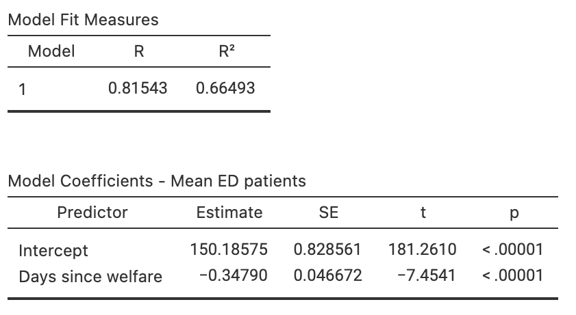

# Regression {#Regression}


```{r echo=FALSE}
RD <- structure(list(Age = c(4.4, 4.4, 4.4, 4.4, 4.4, 4.4, 4.4, 4.8, 
4.8, 5.4, 5.4, 5.4, 5.4, 5.4, 5.4, 5.4, 5.4, 5.4, 5.4, 5.4, 5.4, 
5.8, 6.4, 6.4, 6.4, 6.4, 6.4, 6.4, 6.4, 6.4, 6.4, 6.4, 6.4, 7.4, 
7.4, 7.4, 7.4, 7.4, 7.4, 7.4, 7.4, 7.8, 7.8, 8.4, 8.4, 8.4, 8.4, 
8.4, 8.4, 8.4, 8.4, 8.4, 8.4, 8.4, 8.4, 8.4, 9.4, 9.4, 9.4, 9.4, 
9.4, 9.4, 9.4, 9.4, 9.4, 9.4, 9.4, 9.8, 10.4, 10.4, 10.4, 10.4, 
11.4, 12.4, 12.8, 13.4, 13.4, 14.4), Weight = c(2.42, 4.45, 5.24, 
3.19, 3.9, 3.26, 3.07, 4.48, 3.18, 3.36, 3.61, 3.71, 3.57, 3.33, 
2.72, 3.64, 2.61, 3.89, 3.3, 2.62, 3.1, 4.03, 3.36, 3.19, 3.32, 
2.78, 3.38, 3.07, 3.22, 3.05, 3.79, 3.15, 2.69, 3.92, 3.07, 2.54, 
3.82, 3.1, 3.56, 2.6, 3.56, 3.8, 3.49, 3.25, 1.84, 2.41, 2.86, 
2.88, 2.35, 2.94, 2.99, 2.76, 2.4, 2.67, 2.97, 2.61, 1.89, 1.8, 
2.62, 1.92, 3.75, 4.6, 2.31, 2.26, 3.48, 2.86, 2.38, 2.82, 1.09, 
2.69, 2.48, 2.72, 2.1, 2.72, 1.71, 2.14, 2.76, 1.57)), .Names = c("Age", 
"Weight"), class = "data.frame", row.names = c(NA, -78L))
```


::: {.objectivesBox .objectives data-latex="{iconmonstr-target-4-240.png}"}
So far, you have learnt to
ask a RQ, 
identify different ways of obtaining data,
design the study,
collect the data
describe the data,
summarise data graphically and numerically,
understand the tools of inference,
to form *confidence intervals*,
and
to perform *hypothesis tests*.

**In this chapter**,
you will learn about *regression*.
You will learn to:

* produce and interpret linear regression equations.
* conduct hypothesis tests for the slope in a regression line.
* produce confidence intervals for the slope in a regression line.
:::


```{r echo=FALSE, fig.cap="", fig.align="center", fig.width=3, out.width="35%"}
SixSteps(5, "Regression")
```


## Introduction {#Chap35-Intro}

In the last chapter, *correlation* was studied, which measures the *strength* of the *linear* relationship between two quantitative variables $x$ and $y$.
We now study **regression**, which describes *what* the linear relationship is between $x$ and $y$.

The relationship is described using an *equation*, which allows us to:

1. **Predict** values of $y$ from given values of $x$ (Sect. \@ref(RegressionForPrediction)); and
2. **Understand** the relationship between $x$ and $y$ (Sect. \@ref(RegressionForUnderstanding)).


## Linear equations: A review

An *example* of a regression equation is

\[
  \hat{y} = -4  + 2x.
\]
Here, $x$ refers to the value of the explanatory variable, $y$ refers to the value of the *observed* response variable, and $\hat{y}$ refers to the *predicted* value of the response variable.

In general, the equation of a straight line is written as

\[
   \hat{y} = {b_0} + {b_1} x
\]
where $b_0$ and $b_1$ are just numbers.
Again, $\hat{y}$ refers to the *predicted* (not observed) values of $y$.


:::: {.pronounceBox .pronounce data-latex="{iconmonstr-microphone-7-240.png}"}
$\hat{y}$ is pronounced as 'why hat';
the 'caret' above the $y$ is called a 'hat', and designates a *predicted* value (of $y$).
:::


::: {.example #RegressionEquations name="Regression equations"}
In the regression equation $\hat{y} = 15  - 102x$, we have $b_0=15$ and $b_1 = -102$.
:::


::: {.thinkBox .think data-latex="{iconmonstr-light-bulb-2-240.png}"}
Consider the regression equation $\hat{y} = -0.0047x + 2.1$.

What are the values of $b_0$ and $b_1$?
(Look carefully!)

`r if (knitr::is_latex_output()) '<!--'`
`r webexercises::hide()`
In this case, $b_0 = 2.1$ and $b_1 = -0.0047$.

Remember that $b_1$ is the number multiplied by the $x$, and that $b_0$ is the number by itself.

Some software and some journal papers write regression equations with the value of $b_0$ first, and some with the value of $b_1$ first. It's not the *order* that's important.
`r webexercises::unhide()`
:::
`r if (knitr::is_latex_output()) '-->'`


The numbers $b_0$ and $b_1$ are called *regression coefficients*, where

* $b_0$ is a number called the **intercept**.\index{intercept}  
  It is the *predicted* value of $y$ when $x=0$.
* $b_1$ is a number called the **slope**.\index{slope}  
  It is, on average, how much the value of $y$ changes when the value of $x$ increases by 1.

We will use software to find the values of $b_0$ and $b_1$.

However, we can roughly guess the values of the *intercept* by first drawing what looks like a sensible straight line through the data, and determining what that line predicts for the value of $y$ when $x=0$.

A rough guess of the *slope* can be made using the formula

\[
   \text{slope} 
   = \frac{\text{Change in $y$}}{\text{Corresponding change in $x$}}
   = \frac{\text{rise}}{\text{run}}.
\]
That is, a guess of the slope is the *change* in the value of $y$ (the 'rise') divided by the corresponding *change* in the value of $x$ (the 'run').

To demonstrate, consider the scatterplot in Fig. \@ref(fig:ExampleScatter).
I have drawn a sensible line on the graph to capture the relationship (your line may look a bit different).
When $x = 0$, the regression line predicts the value of $y$ is about to be 2, so $b_0$ is approximately 2.

To guess the slope, use the 'rise over run'
`r if (knitr::is_latex_output()) {
   'idea; see Fig. \\@ref(fig:RiseRun) (the online version has an animation).'
} else {
   'idea. The animation below may help explain the *rise-over-run* idea.'
}`
When the value of $x$ increases from 1 to 5 (a change of $5 - 1 = 4$), the corresponding values of $y$ change from 5 to 17 (a change of $17 - 5 = 12$).
Then, use the formula:

\begin{align*}
   \frac{\text{rise}}{\text{run}} 
   &= \frac{17 - 5}{5 - 1}\\
   &= \frac{12}{4} = 3.
\end{align*}
The value of $b_1$ is about $3$.
The regression line is approximately $\hat{y} = 2 + (3\times x)$, usually written as

\[
  \hat{y} = 2+3x.
\]


::: {.tipBox .tip data-latex="{iconmonstr-info-6-240.png}"}
The *intercept* has the same measurement units as the response variable.
For example, with the red-deer data the intercept is measured in 'grams', the measurement units of the molar weight.

The measurement unit for the *slope*  is the 'measurement units of the response variable', per 'measurement units of the explanatory variable'.
For example, with the red-deer data the slope has the units of 'grams per year'.
:::

   
```{r ExampleScatter, echo=FALSE, fig.cap="An example scatterplot", fig.align="center", fig.width=5, fig.height=4}
set.seed(5000)
x <- seq(0.5, 5, 
        length = 10)
mu <- 2 + 3 * x
y <- mu + rnorm(length(x), 0, 0.4)
m1 <- lm(y ~ x);
plot(y ~ x, 
     xlim = c(0, 5), 
     ylim = c(0, 20), 
     las = 1, 
     xlab = expression(paste("Explanatory, ", italic(x)) ), 
     ylab = expression(paste("Response, ", italic(y)) ), 
     pch = 19)
grid()

abline( coef(m1), 
        col = "grey",
        lwd = 2)
```


```{r AnimateRiseRun, echo=FALSE, animation.hook="gifski", cache=FALSE, interval=0.75, dev=if (is_latex_output()){"pdf"}else{"png"}}
if (knitr::is_html_output()){
  NumPlots <- 9

  set.seed(5000)

  x <- seq(0.5, 5, 
           length = 10)
  b0 <- 2
  b1 <- 3
    
  mu <- b0 + b1 * x
  y <- mu + rnorm(length(x), 0, 0.4)

  x1 <- 1
  x2 <- 5
  y1 <- b0 + (b1 * x1) 
  y2 <- b0 + (b1 * x2)
    

  for (i in (1:NumPlots)){
    par( mar = c(5, 4, 4, 2) + 0.1)
    # DATA
    
    plot(y ~ x, 
         xlim = c(0, 5), 
         ylim = c(0, 20), 
         type = "n",
         las = 1, 
         xlab = expression(paste("Explanatory, ", italic(x)) ), 
         ylab = expression(paste("Response, ", italic(y)) ), 
         pch = 19)
    rug(1:20, 
        side = 2, 
        ticksize = -0.02)
    grid()
    points(y ~ x, 
           pch = 19) 
    
    if ( i >=2 ){ # DATA + LINE
      abline(b0, b1,
             col = "red", 
             lwd = 2)
    }
    if (i >= 3) { # DATA + LINE + x1 
      lines( c(x1, x1), 
             c(0, y1),
             lwd = 2, 
             col = "darkgrey",
             lty = 2)
    }
    
    if ( i >= 4){  # DATA + LINE + x1 + y1
      lines( c(0, x1), 
             c(y1, y1),
             lwd = 2, 
             col = "darkgrey",
             lty = 2)
    }
    
    if ( i >= 5 ){  # DATA + LINE + x1 + y1 + x2
      lines( c(x2, x2), 
             c(0, y2),
             lwd = 2, 
             col = "darkgrey",
             lty = 2)
    }
    
    if ( i >= 6) {  # DATA + LINE + x1 + y1 + x2 + y2
      lines( c(0, x2), 
             c(y2, y2),
             lwd = 2, 
             col = "darkgrey",
             lty = 2)
    }
    
    if (i >= 7 ) {  # DATA + LINE + x1 + y1 + x2 + y2 + RUN
      arrows(x1, 2, 
             x2, 2,
             lwd = 2,
             col = "darkgrey",
             code = 3)
      text( mean( c(x1, x2)), 2, 
            paste("Run: ", x2," - ", x1, " = ", x2 - x1, sep = ""), 
            pos = 3 )  
    }
    
    if (i >= 8 ){ # DATA + LINE + x1 + y1 + x2 + y2 + RUN + RISE
      arrows(0.5, y1, 
             0.5, y2,
             lwd = 2,
             col = "darkgrey",
             code = 3)
      text( 0.5, 
            mean( c(y1, y2)), 
            paste("Rise: ", y2," - ", y1, " = ", y2 - y1, sep = ""), 
            pos = 4 )  
    }
    
    
    if (i >= 9 ) {  # DATA + LINE + x1 + y1 + x2 + y2 + RUN + RISE + SLOPE
      polygon( c(2.15, 2.15, 4.85, 4.85), 
               c(6, 8, 8, 6), 
               border = NA, # No border
               col = "antiquewhite1")
      text(3.5, 
           7, 
           paste("Slope = Rise/Run = ", y2 - y1,"/", x2 - x1, " = ", (y2 - y1)/(x2 - x1)) )
    }
  }
}
```


```{r RiseRun, echo=FALSE, fig.align="center", fig.width=5, fig.cap="Making a guess of the slope, using rise-over-run" }
if (knitr::is_latex_output()){
    set.seed(5000)
  x <- seq(0.5, 5, 
           length = 10)
  mu <- 2 + 3*x
  y <- mu + rnorm(length(x), 0, 0.4)

  b0 <- 2
  b1 <- 3
  
  x1 <- 1
  x2 <- 5
  y1 <- b0 + (b1 * x1) 
  y2 <- b0 + (b1 * x2)
  
  NumPlots <- 9
  for (i in (NumPlots:NumPlots)){
    
    # DATA
    plot(y ~ x, 
         xlim = c(0, 5), 
         ylim = c(0, 20), 
         type = "n",
         las = 1, 
         xlab = expression(paste("Explanatory, ", italic(x)) ), 
         ylab = expression(paste("Response, ", italic(y)) ), 
         pch = 19)
    rug(1:20, 
        side = 2, 
        ticksize = -0.02)
    grid()
    
    points(y ~ x, 
           pch = 19) 
    
    if ( i >=2 ){ # DATA + LINE
      abline(b0, b1,
             col = "red", 
             lwd = 2)
    }
    if (i >= 3) { # DATA + LINE + x1 
      lines( c(x1, x1), 
             c(0, y1),
             lwd = 2, 
             col = "darkgrey",
             lty = 2)
    }
    
    if ( i >= 4){  # DATA + LINE + x1 + y1
      lines( c(0, x1), 
             c(y1, y1),
             lwd = 2, 
             col = "darkgrey",
             lty = 2)
    }
    
    if ( i >= 5 ){  # DATA + LINE + x1 + y1 + x2
      lines( c(x2, x2), 
             c(0, y2),
             lwd = 2, 
             col = "darkgrey",
             lty = 2)
    }
    
    if ( i >= 6) {  # DATA + LINE + x1 + y1 + x2 + y2
      lines( c(0, x2), 
             c(y2, y2),
             lwd = 2, 
             col = "darkgrey",
             lty = 2)
    }
    
    if (i >= 7 ) {  # DATA + LINE + x1 + y1 + x2 + y2 + RUN
      arrows(x1, 2, 
             x2, 2,
             lwd = 2,
             col = "darkgrey",
             code = 3)
      text( mean( c(x1, x2)), 
            2, 
            paste("Run: ", x2," - ", x1, " = ", x2 - x1, sep = ""), 
            pos = 3 )  
    }
    
    if (i >= 8 ){ # DATA + LINE + x1 + y1 + x2 + y2 + RUN + RISE
      arrows(0.5, y1, 
             0.5, y2,
             lwd = 2,
             col = "darkgrey",
             code = 3)
      text( 0.5, 
            mean( c(y1, y2)), 
            paste("Rise: ", y2," - ", y1, " = ", y2 - y1, sep = ""), 
            pos = 4 )  
    }
    
    
    if (i >= 9 ) {  # DATA + LINE + x1 + y1 + x2 + y2 + RUN + RISE + SLOPE
      polygon( c(2.15, 2.15, 4.85, 4.85), 
               c(6, 8, 8, 6), 
               border = NA, # No border
               col = "antiquewhite1")
      text(3.5, 7, 
           paste("Slope = Rise/Run = ", y2 - y1,"/", x2 - x1, " = ", (y2 - y1)/(x2 - x1)) )
    }
  }
}
```


`r if (knitr::is_html_output()){
  'You may like to play with the following interactive activity, which explores slopes and intercepts.'}`

<iframe src="https://phet.colorado.edu/sims/html/graphing-slope-intercept/latest/graphing-slope-intercept_en.html" width="600" height="450" scrolling="no" allowfullscreen="allowfullscreen"></iframe>


::: {.example #CycloneRegressionGuesses name="Estimating regression parameters"}
A study [@mypapers:dunnsmyth:glms] examined the relationship between the number of cyclones $y$ in the Australian region each year from 1969 to 2005, and a climatological index called the [*Ocean Nino Index* (ONI, $x$)](https://www.britannica.com/science/Oceanic-Nino-Index); see (Fig. \@ref(fig:ONIcyclones)),

When the value of $x$ is zero, the predicted value of $y$ is about 12; $b_0$ is about 12.
(You may get something slightly different.)

Notice that the intercept is the *predicted* value of $y$ when $x=0$, which is *not* at the left of the graph.

To guess the value of $b_1$, use the 'rise over run' idea.
When $x$ is about $-2$, the predicted value of $y$ is about 17.
When $x$ is about $2$, the predicted value of $y$ is about 8.

So when the value of $x$ changes by $2 - (-2) = 4$,  the value of $y$ changes by $8 - 17 = -9$ (a *decrease* of about 9).
Hence, the value of $b_1$ is approximately $-9/4 = -2.25$.
(You may get something slightly different.)
Notice that the relationship has a *negative* direction, so the slope must be negative.

Using these guesses of $b_0 = 12$ and $b_1 = -2.25$, the regression line is approximately
\[
  \hat{y} = 12 - 2.25x.
\]
:::

```{r ONIcyclones, echo=FALSE, fig.width=4, fig.align="center", fig.cap="The number of cyclones in the Australian region each year from 1969 to 2005, and the ONI for October, November, December", fig.width=5, fig.height=4}

cyclones <- structure(list(Year = 1969:2005, Severe = c(3L, 3L, 9L, 6L, 4L, 
3L, 4L, 4L, 4L, 4L, 8L, 7L, 4L, 4L, 8L, 11L, 8L, 3L, 3L, 6L, 
4L, 6L, 9L, 4L, 7L, 6L, 9L, 5L, 4L, 9L, 6L, 3L, 3L, 3L, 5L, 5L, 
8L), NonSevere = c(7L, 14L, 7L, 6L, 15L, 13L, 12L, 9L, 5L, 7L, 
6L, 7L, 11L, 3L, 12L, 6L, 7L, 4L, 2L, 7L, 9L, 4L, 1L, 3L, 4L, 
0L, 4L, 10L, 6L, 5L, 6L, 5L, 7L, 4L, 5L, 5L, 4L), Total = c(10L, 
17L, 16L, 12L, 19L, 16L, 16L, 13L, 9L, 11L, 14L, 14L, 15L, 7L, 
20L, 17L, 15L, 7L, 5L, 13L, 13L, 10L, 10L, 7L, 11L, 6L, 13L, 
15L, 10L, 14L, 12L, 8L, 10L, 7L, 10L, 10L, 12L), JFM = c(1, 0.3, 
-1.3, -0.4, 1.2, -1.7, -0.6, -1.2, 0.5, 0.4, 0, 0.3, -0.5, 0.1, 
2, -0.2, -0.8, -0.4, 1.3, 0.5, -1.5, 0.2, 0.3, 1.6, 0.4, 0.2, 
0.9, -0.7, -0.3, 1.9, -1.2, -1.4, -0.5, 0.1, 0.9, 0.3, 0.5), 
    AMJ = c(0.6, 0, -0.8, 0.5, -0.6, -0.9, -0.9, -0.5, 0.2, -0.4, 
    0.1, 0.3, -0.3, 0.6, 1, -0.5, -0.7, -0.1, 1, -0.7, -0.6, 
    0.2, 0.6, 1.2, 0.8, 0.5, 0.3, -0.1, 0.8, 0.5, -0.8, -0.6, 
    -0.1, 0.7, -0.1, 0.3, 0.4), JAS = c(0.4, -0.8, -0.8, 1.3, 
    -1.3, -0.5, -1.3, 0.3, 0.4, -0.4, 0.1, 0, -0.4, 1, -0.2, 
    -0.2, -0.5, 0.5, 1.6, -1.2, -0.3, 0.3, 0.9, 0.2, 0.4, 0.6, 
    -0.2, -0.1, 2, -0.8, -0.9, -0.4, 0.2, 1, 0.5, 0.8, 0.3), 
    OND = c(0.8, -0.9, -1, 2, -2, -0.9, -1.7, 0.8, 0.7, -0.2, 
    0.5, 0, -0.1, 2.2, -0.9, -0.9, -0.3, 1.1, 1.3, -1.9, -0.2, 
    0.3, 1.4, 0, 0.3, 1.2, -0.7, -0.3, 2.5, -1.3, -1.3, -0.6, 
    -0.1, 1.5, 0.6, 0.8, -0.4)), class = "data.frame", row.names = c(NA, 
-37L))

plot(Total ~ OND, 
     data = cyclones,
     xlim = c(-2, 3),
     ylim = c(0, 20),
     pch = 19,
     ylab = "Total number of cyclones",
     xlab = "ONI averaged over Oct., Nov., Dec.",
     las = 1)

clm <- lm( Total ~ OND, 
           data = cyclones)
abline( coef(clm), 
        lwd = 1, 
        col = "grey")
grid(lty = 2)
```


In this section, we have seen how to understand a linear regression equation, and how an equation can be used to describe a fitted line.
The above method gives a very crude guess of the values of the intercept $b_0$ and the slope $b_1$.

In practice, *many* reasonable lines could be drawn through a scatterplot of data.
However, one of those lines is the 'best fitting line' in some sense^[For those who want to know: The 'line of best fit' is the line such that 
the sum of the *squared* vertical distances between the observations and the line is as small as possible.].
Software calculates this 'line of best fit' for us.


<iframe src="https://learningapps.org/watch?v=p84zyy2ot22" style="border:0px;width:100%;height:500px" allowfullscreen="true" webkitallowfullscreen="true" mozallowfullscreen="true"></iframe>


## Regression using software {#Regression-Software}


```{r echo=FALSE}
RD.lm <- lm(Weight ~ Age, 
            data = RD)
RD.b0 <- round( coef(RD.lm)[1], 3)
RD.b1 <- round( coef(RD.lm)[2], 3)
```


In the population, the intercept is denoted by $\beta_0$ and the slope is denoted by $\beta_1$.
These population values are unknown, and are estimated by the statistics $b_0$ and $b_1$ respectively.


:::: {.pronounceBox .pronounce data-latex="{iconmonstr-microphone-7-240.png}"}

::: {style="display: flex;"}
The symbol $\beta$ is the Greek letter 'beta', pronounced 'beater' (as in 'egg beater').  
So $\beta_0$ might be said as 'beater-zero', and $\beta_1$ as 'beater-one'.
:::

::: {}
```{r, echo=FALSE}
htmltools::tags$video(src = "./Movies/beta.mp4", 
                      width = "121", 
                      loop = "FALSE", 
                      controls = "controls", 
                      loop = "loop", 
                      style = "padding:5px; border: 2px solid gray;")
```
:::

::::


<div style="float:right; width: 222x; border: 1px; padding:10px">

</div>


`r if (knitr::is_html_output()) '<!--'`
\begin{wrapfigure}{R}{.20\textwidth}
  \begin{center}
    \includegraphics[width=.15\textwidth]{Illustrations/diana-parkhouse-Qf4eZXC3t2Y-unsplash.jpg}
  \end{center}
\end{wrapfigure}
`r if (knitr::is_html_output()) '-->'`


The formulas for computing $b_0$ and $b_1$ are ugly, so we will use software to do the calculations. 
As usual, the values of these population parameters are unknown, and the values of the sample statistics will change from sample to sample (so they have *sampling variation*).

For the red deer data again (Fig&nbsp;\@ref(fig:RedDeerScatter)), part of the relevant output is shown in 
Fig.&nbsp;\@ref(fig:RedDeerRegressionjamoviraw) (using jamovi) and
Fig.&nbsp;\@ref(fig:RedDeerRegressionSPSSraw) (using SPSS).

From the output, the *slope* $b_1$ in the sample is $b_1 = `r RD.b1`$, and the $y$-intercept $b_0$ in the sample is $b_0 = `r RD.b0`$.
That is, the values of $b_0$ and $b_1$ are in the column labelled  `Estimate` in jamovi, or the column labelled `B` in SPSS.
These are the values of the two *regression coefficients*;
then

\[
	\hat{y} = `r RD.b0` + (`r RD.b1`\times x),
\]
which is usually written more simply as

\[
	\hat{y} = `r RD.b0` - `r abs(RD.b1)` x.
\]         


::: {.tipBox .tip data-latex="{iconmonstr-info-6-240.png}"}
The *sign* of the slope $b_1$ and the correlation coefficient $r$ are always the same.

For example, if the slope is negative, the correlation coefficient will also be negative.
:::


```{r RedDeerRegressionjamoviraw, echo=FALSE, fig.cap="jamovi output for the red-deer data", fig.align="center", out.width="55%"}

```


```{r RedDeerRegressionSPSSraw, echo=FALSE, fig.cap="SPSS output for the red-deer data", fig.align="center", out.width="80%"}
knitr::include_graphics( "SPSS/RedDeer/RedDeer-Regression.png")
```


```{r echo=FALSE}
cyclone.lm <- lm(Total ~ OND, 
                 data = cyclones)
```

::: {.example #RegressionCoefficients name="Regression coefficients"}
The regression equation for the cyclone data (Fig. \@ref(fig:ONIcyclones)) can be found from the jamovi output (Fig. \@ref(fig:CyclonesRegressionjamovi)):
\[
  \hat{y} = 12.14 - 2.23x,
\]
where $x$ is the ONI (averaged over October, November, December)  and $y$ is the number of cyclones.
These values are close the guesses made in Example \@ref(exm:CycloneRegressionGuesses).
:::


```{r CyclonesRegressionjamovi, echo=FALSE, fig.cap="jamovi output for the cyclone data", fig.align="center", out.width="60%"}
knitr::include_graphics( "jamovi/Cyclones/Cyclones-Regression.png")
```


`r if (knitr::is_html_output()){
  'You may like to play with the following interactive activity, which explores regression equations.'}`

<div style="text-align:center;">
<iframe src="https://phet.colorado.edu/sims/html/least-squares-regression/latest/least-squares-regression_en.html" width="600" height="450" scrolling="no" allowfullscreen="true"></iframe>
</div>


## Regression for predictions {#RegressionForPrediction}


<div style="float:right; width: 222x; border: 1px; padding:10px">

</div>


The regression equation for the red deer data

\[
	\hat{y} = `r RD.b0` - `r abs(RD.b1)` x
\]
can be used to make *predictions*.\index{predictions}
For example, we could predict the *average* molar weight for deer $10$ years old.
Since $x$ represents the age, use $x = 10$ in the regression equation:

\begin{eqnarray*}
         \hat{y} 
         &=& `r RD.b0` - (`r abs(RD.b1)`\times 10)\\
         &=& `r RD.b0` - `r abs(RD.b1 * 10)`\\
         &=& `r RD.b0 + RD.b1*10`.
\end{eqnarray*}
Male red deer aged 10 years old are predicted to have a *mean* molar weight of `r  RD.b0 + RD.b1*10` grams.

Some individual male red deer aged 10 will have molars weighing *more* than this, and some will have molars weighing *less* than this.
The model predicts that the *mean* molar weight for male red deer aged 10 will be about `r RD.b0 + RD.b1*10` grams.


::: {.thinkBox .think data-latex="{iconmonstr-light-bulb-2-240.png}"}
For male red deer $12$ years of age, what is the predicted mean molar weight?

`r if (knitr::is_latex_output()) '<!--'`
`r webexercises::hide()`
Prediction: $4.398 - (0.181 \times 12) = 2.226$, or about 2.23 grams.
`r webexercises::unhide()`
`r if (knitr::is_latex_output()) '-->'`
:::


::: {.thinkBox .think data-latex="{iconmonstr-light-bulb-2-240.png}"}
For male red deer $20$ years of age, what is the predicted mean molar weight?

`r if (knitr::is_latex_output()) '<!--'`
`r webexercises::hide()`
Prediction: $4.398 - (0.181 \times 20) = 0.778$, or about 0.78 grams.
`r webexercises::unhide()`
`r if (knitr::is_latex_output()) '-->'`
:::


This last prediction *may* be a useful prediction...but it also may be rubbish.
The oldest deer in the data is aged 14.4 years, so the regression line may not even apply for deer aged over 14.4 years of age (red deer may not even live to 20 years of age).
The prediction *may* be sensible... but it *may not* be either.

We don't know whether the prediction is sensible or not, because we have no data for deer aged over 14.4 years to inform us.
Making prediction outside the range of the available data is called *extrapolation*,\index{extrapolation}
and *extrapolation* beyond the data can lead to nonsense predictions.


::: {.definition #Extrapolation name="Extrapolation"}
*Extrapolation* refers to making predictions outside the range of the available data.
Extrapolation beyond the data can lead to nonsense predictions.
:::


::: {.importantBox .important data-latex="{iconmonstr-warning-8-240.png}"}
*Extrapolating* can lead to nonsense predictions.
:::


## Regression for understanding {#RegressionForUnderstanding}

The regression equation can be used to *understand* the relationship between the two variables.
Consider again the red deer regression equation:

\begin{equation}
   \hat{y}
   = 
   `r RD.b0` 
   - 
    `r abs(RD.b1)` x.
(\#eq:RedDeerEquation)
\end{equation}
What does it tell us about the relationship between $x$ and $y$?


### The meaning of $b_0$

$b_0$ is the *predicted* value of $y$ when $x=0$.
Equation \@ref(eq:RedDeerEquation) predicts a molar weight of $`r RD.b0`$ for a deer zero years of age, which is likely to be nonsense: it is *extrapolating*\index{extrapolation}
beyond the data (the youngest deer in the sample is aged 4.4 years).


::: {.tipBox .tip data-latex="{iconmonstr-info-6-240.png}"}
The value of the intercept $b_0$ is sometimes meaningful, but is often meaningless.

The value of the slope $b_1$ is usually of greater interest, as it explains the *relationship* between the two variables.
:::


### The meaning of $b_1$ {#SlopeMeaning}

$b_1$ tells us how much the value of $y$ changes (on average) when the value of $x$ *increase* by one.

For the red-deer data, $b_1$ tells us how much the molar weight changes (on average) when age increases by one year.

Each extra year of age is associated with a change of $`r RD.b1`$ grams in molar weight; that is, a *decrease* in molar weight by a mean of $`r abs(RD.b1)`$.
The molars of some individual deer will lose more weight than this in some years, and some will lose less weight than this in some years... the value is a *mean* weight loss per year.

To demonstrate, for $x = 10$, $y$ is predicted to be $\hat{y}= `r RD.b0 + 10 * RD.b1`$.
For deer one year older than this (i.e.\ $x=11$) we predict $y$ to be $b_1 = `r RD.b1`$ higher (or, equivalently, 0.181 *lower*).
That is, we would predict $\hat{y}= `r RD.b0 + 10*RD.b1`  - `r abs(RD.b1)` = `r RD.b0 + 11*RD.b1`$.
(This is the same prediction made by using $x = 11$ in Eq. \@ref(eq:RedDeerEquation).)


::: {.tipBox .tip data-latex="{iconmonstr-info-6-240.png}"}
If the value of $b_1$ is *positive*, then the predicted values of $y$ *increase* as the values of $x$ *increase*.

If the value of $b_1$ is *negative*, then the predicted values of $y$ *decrease* as the values of $x$ *increase*.
:::


This interpretation of $b_1$ explains the relationship:
Each extra year of age reduces the weight of the molars by 0.181 grams, on average, in male red deer.

The units of measurement of the slope are the units of the response variable  divided by the units of the explanatory variable (so in the deer example, the slope is $`r RD.b1`$ grams per year).

Observe what happens if the slope is *zero*.
Since $b_1$ is the change in $y$ (on average) when $x$ increase by one, $b_1 = 0$ means that the value of $y$ changes by *zero* if the value of $x$ changes by one.

In other words, if the value of $x$ changes, the predicted value of $y$ doesn't change.
This is equivalent to saying that there is *no relationship* between the variables.
(We would also find $r = 0$.)


::: {.importantBox .important data-latex="{iconmonstr-warning-8-240.png}"}
If the value of the slope is zero, there is *no linear relationship* between $x$ and $y$.

In this case, the correlation coefficient is also zero.
:::


## Hypothesis testing {#RegressionHT}

### Introduction {#RegressionTests-Intro}

The regression line is computed from the *sample*, assuming a linear relationship actually exists in the *population*.
The (unknown) regression line in the *population* is

\[
	\hat{y} = {\beta_0} + {\beta_1} x.
\]
From the *sample*, the *estimate* of the *population* regression line (Appendix \@ref(StatisticsAndParameters)) is

\[
	\hat{y} = {b_0} + {b_1} x.
\]
That is, the intercept in the population is $\beta_0$ (estimated by $b_0$), and the slope in the population is $\beta_1$ (estimated by $b_1$).

The *sample* can be used to ask questions about the *population* regression coefficients.
As usual, the sample values can vary from sample to sample (and so have a *sampling distribution*).

Usually questions are asked about the *slope*, because the slope explains the  *relationship* between the two variables (Sect. \@ref(RegressionForUnderstanding)).


### Hypotheses: Assumption

The null hypothesis is the usual 'no relationship' hypothesis.
In this context, 'no relationship' means that the slope is zero (Sect. \@ref(SlopeMeaning)).
Hence, the null hypotheses (about the *population*) is:

* $H_0$: $\beta_1 = 0$.

This hypothesis proposes that $b_1$ is not zero because of sampling variation.
As part of the [decision-making process](#DecisionMaking), the null hypothesis is initially **assumed** to be true.

For the red deer data (Sect. \@ref(RedDeerData)), determining if a relationship exists between the age of the deer and the weight of their molars, would test these hypotheses:

* $H_0$: $\beta_1 = 0$;
* $H_1$: $\beta_1 \ne 0$

The parameter is $\beta_1$, the population slope for the regression equation predicting molar weight from age.

The alternative hypothesis is two-tailed, based on the RQ.


```{r echo=FALSE}
RD.fitinfo <- summary(RD.lm)$coefficients
RD.t <- RD.fitinfo[, "t value"]
RD.P <- RD.fitinfo[, "Pr(>|t|)"]
```


### Sampling distribution: Expectation {#sampling-distribution-expectation-slope}

**Assuming** the null hypothesis is true (that $\beta_1 = 0$), we can describe what values the sample slope $b_1$ are **expected** to take, through *sampling variation*.

The variation in the sample slope from sample to sample can be described (Fig. \@ref(fig:RedDeerSlopeSampDist)) using:

* an approximate normal distribution,
* with a mean of $\beta_1 = 0$ (from $H_0$), and 
* a standard deviation, called the *standard error of the slope*, of $\text{s.e.}(b_1)$.

The standard error is found using software (jamovi: Fig. \@ref(fig:RedDeerRegressionjamovi); SPSS: Fig. \@ref(fig:RedDeerRegressionSPSS)).


```{r RedDeerSlopeSampDist, echo=FALSE, fig.cap="The distribution of sample slope for the red deer data, if the population slope is 0", fig.align="center", fig.height=3.5, fig.width=5}
mn <- 0
se <- 0.0289

plot.norm( mn, 
           se, 
          width = 7,
          height = 5,
          xlab.name = "Sample slopes",  
          type = "",
          shade.hi.z = 0,
          shade.lo.z = 0,
          srt = 0,
          cex.tickmarks = 0.8,
          round.dec = 4)

lines(c(-1, -1), 
      c(0, 100), 
      col = "gray")
lines(c(1, 1), 
      c(0, 100), 
      col = "gray")
lines(c(-2, -2), 
      c(0, 100), 
      col = "gray")
lines(c(2, 2), 
      c(0, 100), 
      col = "gray")
lines(c(-3, -3), 
      c(0, 100), 
      col = "gray")
lines(c(3, 3), 
      c(0, 100), 
      col = "gray")
```


### The test statistic: Observation

The **observed** sample slope was $b_1 = -0.181$.
The *test statistic* would be found using the usual approach:

\begin{align*}
   t &= \frac{ b_1 - \beta_1}{\text{s.e.}(b_1)} \\
     &= \frac{-0.181 - 0}{0.0289} = -6.27,
\end{align*}
where the values of $b_1$ and $\text{s.e.}(b_1)$ are taken from the software output.
The $t$-score is also reported by the software.


### $P$-value: Consistency with assumption

To determine if the statistic is **consistent** with the null hypothesis, the $P$-value can be approximated using the [68--95--99.7 rule](#def:EmpiricalRule), or taken from software output (jamovi: Fig. \@ref(fig:RedDeerRegressionjamovi); SPSS: Fig. \@ref(fig:RedDeerRegressionSPSS)).

Using software, the $P$-value is $P < 0.001$.

We write:

> The sample presents very strong evidence ($t = -6.27$; one-tailed $P < 0.001$) that the slope in the population between age of the deer and molar weight is not zero (slope: $-0.181$).


```{r RedDeerRegressionjamovi, echo=FALSE, fig.cap="jamovi output for the red-deer data", fig.align="center", out.width="60%"}

```


```{r RedDeerRegressionSPSS, echo=FALSE, fig.cap="SPSS output for the red-deer data", fig.align="center", out.width="80%"}
knitr::include_graphics( "SPSS/RedDeer/RedDeer-Regression.png")
```


```{r echo=FALSE}
EDpatients <- structure(list(Days = 1:30, ED = c(153, 146.8, 148.3, 150, 148.3, 
145.5, 150.7, 146.1, 148.3, 144.8, 145.9, 146.8, 145.5, 150, 
139.3, 144.1, 143.2, 144.1, 142.5, 144.5, 144.8, 141.8, 143.6, 
143.2, 141.1, 142.5, 142.7, 142.5, 136.6, 137.3)), class = "data.frame", row.names = c(NA, 
-30L))
```


::: {.example #EDpatientsRegression name="Emergency department patients"}
A study examined the relationship between the number of emergency department (ED) patients and the number of days following the distribution of monthly welfare monies [@brunette1991correlation] from 1986 to 1988 in Minneapolis, USA.

The data (extracted from Fig. 2 of @brunette1991correlation) is plotted in Fig. \@ref(fig:EDScatter), and the jamovi analysis shown in Fig. \@ref(fig:EDRegressionjamovi).

The regression line is estimated as 

\[
  \hat{y} = 150.19 - 0.348x, 
\]
where $y$ represents the mean number of ED patients, and $x$ the number of days since welfare distribution.

This regression equation suggests that each extra day after welfare distribution is associated with a *decrease* in the number of ED patients of about 0.35.
It may be easier to understand this way: 

> Each 10 extra days after welfare distribution is associated with a *decrease* in the number of ED patients of about $10\times 0.35 = 3.5$.

The scatterplot and the regression equation suggests a negative relationship between the number of ED patients and the days after distribution.
However, we know that every sample is likely to be different, so the relationship may not actually be present in the population. So we test these hypotheses:
  
* $H_0$: $\beta_1 = 0$ where $\beta_1$ is the *population* slope
* $H_1$: $\beta_1 \ne 0$ (i.e., two-tailed, based on the authors' aim)

The output shows that the test statistic is $t = -7.45$, which is very large; unsurprisingly, the two-tailed $P$-value is very small: $P < 0.001$.

We write:

> There is very strong evidence ($t = -7.45$; two-tailed $P < 0.001$) of a relationship between the mean number of ED patients and the
> number of days after welfare distribution (slope: $-0.348$).
:::


```{r EDScatter, echo=FALSE, fig.align = "center", fig.cap = "Scatterplot of the number of emergency department patients, and the number of days since distribution of welfare ", fig.width=5, fig.height=4}

plot( ED ~ Days,
      data = EDpatients,
      xlab = "Days after distribution",
      ylab = "Mean number of ED patients",
      main = "Mean number of ED patients vs \ndays after distribution of welfare",
      pch = 19,
      las = 1,
      xlim = c(0, 30),
      ylim = c(135, 155) )
```


```{r EDRegressionjamovi, echo=FALSE, fig.cap="jamovi output for the emergency department data", fig.align="center", out.width="60%"}

```


<iframe src="https://learningapps.org/watch?v=phxny7fec22" style="border:0px;width:100%;height:500px" allowfullscreen="true" webkitallowfullscreen="true" mozallowfullscreen="true"></iframe>


## Confidence intervals {#RegressionCI}

Reporting the CI for the slope is also useful, which can be obtained from software or computed manually.


::: {.thinkBox .think data-latex="{iconmonstr-light-bulb-2-240.png}"}
Using the output (jamovi: Fig. \@ref(fig:RedDeerRegressionjamovi); SPSS: Fig. \@ref(fig:RedDeerRegressionSPSS)), what is the *approximate* 95% CI for $\beta_1$?	
:::


CIs have the form
\[
  \text{statistic} \pm ( \text{multiplier} \times \text{standard error}),
\]
The multiplier is two for an approximate 95% CI, so (using the standard error reported by the software), we obtain $-0.181 \pm (2\times 0.029)$,
or $-0.181 \pm 0.058$,
or from $-0.239$ to $-0.123$.

Software can be asked to produce *exact* CIs too (jamovi: Fig. \@ref(fig:RedDeerRegressionjamoviCI); SPSS: Fig. \@ref(fig:RedDeerRegressionSPSSCI)).
The *approximate* and *exact* 95% CIs are very similar.


```{r RedDeerRegressionjamoviCI, echo=FALSE, fig.cap="jamovi output for the red-deer data, including the CIs", fig.align="center", out.width="80%"}

```


```{r RedDeerRegressionSPSSCI, echo=FALSE, fig.cap="SPSS output for the red-deer data, including the CIs", fig.align="center", out.width="80%"}
knitr::include_graphics( "SPSS/RedDeer/RedDeer-Regression-CI.png")
```

We write:

> The sample presents very strong evidence ($P < 0.001$; $t = `r round(RD.t[2], 3)`$) of a relationship between age and the weight of molars in male red deer (slope: $`r RD.b1`$; $n= `r length(RD$Age)`$; 95% CI from $-0.239$ to $-0.124$) in the population.


::: {.example #EDpatientsCI name="Emergency department patients"}
In Example \@ref(exm:EDpatientsRegression), the jamovi output does not give the 95% CI for the slope.

However, since CIs have the form
\[
  \text{statistic} \pm ( \text{multiplier} \times \text{standard error}),
\]
the CI is easily computed:
\[
  -0.34790 \pm (2\times 0.046672), 
\]  
or $-0.34790 \pm 0.093344$. 
This is equivalent to $-0.441$ to $-0.255$.

Combining with information from Example \@ref(exm:EDpatientsRegression), we write:

> The > sample presents very strong evidence ($P < 0.001$; $t = -7.45$) of a relationship between the mean number of ED patients and the numbers of days after welfare distribution (slope: $-0.348$; $n = 30$; 95% CI from $-0.441$ to $-0.255$) in the population.
:::


## Statistical validity conditions

As usual, these results hold under 
[certain conditions to be met](#exm:StatisticalValidityAnalogy).
The conditions for which the test is statistically valid are the same as for correlation (Sect. \@ref(ValidityCorrelation)):

1. The relationship is approximately linear.
1. The variation in the response variable is approximately constant for all values of the explanatory variable.
1. The sample size is at least 25.

The sample size of 25 is a rough figure here, and some books give other values.

In addition to the statistical validity condition, the test will be 

* [**internally valid**](#def:InternalValidity) if the study was well designed; and
* [**externally valid**](#def:ExternalValidity) if the sample is a [simple random sample](#SRS) from the population.
  


::: {.example #StatisticalValidityDeerReg name="Statistical validity"}
For the red deer data, the relationship is approximately linear, and the variation in molar weight appears to be somewhat constant for various ages
(Fig. \@ref(fig:RedDeerScatter)), so regression is appropriate.

The sample size is $n = 78$.
The results from the hypothesis test should be statistically valid.
:::


::: {.thinkBox .think data-latex="{iconmonstr-light-bulb-2-240.png}"}
Are the conditions for statistically validity met for the cyclones data (Fig. \@ref(fig:ONIcyclones))?

`r if (knitr::is_latex_output()) '<!--'`
`r webexercises::hide()`
Looking at all three conditions:

* Linearity: The relationship looks approximately linear.
* Variation: The variations seems somewhat constant for all values of $x$ (the ONI), but it is a little hard to be sure.
* Sample size: The sample size is larger than 25.

The conditions for statistical validity appear to have been met.
`r webexercises::unhide()`
`r if (knitr::is_latex_output()) '-->'`
:::


::: {.example #EDpatientsValidity name="Emergency department patients"}
In Example \@ref(exm:EDpatientsRegression), the scatterplot (Fig. \@ref(fig:EDScatter)) shows that the relationship is approximately linear, that the variation in ED patients seems reasonably constant for different numbers of days after distribution, and the sample size is larger than 30.

The test (Example. \@ref(exm:EDpatientsRegression)) and the CI (Example. \@ref(exm:EDpatientsCI)) should be statistically valid.
:::
                    


## Example: Obstructive sleep apnoea {#Apnoea}

```{r echo = FALSE}
OSA <- structure(list(ID = 1:60, Age = c(21L, 24L, 26L, 39L, 21L, 29L, 
20L, 21L, 19L, 27L, 29L, 25L, 20L, 53L, 31L, 22L, 21L, 28L, 19L, 
18L, 18L, 36L, 36L, 38L, 18L, 24L, 21L, 18L, 33L, 19L, 23L, 31L, 
29L, 23L, 35L, 27L, 28L, 20L, 29L, 38L, 22L, 56L, 50L, 24L, 36L, 
44L, 25L, 49L, 18L, 19L, 27L, 31L, 21L, 22L, 20L, 29L, 35L, 22L, 
28L, 32L), Gender = c(1L, 1L, 1L, 2L, 2L, 1L, 1L, 1L, 2L, 1L, 
2L, 1L, 2L, 1L, 1L, 1L, 2L, 2L, 2L, 2L, 1L, 2L, 2L, 1L, 2L, 1L, 
1L, 1L, 1L, 1L, 2L, 1L, 1L, 1L, 2L, 2L, 1L, 1L, 2L, 1L, 2L, 2L, 
2L, 1L, 1L, 2L, 2L, 2L, 1L, 1L, 1L, 1L, 2L, 1L, 2L, 1L, 1L, 2L, 
2L, 2L), BMI = c(20.3, 24.1, 25.2, 40.8, 35, 29.2, 25.8, 20.9, 
20.5, 22.4, 24.4, 20.5, 30.5, 27.3, 32.6, 37.2, 29.9, 36.5, 27.7, 
27.1, 19.5, 36.8, 39.9, 20.3, 28.6, 21.8, 31.9, 29.2, 32, 27, 
25.6, 18.7, 32.5, 24.7, 35.6, 31.1, 24.8, 23.9, 36.8, 34.6, 28, 
29.2, 31.4, 38.3, 26, 34.3, 27, 30.6, 21.6, 37.6, 35.4, 24.2, 
19.3, 27.1, 31.5, 33.8, 31.2, 26, 36.9, 22.1), Neck = c(37, 40.5, 
38, 41, 37, 41, 42, 37, 32, 39, 37.5, 38, 39, 44.5, 46.5, 43, 
34, 37, 34, 36, 39, 41, 37, 38, 38, 36, 40, 41, 46, 42, 40.3, 
38, 47, 38, 36, 36, 44, 43, 40.5, 45, 40, 38, 40, 43, 41, 38, 
40, 40, 38, 48, 46, 39, 35.5, 48, 41, 47, 47, 39, 40, 40), REI = c(46, 
19.3, 12.4, 58.6, 12.7, 38.8, 24.4, 7, 37.6, 21.7, 7.3, 32.4, 
61.3, 25.1, 42.2, 53.6, 13.9, 22.6, 15.6, 8.7, 18.5, 40.7, 25.4, 
11.3, 13.6, 59.4, 26.2, 31, 47.1, 13, 17.5, 17.7, 45.4, 73.3, 
19.7, 23.4, 13.9, 16.9, 13.4, 54.2, 19.9, 16.5, 58.1, 29.3, 41.5, 
48.8, 32.8, 19.4, 15.8, 26.8, 31.6, 60.4, 15.7, 22.5, 18, 97.9, 
22.4, 16.8, 66.1, 19.1), SAOS = c("Severe", "Moderate", "Low", 
"Severe", "Low", "Severe", "Moderate", "Low", "Severe", "Moderate", 
"Low", "Severe", "Severe", "Moderate", "Severe", "Severe", "Low", 
"Moderate", "Moderate", "Low", "Moderate", "Severe", "Moderate", 
"Low", "Low", "Severe", "Moderate", "Severe", "Severe", "Low", 
"Moderate", "Moderate", "Severe", "Severe", "Moderate", "Moderate", 
"Low", "Moderate", "Low", "Severe", "Moderate", "Moderate", "Severe", 
"Moderate", "Severe", "Severe", "Severe", "Moderate", "Moderate", 
"Moderate", "Severe", "Severe", "Moderate", "Moderate", "Moderate", 
"Severe", "Moderate", "Moderate", "Severe", "Moderate")), class = "data.frame", row.names = c(NA, 
-60L))
```

In a study of obstructive sleep apnoea (OSA) in adults with Down Syndrome [@carvalho2020stop], $n = 60$ adults underwent a sleep study and had various data recorded.

The main response variable of interest was OSA severity (measured using the Respiratory Event Index, REI).
REI means the average number of episodes of sleep disruption (according to specific criteria) per hour of sleep.

One research question is

> Among Down Syndrome adults, is there a relationship between the REI and neck size?

Here, $x$ is the neck size (in cm), and $y$ is the REI value.

`r if( knitr::is_html_output() ) {
  'The data are shown in Fig. \\@ref(fig:OSADT).'
} else
{
  'Part of the data are shown in Table \\@ref(tab:OSAKable).'
}
`


```{r OSAKable, echo=FALSE}
useOSA <- OSA[, c(2:6)]
useOSA$Gender <- factor(useOSA$Gender, 
                        levels = 1:2, 
                        labels = c("Male", 
                                   "Female"))
    
if( knitr::is_latex_output() ) {
  knitr::kable( head(useOSA, 10),
               format = "latex",
               longtable = FALSE,
               booktabs = TRUE,
               col.names = c("Age",
                            "Gender",
                            "BMI",
                            "Neck circumference (cm)",
                            "REI"),
              caption = "Part of the Obstructive sleep apnoea data set") %>%
    kable_styling(font_size = 10)
}
```

```{r OSADT, echo=FALSE, fig.cap="The Obstructive sleep apnoea data set", fig.align="center"}
if( knitr::is_html_output(exclude = "epub") ) {
  DT::datatable(useOSA,
              list(scrollX = TRUE, 
                   scrollY = TRUE, 
                   ordering = FALSE),
              caption = "The Obstructive sleep apnoea data set")
}
if( knitr::is_html_output() & knitr::pandoc_to("epub")) {
  knitr::kable( head(useOSA, 10),
               format = "html",
               longtable = FALSE,
               booktabs = TRUE,
               col.names = c("Age",
                            "Gender",
                            "BMI",
                            "Neck circumference (cm)",
                            "REI"),
              caption = "Part of the Obstructive sleep apnoea data set") 
}
```


```{r OSAscatter, echo=FALSE, fig.align = "center", fig.cap = "Scatterplot of the neck circumference vs REI for Down Syndrome adults", fig.width=5, fig.height=4}

plot( REI ~ Neck,
      data = OSA,
      xlab = "Neck circumference (in cm)",
      ylab = "REI",
      main = "REI vs neck circumference\nfor Down Syndrome adults",
      pch = 19,
      las = 1,
      ylim = c(0, 100),
      xlim = c(30, 50) )
```


Using the jamovi output (Fig. \@ref(fig:OSARegressionjamovi)) the value of the slope and $y$-intercept in the *sample* are $b_0 = -0.193$ and $b_1 = 0.047$.


```{r OSARegressionjamovi, echo=FALSE, fig.cap="jamovi output for the Obstructive sleep apnoea data", fig.align="center", out.width="60%"}
knitr::include_graphics( "jamovi/OSA/OSARegression.png")
```

The values of the slope and $y$-intercept in the *sample* are $b_0 = -24.47$ and $b_1 = 1.36$.
The regression equation is 

\[ 
  \hat{y} = -24.47 + 1.36x.
\]

The slope means that for each one centimetre increase in neck circumference, the number of sleep disruptions per hour increase (on average) by about 1.36.

Each sample will produce slightly different *sample* slopes, so we can test to see if the slope in the *population* is non-zero due to sampling variation, using a hypothesis test:

* $H_0$: $\beta_1 = 0$;
* $H_1$: $\beta_1 \ne 0$ (that is, two-tailed).

The parameter is $\beta_1$.
From the software output, $t = 2.09$ and the two-tailed $P$-value is $P = 0.041$.
This means there moderate evidence that the neck circumference is associated with greater REI.

The *approximate* 95% CI for the population slope $\beta_1$ is 

\[
   1.3663 \pm (2\times 0.65441),
\]
or from 0.057 to 2.68.

From the scatterplot (Fig. \@ref(fig:OSAscatter)) the results appear statistically valid.
We write:

> The sample presents moderate evidence ($t = 2.09$; two-tailed $P = 0.041$) of a relationship between neck circumference and REI (slope: $1.36$; 
> $n = 60$; 95% CI from $0.057$ to $2.68$) in the population.


## Example: Food digestibility {#SheepFood}


<div style="float:right; width: 222x; border: 1px; padding:10px">

</div>


`r if (knitr::is_html_output()) '<!--'`
\begin{wrapfigure}{R}{.20\textwidth}
  \begin{center}
    \includegraphics[width=.15\textwidth]{Illustrations/pexels-arie-van-ravenswaay-1568070.jpg}
  \end{center}
\end{wrapfigure}
`r if (knitr::is_html_output()) '-->'`


```{r echo=FALSE}
data(ruminant)
```


A study evaluated various food for sheep [@data:Moir1961:RuminantDiet].
One combination of variables assessed is shown in Fig. \@ref(fig:SheepScatter).

The RQ is:

> Does the digestible energy requirement of feed *increase* with dry matter digestibility percentage (and if so, what is the relationship)?

In this study, $x$ is the dry matter weight digestibility percentage, and $y$ is the digestible energy.
`r if( knitr::is_html_output() ) {
  'The data are shown in Fig. \\@ref(fig:ruminantDT).'
} else
{
  'Part of the data are shown in Table \\@ref(tab:ruminantKable).'

}
`
Using the software output (Fig. \@ref(fig:RuminantRegressionjamovi) (jamovi); Fig. \@ref(fig:RuminantRegressionSPSS) (SPSS)), the values of the slope and $y$-intercept in the *sample* are  $b_0 = -0.193$ and $b_1 = 0.047$.
The regression equation is 

\[ 
  \hat{y} = -0.193 + 0.047x.
\]


```{r ruminantKable, echo=FALSE}
if( knitr::is_latex_output() ) {
  knitr::kable( head(ruminant, 10),
               format = "latex",
               longtable = FALSE,
               booktabs = TRUE,
               col.names = c("Dry matter digestibility",
                            "Digestible energy",
                            "Energy"),
              caption = "Part of the digestibility data set") %>%
    kable_styling(font_size = 10)
}
```

```{r ruminantDT, echo=FALSE, fig.cap="The digestibility data set", fig.align="center"}
if( knitr::is_html_output(exclude = "epub") ) {
  DT::datatable(ruminant,
              list(scrollX = TRUE, 
                   scrollY = TRUE, 
                   ordering = FALSE),
              caption = "The digestibility data set")
}
if( knitr::is_html_output() & knitr::pandoc_to("epub")) {
  knitr::kable( head(ruminant, 10),
               format = "latex",
               longtable = FALSE,
               booktabs = TRUE,
               col.names = c("Dry matter digestibility",
                            "Digestible energy",
                            "Energy"),
              caption = "Part of the digestibility data set") 
}
```


The slope means that when the dry matter weight digestibility increases by 1 percentage point, the digestible energy increases, on average, by 0.047 Cal/gram.

Each sample will produce slightly different *sample* slopes, so we can test to see if the slope in the *population* is non-zero due to sampling variation, using a hypothesis test:

* $H_0$: $\beta_1 = 0$;
* $H_1$: $\beta_1 > 0$.


The parameter is $\beta_1$, the population slope for the regression equation predicting digestible energy from dry matter weight.

The alternative hypothesis is *one*-tailed, based on the RQ.

From the software output, $t = 39.322$, which is huge; the **two-tailed** $P$-value is $P<0.001$.
Since we have a **one-tailed** alternative hypothesis, the $P$-value is less than $0.001/2 = 0.0005$.
There is *very* strong evidence that the digestible energy increases as the dry matter weight digestibility increases.

The *approximate* 95% CI for the population slope $\beta_1$ is 

\[
   0.047 \pm (2\times 0.001),
\]
or from 0.045 to 0.049.


```{r RuminantRegressionjamovi, echo=FALSE, fig.cap="jamovi output for the sheep-feed data", fig.align="center", out.width="60%"}

```

```{r RuminantRegressionSPSS, echo=FALSE, fig.cap="SPSS output for the sheep-feed data", fig.align="center", out.width="80%"}

```

The results are statistically valid.
We write:


> The sample presents very strong evidence ($t = 39.322$; one-tailed $P < 0.0005$) of a relationship between dry matter weight digestibility and the digestible energy (slope: $0.047$;  $n = 36$; 95% CI from $-0.045$ to $-0.049$) in the population.


<iframe src="https://learningapps.org/watch?v=pbefaxc9t22" style="border:0px;width:100%;height:500px" allowfullscreen="true" webkitallowfullscreen="true" mozallowfullscreen="true"></iframe>


## Summary {#Chap35-Summary}

In this chapter, we have learnt about **regression**, which mathematically describes the relationship between two *quantitative* variables.
The response variable is denoted by $y$, and the explanatory variable by $x$.
The linear relationship between them (the **regression equation**), in the sample, is

\[
   \hat{y} = b_0 + b_1 x,
\]
where $b_0$ is a number (the **intercept**), $b_1$ is a number (the **slope**), and the 'hat' above the $y$ indicates that the equation gives an *predicted* mean value of $y$ for the given $x$ value.

The *intercept* is the predicted mean value of $y$ when the value of $x$ is zero.
The *slope* is how much the predicted mean value of $y$ changes, on average, when the value of $x$ *increases* by 1.

The regression equation can be used to make *predictions* or to *understand* the relationship between the two variables.
Predictions made with values of $x$ outside the values of $x$ used to create the regression equation 
(called *extrapolation*) may not be reliable.

In the population, the regression equation is

\[
   \hat{y} = \beta_0 + \beta_1 x.
\]
To test a hypothesis about a population slope $\beta_1$, based on the value of the sample slope $b_1$, **assume** the value of $\beta_1$ in the null hypothesis (usually zero) to be true.
Then, the sample slope varies from sample to sample and, under certain statistical validity conditions, varies with an approximate normal distribution centered around the hypothesised value of $\beta_1$, with a standard deviation of $\text{s.e.}(b_1)$.
This distribution describes what values of the sample slope could be **expected** in the sample if the value of $\beta_1$ in the null hypothesis was true.

The *test statistic* is

\[
   t = \frac{ b_1 - \beta_1}{\text{s.e.}(b_1)},
\]
where $\beta_1$ is the hypothesised value given in the null hypothesis (usually zero).
The $t$-value is like a $z$-score, and so an approximate **$P$-value** can be estimated using the  [68--95--99.7 rule](#def:EmpiricalRule).


`r if (knitr::is_html_output()){
  'The following short video may help explain some of these concepts:'
}`

<div style="text-align:center;">
<iframe width="560" height="315" src="https://www.youtube.com/embed/4sl8xhLG6Ls" frameborder="0" allow="accelerometer; encrypted-media; gyroscope; picture-in-picture"></iframe>
</div>


## Quick review questions {#Chap35-QuickReview}


```{r echo=FALSE, results='hide'}
data(AIS)
AIS.out <- lm(Wt ~ Ht, 
              data = subset(AIS, Sport == "Rowing") )
summary(AIS.out)
```


A study of athletes [@data:Telford1991:sexsportsize] examined the relationship between the height and weight of $n = 37$ rowers at the Australian Institute of Sport (AIS), as shown in Fig. \@ref(fig:ScatterAISRowers).


```{r ScatterAISRowers, echo=FALSE, results ='hide', fig.cap="Scatterplot of Weight against Height rowers at the AIS", fig.width=5, fig.height=4, fig.align="center"}
### TAKEN FROM GLMsData:  dput( subset(AIS, Sex=="M")[, c("SSF", "PBF")])
plot( Wt ~ Ht,
      data = subset(AIS, Sport == "Rowing"),
      las = 1,
      xlim = c(150, 200),
      ylim = c(50, 100),
      main = "Weight vs Height: AIS rowers",
      xlab = "Height (in cm)",
      ylab = "Weight (in kg)",
      pch = 19)
```


1. Using the 'rise over run' idea, the *slope* is approximately  
`r if( knitr::is_html_output(exclude = "epub") ) {mcq( c(
  -140,
  answer = 1,
  -1,
  50 ))}`
  
1. The $y$-variable is  
`r if( knitr::is_html_output(exclude = "epub") ) {mcq( c(
  answer="Weight",
  "Height") )}`
  
1. The regression equation is $\hat{y} = -138 + 1.2 x$.
   What does $x$ represent?  
`r if( knitr::is_html_output(exclude = "epub") ) {longmcq( c(
  "The weight of the rowers",
  answer = "The height of the rowers") )}`
  
1. What does the 'hat' above the $y$ mean?  
`r if( knitr::is_html_output(exclude = "epub") ) {longmcq( c(
  "That the weights are not measured accurately",
  "That the weights are population values",
  "That the regression model gives poor estimates",
  "That the regression model gives good estimates", 
  answer = "That the regression model gives an estimate of the weight") )}`
  
1. To two decimal places, what weight would be predicted for a rower who is 180cm tall?  
`r if( knitr::is_html_output(exclude = "epub") ) {fitb( answer = 78, num=TRUE, tol=0.1 )}`

1. The standard error of the slope is 0.112. What is the value of the *test statistic* 
   (to one decimal place) to
   test if the population slope is zero?  
`r if( knitr::is_html_output(exclude = "epub") ) {fitb( answer = 10.7, num=TRUE, tol=0.1 )}`

1. True or false? The $P$-value for this test will be *very small*  
`r if( knitr::is_html_output(exclude = "epub") ) {torf( answer = TRUE)}`

1. True or false? The *units* of the slope are kg/cm  
`r if( knitr::is_html_output(exclude = "epub") ) {torf( answer = TRUE)}`

1. True or false? Making a prediction for the weight of a 
   rower weighing 220 kg would be an example of *extrapolation*  
`r if( knitr::is_html_output(exclude = "epub") ) {torf( answer = TRUE)}`


`r if (knitr::pandoc_to("epub3")) '<!--'`
::: {.progressBox .progress}
**Progress:**  `r webexercises::total_correct()`
:::
`r if (knitr::pandoc_to("epub3")) '-->'`


## Exercises {#RegressionExercises}

Selected answers are available in
Sect. \@ref(RegressionAnswer).


::: {.exercise #RegressionExerciseRemovalEfficiency}
In wastewater treatment facilities, air from biofiltration is passed through a membrane and dissolved in water, and is transformed into harmless byproducts [@chitwood2001treatment; @DevoreBerk2007].
The removal efficiency $y$ (in %) may depend on the inlet temperature (in $^\circ$C; $x$).
The RQ is

> In treating biofiltation wastewater, how does the removal efficiency depend on the inlet temperature?

Using the scatterplot (Fig. \@ref(fig:RegressionRemovalEfficiency)) and software output (Fig. \@ref(fig:RemovalEfficiencyjamoviRegression) (jamovi); Fig. \@ref(fig:RemovalEfficiencySPSSRegression) (SPSS)), answer these questions.

1. Write down the value of the slope ($b_1$) and $y$-intercept ($b_0$).
1. Write down the regression equation.
1. Interpret the slope ($b_1$).
1. Test for a relationship in the population, by first writing the hypotheses.
1. Write down the $t$-score and $P$-value from the software output.
1. Determine an *approximate* 95% CI for the population slope $\beta_1$.
1. Write a conclusion.
:::


```{r RegressionRemovalEfficiency, echo=FALSE, fig.cap="The relationship between removal efficiency and inlet temperature", fig.align="center", fig.width=5, fig.height=3.5}
RE <- structure(list(Removal = c(98.09, 98.25, 97.82, 97.82, 97.82, 
97.93, 98.38, 98.89, 98.96, 98.9, 98.68, 98.69, 98.51, 98.09, 
98.25, 98.36, 98.27, 98, 98.09, 98.25, 98.41, 98.51, 98.71, 98.79, 
98.87, 98.76, 98.58, 98.73, 98.45, 98.37, 98.36, 98.45), Temp = c(7.68, 
6.51, 6.43, 5.48, 6.57, 10.22, 15.69, 16.77, 17.13, 17.63, 16.72, 
15.45, 12.06, 11.44, 10.17, 9.64, 8.55, 7.57, 6.94, 8.32, 10.5, 
16.02, 17.83, 17.03, 16.18, 16.26, 14.44, 12.78, 12.25, 11.69, 
11.34, 10.97)), class = "data.frame", row.names = c(NA, -32L))

plot(Removal ~ Temp, 
     data = RE,
     xlab = "Temperature (degrees C)",
     ylab = "Removal efficiency (%)",
     pch = 19,
     las = 1
     )
```


```{r RemovalEfficiencyjamoviRegression, echo=FALSE, fig.cap="jamovi regression output for the removal-efficiency data", fig.align="center", out.width="55%"}
knitr::include_graphics("jamovi/Removal/RemovalRegression.png")
```

```{r RemovalEfficiencySPSSRegression, echo=FALSE, fig.cap="SPSS regression output for the removal-efficiency data", fig.align="center", out.width="75%"}

```


::: {.exercise #RegressionExercisePunting}
A study (@MyersRegression, p. 75) of American footballers measured the right-leg strengths $x$ of 13 players (using a weight lifting test), and the distance $y$ they punt a football (with their right leg).

1. Use the plot (Fig. \@ref(fig:PuntPlot)) to guess of the values of the intercept and slope.
1. Using the jamovi output (Fig. \@ref(fig:PuntingjamoviHT)), write down the value of the slope ($b_1$) and $y$-intercept ($b_0$).
1. Hence write down the regression equation.
1. Interpret the slope ($b_1$).
1. Write the hypotheses for testing for a relationship in the population
1. Write down the $t$-score and $P$-value from the output.
1. Determine an *approximate* 95% CI for the population slope $\beta_1$.
1. Write a conclusion.
:::


```{r PuntPlot, echo=FALSE, results='hide', fig.width=4, fig.height=4, fig.align="center", fig.cap="Punting distance and right leg strength", fig.width=4.5, fig.height=4}
punting <- structure(list(Left = c(170L, 130L, 170L, 160L, 150L, 150L, 180L, 
110L, 110L, 120L, 140L, 130L, 150L), Right = c(170L, 140L, 180L, 
160L, 170L, 150L, 170L, 110L, 120L, 130L, 120L, 140L, 160L), 
    Punt = c(162.5, 144, 174.5, 163.5, 192, 171.75, 162, 104.83, 
    105.67, 117.58, 140.25, 150.17, 165.17)), class = "data.frame", row.names = c(NA, 
-13L))

plot(Punt ~ Right, 
     data = punting,
     las = 1,
     xlab = "Right leg strength (in pounds)",
     ylab = "Punting distance (in feet)",
     pch = 19,
     xlim = c(110, 180),
     ylim = c(100, 200)
)
abline( coef( Punt.lm <- lm( Punt ~ Right, 
                             data = punting)), 
        lwd = 2, 
        col = "grey")
```

```{r PuntOutputR, echo=FALSE, results='hide'}
if( knitr::is_latex_output() ) {
  kable(summary(Punt.lm)$coefficient,
        format = "latex",
        booktabs = TRUE,
        longtable = FALSE,
        digits = 4,
        caption = "Regression output for the punting data")
}

if( knitr::is_html_output() ) {
  kable(summary(Punt.lm)$coefficient,
        format = "html",
        booktabs = TRUE,
        longtable = FALSE,
        digits = 4,
        caption = "Regression output for the punting data")
}
```


```{r PuntingjamoviHT, echo=FALSE, fig.cap="jamovi regression output for the punting data", fig.align="center", out.width="55%"}
knitr::include_graphics("jamovi/Punting/Punting-Regression.png")
```


::: {.exercise #RegressionExerciseManifold}
A study [@amin2019robust] of gas engines measured the throttle angle ($x$) and the manifold air pressure  ($y$) as a fraction of the maximum value.

1. The value of $r$ is given in the paper as $0.972986604$. 
   Comment on this value, and what it means.
1. Comment on the use of a regression model, based on the scatterplot (Fig. \@ref(fig:ThrottleAngle)). 
1. The authors fitted the following regression model: $y = 0.009 + 0.458x$.
   Identify errors that the researchers have made when giving this regression equation (there are more than one).
1. Critique the researchers' approach.
:::


```{r echo=FALSE}
TA <- 
structure(list(ThrottleAngle = c(0L, 3L, 6L, 9L, 12L, 15L, 
18L, 21L, 24L, 27L, 30L, 35L, 46L, 57L, 68L, 79L, 90L), MAPvalue = c(0.091, 
0.114, 0.191, 0.329, 0.545, 0.745, 0.857, 0.915, 0.946, 0.964, 
0.975, 0.985, 0.994, 0.997, 0.998, 0.999, 0.999)), class = "data.frame", row.names = c(NA, 
-17L))
```

```{r ThrottleAngle, echo=FALSE, fig.cap="Manifold air pressure plotted against throttle angle for an internal-combustion gas engine", fig.align="center", fig.width=5, fig.height=3.5}

par(mar = c(5.1, 5.1, 4.1, 2.1))
plot(TA, 
     pch = 19, 
     xlab = "Throttle angle (degrees)", 
     ylab = "Manifold air pressure\n(as fraction of the max.)", 
     ylim = c(0, 1),
     xlim = c(0, 90),
     las = 1)
par(mar = c(5.1, 4.1, 4.1, 2.1))

TAlm <- lm(MAPvalue ~ ThrottleAngle, 
           data = TA)
abline(coef(TAlm), 
       lwd = 2, 
       col = "grey")
```


```{r echo=FALSE}
Bit <- structure(list(Bitumen = c(5.18, 5.26, 4.79, 5.3, 5.04, 5.08, 
5.35, 5.14, 4.77, 4.88, 5.24, 5.24, 4.86, 4.79, 5.2, 5.23, 5.27, 
5.15, 5.38, 5.25, 5.09, 5.14, 4.98, 5.13, 4.96, 5.21, 4.95, 4.96, 
5.05, 4.99, 5, 4.97, 5.07, 4.98, 5.06, 4.92, 5.02, 4.89, 5.05, 
5, 5.02, 5.17), AirVoids = c(4.01, 3.79, 5.04, 3.75, 4.4, 4.32, 
3.59, 4.14, 5.09, 4.81, 3.9, 3.87, 4.85, 5.02, 3.96, 3.91, 3.78, 
4.09, 3.54, 3.81, 4.21, 4.1, 4.51, 4.13, 4.56, 3.95, 4.58, 4.56, 
4.41, 4.55, 4.53, 4.6, 4.35, 4.59, 4.37, 4.74, 4.49, 4.82, 4.41, 
4.54, 4.47, 4.16)), .Names = c("Bitumen", "AirVoids"), class = "data.frame", row.names = c(NA, 
-42L))
```


::: {.exercise #RegressionExerciseBitumen}
A study of hot mix asphalt [@data:Panda2018:Bitumen] created $n=42$ samples of asphalt and measured the volume of air voids and the bitumen content by weight (Fig. \@ref(fig:BitumenPlotReg)).
Use the software output (Fig. \@ref(fig:Bitumenjamovi)) to answer these questions.

1. Write down the regression equation.
1. Interpret what the regression equation means.
1. Perform a test to determine is there is a relationship between the variables.
1. Predict the mean percentage of air voids by volume when the percentage bitumen is 5.0%. 
   Do you expect this to be a good prediction? Why or why not?
1. Predict the mean percentage of air voids by volume when the percentage bitumen is 6.0%. 
   Do you expect this to be a good prediction? Why or why not?
:::


```{r BitumenPlotReg, echo=FALSE, fig.cap="Air voids in bitumen samples", fig.align="center", fig.width=5, fig.height=3.5}
plot(AirVoids ~ Bitumen, 
     data = Bit,
     pch = 19,
     xlab = "Actual bitumen content\nby weight (%)",
     ylab = "Air voids by volume (%)",
     las = 1,
     xlim = c(4.7, 5.4),
     ylim = c(3.5, 5.5)
     )
```


```{r BitumenOutputR, echo=FALSE, results='hide'}
Bitumen.lm <- lm( AirVoids ~ Bitumen, data=Bit)

if( knitr::is_latex_output() ) {
  kable(summary(Punt.lm)$coefficient,
        format = "latex",
        booktabs = TRUE,
        longtable = FALSE,
        digits = 4,
        caption = "Regression output for the bitumen data")
}

if( knitr::is_html_output() ) {
  kable(summary(Bitumen.lm)$coefficient,
        format = "html",
        booktabs = TRUE,
        longtable = FALSE,
        digits = 4,
        caption = "Regression output for the bitumen data")
}
```


```{r Bitumenjamovi, echo=FALSE, fig.cap="jamovi regression output for the bitumen data", fig.align="center", out.width="55%"}
knitr::include_graphics("jamovi/Bitumen/Bitumen-Regression.png")
```


::: {.exercise #RegressionExerciseSunscreen}
A study of $n = 31$ people on the use of sunscreen [@data:Heerfordt2018:sunscreen] explored the relationship between the time (in minutes) spent on sunscreen application $x$ and the amount (in grams) of sunscreen applied ($y$).
The fitted regression equation was $\hat{y} = 0.27 + 2.21x$.

1. Interpret the meaning of $b_0$ and $b_1$. Do they seems sensible?
1. According to the article, a hypothesis for testing $\beta_0$ produced a $P$-value much larger than $0.05$.
   What does this mean?
1. If someone spent 8 minutes applying sunscreen, how much sunscreen would you predict that they used?
1. The article reports that $R^2=0.64$. 
   Interpret this value.
1. What is the value of the correlation coefficient?
:::


::: {.exercise #RegressionPredictBirthWeight}
One study [@bhargava1985mid] stated:

> In developing countries [...] logistic problems prevent the weighing of every newborn child.
> A study was performed to see whether other simpler measurements could be substituted for weight to identify neonates of low birth weight and those at risk.
>
> --- @bhargava1985mid, p. 1617

The relationship between infant chest circumference (in cm) $x$ and birth weight (in grams) $y$ was given as:

\[
   \hat{y} = -3440.2403 + 199.2987x.
\]
The correlation coefficient was $r = 0.8696$ with $P < 0.001$.

1. Based on the regression equation only, could chest circumference be used as a useful predictor of birth weight?
   Explain.
1. Based on the correlation information only, could chest circumference be used as a useful predictor of birth weight?
   Explain.
1. Interpret the intercept and the slope of the regression equation.
1. What units of measurement are the intercept and slope measured in?
1. Predict the birth weight of an infant with a chest circumference of 30cm.
1. Critique the way in which the regression equation and correlation coefficient are reported. 
:::

