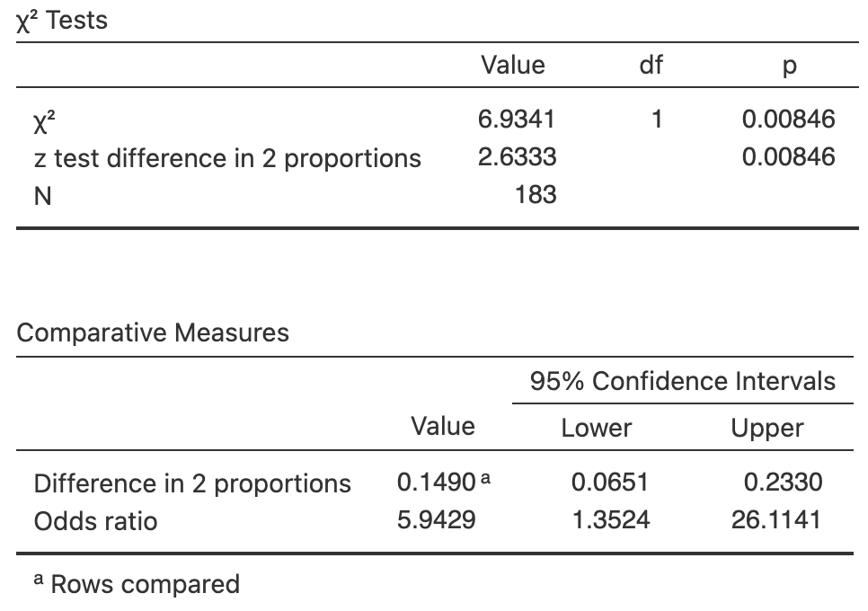
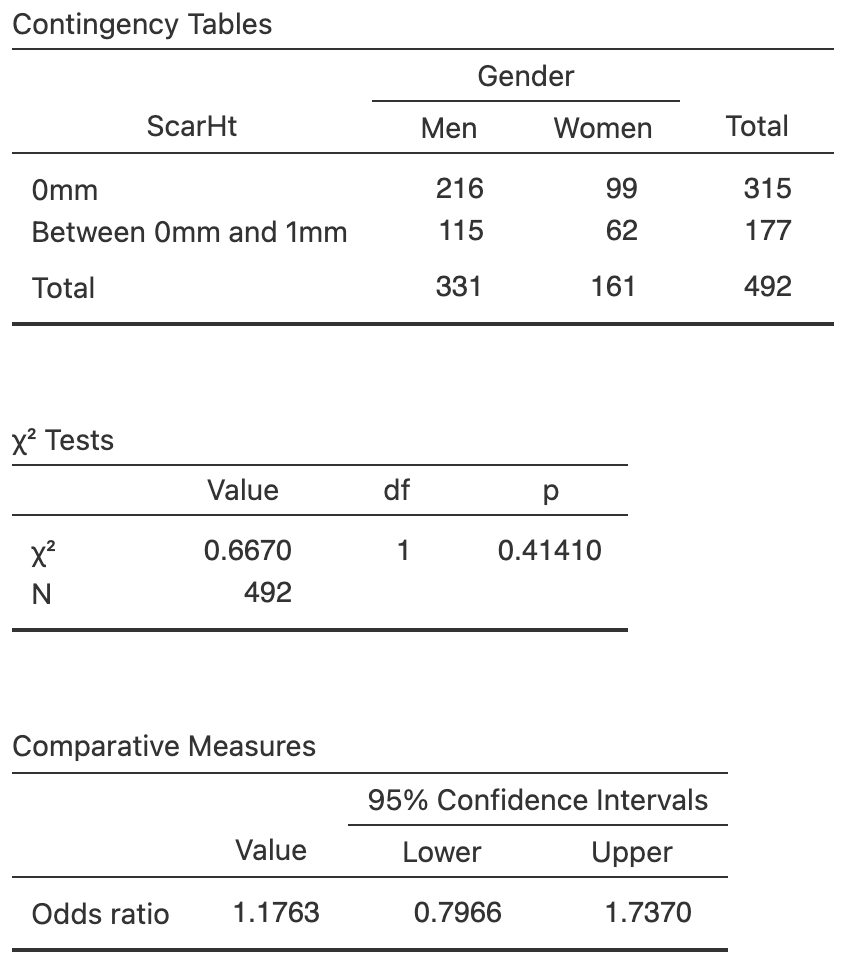
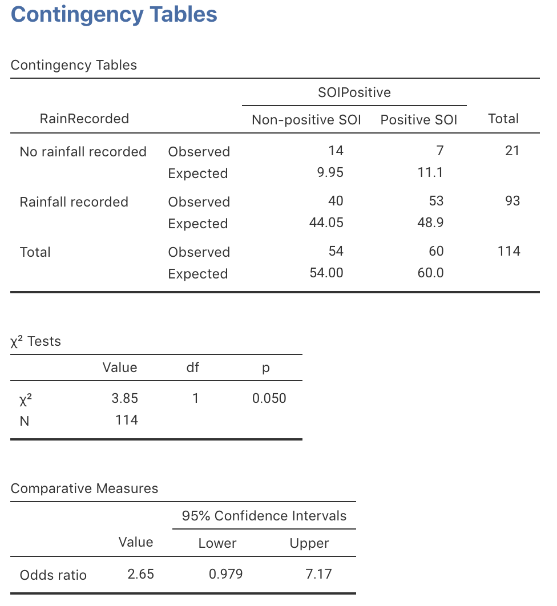
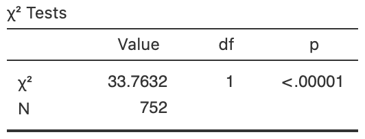
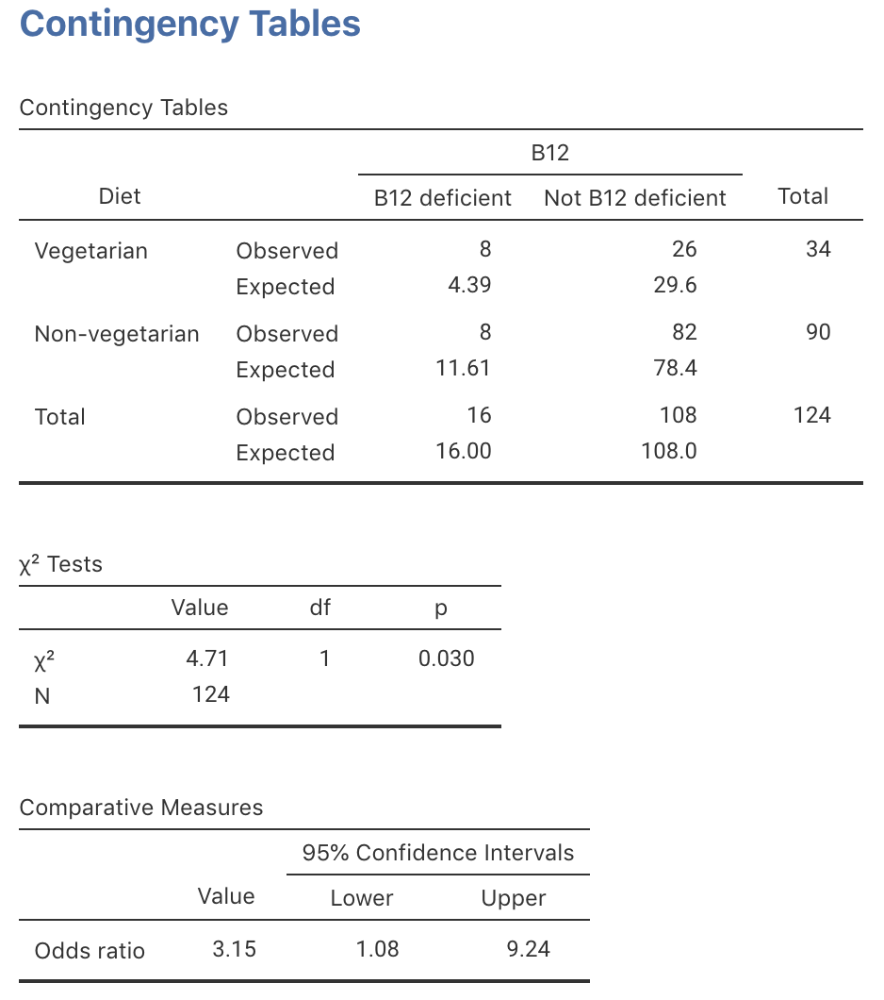

# Tests comparing qualitative variables {#TestsOddsRatio}


<!-- Introductions; easier to separate by format -->
```{r, child = if (knitr::is_html_output()) {'./introductions/36-Testing-OddsRatios-HTML.Rmd'} else {'./introductions/36-Testing-OddsRatios-LaTeX.Rmd'}}
```


## Introduction: meals on-campus {#MealsOnCampus}


<div style="float:right; width: 222x; border: 1px; padding:10px">

</div>


As seen in Sect.\ \@ref(OddsRatioIntro), @data:Mann12017:UniStudents examined the relationship between where university students usually ate, and where the student lived (Table\ \@ref(tab:MealsDataTableHT)).


```{r MealsDataTableHT}
data(StudentsEat)


Eating.tab <- Eating.tab.Counts <-  xtabs( ~ Meals + Live, 
                                           data = StudentsEat)

Eating.tab <- cbind( Eating.tab, 
                     "Total" = rowSums(Eating.tab))
Eating.tab <- rbind( Eating.tab, 
                     "Total" = colSums(Eating.tab))

Eating.tab <- t(Eating.tab)

if( knitr::is_latex_output() ) {
  kable( pad(Eating.tab[1:2, 1:2],
             surroundMaths = TRUE,
             targetLength = c(2, 3),
             digits = 0),
        format = "latex",
        booktabs = TRUE,
        longtable = FALSE,
        escape = FALSE,
        col.names = c("off-campus",
                      "on-campus"),
        align = "c",
        caption = "Where university students live and eat") %>%
     column_spec(1, bold = TRUE) %>%
     row_spec(0, bold = TRUE) %>%
     kable_styling(font_size = 8) %>%
    add_header_above( c(" " = 1, 
                        "Has most meals" = 1,
                        "Has most meals" = 1),
                      line = FALSE,
                      bold = TRUE)
}
if( knitr::is_html_output() ) {
  kable(pad(Eating.tab[1:2, 1:2],
             surroundMaths = TRUE,
             targetLength = c(2, 3),
             digits = 0),
               format = "html",
               booktabs = TRUE,
               longtable = FALSE,
               align = "c",
               caption = "Where university students live and eat")
}
UniS <- t(Eating.tab )   
```


A graphical summary is shown in Fig.\ \@ref(fig:EatingGraphsCI) (left panel), and a numerical summary in Table\ \@ref(tab:EatingNumericalSummaryHT).
(The details of the computations appear in Sect.\ \@ref(OddsRatioIntro)).


```{r EatingNumericalSummaryHT}
EatingNumericalSummary <- array( dim = c(3, 3))

EatingNumericalSummary[1, ] <- c(format(round(UniS[1, 1]/UniS[2, 1 ], 4), nsmall = 3),
                                 round(UniS[1, 1]/UniS[3, 1] * 100, 1),
                                 UniS[3,1] )
EatingNumericalSummary[2, ] <- c(round(UniS[1, 2] / UniS[2, 2], 4),
                                 round(UniS[1, 2] / UniS[3, 2] * 100, 1),
                                 UniS[3,2] )
EatingNumericalSummary[3, ] <- c( round( (UniS[1, 1] / UniS[1, 2] ) / (UniS[2, 1] / UniS[2, 2]), 3) ,
                                  round( (UniS[1, 1]/UniS[3, 1] - UniS[1, 2]/UniS[3, 2]) * 100, 1),
                                  NA)
rownames(EatingNumericalSummary) <- c("Living with parents",
                                      "Not living with parents",
                                      NA)
ENS <- EatingNumericalSummary
ENS[3, ] <- c( paste0("\\llap{OR:\ }$\\phantom{-}", ENS[3, 1], "$"),
               paste0("\\llap{Difference:\ }$", ENS[3, 2], "$"),
               NA)

if( knitr::is_latex_output() ) {
  kable(pad(ENS,
            surroundMaths = TRUE,
            targetLength = c(6, 4, 3),
            digits = c(3, 1, 0)),
        format = "latex",
        longtable = FALSE,
        booktabs = TRUE,
        escape = FALSE,
        align = "c",
        col.names = c("meals off-campus",
                      "most meals off-campus", 
                      "size"),
       caption = "The odds and percentage of university students eating most meals off-campus" 
  ) %>%
     row_spec(0, bold = TRUE) %>%
     row_spec(3, italic = TRUE) %>%
     row_spec(2, hline_after = TRUE) %>%
   add_header_above( c(" ", "Odds having most" = 1, 
                       "Percentage having" = 1,
                       "Sample" = 1),
                     line = FALSE,
                     bold = TRUE) %>%
	 kable_styling(font_size = 8) 
}
if( knitr::is_html_output() ) {
   kable(pad(ENS,
            surroundMaths = TRUE,
            targetLength = c(6, 4, 3),
            digits = c(3, 1, 0)),
               format = "html",
               longtable = FALSE,
               booktabs = TRUE,
               align = "c",
               col.names = c("Odds of having most\n meals off-campus", 
                             "Percentage having most\n meals off-campus", 
                             "Sample size"),
               caption = "The odds and percentage of university students eating most meals off-campus")
}
```


The parameter can be either a difference between two population proportions, or a population odds ratio.
For example, the parameter could be difference between population proportion studnets of eating most meals *off*-campus, comparing students living with their parents, to students *not* living with their parents.
Alternatively (and equivalently), the parameter could be the population OR of odds of eating most meals *off*-campus, comparing students living with their parents, to students *not* living with their parents.


::: {.softwareBox .software data-latex="{iconmonstr-laptop-4-240.png}"}
The proportions are usually computed as the Column\ 1 information out of the total, for each row. 
Then, the difference between the two proportions are usually calculated as the Row\ 1 proportion minus the Row\ 2 proportion.

The odds ratio can be interpreted in *either* of these ways (i.e., both are correct):\index{Odds ratio!interpreting}\index{jamovi output!Odds ratios}

-   The *odds* compare Row\ 1 counts to Row\ 2 counts, for both columns.
    The *odds ratio* then compares the Column\ 1 odds to the Column\ 2 odds.
-   The *odds* compare Column\ 1 counts to Column\ 2 counts.
    The *odds ratio* then compares the Row\ 1 odds to the Row\ 2 odds.

Odds and odds ratios are computed with the *first row* and *first column* values on the *top* of the fraction.
:::


:::{.example name="Odds and odds ratio in software"}
For the data in Table\ \@ref(tab:MealsDataTableHT), the software output (Fig.\ \@ref(fig:UniMealsTestOutputHTjamovi)) shows that the difference between the proportions of eating most meals off-campus is $0.149$ (higher for students living with parents).

In addition, the *odds* of eating most meals *off-campus* (Row\ 1) to *on-campus* (Row\ 2; on the bottom of the fraction) are:
  * for students living with their parents (Column\ 1): $52/2 = 26$;
  * for students not living with their parents (Column\ 2): $105/24 = 4.375$. 
Then, the OR is $26/4.375 = 5.943$ (Column\ 2 on bottom of the fraction), as in the output.
:::

The RQ and the hypotheses can be written as comparing proportions, comparing odds, or about odds ratios directly.
Means are *not* appropriate (the data contain two *qualitative* variables.)


## Comparing two proportions {#CompareTwoProportions}

To compare the two proportions, the RQ is written:

> Is the *population* proportion of students eating most meals off-campus the same for students *living with* their parents and for students *not living with* their parents?

The *sample* proportions will vary from sample to sample, and so the difference between the proportions will vary from sample to sample, and hence have a sampling distribution.
Since hypothesis testing begins by assuming that the null hypothesis is true (Sect.\ \@ref(HypothesisNull)), this means assuming that the proportions in both groups are the same.
This means that the data from the two groups can be combined to determine an overall (or common) proportion of students eating most meals off-campus:  
\[
  \hat{p} = \frac{52 + 105}{52 + 105 + 2 + 24} = \frac{157}{183} = 0.85792.
\]
This sample proportion is the overall proportion of students eatings most meals off-campus, assuming no difference between students living with and not with their parents.


::: {.definition #DEFSamplingDistributionDiffProportions name="Sampling distribution for the difference between two sample proportions"}
The *sampling distribution of the difference between two sample proportions* $\hat{p}_A$ and $\hat{p}_B$ is (when the appropriate conditions are met; Sect.\ \@ref(Validity-Test-ChiSq)) described by:

* an approximate normal distribution,
* centred around a sampling mean whose value is ${p_{A}} - {p_{B}}$, the difference between the *population* proportions (from $H_0$),
* with a standard deviation, called the standard error of the difference between the proportions, of $\displaystyle\text{s.e.}(\hat{p}_A - \hat{p}_B)$.

The standard error for the difference between the proportions is found using the overall, or common, proportion
\[
  \text{s.e.}(\hat{p}_A - \hat{p}_B) = \sqrt{ \frac{\hat{p} \times (1 - \hat{p}) }{n}},
\]
where $n$ is the total sample size and $\hat{p}$ is the common proportion.
:::


The corresponding standard error for the student-eating data is
\[
  \text{s.e.}(\hat{p}_1 - \hat{p}_2) = \sqrt{\frac{p \times (1 - p)}{n}} = \sqrt{ \frac{0.85792 \times (1 - 0.85792)}{183} } = 0.025808,
\]
using the idea in Eq.\ \@ref(eq:StdErrorPknown).


For the student-eating data, the differences between the sample proportions will have:

* an approximate normal distribution,
* centred around the sampling mean whose value is $p_P - p_N$,
* with a standard deviation, called the *standard error* of the difference, of $\text{s.e.}(\hat{p}_P - \hat{p}_N) = 0.025808$.

The test-statistic is a $z$-score, since the standard error contains no sample estimates (Sect.\ \@ref(TestStatistic)).
Since the test-statistic is a $z$-score, the $P$-value can be computed from normal distributions (Sect.\ \@ref(ExactAreasUsingTables)) or from software output (Fig.\ \@ref(fig:UniMealsTestOutputHTjamovi)).


```{r UniMealsTestOutputHTjamovi, fig.show="hold", fig.cap="The jamovi output for computing a CI and conducting a test", fig.align="center", out.width="55%"}

```

THE Z-SCORE SEEMS SO WRONG!
\[
  z = \frac{ 0.963 - 0.814}{0.025808} = 5.773!!!!!
\]

### Sampling distribution for $\hat{p}_1 - \hat{p}_2$ {#CompareTwoProportionsSamplingDist}

### Computing the value of the test statistic: $z$-scores {#CompareTwoProportionsTestStatistic}
\index{Test statistic!$z$-score}

### Determining $P$-values {#CompareTwoProportionsPvalues}

### Writing conclusions {#CompareTwoProportionsWritingConclusion}


## Comparing two odds {#CompareTwoOdds}

Using the OR, the RQ could be written as:

> Is the *population odds ratio* of eating most meals off-campus, comparing students who live *with their* parents to students *not living with* their parents, equal to one?

Alternatively, and probably easier to understand, is to write the RQ in terms of comparing the *odds* in the two groups:

> Are the *population odds* of students eating most meals off-campus the same for students *living with* their parents and for students *not living with* their parents?

Equivalent, the RQ can also be worded as comparing the percentage (or proportion) of students eating meals off-campus in each group, though this is less common.
In addition, software usually works with odds ratios, so writing hypotheses in terms of odds or odds ratios is more consistent.

Another alternative, which sounds less direct but is useful for two-way tables larger than $2\times 2$ (see Sect.\ \@ref(ShoppingBagsHT)), is worded in terms of *relationships* or *associations* (but *not* correlations) between the variables:

> Is there a relationship (or association) between where students eat most of their meals and whether or not the student lives with their parents?

All these RQs are equivalent.
Usually, for $2 \times2$ tables, working with *odds* or *odds ratios* is best, because most software (including jamovi) readily produce output for the OR.


## Statistical hypotheses and notation {#ORTestHypotheses}

For $2\times 2$ tables of counts, the *parameter* is the population odds ratio.
As usual, the null hypothesis is the 'no difference, no change, no relationship' position:

* $H_0$: The *population* OR is one; or (equivalently):  
  \phantom{$H_0$:{}} The *population* odds are the same in each group.

This hypothesis proposes that the *sample* odds are not the same in the two groups only due to sampling variation.
This is the initial *assumption*.
The alternative hypothesis is

* $H_1$: The *population* OR is not one; or (equivalently):  
  \phantom{$H_0$:{}} The *population* odds are *not* the same in each group.


::: {.importantBox .important data-latex="{iconmonstr-warning-8-240.png}"}
For analysing two-way tables of counts, the alternative hypotheses *are always two-tailed*.
:::


::: {.importantBox .important data-latex="{iconmonstr-warning-8-240.png}"}
The RQ and hypotheses only need to be given in *one* of these ways.
The RQ and hypotheses should be consistent; for example, if the RQ is written in terms of odds, the hypotheses should be written in terms of comparing odds.
:::


In our example then:

* $H_0$: The *population* odds of eating most meals off-campus are the *same* for students living *with* their parents and for students *not living* with their parents. d
* $H_1$:  The *population* odds of eating most meals off-campus are *different* for students living *with* their parents and for students *not living* with their parents.


As usual, the decision-making process starts by *assuming* the null hypothesis is true: that the *population* odds ratio is one (i.e., the population odds in each group are equal).


## Finding expected counts {#ExpectedValues}

Assuming that the odds of having most meals off-campus is the same for both groups (that is, the population OR is one), how would the sample OR be *expected* to vary from sample to sample just because of *sampling variation*?
If the null hypothesis is true, the odds are the same in both groups (and the percentages are the same in both groups).
That is, the percentage of students eating most meals off-campus is the same for students *living with* and *not living with* their parents.

Let's consider the implication.
From Table\ \@ref(tab:MealsDataTableHT), $157$ students out of $183$ ate most meals off-campus, so that $157\div 183 \times 100 = 85.79$% of students in the entire sample ate most of their meals off-campus.

If the percentage of students who eat most of their meals off-campus is the *same* for those who live with their parents and those who don't, then we'd *expect* $85.79$% of students in *both* groups to be eating most meals off-campus.
(These values were also found in Sect.\ \@ref(ValidityConditionsORCI).)
That is, we would *expect*:

* $85.79$% of the $54$ students who *live with their parents* (i.e., $46.33$ students) to eat most meals off-campus; and
* $85.79$% of the $129$ students who *don't live with their parents* (i.e., $110.67$ students) to eat most meals off-campus.

In other words, the percentage (and hence the odds) of eating most meals off-campus is the same in each group.
Those are the *expected* counts if the percentage (or odds) was exactly the same in each group (Table\ \@ref(tab:MealsDataTableHTExpected)), if the null hypothesis (the assumption) was true.

How close are the *observed* counts (Table\ \@ref(tab:MealsDataTableHT)) to the *expected counts* (Table\ \@ref(tab:MealsDataTableHTExpected))?

* $46.33$ of the $54$ students who *live with their parents* are *expected* to eat most meals off-campus; yet we observed $52$.
* $110.67$ of the $129$ students who *don't live with their parents* are *expected* to eat most meals off-campus; yet we observed $105$.

The observed and expected counts are similar, but not the exactly same.
The difference between the observed and expected counts *may* be explained by sampling variation (that is, the null hypothesis explanation).


::: {.importantBox .important data-latex="{iconmonstr-warning-8-240.png}"}
You *do not* have to compute the expected values when you answer one of these types of RQs (software does it in the background).
However, seeing how the decision-making process works in this context is helpful.
:::


In previous hypothesis tests, the *sampling distribution* had an approximate normal distribution.
However, the sampling distribution of the odds ratio is more complicated^[For those interested: The *logarithm* of the sample ORs have an approximate normal distribution, and hence a *standard error*.] so will not be presented.
We will use software output to conduct the test.


```{r MealsDataTableHTExpected}
Eating.tab.ExpCounts <- chisq.test(Eating.tab[1:2, 1:2])$expected
Eating.tab.ExpCounts <- cbind( Eating.tab.ExpCounts, 
                               "Total" = round( rowSums(Eating.tab.ExpCounts)) )
Eating.tab.ExpCounts <- rbind( Eating.tab.ExpCounts, 
                               "Total" = round( colSums(Eating.tab.ExpCounts)) )

if( knitr::is_latex_output() ) {
  kable( pad(Eating.tab.ExpCounts,
             surroundMaths = TRUE,
             targetLength = c(6, 7, 3),
             digits = c(3, 3, 0)),
        format = "latex",
        booktabs = TRUE,
        longtable = FALSE,
        escape = FALSE,
        digits = 3,
        align = "c",
        caption = "Where university students live and eat: expected counts"
  ) %>%
     column_spec(4, bold = TRUE)  %>%
     row_spec(3, bold = TRUE) %>%
     row_spec(0, bold = TRUE) %>%
  row_spec(2, hline_after = TRUE) %>%
	kable_styling(font_size = 8)
}
if( knitr::is_html_output() ) {
  out <- kable(pad(Eating.tab.ExpCounts,
             surroundMaths = TRUE,
             targetLength = c(6, 7, 3),
             digits = c(3, 3, 0)),
               format = "html",
               booktabs = TRUE,
               longtable = FALSE,
               digits = 3,
               align = "c",
               caption = "Where university students live and eat: expected counts"
  ) %>%
     column_spec(4, bold = TRUE)  %>%
     row_spec(3, bold = TRUE)
    out
 }        
```


```{r ORHT}
OR2Notation <- array(dim = c(4, 3))
colnames(OR2Notation) <- c("Group A", 
                             "Group B",
                             "Comparing groups")
rownames(OR2Notation) <- c("Sample sizes:",
                           "Sample odds:",
                           "Sample proportions:",
                           "Standard errors:")

if( knitr::is_latex_output() ) {
  OR2Notation[1, ] <- c(	"$n_A$",
                           "$n_B$",
                           NA)
  OR2Notation[2, ] <- c( "$\\text{Odds}_A$", 	
                           "$\\text{Odds}_B$",
                           "$\\text{Odds ratio} = \\text{Odds}_A/\\text{Odds}_B$")
  OR2Notation[3, ] <- c( "$\\hat{p}_A$",		
                           "$\\hat{p}_B$",
                           "$\\hat{p}_A - \\hat{p}_B$")
  OR2Notation[4, ] <- c(	"$\\displaystyle\\text{s.e.}(\\hat{p}_A)$",
                           "$\\displaystyle\\text{s.e.}(\\hat{p}_B)$",
                           "$\\displaystyle\\text{s.e.}(\\hat{p}_A - \\hat{p}_B)$")
  
  kable( OR2Notation,
         format = "latex",
         booktabs = TRUE,
         align = c("c", "c"),
         longtable = FALSE,
         escape = FALSE,
         linesep = c("\\addlinespace", "\\addlinespace", "", ""),
         col.names = colnames(OR2Notation),
         caption = "Notation used to distinguish between the two independent groups") %>%
    row_spec(0, bold = TRUE) %>%
    kable_styling(font_size = 8)
}
if( knitr::is_html_output() ) {
  
  OR2Notation[1, ] <- c(	"$n_A$",
                           "$n_B$",
                           NA)
  OR2Notation[2, ] <- c( "$\\text{Odds}_A$", 	
                           "$\\text{Odds}_B$",
                           "$\\text{Odds ratio} = \\text{Odds}_A/\\text{Odds}_B$")
  OR2Notation[3, ] <- c( "$\\hat{p}_A$",		
                           "$\\hat{p}_B$",
                           "$\\hat{p}_A - \\hat{p}_B$")
  OR2Notation[4, ] <- c(	"$\\displaystyle\\text{s.e.}(\\hat{p}_A)$",
                           "$\\displaystyle\\text{s.e.}(\\hat{p}_B)$",
                           "$\\displaystyle\\text{s.e.}(\\hat{p}_A - \\hat{p}_B)$")
  

  kable( OR2Notation,
         format = "html",
         booktabs = TRUE,
         longtable = FALSE,
         align = c("c", "c", "c"),
         col.names = colnames(OR2Notation),
         caption = "Notation used to distinguish between the two independent groups") %>%
    row_spec(0, bold = TRUE) 
}
```


## Comparing two qualitative variables with many levels {#CompareManyProportions}

Often more than two proportions need to be compared.
In addition, often tables of counts are much larger than $2\times 2$.
These situations requires different method, and are an extension of the $\chi^2$-test discussed in Sect.\ \@ref(CompareTwoOdds).
Again, the basic principles of hypothesis testing from Chap.\ \@ref(MoreAboutTests) still apply.

For this more general situation, the hypotheses are written in terms of associations between the two qualitative variables:

* $H_0$: In the *population*, there is *no* association between the two variables
* $H_1$: In the *population*, there is *an* association between the two variables


### Computing the value of the test statistic: $\chi^2$ values {#TestStatObs}
\index{Hypothesis testing!odds ratio}

Section\ \@ref(CompareTwoProportions) introduced a $z$-test for comparing two proportions, as summarised in a $2\times 2$ table of counts.
However, tables of counts are often larger than $2\times 2$, and different methods are needed.

**FIX** 

The decision-making process compares what is *expected* if the null hypothesis about the parameter is true (Table\ \@ref(tab:MealsDataTableHTExpected)) to what is *observed* in the sample (Table\ \@ref(tab:MealsDataTableHT)).
Previously, when the summary statistics were means and the sampling distribution was a normal distribution, the test statistic was a $t$-score.
However, the data here are not summarised by means, the sampling distribution is *not* a normal distribution (but is *related* to a normal distribution), and a different test statistic is needed.

Here, the test-statistic is a 'chi-squared' statistic,  written $\chi^2$.\index{Test statistic!$\chi^2$-score}\index{chi@$\chi^2$-score}
The $\chi^2$-score measures the overall size of the differences between the expected counts and observed counts, over the entire $2\times 2$ table.


:::: {.pronounceBox .pronounce data-latex="{iconmonstr-microphone-7-240.png}"}

::: {style="display: flex;"}
The Greek letter $\chi$ is pronounced 'ki', as in **ki**te (*not* 'chi' as in **Chi**na).
The test statistic $\chi^2$ is pronounced as 'chi-squared'.
:::


::: {}
```{r}
htmltools::tags$video(src = "./Movies/chi.mp4", 
                      width = "121", 
                      loop = "FALSE", 
                      controls = "controls", 
                      loop = "loop", 
                      style = "padding:5px; border: 2px solid gray;")
```
:::

::::


From the software (Fig.\ \@ref(fig:UniMealsTestOutputHTjamovi)), $\chi^2 = 6.934$.
But what does this value *mean*?
Is it a large or small value?

The $\chi^2$-value can be understood by finding the approximately-equivalent $z$-score, which means a $P$-value can be estimated using the $68$--$95$--$99.7$ rule.
In a $2\times 2$ table of counts, the *square root* of the $\chi^2$ value is equivalent to a $z$-score of about $\sqrt{6.934} = 2.63$.
This is relatively large $z$-score, so expect a small $P$-value.
For two-way tables of any size, a more general (but simple) calculation is needed.


::: {.tipBox .tip data-latex="{iconmonstr-info-6-240.png}"}
In a chi-squared test, the value of  
\[
  \sqrt{ \chi^2 \div {\text{df}}}
\]
is like a $z$-score, where $\text{df}$ is the 'degrees of freedom' (`df` in the software output).^[For those interested: the degrees of freedom in a two-way table is the number of rows of data less one, times the number of columns of data less one.  For a $2\times 2$ table, $\text{df} = (2 - 1) \times (2 - 1) = 1$.]

This allows the $P$-value to be estimated using the $68$--$95$--$99.7$ rule. 
:::


### Determining $P$-values

The differences between the observed sample statistic (the sample OR) and the hypothesised population parameter (the population OR of one) is summarised by $\chi^2 = 6.934$, approximately equivalent to $z = 2.63$.
Using the $68$--$95$--$99.7$ rule, a small $P$-value is expected.

The two-tailed $P$-value reported by jamovi (Fig.\ \@ref(fig:UniMealsTestOutputHTjamovi), under the column `p`) is indeed small: $0.008$ to three decimals.

   
::: {.importantBox .important data-latex="{iconmonstr-warning-8-240.png}"}
Recall that, for two-way tables of counts, the alternative hypotheses *are always two-tailed*, so a two-tailed $P$-value is always reported.
:::


<iframe src="https://learningapps.org/watch?v=ptw49fp0322" style="border:0px;width:100%;height:600px" allowfullscreen="true" webkitallowfullscreen="true" mozallowfullscreen="true"></iframe>


`r if (knitr::is_latex_output()) '<!--'`
`r if (knitr::is_html_output()){
  'Click on the hotspots in the following image, and describe what the jamovi output tells us.'
}`


<iframe src="https://learningapps.org/watch?v=p54msvghc22" style="border:0px;width:100%;height:800px" allowfullscreen="true" webkitallowfullscreen="true" mozallowfullscreen="true"></iframe>
`r if (knitr::is_latex_output()) '-->'`


### Writing conclusions {#WritingConclusionChi2}

A very small $P$-value ($0.008$ to three decimals) means strong evidence exists to supporting $H_1$: the evidence suggests a difference in the *population* odds in the two groups.
We write:

> The *sample* provides strong evidence ($\chi^2 = 6.934$; two-tailed $P = 0.008$) that the odds in the *population* of having most meals off-campus is different for students living with their parents (odds: $26$) and students *not* living with their parents (odds: $4.375$; OR: $5.94$; $95$%\ CI from $1.35$ to $26.1$).

The conclusion includes three components (Sect.\ \@ref(WordingConclusion)): The *answer to the RQ*; the *evidence* used to reach that conclusion ('$\chi^2 = 6.934$; two-tailed $P = 0.008$'); and some *sample summary statistics* (including the $95$%\ CI for the odds ratio).

The conclusion also makes clear what the odds and the odds ratio *mean*.
The odds are describing as the 'odds... of having most meals off-campus', and the OR as then comparing these odds between 'students living with their parents...  and students *not* living with their parents'.


::: {.importantBox .important data-latex="{iconmonstr-warning-8-240.png}"}
For two-way tables, RQs are best framed in terms of ORs or comparing odds (but can be framed in terms of proportions or percentages, or associations or relationships).
Usually, RQs are easiest to write when framed in terms of comparing odds.

For consistency: if the RQ is about the odds ratio, the hypotheses and conclusion should be about the odds ratio; if the RQ is about odds, the hypotheses and conclusion should be about the odds; and so on.
:::
      

<!-- ## Standardised residuals -->


<!-- The $\chi^2$ value, and hence the $P$-value, tells us  -->
<!-- *if* there is evidence that a difference exists. -->
<!-- It does not tell us *where* the difference lies, or *what* the difference is. -->
<!-- (That is, it doesn't tell us if students who live with their parents -->
<!-- are more likely to eat meals *on-* or *off-*campus.) -->
<!-- In $2\times2$ tables, -->
<!-- this is rarely hard to determine, -->
<!-- but in other size two-way table (such as a $4\times 3$ table, for example) it can be more challenging. -->
<!-- To help determine where the difference are located, -->
<!-- we can ask SPSS^[Using `Analyze> Descriptive Statistics> Crosstabs...`, and then in the `Cells` tab select `Residuals> Standardized`.] to produce  -->
<!-- *standardized residuals* -->
<!-- (Table \@ref(fig:UniMealsTestSPSSStdRes)). -->


<!-- ```{r UniMealsTestSPSSStdRes, echo=FALSE, fig.cap="The standardized residuals from SPSS for the two-way table for the uni-students eating data", fig.align="center", out.width="60%"} -->
<!-- knitr::include_graphics("SPSS/UniStudents/UniStudentsStdRes.png") -->
<!-- ``` -->


<!-- Standardised residuals are like $z$-scores, -->
<!-- so that cells in the table with a standardized residual larger than about $2$ -->
<!-- mean that the observed counts were *higher* than we would have expected, -->
<!-- and -->
<!-- that cells in the table with a standardized residual smaller than about $-2$ -->
<!-- mean that the observed counts were *smaller* than we would have expected. -->
<!-- So for the uni-student data -->
<!-- (Table \@ref(fig:UniMealsTestSPSSStdRes)), -->
<!-- we can find the largest and smallest standardized residuals: -->

<!-- * $-2.0$: Students *living with their parents* are *less likely* (because the residual is *negative*) to eat most meals on-campus -->
<!--    (compared to what we'd expect by chance). -->
<!-- * $1.3$: Students *not living with their parents*  are *more likely* (because the residual is *positive*) to eat mostmeals on-campus -->
<!--    (compared to what we'd expect by chance); -->

<!-- So while the $\chi^2$-square suggests there is a difference, -->
<!-- the standardised residuals tells us *how* they are different: -->
<!-- students living *with* their parents are -->
<!-- *less* likely to eat most meals on-campus. -->
<!-- Again, -->
<!-- standardized residuals may not be needed here to reach these conclusions, -->
<!-- but they can be used in larger two-way tables -->
<!-- (for example,  -->
<!-- see Sect. \@ref(ORTestDumping)). -->


## Statistical validity conditions {#Validity-Test-ChiSq}
\index{Statistical validity!odds ratio}

As usual, these results hold under certain conditions.
The test above is statistically valid if: 

* All *expected* counts are at least five.

Some books may give other (but similar) conditions.

The statistical validity condition refers to the *expected* (not the *observed*) counts.
In jamovi, the *expected* counts must be explicitly requested to see if this condition is satisfied (Fig.\ \@ref(fig:UniMealsTestExpectedjamovi)).

If the statistical validity conditions are not met, other similar options include using a Fisher's exact test\index{Fisher's exact test}  [@conover2003practical] or using resampling methods [@efron2021computer].


```{r UniMealsTestExpectedjamovi, fig.cap="The expected values, as computed in jamovi", fig.align="center", out.width="70%"}
knitr::include_graphics("jamovi/UniStudents/UniStudents-Expected.png")
```

For the student-eating data, the smallest *observed* count is $2$ (living with parents; most meals off-campus), but the smallest *expected* count is $7.67$, which is greater than five.
The size of the *expected* counts is important for the statistical validity condition.


::: {.example #StatisticalValidityEatingHT name="Statistical validity"}
For the university-student eating data, *all* the cells have an *expected* count of at least five so the statistical validity condition is satisfied.
:::


```{r}
data(PetBirds)

PB2 <- xtabs( Counts ~ Pets + LC, 
              data = PetBirds)

PB2.exp <- chisq.test(PB2)$expected 
```


## Example: turtle nests {#TurtleNestsHT}

(This study was seen in Sect.\ \@ref(TurtleNestsOR).)
The hatching success of loggerhead turtles on Mediterranean beaches is often compromised by fungi and bacteria.
@candan2021first compared the odds of a nest being infected, between nest relocated due to the risk of tidal inundation, and non-relocated nests
`r if (knitr::is_latex_output()) {
   '(Table\\ \\@ref(tab:TurtleNestDataTableHT), left table).'
} else {
   '(Table\\ \\@ref(tab:TurtleNestDataTableHT)).'
}`
The researchers were interested in knowing:

> For Mediterranean loggerhead turtles, are the odds of infections the same for natural and relocated nests?


```{r TurtleNestDataTableHT}
TurtleData <- array( dim = c(2, 2))
TurtleData[, 1] <- c(29, 14)
TurtleData[, 2] <- c(10, 8)

rownames(TurtleData) <- c("Natural",
                          "Relocated")
colnames(TurtleData) <- c("Non-infected",
                          "Infected")


TNsummary <- array( dim = c(3, 3) )

colnames(TNsummary) <- c( "Odds infected",
                          "Percentage infected",
                          "Sample size")
rownames(TNsummary) <- c("Natural",
                         "Relocated",
                         "Odds ratio:")


TNsummary[1:2, 1] <- TurtleData[, 1] / TurtleData[, 2]
TNsummary[1:2, 2] <- TurtleData[, 1] / rowSums(TurtleData) * 100
TNsummary[1:2, 3] <- apply(TurtleData, 1, "sum")
TNsummary[3, 1] <- TNsummary[1, 1] / TNsummary[2, 1]


if( knitr::is_latex_output() ) {
  T1 <- kable(pad(TurtleData,
                  surroundMaths = TRUE,
                  targetLength = 2,
                  digits = 0),
              format = "latex",
              booktabs = TRUE,
              valign = 't',
              escape = FALSE,
               col.names = c("infected",
                             "infected"),
              align = "c") %>%
    row_spec(0, bold = TRUE) %>%
    add_header_above( c( " " = 1,
                         "Not" = 1,
                         " " = 1),
                      bold = TRUE,
                      line = FALSE)
  
  T2 <- kable( pad(TNsummary,
                   surroundMaths = TRUE,
                   targetLength = c(5, 5, 2),
                   digits = c(3, 2, 0)),
               format = "latex",
               booktabs = TRUE,
               valign = 't',
               align = "c",
               escape = FALSE,
               #table.env = "@empty",
               col.names = c("infected",
                             "infected",
                             "size")) %>%
    row_spec(0, bold = TRUE) %>%
    row_spec(2, hline_after = TRUE) %>%
    row_spec(3, italic = TRUE) %>%
    add_header_above( c( " " = 1,
                         "Odds" = 1,
                         "Percentage" = 1,
                         "Sample" = 1),
                      bold = TRUE,
                      line = FALSE)
  
  
  out <- knitr::kables(list(T1, T2), # Notice order swapped!
                       format = "latex",
                       label = "TurtleNestDataTableHT",
                       caption = "The turtles data (left), and the numerical summary (right)") %>% 
    kable_styling(font_size = 8)
  prepareSideBySideTable(out,
                         gap = "\\qquad")
  
}
if( knitr::is_html_output() ) {
  kable(pad(TurtleData,
                  surroundMaths = TRUE,
                  targetLength = 2,
                  digits = 0),
        format = "html",
        booktabs = TRUE,
        longtable = FALSE,
        align = "c",
        caption = "Infected and non-infected turtle nests") %>%
    row_spec(0, bold = TRUE)
}
```


The parameter is the odds ratio of infection, comparing natural to relocated nests.
A graphical summary is shown in Fig.\ \@ref(fig:TurtleNestsGraphs).
A numerical summary table (Table\ \@ref(tab:TurtleNestDataTable), right table) shows that the odds of natural nest being infected is $1.657$ times the odds of a relocated nest being infected.
From the jamovi output (Fig.\ \@ref(fig:TurtleNestsOutputjamoviHT)), the $\chi^2$-value is $0.777$.
This is like a $z$-score of $z = \sqrt{0.777/1} = 0.88$, which is very small, so expect a large $P$-value.
Indeed, the $P$-value is $0.378$ on the output.
The smallest *expected* count is $6.49$ (Fig.\ \@ref(fig:TurtleNestsOutputjamoviHT)), so this test is statistically valid.
We write:

> There is no evidence of a difference in the odds of infection ($\chi^2$: $0.777$; $P$-value: $0.378$; odds ratio: $1.657$; $95$%\ CI: $0.537$ to $5.12$) between natural nests (odds: $2.90$; $n = 39$) and relocated nests (odds: $1.75$; $n = 22$).

That is, there no evidence that relocating the nest (to protect them from tidal inundation) changes the risk of infection.


:::: {.importantBox .important data-latex="{iconmonstr-warning-8-240.png}"}
We *do not* say whether the evidence supports the null hypothesis.
We assume the null hypothesis is true, so we state how strong the evidence is to support the alternative hypothesis.
The current sample presents no evidence to contradict the assumption, but future evidence may emerge.
:::

<!-- and Table 5 (BTW, Table 6 is  not $2\times 2$): -->


```{r TurtleNestsOutputjamoviHT, fig.show="hold", fig.cap="The jamovi output for the turtle-nesting data", fig.align="center", out.width=c("46%", "51%")}
knitr::include_graphics("jamovi/TurtleNests/TurtleNests-Chisq.png")
knitr::include_graphics("jamovi/TurtleNests/TurtleNests-Expected.png")
```


## Example: shopping bags {#ShoppingBagsHT}

A study of $400$ residents of  Klang Valley, Malaysia, examined residents' approach to waste management [@choon2017perception].
One RQ was:

> For residents of Klang Valley, is age associated with whether people bring their own bags when shopping? 


The data (Table\ \@ref(tab:BagsTableHT)) are given in a $3\times 2$ table of counts.
The software output is shown in Fig.\ \@ref(fig:BagsChisqjamovi), and a graphical summary in Fig.\ \@ref(fig:BagsSidebysideBar).
Most of the numerical summary must be produced manually (Table\ \@ref(tab:BagsHTNumerical)), since jamovi only produces odds ratios for $2\times 2$ tables.
Here are the details of the calculations (notice that Row\ 1 is on the bottom of the fraction):


```{r BagsTableHT}
data(ShoppingBags)

ShoppingBags$BringBags <- ordered(ShoppingBags$BringBags, # Swap order
                                  levels = c("y", "n"))
BagsTab <- xtabs(Counts ~ AgeGroup + BringBags, 
                 data = ShoppingBags)

colnames(BagsTab) <- c("Brings own bags", 
                       "Does not bring own bags" )
rownames(BagsTab) <- c("30 and under",
                       "31 to 40",
                       "Over 40")

if( knitr::is_latex_output() ) {
  kable(pad(BagsTab,
            surroundMaths = TRUE,
            targetLength = 3,
            digits = 0),
        format = "latex",
        align = "c",
        longtable = FALSE,
        escape = FALSE,
        caption = "Whether shoppers bring their own bags, and the shoppers age",
        booktabs = TRUE) %>%
    kable_styling(font_size = 8) %>%
    row_spec(0, bold = TRUE) %>%
    column_spec(1, bold = TRUE)
}
if( knitr::is_html_output() ) {
  kable(pad(BagsTab,
            surroundMaths = TRUE,
            targetLength = 3,
            digits = 0),
        format = "html",
        align = "c",
        longtable = FALSE,
        caption = "Whether shoppers bring their own bags, and the shoppers age",
        booktabs = TRUE)
}
```


```{r BagsChisqjamovi, fig.show="hold", fig.cap="jamovi output for the shopping-bags data", fig.align="center", out.width=c("43%", "56%")}
knitr::include_graphics( "jamovi/ShoppingBags/ShoppingBags-Test.png")
knitr::include_graphics( "jamovi/ShoppingBags/ShoppingBags-Expected.png")
```


```{r BagsSidebysideBar, fig.cap="A side-by-side bar chart for the shopping-bags data", fig.align="center", out.width="70%", fig.height=3.25, fig.width=7}
barplot(t(BagsTab), 
        beside = TRUE,
        las = 1,
        ylim = c(0, 140),
        ylab = "Counts",
        xlab = "Age group",
        main = "Side-by-side bar chart\n for shopping-bags data",
        legend.text = TRUE, 
        args.legend = list( bty = "n", 
                            ncol = 1,
                            x = "topright"))

#knitr::include_graphics( "SPSS/Kerbside/Kerbside-SidebysideBar.png")
```


```{r BagsHTNumerical}
BagsSummary <- array( dim = c(3, 4) )

colnames(BagsSummary) <- c( "Odds",
                            "Odds ratio",
                           "Percentage",
                           "Sample size")
rownames(BagsSummary) <- rownames(BagsTab)
  
BagsSummary[1, ] <- c( 0.913, 
                       0.289, 
                       47.7, 
                       264)
BagsSummary[2, ] <- c( 1.563, 
                       0.496, 
                       61.0, 
                       82)
BagsSummary[3, ] <- c(3.154, 
                      NA, 
                      75.9, 
                      54)


cap.tab <- "Odds and percentage that people bring their own shopping bags by age groups. The odds ratios are computed relative to those 'Over $40$'."

if( knitr::is_latex_output() ) {
  cap.tab <- "Odds and percentage that people bring their own shopping bags by age groups. The odds ratios are computed relative to those `Over $40$'."
  kable(pad(BagsSummary,
            surroundMaths = TRUE,
            targetLength = c(5, 5, 4, 3),
            digits = c(3, 3, 1, 0)),
        format = "latex",
        booktabs = TRUE,
        longtable = FALSE,
        escape = FALSE,
        align = "c",
        caption = cap.tab) %>%
    row_spec(0, bold = TRUE) %>%
    kable_styling(font_size = 8)
}
if( knitr::is_html_output() ) {
  kable(pad(BagsSummary,
            surroundMaths = TRUE,
            targetLength = c(5, 5, 4, 3),
            digits = c(3, 3, 1, 0)),
        format = "html",
        booktabs = TRUE,
        longtable = FALSE,
        align = "c",
        caption = cap.tab)
}
```


* For those '$30$ or under': the *odds* of bringing a shopping bag is $126/138 = 0.913$.
* For those '$31$ to $40$': the *odds* of bringing a shopping bag is $50/32 = 1.712$.
* For those 'Over $40$': the *odds* of bringing a shopping bag is $41/13 = 3.154$.

Then the *odds ratios* can be computed:

* The OR of bringing a shopping bag, comparing people '$31$--$40$' to people 'Over $40$': $0.913/3.154 = 0.289$.
* The OR of bringing a shopping bag, comparing people 'Over $40$' to people 'Over $40$': $1.563/3.154 = 0.496$.

In Table\ \@ref(tab:BagsHTNumerical), the odds of bringing a shopping bag are relative to those 'Over $40$' (the last row).
Since Table\ \@ref(tab:BagsHTNumerical) has *three* groups to compare, three odds are needed.
However, the summary has $3 - 1 = 2$ odds ratios, since odds *ratios* compare *pairs* of odds.
The level to which the other two are compared is called the *reference level*.
In Table\ \@ref(tab:BagsHTNumerical), the reference level is 'Over $40$' (i.e., on the bottom of the fraction when computing the odds ratios).
(In a $2\times 2$ table, with *two* groups to compare, the summary has only $2 - 1 = 1$ odds ratio; i.e., one pair of odds.)

These odds ratios mean:

* The odds of bringing a shopping bag for those '$30$ and under' is $0.289$ times (i.e., is smaller than) the odds of those 'Over $40$'; and
* The odds of bringing a shopping bag for those '$31$ to $40$' is $0.496$ times (i.e., is smaller than) the odds of those 'Over $40$'.

The hypothesis can be worded in terms of odds:

* $H_0$: The odds of bringing a shopping bag *is the same* for all age groups.
* $H_1$: The odds of bringing a shopping bag *is not the same* for all age groups.

Alternatively, the hypotheses can be worded in terms of *relationships* or *associations* (but *not* correlations) between the two variables:

* $H_0$: *No association* exists between bringing a shopping bag and age group.
* $H_1$: *An association* exists between bringing a shopping bag and age group.

For a $2\times 2$ table, the *parameter* is the odds ratio. 
For two-way tables larger than $2\times 2$, defining a single parameter is difficult; it requires a single number to measure the association between the variables, but we need two ORs to summarise the data.
Effectively, the $\chi^2$-statistic becomes the parameter that measures the size of the difference between all three odds.
When no relationship exists in the population, $\chi^2 = 0$; hence $H_0:$ $\chi^2 = 0$.
The alternative hypothesis is $H_1$: $\chi^2 > 0$; that is, the value of $\chi^2$ in the sample is not zero due to sampling variation.

From the software output (Fig.\ \@ref(fig:BagsChisqjamovi)), $\chi^2 = 16.24$ and $\text{df} = 2$, so this $\chi^2$ value is approximately equivalent to a $z$-score of $\sqrt{16.24\div 2} = 2.85$.
This is a large $z$-score so, using the $68$--$95$--$99.7$ rule, a small $P$-value is expected; indeed, jamovi reports $P < 0.001$.
This suggests very strong evidence in the sample that bringing a shopping bag is not the same for all three age groups.

The conclusion could be written as

> The sample provides very strong evidence ($\chi^2 = 16.24$; $\text{df} = 2$) that the odds of bringing a shopping bag is not the same for the three age groups.

While sample summary information could be added to this conclusion, the statements may then become cumbersome.
Instead, pointing readers to the numerical summary (Table\ \@ref(tab:BagsHTNumerical)) is probably better.
Furthermore, CIs are not reported since jamovi does not produce CIs for tables larger than $2\times 2$.

All *expected* values exceed $5$ (Fig.\ \@ref(fig:BagsChisqjamovi)), so the results are statistically valid.


## Chapter summary {#TestsOddsRatio-Summary}

To test a hypothesis about a difference between two population means $\mu_A - \mu_B$:

* Write the null hypothesis ($H_0$) and the alternative hypothesis ($H_1$).
* Initially *assume* no relationship between the two variables.
* Find the value of the *test statistic* (a $\chi^2$-score) on the software output.
* The approximately-equaivalent $z$-score is $\sqrt{\chi^2\div\text{df}}$ where $\text{df}$ is the 'degress of freedom' and can be found on the software output.
* An approximate *$P$-value* can be estimated using the $68$--$95$--$99.7$ rule, or found using software.


## Quick review questions {#TestsOddsRatio-QuickReview}

<div style="float:right; width: 222x; border: 1px; padding:10px">

</div>


::: {.webex-check .webex-box}
@meresa2023effect investigated Ethiopian farmers' adoption of improved soil and water conservation structures on their farms (Table\ \@ref(tab:FarmersData)).
Output from using jamovi is shown in Fig.\ \@ref(fig:farmersjamoviHT).

```{r}
Farmers <- array(dim = c(2, 2))

colnames(Farmers) <- c("Non-adopter", 
                       "Adopter")

rownames(Farmers) <- c("$< 0.5$ ha", 
                       "$\\ge 0.5$ ha")


Farmers[1, ] <- c(86, 61)
Farmers[2, ] <- c(43, 71)
```

\begin{figure}
\begin{minipage}{0.38\textwidth}
\captionof{table}{Adoption of conservation practices by Ethiopian farmers, by farm size\label{tab:FarmersData}}
\fontsize{8}{12}\selectfont
```{r}
knitr::kable( pad(Farmers,
                  surroundMaths = TRUE,
                  targetLength = 2,
                  digits = 0),
         format = "latex",
         align = "c",
         booktabs = TRUE,
         longtable = FALSE,
         escape = FALSE,
         table.env = "@empty") %>%
   row_spec(0, bold = TRUE)
```
\end{minipage}
\hspace{0.05\textwidth}
\begin{minipage}{0.54\textwidth}%
\centering
```{r, out.width='95%'}
knitr::include_graphics( "jamovi/Farmers/Farmers-Chi2.png")
```
\caption{jamovi output for the farming study}\label{fig:farmersjamoviHT}
\end{minipage}
\end{figure}


```{r FarmersData}
if( knitr::is_html_output() ) { 
  kable(pad(Farmers,
                  surroundMaths = TRUE,
                  targetLength = 2,
                  digits = 0),
        format = "html",
        align = "c",
        longtable = FALSE,
        booktabs = TRUE,
        caption = "Adoption of conservation practices by Etghiopian farmers, by farm size ")
}
```

<!-- The figure for LaTeX is in the minipage (combined with data table), so only need show it for the HTML -->
`r if (knitr::is_latex_output()) '<!--'`
```{r farmersjamoviHT, fig.show="hold", fig.cap="jamovi output for the farming study", fig.align="center", out.width="50%"}
knitr::include_graphics( "jamovi/Farmers/Farmers-Chi2.png")
```


`r if (knitr::is_latex_output()) '-->'`
1. What is the $\chi^2$ value? \tightlist
`r if( knitr::is_html_output() ) {mcq(
  c(answer = 10.7105, 2.2903, 1.3891, 262)  )}`
1. What is the equivalent $z$-score (to two decimal places)?
`r if( knitr::is_html_output() ) {fitb(answer = 3.28, tol = 0.01, num = TRUE)}`
1. Using the $68$--$95$--$99.7$ rule, what is the approximate $P$-value?
`r if( knitr::is_html_output() ) {longmcq(
  c(answer = "Smaller than 0.003",
    "Smaller than 0.05",
    "Larger than 0.05",
    "There is not enough information") )}`
1. From the software output, what is the $P$-value?
`r if( knitr::is_html_output() ) {mcq(
  c("10.7105",
    answer = "0.00107",
    "2.2903",
    "There is not enough information")  )}`
1. What is the alternative hypothesis?
`r if( knitr::is_html_output() ) {longmcq(
  c("One-tailed",
    answer = "Two-tailed",
    "There is not enough information")  )}`
1. True or false:
There is *no* evidence of a difference in odds of adopting of conservation practices, for the two far size categories.
`r if( knitr::is_html_output() ) {torf(answer=FALSE)}`
:::


## Exercises {#TestsOddsRatioExercises}

Answers to odd-numbered exercises are available in App.\ \@ref(Answers).

`r if( knitr::is_latex_output() ) "\\captionsetup{font=small}"`


::: {.exercise #OddsSame}
Consider the expected counts in Table\ \@ref(tab:MealsDataTableHTExpected).
Confirm that the *odds* of having most meals off-campus is the same for students living with their parents, and for students not living with their parents.
:::


::: {.exercise #OddsEV}
Section\ \@ref(Chap29-QuickReview) gives data from a study of the adoption of electric vehicle (EVs) by a certain group of professional Americans (Table\ \@ref(tab:EV10years); @egbue2017mass).
Software gives the $\chi^2$-score as $1.31$.

1. What is the equivalent $z$-score?
1. What is the approximate $P$-value for the test?
:::


::: {.exercise #TestsOddsSandflies}
@data:Christensen:sandflies studied the number of sandflies caught in light traps set at $3$ and $35$ feet above ground in eastern Panama.
They asked:

> In eastern Panama, are the odds of finding a male sandfly the same at $3$ feet above ground as at $35$ feet above ground?

The data are compiled into a table (Table\ \@ref(tab:SandfliesHT)), and summarised numerically (Table\ \@ref(tab:SandfliesHTNumerical); partially edited) and graphically (Fig.\ \@ref(fig:SandfliesPlot)).
Use the jamovi output (Fig.\ \@ref(fig:Sandfliesjamovi)) to evaluate the evidence, complete Table\ \@ref(tab:SandfliesHTNumerical), and write a conclusion.
:::


```{r}
FliesData <- array( dim = c(2, 2))

FliesData[1, ] <- c(173, 125)
FliesData[2, ] <- c(150, 73)
colnames(FliesData) <- c("3 feet above ground", 
                         "35 feet above ground")
rownames(FliesData) <- c("Males", 
                         "Females")
```

\begin{figure}
\begin{minipage}{0.52\textwidth}
\captionof{table}{The sex of sandflies at two heights\label{tab:SandfliesHT}}
\fontsize{8}{12}\selectfont
```{r}
knitr::kable( pad(FliesData,
                  surroundMaths = TRUE,
                  targetLength = 3, 
                  textAlign = "right",
                  digits = 0),
         format = "latex",
         align = "c",
         col.names = c("above ground",
                       "above ground"),
         booktabs = TRUE,
         longtable = FALSE,
         escape = FALSE,
         table.env = "@empty") %>%
   row_spec(0, bold = TRUE) %>%
    add_header_above( c(" " = 1,
                        "3 feet" = 1,
                        "35 feet" = 1),
                      bold = TRUE,
                      line = FALSE)
   #kable_styling(font_size = 8) %>% # CANNOT USE THIS IN THE MINIPAGE
   #column_spec(1, width = "13mm") %>%
   #column_spec(2, width = "22mm")
```
\end{minipage}
\hspace{0.05\textwidth}
\begin{minipage}{0.40\textwidth}%
\centering
```{r, fig.width=4, fig.height = 3,out.width='100%'}
counts <- matrix( c(173, 125, 150, 73), 
                  byrow = TRUE, 
                  nrow = 2)
rownames(counts) <- c("M", 
                      "F")
colnames(counts) <- c("3 ft", 
                      "35 ft")

mp <- barplot( counts,
               las = 1,
               ylim = c(0, 200),
               col = c(BlockColour, 
                       ResponseColour),
               ylab = "Number of sandflies",
               main = "Number of female and male\nsandflies at different heights",
               xlab = "Height above ground",
               beside = TRUE)

text(1.5, 50, "M")
text(2.5, 50, "F")
text(4.5, 50, "M")
text(5.5, 50, "F")

box()
```
\caption{A side-by-side bar chart of the sandflies data for male (M) and female (F) sandflies}\label{fig:SandfliesPlot}
\end{minipage}
\end{figure}


  
```{r SandfliesHT}
if( knitr::is_html_output() ) {
  kable(pad(FliesData,
                  surroundMaths = TRUE,
                  targetLength = 3, 
                  textAlign = "right",
                  digits = 0),
        format = "html",
        align = "c",
        longtable = FALSE,
        col.names = c("above ground",
                      "above ground"),
        caption = "The sex of sandflies at two heights",
        booktabs = TRUE) %>%
    kable_styling(full_width = FALSE) %>%
    add_header_above( c(" " = 1,
                        "3 feet" = 1,
                        "35 feet" = 1),
                      bold = TRUE,
                      line = FALSE)
  
}
```

```{r SandfliesHTNumerical}
FliesSummary <- array( dim = c(3, 3) )

colnames(FliesSummary) <- c( "Odds",
                             "Percentage",
                             "Sample size")
rownames(FliesSummary) <- c("3 feet:",
                            "35 feet:",
                            "Odds ratio:")
  
  
FliesSummary[1, ] <- c( NA, NA, "$298$")
FliesSummary[2, ] <- c( "$1.71$", "$67.3$", "$223$")
FliesSummary[3, ] <- c("$0.67$", NA, NA)


cap.tab <- "Odds and percentages of male sandflies at two heights above ground level"

if( knitr::is_latex_output() ) {
  kable(pad(FliesSummary,
            surroundMaths = TRUE,
            targetLength = c(4, 4, 0),
            textAlign = "right",
            digits = c(2, 1, 0)),
        format = "latex",
        booktabs = TRUE,
        longtable = FALSE,
        escape = FALSE,
        align = "c",
        caption = cap.tab) %>%
    row_spec(0, bold = TRUE) %>%
    row_spec(3, italic = TRUE) %>%
    kable_styling(font_size = 8)
}
if( knitr::is_html_output() ) {
  kable(pad(FliesSummary,
            surroundMaths = TRUE,
            targetLength = c(4, 4, 0),
            textAlign = "right",
            digits = c(2, 1, 0)),
               format = "html",
               booktabs = TRUE,
               longtable = FALSE,
               align = "c",
               caption = cap.tab) %>%
    kable_styling(full_width = FALSE) 
}
```

<!-- The figure for LaTeX is in the minipage (combined with data table), so only need show it for the HTML -->
`r if (knitr::is_latex_output()) '<!--'`
```{r SandfliesPlot, fig.cap="A side-by-side barchart of the sandflies data", fig.align="center", fig.width=5.5, fig.height=3.5}
counts <- matrix( c(173, 125, 150, 73), 
                  byrow = TRUE, 
                  nrow = 2)
rownames(counts) <- c("M", 
                      "F")
colnames(counts) <- c("3 ft", 
                      "35 ft")

mp <- barplot( counts,
               las = 1,
               ylim = c(0, 200),
               col = c("lightblue", 
                       "thistle3"),
               ylab = "Number of sandflies",
               main = "Number of female and male\nsandflies at different heights",
               xlab = "Height above ground",
               beside = TRUE)

text(1.5, 50, "M")
text(2.5, 50, "F")
text(4.5, 50, "M")
text(5.5, 50, "F")

box()
```
`r if (knitr::is_latex_output()) '-->'`


```{r Sandfliesjamovi, fig.show="hold", fig.cap="Using jamovi to compute a CI for the sandflies data", fig.align="center", out.width="75%"}
knitr::include_graphics( "jamovi/Sandflies/Sandflies-All.png")
```


::: {.exercise #TestsOddsRatioScars}
(This study also appeared in Exercise\ \@ref(exr:OddsRatiosCIScarHeights), where the odds ratio, and the CI for the odds ratio, were computed.)
@data:Wallace2017:Sunburn compared the heights of scars from burns received in Western Australia (Table\ \@ref(tab:ScarsData)).
The data are shown in Table\ \@ref(tab:ScarsDataHT).
jamovi was used to analyse the data (Fig.\ \@ref(fig:ScarHeightRisk)).

1. Perform a hypothesis test to determine if the odds of having a smooth scar are the same for women and men.
1. Write down the conclusion.
1. Is the test statistically valid?
:::


```{r ScarsDataHT}
ScarsData <- array( dim = c(2, 2) )

rownames(ScarsData) <- c("Scar height $0$\\ mm (smooth)",
                         "Scar height more than $0$\\ mm, less than $1$\\ mm")
colnames(ScarsData) <- c("Women",
                         "Men")

ScarsData[1, ] <- c(99, 216)
ScarsData[2, ] <- c(62, 115)

if( knitr::is_latex_output() ) {
  kable(pad(ScarsData,
            surroundMaths = TRUE,
            targetLength = c(2, 3), 
            digits = 0),
        format = "latex",
        booktabs = TRUE,
        longtable = FALSE,
        escape = FALSE,
        align = "c",
        caption = "The number of men and women, with scars of different heights") %>%
    row_spec(0, bold = TRUE) %>%
  kableExtra::kable_styling(latex_options = "hold_position", 
                            font_size = 8)
}
if( knitr::is_html_output() ) {
  kable(pad(ScarsData,
            surroundMaths = TRUE,
            targetLength = c(2, 3), 
            digits = 0),
               format = "html",
               booktabs = TRUE,
               longtable = FALSE,
               align = "c",
               caption = "The number of men and women, with scars of different heights") %>%
    row_spec(0, bold = TRUE) %>%
    kable_styling(full_width = FALSE) 
}
```


```{r ScarHeightRisk, fig.show="hold", fig.cap="Using jamovi to compute a CI for the scar-height data", fig.align="center", out.width="55%"}

```


::: {.exercise #OddsRatiosCITurbinesHT}
A study of turbine failures [@MyersBook; @NelsonLifeData] ran $73$ turbines for around $1800$\ hrs, and found that seven developed fissures (small cracks).
They also ran a different set of $42$ turbines for about $3000$\ hrs, and found that nine developed fissures.

1. Use the jamovi output (Fig.\ \@ref(fig:TurbinesOutputHT), left panel) to test for a relationship.
1. Compute, then carefully interpret, the OR.
1. Write down, then carefully interpret, the test results.
1. Is the CI statistically valid (Fig.\ \@ref(fig:TurbinesOutputHT), right panel)?
:::


```{r TurbinesOutputHT, fig.show="hold", fig.cap="jamovi output for the turbine data (left); expected counts (right)", fig.align="center", out.width="48%"}
knitr::include_graphics( "jamovi/Turbines/TurbinesCI-jamovi.png" )
knitr::include_graphics( "jamovi/Turbines/TurbinesExpected-jamovi.png" )
```


```{r}
data(EmeraldAug) ### Exercise

EmeraldAug$SOIpos <- factor( EmeraldAug$SOI>0 )

SOI.tab <- xtabs( ~ (SOIpos) + (Rain > 0), 
                  data = EmeraldAug)

colnames(SOI.tab) <- c("No rainfall recorded", 
                       "Rainfall recorded")
rownames(SOI.tab) <- c("Non-positive SOI", 
                       "Positive SOI")

#prop.table(SOI.tab, margin=1 )

#chisq.test(SOI.tab)
#chisq.test(SOI.tab, correct=FALSE)
#chisq.test(SOI.tab, correct=FALSE)$expected
```

::: {.exercise #TestsOddsRatioAugustRainfallInEmerald}
(This study also appeared in Exercise\ \@ref(exr:OddsRatiosCIAugustRainfall).)
The *Southern Oscillation Index* (SOI) is a standardised measure of the air pressure difference between Tahiti and Darwin, and has been shown to be related to rainfall in some parts of the world [@climate:stone:1996], and especially Queensland [@climate:stone:1992].

The rainfall at Emerald (Queensland) was recorded for Augusts between 1889 to 2002 inclusive [@mypapers:dunnsmyth:glms], where the monthly average SOI was positive, and when the SOI was non-positive (that is, zero or negative), as shown in Table\ \@ref(tab:SOItableHT).

1. Using the jamovi output in Fig.\ \@ref(fig:EmeraldRainjamoviOutput), perform a hypothesis test to determine if the odds of having no rain is the same Augusts with non-positive and negative SOI.
1. Write down the conclusion.
1. Is the test statistically valid?
:::


```{r SOItableHT}
if( knitr::is_latex_output() ) {
  kable( pad(t(SOI.tab),
             surroundMaths = TRUE,
             targetLength = 2,
             digits = 0),
         format = "latex",
         align = "c",
         longtable = FALSE,
         booktabs = TRUE,
         escape = FALSE,
         caption = "The SOI, and whether rainfall was recorded in Augusts between 1889 and 2002 inclusive") %>%
    kable_styling(font_size = 8) %>%
    row_spec(0, bold = TRUE) %>%
    column_spec(0, bold = TRUE)
}
if( knitr::is_html_output() ) {
  kable( pad(t(SOI.tab),
             surroundMaths = TRUE,
             targetLength = 2,
             digits = 0),
         align = "c",
                format = "html",
                longtable = FALSE,
                booktabs = TRUE,
                caption = "The SOI, and whether rainfall was recorded in Augusts between 1889 and 2002 inclusive") %>%
     kable_styling(full_width = FALSE)
}
```


```{r EmeraldRainjamoviOutput, fig.show="hold", fig.cap="jamovi output for the Emerald-rain data", fig.align="center", out.width="70%"}

```


```{r}
data(HatSunglasses) ### Exercise

SG.Table.GenderHat <- xtabs(Count ~ Hat + Gender, 
                            data = HatSunglasses)
```

::: {.exercise #TestOddsRatioSunglasses}
[*Dataset*: `HatSunglasses`]
(This study also appeared in Exercise\ \@ref(exr:CIOddsRatioSunglasses).)
@data:Dexter2019:SunProtection recorded the number of people at the foot of the Goodwill Bridge, Brisbane, who wore hats between $11$:$30$am to $12$:$30$pm.
Of the $386$ males observed, $79$ wore hats; of the $366$ females observed, $22$ wore hats.

1. Compute the percentages of females wearing a hat.
1. Compute the percentages of males wearing a hat.
1. Compute the odds of a female wearing a hat.
1. Compute the odds of a male wearing a hat.
1. Compute the odds ratio of wearing a hat, comparing females to males.
1. Compute the odds ratio of wearing a hat, comparing males to females.
1. Find the $95$%\ CI for the appropriate OR.
1. Using the jamovi output in Fig.\ \@ref(fig:SunglassesOutput), perform a hypothesis test to determine if the odds of wearing a hat is the same for females and males.
1. Write down the conclusion.
1. Is the test statistically valid?
:::


```{r SunglassesOutput, fig.show="hold", fig.cap="jamovi output for the hats data", fig.align="center", out.width=c("50%", "45%"), fig.show='hold'}
knitr::include_graphics( "jamovi/HatSunglasses/HatSunglasses-CI.png" )

```


::: {.exercise #TestOddsRatioPedestrianPhones}
@lennon2017pedestrian asked people about their mobile-phone interactions while crossing the road as pedestrians.
Part of the data are summarised in Table\ \@ref(tab:PedestrianPhonesData).

1. Compute the column percentages.
1. Compute the odds of low exposure to each behaviour.
1. Write the hypothesis for conducting a hypothesis test.
1. Compute the *expected counts*.
1. After analysis in jamovi, the value of $\chi^2$ is $20.923$ with two degrees of freedom. 
   What is the approximately-equivalent $z$-score? 
   Would you expect a large or small $P$-value?
1. The $P$-value is given as $P < 0.000$. 
   Write a conclusion.
:::


```{r PedestrianPhonesData}
PhoneTable <- array( dim = c(2, 3))
PhoneTable[1, ] <- c(263, 259, 302)
PhoneTable[2, ] <- c(94, 98, 51)
colnames(PhoneTable) <- c("Answer call", 
                          "Respond to text", 
                          "Reply to email")
rownames(PhoneTable) <- c("Low exposure", 
                          "High exposure")

if( knitr::is_latex_output() ) {
  kable(pad(PhoneTable,
            surroundMaths = TRUE,
            targetLength = 3,
            digits = 0),
        format = "latex",
        align = "c",
        escape = FALSE,
        longtable = FALSE,
        caption = "Mobile-phone behaviour of pedestrians. (`Low exposure' means the behaviour was displayed less than once per week; `High exposure' means the behaviour was displayed one per week or more.) ",
      booktabs = TRUE) %>%
    kable_styling(font_size = 8) %>%
    row_spec(0, bold = TRUE) %>%
    column_spec(0, bold = TRUE)
}


if( knitr::is_html_output() ) {
  kable(pad(PhoneTable,
            surroundMaths = TRUE,
            targetLength = 3,
            digits = 0),
        format = "html",
        align = "c",
        longtable = FALSE,
        caption = "Mobile-phone behaviour of pedestrians. ('Low exposure' means the behaviour was displayed less than once per week; 'High exposure' means the behaviour was displayed one per week or more.) ",
      booktabs = TRUE)
}
```


::: {.exercise #PetBirdsTest}
[*Dataset*: `PetBirds`]
(This study also appeared in Exercise \@ref(exr:PetBirdsCI).)
@data:Kohlmeier1992:BirdsCancer examined people with lung cancer, and a matched set of controls who did not have lung cancer, and recorded the number in each group that kept pet birds. 
The data are shown again in Table\ \@ref(tab:BirdsData2).

Consider this RQ:

> Are the **odds** of having a pet bird the same for people *with* lung cancer (cases) and for people *without* lung cancer (controls)?

1. Carefully describe the parameter.
1. Write the hypotheses in terms of odds.
1. Determine the value of $z$ that is approximately the same as this $\chi^2$-value.
1. Use the software output to conduct a hypothesis test.
:::


```{r BirdsData2}
PB2T <- cbind( PB2, 
               "Total" = rowSums(PB2))
PB2T <- rbind( PB2T, 
               "Total" = colSums(PB2T))

if( knitr::is_latex_output() ) {
  kable( pad(PB2T,
             surroundMaths = TRUE,
             targetLength = 3,
             digits = 0),
        format = "latex",
        booktabs = TRUE,
        longtable = FALSE,
        escape = FALSE,
        align = "c",
        col.names = c("lung cancer",
                      "lung cancer",
                      "Total"),
        caption = "The pet bird data") %>% 
    column_spec(4, bold = TRUE) %>%
    row_spec(3, bold = TRUE) %>%
    row_spec(0, bold = TRUE) %>%
    row_spec(2, hline_after = TRUE) %>%
    kable_styling(font_size = 8) %>%
    add_header_above( c(" " = 1,
                        "Adults with" = 1,
                        "Adults without" = 1),
                      line = FALSE,
                    bold = TRUE)
}
if( knitr::is_html_output() ) {
  kable(pad(PB2T,
             surroundMaths = TRUE,
             targetLength = 3,
             digits = 0),
               format = "html",
        align = "c",
               booktabs = TRUE,
               longtable = FALSE,
               caption = "The pet bird data") %>%
     column_spec(4, bold = TRUE)
}
```


```{r PetBirdsjamovi, fig.show="hold", fig.cap="jamovi output for the pet-birds data", fig.align="center", out.width="50%"}
knitr::include_graphics("jamovi/PetBirds/Pets-All.png") 
```


::: {.exercise #B12Deficiency}
[*Dataset*: `B12Long`]
(This study was seen in Exercise\ \@ref(exr:B12DeficiencyCI).)
@data:Gammon2012:B12 examined B12 deficiencies in 'predominantly overweight/obese women of South Asian origin living in Auckland', some of whom were on a vegetarian diet and some of whom were on a non-vegetarian diet.
One RQ was:

> Among a certain group of women, are the odds of being vitamin B12 deficient different for women on a vegetarian diet compared to women on a non-vegetarian diet?

The data are shown in Table\ \@ref(tab:B12DataCI).

1. Write down the hypotheses in terms of odds.
1. Write down the parameter.
1. Determine the $\chi^2$ value and perform a hypothesis to answer the RQ, using the output in Fig.\ \@ref(fig:B12jamoviOutputHT).
1. Compute the equivalent $z$-score for this $\chi^2$-value.
1. Write down the conclusion.
1. Is the test statistically valid?
:::


```{r B12DataHT}
data(B12Long) ### Exercise

B12Data <- xtabs(~ Diet + B12, 
                 data = B12Long)


rownames(B12Data) <- c("Vegetarians",
                       "Non-vegetarians")
colnames(B12Data) <- c("B12 deficient",
                       "Not B12 deficient")

```


```{r B12jamoviOutputHT, fig.show="hold", fig.cap="jamovi output for the B12 data", fig.align="center", out.width="70%"}

```

`r if( knitr::is_latex_output() ) "\\captionsetup{font=normalsize}"`


<!-- QUICK REVIEW ANSWERS -->
`r if (knitr::is_html_output()) '<!--'`
::: {.EOCanswerBox .EOCanswer data-latex="{iconmonstr-check-mark-14-240.png}"}
**Answers to *Quick Revision* questions:**
**1.** $10.7105$.
**2.** $3.28$.
**3.** Smaller than $0.003$.
**4.** $0.00107$.
**5.** Two-tailed.
**6.** False
:::
`r if (knitr::is_html_output()) '-->'`
