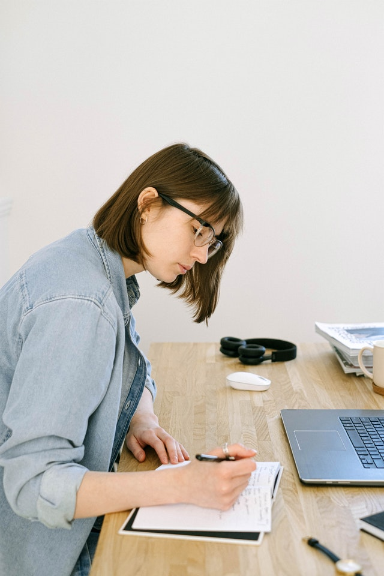

# Writing research {#WritingResearch}


```{block2, type="rmdobjectives"}
So far,
you have learnt to
ask a RQ, 
identify different ways of obtaining data,
design the study,
collect the data
describe the data,
summarise data graphically and numerically,
understand the tools of inference,
to form *confidence intervals*,
and
to perform *hypothesis tests*.

**In this chapter**,
you will learn to write about your own research.
You will learn to:

* write research.
* appropriately structure your research writing.

```


```{r echo=FALSE, fig.cap="", fig.align="center", fig.width=3, out.width="35%"}
SixSteps(6, "Writing")
```


<!-- ## Resources -->


<!-- http://www.ieee-holm.org/h2017/Bad_Presentation_Example.pdf -->

<!-- https://www.northwestern.edu/climb/resources/oral-communication-skills/designing-PowerPoint-slides.html -->

<!-- https://m.youtube.com/watch?v=8L3yIghclys -->

<!-- https://m.youtube.com/watch?v=Iwpi1Lm6dFo: -->
<!-- Five design principles to optimise PPT principles -->

<!-- https://m.youtube.com/watch?v=eLGLtnRopJM -->

<!-- * One message per slide -->
<!-- * No text sentences: Text + talking = no remembering. So short snippets of text + images -->
<!-- * SIZE: Eyes drawn to largest text... but eyes drawn to largest text! Important stuff in larger text! Remove titles on sliders except for new concepts  -->
<!-- * Contrast (to steer focus): Fade dot points not being used, as eyes follow the darker contrast! Students will know where to focus -->
<!-- * Six or fewer objectives per slide; Remove slide numbers? (Helpful for me though?) -->
<!-- * Dark background: Black ground, eyes relax, people look at *me* as presenter. I am the presentation, slides as visual aids. -->
<!-- * Prob means more slides... but more slides is not the problem... its the number of objects! -->
<!-- * Final summary slide: Words, ask questions, call out answer -->


<!-- PowerPoint (and similar) software has a bad reputation:  -->
<!-- The phrase 'Death by PowerPoint' has some truth behind it! -->
<!-- Many people have given advice---often conflicting---about how to best prepare PowerPoint slides without boring the audience. -->
<!-- Here, we try to give some tips, but don't claim to be an expert: -->

<!-- * Do not have too much text on a slide: -->
<!--   * Restrict the information on each slides to about six objects. -->
<!--   * Use a large font size. -->
<!-- * Using pictures and images is useful. -->


## Introduction {#Chap37-Intro}


<!-- Text wrap from: https://stackoverflow.com/questions/43551312/wrap-text-around-plots-in-markdown -->
<!-- Trick from: https://blog.earo.me/2019/10/26/reduce-frictions-rmd/ -->
`r if (knitr::is_latex_output()) '<!--'`
```{r, echo=FALSE, out.width= "30%", out.extra='style="float:right; padding:10px"'}

```
`r if (knitr::is_latex_output()) '-->'`


All students in scientific, engineering and health professions 
need to *read* the research of others;
that's how to stay up-to-date with the discipline.
Some students will also need to *write* about 
their own research or the research of others.
To do so,
understanding the language of research is 
important.

Formal approaches to writing and reporting research exist,
for experimental
([CONSORT](http://www.consort-statement.org/))
and for observational studies
([STROBE](https://www.strobe-statement.org)).
We will not delve into these specifically
(partly because of the wide range of disciplines adopting this book),
but these websites are useful resources.

Some information in this chapter is based on 
Dr. Michael Lufaso's notes (http://www.unf.edu/~michael.lufaso/chem4931/lecture3.pdf)
and
Prof. Tony Roberts (http://www.maths.adelaide.edu.au/anthony.roberts/LaTeX/ltxwrite.php) notes.


## General tips

A series of experimental studies concludes that

> ... a majority of undergraduates admit to 
> deliberately increasing the complexity of their vocabulary 
> so as to give the impression of intelligence.
>
> --- @oppenheimer2006consequences, p. 139

That is,
study like to use fancy words to sounds clever.
One conclusion of the study was that using 
'fancy' language *does not work*:
'needless complexity leads to negative evaluations...'
(@oppenheimer2006consequences, p. 151).
One recommendation by the author is to

> ... write clearly and simply if you can, 
> and you'll be more likely to be thought of as intelligent.
>
> --- @oppenheimer2006consequences, p. 153

With this in mind,
a scientific paper:

* **Should** use simple, clear but technically correct language.  
* **Should** present the facts in an unbiased manner.
* **Should** be clear, concise and complete.
* **Should** use facts to make statements.
* **Should** be complete enough that other professionals can repeat the study.

Likewise,
a scientific paper:

* **Should not** be haphazard, jumbled or illogical. 
* **Should not** be used as a personal soapbox.
* **Should not** reach conclusions not based on the reported evidence.
* **Should not** be for insiders only.
* **Should not** overstate what has been learnt from the study.


## Article structure

Many scientific papers have these (or similar) sections,
though it varies a lot by discipline:

* Title and authors.
* **A**bstract: 
  A summary of the whole paper, without details.
* **I**ntroduction: 
  *Why* was the study done, and *what* was hoping to be achieved?
* **M**aterials and method: *How* was the study done?
* **R**esults: What was found?
* **D**iscussion (or Summary, or Conclusions): What does it *mean*?
* References (or Bibliography).

Often the acronym AIMRaD or IMRaD is used to help recall these sections.
These components 
capture certain parts of the six-step research process in this book
(Fig. \@ref(fig:ReportStructure)).


```{r ReportStructure, echo=FALSE, fig.cap="The connection between the paper and the steps we have studied.  The Abstract briefly covers all aspects of the study, and the Discussion combines elements from all areas also.", fig.align="center", fig.height=6}
par( mar=c(0.5, 0.5, 0.5, 0.5))
openplotmat()

pos <- array(NA, dim=c(13, 2))
pos[1, ] <- c(0.75, 0.80) ### PAPER
pos[2, ] <- c(0.75, 0.65) 
pos[3, ] <- c(0.75, 0.50) 
pos[4, ] <- c(0.75, 0.35) 
pos[5, ] <- c(0.75, 0.20) 

pos[6, ] <- c(0.25, 0.80) ### PROCESS
pos[7, ] <- c(0.25, 0.65) 
pos[8, ] <- c(0.25, 0.50) 
pos[9, ] <- c(0.25, 0.35) 
pos[10,] <- c(0.25, 0.20) 
pos[11,] <- c(0.25, 0.05)

pos[12,] <- c(0.75, 0.95) 
pos[13,] <- c(0.25, 0.95)

# TITLES
textrect( pos[12,], 
           lab="PAPER", 
           radx=0.11, 
           rady=0.025, 
           shadow.size=0
#           box.col="lightcoral",
#           lcol="lightcoral"
)
textrect( pos[13,], 
           lab="PROCESS", 
           radx=0.11, 
           rady=0.025, 
           shadow.size=0
#           box.col="lightcoral",
#           lcol="lightcoral"
)


# Link.
curvedarrow(from=pos[6,], to=pos[2,], 
            curve=0, 
#            code=3,
            lty=1, 
            lwd=2)
curvedarrow(from=pos[7,], to=pos[3,], 
            curve=0, 
#            code=3,
            lty=1, 
            lwd=2)
curvedarrow(from=pos[8,], to=pos[3,], 
            curve=0, 
#            code=3,
            lty=1, 
            lwd=2)
curvedarrow(from=pos[9,], to=pos[4,], 
            curve=0, 
#            code=3,
            lty=1, 
            lwd=2)
curvedarrow(from=pos[10,], to=pos[4,], 
            curve=0, 
#            code=3,
            lty=1, 
            lwd=2)
curvedarrow(from=pos[11,], to=pos[4,], 
            curve=0, 
#            code=3,
            lty=1, 
            lwd=2)
#curvedarrow(from=pos[11,], to=pos[5,], 
#            curve=0, 
#            lty=1, 
#            lwd=2)


### TEXT
textrect( pos[1,], 
           lab="Abstract", 
           radx=0.11, 
           rady=0.025, 
           shadow.size=0,
           box.col=plot.colour,
           lcol=plot.colour)
textrect( pos[2,], 
           lab="Introduction", 
           radx=0.11, 
           rady=0.025, 
           shadow.size=0,
           box.col="lightcoral",
           lcol="lightcoral")
textrect( pos[3,], 
           lab="Method", 
           radx=0.11, 
           rady=0.025, 
           shadow.size=0,
           box.col="lightcoral",
           lcol="lightcoral")
textrect( pos[4,], 
           lab="Results", 
           radx=0.11, 
           rady=0.025, 
           shadow.size=0,
           box.col="lightcoral",
           lcol="lightcoral")
textrect( pos[5,], 
           lab="Discussion", 
           radx=0.11, 
           rady=0.025, 
           shadow.size=0,
           box.col=plot.colour,
           lcol=plot.colour)


textrect( pos[6,], 
           lab="RQ", 
           radx=0.15, 
           rady=0.025, 
           shadow.size=0,
           box.col="darkseagreen1",
           lcol="darkseagreen1")
textrect( pos[7,], 
           lab="Study design", 
           radx=0.15, 
           rady=0.025, 
           shadow.size=0,
           box.col="darkseagreen1",
           lcol="darkseagreen1")
textrect( pos[8,], 
           lab="Data collection", 
           radx=0.15, 
           rady=0.025, 
           shadow.size=0,
           box.col="darkseagreen1",
           lcol="darkseagreen1")
textrect( pos[9,], 
           lab="Description, summary", 
           radx=0.15, 
           rady=0.025, 
           shadow.size=0,
           box.col="darkseagreen1",
           lcol="darkseagreen1")
textrect( pos[10,], 
           lab="Data analysis", 
           radx=0.15, 
           rady=0.025, 
           shadow.size=0,
           box.col="darkseagreen1",
           lcol="darkseagreen1")
textrect( pos[11,], 
           lab="Report results", 
           radx=0.15, 
           rady=0.025, 
           shadow.size=0,
           box.col="darkseagreen1",
           lcol="darkseagreen1")
```


## Writing scientifically: Title

Titles are important:
they can easily discourage a reader 
from engaging with an article.
A title should be a clear description 
of the main purpose of the article,
and be:

> ...accurate, specific, concise, and informative, 
> must not contain abbreviations, 
> and must never be dull.
> 
> @PeatWriting, p. 93.

Titles sometimes pose questions
('Does asthma reduce linear growth?')
or answer questions
('Linear growth deficit in asthmatic children'; 
@PeatWriting, p. 98).


```{example ArticleTitles, name="Article title"}
A good example of a title is:

> Beauty sleep: 
> experimental study on the perceived health 
> and attractiveness of sleep deprived people
>
> --- @data:axelsson:beautysleep

```

```{example ArticleTitles2, name="Article title"}
A *poor* example of an article title is:

> The nucleotide sequence of a 3.2 kb segment of 
> mitochondrial maxicircle DNA from Crithidia fasciculata 
> containing the gene for 
> cytochrome oxidase subunit III, 
> the N-terminal part of the apocytochrome b gene 
> and a possible frameshift gene; further evidence 
> for the use of unusual initiator triplets in trypanosome mitochondria
> 
> --- @sloof1987nucleotide

```

```{block2, type="exampleExtra"}
A *very* poor example of an article title is:

> Reaction of a bidentate ligands (4,4'-dimethyl 2,2'-bipyridine) 
> with planar-chiral chloro-bridged ruthenium: 
> Synthesis of cis-dicarbonyl[4,4'-dimethyl-2,2'-bipyridine- $\kappa$ O1, 
> $\kappa$ O2]
> $\lbrace$ 2-[tricarbonyl($\eta$ 6-phenylene- $\kappa$ C1)chromium]pyridine- $\kappa$N $\rbrace$ ruthenium hexafluorophosphate
>
> --- @hijazi2013

This article was also retracted due to [unethical conduct](#Ethics) 
of one author
[@hijazi2013retracted].
```


## Writing scientifically: Abstract

The Abstract is a short section at the start of an article 
which summarises the *whole* paper;
it is *not* an introduction!
An Abstract includes the most important and interesting parts
of the research. 
The Abstract is often the most important part of any article,
as it is the only part that many people will read.

Writing  the Abstract after the paper is fully written 
is often sensible.
Some (but not all) journals require a *structured abstract*, 
where the Abstract contains sections to be briefly completed
(see Sect. \@ref(ReadExample1)).
These abstracts are usually much easier for a reader to follow.

The Standards for Reporting Diagnostic Accuracy (STARD) statement
[@cohen2017stard] list *essential* items for Abstracts;
these are (slightly adapted):

*  *Background and Objectives*:
	List the study objectives (the RQ).
* *Methods*: Describe:
  - The process of *data collection*; 
  - The *type* of study;
  - The *inclusion and exclusion criteria* for individuals;
  - The *settings* in which the data were collected;
  - The *sampling* method (e.g., random or convenience sample);
  - The tools or methods used to *collect the data*.
* *Results*: Provide
  - The number of individuals in all groups included in the analysis;
  - Estimates of precision of estimates (e.g., confidence intervals);
  - Results of analysis (e.g., hypothesis tests).
* *Discussion*: Provide
  - A general *interpretation* of the results;
  - *Implications* for practice, including the intended use of the index test;
  - Limitations of the study.

These loosely align with the six steps of research used in this book.


```{example, StructuredAbstract, name="Structured abstract"}
A research study examined the long-term effects of 
mortality after amptutation
[@data:Singh:lowerlimb].
The (structured) Abstract (slightly edited for brevity) 
is repeated below:

> *Background*: 
> Mortality after amputation is known to be extremely high 
> and is associated with a number of patient features. 
> We wished to calculate this mortality after 
> first-time lower-limb amputation 
> and investigate whether any population or treatment factors 
> are associated with worse mortality.
>
> *Objective*: To follow up individuals after lower limb amputation 
> and ascertain the mortality rate as well as 
> population or treatment features associated with mortality.
>
> *Study design*: A prospective cohort study.
>
> *Methods*: Prospective lower-limb amputations over 1 year ($N=105$)
> at a Regional Rehabilitation Centre were followed up for 3 years.
>
> *Results*: 
> After 3 years, 35 individuals in the cohort had died, 
> representing a mortality of 33%. 
> On initial univariate analysis, 
> those who died were more likely to have diabetes mellitus
> ($\chi^2 = 7.16$, $\text{df} = 1$, $p = 0.007$) 
> and less likely to have been fitted with a prosthesis 
> ($\chi^2 =5.84$, $\text{df}=1$, $p=0.016$) [...]
> Diabetes (odds ratio${}=3.04$, 
> confidence intervals${}=1.25-7.40$, $p=0.014$) 
> and absence of prosthesis-fitting 
> (odds ratio${}=2.60$, confidence interval${}=1.16-6.25$, $p=0.028$) 
> were independent predictors of mortality.
>
> *Conclusion*: Mortality after amputation is extremely high and 
> is increased in individuals with diabetes 
> or in those who are not fitted with a prosthesis after amputation.
>
> --- @data:Singh:lowerlimb, p. 545

```


## Writing scientifically: Introduction

The introduction has many purposes:

1. To gain the interest of readers, 
   and encourage them to read more of the article.
1. To set up the context and background for the paper.
1. To define the language and definitions used in the study.
1. To allow the reader to become familiar 
   with the theoretical groundwork of the subject.
1. To state the purpose of the paper: 
   Why it was written, and what the authors hope to learn.
1. To show how the research fills a gap in existing knowledge.

The introduction provides a clear statement of the study's RQ
(sometimes stated as the Purpose, Aim, Objective, etc.).
The introduction often includes a literature review too,
though sometimes a literature review is a separate section.


## Writing scientifically: Materials and methods

The Materials and Methods section explains 
how the data were obtained:

* How the *sample* was obtained.
* How the data were *collected*
  (the data collection *protocol*).
* How the data were *analysed*
  (including the software used, and the statistical methods used).
* What specialized equipment was used
  (don't list pencils, rulers, paper, etc.!).


## Writing scientifically: Results

The Results summarise what was found from the data:
The Results section:

* Shows all the relevant findings from the research.
* Presents a summary of the data set: 
  the number of cases, the number of missing values, 
  and a verbal description of all variables.
  Unless the data set is small,
  the data itself is usually not given.
  (Sometimes, the data may be presented in an Appendix,
  or in an online supplement.)
* Presents tabular, numerical and/or graphical summary 
  of the data and relationships of importance.
* Gives a brief verbal interpretation of these summaries.
* Gives the *results* from any hypothesis tests and confidence intervals.
* Identifies trends, consistencies, anomalies etc.
* Does *not* contain an interpretation or 
  explanation of the results of the tests 
  (that is the purpose of the Discussion).


## Writing scientifically: Discussion and conclusion

Sometimes, 
articles have *separate* Discussion and Conclusion sections; 
sometimes they are combined.
The Discussion section:

* Summarises the results.
* Gives a short evaluation of the results: Be concise.
* Answers the stated RQ.
* Discusses limitations (Sect. \@ref(DesignIssuesSolutions)), 
  strengths, weaknesses, problems, challenges.
* Tries to anticipate and respond to potential questions
  about the research.

Readers should reach the conclusions based on the *evidence* presented.


## Constructing tables

Good tables can be time-consuming to construct.
In general,
tables:

* **Should** be discussed (not just simply presented) in the text.
* **Should** be clear and uncluttered 
  (consider using multiple tables if necessary).
* **Should** typically have captions *above*.
* **Should** have very few horizontal lines, 
  and probably *no* vertical lines.
  (Tables produced for online reading may have different rules.)
* **Should** include units of measurement (such as kg) where appropriate.
* **Should** be able to be understood 
  without reference to the paper, as far as possible.
* **Should** make the most important comparisons easy to make.
* **Should** align the data for easy comparisons, if possible
  (for example, decimal places all beneath each other in columns).


## Constructing figures and graphs

Good figures can be hard to produce,
but their purpose should always be kept in mind:
*To display the data in the simplest, clearest possible way.*
In general,
figures:

* **Should** be discussed (not just simply presented) in the text.
* **Should** be clear and uncluttered.
* **Should** typically have captions *below*.
* **Should** includes units of measurement 
  (such as kg) where appropriate.
* **Should** be able to be understood without reference to the paper, 
  as far as possible.
* **Should** have any colours or different line types explained.
* **Should** use easy-to-read fonts and colours: 
  Make sure the writing is sufficiently large 
  when the figure is placed in the article.
* **Should not** include *chart junk* 
  such as artificial third dimensions [@su2008s].


## Other elements

Many research articles have other sections too:

* **References**
    - Give the full citations of any work referenced,
      in the required format 
      (such as 
      [APA](https://www.usc.edu.au/learn/student-support/academic-and-study-support/online-study-resources/referencing-and-academic-integrity-guide/apa), 
      [Harvard](https://www.usc.edu.au/learn/student-support/academic-and-study-support/online-study-resources/referencing-and-academic-integrity-guide/harvard), 
      etc.).
    - Organise and format references correctly: 
      Many disciplines or journals have very strict guidelines 
      for how references must be listed and formatted.
    
* **Acknowledgements**:
  Thank people who legitimately contributed to the report,
  and research funding bodies.
  One attempt 
  [@allen2019can]
  has identified many different ways in which people can contribute:
  see, for example, https://www.elsevier.com/authors/policies-and-guidelines/credit-author-statement
  
* **Appendices**
   - In the appendices, 
     place important material that would break 
     the flow of the document's narrative.
   - Appendices may include 
     large tables, images, 
     detailed discussions of technical details, ...
   - Sometimes, appendices may be placed online.


## Style

Different disciplines have their own styles.
You may need to read articles from your 
discipline or target journal to see how to write in that style.
Here are some general style recommendations:

* Use short sentences.
* Many disciplines prefer the passive voice 
  ('The blood pressure was measured using...') 
  rather than active voice 
  ('We measured the blood pressure using...'), 
  [although this is not universal](https://theconversation.com/we-should-use-i-more-in-academic-writing-there-is-benefit-to-first-person-perspective-131898). 
* Most disciplines prefer the past tense 
  ('When the concrete cylinder was...') 
  rather than the present tense ('When the concrete cylinder is...').
* Use inclusive language ('firefighter' rather than 'fireman').
* Use, but do not rely upon, the spell checker.
* Don't talk down to the reader.
* Omit any words, phrases, sentences that add nothing to the paper.
* Ensure correct content, grammar, spelling, punctuation, format.
* Check for commonly misused words: 
  there/their; your/you're; affect/effect; chose/choose; etc.
* Ensure capitalisation is correct.
* Use apostrophes (**not** apostrophe's!) correctly.
* Crucially, be unambiguous: 
  Sentences should say what they mean, 
  and should mean what they say:

> Don't write so that you can be understood;
> write so that you can't be misunderstood.
> 
> --- Attributed to William Howard Taft


```{example ShortSentences, name="Short sentences"}
The first sentence should be accessible and engaging. 
Here is a very poor first sentence:
  
> Until recently, atypical hemolytic uremic syndrome (aHUS), 
> conventionally defined in the pediatric literature 
> as a syndrome of the triad of renal failure, 
> microangiopathic hemolytic anemia, 
> and thrombocytopenia without a prodrome of hemorrhagic diarrhea, 
> has received little attention in adult practice 
> because the patients are 
> commonly given the diagnosis of 
> thrombotic thrombocytopenic purpura (TTP)
> or TTP/HUS and treated as TTP with plasma exchange, 
> augmented in refractory cases with rituximab 
> and sometimes even splenectomy.
>
> --- @tsai2014mechanistic, p. 187

```


```{block2, type="exampleExtra"}
This sentence appeared in a published article
[@PsychologyMysore]:

> 600 teachers, from both Government and Private Schools, 
> have been *drowned* by random sampling.
>
> --- @PsychologyMysore, p. 14; emphasis added

This sentence is poor:
No-one has ever been *drowned* by random sampling.
Possibly,
the authors mean that teachers were 
'overwhelmed by participation in many research studies'...

However,
later the article states:

> Using random sampling 
> a total number of 600 teachers were selected from...
>
> --- @PsychologyMysore, p. 17

So the initial wording is *wrong*,
and I suspect the sample probably wasn't *random* either!
```


## Plagiarism {#Plagiarism}

Research involves using other people's ideas and research 
to develop new conclusions,
or confirm existing conclusion.
All sources used when writing research
should be acknowledged, 
otherwise you are committing plagiarism.
The 
[Macquarie Dictionary](https://www.macquariedictionary.com.au/)
defines plagiarism as

> the appropriation or imitation of another's ideas 
> and manner of expressing them, 
> as in art, literature, etc., to be passed off as one's own.
>
> --- *The Macquarie Dictionary*: https://www.macquariedictionary.com.au/


Plagiarism is a serious offence: theft of intellectual property.
**Do not plagiarise**:

* Do not take parts of sentences or 
  complete sentences directly from papers.
* Use quotes if necessary and cite work (sparingly).
* Plagiarism does not just apply to words and text. 
  It also applies to images, ideas, etc.

Plagiarism can destroy people's careers 
and affect the reputation and status of the University.
Those caught plagiarising will be penalised.
Penalties can range from having to resubmit assignments 
and being marked down,
to failing that assignment, failing the course,
or (in very serious cases) expulsion from university.


```{example, PlagiarismEG, name="Plagiarism"}
The *Indian Journal of Dermatology* published an article
discussing plagiarism, 
in an attempt to discourage it
[@shamim2014development].
Unfortunately,
the [article was retracted](http://www.e-ijd.org/article.asp?issn=0019-5154;year=2014;volume=59;issue=5;spage=473;epage=475;aulast=Shamim)
because parts of the article were plagiarised:

> This article is being retracted as the manuscript 
> has been found to be copied 
> from [...] the dissertation entitled 
> 'Developing a comprehensive guideline for overcoming 
> and preventing plagiarism at
> the international level based on 
> expert opinion with the Delphi method' 
> by Dr. Mehdi Mokhtari.  

```


```{example, PlagiarismEG2, name="Plagiarism"}
Many examples of plagiarism in academia are given
in @shahabuddin2009plagiarism.
```


## Final comments

Finally,
excellent advice, with a humorous slant, appears
[on the offical *plain language* website of the US government](https://www.plainlanguage.gov/resources/humor/how-to-write-good/),
including these gems:

* Avoid Alliteration. Always.
* Prepositions are not words to end sentences with.
* Avoid cliches like the plague. (They're old hat.)
* Eschew ampersands & abbreviations, etc.
* Contractions aren't necessary.
* One should never generalize.
* Be more or less specific.
* Exaggeration is a billion times worse than understatement.
* Don't repeat yourself, or say again what you have said before.
* Don't use commas, that, are not, necessary.
* Never use a big word when a 
  diminutive alternative would suffice.
* Use youre spell chekker to avoid mispeling and
  to catch typograhpical errers.
* Use the apostrophe in it's proper place and 
  omit it when its not needed.
* If you reread your work, 
  you can find on rereading a great deal of 
  repetition can be avoided by rereading and editing.


## Quick review questions {#Chap37-QuickReview}

1. What is the correct word to complete this sentence? 
'The subject were told to eat [?????] snacks at about 8am.'  
`r if( knitr::is_html_output() ) {mcq( c(
            "there",
  answer =  "their",
            "they're"))}`
1. What is the correct word to complete this sentence? 
'Seedlings were transplanted [?????] pots containing
one of three different soils.'  
`r if( knitr::is_html_output() ) {mcq( c(
  answer =  "to",
            "two",
            "too"))}`
1. What is the correct word to complete this sentence? 
'Each kangaroos was observed for signs that [?????] 
tracking device caused discomfort.'  
`r if( knitr::is_html_output() ) {mcq( c(
  answer =  "its",
            "it's"))}`
1. What is the biggest problem with this sentence? 
'We took 50 samples of students; the mean age was 26.2 years.'  
`r if( knitr::is_html_output() ) {mcq( c(
            "The mean should be quoted to more decimal places",
            "The semi-colon should be a comma",
            "The subject and verb do not agree",
   answer = "There is only one sample, with 50 subjects",
            "There are spelling errors"))}`
1. What is the biggest problem with this text? 
'Subjects are not blinded. 
Because the subjects would clearly know they were in a study.'  
`r if( knitr::is_html_output() ) {mcq( c(
  answer = "This shoud all be one sentence, not two",
            "The subject and verb do not agree",
            "There are spelling errors"))}`
1. What is the biggest problem with this text? 
'The sample of pedestrians were all taken on a Thursday.'  
`r if( knitr::is_html_output() ) {mcq( c(
            "This shoud all be two sentences, not one",
  answer = "The subject and verb do not agree",
            "There are spelling errors"))}`


## Exercises {#WriteExercises}

Selected answers are available in
Sect. \@ref(WriteAnswer).
73

```{exercise WriteExercisesNHANES}

Consider the NHANES data again.
In preparing a paper about this study,
suppose 
Fig. \@ref(fig:ResultsPlot)
and
Tables \@ref(tab:ResultsTable)
were produced.
Critique these.
```


```{r ResultsPlot, echo=FALSE, fig.width=5, fig.height=4, fig.cap="A boxplot", fig.align="center"}
library(NHANES)
data(NHANES)

plot(BPSys1 ~ SmokeNow, data=NHANES, 
	xlab="",
	col="purple") 
```


```{r ResultsTable, echo=FALSE}
ResultsTable <- array( dim=c(4, 2))
colnames(ResultsTable) <- c("Mean", "Std dev")
rownames(ResultsTable) <- c("Current smoker",
                            "Current non-smoker",
                            "Difference",
                            "95% CI")

ResultsTable[1, ] <- c(206.6, 46)
ResultsTable[2, ] <- c(214.64, 48.79)
ResultsTable[3, ] <- c(8.03, "")
ResultsTable[4, ] <- c(1.25, 14.8)


if( knitr::is_latex_output() ) {
  kable(ResultsTable,
        format="latex",
      booktabs=TRUE,
      longtable=FALSE,
      align=c("l", "l"),
      caption="A table of results") %>%
    kable_styling(font_size=10)
}

if( knitr::is_html_output() ) {
  kable(ResultsTable,
        format="html",
      booktabs=TRUE,
      longtable=FALSE,
      align=c("l", "l"),
      caption="A table of results")
}

```


```{exercise WriteExercisesStudent1}
<!-- Owen Armstrong, Quinn Harding SEM1 2019 -->
In a student project at the university where I work,
the students recorded the reading speed for students 
reading a portion of text,
and compared the reading speed for two different fonts.
Their RQ was:
  
> Which font allows [...] students to read a pangram the fastest,
> between a default and what is considered to be a 'easy to read' font.

In their Abstract, 
the conclusion was:

> The Georgia font was the fastest to be read 
> and is therefore the faster of the two.


1. Explain why this is a poorly-worded RQ. 
   Rewrite the RQ.
1. Explain what is wrong with the conclusion given in the Abstract. 
   Rewrite the statement.

```


```{exercise WriteExercisesStudent2}
<!-- Ned Baker, Olivia Fowler SEM1 2019 -->
In a student project at the university where I work,
the students compared the heights that students could jump vertically,
starting from a crouch (squat) or 
standing (counter movement jump; CMJ) position.
Every student in the study performed both jumps.
Critique their numerical summary
(Table \@ref(tab:WriteExercisesProject2)).
```


```{r WriteExercisesProject2, echo=FALSE}
WEStudent1 <- array( dim=c(1, 7))
rownames(WEStudent1) <- c("")
colnames(WEStudent1) <- c("Sample size", 
                          "Mean",
                          "Standard deviation",
                          "Standard error",
                          "Confidence interval (95%)",
                          "t value",
                          "P value")
WEStudent1[1,] <- c(50,
                    7.480,
                    4.674,
                    0.661,
                    "6.152 to 8.808",
                    11.316,
                    0.000
)

if( knitr::is_latex_output() ) {
   kable(WEStudent1,
         format="latex",
         longtable=FALSE,
         caption="The information showing how much higher the (standing) jump height is compared to the squat jump",
         booktabs=TRUE) %>%
      kable_styling(font_size = 9)
}
if( knitr::is_html_output() ) {
   kable(WEStudent1,
         format="html",
         longtable=FALSE,
         caption="The information showing how much higher the (standing) jump height is compared to the squat jump",
         booktabs=TRUE)
}

```


```{exercise WriteExercisesStudent3}
<!-- Elizabeth Cross, Amy (Olivia) Grossman, Sarah Flett SEM1 2019 -->
In a student project,
the aim was 
'to determine if the proportion of males and females 
that use disposable cups on USC Campus is the same'.
The two variables observed on each person in the study were:
  
* Whether or not the person used a disposable cup;
* The sex of the person.

In reporting the results in their Abstract,
the students state:
  
> Based on the sample results, the 95% confidence interval for 
> the population mean number of disposable cups used by males and 
> females  is between  0.690 and 1.625. Meaning  that the population 
> mean is likely to fall between those two intervals.

Critique this statement.
```


```{exercise WriteExercisesStudent4}
<!-- Jake Quigg, Reece Etherington SEM1 2019 -->
In a student project,
the aim was 
'to determine if the average hang time is different 
between two types of paper plane designs'.
The two variables in the study were:
  
* The plane design (Basic Dart; Hunting Flight);
* The hang time of the flight of the plane (in seconds).

In reporting the results in their Abstract,
the students state:
  
> Very strong evidence proving a difference ($P = .000$) between the 
> Basic Dart mean hang time ($881.84\pm 140.73$ms) and the 
> Hunting Flight mean hang time ($1504.19\pm 699.86$ms). 
> 95% CI for the means of The Basic Dart ($829.29$ -- $934.39$) and the 
> Hunting Flight ($1242.86$ -- $1765.52$). 

Critique this statement.
```


```{exercise, WriteExerciseBaur}

An article
[@data:Baur2012:Firefighters]
includes this in the Abstract:

> Cardiovascular disease (CVD) accounts for 
> 45% of on-duty fatalities among firefighters, 
> occurring primarily in firefighters with 
> excess CVD risk factors in patterns 
> resembling the metabolic syndrome (MetSyn).
> Additionally, 
> firefighters have a high prevalence of obesity and 
> sedentary behavior suggesting that MetSyn is also common.
> Therefore we assessed the prevalence of MetSyn in firefighters 
> and its association with cardiorespiratory fitness (CRF) 
> in a cross-sectional study of 957 male career firefighters.
>
> --- @data:Baur2012:Firefighters, p. 2331

1. Critique Table \@ref(tab:BaurTable).
1. Critique Fig. \@ref(fig:Baur3DBar).
   What would be a better graph to use?
  
  

```
         


```{r BaurTable, echo=FALSE}
BaurTable <- array(dim=c(4, 2))
colnames(BaurTable) <- c("OR (95% CI)",
                         "$p$-value")
rownames(BaurTable) <- c("CRF",
                         "Age",
                         "CRF",
                         "Age")
BaurTable[1, ] <- c("0.691 (0.634--0.752)", "<0.0001")
BaurTable[2, ] <- c("1.037 (1.020--1.055)", "<0.0001")
BaurTable[3, ] <- c("0.693 (0.630--0.762)", "<0.0001")
BaurTable[4, ] <- c("1.002 (0.982--1.021)", "0.8713")

tab.cap <- "The OR and 95% CI of MetSyn as a function of increasing METS and age (continuous) model 1: unadjusted, model 2 adjusted for age or cardiorespiratory fitness (CRF) (METS)"

if( knitr::is_html_output() ) {
  kable(BaurTable,
      format="html",
      booktabs=TRUE,
      longtable=FALSE,
      caption=tab.cap) %>%
  kable_styling("striped", full_width = F) %>%
  pack_rows("Model 1", 1, 2) %>%
  pack_rows("Model 2", 3, 4) 
}
if( knitr::is_latex_output() ) {
  colnames(BaurTable) <- c("OR (95\\% CI)",
                         "$p$-value")
tab.cap <- "The OR and 95\\% CI of MetSyn as a function of increasing METS and age (continuous) model 1: unadjusted, model 2 adjusted for age or cardiorespiratory fitness (CRF) (METS)"
kable(BaurTable,
      format="latex",
      booktabs=TRUE,
      longtable=FALSE,
      escape=FALSE,
      caption=tab.cap) %>%
  pack_rows("Model 1", 1, 2) %>%
  pack_rows("Model 2", 3, 4) %>%
  kable_styling(font_size=10)
}
```


```{r Baur3DBar, echo=FALSE, fig.align="center", fig.cap="A graph like that in the Baur et al. paper", fig.width=8.5, fig.height=6}
Prop <- matrix( c(0, 0, 11, 0,
                  10, 22, 16, 10,
                  28, 29, 27, 25, 
                  44, 46, 48, 60),
                nrow=4, ncol=4,
                byrow=TRUE)
hist3D( x=1:4, 
        y=1:4, 
        z=Prop,
        scale=FALSE,
        space=0.5, # gap between bars
        phi=20, theta=-60, ltheta=90,
        expand=0.08,
        ticktype="detailed",
        #colvar=NULL,
        col="grey",
        border="black",
        ylab="Age category", xlab="", zlab="Proportion METS",
        zlim=c(0, 70),
        cex.axis = 1e-9,       # colvar=cols,
        bty="u"
        )

# Label age axis
text3D(x = rep(1, 4),   y = 1:4, z = rep(-4.85, 4),
       labels  = rev(c("18-29", "30-39", "40-49", "50-62")),
       add = TRUE, adj = 1)


# Label y axis
text3D(x = 1:4,   y = rep(0, 4), z = rep(-1, 4),
       labels  = c("METS>14", "12<METS<14", "10<METS<12", "METS<10"),
       add = TRUE, adj = 0)


# Labels z axis
text3D(x = rep(1, 4),   y = rep(4.85, 4), z = seq(0, 60, by=20)-1,
       labels  = seq(0, 60, by=20),
       add = TRUE, adj = 1)
```
       
       
       
```{exercise WriteExerciseBaughman}
A study
[@data:Baughman2007:SixMinuteWalk]
gave this information:

> The aim of our study was to determine 
> the range of 6MWD [6-minute walk distance]
> in an unselected group of sarcoidosis patients.
> We performed a prospective study of sarcoidosis patients 
> followed up in one tertiary sarcoidosis clinic.
>
> --- @data:Baughman2007:SixMinuteWalk, p. 208

Critique the graph in
Fig. \@ref(fig:BaughmanGraph)
which appears in the paper.
```


```{r BaughmanGraph, echo=FALSE, fig.align="center", fig.cap="A graph like that from the Baughman et al. paper", fig.width=5, fig.height=3.5}
hts <- c(3, 15, 44, 33, 22, 18, 5, 3)

out <- barplot(hts, 
        space=0.075,
        ylim=c(0, 45),
        width=1,
        xlab="Fatigue Assessment Scale",
        ylab="Number of Patients",
        col="grey",
        axes=FALSE)
axis(side=1, 
     at=seq(0, max(out)+diff(out)[1], by=diff(out)[1]),
     labels=seq(10, 50, by=5))

axis(side=2, at=seq(0, 45, by=5), las=1 )
box()
```


