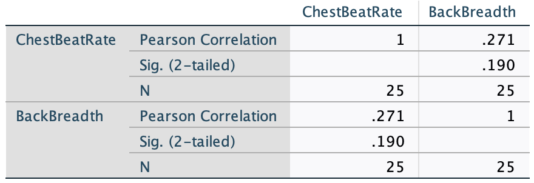

# (PART) Correlational RQs: correlation and regression {-}

# Correlation {#Correlation}


<!-- Introductions; easier to separate by format -->
```{r, child = if (knitr::is_html_output()) {'./introductions/38-Correlation-HTML.Rmd'} else {'./introductions/38-Correlation-LaTeX.Rmd'}}
```


## Introduction: red deer {#Chap33-Intro}
\index{Correlation}

So far, RQs about single variables and RQs for comparing two groups have been studied.
Comparing the mean value of a quantitative variable in two groups was studied in Sects.\ \@ref(CITwoMeans) and\ \@ref(TestTwoMeans).
Comparing the odds of an outcome of interest in two groups was studied in Sects.\ \@ref(OddsRatiosCI) and\ \@ref(TestsOddsRatio).
In this chapter (and the next), the relationship between two quantitative variables is studied *when that relationship is approximately linear*.

Consider the age and the weight of the molars of $n = 78$ male red-deer [@data:Holgate1965:StraightLine], as seen in Sect.\ \@ref(TwoQuant)
`r if( knitr::is_latex_output() ) {
  '(and Table\\ \\@ref(tab:RedDeerData)).'
} else {
  '(and the data in that section).'
}`
The data comprises two quantitative variables, and the scatter plot is repeated in Fig.\ \@ref(fig:RedDeerScatter2).

```{r RedDeerScatter2, fig.width=5.5, out.width='65%', fig.align='center', fig.height=3.5, fig.cap="Molar weight verses age for the red deer data"}
data(RedDeer)

plot(Weight ~ Age, 
     data = RedDeer,
     las = 1,
     pch = 19, 
     ylim = c(0, 5.5),
     xlim = c(4, 15),
     cex = 0.8,
     main = "Molar weight and age\nof male red deer",
     xlab = "Age (in years)",
     ylab = "Molar weight (in g)")
```

A linear relationship seems evident.
That is, knowing the age of the deer seems to provide some information about the weight of the molars.
Indeed, in Sect.\ \@ref(CorrCoefficients), the *correlation coefficient* was found to be $r = -0.584$ 

However, as we have seen, only one of the many possible sample of deer have been studied, so potentially that relationship may not actually be present in the population.
That is, perhaps the *population* correlation coefficient $\rho$ is actually 0, and the *sample* correlation coefficient is non-zero simply due to *sampling variation*.


<div style="float:right; width: 222x; border: 1px; padding:10px">

</div>


## Statistical hypotheses and the hypothesistest {#CorrelationTesting}
\index{Hypothesis testing!correlation coefficient}

As usual, questions can be asked about the relationship between the variables in the *population*, as measured by the unknown *population* correlation coefficient:

> In the population, is there a relationship between the value of $y$ and the value of $x$?

In the context of the red-deer data, the RQ is:

> In male red deer, is there a relationship between molar weight and age?

More specifically, we could ask a *one-tailed* research question:

> In male red deer, does molar weight *decrease* as age increases?


This is a *one-tailed* RQ, about the population parameter $\rho$.
Clearly, the *sample* correlation coefficient $r$ for the red-deer data is not zero, and the RQ is effectively asking if sampling variation is the reason for this.
The null hypotheses is:

* $H_0$: $\rho = 0$.

The parameter is $\rho$, the population correlation coefficient.
This hypothesis is the 'no relationship' position, which proposes that the population correlation coefficient is zero, and the sample correlation coefficient is not zero due to sampling variation.
The alternative hypothesis is:

* $H_1$:  $\rho < 0$ \quad (*one-tailed* test, based on the RQ).

As usual, initially *assume* that $\rho = 0$ (from $H_0$), then describe what values of $r$ could be *expected*, under that assumption, across all possible samples (sampling variation).
Then the *observed* value of $r$ is compared to the expected values to determine if the value of $r$ supports or contradicts the assumption.

For a correlation coefficient, the sampling distribution of $r$ does not have a normal distribution^[For those interested: the value of $r$ only varies between $-1$ and $1$, so cannot have a normal distribution. A transformation of $r$ *does* exist that has an approximate normal distribution and *standard error*.], and the software output does not even provide a standard error, so we will not discuss CIs for the correlation coefficient.

The output (Fig.\ \@ref(fig:RedDeerCorrelationjamovi2)) contains the relevant $P$-value.
The *two*-tailed $P$-value for the test is less than $0.001$, so the *one*-tailed $P$ value will be less than $0.001/2 = 0.0005$.
*Very strong evidence* exists to support $H_1$ (that the correlation in the population is less than zero).
We write:

> The sample presents very strong evidence (one-tailed $P < 0.0005$) that the molar weight decreases as the age of the male red deer increases ($r = -0.584$; $n = 78$) in the population.

Notice the three features of writing conclusions again:
An *answer to the RQ*; evidence to support the conclusion ('one-tailed $P < 0.0005$'; here no test statistic is given in the output); and some *sample summary information* ('$r = -0.584$; $n = 78$').


```{r RedDeerCorrelationjamovi2, fig.cap="jamovi output for the red-deer data", fig.align="center", out.width='70%'}
knitr::include_graphics("jamovi/RedDeer/RedDeer-Correlation.png")
```


::: {.tipBox .tip data-latex="{iconmonstr-info-6-240.png}"}
The evidence suggests that the correlation coefficient is *not zero* (in the population).
However, a *non-zero* correlation doesn't necessarily mean a *strong* correlation exists.
The correlation may be weak in the population (as estimated by the value of $r$), but evidence exists that the correlation is *not zero* in the *population*.

That is, the test is about statistical significance, not practical importance.
:::


## Statistical validity conditions {#ValidityCorrelation}
\index{Statistical validity!correlation coefficient}

As usual, these results hold under certain conditions.
The conditions for which the test is statistically valid are:

1. The relationship is approximately linear.
1. The variation in the response variable is approximately constant for all values of the explanatory variable.
1. The sample size is at least $25$.

The sample size of $25$ is a rough figure; some books give other values.


::: {.example #StatisticalValidityDeer name="Statistical validity"}
For the red-deer data, the scatterplot 
`r if (knitr::is_latex_output()) {
   '(Fig.\\ \\@ref(fig:RedDeerScatter))'
} else {
   '(Fig.\\ \\@ref(fig:RedDeerScatter))'
}`
shows that the relationship is approximately linear, so using a correlation coefficient is appropriate.
For the hypothesis test, the variation in molar weights doesn't seem to be obviously getting larger or smaller for older deer, and the sample size is also greater than $25$.
The test in Sect.\ \@ref(CorrelationTesting) is statistically valid.
:::


<iframe src="https://learningapps.org/watch?v=pd07ft8ec22" style="border:0px;width:100%;height:500px" allowfullscreen="true" webkitallowfullscreen="true" mozallowfullscreen="true"></iframe>


## Example: removal efficiency {#Removal-Efficiency}


<div style="float:right; width: 222x; border: 1px; padding:10px">

</div>


In wastewater treatment facilities, air from biofiltration is passed through a membrane and dissolved in water, and is transformed into harmless byproducts.
The removal efficiency $y$ (in %) may depend on the inlet temperature (in $^\circ$C; $x$).
A RQ is

> In treating biofiltation wastewater, is the removal efficiency associated with the inlet temperature?

The population parameter is $\rho$, the correlation between the removal efficiency and inlet temperature.
A scatterplot of $n = 32$ samples (Fig.\ \@ref(fig:CorrelationRemovalEfficiency), left panel) suggests an approximately linear relationship [@chitwood2001treatment; @DevoreBerk2007].

The output (Fig.\ \@ref(fig:CorrelationRemovalEfficiency), right panel) shows that the sample correlation coefficient is $r = 0.891$, and so $R^2 = (0.891)^2 = 79.4$%.
This means that about $79.4$% of the variation in removal efficiency can be explained by knowing the inlet temperature.


```{r CorrelationRemovalEfficiency, fig.cap="The relationship between removal efficiency and inlet temperature", fig.align="center", fig.width=5, fig.height=3.25, out.width=c("55%", "5%", "35%"), fig.show="hold"}
data(Removal)

plot(Removal ~ Temp, 
     data = Removal,
     main = "Removal efficiency",
     xlab = "Temperature (degrees C)",
     ylab = "Removal efficiency (%)",
     pch = 19,
     ylim = c(97.5, 99.0),
     xlim = c(5, 18),
     las = 1
     )
knitr::include_graphics("OtherImages/SPACER.png")
knitr::include_graphics("jamovi/Removal/RemovalCorrelation.png")
```

To test if a relationship exists in the population, write:  
\[
   \text{$H_0$: } \rho = 0;\quad\text{and}\quad \text{$H_1$: } \rho \ne 0.
\]
The alternative hypothesis is two-tailed (as implied by the RQ).
The software output (Fig.\ \@ref(fig:CorrelationRemovalEfficiency), right panel) shows that $P < 0.001$.
We conclude:

> The sample presents very strong evidence (two-tailed $P < 0.001$) that removal efficiency depends on the inlet temperature ($r = 0.891$; $n = 32$) in the population.

The relationship is approximately linear, there is no obvious non-constant variance, and the sample size is larger than $25$, so the hypothesis test results is statistically valid.


## Chapter summary {#Chap34-Summary}

In this chapter, *correlation* was used to describe the *strength* and direction of *linear* relationships between two *quantitative* variables.

*Correlation coefficients* (denoted $r$ in the sample; $\rho$ in the population) are always between $-1$ and $+1$.
*Positive* values denote *positive* relationships between the two variables: as one values gets larger, the other tends to get larger too.
*Negative* values denote *negative* relationships between the two variables: as one values gets larger, the other tends to get *smaller*.
Values close to $-1$ or $+1$ are very strong relationships; values near zero shows very little linear relationship between the variables.
Hypothesis tests for $r$ can be conducted using software.

Sometimes, $R^2$ is used to describe the relationship: it indicates what percentage of the variation in the response variable can be explained by knowing the value of the explanatory variables.


`r if (knitr::is_html_output()){
  'The following short video may help explain some of these concepts:'
}`


<div style="text-align:center;">
<iframe width="560" height="315" src="https://www.youtube.com/embed/ZHwFJkpokMk" frameborder="0" allow="accelerometer; encrypted-media; gyroscope; picture-in-picture"></iframe>
</div>


## Quick review questions {#Chap34-QuickReview}

::: {.webex-check .webex-box}
A study of Chinese paediatric patients [@wong2018correlation] studied the relationship between the $6$-minute walk distance ($6$MWD) and maximum oxygen uptake (VO$2$~max~) for $n = 29$ patients.
The correlation coefficient is reported as $r = 0.457$, and the corresponding $P$-value as $P = 0.013$.

1. What is the $x$-variable? \tightlist
`r if( knitr::is_html_output() ) {
   longmcq( c(
     answer = "6-minute walk distance",
     "Maximum oxygen uptake"
) )}`
1. True or false: Since the $P$-value is small, the correlation is quite strong.
`r if( knitr::is_html_output() ) {
   torf(answer=FALSE)
}`
1. How is the relationship best described?
`r if( knitr::is_html_output() ) {
   longmcq( c(
      "Negative",
     answer = "Positive"
) )}`
1. What is the value of $R^2$ (to one decimal place, expressed as a percentage)?
`r if( knitr::is_html_output() ) {fitb(answer = 20.9, num=TRUE, tol=0.1)}`
1. For statistical validity, what do we need to *assume* to be true?
`r if( knitr::is_html_output() ) {longmcq( c(
  "The response variable has a normal distribution",
  "The explanatory variable has a normal distribution",
  "The sample size is larger than 25",
  answer = "A linear relationship exists between the variables"
) )}`
1. True or false? Since $P$ is small, the relationship must be very strong.
`r if( knitr::is_html_output() ) {
   torf(answer=FALSE)
}`
:::


## Exercises {#CorrelationExercises}

Answers to odd-numbered exercises are available in App.\ \@ref(Answers).


::: {.exercise #NEEDNEW}
NEED NEW EXERCISE.
About drawing or estimating linear relationships from scatterplot?
:::

::: {.exercise #LimeTrees}
[*Dataset*: `Lime`]
Consider the scatterplot in Fig.\ \@ref(fig:LimeTreesScatter), for the foliage biomass of lime trees.

1. Describe the relationship.
2. Would a correlation coefficient be appropriate?
   Explain.
:::


::: {.exercise #CorTestDrug}
A study of $n = 30$ paramedicine students examined the relationship between the amount of stress experienced while performing drug-dose calculations (measured using the State–Trait Anxiety Inventory (STAI)), and length of work experience [@leblanc2005paramedic].

1. Write the hypotheses for testing for a relationship between the STAI score and the length of work experience.
1. The article gives the correlation coefficient as $r = 0.346$ and $P = 0.18$.
   What do you conclude?
1. What must be *assumed* for the test to be statistically valid?
:::


::: {.exercise #CorTestDogs}
[*Dataset*: `Dogs`]
A study of Phu Quoc Ridgeback dogs (*Canis familiaris*) recorded many measurements of the dogs, including body length and body height [@quan2017relation].
The scatterplot for the relationship is shown in Fig.\ \@ref(fig:DogsScatter) (left panel), and the jamovi output in Fig.\ \@ref(fig:DogsScatter) (right panel).
In this example, it does not matter which variable is used as $x$ or $y$.

1. Describe the relationship.
2. Taller dogs might be expected to be longer.
   To test this, write the hypotheses.
3. Perform the test, using the output.
   Write a conclusion.
4. Is the test statistically valid?
:::


```{r DogsScatter, fig.align = "center", fig.cap = "Phu Quoc ridgeback dogs: Left: a scatterplot of the body height vs body length. Right: jamovi output", fig.width=c(4, 5), fig.height=3.25, out.width=c("50%", "5%", "40%"), fig.show="hold"}
data(Dogs)

plot( jitter(BL) ~ jitter(BH),
      data = Dogs,
      xlab = "Body length (in cm)",
      ylab = "Body height (in cm)",
      main = "Body height vs body length\nfor Phu Quoc ridgeback dogs",
      pch = 19,
      las = 1,
      ylim = c(44, 65),
      xlim = c(35, 60) )
knitr::include_graphics("OtherImages/SPACER.png")
knitr::include_graphics("jamovi/Dogs/Dogs-correlation-jamoviTest.png")
```


::: {.exercise #CorrelationSoftdrink}
[*Dataset*: `SDrink`]
A study examined the time taken to deliver soft drinks to vending machines [@others:Montgomery:regressionanalysis] using a sample of size $n = 25$ (Fig.\ \@ref(fig:SoftdrinkPlotsVoids), left panel).
To perform a test of the correlation coefficient, are the statistical validity conditions met?
:::


```{r SoftdrinkPlotsVoids, fig.cap="The time taken to deliver soft drinks to vending machines", fig.align="center", fig.width=9, fig.height=3.5, out.width="100%"}
par( mfrow = c(1, 2))

data(SDrink)

plot(Time ~ Cases, 
     data = SDrink,
     xlab = "Number of cases of product stocked",
     ylab = "Time to service machine (in mins)",
     main = "The relationship between service time\nand number of cases of soft drink sold",
     xlim = c(0, 30),
     ylim = c(0, 80),
     las = 1,
     pch = 19)
abline( coef( lm(Time ~ Cases, 
                 data = SDrink)), 
        col = "grey")

###

data(Bitumen)

plot(AirVoids ~ Bitumen, 
     data = Bitumen,
     pch = 19,
     xlab = "Bitumen content by weight (%)",
     ylab = "Air voids by volume (%)",
     main = "The relationship between air voids\nand bitumen content",
     las = 1,
     xlim = c(4.7, 5.4),
     ylim = c(3.5, 5.5)
     )
```


::: {.exercise #CorrelationExerciseBitumen}
[*Dataset*: `Bitumen`]
A study of hot mix asphalt [@data:Panda2018:Bitumen] created $n = 42$ samples of asphalt and measured the volume of air voids and the bitumen content by weight (Fig.\ \@ref(fig:SoftdrinkPlotsVoids), right panel).

1. Using the plot, estimate the value of $r$.
1. The value of $R^2$ is $99.29$%.
   What is the value of $r$? (Hint: Be careful!)
1. Would you expect the $P$-value testing $H_0$: $\rho=0$ to be small or large? 
   Explain.
1. Would the test be statistically valid?
:::


::: {.exercise #CorrelationExercisePunting}
[*Dataset*: `Punting`]
A study (@MyersRegression, p. 75) of American footballers measured the right-leg strengths $x$ of 13 players (using a weight lifting test), and the distance $y$ they punted a football with their right leg (Fig.\ \@ref(fig:PuntPlotCor), left panel).
Use the jamovi output (Fig.\ \@ref(fig:PuntPlotCor), left panel) to answer these questions.

1. Compute the value of $R^2$, and explain what this means.
1. Perform a hypothesis test to determine if a *positive* correlation exists between punting distance and right-leg strength.
:::


\begin{minipage}{0.45\textwidth}%
\centering%
```{r PuntPlotCor2, results='hide', fig.width=4, fig.height = 3.5, out.width='90%'}
data(Punting)

plot(Punt ~ Right, 
     data = Punting,
     las = 1,
     xlab = "Right leg strength (in pounds)",
     ylab = "Punting distance (in feet",
     pch = 19,
     xlim = c(110, 180),
     ylim = c(100, 200)
)
abline( 
  coef( 
    Punt.lm <- lm( Punt ~ Right, 
                   data = Punting)), 
  lwd = 2, 
  col = "grey")
```
\captionof{figure}{Scatterplot of punting distance and right leg strength\label{fig:PuntPlotCor}}
\end{minipage}
\hspace{0.1\textwidth}
\begin{minipage}{0.45\textwidth}%
```{r, out.width='85%'}
knitr::include_graphics("jamovi/Punting/Punting-Correlation.png")
```
\captionof{figure}{jamovi output for the punting data\label{fig:Puntingjamovi}}
\end{minipage}


```{r PuntOutputRCor, results='hide'}
with(Punting, 
     cor.test(Punt, Right))
```


<!-- The figure for LaTeX is in the minipage (combined with data table), so only need show it for the HTML -->
`r if (knitr::is_latex_output()) '<!--'`
```{r PuntPlotCor, results='hide', fig.width=5, fig.height=3.5, fig.align="center", fig.cap="Punting distance and right leg strength", fig.width=5, fig.height=3.5}

plot(Punt ~ Right, 
     data = Punting,
     las = 1,
     xlab = "Right leg strength (in pounds)",
     ylab = "Punting distance (in feet",
     pch = 19,
     xlim = c(110, 180),
     ylim = c(100, 200)
)
abline( 
  coef( 
    Punt.lm <- lm( Punt ~ Right, 
                   data = Punting)), 
  lwd = 2, 
  col = "grey")
```
`r if (knitr::is_latex_output()) '-->'`


`r if (knitr::is_latex_output()) '<!--'`
```{r Puntingjamovi, fig.cap="jamovi output for the punting data", fig.align="center", out.width="45%"}
knitr::include_graphics("jamovi/Punting/Punting-Correlation.png")
```
`r if (knitr::is_latex_output()) '-->'`


::: {.exercise #CorrelationExercisesGorillas}
[*Dataset*: `Gorillas`]
(These data were also seen in Exercise\ \@ref(exr:TwoQuantExercisesGorillas).)
A study [@wright2021chest] examined $25$ gorillas and recorded information about their chest beating and their size (measured by the breadth of the gorillas' backs).
The relationship is shown in a scatterplot in Fig.\ \@ref(fig:GorillaWindmillPlot) (left panel).
Using the output (Fig.\ \@ref(fig:GorillaCorrelationjamoviTest)), determine the value of $r$ and $R^2$.
Perform a hypothesis tests, and make a conclusion about the relationship between the chest beating and size of gorillas.
:::


```{r GorillaCorrelationjamoviTest, fig.cap="Output for the gorilla data", fig.align="center", out.width="55%"}
knitr::include_graphics("jamovi/Gorillas/GorillasCorrelation-jamovi.png")
#
```


::: {.exercise #CorrelationExercisePossums}
[*Dataset*: `Possums`]
A study of Leadbeater's possums in the Victorian Central Highlands [@data:Williams2022:Possums] recorded, among other information, the body weight of the possums and their location, including the elevation of the location.
A scatterplot of the data and the jamovi output are shown in Fig.\ \@ref(fig:PossumsScatterjamovi).
Using the output (Fig.\ \@ref(fig:PossumsScatterjamovi)), determine the value of $r$ and $R^2$.
Perform a hypothesis tests, and make a conclusion about the relationship between the chest beating and size of gorillas.
:::

```{r PossumsScatterjamovi, fig.cap="The relationship between weight of possums and the elevation of their location. Left: scatterplot. Right: jamovi output", fig.align="center", fig.width=5, fig.height=3.5, out.width=c("50%", "45%"), fig.show="hold"}
data(Possums)

plot(Wgt ~ DEM, 
     data = subset(Possums, Sex=="Male"),
     xlab = "Elevation (in m)",
     ylab = "Body weight (in g)",
     main = "Body weight and elevation\nfor male Leadbeaters possums",
     las = 1,
     xlim = c(600, 1600),
     ylim = c(100, 170),
     pch = 19)

knitr::include_graphics("jamovi/Possums/Possums-Correlation-jamovi.png")
```


:::{.exercise #CorrelationExerciseSoil}
[*Dataset*: `Soils`]
The *California Bearing Ratio* (CBR) value is used to describe soil-sub grade for flexible pavements (such as in the design of air field runways).
One study [@talukdar2014study] examined the relationship between CBR and other properties of soil, including the plasticity index (PI, a measure of the plasticity of the soil).
The scatterplot from 16 different soil samples from Assam, India, is shown in  Fig.\ \@ref(fig:SoilPlotCor).

1. Using the plot, take a guess at the value of $r$.
1. The value of $R^2$ is $67.07$%.
   What is the value of $r$? (Hint: Be careful!)
1. Would you expect the $P$-value testing $H_0$: $\rho = 0$ to be small or large? 
   Explain.
1. Would the test be statistically valid?
:::


```{r SoilPlotCor, fig.cap="The relationship between CBR and PI in sixteen soil samples", fig.align="center", fig.width=5, fig.height=3.5}
data(Soils)

plot(CBR ~ PI, 
     data = Soils,
     pch = 19,
     xlab = "Plasticity index (PI)",
     ylab = "CBR",
     las = 1,
     xlim = c(6.0, 8.5),
     ylim = c(5.5, 6.2)
     )
```


::: {.exercise #GraphsTypingCor}
[*Dataset*: `Typing`]
The `Typing` dataset contains four variables: typing speed (`mTS`), typing accuracy (`mAcc`), age (`Age`). and sex (`Sex`) for $1301$ students [@pinet2022typing].
Is there evidence of a relationship between the mean typing speed and mean accuracy?
Explain.
:::


<!-- QUICK REVIEW ANSWERS -->
`r if (knitr::is_html_output()) '<!--'`
::: {.EOCanswerBox .EOCanswer data-latex="{iconmonstr-check-mark-14-240.png}"}
**Answers to in-chapter questions:**
\textbf{Answers to \textit{Quick Revision} questions:}
**1.** $6$MWD.
**2.** False.
**3.** Positive.
**4.** $20.9$.
**5.** A linear relationship exists between the variables.
:::
`r if (knitr::is_html_output()) '-->'`

