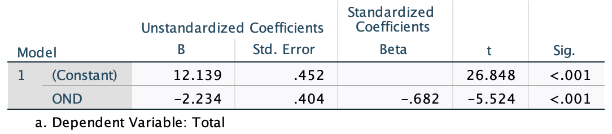
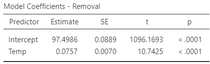
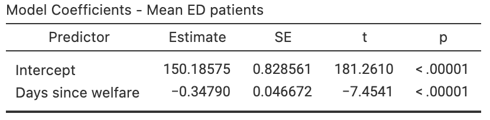

# Regression {#Regression}


<!-- Introductions; easier to separate by format -->
```{r, child = if (knitr::is_html_output()) {'./introductions/39-Regression-HTML.Rmd'} else {'./introductions/39-Regression-LaTeX.Rmd'}}
```


```{r}
data(RedDeer)
```


## Introduction {#Chap35-Intro}

Chapters\ \@ref(TwoQuant) and \@ref(Correlation) studied *correlation*, which measures the *strength* of the *linear* relationship between two quantitative variables $x$ (an explanatory variable) and $y$ (a response variable).
We now study *regression*, which describes *what* the linear relationship is between $x$ and $y$.
The relationship is described mathematically, using an *equation*, which allows us to:

1. *Predict* values of $y$ from given values of $x$ (Sect.\ \@ref(RegressionForPrediction)); and
2. *Understand* the relationship between $x$ and $y$ (Sect.\ \@ref(RegressionForUnderstanding)).

Of course, any prediction will not be a perfect prediction, due to natural variation in the data.\index{Natural variation}
In other words, for any given value of $x$, many possible values of $y$ could be observed.
This means that the prediction is actually a prediction of the *mean* of all the possible values of $y$ that could be observed for that given value of $x$.

An example of a linear regression equation, describing the relationship between the observed values of an explanatory variable $x$ and the observed values of a response variable $y$, is  
\[
  \hat{y} = -4  + (2\times x), \qquad\text{usually written}\qquad \hat{y} = -4  + 2x.
\]
The notation $\hat{y}$ refers to the *mean predicted* value of the response variable $y$, given a value of $x$.
That is, for some value of $x$, many values of $y$ are possible and $\hat{y}$ is the value that regression equation predicts as the mean of all those possible values. 


::: {.importantBox .important data-latex="{iconmonstr-warning-8-240.png}"}
$y$ refers to the values of the response variable observed from individuals.
$\hat{y}$ refers to *mean predicted* values of $y$ for some given value of $x$.
:::


:::: {.pronounceBox .pronounce data-latex="{iconmonstr-microphone-7-240.png}"}
$\hat{y}$ is pronounced as 'why-hat'; the 'caret' above the $y$ is called a 'hat', and is used to denote a *predicted* value (of $y$).
:::


More generally, the equation of a straight line is  
\[
   \hat{y} = b_0 + (b_1 \times x), \qquad\text{usually written}\qquad \hat{y} = b_0 + b_1 x
\]
where $b_0$ and $b_1$ are (unknown) numbers estimated from sample data.
Notice that $b_1$ is the number multiplied by $x$.
In the example above, $b_0 = -4$ and $b_1 = 2$.


::: {.example #RegressionGirlsHt name="Regression equations"}
A report on the growth of Australian children [@data:AustralianGirls] found an approximate linear relationship between the age of girls in years $x$ and their height in cm $y$ For girls between four and seven years of age.
The regression equation was approximately  
\[
   \hat{y} = 73 + 7x.
\]
In this equation, $b_0 = 73$ and $b_1 = 7$.
The regression equation *predicts* the *mean* height for any given age $x$.

The regression equation is teh same when written as  
\[
   \hat{y} = 7x + 73.
\]

:::


::: {.thinkBox .think data-latex="{iconmonstr-light-bulb-2-240.png}"}
Consider the regression equation $\hat{y} = -0.0047x + 2.1$.\label{thinkBox:RegressionCoefs}
What are the values of $b_0$ and $b_1$?
(Be careful!)

`r if (knitr::is_latex_output()) '<!--'`
`r webexercises::hide()`
$b_0 = 2.1$ and $b_1 = -0.0047$.
Remember: $b_1$ is the number multiplied by the $x$, and that $b_0$ is the number by itself.

Some software and some journal papers write regression equations with the value of $b_0$ first, and some with the value of $b_1$ first. 
The *order* is not important.
`r webexercises::unhide()`
`r if (knitr::is_latex_output()) '-->'`
:::


## Linear equations: review {#RegressionEquationsReview}
\index{Linear equations}\index{Regression}

To introduce, or revise, the idea of a linear equation, consider the (artificial) data in 
`r if (knitr::is_latex_output()) {
   'Fig.\\ \\@ref(fig:ExampleScatterLATEX) (left panel),'
} else {
   'Fig.\\ \\@ref(fig:ExampleScatterHTML),'
}`
with an explanatory variable $x$ and a response variable $y$.\index{Variables!response}\index{Variables!explanatory}
In the graph, I have drawn a sensible line on the graph that seems to capture the relationship between $x$ and $y$ (your line may look a little different).
A *regression equation* is used to describe the line.\index{Regression!equation}
In the regression equation $\hat{y} = b_0 + b_1 x$, the numbers $b_0$ and $b_1$ are called *regression coefficients*,\index{Regression!coefficients} where

* $b_0$ is the *intercept* or the *$y$-intercept*.\index{Regression!equation!intercept}\index{Linear equations!intercept}
  Its value corresponds to the *predicted* mean value of $y$ when $x = 0$.
* $b_1$ is the *slope*.\index{Regression!equation!slope}\index{Linear equations!slope}
  It measures how much the value of $y$ changes, on average, when the value of $x$ *increases* by\ $1$.

We will use software to find the values of $b_0$ and $b_1$ (the formulas are tedious to use).
However, a rough approximation of the value of $b_0$ and $b_1$ can be obtained by first drawing a sensible-looking straight line through the scatterplot of the data
`r if (knitr::is_latex_output()) {
   '(Fig.\\ \\@ref(fig:ExampleScatterLATEX), left panel).'
} else {
   '(Fig.\\ \\@ref(fig:ExampleScatterHTML)).'
}`

A rough approximation of the value of the *intercept* $b_0$ is made by noting what value of $y$ the line predicts when $x = 0$.
When $x = 0$, the regression line predicts the value of $y$ to be about $2$, so the value of $b_0$ is approximately $2$.

A rough approximation of the *slope* $b_1$ is found by computing\index{Regression!equation!rise over run}  
\[
   \text{approximate slope} 
   = \frac{\text{Change in $y$}}{\text{Corresponding \emph{increase} in $x$}}
   = \frac{\text{rise}}{\text{run}}.
\]
This approximation of the slope is the *change* in the value of $y$ (the 'rise') divided by the corresponding *increase* in the value of $x$ (the 'run').


<!-- FOR LaTeX: Put this example data plot and the static rise/run in the same plot -->
<!-- FOT HTML, separate plots -->

```{r ExampleScatterHTML, fig.cap="An example scatterplot", fig.align="center", fig.width=5, fig.height=4}
if (knitr::is_html_output()){
  set.seed(5000)
x <- seq(0.5, 5, 
        length = 10)
mu <- 2 + 3 * x
y <- mu + rnorm(length(x), 0, 0.5) 
m1 <- lm(y ~ x)

plot(y ~ x, 
     xlim = c(0, 5), 
     ylim = c(0, 20), 
     las = 1, 
     xlab = expression(paste("Explanatory, ", italic(x)) ), 
     ylab = expression(paste("Response, ", italic(y)) ), 
     pch = 19)
grid()

abline( coef(m1), 
        col = "grey",
        lwd = 2)
}
```

```{r AnimateRiseRun, animation.hook="gifski", interval=0.85, dev=if (is_latex_output()){"pdf"}else{"png"}}
if (knitr::is_html_output()){
  NumPlots <- 9

  set.seed(5000)

  x <- seq(0.5, 5,  
           length = 10)
  b0 <- 2
  b1 <- 3
    
  mu <- b0 + b1 * x
  y <- mu + rnorm(length(x), 0, 0.5)

  x1 <- 1
  x2 <- 5
  y1 <- b0 + (b1 * x1) 
  y2 <- b0 + (b1 * x2)
    

  for (i in (1:NumPlots)){
    par( mar = c(5, 4, 4, 2) + 0.1)
    # DATA
    
    plot(y ~ x, 
         xlim = c(0, 5), 
         ylim = c(0, 20), 
         type = "n",
         las = 1, 
         xlab = expression(paste("Explanatory, ", italic(x)) ), 
         ylab = expression(paste("Response, ", italic(y)) ), 
         pch = 19)
    rug(1:20, 
        side = 2, 
        ticksize = -0.02)
    grid()
    points(y ~ x, 
           pch = 19) 
    
    if ( i >=2 ){ # DATA + LINE
      abline(b0, b1,
             col = "black", 
             lwd = 2)
    }
    if (i >= 3) { # DATA + LINE + x1 
      lines( c(x1, x1), 
             c(0, y1),
             lwd = 2, 
             col = "darkgrey",
             lty = 2)
    }
    
    if ( i >= 4){  # DATA + LINE + x1 + y1
      lines( c(0, x1), 
             c(y1, y1),
             lwd = 2, 
             col = "darkgrey",
             lty = 2)
    }
    
    if ( i >= 5 ){  # DATA + LINE + x1 + y1 + x2
      lines( c(x2, x2), 
             c(0, y2),
             lwd = 2, 
             col = "darkgrey",
             lty = 2)
    }
    
    if ( i >= 6) {  # DATA + LINE + x1 + y1 + x2 + y2
      lines( c(0, x2), 
             c(y2, y2),
             lwd = 2, 
             col = "darkgrey",
             lty = 2)
    }
    
    if (i >= 7 ) {  # DATA + LINE + x1 + y1 + x2 + y2 + RUN
      run <- x2 - x1
      arrows(x1, 2, 
             x2, 2,
             lwd = 2,
             length = 0.15,
             col = "darkgrey",
             code = 2)
      text( mean( c(x1, x2)), 2.5, 
            labels = bquote("Run: "~ .(x2)-.(x1) == .(run)),
            pos = 2 )  
    }
    
    if (i >= 8 ){ # DATA + LINE + x1 + y1 + x2 + y2 + RUN + RISE
      rise <- y2 - y1
      arrows(0.5, y1, 
             0.5, y2,
             lwd = 2,
             length = 0.15,
             col = "darkgrey",
             code = 2)
      text( 0.5, 
            mean( c(y1, y2)), 
            labels = bquote("Rise: "~ .(y2)-.(y1) == .(rise)),
            pos = 4 )  
    }
    
    
    if (i >= 9 ) {  # DATA + LINE + x1 + y1 + x2 + y2 + RUN + RISE + SLOPE
      slope <- rise / run
      polygon( c(2.15, 2.15, 4.85, 4.85), 
               c(6, 8, 8, 6), 
               border = NA, # No border
               col = "antiquewhite1")
      text(3.5, 
           7, 
            labels = bquote("Slope: "~ .(rise) %/%  .(run) == .(slope)) )
    }
  }
}
```


<!-- FOR LaTeX: Put this example data plot and the static rise/run in the same plot -->
```{r ExampleScatterLATEX, fig.cap="An example scatterplot. Left: Approximating $b_0$. Right: approximating $b_1$ using rise-over-run", fig.align="center", fig.width=9, fig.height=4, out.width='100%'}
set.seed(5000)
x <- seq(0.5, 5, 
         length = 10)
mu <- 2 + 3 * x
y <- mu + rnorm(length(x), 0, 0.5)
m1 <- lm(y ~ x)

if (knitr::is_latex_output()){
  
  par(mfrow = c(1, 2))
  
  plot(y ~ x, 
       xlim = c(0, 5), 
       ylim = c(0, 20), 
       las = 1, 
       main = expression(Approximating~italic(b)[0]),
       xlab = expression(Explanatory~italic(x) ), 
       ylab = expression(Response~italic(y) ), 
       pch = 19,
       col = "grey")
  grid()
   rug(1:20, 
      side = 2, 
      ticksize = -0.02)
  
  abline( coef(m1), 
          col = "black",
          lwd = 2)
  
  text(x = 2,
       y = 15,
       pos = 3,
       label = "Regression line")
  arrows(x0 = 2,
         x1 = 2.75,
         y0 = 15,
         y1 = 2 + 3*2.75,
         lwd = 2,
         angle = 15,
         length = 0.25,
         col = "grey")
  
  
  # Beta 0
  abline(v = 0,
         lwd = 2,
         col = "grey")
  lines( x = c(0, 0),
         y = c(0, coef(m1)[1]),
         lty = 1,
         lwd = 2,
         col = "grey")
  lines( x = c(-1, 0.45),
         y = c(coef(m1)[1], coef(m1)[1]),
         lty = 1,
         lwd = 2,
         col = "grey")
  
  arrows(x0 = 1.75,
         x1 = 0.5,
         y0 = 2.5,
         y1 = coef(m1)[1],
         #angle = 15,
         length = 0.15,
         lwd = 2)
  text(x = 1.75,
       y = 2.5,
       pos = 4,
       labels = expression(Approximate~value~of~italic(b)[0]))
  
  ######
  
  b0 <- 2
  b1 <- 3
  
  x1 <- 1
  x2 <- 5
  y1 <- b0 + (b1 * x1) 
  y2 <- b0 + (b1 * x2)
  
  NumPlots <- i <- 9
  #  for (i in (NumPlots:NumPlots)){
  
  # DATA
  plot(y ~ x, 
       xlim = c(0, 5), 
       ylim = c(0, 20), 
       type = "n",
       las = 1, 
       main = expression(Approximating~italic(b)[1]),
       xlab = expression(Explanatory~italic(x) ), 
       ylab = expression(Response~italic(y) ), 
       pch = 19)
  rug(1:20, 
      side = 2, 
      ticksize = -0.02)
  grid()
  
  
  points(y ~ x, 
         pch = 19) 
  
  if ( i >=2 ){ # DATA + LINE
    abline(b0, b1,
           col = "black", 
           lwd = 2)
  }
  if (i >= 3) { # DATA + LINE + x1 
    lines( c(x1, x1), 
           c(0, y1),
           lwd = 2, 
           col = "darkgrey",
           lty = 2)
  }
  
  if ( i >= 4){  # DATA + LINE + x1 + y1
    lines( c(0, x1), 
           c(y1, y1),
           lwd = 2, 
           col = "darkgrey",
           lty = 2)
  }
  
  if ( i >= 5 ){  # DATA + LINE + x1 + y1 + x2
    lines( c(x2, x2), 
           c(0, y2),
           lwd = 2, 
           col = "darkgrey",
           lty = 2)
  }
  
  if ( i >= 6) {  # DATA + LINE + x1 + y1 + x2 + y2
    lines( c(0, x2), 
           c(y2, y2),
           lwd = 2, 
           col = "darkgrey",
           lty = 2)
  }
  
  if (i >= 7 ) {  # DATA + LINE + x1 + y1 + x2 + y2 + RUN
    run <- x2 - x1
    arrows(x1, 2, 
           x2, 2,
           lwd = 2,
           length = 0.15,
           col = "darkgrey",
           code = 2)
    text( mean( c(x1, x2)), 
          2, 
          labels = bquote("Run: "~ .(x2)-.(x1) == .(run)),
          pos = 3 )  
  }
  
  if (i >= 8 ){ # DATA + LINE + x1 + y1 + x2 + y2 + RUN + RISE
    arrows(0.5, y1, 
           0.5, y2,
           lwd = 2,
           length = 0.15,
           col = "darkgrey",
           code = 2)
    rise <- y2 - y1
    text( 0.5, 
          mean( c(y1, y2)) + 0.5, 
          labels = bquote("Rise: "~ .(y2)-.(y1) == .(rise)),
          pos = 4 )  
  }
  #  }
}
```


Consider what happens in 
`r if (knitr::is_latex_output()) {
   'Fig.\\ \\@ref(fig:ExampleScatterLATEX) (right panel)'
} else {
   'the animation below'
}`
when the value of $x$ increases from $1$ to $5$ (an *increase* of $5 - 1 = 4$).
The corresponding values of $y$ change from $5$ to $17$ (a change of $17 - 5 = 12$).
So:  
\[
   \frac{\text{rise}}{\text{run}} 
   = \frac{17 - 5}{5 - 1}
   = \frac{12}{4} 
   = 3.
\]
The value of $b_1$ is about $3$.
The regression line is approximately $\hat{y} = 2 + (3\times x)$, usually written  
\[
  \hat{y} = 2 + 3x.
\]

::: {.importantBox .important data-latex="{iconmonstr-warning-8-240.png}"}
The regression equation has $\hat{y}$ (not $y$) on the left-hand side.
That is, the equation *predicts* the mean values of $y$, which may not be equal to the observed values (which are denoted by $y$).

A 'good' regression equation would produce predicted values $\hat{y}$ close to the observed values $y$; that is, the line passes close to each point on the scatterplot.\index{Scatterplot}
:::


The *intercept* $b_0$ has the same measurement units as the response variable.\index{Regression!equation!intercept}
The measurement unit for the *slope* $b_1$ is the 'measurement units of the response variable', per 'measurement units of the explanatory variable'.\index{Regression!equation!intercept}


:::{.example name="Measurement units of regression parameters"}
In Example\ \@ref(exm:RegressionGirlsHt), the regression line for the relationship between the age of Australian girls in years $x$ and their height (in cm) $y$ was $\hat{y} = 73 + 7x$ (for girls between four and seven years).

In this equation, the intercept is $b_0 = 73$\ cm and the slope is $b_1 = 73$\ cm/year.
:::


:::{.example name="Finding a rough approximation of the regression equation"}
For the red-deer data used in the previous chapters, a rough estimate of the regression line can be drawn on a scatterplot to estimate $b_0$ and $b_1$ (Fig.\ \@ref(fig:RedDeerRiseRun)).
The estimate of $b_0$ is roughly $4.4$.

The estimate of $b_1$, using the 'rise-over-run' idea, is $-2/10 = -0.2$.
This is a *negative* rise (i.e., a fall), since the value of $y$ is smaller as the value of $x$ increases.
(The relationship is *negative*, so the slope is *negative*.)
The rough guess of the regression line is  
\[
  \hat{y} = 4.4 - 0.2x,
\]
where $x$ is the age (in years), and $y$ is molar weight (in g).
The rough guess of the intercept $b_0$ is $4.4$\ g, while the rough guess of the slope $b_1$ is $-0.2$\ g/year.
:::


```{r RedDeerRiseRun, fig.cap="Obtaining rough guesses for the regression equation for the red-deer data. Left: Approximating $b_0$. Right: approximating $b_1$ using rise-over-run.", fig.align="center", fig.width=9, fig.height=4, out.width='100%'}
mDeer <- lm( Weight ~ Age,
             data = RedDeer) 


  par(mfrow = c(1, 2))
  
  plot(Weight ~ Age, 
       data = RedDeer,
       col = "darkgrey",
       xlim = c(-1, 15), 
       ylim = c(0, 6), 
       las = 1, 
       main = expression(Red~deer:~approximating~italic(b)[0]),
       xlab = expression(Age~italic(x) ), 
       ylab = expression(Molar~weight~italic(y) ), 
       pch = 19)
  grid()
  axis(side = 2,
       at = 4.4,
       las = 1,
       cex.axis = 0.8)

  
  abline( a = 4.4, 
          b = -0.2, 
          col = "black",
          lwd = 2)
  
  # Beta 0
  abline(v = 0,
         lwd = 2,
         col = "grey")
  lines( x = c(-2, 3),
         y = c(4.4, 4.4),
         lty = 2,
         lwd = 2,
         col = "black")
  #lines( x = c(-, 3),
  #       y = c(coef(mDeer)[1], coef(mDeer)[1]),
  #       lty = 1,
  #       lwd = 2,
  #       col = "grey")
  
  arrows(x0 = 1.75,
         x1 = 1.75,
         y0 = 5.75,
         y1 = coef(mDeer)[1],
         #angle = 15,
         length = 0.1,
         lwd = 2)
  text(x = 1.75,
       y = 5.75,
       pos = 4,
       labels = expression(Approximate~value~of~italic(b)[0]))
  
  ######
  
  b0 <-  4.4
  b1 <- -0.2 
          
  x1 <- 4
  x2 <- 14
  y1 <- b0 + (b1 * x1) 
  y2 <- b0 + (b1 * x2)
  
  # DATA
  plot(Weight ~ Age,
       data = RedDeer, 
       xlim = c(-2, 15), 
       ylim = c(0, 6), 
       type = "n",
       las = 1, 
       axes = FALSE,
       main = expression(Red~deer:~approximating~italic(b)[1]),
       xlab = expression(Age~italic(x) ), 
       ylab = expression(Molar~weight~italic(y) ), 
       pch = 19)
  axis(side = 1)
  axis(side = 2,
       at = 0:6,
       las = 1)
  axis(side = 2,
       at = c(1.6, 3.6),
       cex.axis = 0.8,
       las = 1)
  axis(side = 1,
       at = c(4, 14),
       cex.axis = 0.8,
       las = 1)
  box()
#  rug(1:20, 
#      side = 2, 
#      ticksize = -0.02)
  grid()
  
  
  points(Weight ~ Age,
         data = RedDeer,
         col = "darkgrey",
         pch = 19) 
  
    abline(b0, b1,
           col = "black", 
           lwd = 2)

    # DATA + LINE + x1 
    lines( c(x1, x1), 
           c(-2, y1),
           lwd = 2, 
           col = "black",
           lty = 2)
    
    # DATA + LINE + x1 + y1
    lines( c(-2, x1), 
           c(y1, y1),
           lwd = 2, 
           col = "black",
           lty = 2)
  
    # DATA + LINE + x1 + y1 + x2
    lines( c(x2, x2), 
           c(0, y2),
           lwd = 2, 
           col = "black",
           lty = 2)
    
    # DATA + LINE + x1 + y1 + x2 + y2
    lines( c(-2, x2), 
           c(y2, y2),
           lwd = 2, 
           col = "black",
           lty = 2)
    
    # DATA + LINE + x1 + y1 + x2 + y2 + RUN
    run <- x2 - x1
    arrows(x0 = x1, 
           y0 = 0.15, 
           x1 = x2, 
           y1 = 0.15,
           lwd = 2,
           length = 0.1,
           col = "black",
           code = 2)
    text( mean( c(x1, x2)), 
          0.15, 
          labels = bquote("Run: "~ .(x2)-.(x1) == .(run)),
          pos = 3 )
    
    # DATA + LINE + x1 + y1 + x2 + y2 + RUN + RISE
    arrows(x0 = -1.5, 
           y0 = y1, 
           x1 = -1.5, 
           y1 = y2,
           lwd = 2,
           length = 0.1,
           col = "black",
           code = 2)
    rise <- y2 - y1
    text( x =  -1.75, 
          y = mean( c(y1, y2)) + 0.5, 
          labels = "Rise: ",
          pos = 4 )  
    text( x = -1.75, 
          y = mean( c(y1, y2)) - 0.2, 
          labels = bquote( .(y2)-.(y1) ), # To get a proper negative sign
          pos = 4 )  
    text( x = -1.75, 
          y = mean( c(y1, y2)) - 0.8, 
          labels = bquote( ~~~ phantom() == phantom() - .(abs(rise))), # To get a proper negative sign
          pos = 4 )  
```


`r if (knitr::is_html_output()){
  'You may like the following interactive activity, which explores slopes and intercepts.'}`

<iframe src="https://phet.colorado.edu/sims/html/graphing-slope-intercept/latest/graphing-slope-intercept_en.html" width="600" height="450" scrolling="no" allowfullscreen="allowfullscreen"></iframe>


  
::: {.example #CycloneRegressionGuesses name="Estimating regression parameters"}
The relationship [@mypapers:dunnsmyth:glms] between the number of cyclones $y$ in the Australian region each year from 1969 to 2005, and a climatological index called the *Ocean `r readr::parse_character( c("Niño"), locale=locale(encoding="UTF-8"))` Index* (ONI, $x$), is shown in Fig.\ \@ref(fig:ONIcyclones).

When the value of $x$ is zero, the predicted value of $y$ is about $12$; $b_0$ is about $12$.
(You may get something slightly different.)
Notice that the intercept is the *predicted* value of $y$ when $x = 0$, which is *not* at the left of the graph in Fig.\ \@ref(fig:ONIcyclones).

To approximate the value of $b_1$, use the 'rise over run' idea.
When $x$ is about $-2$, the predicted mean value of $y$ is about $17$; when $x$ is about $2$, the predicted mean value of $y$ is about $8$.
The value of $x$ increases by $2 - (-2) = 4$,  while the value of $y$ changes by $8 - 17 = -9$ (a *decrease* of about $9$).
Hence, $b_1$ is approximately $-9/4 = -2.25$.
(You may get something slightly different.)

The relationship has a *negative* direction, so the slope must be *negative*.
The regression line is approximately $\hat{y} = 12 - 2.25x$.
:::

```{r ONIcyclones, fig.width=4, fig.align="center", fig.cap="The number of cyclones in the Australian region each year from 1969 to 2005, and the ONI averaged over October, November, December", fig.width=5, fig.height=4}
data(Cyclones)

plot(Total ~ OND, 
     data = Cyclones,
     xlim = c(-2, 3),
     ylim = c(0, 20),
     pch = 19,
     ylab = "Total number of cyclones",
     xlab = "ONI averaged over Oct., Nov., Dec.",
     las = 1)

clm <- lm( Total ~ OND, 
           data = Cyclones)
abline( coef(clm), 
        lwd = 2, 
        col = "grey")
grid(lty = 2)
```


The above method gives a crude approximation to the values of the intercept $b_0$ and the slope $b_1$.
In practice, *many* reasonable lines could be drawn through a scatterplot of data.
However, one of those lines is the 'best' line in some sense^[For those interested: The 'line of best fit' is the line for which the sum of the *squared* vertical distances between the observations $y$ and the predicted values $\hat{y}$ (i.e, the regression line) is as small as possible.].
Software calculates this 'line of best fit' for us.


<iframe src="https://learningapps.org/watch?v=p84zyy2ot22" style="border:0px;width:100%;height:800px" allowfullscreen="true" webkitallowfullscreen="true" mozallowfullscreen="true"></iframe>


## Fitting regression equations using software {#Regression-Software}
\index{Regression!equation!using software}

```{r}
RD.lm <- lm(Weight ~ Age, 
            data = RedDeer)
RD.b0 <- round( coef(RD.lm)[1], 3)
RD.b1 <- round( coef(RD.lm)[2], 3)
```


For the red-deer data again
`r if( knitr::is_latex_output() ) {
  '(Fig.\\ \\@ref(fig:RedDeerScatter)),'
} else {
  '(Fig.\\ \\@ref(fig:RedDeerScatter)),'
}`
part of the relevant jamovi output is shown in Fig.\ \@ref(fig:RedDeerRegressionjamoviSPSSraw).
From the output, the sample *slope* is $b_1 = `r RD.b1`$, and the sample $y$-intercept is $b_0 = `r RD.b0`$: the values of $b_0$ and $b_1$ are in the column labelled  `Estimate` in jamovi.
These are the values of the two *regression coefficients*.
The regression equation is    
\[
	\hat{y} = `r RD.b0` + (`r RD.b1`\times x),
	\qquad\text{usually written as}\qquad  
	\hat{y} = `r RD.b0` - `r abs(RD.b1)` x.
\]
These are close to the values obtained using the rough method in Sect.\ \@ref(RegressionEquationsReview).


::: {.tipBox .tip data-latex="{iconmonstr-info-6-240.png}"}
The *sign* of the slope $b_1$ and the sign of correlation coefficient $r$ are always the same.
For example, if the slope is negative, the correlation coefficient will also be negative.
:::


```{r RedDeerRegressionjamoviSPSSraw, fig.cap="The jamovi output for the red-deer data", fig.align="center", out.width=c("55%"), fig.show="hold"}
knitr::include_graphics( "jamovi/RedDeer/RedDeer-Regression.png")
#knitr::include_graphics( "SPSS/RedDeer/RedDeer-Regression.png")
```


```{r}
cyclone.lm <- lm(Total ~ OND, 
                 data = Cyclones)
```

::: {.example #RegressionCoefficients name="Regression coefficients"}
The regression equation for the cyclone data (Fig.\ \@ref(fig:ONIcyclones)) is found from the jamovi output (Fig.\ \@ref(fig:CyclonesRegressionjamoviSPSS)):  
\[
  \hat{y} = 12.14 - 2.23x,
\]
where $x$ is the ONI (averaged over October, November, December) and $y$ is the number of cyclones; that is, $b_0 = 12.14$ and $b_1 = -2.23$.
These values are close the approximations made in Example\ \@ref(exm:CycloneRegressionGuesses) ($12$ and $-2.25$ respectively).
:::


```{r CyclonesRegressionjamoviSPSS, fig.cap="The jamovi output for the cyclone data", fig.align="center", out.width=c("55%"), fig.show="hold"}
knitr::include_graphics( "jamovi/Cyclones/Cyclones-Regression.png")
#
```


`r if (knitr::is_html_output()){
  'You may like the following interactive activity, which explores regression equations.'}`

<div style="text-align:center;">
<iframe src="https://phet.colorado.edu/sims/html/least-squares-regression/latest/least-squares-regression_en.html" width="600" height="450" scrolling="no" allowfullscreen="true"></iframe>
</div>


## Using regression equation for making predictions {#RegressionForPrediction}
\index{Regression!equation!making predictions}

<div style="float:right; width: 222x; border: 1px; padding:10px">

</div>


The regression equation for the red-deer data, estimated from one of the many possible samples, is $\hat{y} = `r RD.b0` - `r abs(RD.b1)` x$, and can be used to make *predictions* of the mean value of $y$ for a given value of $x$.
For example, the equation can be used to predict the *average* molar weight for deer $10$\ years old.
Since $x$ represents the age, use $x = 10$ in the regression equation:
\begin{align*}
         \hat{y} 
         &= `r RD.b0` - (`r abs(RD.b1)`\times 10)\\
         &= `r RD.b0` - `r abs(RD.b1 * 10)` = `r RD.b0 + RD.b1*10`.
\end{align*}
Male red deer $10$ years old are predicted to have a *mean* molar weight of $`r  RD.b0 + RD.b1*10`$\ g.
Some individual deer aged $10$ will have molars weighing *more* than this, and some weighing *less* than this; the model predicts that the *mean* molar weight for male red deer aged $10$ will be about $`r RD.b0 + RD.b1*10`$\ g.

(Note: The value of $\hat{y}$ is computed using the estimates $b_0$ and $b_1$, which are in turn computed from sample data. 
Hence, the value of $\hat{y}$ is also depends on which one of the countless possible samples is used.
This means that $\hat{y}$ also has a standard error.)

Suppose we were interested in male red deer $20$ years of age; the mean predicted weight of the molars is  
\[
  \hat{y} = 4.398 - (0.181 \times 20) = 0.778,
\]
or about $0.78$\ g.
This prediction *may* be a useful prediction... but it also *may* be rubbish.

In the data, the oldest deer is aged $14.4$ years, so the regression line may not even apply for deer aged over $14.4$ years of age.
For example, the relationship may be non-linear after $14$ years of age, or red deer may not even live to $20$ years of age.
The prediction *may* be sensible... but it *may not* be either.
We don't know whether the prediction is sensible or not, because we have no data for deer aged over $14.4$ years to inform us.

Making predictions outside the range of the available data is called *extrapolation*, and *extrapolation* beyond the data may lead to nonsense predictions.
As an extreme example, deer aged $25$ would be predicted to have a mean molar weight of $-0.127$, which is clearly nonsense.


::: {.definition #Extrapolation name="Extrapolation"}
*Extrapolation* refers to making predictions outside the range of the available data.
Extrapolation beyond the data may lead to nonsense predictions.
:::


## Using regression equations for understanding relationships {#RegressionForUnderstanding}
\index{Regression!equation!for understanding}

The regression equation can be used to *understand* the relationship between the two variables.
Consider again the red-deer regression equation:  
\begin{equation}
   \hat{y}
   = 
   `r RD.b0` 
   - 
    `r abs(RD.b1)` x.
   (\#eq:RedDeerEquation)
\end{equation}
What does this equation reveal about the relationship between $x$ and $y$?


### The meaning of $b_0$

$b_0$ is the *predicted* value of $y$ when $x = 0$ (Sect.\ \@ref(Regression-Software)).
Using $x = 0$ in Eq.\ \@ref(eq:RedDeerEquation) predicts a mean molar weight of  
\[
  \hat{y} = 4.398 - (0.181\times 0) = 4.398
\]
for deer zero years of age (i.e., newborn male red deer).
This prediction is the predicted *mean* molar weight; some individual deer will have molars weights greater than this, and some less than this.
But in any case, this predicted mean may be nonsense: it is *extrapolating* beyond the data (the youngest deer in the sample is aged $4.4$ years).
Indeed, young deer are born with molars that are replaced as they grow, so the regression line does not even apply.


::: {.tipBox .tip data-latex="{iconmonstr-info-6-240.png}"}
The value of the intercept $b_0$ is sometimes (but not always) meaningless.
The value of the slope $b_1$ is usually of greater interest, as it explains the *relationship* between the two variables.
:::


### The meaning of $b_1$ {#SlopeMeaning}

The slope $b_1$ tells us how much the value of $y$ changes (on average) when the value of $x$ *increases* by one (Sect.\ \@ref(Regression-Software)).
For the red-deer data, $b_1$ tells us how much the molar weight changes (on average) when age increases by one year.
Specifically, each extra year older is associated with an average change of $`r RD.b1`$\ g in molar weight; that is, a *decrease* in molar weight by a mean of $`r abs(RD.b1)`$\ g.
The molars of some individual deer will lose more weight than this in some years, and some will lose less... the value is a *mean* weight loss per year.

To demonstrate: When $x = 10$, $y$ is predicted to be $\hat{y}= `r RD.b0 + 10 * RD.b1`$\ g.
For deer one year older than this (i.e.\ $x = 11$) we predict $y$ to increase by $b_1 = `r RD.b1`$\ g (or, equivalently, *decrease* by $0.181$\ g).
That is, we would predict $\hat{y}= `r RD.b0 + 10*RD.b1`  - `r abs(RD.b1)` = `r RD.b0 + 11*RD.b1`$\ g.
This is the same prediction made by using $x = 11$ in Eq.\ \@ref(eq:RedDeerEquation).


::: {.tipBox .tip data-latex="{iconmonstr-info-6-240.png}"}
If the value of $b_1$ is *positive*, then the predicted values of $y$ *increase* as the values of $x$ *increase*.
If the value of $b_1$ is *negative*, then the predicted values of $y$ *decrease* as the values of $x$ *increase*.
:::


This interpretation of $b_1$ explains the relationship: each extra year of age is associated with the weight of the molars reducing by $0.181$\ g, on average, in male red deer.
Recall that the units of measurement of the slope here are 'grams per year'.


::: {.importantBox .important data-latex="{iconmonstr-warning-8-240.png}"}
In general, we cannot say that the change in the value of $x$ *causes* the change in the value of *y* unless the study is experimental (Sect.\ \@ref(ExperimentalStudies)).
:::


::: {.importantBox .important data-latex="{iconmonstr-warning-8-240.png}"}
If the value of the slope is zero, there is *no linear relationship* between $x$ and $y$.
The slope means that a change in the value of $x$ is associated with a change of zero in the value of $y$.
In this case, the correlation coefficient is also zero.
:::


## Confidence intervals for the regression parameters {#RegressionCI}

### Introduction {#RegressionTests-Intro}
\index{Confidence intervals!regression parameters}

The regression line is computed from the observed *sample* data.
A regression equation exists in the *population* that is estimated using the sample information.
In the population, the intercept is denoted by $\beta_0$ and the slope by $\beta_1$.
These population values are unknown, and are estimated by the statistics $b_0$ and $b_1$ respectively.


:::: {.pronounceBox .pronounce data-latex="{iconmonstr-microphone-7-240.png}"}


::: {style="display: flex;"}
The symbol $\beta$ is the Greek letter 'beta', pronounced 'beater' (as in 'egg beater').
So $\beta_0$ is usually pronounced as 'beater-zero', and $\beta_1$ as 'beater-one'.
:::

::: {}
```{r}
htmltools::tags$video(src = "./Movies/beta.mp4", 
                      width = "121", 
                      loop = "FALSE", 
                      controls = "controls", 
                      loop = "loop", 
                      style = "padding:5px; border: 2px solid gray;")
```
:::

::::


Every sample is likely to produce a slightly different value for both $b_0$ and $b_1$ (*sampling variation*),\index{Sampling variation} so both $b_0$ and $b_1$ have a standard error.
The formulas for computing the values of $b_0$ and $b_1$ (and their standard errors) are intimidating, so we will allow software to do the calculations. 


<div style="float:right; width: 222x; border: 1px; padding:10px">

</div>


The *sample* estimates can be used to ask questions about the unknown *population* regression coefficients.
As usual, the sample estimates can vary across all possible samples (and so have a *sampling distribution*).\index{Sampling distribution}
Hence, computing confidence intervals for $\beta_0$ and $\beta_1$ makes sense.
Under certain conditions (Sect.\ \@ref(RegressionStatValidity)), the sampling distribution has a normal distribution. 

Usually the slope is of greater interest than the intercept, because the slope explains the *relationship* between the two variables (Sect.\ \@ref(RegressionForUnderstanding)), so forming confidence intervals for $\beta_1$ is more common than for $\beta_0$, though the same ideas apply.


### Describing the sampling distribution {#SamplingDistributionSlopeCI}
\index{Sampling distribution!regression parameters}

The observed value of the slope will vary across all possible samples; *sampling variation* is present.\index{Sampling variation}
However, under certain conditions (Sect.\ \@ref(RegressionStatValidity)), the sampling distribution of the slope can be described using a normal distribution.
(The sampling distribution of the intercept also has an approximate normal distribution under these conditions.)


:::{.definition #Beta1SamplingDistn name="Sampling distribution of a sample slope"}
The sampling distribution of a sample regression slope is (when certain conditions are met; Sect.\ \@ref(RegressionStatValidity)) described by

* an approximate normal distribution,
* with a mean of $\beta_1$, and 
* a standard deviation, called the *standard error of the slope* and denoted $\text{s.e.}(b_1)$.

(A formula exists for finding $\text{s.e.}(b_1)$, but is tedious to use and we will not give it.)
:::


This sampling distribution describes all possible values of the sample slope from all possible samples, through *sampling variation*.
For the red-deer data then, the values of the sample slope across all possible samples is described (Fig.\ \@ref(fig:RedDeerSlopeSampDistCI)) as:

* an approximate normal distribution,
* with a sampling mean whose values is $\beta_1$, and 
* with a standard deviation, called the *standard error of the slope* $\text{s.e.}(b_1) = 0.029$ (from software; Fig.\ \@ref(fig:RedDeerRegressionjamoviSPSSraw)).


```{r RedDeerSlopeSampDistCI, fig.cap="The distribution of sample slopes for the red-deer data, around the true slope $\\beta_1$", fig.align="center", fig.height=3.5, fig.width=8.25, out.width='85%'}
mn <- 0
se <- 0.0289

out <- plotNormal(mu = mn, 
                  sd = se,
                  round.dec = 4,
                  cex.axis = 0.95,
                  ylim = c(0, 27),
                  showXlabels = c( expression(beta[1] - 0.087),
                                   expression(beta[1] - 0.058),
                                   expression(beta[1] - 0.029),
                                   expression(beta[1]),
                                   expression(beta[1] + 0.029),
                                   expression(beta[1] + 0.058),
                                   expression(beta[1] + 0.087)),
                  main = "", # Main title
                  xlab = "Sample regression slopes", # horizontal axis labels
                  showZ = TRUE) # Whether to show z = -3:3 or not

arrows( x0 = 0,
        x1 = 0,
        y0 = 22,
        y1 = 14,
        angle = 15,
        length = 0.15)
text(x = 0,
     y = 22,
     pos = 3,
     labels = "Sampling mean")

arrows(x0 = 0,
       x1 = 0.029,
       y0 = 3,
       y1 = 3,
       angle = 15,
       length = 0.15)
text(x = 0.029/2,
     y = 3,
     pos = 3,
     labels = "Std. error")
```


As seen earlier, when the samplin distribution is a normal distribution, CIs have the form  
\[
  \text{statistic} \pm ( \text{multiplier} \times \text{standard error}),
\]
where the multiplier is $2$ for an *approximate* $95$% CI (from the $68$--$95$--$99.7$ rule).
Using the standard error reported by software, an approximate $95$% CI is $-0.181 \pm (2\times 0.029)$, or $-0.181 \pm 0.058$, or from $-0.239$ to $-0.123$\ g/year.

Software can be used to produce *exact* CIs too (Fig.\ \@ref(fig:RedDeerRegressionjamoviSPSSCI)).
The *approximate* and *exact* $95$% CIs are very similar.
We write:

> For each increase of one year in the age of male red deer, the mean molar weight *increases* by $-0.181$  grams per year (approx. $95$% CI: $-0.239$ to $-0.123$).

Alternatively (and equivalently):

> For each increase of one year in the age of male red deer, the mean molar weight *decreases* by $0.181$  grams per year (approx. $95$% CI: $0.239$ to $0.123$).


```{r RedDeerRegressionjamoviSPSSCI, fig.cap="Output for the red-deer data, including the CIs for the regression parameters", fig.align="center", out.width=c("75%"), fig.show="hold"}
knitr::include_graphics( "jamovi/RedDeer/RedDeer-Regression-CI.png")
#knitr::include_graphics( "SPSS/RedDeer/RedDeer-Regression-CI.png")
```


::: {.example #CyclonesCI name="Cyclones"}
Using the jamovi output (Fig.\ \@ref(fig:CyclonesRegressionjamoviSPSS)) for the cyclones data, we can see that the approximate $95$%\ CI for the regression slope $\beta_1$ is
\[
   -2.23 \pm (2 \times 0.404),\text{\qquad {or}\qquad} -2.23 \pm 0.808.
\]
The interval from $-3.04$ to $-1.42$ is likely to straddle the population slope.
:::


## Hypothesis testing for the regression parameters {#RegressionHT}


### Statistical hypotheses {#RegressionHypotheses}

Since the regression line is computed from one of countless possible samples, any relationship between $x$ and $y$ observed in the sample may be due to sampling variation. 
Possibly, no relationship exists in the population; the only reason why a relation appears in the *sample* is due to sampling variation.
That is, a hypothesis test can be conducted for the regression parameters, though usually the slope is of greatest interest.

The null hypothesis for tests about the slope is the usual 'no relationship' hypothesis.
In this context, 'no relationship' means that the slope is zero (Sect.\ \@ref(SlopeMeaning)), so the null hypotheses (about the *population*) is $H_0$: $\beta_1 = 0$.
A slope of *zero* is equivalent to *no relationship* between the variables.
(We would also find $r = 0$.)

For the red-deer data, the RQ posed in Sect.\ \@ref(CorrelationTesting) is

> In male red deer, does the molar weight *decrease* linearly as age increase?

This RQ implies these hypotheses about the slope:  
\[
   \text{$H_0$: } \beta_1 = 0;\quad\text{and}\quad\text{$H_1$: } \beta_1 < 0.
\]
The parameter is $\beta_1$, the population slope for the regression equation predicting molar weight from age.
The alternative hypothesis is one-tailed, based on the RQ (see Sect.\ \@ref(CorrelationTesting)).


```{r}
RD.fitinfo <- summary(RD.lm)$coefficients
RD.t <- RD.fitinfo[, "t value"]
RD.P <- RD.fitinfo[, "Pr(>|t|)"]
```


### Describing the sampling distribution {#SamplingDistributionSlopeHT}

Assuming the null hypothesis (that $\beta_1 = 0$) is true, the possible values of the sample slope $b_1$ can be described.
The variation in the sample slope across all possible samples when $\beta_1 = 0$ is described (Fig.\ \@ref(fig:RedDeerSlopeSampDist)) using:

* an approximate normal distribution,
* with a sampling mean whose value is $\beta_1 = 0$ (from $H_0$), and 
* a standard deviation, called the *standard error of the slope* and denoted $\text{s.e.}(b_1)$, with a value of $0.0289$ (from software; Fig.\ \@ref(fig:RedDeerRegressionjamoviSPSSCI)).


```{r RedDeerSlopeSampDist, fig.cap="The distribution of sample slopes for the red-deer data, if the population slope is $\\beta_1 = 0$", fig.align="center", fig.height=3.5, fig.width=8.25, out.width='85%'}
par( mar = c(5, 2, 1, 2))
mn <- 0
se <- 0.0289

out <- plotNormal(mu = mn, 
                  sd = se,
                  ylim = c(0, 27),
                  round.dec = 4,
                  main = "", # Main title
                  xlab = "Sample regression slopes", # horizontal axis labels
                  showZ = TRUE) # Whether to show z = -3:3 or not

arrows( x0 = 0,
        x1 = 0,
        y0 = 22,
        y1 = 14,
        angle = 15,
        length = 0.15)
text(x = 0,
     y = 22,
     pos = 3,
     labels = "Sampling mean")

arrows(x0 = 0,
       x1 = 0.029,
       y0 = 3,
       y1 = 3,
       angle = 15,
       length = 0.15)
text(x = 0.029/2,
     y = 3,
     pos = 3,
     labels = "Std. error")
```


### Computing the test statistic {#RegressionHTTestStatistic}

The *observed* sample slope for the red-deer data is $b_1 = -0.181$.
Locating this value on Fig.\ \@ref(fig:RedDeerSlopeSampDist) (way to the left) shows that it is *very* unlikely that any of the many possible samples would produce such a slope, just through sampling variation, if the population slope really was $\beta_1 = 0$.
The *test statistic* is found using the usual approach when the sampling distribution has an approximate normal distribution:
\begin{align*}
   t 
   &= \frac{\text{observed value} - \text{mean of the statistic's distribution}}{\text{standard dev. of the statistics distribution}}\\
   &= \frac{ b_1 - \beta_1}{\text{s.e.}(b_1)} 
    = \frac{-0.181 - 0}{0.0289} = -6.27,
\end{align*}
where the values of $b_1$ and $\text{s.e.}(b_1)$ are taken from the software output (Fig.\ \@ref(fig:RedDeerRegressionjamoviSPSSCI)).
This $t$-score is the same value reported by the software.


### Determining the $P$-value {#RegressionHTTestPvalue}

To determine if the statistic is *consistent* with the null hypothesis, the $P$-value can be approximated using the $68$--$95$--$99.7$ rule, approximated using tables, or taken from software output (Fig.\ \@ref(fig:RedDeerRegressionjamoviSPSSCI)).
The $P$-value will be very small; software shows the *two*-tailed $P$-value is $P < 0.001$, so the *one*-tailed $P$-value is $P < 0.0005$.


### Writing conclusions {#RegressionHTTestConclusion}

We write:

> The sample presents very strong evidence ($t = -6.27$; one-tailed $P < 0.0005$) that, in the population, the mean weight of molars decreases linearly as male red deer get older (slope: $-0.181$; $95$% CI from $-0.239$ to $-0.124$).

Notice the three features of writing conclusions again:
an *answer to the RQ*; evidence to support the conclusion ($t = -6.27$; one-tailed $P < 0.0005$); and some *sample summary information* (slope: $-0.181$; $95$% CI from $-0.239$ to $-0.124$).


<!-- ```{r RedDeerRegressionjamoviSPSS, fig.cap="Output for the red-deer data. Top: jamovi; bottom: SPSS", fig.align="center", out.width=c("60%", "80%"), fig.show="hold"} -->
<!-- knitr::include_graphics( "jamovi/RedDeer/RedDeer-Regression.png") -->
<!-- knitr::include_graphics( "SPSS/RedDeer/RedDeer-Regression.png") -->
<!-- ``` -->


::: {.example #ONIRegression name="Emergency department patients"}
For the cyclone data (Example\ \@ref(exm:RegressionCoefficients)), the RQ of interest is 

> In the Australian region, is there a relationship between ONI and the number of cyclones?

This RQ implies these hypotheses:  
\[
   \text{$H_0$: } \beta_1 = 0;\quad\text{and}\quad\text{$H_1$: } \beta_1 \ne 0.
\]
From the jamovi output (Fig.\ \@ref(fig:CyclonesRegressionjamoviSPSS)), $t = -5.52$ and the $P$-value is small as expected: $P < 0.001$.

We write:

> The sample presents very strong evidence ($t = -5.52$; two-tailed $P < 0.001$) that, in the population, the number of cyclones is related to the ONI (slope: $-2.23$; $95$% CI from $-3.04$ to $-1.42$).
:::


<iframe src="https://learningapps.org/watch?v=phxny7fec22" style="border:0px;width:100%;height:500px" allowfullscreen="true" webkitallowfullscreen="true" mozallowfullscreen="true"></iframe>


## Statistical validity conditions {#RegressionStatValidity}
\index{Statistical validity!reression parameters}

The results for the CI and the hypothesis test hold when certain conditions are met.
The conditions for which the test is statistically valid are the same as for correlation (Sect.\ \@ref(ValidityCorrelation)):

1. The relationship is approximately linear.
1. The variation in the response variable is approximately constant for all values of the explanatory variable.
1. The sample size is at least $25$.

The sample size of $25$ is a rough figure; some books give other values.


::: {.example #StatisticalValidityDeerReg name="Statistical validity"}
For the red-deer data, the relationship is approximately linear, and the variation in molar weight appears to be somewhat constant for various ages
`r if( knitr::is_latex_output() ) {
  '(Fig.\\ \\@ref(fig:RedDeerScatter)),'
} else {
  '(Fig.\\ \\@ref(fig:RedDeerScatter)),'
}`
so regression is appropriate.
The sample size is $n = 78$.
The hypothesis test is statistically valid.
:::


::: {.example #ONIValidity name="Cyclones"}
The scatterplot for the cyclones data (Fig.\ \@ref(fig:ONIcyclones)) shows the relationship is approximately linear, that the variation in the number of cyclones seems reasonably constant for different values of the ONI, and the sample size is larger than $25$ ($n = 37$).
The CI (Example\ \@ref(exm:CyclonesCI)) and the test (Example\ \@ref(exm:ONIRegression)) is statistically valid.
:::
                    

## Example: removal efficiency {#RegressionRemovalEfficiency}

(This study was seen in Sect.\ \@ref(Removal-Efficiency).)
In wastewater treatment facilities, air from biofiltration is passed through a membrane and dissolved in water, and is transformed into harmless by-products.
The removal efficiency $y$ (in percent) may depend on the inlet temperature (in $^\circ$C; $x$).
One RQ is

> In treating biofiltration wastewater, is removal efficiency related to the inlet temperature?

The scatterplot of the data (Fig.\ \@ref(fig:CorrelationRemovalEfficiency)) shows the relationship is approximately linear.
From the software output (Fig.\ \@ref(fig:RemovalEfficiencyjamoviSPSSRegression)), $b_0 = 97.5$ and $b_1 = 0.0757$, so the regression equation is  
\[
  \hat{y} = 97.5 + 0.0757x
\]
for $x$ and $y$ defined above.
The slope quantifies the relationship, so we can test  
\[
   \text{$H_0$: } \beta_1 = 0 \qquad\text{and}\qquad \text{$H_1$: } \beta_1 \ne 0.
\]
From the output, $t = 10.7$ which is huge, and the $P$-value is small as expected: $P < 0.001$. 
The output does not include the CI, but since $\text{s.e.}(b_1) = 0.00705$, the *approximate* $95$% CI is  
\[
  0.0757 \pm (2 \times 0.00705), \quad\text{ or }\quad 0.0757 \pm 0.0141.
\]
We write:

> Very strong evidence exists ($t = 10.7$; $P < 0.001$) that inlet temperature is linearly related to removal efficiency (slope: $0.0757$; approximate $95$% CI: $0.0616$ to $0.0898$).


```{r RegressionRemovalEfficiency, fig.cap="The relationship between removal efficiency and inlet temperature", fig.align="center", out.width='90%', fig.width=8, fig.height=3.5}
data(Removal)

par(mfrow = c(1, 2))

plot(Removal ~ Temp, 
     data = Removal,
     xlab = "Temperature (degrees C)",
     ylab = "Removal efficiency (%)",
     pch = 19,
     las = 1
     )

###

plot(Removal ~ Temp, 
     data = Removal,
     xlab = "Temperature (degrees C)",
     ylab = "Removal efficiency (%)",
     pch = 19,
     las = 1
     )
abline( lm( Removal ~ Temp,
            data = Removal),
        col = "grey",
        lwd = 2)

```


```{r RemovalEfficiencyjamoviSPSSRegression, fig.cap="Regression output for the removal-efficiency data", fig.align="center", out.width=c("55%", "75%"), fig.show="hold"}

#knitr::include_graphics("SPSS/Removal/RemovalRegression-crop.png")
```


<iframe src="https://learningapps.org/watch?v=pbefaxc9t22" style="border:0px;width:100%;height:500px" allowfullscreen="true" webkitallowfullscreen="true" mozallowfullscreen="true"></iframe>


## Chapter summary {#Chap35-Summary}

*Regression* mathematically describes the relationship between two *quantitative* variables.
The response variable is denoted by $y$, and the explanatory variable by $x$.
The linear relationship between them (the *regression equation*), in the sample, is  
\[
   \hat{y} = b_0 + b_1 x,
\]
where $b_0$ is a number (the *intercept*), $b_1$ is a number (the *slope*), and the 'hat' above the $y$ indicates that the equation gives an *predicted* mean value of $y$ for the given $x$ value.
Software provides the values of $b_0$ and $b_1$.

The *intercept* is the predicted mean value of $y$ when the value of $x$ is zero.
The *slope* is how much the predicted mean value of $y$ changes, on average, when the value of $x$ *increases* by\ $1$.

The regression equation can be used to make *predictions* or to *understand* the relationship between the two variables.
Predictions made with values of $x$ outside the values of $x$ used to create the regression equation (called *extrapolation*) may not be reliable.

The regression equation in the population is
\[
   \hat{y} = \beta_0 + \beta_1 x.
\]
To compute a confidence interval (CI) for the slope of a regression equation, software provides the standard error of $\beta_1$, and the CI is  
\[
   {b_1} \pm \left( \text{multiplier}\times\text{standard error} \right).
\]
The *margin of error* is (multiplier$\times$standard error), where the multiplier is $2$ for an approximate $95$%\ CI (using the $68$--$95$--$99.7$ rule).

To test a hypothesis about a population correlation coefficient $\rho$:

* Write the null hypothesis ($H_0$) and the alternative hypothesis ($H_1$).
* Initially *assume* the value of $\beta_1$ in the null hypothesis to be true.
* Then, describe the *sampling distribution*, which describes what to *expect*  from the sample correlation coefficient on this assumption: under certain statistical validity conditions, the sample correlation coefficients vary with:
   *  an approximate normal distribution,
   *  with sampling mean whose value is the value of $\beta_1 = 0$ (from $H_0$), and
   *  having a standard deviation of $\displaystyle \text{s.e.}(b_1)$.
* Compute the value of the *test statistic*:  
\[
   t = \frac{b_1 - \beta_1}{\text{s.e.}(b_1)},
\]
where $r$ is sample correlation coefficients.
* The $t$-value is like a $z$-score, and so an approximate *$P$-value* can be estimated using the $68$--$95$--$99.7$ rule, or found using software.


<div style="text-align:center;">
<iframe width="560" height="315" src="https://www.youtube.com/embed/4sl8xhLG6Ls" frameborder="0" allow="accelerometer; encrypted-media; gyroscope; picture-in-picture"></iframe>
</div>


## Quick review questions {#Chap39-QuickReview}


```{r, results='hide'}
data(AISsub)
AIS.out <- lm(Wt ~ Ht, 
              data = subset(AISsub, Sport == "Rowing") )
summary(AIS.out)
```


::: {.webex-check .webex-box}
@data:Telford1991:sexsportsize examined the relationship between the height and weight of $n = 37$ rowers at the Australian Institute of Sport (AIS; Fig.\ \@ref(fig:ScatterAISRowers)).


```{r ScatterAISRowers, results ='hide', fig.cap="Scatterplot of weight against height of rowers at the AIS", fig.width=5, fig.height=3.5, fig.align="center"}
plot( Wt ~ Ht,
      data = subset(AISsub, Sport == "Rowing"),
      las = 1,
      xlim = c(150, 200),
      ylim = c(50, 100),
      main = "Weight vs Height: AIS rowers",
      xlab = "Height (in cm)",
      ylab = "Weight (in kg)",
      pch = 19)
```


1. What is the $y$-variable? \tightlist
`r if( knitr::is_html_output() ) {mcq( c(
  answer="Weight",
  "Height") )}`
1. Using the 'rise-over-run' idea, what is the approximate value of the slope? 
`r if( knitr::is_html_output() ) {mcq( c(
  -140,
  answer = 1,
  -1,
  50 ))}`
1. The regression equation is $\hat{y} = -138 + 1.2 x$.
   What does $x$ represent?
`r if( knitr::is_html_output() ) {longmcq( c(
  "The weight of the rowers",
  answer = "The height of the rowers") )}`
1. What does the 'hat' above the $y$ mean?
`r if( knitr::is_html_output() ) {longmcq( c(
  "That the weights are not measured accurately",
  "That the weights are population values",
  "That the regression model gives poor estimates",
  "That the regression model gives good estimates", 
  "That the regression model estimates the weight",
  answer = "That the regression model estimates the mean weight") )}`
1. To two decimal places, what weight would be predicted for a rower who is $180$\ cm tall?
`r if( knitr::is_html_output() ) {fitb( answer = 78, num=TRUE, tol=0.1 )}`
1. The standard error of the slope is $0.112$. 
   What is the value of the *test statistic* (to one decimal place) to test if the population slope is zero?
`r if( knitr::is_html_output() ) {fitb( answer = 10.7, num=TRUE, tol=0.1 )}`
1. True or false: The $P$-value for this test will be *very small*.
`r if( knitr::is_html_output() ) {torf( answer = TRUE)}`
1. True or false: The *units* of the slope are kg/cm.
`r if( knitr::is_html_output() ) {torf( answer = TRUE)}`
1. True or false: Making a prediction for the weight of a rower weighing $220$\ kg would be an example of *extrapolation*.
`r if( knitr::is_html_output() ) {torf( answer = TRUE)}`
:::


## Exercises {#RegressionExercises}

Answers to odd-numbered exercises are available in App.\ \@ref(Answers).

`r if( knitr::is_latex_output() ) "\\captionsetup{font=small}"`

::: {.exercise #RegressionGuess}
For each of the plots in Fig.\ \@ref(fig:RegressionGuesstimate), where appropriate:

1. estimate the value of $r$ (this is hard!).
1. estimate the intercept of the regression line.
1. estimate the slope of the regression line using the rise-over-run idea.
1. write down the estimated regression equation.
:::


```{r RegressionGuesstimate, fig.align="center", out.width='90%', fig.width=6.5, fig.height=5.0, fig.cap="Four scatterplots"}
par( mfrow = c(2, 2))

set.seed(1075)

addLine <- function(x, y){
  abline( coef( lm( y ~ x)),
          lwd = 2,
          col = "grey")
}


x <- runif(35,
           min = -2, 
           max = 4)

y1 <- 3.75 + 1.45 * x + 
  rnorm( length(x),
         mean = 0,
         sd = 1.25)
y2 <- 7 + 2.4 * x + 
  rnorm( length(x),
         mean = 0,
         sd = 1.05)
y3 <- 4 + 0.75 * x +  + 
  rnorm( length(x),
         mean = 0,
         sd = 0.45 + 0.05 * (x + 3 )^2 )
y4 <- 7.25 - 1.5* x + 1.0 + 
  rnorm( length(x),
         mean = 0,
         sd = 0.6)

plot( y1 ~ x,
      las = 1,
      pch = 19,
      xlim = c(-2, 4),
      ylim = c(0, 12),
      main = "Plot A",
      xlab = expression(italic(x)-values),
      ylab = expression(italic(y)-values) )
addLine(x, y1)

plot( y2 ~ x,
      las = 1,
      pch = 19,
      xlim = c(-2, 4),
      ylim = c(0, 20),
      main = "Plot B",
      xlab = expression(italic(x)-values),
      ylab = expression(italic(y)-values) )
addLine(x, y2)

plot( y3 ~ x,
      las = 1,
      pch = 19,
      xlim = c(-2, 4),
      ylim = c(0, 10),
      main = "Plot C",
      xlab = expression(italic(x)-values),
      ylab = expression(italic(y)-values) )
addLine(x, y3)

plot( y4 ~ x,
      las = 1,
      pch = 19,
      xlim = c(-2, 4),
      ylim = c(0, 12),
      main = "Plot D",
      xlab = expression(italic(x)-values),
      ylab = expression(italic(y)-values) )
addLine(x, y4)

```


::: {.exercise #RegressionExerciseManifold}
[*Dataset*: `Throttle`]
@amin2019robust measured the throttle angle ($x$) and the manifold air pressure ($y$), as a fraction of the maximum value, in gas engines.

1. The value of $r$ is given in the paper as $0.972986604$. 
   Comment on this value, and what it means.
1. Comment on the use of a regression model, based on the scatterplot (Fig.\ \@ref(fig:ThrottleAngle)). 
1. The authors fitted the following regression model, as shown on the scatterplot: $y = 0.009 + 0.458x$.
   Identify errors that the researchers have made when giving this regression equation (there are many).
1. Critique the researchers' approach.
:::


```{r ThrottleAngle, fig.cap="Manifold air pressure plotted against throttle angle for an internal-combustion gas engine", fig.align="center", fig.width=5, fig.height=3.5}

par(mar = c(5.1, 5.1, 4.1, 2.1))

data(Throttle) ### Exercise

plot(Throttle, 
     pch = 19, 
     xlab = "Throttle angle (degrees)", 
     ylab = "Manifold air pressure\n(as fraction of the max.)", 
     ylim = c(0, 1),
     xlim = c(0, 90),
     las = 1)
par(mar = c(5.1, 4.1, 4.1, 2.1))

TAlm <- lm(MAPvalue ~ ThrottleAngle, 
           data = Throttle)
abline(coef(TAlm), 
       lwd = 2, 
       col = "grey")
```


::: {.exercise #Apnoea}
[*Dataset*: `OSA`]
@carvalho2020stop studied obstructive sleep apnoea (OSA) in adults with Down Syndrome.
Sixty adults underwent a sleep study and had various information recorded.
The response variable is OSA severity: the average number of episodes of sleep disruption (according to specific criteria) per hour of sleep (called the Respiratory Event Index, REI).
One research question is

> Among Down Syndrome adults, is there a linear relationship between the REI and neck size?

Here, $x$ is the neck size (in cm), and $y$ is the REI value.
`r if( knitr::is_html_output() ) {
  'The data are shown in Fig.\\ \\@ref(fig:OSADT).'
} else
{
  'Part of the data are shown in Table\\ \\@ref(tab:OSAKable).'
}
`

1. Using the jamovi output (Fig.\ \@ref(fig:OSAscatter), right panel), determine the value of the correlation coefficient.
1. Compute the value of $R^2$, and interpret what this means.
1. Using the jamovi output, write down the values of the intercept and the slope, and hence the regression equation.
1. Interpret what the slope in the regression equation means.
1. Find a CI for the slope.
1. Perform a hypothesis to test if a relationship exists between the variables.
1. Are the test and CI statistically valid?
:::


```{r}
data(OSA) ### Exercise

OSAoriginal <- OSA

OSA <- OSA[ -c(1, 7) ] # Remove ID (col1 ) and SAOS (col 6)
OSA$Gender <- factor(OSA$Gender, 
                     levels = 1:2, 
                     labels = c("Male", 
                                "Female"))
useOSA <- array( dim = c(11, 5))

useOSA[1:5, ] <- as.matrix(head(OSA, 5))
useOSA[7:11, ] <- as.matrix(tail(OSA, 5))
useOSA[6, ] <- rep("$\\vdots$", 5)
```


```{r OSAKable}
useOSATable <- useOSA

knitr::kable( pad(useOSATable, 
                  surroundMaths = TRUE,
                  targetLength = c(2, 6, 4, 4, 4),
                  textAlign = "left",
                  digits = c(0, 1, 1, 1, 1)),
              format = "latex",
              longtable = FALSE,
              booktabs = TRUE,
              escape = FALSE,
              linesep = "",
              caption = "The sleep apnoea data ($n = 60$)",
              align = "c",
              col.names = c("(in years)",
                            "",
                            "",
                            "(in cm)",
                            "")) %>%
  row_spec(0, bold = TRUE) %>%
  add_header_above( c("Age" = 1,
                      "Gender" = 1,
                      "BMI" = 1,
                      "Neck circumference" = 1,
                      "REI" = 1),
                    line = FALSE,
                    bold = TRUE) %>%
  kable_styling(font_size = 8) 
```


```{r OSAscatter, fig.show="hold", fig.width=4, fig.height = 3.25, out.width=c('45%', '49%'), fig.align="center", fig.cap="Left: Scatterplot of the neck circumference vs REI for Down Syndrome adults. Right: jamovi output."}
plot( REI ~ Neck,
      data = OSA,
      xlab = "Neck circumference (in cm)",
      ylab = "REI",
      main = "REI vs neck circumference\nfor Down Syndrome adults",
      pch = 19,
      las = 1,
      ylim = c(0, 100),
      xlim = c(30, 50) )

knitr::include_graphics( "jamovi/OSA/OSARegression.png") 

```


```{r OSADT, fig.cap="The obstructive sleep apnoea dataset", fig.align="center"}
if( knitr::is_html_output() ) {
  DT::datatable(OSA,
              list(scrollX = TRUE, 
                   scrollY = TRUE, 
                   ordering = FALSE),
              caption = "The Obstructive sleep apnoea dataset")
}
```


::: {.exercise #EDpatientsCI}
[*Dataset*: `EDpatients`]
@brunette1991correlation studied the relationship between the number of emergency department (ED) patients and the number of days following the distribution of monthly welfare monies, from 1986 to 1988 in Minneapolis, USA.
The data (extracted from Fig.\ 2 of @brunette1991correlation) and the jamovi output are displayed in Fig.\ \@ref(fig:EDScatterjamovi).

1. Write down the estimated regression equation.
2. Interpret the slope in the regression equation.
3. Find a $95$%\ CI for the slope.
4. Conduct a hypothesis test for the slope, and explain what the results mean.
:::


```{r EDScatterjamovi, fig.align = "center", fig.cap = "The number of emergency department patients, and the number of days since distribution of welfare. Left: scatterplot. Right: jamovi output.", fig.width=4.5, fig.height=3.5, out.width=c("40%", "59%"), fig.show="hold"}
data(EDpatients) ### Exercise

plot( ED ~ Days,
      data = EDpatients,
      xlab = "Days after distribution",
      ylab = "Mean number of ED patients",
      main = "Mean number of ED patients vs\ndays after distribution of welfare",
      pch = 19,
      las = 1,
      xlim = c(0, 30),
      ylim = c(135, 155) )

```


::: {.exercise #RegressionExercisePunting}
[*Dataset*: `Punting`]
(These data were also seen in Exercise\ \@ref(exr:CorrelationExercisePunting).)
A study (@MyersRegression, p. 75) of American footballers measured the right-leg strengths $x$ of $13$ players (using a weight lifting test), and the distance $y$ they punt a football (with their right leg).

1. Use the scatterplot (Fig.\ \@ref(fig:PuntPlot)) to approximate of the values of the intercept and slope.
1. Using the jamovi output (Fig.\ \@ref(fig:PuntPlot)), write down the value of the slope ($b_1$) and $y$-intercept ($b_0$).
1. Hence write down the regression equation.
1. Interpret the slope ($b_1$).
1. Write the hypotheses for testing for a relationship in the population
1. Write down the $t$-score and $P$-value from the output.
1. Determine an *approximate* $95$% CI for the population slope $\beta_1$.
1. Write a conclusion.
:::


```{r PuntPlot, fig.align="center", fig.cap="Punting distance and right leg strength", fig.width=4, fig.height=3.5, out.width=c("45%", "50%"), fig.show="hold"}
data(Punting) ### Exercise

plot(Punt ~ Right, 
     data = Punting,
     las = 1,
     xlab = "Right leg strength (in pounds)",
     ylab = "Punting distance (in feet)",
     pch = 19,
     xlim = c(110, 180),
     ylim = c(100, 200)
)
abline( coef( Punt.lm <- lm( Punt ~ Right, 
                             data = Punting)), 
        lwd = 2, 
        col = "grey")

knitr::include_graphics("jamovi/Punting/Punting-Regression.png")
```


::: {.exercise #RegressionExercisesGorillas}
[*Dataset*: `Gorillas`]
(These data were also seen in Exercise\ \@ref(exr:TwoQuantExercisesGorillas).)
@wright2021chest examined $25$ gorillas and recorded information about their chest beating and their size (measured by the breadth of the gorillas' backs).
The relationship is shown in a scatterplot in Fig.\ \@ref(fig:GorillaWindmillPlot) (left panel).

Use the output (Fig.\ \@ref(fig:GorillajamoviHT)) to find the regression line, and perform a hypothesis tests for the slope.
Write a conclusion.

:::

```{r GorillajamoviHT, fig.cap="jamovi regression output for the gorilla data", fig.align="center", out.width="55%"}
knitr::include_graphics("jamovi/Gorillas/GorillasRegression-jamovi.png")
```


```{r}
data(Bitumen) ### Exercise
```


::: {.exercise #RegressionExerciseBitumen}
[*Dataset*: `Bitumen`]
(These data were also seen in Exercise\ \@ref(exr:CorrelationExerciseBitumen).)
@data:Panda2018:Bitumen made $n = 42$ observations of studied hot mix asphalt, and measured the volume of air voids and the bitumen content by weight (Fig.\ \@ref(fig:BitumenPlotReg)).
Use the software output (Fig.\ \@ref(fig:BitumenPlotReg)) to answer these questions.

1. Write down the regression equation.
1. Interpret what the regression equation means.
1. Perform a test to determine is there is a relationship between the variables.
1. Predict the mean percentage of air voids by volume when the percentage bitumen is $5.0$%. 
   Do you expect this to be a good prediction? Why or why not?
1. Predict the mean percentage of air voids by volume when the percentage bitumen is $6.0$%. 
   Do you expect this to be a good prediction? Why or why not?
:::


```{r BitumenPlotReg, fig.cap="Air voids in bitumen samples", fig.align="center", fig.width=4, fig.height=3.5, out.width=c("45%", "50%"), fig.show="hold"}
plot(AirVoids ~ Bitumen, 
     data = Bitumen,
     pch = 19,
     xlab = "Actual bitumen content\nby weight (%)",
     ylab = "Air voids by volume (%)",
     las = 1,
     xlim = c(4.7, 5.4),
     ylim = c(3.5, 5.5)
     )

knitr::include_graphics("jamovi/Bitumen/Bitumen-Regression.png")
```


::: {.exercise #RegressionExercisePossums}
[*Dataset*: `Possums`]
@data:Williams2022:Possums studied Leadbeater's possums in the Victorian Central Highlands.
They recorded, among other information, the body weight of the possums and their location, including the elevation of the location.
A scatterplot of the data is shown in Fig.\ \@ref(fig:PossumsScatterjamovi).
The jamovi output for fitting the regression line is shown in Fig.\ \@ref(fig:PossumRegressionjamovi).

1. Write down the regression equation.
1. Interpret what the regression equation means.
1. Perform a test to determine is there is a relationship between the possum weight and the elevation.
1. Interpret the meaning of the slope.
1. Predict the mean weight of male possums at an elevation of $1000$\ m.
   Do you expect this to be a good prediction? Why or why not?
1. Predict the mean weight of male possums at an elevation of $200$\ m.
   Do you expect this to be a good prediction? Why or why not?
:::

```{r PossumRegressionjamovi, fig.cap="The relationship between weight of possums and the elevation of their location", fig.align="center", fig.width=5, fig.height=3.5, out.width=c("45%", "45%"), fig.show="hold"}
knitr::include_graphics("jamovi/Possums/Possums-Regression-jamovi.png")
```


::: {.exercise #RegressionExerciseSoil}
[*Dataset*: `Soils`]
(These data were also seen in Exercise\ \@ref(exr:CorrelationExerciseSoil).)
The *California Bearing Ratio* (CBR) value is used to describe soil sub-grade for flexible pavements (such as in the design of air field runways).
@talukdar2014study examined the relationship between CBR and other properties of soil, including the plasticity index (PI, a measure of the plasticity of the soil).
The scatterplot from $16$ different soil samples from Assam, India, is shown in  Fig.\ \@ref(fig:SoilPlotCor).

Estimate the regression equation, using the 'rise-over-run' idea.
:::


::: {.exercise #RegressionExerciseSunscreen}
A study of $n = 31$ people on the use of sunscreen [@data:Heerfordt2018:sunscreen] explored the relationship between the time (in minutes) spent on sunscreen application $x$ and the amount (in grams) of sunscreen applied ($y$).
The fitted regression equation was $\hat{y} = 0.27 + 2.21x$.

1. Interpret the meaning of $b_0$ and $b_1$. Do they seems sensible?
1. According to the article, a hypothesis for testing $\beta_0$ produced a $P$-value much larger than $0.05$.
   What does this mean?
1. If someone spent $84$\ mins applying sunscreen, how much sunscreen would you predict that they used?
1. The article reports that $R^2 = 0.64$. 
   Interpret this value.
1. What is the value of the correlation coefficient?
:::


::: {.exercise #RegressionPredictBirthWeight}
One study [@bhargava1985mid] stated (p.\ 1617):

> In developing countries [...] logistic problems prevent the weighing of every newborn child.
> A study was performed to see whether other simpler measurements could be substituted for weight to identify neonates of low birth weight and those at risk.

The relationship between infant chest circumference (in cm) $x$ and birth weight (in grams) $y$ was given as:  
\[
   \hat{y} = -3440.2403 + 199.2987x.
\]
The correlation coefficient was $r = 0.8696$ with $P < 0.001$.

1. Critique the way in which the regression equation and correlation coefficient are reported. 
1. Based on the *regression equation* only, could chest circumference be used as a useful predictor of birth weight?
   Explain.
1. Based on the *correlation* information only, could chest circumference be used as a useful predictor of birth weight?
   Explain.
1. Interpret the intercept and the slope of the regression equation.
1. What units of measurement are the intercept and slope measured in?
1. Predict the birth weight of an infant with a chest circumference of 30cm.
:::

`r if( knitr::is_latex_output() ) "\\captionsetup{font=normalsize}"`


<!-- QUICK REVIEW ANSWERS -->
`r if (knitr::is_html_output()) '<!--'`
::: {.EOCanswerBox .EOCanswer data-latex="{iconmonstr-check-mark-14-240.png}"}
**Answers to *Quick Revision* questions:**
**1.** 1.
**2.** Weight.
**3.** The height of the rowers.
**4.** That the regression model gives an estimate of the weight.
**5.** $78$.
**6.** $10.7$.
**7.** True.
**8.** True.
**9.** True.
:::
`r if (knitr::is_html_output()) '-->'`

