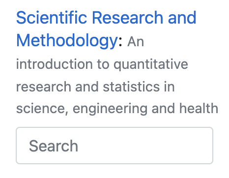

## How to use this online book {-}

* **Navigation**: Navigate between pages as follows:
  - The left-side menu is for navigating between *chapters*.
  - The right-side menu is for navigating between the *sections* of the current chapter.

* Words can be searched for using **Search** button on the menu:


```{r echo=FALSE}

```


::: {.importantBox .important data-latex="{iconmonstr-warning-8-240.png}"}
The book is optimised for *online viewing*,
and the book may be updated frequently,
so a printed PDF version may not be the most recent version.
:::


In some places, 
interactive 'quiz' questions are given.
*In the online version*,
the background turns from red to green when the answer is correct.
Try it now:

1. What is $1+1$?
`r if( knitr::is_html_output() ) {mcq( c("One", answer="Two", "Three") )}`
1. What is $1+2$?
`r if( knitr::is_html_output() ) {fitb( answer= c("3", "three"), ignore_case=TRUE )}`
1. Is $2 + 2=4$?
`r if( knitr::is_html_output() ) { torf( TRUE )}`
1. Which one of these is FALSE?
`r if( knitr::is_html_output() ) { 
   longmcq( c("The inventor of the fairy floss machine was a dentist",
              "Barack Obama has won two Grammy awards",
              answer = "Once a year all of Wikipedia is printed, and placed in a vault in Norway.") )}`

**Progress:** `r webexercises::total_correct()`
