# Comparing quantitative data between individuals {#BetweenQuantData}
\index{Quantitative data!compare \textit{between} individuals}


<!-- Introductions; easier to separate by format -->

::: {.objectivesBox .objectives data-latex="{iconmonstr-target-4-240.png}"}
So far, you have learnt to ask an RQ, design a study, collect the data, and describe the data.
**In this chapter**, you will learn to compare *quantitative* data in different groups.
You will learn to:

* compare quantitative data between individuals using the appropriate graphs.
* compare quantitative data between individuals in summary tables.
:::


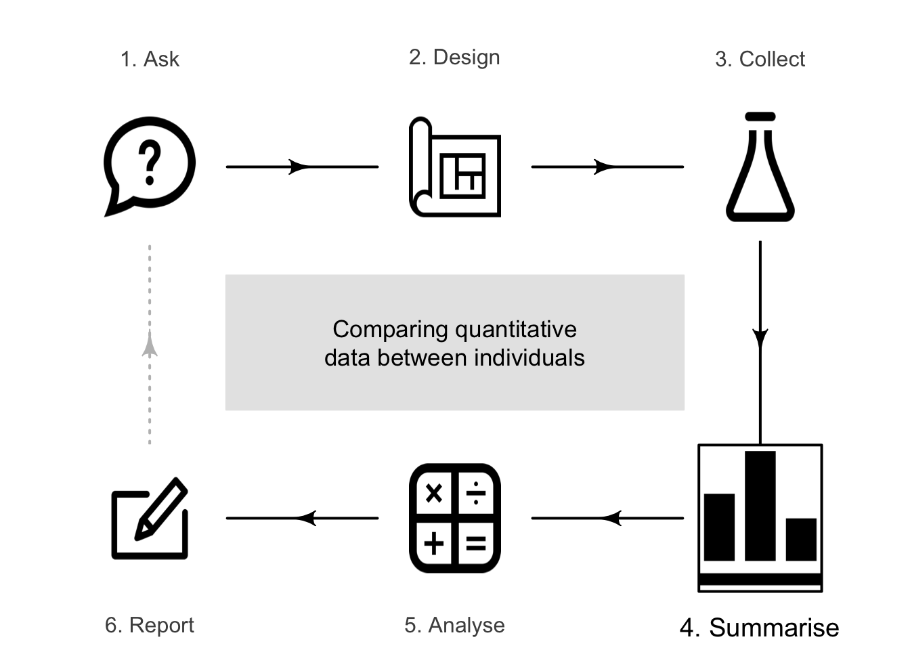


<!-- Define colours as appropriate -->


## Introduction

Relational RQs compare groups.
This chapter considers how to compare *quantitative* variables in different groups.
Graphs are useful this purpose, and a table of the numerical summaries usually is produced also.


## Numerical summary: difference between means {#CompareQuantTables}
\index{Quantitative data!comparing \textit{between} individuals!summary tables}\index{Summary table!comparing two means}\index{Mean!difference between}\index{Difference between means}

When comparing quantitative variables in different groups, the data should be summarised for each group.
If two groups are being compared, the *difference* between the means and/or medians of the two groups must also be computed.
If more than two groups are being compared, the *differences* between one of the group means/medians (the first, or the benchmark, or the initial situation as the reference level\index{Reference level}) and the other group means/medians are also usually computed.


::: {.example #GorillaSummarytable name="Numerical summary table"}
@wright2021chest recorded the number of chest-beats by gorillas (Table\ \@ref(tab:GorillaDataTable)), for gorillas under $20$\ years old ('younger') and $20$\ years and over ('older'). 
A summary of the data can be tabulated as in Table\ \@ref(tab:GorillaTable).
Notice that no standard deviation or sample size is provided for the *difference*; these make no sense.
:::


<table>
<thead><tr>
<th style="border-bottom:hidden;padding-bottom:0; padding-left:3px;padding-right:3px;text-align: center; font-weight: bold; " colspan="7"><div style="border-bottom: 1px solid #ddd; padding-bottom: 5px; ">Younger </div></th>
<th style="border-bottom:hidden;padding-bottom:0; padding-left:3px;padding-right:3px;text-align: center; font-weight: bold; " colspan="6"><div style="border-bottom: 1px solid #ddd; padding-bottom: 5px; ">Older</div></th>
</tr></thead>
<caption>(\#tab:GorillaDataTable)The chest-beating rate of gorillas (in beats per $10$\hs).</caption>
<tbody>
  <tr>
   <td style="text-align:center;"> $0.7$ </td>
   <td style="text-align:center;"> $1.3$ </td>
   <td style="text-align:center;"> $1.5$ </td>
   <td style="text-align:center;"> $1.7$ </td>
   <td style="text-align:center;"> $1.8$ </td>
   <td style="text-align:center;"> $3.0$ </td>
   <td style="text-align:center;"> $4.4$ </td>
   <td style="text-align:center;"> $0.0$ </td>
   <td style="text-align:center;"> $0.2$ </td>
   <td style="text-align:center;"> $0.4$ </td>
   <td style="text-align:center;"> $0.8$ </td>
   <td style="text-align:center;"> $1.1$ </td>
   <td style="text-align:center;"> $4.0$ </td>
  </tr>
  <tr>
   <td style="text-align:center;"> $0.9$ </td>
   <td style="text-align:center;"> $1.5$ </td>
   <td style="text-align:center;"> $1.5$ </td>
   <td style="text-align:center;"> $1.7$ </td>
   <td style="text-align:center;"> $2.6$ </td>
   <td style="text-align:center;"> $4.1$ </td>
   <td style="text-align:center;"> $4.4$ </td>
   <td style="text-align:center;"> $0.1$ </td>
   <td style="text-align:center;"> $0.3$ </td>
   <td style="text-align:center;"> $0.6$ </td>
   <td style="text-align:center;"> $0.9$ </td>
   <td style="text-align:center;"> $1.6$ </td>
   <td style="text-align:center;">  </td>
  </tr>
</tbody>
</table>


<table class="table" style="width: auto !important; margin-left: auto; margin-right: auto;">
<caption>(\#tab:GorillaTable)A numerical summary of the gorillas data.</caption>
 <thead>
<tr>
<th style="empty-cells: hide;border-bottom:hidden;" colspan="1"></th>
<th style="border-bottom:hidden;padding-bottom:0; padding-left:3px;padding-right:3px;text-align: center; font-weight: bold; " colspan="1"><div style="">Mean</div></th>
<th style="border-bottom:hidden;padding-bottom:0; padding-left:3px;padding-right:3px;text-align: center; font-weight: bold; " colspan="1"><div style="">Standard deviation</div></th>
<th style="border-bottom:hidden;padding-bottom:0; padding-left:3px;padding-right:3px;text-align: center; font-weight: bold; " colspan="1"><div style="">Sample</div></th>
</tr>
  <tr>
   <th style="text-align:left;font-weight: bold;">   </th>
   <th style="text-align:center;font-weight: bold;"> (in beats per 10 h) </th>
   <th style="text-align:center;font-weight: bold;"> (in beats per 10 h) </th>
   <th style="text-align:center;font-weight: bold;"> size </th>
  </tr>
 </thead>
<tbody>
  <tr>
   <td style="text-align:left;"> Younger </td>
   <td style="text-align:center;"> $2.22$ </td>
   <td style="text-align:center;"> $1.270$ </td>
   <td style="text-align:center;"> $14$ </td>
  </tr>
  <tr>
   <td style="text-align:left;"> Older </td>
   <td style="text-align:center;"> $0.91$ </td>
   <td style="text-align:center;"> $1.131$ </td>
   <td style="text-align:center;"> $11$ </td>
  </tr>
  <tr>
   <td style="text-align:left;font-style: italic;"> Difference </td>
   <td style="text-align:center;font-style: italic;"> $1.31$ </td>
   <td style="text-align:center;font-style: italic;">  </td>
   <td style="text-align:center;font-style: italic;">  </td>
  </tr>
</tbody>
</table>


## Graphs for the comparison {#GraphOneQualOneQuant}
\index{Quantitative data!comparing \textit{between} individuals!graphs}\index{Graphs!comparing \textit{between} individuals}\index{Software output!graphs}

When a *quantitative* variable is measured or observed in different groups (i.e., between individuals), the distribution of each variable can be graphed separately.
However, to *compare* the quantitative variable in the groups, appropriate graphs include: 

* *back-to-back stemplots* (Sect.\ \@ref(BackToBackStem)), which are best for small amounts of data (and only possible for comparing *two groups*).
* *2-D dot charts* (Sect.\ \@ref(TwoDDot)), which are the best choice for small to moderate amounts of data.
* *boxplots* (Sect.\ \@ref(Boxplot)), which are the best choice except for small amounts of data.        

These situations have one quantitative variable being compared in different groups (defined by *one qualitative variable*). 


### Back-to-back stemplot {#BackToBackStem}
\index{Graphs!back-to-back stemplot}

Back-to-back stemplots are two stemplots (Sect.\ \@ref(StemAndLeafPlots)) sharing the same stems; one group has the leaves emerging left-to-right from the stem, and the second group has the leaves emerging right-to-left from the stem.
Back-to-back stemplots can only be used when *two* groups are being compared.
Again, one advantage of using stemplots over other plots is that the original data are retained.
Disadvantages are that only two groups can be compared, and not all data work well with stemplots.


::: {.example #GorillaData name="Back-to-back stemplots"}
A back-to-back stemplot for comparing the chest-beating rate of gorillas (Fig.\ \@ref(fig:GorillasDoubleStem)) has the leaves for younger gorillas right-to-left, and the leaves for older gorillas left-to-right, sharing the same stems.
The younger gorillas have a faster chest-beating rate in general.
One older gorilla has a much faster rate than the other older gorillas (a potential outlier).
:::


<div class="figure" style="text-align: center">
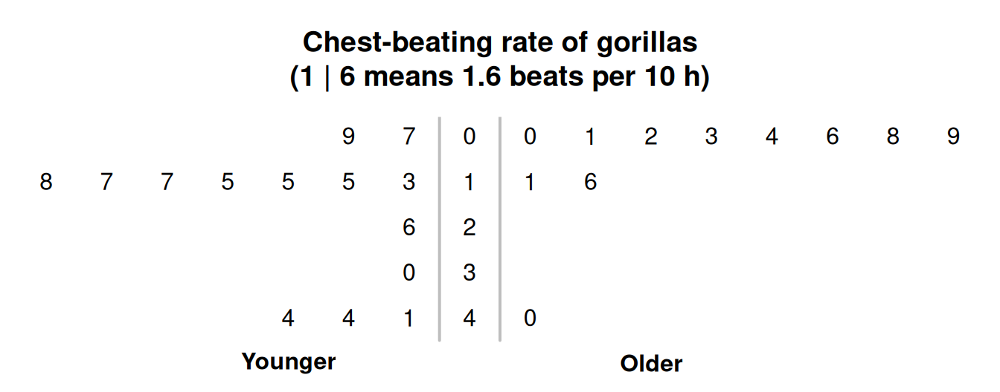
<p class="caption">(\#fig:GorillasDoubleStem)Stemplot for the chest-beating rate for gorillas.</p>
</div>


### 2-D dot charts {#TwoDDot}
\index{Graphs!dot chart!comparing quantitative data}\index{Graphs!dot chart!two-dimensional}

A two-dimensional (2-D) dot chart places a dot for each observation, separated for each level of the qualitative variable (also see Sect.\ \@ref(DotChartsOneQual)).
Any number of groups can be compared.


::: {.importantBox .important data-latex="{iconmonstr-warning-8-240.png}"}
The axis displaying the counts (or percentages) *need not start from zero*, since the distance from the axis to the these numbers *do not* visually imply any quantity of interest.
Rather, how the dots *compare* in the groups is the main feature of interest.
:::


:::{.example #Dotchart2DGorillas name="Boxplots"}
For the chest-beating data seen in Example\ \@ref(exm:GorillaData), a dot chart is shown in Fig.\ \@ref(fig:TwoDDotchart).
Many observations are the same, so some points would be *overplotted*\index{Overplotting} if points were not *stacked*\index{Overplotting!stacking} (left panel), or *jittered*\index{Overplotting!jittering} (right panel).
:::

<div class="figure" style="text-align: center">
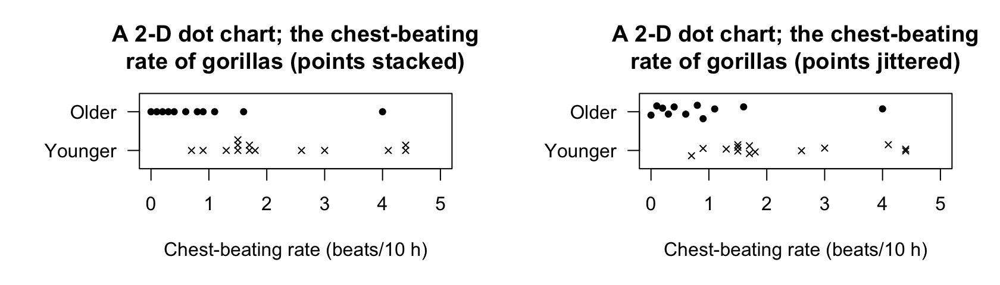
<p class="caption">(\#fig:TwoDDotchart)Two variations of a 2-D dot chart for the chest-beating data to avoid overplotting: stacking (left) and jittering (right).</p>
</div>


### Boxplots {#Boxplot}
\index{Graphs!boxplot}

A boxplot is a picture of the quantiles (Sect.\ \@ref(VariationIQR)) for each group, drawn side-by-side on the same plot (and so are sometimes called *parallel* boxplots or *side-by-side* boxplots).
Any number of groups can be compared using a boxplot.
Sometimes, the mean of each groups is added to the boxplot using, for example, a solid dot.

The distribution for each group is summarised by five numbers: the minimum value; the first quartile ($Q_1$); the median ($Q_2$); the third quartile ($Q_3$); and the maximum value.
Outliers, identified using the IQR rule (Sect.\ \@ref(OutliersIQRrule)), are usually shown too.
The values of $Q_1$, the median, and $Q_3$ for each group can be used to compare the distributions.
Different software may use different rules for computing quartiles, and hence may produce slightly different boxplots.


::: {.importantBox .important data-latex="{iconmonstr-warning-8-240.png}"}
The axis displaying these five numbers *need not start from zero*, since the distance from the axis to the these numbers *do not* visually imply any quantity of interest.
Rather, the boxes display the values of these five numbers for each group *relative* to each other, which is of interest.
:::


::: {.importantBox .important data-latex="{iconmonstr-warning-8-240.png}"}
Boxplots summarise data with only five numbers (sometimes called the five-number summary)\index{Five-number summary}, so details of the distributions are lost.
For this reason, boxplots are excellent for *comparing* distributions, but histograms are better for displaying the distribution of a single quantitative variable.
:::


:::{.example #BoxplotGorillas name="Boxplots"}
The boxplot for the chest-beating data (Example\ \@ref(exm:GorillaData)) is shown in Fig.\ \@ref(fig:BoxplotGorillas).
No outliers are identified for younger gorillas; one large outlier is identified for the older gorillas.
The boxplot shows a distinct difference between the chest-beating rates of older and younger gorillas.
:::


<div class="figure" style="text-align: center">
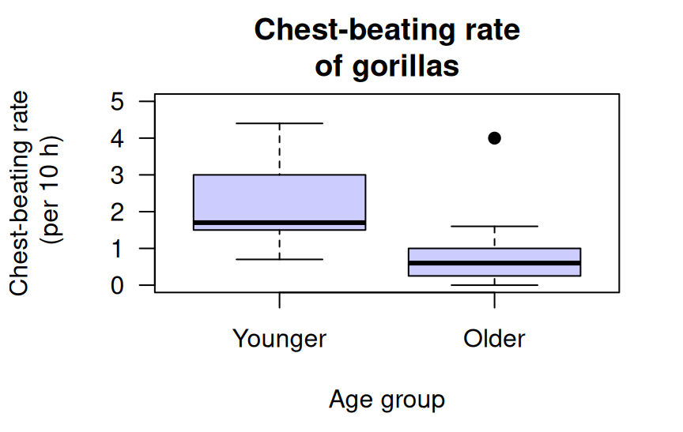
<p class="caption">(\#fig:BoxplotGorillas)The boxplot for the chest-beating data.</p>
</div>


The detail of the boxplots are explained in Fig.\ \@ref(fig:BoxplotGorillasExplain).
Firstly, focus on just the boxplot for the *younger* gorillas (i.e., the left box).\index{Quartiles}
Boxplots have five horizontal lines.

1. *Top line*:
   the *fastest* chest-beating rate (largest value) is\ $4.4$ per\ $10\hs$.
2. *Second line from top*:
   $75$% of observations are smaller than about\ $3$ per\ $10\hs$, represented by the line at the top of the central box. 
   This is the *third quartile* ($Q_3$).
3. *Middle line*:
   $50$% of observations are smaller than about\ $1.7$ per\ $10\hs$, represented by the line inside the central box. 
   This is the median value, the *second quartile* ($Q_2$).
4. *Second line from bottom*:
   $25$% of observations are smaller than about\ $1.5$ per\ $10\hs$, represented by the line at the bottom of the central box. 
   This is the *first quartile* ($Q_1$).
5. *Bottom line*:
   the *slowest* chest-beating rate (smallest value) is\ $0.7$ per\ $10\hs$. 


<div class="figure" style="text-align: center">
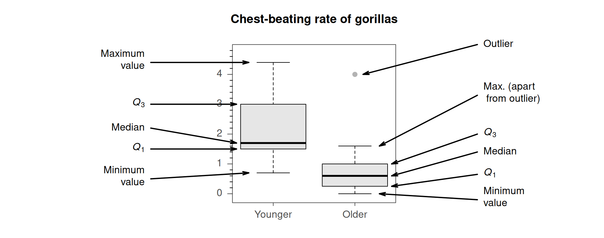
<p class="caption">(\#fig:BoxplotGorillasExplain)Explaining the boxplots for the chest-beating data.</p>
</div>


The box for the *older* gorillas (Fig.\ \@ref(fig:BoxplotGorillas), right box) is slightly different: one observation is identified with a point, *above* the top line.
Computer software identifies this observation as an *extreme outlier* using the IQR rule (Sect.\ \@ref(OutliersIQRrule)), and has plotted this point separately.


The values of $Q_1$, the median and $Q_3$ are all substantially larger for the younger gorillas, suggesting that younger gorillas have, in general, faster chest-beating rates.


::: {.example #BoxplotsHorizontal name="Boxplots"}
Boxplots can be plotted horizontally too, which leaves space for long labels of the qualitative variable.
In Fig.\ \@ref(fig:CementBuildBoxplot) (based on @data:Silva2016:rootcanal), the three dental cements are very different regarding their push-out forces.
:::


<div class="figure" style="text-align: center">
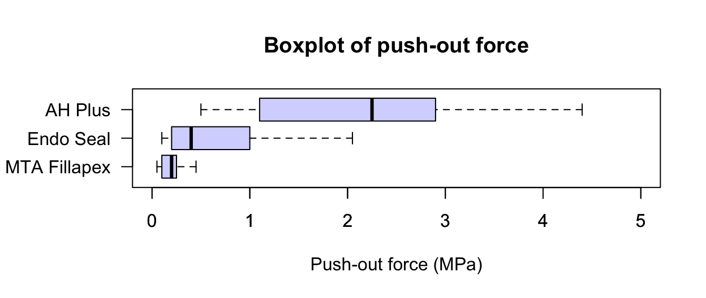
<p class="caption">(\#fig:CementBuildBoxplot)Comparing three push-out values for three dental cements.</p>
</div>


```{=html}
<video src="./videos/Boxplots.mp4" width="550" controls="controls" loop="loop" style="padding:5px; border: 2px solid gray;"></video>
```


## Example: water access {#WaterAccessCompareQuant}

@lopez2022farmers recorded data about access to water in three rural communities in Cameroon (Sect.\ \@ref(WaterAccessQuant)).
The study could be used to determine associations to the incidence of diarrhoea in young children ($85$\ households had children under\ $5$ years of age).

The graphs (Fig.\ \@ref(fig:WaterAccessCompareQuantFigs)) and summary (Table\ \@ref(tab:WaterAccessCompareQuantTabs)) show that households in which diarrhoea was found in the last two weeks in children had older household coordinators, more people in the household, and more children under\ $5$ years of age in the household. 
These may be expected: older female coordinators probably have more children, hence more children in the household under\ $5$, and so more children (and so people) are in the household in general.


<div class="figure" style="text-align: center">
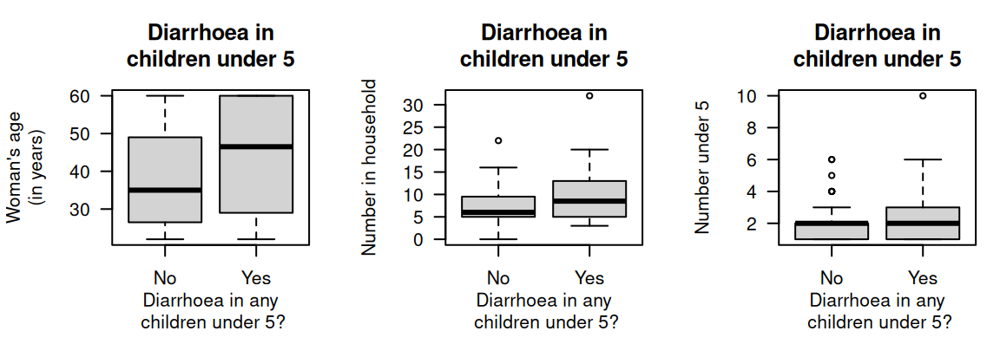
<p class="caption">(\#fig:WaterAccessCompareQuantFigs)Three plots for the water access data in 85 households ($59$ household reported no diarrhoea in children under\ $5$ years of age; $26$ reported diarrhoea in children under\ $5$ years of age).</p>
</div>

<table>
<caption>(\#tab:WaterAccessCompareQuantTabs)A summary of the quantitative variables in the water-access study, according to whether diarrhoea had been observed in the last two weeks in children under $5$ years of age, for those household with children under $5$ years of age.</caption>
 <thead>
  <tr>
   <th style="text-align:right;">  </th>
   <th style="text-align:center;"> $n$ </th>
   <th style="text-align:center;"> Mean </th>
   <th style="text-align:center;"> Median </th>
   <th style="text-align:center;"> Std dev. </th>
   <th style="text-align:center;"> IQR </th>
  </tr>
 </thead>
<tbody>
  <tr grouplength="3"><td colspan="6" style="border-bottom: 1px solid;"><strong>Woman's age</strong></td></tr>
<tr>
   <td style="text-align:right;padding-left: 2em;" indentlevel="1"> All households with children </td>
   <td style="text-align:center;"> $85$ </td>
   <td style="text-align:center;"> $40.2$ </td>
   <td style="text-align:center;"> $37.0$ </td>
   <td style="text-align:center;"> $13.90$ </td>
   <td style="text-align:center;"> $28.00$ </td>
  </tr>
  <tr>
   <td style="text-align:right;padding-left: 2em;" indentlevel="1"> Incidents of diarrhoea </td>
   <td style="text-align:center;"> $26$ </td>
   <td style="text-align:center;"> $45.0$ </td>
   <td style="text-align:center;"> $46.5$ </td>
   <td style="text-align:center;"> $14.04$ </td>
   <td style="text-align:center;"> $28.50$ </td>
  </tr>
  <tr>
   <td style="text-align:right;padding-left: 2em;" indentlevel="1"> No incidents of diarrhoea </td>
   <td style="text-align:center;"> $59$ </td>
   <td style="text-align:center;"> $38.1$ </td>
   <td style="text-align:center;"> $35.0$ </td>
   <td style="text-align:center;"> $13.44$ </td>
   <td style="text-align:center;"> $22.50$ </td>
  </tr>
  <tr grouplength="3"><td colspan="6" style="border-bottom: 1px solid;"><strong>Household size</strong></td></tr>
<tr>
   <td style="text-align:right;padding-left: 2em;" indentlevel="1"> Difference </td>
   <td style="text-align:center;">  </td>
   <td style="text-align:center;"> $\phantom{0}6.8$ </td>
   <td style="text-align:center;">  </td>
   <td style="text-align:center;">  </td>
   <td style="text-align:center;">  </td>
  </tr>
  <tr>
   <td style="text-align:right;padding-left: 2em;" indentlevel="1"> All households with children </td>
   <td style="text-align:center;"> $85$ </td>
   <td style="text-align:center;"> $\phantom{0}8.4$ </td>
   <td style="text-align:center;"> $\phantom{0}7.0$ </td>
   <td style="text-align:center;"> $\phantom{0}4.93$ </td>
   <td style="text-align:center;"> $\phantom{0}6.00$ </td>
  </tr>
  <tr>
   <td style="text-align:right;padding-left: 2em;" indentlevel="1"> Incidents of diarrhoea </td>
   <td style="text-align:center;"> $26$ </td>
   <td style="text-align:center;"> $10.5$ </td>
   <td style="text-align:center;"> $\phantom{0}8.5$ </td>
   <td style="text-align:center;"> $\phantom{0}6.51$ </td>
   <td style="text-align:center;"> $\phantom{0}7.75$ </td>
  </tr>
  <tr grouplength="3"><td colspan="6" style="border-bottom: 1px solid;"><strong>Children under 5 in household</strong></td></tr>
<tr>
   <td style="text-align:right;padding-left: 2em;" indentlevel="1"> No incidents of diarrhoea </td>
   <td style="text-align:center;"> $59$ </td>
   <td style="text-align:center;"> $\phantom{0}7.5$ </td>
   <td style="text-align:center;"> $\phantom{0}6.0$ </td>
   <td style="text-align:center;"> $\phantom{0}3.78$ </td>
   <td style="text-align:center;"> $\phantom{0}4.50$ </td>
  </tr>
  <tr>
   <td style="text-align:right;padding-left: 2em;" indentlevel="1"> Difference </td>
   <td style="text-align:center;">  </td>
   <td style="text-align:center;"> $\phantom{0}2.9$ </td>
   <td style="text-align:center;">  </td>
   <td style="text-align:center;">  </td>
   <td style="text-align:center;">  </td>
  </tr>
  <tr>
   <td style="text-align:right;padding-left: 2em;" indentlevel="1"> All households with children </td>
   <td style="text-align:center;"> $85$ </td>
   <td style="text-align:center;"> $\phantom{0}2.2$ </td>
   <td style="text-align:center;"> $\phantom{0}2.0$ </td>
   <td style="text-align:center;"> $\phantom{0}1.56$ </td>
   <td style="text-align:center;"> $\phantom{0}2.00$ </td>
  </tr>
  <tr>
   <td style="text-align:right;"> Incidents of diarrhoea </td>
   <td style="text-align:center;"> $26$ </td>
   <td style="text-align:center;"> $\phantom{0}2.8$ </td>
   <td style="text-align:center;"> $\phantom{0}2.0$ </td>
   <td style="text-align:center;"> $\phantom{0}2.01$ </td>
   <td style="text-align:center;"> $\phantom{0}1.75$ </td>
  </tr>
  <tr>
   <td style="text-align:right;"> No incidents of diarrhoea </td>
   <td style="text-align:center;"> $59$ </td>
   <td style="text-align:center;"> $\phantom{0}1.9$ </td>
   <td style="text-align:center;"> $\phantom{0}2.0$ </td>
   <td style="text-align:center;"> $\phantom{0}1.26$ </td>
   <td style="text-align:center;"> $\phantom{0}1.00$ </td>
  </tr>
  <tr>
   <td style="text-align:right;"> Difference </td>
   <td style="text-align:center;">  </td>
   <td style="text-align:center;"> $\phantom{0}0.8$ </td>
   <td style="text-align:center;">  </td>
   <td style="text-align:center;">  </td>
   <td style="text-align:center;">  </td>
  </tr>
</tbody>
</table>


\clearpage


## Chapter summary {#Chap14-Summary}
   
Quantitative data can be compared between different groups (between individuals comparisons) using a back-to-back stemplot, boxplot or $2$-D dot chart.
A summary table should show the numerical summaries for the levels of the quantitative variable, and the between-group differences. 


## Quick review questions {#Chap14-QuickReview}

::: {.webex-check .webex-box}
Are the following statements *true* or *false*?

1. A boxplot is an appropriate graph for comparing a quantitative variable in two *or more* groups. \tightlist
<select class='webex-select'><option value='blank'></option><option value='answer'>TRUE</option><option value=''>FALSE</option></select>
2. A back-to-back stemplot is an appropriate graph for comparing a quantitative variable in two *or more* groups.
<select class='webex-select'><option value='blank'></option><option value=''>TRUE</option><option value='answer'>FALSE</option></select>
3. A case-profile plot is an appropriate graph for comparing a quantitative variable in two *or more* groups.
<select class='webex-select'><option value='blank'></option><option value=''>TRUE</option><option value='answer'>FALSE</option></select>
4. When comparing a quantitative variable in two groups, the difference between the two sample sizes should be included.
<select class='webex-select'><option value='blank'></option><option value=''>TRUE</option><option value='answer'>FALSE</option></select>
:::


## Exercises {#CompareQuantData-Exercises}

[Answers to odd-numbered exercises] are given at the end of the book. 


::: {.exercise #BoxplotsProjectCosts}
@data:Hale2009:ProjectDelivery studied two different engineering project delivery methods (Fig.\ \@ref(fig:AISfemalesportEng), left panel): Design/Build and Design/Bid/Build.
The grey, horizontal line is where the projected costs are the same as the actual cost.

1. What does the plot reveal about the two methods?
2. What is the median for each method (approximately)?
3. What is the IQR for each method (approximately)?
:::


::: {.exercise #GraphsAIS}
[*Dataset*: `AISsub`]
@data:Telford1991:sexsportsize studied athletes at the *Australian Institute of Sport* (AIS).
Numerous physical and blood measurements were taken from high performance athletes.
Figure\ \@ref(fig:AISfemalesportEng) (right panel) compares the heights of females in two similar sports: basketball and netball.
(Netball was derived from basketball.)

1. What does the plot reveal about the heights of the females in each sport?
2. What is the median for each sport (approximately)?
3. What is the IQR for each sport (approximately)?
:::


<div class="figure" style="text-align: center">
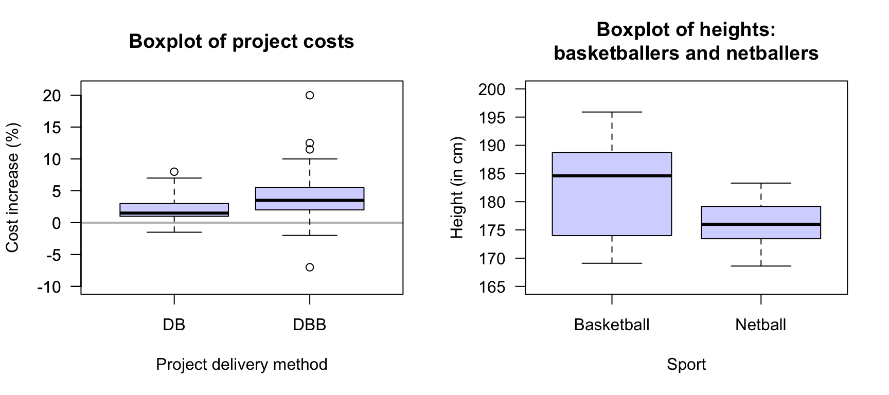
<p class="caption">(\#fig:AISfemalesportEng)Left: cost increases for two different building project delivery methods: Design/Build and Design/Bid/Build (the grey, horizontal line is where the projected costs are the same as the actual cost). Right: the heights of female basketball and netball players attending the AIS.</p>
</div>


::: {.exercise #NumericalQuantMatchingHistogramsAndBoxplots}

Match the histograms with the corresponding boxplots in the activity below.


<!--
1. Match the histogram with the corresponding boxplot.
1. For which datasets would the mean and standard deviation be the appropriate numerical summary?
   For which datasets would the median and IQR be the appropriate numerical summary?
-->
:::


::: {.exercise #NumericalJellyfish}
@others:lunn:cida [@data:hand:handbook] compared the dimensions of jellyfish at two sites at Hawkesbury River, NSW (Dangar Island; Salamander Bay) to determine the difference between the jellyfish at each site.
A histogram of the breadth of jellyfish at Dangar Island Bay is shown in Fig.\ \@ref(fig:JellyfishHist) (left panel).

<div class="figure" style="text-align: center">
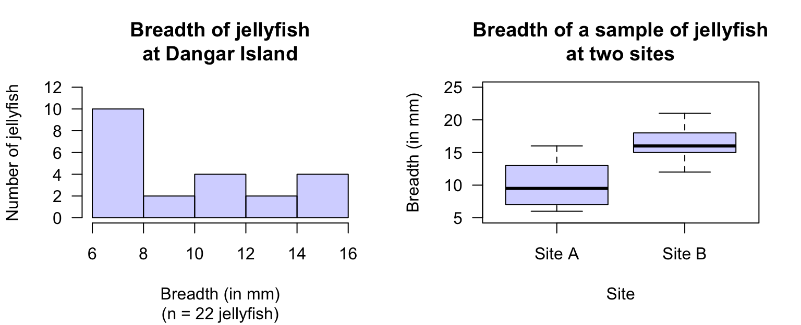
<p class="caption">(\#fig:JellyfishHist)Left: a histogram of the breadth of jellyfish at Dangar Island. Right: a boxplot of the breadth of jellyfish at two sites.</p>
</div>


1. Two students are arguing about the median breadth.  
  \ \   
  Student\ 1 says:
  *The bars in the histogram have heights of $10$,\ $2$,\ $4$,\ $2$ and\ $4$.
  When these numbers are put in order, they are: $2$,\ $2$,\ $4$,\ $4$, and\ $10$.
  The median breadth is the median of these numbers, so the median breadth is the middle one: $4\mms$ is the median.*  
  \ \   
  Student\ 2 responds:
  *You have the correct answer, but for the wrong reason!
  There are five bars, and the middle bar is the third bar.
  Since the third bar has a height of\ $4$, the median breadth is\ $4\mms$.*  
  \ \   
  Which student, if either, is correct?
2. Describe the histogram.
3. A boxplot comparing the breadths of jellyfish at Dangar Island and Salamander Bay is shown in Fig.\ \@ref(fig:JellyfishHist) (right panel).
   Describe and compare the breadths of the jellyfish.
4. What is the median breadth for the jellyfish at each location?
5. Which box in the boxplot represents the Dangar Island jellyfish (in Fig.\ \@ref(fig:JellyfishHist), left panel)?
:::


::: {.exercise #NumericalQuantConstructionWorkerProductivity}
@data:Gatti2013:WorkforceStrain studied the productivity of construction workers, recording (among other variables) the rate at which concrete panels could be installed by workers.
Data for three different female workers in the study are shown in Table\ \@ref(tab:PanelsTable), gathered over four installation periods of $50\mins$ each.

1. Compute the IQR for each worker.
1. Construct the boxplot for comparing the three workers.
1. Draw the approximate histograms for each worker.
1. What do you learn about the workers?
:::


<table>
<caption>(\#tab:PanelsTable)The productivity of three workers installing concrete panels (in panels per minute).</caption>
 <thead>
  <tr>
   <th style="text-align:left;">   </th>
   <th style="text-align:center;"> Worker 1 </th>
   <th style="text-align:center;"> Worker 2 </th>
   <th style="text-align:center;"> Worker 3 </th>
  </tr>
 </thead>
<tbody>
  <tr>
   <td style="text-align:left;"> Mean </td>
   <td style="text-align:center;"> $1.24$ </td>
   <td style="text-align:center;"> $1.73$ </td>
   <td style="text-align:center;"> $1.36$ </td>
  </tr>
  <tr>
   <td style="text-align:left;"> Minimum </td>
   <td style="text-align:center;"> $0.59$ </td>
   <td style="text-align:center;"> $1.13$ </td>
   <td style="text-align:center;"> $0.86$ </td>
  </tr>
  <tr>
   <td style="text-align:left;"> 1st quartile </td>
   <td style="text-align:center;"> $0.88$ </td>
   <td style="text-align:center;"> $1.51$ </td>
   <td style="text-align:center;"> $1.16$ </td>
  </tr>
  <tr>
   <td style="text-align:left;"> Median </td>
   <td style="text-align:center;"> $1.35$ </td>
   <td style="text-align:center;"> $1.70$ </td>
   <td style="text-align:center;"> $1.38$ </td>
  </tr>
  <tr>
   <td style="text-align:left;"> 3rd quartile </td>
   <td style="text-align:center;"> $1.49$ </td>
   <td style="text-align:center;"> $1.91$ </td>
   <td style="text-align:center;"> $1.58$ </td>
  </tr>
  <tr>
   <td style="text-align:left;"> Maximum </td>
   <td style="text-align:center;"> $1.88$ </td>
   <td style="text-align:center;"> $3.00$ </td>
   <td style="text-align:center;"> $2.17$ </td>
  </tr>
</tbody>
</table>


::: {.exercise #GreenBuilding}
In a study of the temperature in offices, @data:Paul2008:Comfort compared the temperature in three offices (during working hours) at Charles Sturt University (Australia; CSU); the data are summarised in Table\ \@ref(tab:OfficeTemps).

1. Compute the IQR for the temperatures in each office.
1. Construct the boxplot for comparing the temperatures in the three offices.
1. Draw the approximate histograms for each office.
1. What do you learn about the offices?
:::


<table>
<caption>(\#tab:OfficeTemps)A summary of the temperature (in degrees C) in three offices at CSU during working hours according to current smoking status.</caption>
 <thead>
  <tr>
   <th style="text-align:left;">   </th>
   <th style="text-align:center;"> Office A </th>
   <th style="text-align:center;"> Office B </th>
   <th style="text-align:center;"> Office C </th>
  </tr>
 </thead>
<tbody>
  <tr>
   <td style="text-align:left;"> Mean </td>
   <td style="text-align:center;"> $24.1$ </td>
   <td style="text-align:center;"> $25.3$ </td>
   <td style="text-align:center;"> $25.7$ </td>
  </tr>
  <tr>
   <td style="text-align:left;"> Minimum </td>
   <td style="text-align:center;"> $16.4$ </td>
   <td style="text-align:center;"> $15.9$ </td>
   <td style="text-align:center;"> $20.1$ </td>
  </tr>
  <tr>
   <td style="text-align:left;"> $Q_1$ </td>
   <td style="text-align:center;"> $22.8$ </td>
   <td style="text-align:center;"> $23.8$ </td>
   <td style="text-align:center;"> $24.6$ </td>
  </tr>
  <tr>
   <td style="text-align:left;"> Median </td>
   <td style="text-align:center;"> $24.4$ </td>
   <td style="text-align:center;"> $25.5$ </td>
   <td style="text-align:center;"> $26.1$ </td>
  </tr>
  <tr>
   <td style="text-align:left;"> $Q_3$ </td>
   <td style="text-align:center;"> $25.5$ </td>
   <td style="text-align:center;"> $26.9$ </td>
   <td style="text-align:center;"> $27.2$ </td>
  </tr>
  <tr>
   <td style="text-align:left;"> Maximum </td>
   <td style="text-align:center;"> $27.4$ </td>
   <td style="text-align:center;"> $31.0$ </td>
   <td style="text-align:center;"> $30.3$ </td>
  </tr>
</tbody>
</table>


::: {.exercise #CompareQuantExercisesNHANES}
[*Dataset*: `NHANES`]
Consider this RQ:

> Among Americans, is the mean direct HDL cholesterol different for current smokers and non-smokers?

Data to answer this RQ are available from the American *National Health and Nutrition Examination Survey* (<span style="font-variant:small-caps;">nhanes</span>) [@data:NHANES:Rpackage].

1. What would be an appropriate graph to display the comparison?
2. Use the software output (Fig.\ \@ref(fig:NHANESTwoSample))\index{Software output!comparing two means} to construct an appropriate table showing the numerical summary relevant to the RQ.

:::

(ref:NHANESSoftware) Software output for the <span style="font-variant:small-caps;">nhanes</span> data.

<div class="figure" style="text-align: center">

<p class="caption">(\#fig:NHANESTwoSample)(ref:NHANESSoftware)</p>
</div>


::: {.exercise #FacePlantSummary}
[*Dataset*: `ForwardFall`]
@data:Wojcik:ForwardFall compared the lean-forward angle in younger and older women.
An elaborate set-up was constructed to measure this angle, using a harness.
Consider the RQ:

> Among healthy women, what is difference between the mean lean-forward angle for younger women compared to older women?

The data are shown in Table\ \@ref(tab:FacePlant).

1. What is an appropriate graph to display the comparison?
1. Construct an appropriate numerical summary from the software output (Fig.\ \@ref(fig:FallFowardTTestjamovi)).
:::

<table class="table" style="width: auto !important; margin-left: auto; margin-right: auto;">
<thead><tr>
<th style="border-bottom:hidden;padding-bottom:0; padding-left:3px;padding-right:3px;text-align: center; font-weight: bold; " colspan="5"><div style="border-bottom: 1px solid #ddd; padding-bottom: 5px; ">Younger women </div></th>
<th style="border-bottom:hidden;padding-bottom:0; padding-left:3px;padding-right:3px;text-align: center; font-weight: bold; " colspan="5"><div style="border-bottom: 1px solid #ddd; padding-bottom: 5px; ">Older women </div></th>
</tr></thead>
<caption>(\#tab:FacePlant)Lean-forward angles for older women ($n = 10$) and younger women ($n = 5$).</caption>
<tbody>
  <tr>
   <td style="text-align:center;"> $29$ </td>
   <td style="text-align:center;"> $34$ </td>
   <td style="text-align:center;"> $33$ </td>
   <td style="text-align:center;"> $27$ </td>
   <td style="text-align:center;"> $28$ </td>
   <td style="text-align:center;"> $18$ </td>
   <td style="text-align:center;"> $15$ </td>
   <td style="text-align:center;"> $23$ </td>
   <td style="text-align:center;"> $13$ </td>
   <td style="text-align:center;"> $12$ </td>
  </tr>
  <tr>
   <td style="text-align:center;"> $32$ </td>
   <td style="text-align:center;"> $31$ </td>
   <td style="text-align:center;"> $34$ </td>
   <td style="text-align:center;"> $32$ </td>
   <td style="text-align:center;"> $27$ </td>
   <td style="text-align:center;">  </td>
   <td style="text-align:center;">  </td>
   <td style="text-align:center;">  </td>
   <td style="text-align:center;">  </td>
   <td style="text-align:center;">  </td>
  </tr>
</tbody>
</table>


<div class="figure" style="text-align: center">

<p class="caption">(\#fig:FallFowardTTestjamovi)Software output for the lean-forward angles data.</p>
</div>


:::{.exercise #QuantCompareSpeedSignage}
[*Dataset*: `Speed`]
@ma2019impacts studied adding additional signage to reduce vehicle speeds on freeway exit ramps.
At one site (Ningxuan Freeway), speeds were recorded for $38$\ vehicles before the extra signage was added, and then for $41$ different vehicles after the extra signage was added
(data below).


```{=html}
<div class="datatables html-widget html-fill-item" id="htmlwidget-4cd41c13b350ba8b1bb3" style="width:100%;height:auto;"></div>
<script type="application/json" data-for="htmlwidget-4cd41c13b350ba8b1bb3">{"x":{"filter":"none","vertical":false,"caption":"<caption>Vehicle speeds (in km/h) before and after adding extra signage.<\/caption>","fillContainer":false,"data":[["1","2","3","4","5","6","7","8","9","10","11","12","13","14","15","16","17","18","19","20","21","22","23","24","25","26","27","28","29","30","31","32","33","34","35","36","37","38","39","40","41","42","43","44","45","46","47","48","49","50","51","52","53","54","55","56","57","58","59","60","61","62","63","64","65","66","67","68","69","70","71","72","73","74","75","76","77","78","79"],["Before","Before","Before","Before","Before","Before","Before","Before","Before","Before","Before","Before","Before","Before","Before","Before","Before","Before","Before","Before","Before","Before","Before","Before","Before","Before","Before","Before","Before","Before","Before","Before","Before","Before","Before","Before","Before","Before","After","After","After","After","After","After","After","After","After","After","After","After","After","After","After","After","After","After","After","After","After","After","After","After","After","After","After","After","After","After","After","After","After","After","After","After","After","After","After","After","After"],[90,83.09999999999999,93.90000000000001,113.7,120,108,98.2,90,90,108,102.9,108,83.09999999999999,72,98.2,102.9,108,120,127.1,72,80,86.40000000000001,80,90,98.2,90,102.9,102.9,113.7,108,93.90000000000001,98.2,108,108,102.9,102.9,86.40000000000001,83.09999999999999,98.2,102.9,93.90000000000001,98.2,80,86.40000000000001,102.9,83.09999999999999,98.2,98.2,93.90000000000001,98.2,67.5,98.2,93.90000000000001,98.2,63.5,83.09999999999999,93.90000000000001,93.90000000000001,120,93.90000000000001,77.09999999999999,86.40000000000001,98.2,108,74.5,102.9,90,98.2,108,86.40000000000001,113.7,72,98.2,93.90000000000001,69.7,113.7,102.9,72,80]],"container":"<table class=\"display\">\n  <thead>\n    <tr>\n      <th> <\/th>\n      <th>When measured<\/th>\n      <th>Speed (km/h)<\/th>\n    <\/tr>\n  <\/thead>\n<\/table>","options":{"searching":false,"columnDefs":[{"className":"dt-right","targets":2},{"orderable":false,"targets":0},{"name":" ","targets":0},{"name":"When","targets":1},{"name":"Speed","targets":2}],"order":[],"autoWidth":false,"orderClasses":false}},"evals":[],"jsHooks":[]}</script>
```


The researchers are hoping that the addition of extra signage will *reduce* the mean speed of the vehicles.
The RQ is:

> At this freeway exit, how much is the mean vehicle speed *reduced* after extra signage is added?

1. Using the software output in Fig.\ \@ref(fig:SpeedjamoviCI), summarise the data numerically, then construct a suitable summary table.
1. Produce a boxplot of the data (use a computer if necessary).
:::


<div class="figure" style="text-align: center">
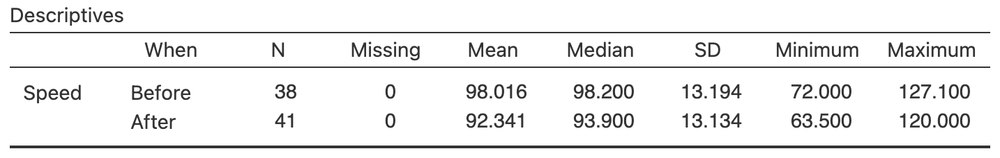
<p class="caption">(\#fig:SpeedjamoviCI)Software output for the speed data.</p>
</div>


::: {.exercise #CompareQuantDeceleration}
[*Dataset*: `Deceleration`]
@ma2019impacts studied adding additional signage to reduce vehicle speeds on freeway exit ramps.
At one site (Ningxuan Freeway), speeds were recorded at various points on the freeway exit for $38$\ vehicles before the extra signage was added, and then for $41$\ vehicles after the extra signage was added.

From this data, the *deceleration* of each vehicle was determined
(data below)
as the vehicle left the\ $120\kms$.h^$-1$^ speed zone and approached the\ $80\kms$.h^$-1$^ speed zone. 
The RQ is:

> At this freeway exit, what is the difference between the mean vehicle deceleration, comparing the times before the extra signage is added and after extra signage is added?

In this context, the researchers are hoping that the extra signage might cause cars to slow down *faster* (i.e., they will decelerate more, on average, after adding the extra signage).

1. Using the software output in Fig.\ \@ref(fig:DecelerationjamoviCI), summarise the data numerically, then construct a suitable summary table.
1. Produce a boxplot of the data (use a computer if necessary).
1. What does a *negative* deceleration value represent?
:::


```{=html}
<div class="datatables html-widget html-fill-item" id="htmlwidget-055c64d499ab1768a23b" style="width:100%;height:auto;"></div>
<script type="application/json" data-for="htmlwidget-055c64d499ab1768a23b">{"x":{"filter":"none","vertical":false,"caption":"<caption>Vehicle deceleration  (in m/s-squared) before and after adding extra signage.<\/caption>","fillContainer":false,"data":[["1","2","3","4","5","6","7","8","9","10","11","12","13","14","15","16","17","18","19","20","21","22","23","24","25","26","27","28","29","30","31","32","33","34","35","36","37","38","39","40","41","42","43","44","45","46","47","48","49","50","51","52","53","54","55","56","57","58","59","60","61","62","63","64","65","66","67","68","69","70","71","72","73","74","75","76","77","78","79"],["Before","Before","Before","Before","Before","Before","Before","Before","Before","Before","Before","Before","Before","Before","Before","Before","Before","Before","Before","Before","Before","Before","Before","Before","Before","Before","Before","Before","Before","Before","Before","Before","Before","Before","Before","Before","Before","Before","After","After","After","After","After","After","After","After","After","After","After","After","After","After","After","After","After","After","After","After","After","After","After","After","After","After","After","After","After","After","After","After","After","After","After","After","After","After","After","After","After"],[0.108,0.064,0.002,0.029,0.167,0.042,0.113,0.053,0.035,-0.062,0.063,0.107,0.081,0.102,0.054,0.003,0.042,0.07000000000000001,0.023,0.028,0.08,0.061,0.031,0.07099999999999999,0.113,0.126,0.08400000000000001,0.043,0.096,0.151,0.114,0.154,0.107,0.173,0.08400000000000001,0.126,0.044,0.048,0.134,-0.113,-0.052,0.093,0.08,0.044,0.043,0.064,0.074,0.093,0.095,0.054,0.118,0.154,0.076,0.113,0.083,0.064,0.057,0.076,0.167,0.076,0.107,0.044,0.175,0.08500000000000001,0.037,0.147,0.089,0.074,0.08500000000000001,0.079,0.119,0.014,0.093,0.095,0.046,0.007,0.063,0.08699999999999999,0.096]],"container":"<table class=\"display\">\n  <thead>\n    <tr>\n      <th> <\/th>\n      <th>When measured<\/th>\n      <th>Deceleration (m/s-squared)<\/th>\n    <\/tr>\n  <\/thead>\n<\/table>","options":{"searching":false,"columnDefs":[{"className":"dt-right","targets":2},{"orderable":false,"targets":0},{"name":" ","targets":0},{"name":"When","targets":1},{"name":"Deceleration","targets":2}],"order":[],"autoWidth":false,"orderClasses":false}},"evals":[],"jsHooks":[]}</script>
```

<div class="figure" style="text-align: center">

<p class="caption">(\#fig:DecelerationjamoviCI)Software output for the deceleration data.</p>
</div>


::: {.exercise #QuantCompareTyping}
[*Dataset*: `Typing`]
The `Typing` dataset contains information about the typing speed and accuracy for students, from an online typing test [@pinet2022typing].
The four variables are: typing speed (`mTS`), typing accuracy (`mAcc`), age (`Age`), and sex (`Sex`) for $1\,301$ students.

1. Produce appropriate numerical summaries for the quantitative variables.
1. Produce appropriate numerical summaries for *comparing* the quantitative variables for different values of the qualitative variable.
1. What do you learn from these numerical summaries?
:::


::: {.exercise #QuantCompareDental}
[*Dataset*: `Dental`]
@data:woodward:dental recorded the sugar consumption and the average number of decayed, missing or filled teeth (DMFT) in $29$\ industrialised countries and $61$\ non-industrialised countries. 

1. Produce appropriate numerical summaries for the two quantitative variables.
1. Produce appropriate numerical summaries for *comparing* the two quantitative variables for industrialised countries and non-industrialised countries.
1. What do you learn from these numerical summaries?
:::


::: {.exercise #QuantCompareSnakesConfounding}
[*Dataset*: `Snakes`]
Some Mexican garter snakes (*Thamnophis melanogaster*) live in habitats with no crayfish, while some live in habitats with crayfish and use crayfish as a food source.
@manjarrez2017morphological were interested in whether the snakes in these regions were different:

> For female Mexican garter snakes, is the mean snout--vent length (SVL) different for those in regions with crayfish and without crayfish?

Two different groups of snakes are studied (so the study uses a between-individuals comparison\index{Comparison!between individuals}).
(The data are shown
in Sect.\ \@ref(TwoMeansHT-intro).)
Boxplots of the data are shown in Fig.\ \@ref(fig:BoxplotCrayfish).

1. Describe the boxplot displaying the SVL for the two regions, for *all* crayfish (left panel).
   Compare the means for the two regions.
2. Describe the boxplot displaying the SVL for the two regions, for *female* crayfish (centre panel).
   Compare the means for the two regions.
3. Describe the boxplot displaying the SVL for the two regions, for *male* crayfish (right panel).
   Compare the means for the two regions.
4. How would you describe the variable 'Sex of the snake': extraneous, confounding, lurking, response or explanatory?
:::

<div class="figure">
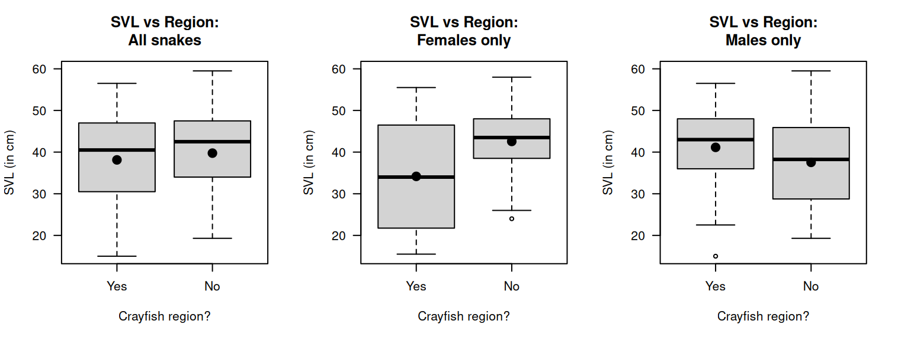
<p class="caption">(\#fig:BoxplotCrayfish)The snount--vent length (SVL) for Mexican garter snakes, living in crayfish or non-crayfish regions. The solid dots represent the means.</p>
</div>


<!-- QUICK REVIEW ANSWERS -->
<!--
::: {.EOCanswerBox .EOCanswer data-latex="{iconmonstr-check-mark-14-240.png}"}
**Answers to *Quick review* questions:**
**1.** True.
**2.** False; only compares two groups.
**3.** False; a case-profile plot is appropriate for *within*-individual changes.
**4.** False; difference between sample sizes is meaningless.
:::
-->


