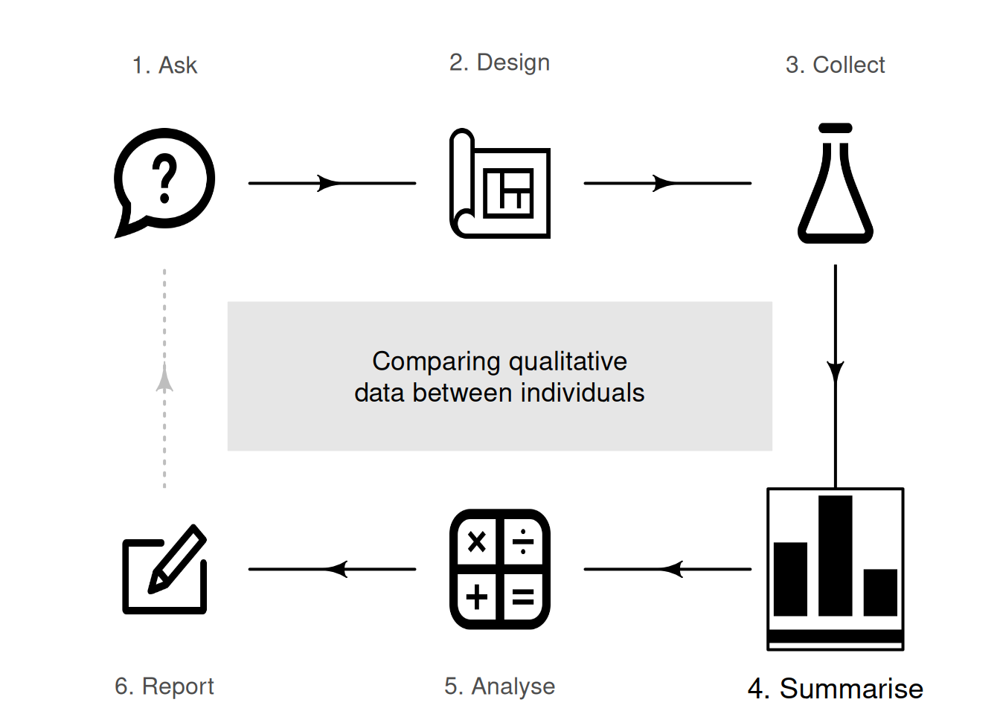
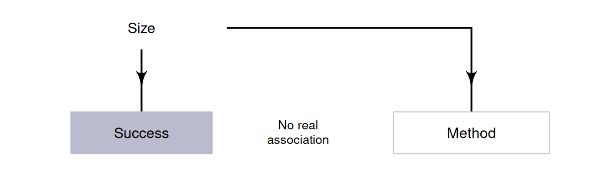
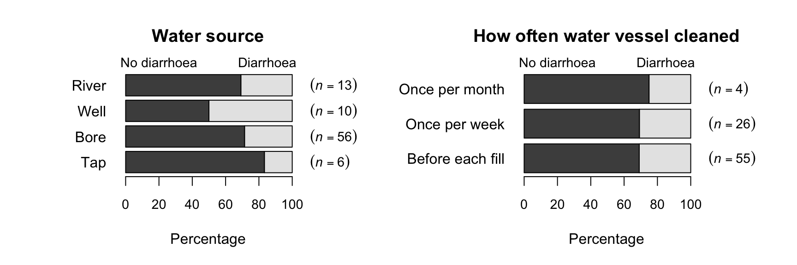

# Comparing qualitative data between individuals {#CompareQualData}

\index{Qualitative data!comparing \textit{between} individuals}

<!-- Introductions; easier to separate by format -->


::: {.objectivesBox .objectives data-latex="{iconmonstr-target-4-240.png}"}
So far, you have learnt to ask an RQ, design a study, collect the data, describe the data and summarise the data.
**In this chapter**, you will learn to:

* compare qualitative data between groups of individuals using the appropriate graphs.
* compare qualitative data between groups of individuals using the difference in proportions, odds ratios and summary tables.
:::





<!-- Define colours as appropriate -->


## Introduction {#CompareQual-Intro}

Relational RQs compare groups.
This chapter considers how to compare *qualitative* variables in different groups.
Graphs are useful for this purpose, and a table including odds, odds ratios and proportions is usually produced also.


## Two-way tables {#QualitativeTwoWaytables}
\index{Two-way tables}

When more than one qualitative variable is recorded for each individual, the data can be collated into a table.
When *two* qualitative variables are cross-tabulated, the resulting table is called a *two-way table*.\index{Two-way tables}
The categories for each variable should be *exhaustive*\index{Exhaustive} (cover all levels) and *mutually exclusive*\index{Mutually exclusive} (observations belong to one and only one level).
Usually, the levels of the explanatory variable are in the rows of the table.


::: {#SmallKidneyStones .example name="Two-way tables"}
To compare two treatments for kidney stones, @data:Charig:stones collected data from $700$\ UK patients on two qualitative variables:

* the treatment method ('A' or\ 'B'), the explanatory variable.
* the result of the procedure ('success' or\ 'failure'), the response variable.

Both variables are *qualitative* with two *levels*, and each treatment was used on $350$ patients.
Treatment\ A was used from 1972--1980, and Treatment\ B from 1980--1985; that is, treatments were *not randomly allocated*, and so *confounding* may be present.
For this reason, the researchers also recorded the *size* of the kidney stone ('small' or 'large') as one possible confounding variable.
Firstly, consider just the *small stones* [@julious1994confounding], displayed in the two-way table in Table\ \@ref(tab:KS-Small).
:::

(ref:KStonesNumbersSmall) *Counts* for two procedures with *small* kidney stones.

<table class="table" style="width: auto !important; margin-left: auto; margin-right: auto;">
<caption>(\#tab:KS-Small)(ref:KStonesNumbersSmall)</caption>
 <thead>
  <tr>
   <th style="text-align:left;">   </th>
   <th style="text-align:center;"> Success </th>
   <th style="text-align:center;"> Failure </th>
   <th style="text-align:center;"> Total </th>
  </tr>
 </thead>
<tbody>
  <tr>
   <td style="text-align:left;"> Method A </td>
   <td style="text-align:center;"> $\phantom{0}81$ </td>
   <td style="text-align:center;"> $\phantom{0}6$ </td>
   <td style="text-align:center;font-weight: bold;"> $\phantom{0}87$ </td>
  </tr>
  <tr>
   <td style="text-align:left;"> Method B </td>
   <td style="text-align:center;"> $234$ </td>
   <td style="text-align:center;"> $36$ </td>
   <td style="text-align:center;font-weight: bold;"> $270$ </td>
  </tr>
  <tr>
   <td style="text-align:left;font-weight: bold;"> Total </td>
   <td style="text-align:center;font-weight: bold;"> $315$ </td>
   <td style="text-align:center;font-weight: bold;"> $42$ </td>
   <td style="text-align:center;font-weight: bold;font-weight: bold;"> $357$ </td>
  </tr>
</tbody>
</table>


## Summary tables by rows and columns {#RowPercentages}
\index{Two-way tables!summary by rows}\index{Two-way tables!summary by columns}

Each variable in a two-way table can be analysed separately, using percentages or proportions (Sect.\ \@ref(QualitativeProportionsPercentages)) or odds (Sect.\ \@ref(QualOdds)).
For example, the two variables in Table\ \@ref(tab:KS-Small) (Method; Result) can be analysed separately.
For overall results:

* the proportion of procedures that were successful is $315/357 = 0.882$ (or $88.2$%).
* the odds that a procedure was successful is $315/42 = 7.5$; that is, there were\ $7.5$ times as many successful procedures as unsuccessful procedures.

However, to *compare* Methods\ A and\ B, the proportions (or percentages) and odds of successful results need to be computed for each row separately.


::: {#SummaryTableCompareQual .example name="Small kidney stones"}
The data in Table\ \@ref(tab:KS-Small) can be summarised by computing proportions or percentages by *row*.
Each row refers to a different method, so row percentages will compute success percentages for the two methods.

For the small kidney stones (Table\ \@ref(tab:KS-Small)), the *row percentages* 
(Table\ \@ref(tab:KS-Small-rowPC) 
give the percentage of successes for each *Method*, since the rows represent the counts for Methods\ A and\ B.\xspace\index{Proportions} 
*Row* proportions (or percentages) allow the proportions (or percentages) *within the rows* (i.e., for each Method) to be compared:

* with Method\ A, $81 \div 87 = 0.931$ (or\ $93.1$%) of operations in the sample were successful.
* with Method\ B, $234\div 270 = 0.867$ (or\ $86.7$%) of operations in the sample were successful.

For small kidney stones, Method\ A is slightly more successful\ ($93.1$%) than Method\ B\ ($86.7$%) in the *sample*.
These percentages are collated in\index{Percentages} 
Table\ \@ref(tab:KS-Small-rowPC).

Odds can also be computed:\index{Odds}

* with Method\ A, the odds of success is $81\div6 = 13.5$; there are $13.5$ times as many successful procedures than failures for Method\ A.
* with Method\ B, the odds of success is $234\div36 = 6.5$; there are $6.5$ times as many successful procedures than failures for Method\ B.

The odds of a success is far greater for Method\ A than Method\ B in the sample.
:::


(ref:KStonesRowPercentSmall) *Row percentages* for two procedures with *small* kidney stones (from Table\ \@ref(tab:KS-Small)). Row *proportions* could also be used.

<table class="table" style="width: auto !important; margin-left: auto; margin-right: auto;">
<caption>(\#tab:KS-Small-rowPC)(ref:KStonesRowPercentSmall)</caption>
 <thead>
  <tr>
   <th style="text-align:left;">   </th>
   <th style="text-align:right;"> Success </th>
   <th style="text-align:right;"> Failure </th>
   <th style="text-align:right;"> Total </th>
  </tr>
 </thead>
<tbody>
  <tr>
   <td style="text-align:left;"> Method A </td>
   <td style="text-align:right;"> $93.1$ </td>
   <td style="text-align:right;"> $6.9$ </td>
   <td style="text-align:right;font-weight: bold;"> $100.0$ </td>
  </tr>
  <tr>
   <td style="text-align:left;"> Method B </td>
   <td style="text-align:right;"> $86.7$ </td>
   <td style="text-align:right;"> $13.3$ </td>
   <td style="text-align:right;font-weight: bold;"> $100.0$ </td>
  </tr>
</tbody>
</table>


(ref:KStonesColPercentSmall) *Column percentages* for two procedures with *small* kidney stones (from Table \@ref(tab:KS-Small)). Column *proportions* could also be used.

<table class="table" style="width: auto !important; margin-left: auto; margin-right: auto;">
<caption>(\#tab:KS-Small-colPC)(ref:KStonesColPercentSmall)</caption>
 <thead>
  <tr>
   <th style="text-align:left;">   </th>
   <th style="text-align:right;"> Success </th>
   <th style="text-align:right;"> Failure </th>
  </tr>
 </thead>
<tbody>
  <tr>
   <td style="text-align:left;"> Method A </td>
   <td style="text-align:right;"> $25.7$ </td>
   <td style="text-align:right;"> $14.3$ </td>
  </tr>
  <tr>
   <td style="text-align:left;"> Method B </td>
   <td style="text-align:right;"> $74.3$ </td>
   <td style="text-align:right;"> $85.7$ </td>
  </tr>
  <tr>
   <td style="text-align:left;font-weight: bold;"> Total </td>
   <td style="text-align:right;font-weight: bold;"> $100.0$ </td>
   <td style="text-align:right;font-weight: bold;"> $100.0$ </td>
  </tr>
</tbody>
</table>


(ref:KStonesRowColPercentSmall) Two procedures with *small* kidney stones. Left: *row* percentages. Right: *column* percentages (from Table\ \@ref(tab:KS-Small)). Proportions could be used rather than percentages.


Rather than comparing *methods* (in the rows), the procedure *results* can be compared (i.e., the columns).


::: {#KidneyStonesSmallColums .example name="Comparing by column"}
For the small kidney stones (Table\ \@ref(tab:KS-Small)), the *column percentages* 
(Table\ \@ref(tab:KS-Small-colPC)
give the percentage of successes within each column (i.e., for successes and for failures), since the columns contain the procedure results.
*Column* percentages (or proportions) allow the percentages (or proportions) within *columns* to be compared:

* the proportion of the *successful* procedures from Method\ A is $81 \div 315 = 0.257$ (or\ $25.7$%).
* the proportion of the *failed* procedures from Method\ A is $234\div 315 = 0.143$ (or\ $14.3$%).

Odds can also be computed:

* the odds of a *success* coming from Method\ A is $81/234 = 0.346$; there are $0.346$\ times as many Method\ A procedures than Method\ B procedures among the successes.
* the odds of *failure* coming from Method\ A is $6/36 = 0.167$; there are $0.167$\ times as many Method\ A procedures than Method\ B procedures among the failures.

The odds of a success being a Method\ A procedure is quite different from the odds of a success being a Method\ B procedure.

Comparing rows (i.e., using row percentages and row odds) seems more intuitive than column proportions here: they compare the success percentages and odds for each method.
:::


## Graphs for the comparison {#QualitativeCompareGraphs}
\index{Qualitative data!comparing \textit{between} individuals!graphs}\index{Software output!graphs}

When a *qualitative* variable is compared across different groups (i.e., comparing between individuals), options for plotting include:

* *stacked bar charts* (Sect.\ \@ref(StackedBarCharts)).
* *side-by-side bar charts* (Sect.\ \@ref(SideBySideBarCharts)).
* *dot charts* (Sect.\ \@ref(TwoWayCountsDotCharts)).


### Stacked bar charts {#StackedBarCharts}
\index{Graphs!stacked bar chart}

The data can be graphed by using a bar for each level of one variable, and *stacking* the bars for the levels of the second variable.
Bars indicate the counts (or percentages) in each category.
The levels can be on the horizontal or vertical axis, but placing the level names on the vertical axis often makes for easier reading, and room for long labels. 


::: {.importantBox .important data-latex="{iconmonstr-warning-8-240.png}"}
The axis displaying the counts (or percentages) should *start from zero*, since the height of the bars visually implies the frequency of those observations (see Example\ \@ref(exm:VerticalTruncation)).
:::


::: {#BarStacked .example name="Stacked bar charts"}
For the small kidney-stone data in Example\ \@ref(exm:SmallKidneyStones), a stacked bar chart can be created by producing a bar for each method, and *stacking* the successes and failures for each method (Fig.\ \@ref(fig:QualGraphsStones), top left panel).

Rather than using *numbers*, the *percentages* separately within each group can be used too (Fig.\ \@ref(fig:QualGraphsStones), bottom left panel).
This makes comparing the *relative* proportions easier.
:::

<div class="figure" style="text-align: center">

<p class="caption">(\#fig:QualGraphsStones)Six plots for the small kidney-stone data. Top plots: displaying the numbers for each method. Bottom plots: displaying the percentages for each method. Left: stacked bar chart. Centre: side-by-side bar charts. Right: dot charts.</p>
</div>

### Side-by-side bar charts {#SideBySideBarCharts}
\index{Graphs!side-by-side bar chart}

Instead of stacking the success and failures bars on top of each other, these bars can be placed *side-by-side* for each method.
Bars indicate the counts (or percentages) in each category.
The levels can be on the horizontal or vertical axis, but placing the level names on the vertical axis often makes for easier reading, and room for long labels. 


::: {.importantBox .important data-latex="{iconmonstr-warning-8-240.png}"}
The axis displaying the counts (or percentages) should *start from zero*, since the height of the bars visually implies the frequency of those observations (see Example\ \@ref(exm:VerticalTruncation)).
:::


::: {#BarSideBySide .example name="Side-by-side bar charts"}
For the small kidney-stone data in Example\ \@ref(exm:SmallKidneyStones), a side-by-side bar chart can be created by producing two bars for each method (one for failures; one for successes), and placing these side-by-side (Fig.\ \@ref(fig:QualGraphsStones), centre panels).
Again, numbers or percentages within each method can be graphed.
:::

### Dot charts {#TwoWayCountsDotCharts}
\index{Graphs!dot chart!comparing qualitative data}

Instead of bars, dots (or other symbols) can be used in place of the bars in a side-by-side bar chart to create a dot chart.

\clearpage

::: {.importantBox .important data-latex="{iconmonstr-warning-8-240.png}"}
The axis displaying the counts (or percentages) should *start from zero*, since the distance of the dots from the axis visually implies the frequency of those observations (see Example\ \@ref(exm:VerticalTruncation)).
:::


::: {#BarSideBySide2 .example name="Dot charts"}
For the data in Example\ \@ref(exm:SmallKidneyStones), a dot chart can be created by placing plotting symbols for each result (one for failures; one for successes) side-by-side for each method (Fig.\ \@ref(fig:QualGraphsStones), right panels).
Again, numbers or percentages can be used.
:::

### Other variations {#OtherVariations}

Many variations of these charts are possible, by making different choices:

* using a stacked bar chart, side-by-side bar chart, or dot chart.
* using percentages or counts on one axis. 
(The percentages can be percentages of the total, or within the total for each level of the variable, as in the bottom plots in Fig.\ \@ref(fig:QualGraphsStones).)
* using the counts (or percentage) on either the horizontal or vertical axis.
* deciding which variable can be used as the first division of the data.

The guiding principle remains: *the purpose of a graph is to display the information in the clearest, simplest possible way, to facilitate understanding the message(s) in the data*.

Using a computer to create graphs is recommended, and using a computer makes it easy to try different variations to find the graph that best displays the message in the data.


## Numerical summary: difference between proportions {#DiffProportions}
\index{Difference between proportions}\index{Software output!comparing two proportions}\index{Summary table!comparing two proportions}\index{Summary table!comparing two odds}

The difference between the success-rates of the two methods for the small kidney-stone data (Table\ \@ref(tab:KS-Small)) can be summarised using the difference between the respective proportions:

- for *Method\ A*, the *sample* proportion of successful procedures is $\hat{p}_A = 0.931$.
- for *Method\ B*, the *sample* proportion of successful procedures is $\hat{p}_B = 0.867$.

The *difference* between these proportions is\ $\hat{p}_A - \hat{p}_B = 0.064$ (i.e., the success rate is higher for Method\ A).
The difference between the proportions is a *statistic*, and the (unknown) difference between the population proportions (i.e., $p_A - p_B$)  is a *parameter*.


## Numerical summary: odds ratios {#OddsRatios}
\index{Odds ratio}

The small kidney-stone data (Table\ \@ref(tab:KS-Small)) also can be summarised using the odds of success for each method:

- for *Method\ A*, the odds of success are\ $13.5$ ($13.5$\ *times* as many successes as failures).
- for *Method\ B*, the odds of success are\ $6.5$ ($6.5$\ *times* as many successes as failures).

The odds of success for Method\ A and Method\ B are very different.
In the sample, the odds of success for Method\ A is many *times* greater than for Method\ B.\spacex 
In fact, in the sample, the odds of success for Method\ A is $13.5\div 6.5 = 2.08$ *times* the odds of a success for Method\ B.\spacex
This value is the *odds ratio* (OR).
The sample OR is a *statistic*, and the (unknown) population OR is a *parameter*.
There is no commonly-used symbol for odds ratios.


::: {style="float:right; width: 222x; border: 1px; padding:10px"}

:::

::: {#OddsRatio .definition name="Odds Ratio (OR)"}
The *odds ratio* (often written OR) is the ratio of the odds of a result of interest in one group, compared to the odds of the *same* result in a *different* group:
$$
\text{Odds ratio (OR)} = 
\frac{\text{Odds of a result in Group A}}
{\text{Odds of the same result in Group B}}.
$$
:::


::: {#InterpretingOdds .example name="Odds ratios"}
For the small kidney-stone data, the odds of a success for Method\ A is $81\div6 = 13.5$.
The odds of a success for Method\ B is $234\div 36 = 6.5$.
The OR is then computed as $13.5\div 6.5 = 2.08$.
The odds have been computed *with the rows*.

This means that the odds of a success for Method\ A is about\ $2.08$ times the odds of a success for Method\ B.
:::

Most software computes the OR from a two-way table by using the values in the *first* row and *first* column on the *top* of the fractions when computing the odds and the odds ratio.
In Example\ \@ref(exm:InterpretingOdds), for instance, the odds for both methods were computed with the Column\ 1 values on the top of the fraction ($81$ and\ $234$), and the OR comparing the *rows* was computed with the Row\ 1 odds ($13.5$) on top of the fraction.

However, the OR could also be computed using the odds within the columns (i.e., comparing the *columns*), rather than within the rows.


<!-- ::: {#ComputingOddsFractions .example name="Odds ratios"} -->
<!-- For the small kidney stone data, the odds of a *success* coming from Method\ A (i.e., Column\ 1) is $81/234 = 0.3462$. -->
<!-- Likewise, the odds of a *failure* (i.e., Column\ 2) coming from Method\ A is $6\div36 =  0.1667$. -->
<!-- The odds ratio is  $0.3462\div 0.1667 = 2.08$, as in Example\ \@ref(exm:InterpretingOdds). -->
<!-- This means that the odds of Method\ A producing a success is about\ $2.08$ times the odds of Method\ A producing a failure. -->

<!-- The two odds ratio calculations produce the same value. -->
<!-- The odds ratio can be interpreted in either way: as in this example or as in Example\ \@ref(exm:InterpretingOdds). -->
<!-- *Both interpretations are correct.* -->
<!-- ::: -->


::: {.softwareBox .software data-latex="{iconmonstr-laptop-4-240.png}"}
The OR can be interpreted in *either* of these ways (i.e., both are correct):\index{Odds ratio!interpreting}\index{Software output!comparing two odds (odds ratio)}

* the *odds* in each column compares Row\ 1 counts (top) to Row\ 2 counts (bottom).
  The *OR* then compares the Column\ 1 odds (top) to the Column\ 2 odds (bottom).
* the *odds* in each row compares Column\ 1 counts to Column\ 2 counts.
  The *OR* then compares the Row\ 1 odds to the Row\ 2 odds.

Odds and ORs are computed with the *first row* and *first column* values on the *top* of the fraction.
While both are correct, the levels of the explanatory variable are usually the rows of the table (as in Table\ \@ref(tab:KS-Small)), so usually the *second* interpretation makes more sense (as in Example\ \@ref(exm:InterpretingOdds)).
:::


The OR compares the odds of the same result (e.g., success) in two groups (e.g., Method\ A and Method\ B).
This means a $2\times 2$ table can be summarised with one number: the OR.

When interpreting ORs:

* ORs *greater than*\ $1$ mean the odds of the result is *larger* for the group on top of the fraction compared to the group on the bottom.
* ORs *equal to*\ $1$ mean the odds of the result is the *same* for both groups (on the top and the bottom of the fraction).
* ORs *less than*\ $1$ mean the odds of the result is *smaller* for the group on the top of the fraction compared to the group on the bottom.

The following short video may help explain some of these concepts:

::: {style="text-align:center;"}

```{=html}
<video src="./videos/oddsratios.mp4" width="550" controls="controls" loop="loop" style="padding:5px; border: 2px solid gray;"></video>
```
:::

<iframe src="https://learningapps.org/watch?v=pcyn538fj22" style="border:0px;width:100%;height:500px" allowfullscreen="true" webkitallowfullscreen="true" mozallowfullscreen="true">

</iframe>

The numerical summary information for comparing qualitative variables can be collated in a table.\index{Qualitative data!compare \textit{between} individuals!summary tables}
The data should be summarised by one of the qualitative variables, producing proportions (or percentages) and odds for the other.
The summary table also requires the differences between the proportions (or percentages) and the odds ratio.

::: {#GorillaComparisonTable .example name="Numerical summary table"}
For the small kidney-stone data, the summary of the data can be tabulated as in Table\ \@ref(tab:KidneySmallSum), using percentages and odds.
:::

<table>
<caption>(\#tab:KidneySmallSum)Numerical summary of the small kidney-stone data: odds and percentage of a successful procedure.</caption>
 <thead>
  <tr>
   <th style="text-align:left;">   </th>
   <th style="text-align:right;"> Percentage success </th>
   <th style="text-align:right;"> Odds of success </th>
   <th style="text-align:right;"> Sample size </th>
  </tr>
 </thead>
<tbody>
  <tr>
   <td style="text-align:left;"> Method A </td>
   <td style="text-align:right;"> $93.1$ </td>
   <td style="text-align:right;"> $13.500$ </td>
   <td style="text-align:right;"> $\phantom{0}87$ </td>
  </tr>
  <tr>
   <td style="text-align:left;"> Method B </td>
   <td style="text-align:right;"> $86.7$ </td>
   <td style="text-align:right;"> $\phantom{0}6.500$ </td>
   <td style="text-align:right;"> $270$ </td>
  </tr>
  <tr>
   <td style="text-align:left;font-weight: bold;">  </td>
   <td style="text-align:right;font-weight: bold;"> Difference: $\phantom{0}6.4$ </td>
   <td style="text-align:right;font-weight: bold;"> OR: $\phantom{0}2.08$ </td>
   <td style="text-align:right;font-weight: bold;">  </td>
  </tr>
</tbody>
</table>

## Example: large kidney stones {#KidneyExample}

::: {style="float:right; width: 222x; border: 1px; padding:10px"}

:::

The data in Table\ \@ref(tab:KS-Small) are for procedures on *small* kidney stones.
Data were also recorded for the *large* kidney stones (Table\ \@ref(tab:KS-Large)). 
As for small kidney stones, the *success proportions* can be computed for both methods:

* for *Method\ A*, the success proportion for *large* kidney stones: $192/263 = 0.730$.
* for *Method\ B*, the success proportion for *large* kidney stones: $55/80 = 0.688$.

For large kidney stones, then, *Method\ A* has a higher success proportion than Method\ B, just as with the small kidney stones.

(ref:KStonesNumbersLarge) *Counts* for two procedures with *large* kidney stones.

<table>
<caption>(\#tab:KS-Large)(ref:KStonesNumbersLarge)</caption>
 <thead>
  <tr>
   <th style="text-align:left;">   </th>
   <th style="text-align:center;"> Success </th>
   <th style="text-align:center;"> Failure </th>
   <th style="text-align:center;"> Total </th>
  </tr>
 </thead>
<tbody>
  <tr>
   <td style="text-align:left;"> Method A </td>
   <td style="text-align:center;"> $192$ </td>
   <td style="text-align:center;"> $71$ </td>
   <td style="text-align:center;font-weight: bold;"> $263$ </td>
  </tr>
  <tr>
   <td style="text-align:left;"> Method B </td>
   <td style="text-align:center;"> $\phantom{0}55$ </td>
   <td style="text-align:center;"> $25$ </td>
   <td style="text-align:center;font-weight: bold;"> $\phantom{0}80$ </td>
  </tr>
</tbody>
</table>

So, could the data for small (Table\ \@ref(tab:KS-Small)) and large kidney stones 
(Table\ \@ref(tab:KS-Large)) 
be combined, to produce a single two-way table of just Method and Result 
(Table\ \@ref(tab:KSAll))? 
From this table of small and large stones combined:

* for *Method\ A*, the success proportion for *all* kidney stones: $273/350 = 0.780$.
* for *Method\ B*, the success proportion for *all* kidney stones: $289/350 = 0.826$.

(ref:KStonesNumbersAll) Counts from two procedures, when small and large kidney stones are combined.

<table>
<caption>(\#tab:KSAll)(ref:KStonesNumbersAll)</caption>
 <thead>
  <tr>
   <th style="text-align:left;">   </th>
   <th style="text-align:center;"> Success </th>
   <th style="text-align:center;"> Failure </th>
   <th style="text-align:center;"> Total </th>
  </tr>
 </thead>
<tbody>
  <tr>
   <td style="text-align:left;"> Method A </td>
   <td style="text-align:center;"> $273$ </td>
   <td style="text-align:center;"> $77$ </td>
   <td style="text-align:center;font-weight: bold;"> $350$ </td>
  </tr>
  <tr>
   <td style="text-align:left;"> Method B </td>
   <td style="text-align:center;"> $289$ </td>
   <td style="text-align:center;"> $61$ </td>
   <td style="text-align:center;font-weight: bold;"> $350$ </td>
  </tr>
</tbody>
</table>

(ref:KStonesNumbersLargeAll) The kidney stones data. Left: numbers for *large* stones only. Right: numbers for *all* kidney stones combined, without separating by the size of the kidney stone.


When all kidney stones are combined, *Method\ A* has a *lower* success proportion than Method\ B.
To summarise:

* *Method\ A* is more successful for *small* stones ($0.931$ vs\ $0.867$).
* *Method\ A* is more successful for *large* stones ($0.730$ vs\ $0.688$).
* *Method\ B* is more successful for *all* stones combined ($0.780$ vs\ $0.826$).

That seems strange: Method\ A performs better for small *and* for large kidney stones, but Method\ B performs better when combining all kidney stones.
The explanation is that the *size of the stone* is a *confounding variable*\index{Variables!confounding} (Fig.\ \@ref(fig:SimpsonRulesStones)).
Size is associated with both the method (small stones are treated more often with Method\ B) *and* with the result (small stones have a higher success proportion for *both* methods).
Method\ B was used more often on smaller kidney stones, for which a success is more likely (due to their smaller size).

This confounding could have been avoided by randomly allocating a treatment method to patients.
However, random allocation was not possible in this observational study, so the researchers used a different method to manage confounding: *recording* the size of the kidney stones to use in the analysis (see Sect.\ 
\@ref(ManagingConfounding)).\index{Confounding}\index{Variables!lurking}\index{Variables!confounding}\index{Confounding!analysis}

In this example, incorporating information about a potential confounder (the size of the kidney stone) is important, otherwise the wrong (opposite) conclusion is reached: Method\ B would be incorrectly considered better if the size of the stones was ignored, when the better method really is Method\ A.

This is called\index{Simpson's paradox} [*Simpson's paradox*](https://en.wikipedia.org/wiki/Simpson%27s_paradox).\index{Simpson's paradox}
If the size of the kidney stone had not been recorded, size would be a *lurking variable*, and the incorrect conclusion would have been reached.


<div class="figure" style="text-align: center">

<p class="caption">(\#fig:SimpsonRulesStones)The size of the stones is associated with the success percentage and method.</p>
</div>


## Example: water access {#WaterAcessQualCompare}

@lopez2022farmers recorded data about access to water for three rural communities in Cameroon (see Sects.\ \@ref(WaterAccessQuant) and\ \@ref(WaterAccessQual)).
The study could be used to determine associations to the incidence of diarrhoea in young children ($85$\ households had children under\ $5$).
A cross-tabulation (Table\ \@ref(tab:WaterAcessQualCrosstab)) shows the relationship with keeping livestock; the numerical summary table (Table\ \@ref(tab:WaterAcessQualCompareTable)) may suggest a difference in the percentage of children with diarrhoea in households that do and do not keep livestock.
The comparison in Fig.\ \@ref(fig:WaterAccessQualCompare) includes some categories with small sample sizes, so the percentages shown may not be precise estimates\index{Precision} of the population values.

As usual, the data come from one of countless possible samples, but the RQ is about the population, so making a definitive decision about the population is difficult.


<table>
<caption>(\#tab:WaterAcessQualCrosstab)Cross-tabulation of having livestock in the household, and children under $5$ years of age having diarrhoea in the household in the last two weeks.</caption>
 <thead>
  <tr>
   <th style="text-align:left;">   </th>
   <th style="text-align:center;"> No diarrhoea </th>
   <th style="text-align:center;"> Diarrhoea </th>
  </tr>
 </thead>
<tbody>
  <tr>
   <td style="text-align:left;"> Household does not have livestock </td>
   <td style="text-align:center;"> $17$ </td>
   <td style="text-align:center;"> $\phantom{0}3$ </td>
  </tr>
  <tr>
   <td style="text-align:left;"> Household has livestock </td>
   <td style="text-align:center;"> $42$ </td>
   <td style="text-align:center;"> $23$ </td>
  </tr>
</tbody>
</table>

<table>
<caption>(\#tab:WaterAcessQualCompareTable)Numerical summary of the water-access data: odds and percentage of children with diarrhoea in the last two weeks.</caption>
 <thead>
  <tr>
   <th style="text-align:left;">   </th>
   <th style="text-align:center;"> Percentage children </th>
   <th style="text-align:center;"> Odds children </th>
   <th style="text-align:center;"> Sample size </th>
  </tr>
 </thead>
<tbody>
  <tr>
   <td style="text-align:left;"> Household does not have livestock </td>
   <td style="text-align:center;"> $\phantom{0}15.0$ </td>
   <td style="text-align:center;"> $0.176$ </td>
   <td style="text-align:center;"> $20$ </td>
  </tr>
  <tr>
   <td style="text-align:left;"> Household has livestock </td>
   <td style="text-align:center;"> $\phantom{0}35.4$ </td>
   <td style="text-align:center;"> $0.548$ </td>
   <td style="text-align:center;"> $65$ </td>
  </tr>
  <tr>
   <td style="text-align:left;font-weight: bold;">  </td>
   <td style="text-align:center;font-weight: bold;"> Difference: $-20.4$ </td>
   <td style="text-align:center;font-weight: bold;"> OR: $0.322$ </td>
   <td style="text-align:center;font-weight: bold;">  </td>
  </tr>
</tbody>
</table>

<div class="figure" style="text-align: center">

<p class="caption">(\#fig:WaterAccessQualCompare)Percentage of children with and without diarrhoea in the last two weeks, by water source (left) and how often the water vessel was cleaned (right).</p>
</div>

## Chapter summary {#CompareQual-Summary}

Qualitative data can be compared between different groups (between-individuals comparisons) using a stacked bar chart, side-by-side bar chart or a dot chart.
The data can be displayed in a two-way table, then summarised numerically by comparing proportions (or percentages) and odds.
The odds ratio (OR) and the difference between the proportions (or percentages) can be used to compare the two different groups.


## Quick review questions {#CompareQual-QuickReview}

::: {.webex-check .webex-box}
@data:Alley2017:SocialMedia examined social media use (Table\ \@ref(tab:SocialMedia)), using a representative sample of Queenslanders at least\ $18$ years of age (from the $2013$ *Queensland Social Survey*).

Are the following statements *true* or *false*?

1. The *sample proportion* of *urban* residents who use social media is $416/984 = 0.423$.\tightlist 
<select class='webex-select'><option value='blank'></option><option value='answer'>TRUE</option><option value=''>FALSE</option></select>
2. The *sample proportion* of *rural* residents who use social media is $89/167 = 0.533$.
<select class='webex-select'><option value='blank'></option><option value=''>TRUE</option><option value='answer'>FALSE</option></select>
3. The *sample odds* of *urban* residents who use social media is $416/568 = 0.732$. 
<select class='webex-select'><option value='blank'></option><option value='answer'>TRUE</option><option value=''>FALSE</option></select>
4. The *sample odds* of *rural* residents who use social media is $78/89 = 0.876$.
<select class='webex-select'><option value='blank'></option><option value='answer'>TRUE</option><option value=''>FALSE</option></select>
5. The *sample OR* of using social media, comparing *urban* to *rural* residents is $1.365/1.141 = 1.196$.
<select class='webex-select'><option value='blank'></option><option value=''>TRUE</option><option value='answer'>FALSE</option></select>
6. The *sample difference between the proportions* using social media, comparing *urban* to *rural* residents, is $0.577 -  0.533 = 0.044$. 
<select class='webex-select'><option value='blank'></option><option value=''>TRUE</option><option value='answer'>FALSE</option></select>
:::


<table>
<caption>(\#tab:SocialMedia)The number of Queenslanders using and not using social media (SM) in rural and urban locations in 2013 in a sample.</caption>
 <thead>
  <tr>
   <th style="text-align:left;font-weight: bold;">   </th>
   <th style="text-align:center;font-weight: bold;"> Doesn't use SM </th>
   <th style="text-align:center;font-weight: bold;"> Uses SM </th>
   <th style="text-align:center;font-weight: bold;"> Total </th>
  </tr>
 </thead>
<tbody>
  <tr>
   <td style="text-align:left;"> Urban residents </td>
   <td style="text-align:center;"> $568$ </td>
   <td style="text-align:center;"> $416$ </td>
   <td style="text-align:center;font-weight: bold;"> $984$ </td>
  </tr>
  <tr>
   <td style="text-align:left;"> Rural </td>
   <td style="text-align:center;"> $\phantom{0}89$ </td>
   <td style="text-align:center;"> $\phantom{0}78$ </td>
   <td style="text-align:center;font-weight: bold;"> $167$ </td>
  </tr>
</tbody>
</table>


## Exercises {#CompareQualData-Exercises}

[Answers to odd-numbered exercises] are given at the end of the book. 


::: {.exercise #NumericalQual1}
Suppose the sample OR has a value of one.
What will be value of the difference between the sample proportions?
Explain.
:::


::: {.exercise #NumericalQual2}
Suppose the sample OR (Row\ 1 divided by Row\ 2) has a value *smaller* than one.
Will the difference between the sample proportions (Row\ 1 minus Row\ 2) be a positive or a negative value?
Explain carefully.
:::


::: {.exercise #NumericalQualHangovers}
@data:Kochling2019:Hangover studied hangovers and recorded, among other information, when people vomited after consuming alcohol.
Table\ \@ref(tab:VomitTable) shows how many people vomited after consuming beer followed by wine, and how many people vomited after consuming only wine.

1. Compute the *row proportions*. 
What do these mean?
2. Compute the *column percentages*.
What do these mean?
3. Compute the *overall percentage* of drinkers who vomited.
4. Compute the *sample odds* that a wine-only drinker vomited.
5. Compute the *sample odds* that a beer-then-wine drinker vomited.
6. Compute the *sample OR*, comparing the odds of vomiting for wine-only drinkers to beer-then-wine drinkers.
7. Compute the *sample OR*, comparing the odds of vomiting for beer-then-wine drinkers to wine-only drinkers.
8. Compute the difference between the *sample proportions* of people vomiting, comparing beer-then-wine drinkers to wine-only drinkers.
9. What do the data suggest about the relationship?
:::

<table class="table" style="width: auto !important; margin-left: auto; margin-right: auto;">
<caption>(\#tab:VomitTable)How many people vomited and did not vomit, by type of alcohol consumed.</caption>
 <thead>
  <tr>
   <th style="text-align:left;">   </th>
   <th style="text-align:center;"> Beer then wine </th>
   <th style="text-align:center;"> Wine only </th>
  </tr>
 </thead>
<tbody>
  <tr>
   <td style="text-align:left;"> Vomited </td>
   <td style="text-align:center;"> $\phantom{0}6$ </td>
   <td style="text-align:center;"> $\phantom{0}6$ </td>
  </tr>
  <tr>
   <td style="text-align:left;"> Didn't vomit </td>
   <td style="text-align:center;"> $62$ </td>
   <td style="text-align:center;"> $22$ </td>
  </tr>
</tbody>
</table>

::: {.exercise #Wallabies}
@data:Stirrat2008:wallabies recorded the sex of adult and young wallabies at the East Point Reserve, Darwin.
In December\ 1993, $91$\ males and $188$\ female *adult* wallabies were recorded, and $13$\ male and $22$\ female *young* wallabies were recorded.

1. Create the two-way table of counts.
2. For *adult* wallabies, what *proportion* of adult wallabies were males?
3. For *adult* wallabies, what are the *odds* that a female was observed?
4. For *young* wallabies, what *percentage* of wallabies were males?
5. For *young* wallabies, what are the *odds* that a female was observed?
6. What is the OR of observing an adult wallaby, comparing females to males?
7. What is the difference between the sample proportions of females wallabies, comparing adults to young?
8. Create a summary table.
9. Sketch a graph to display the data.
10. What do the data suggest about the relationship?
:::


::: {.exercise #OddsAugustRainfall}
[*Dataset*: `EmeraldAug`] 
The *Southern Oscillation Index* (SOI) is a standardised measure of the air pressure difference between Tahiti and Darwin, shown to be related to rainfall in some parts of the world [@climate:stone:1996], and especially Queensland, Australia [@climate:stone:1992; @mypapers:Dunn:bootstrap:2001].

The rainfall at Emerald (Queensland) was recorded for Augusts between\ 1889 and\ 2002 inclusive [@mypapers:dunnsmyth:glms], for months when the monthly average SOI was positive and non-positive (zero or negative); see Table \@ref(tab:SOItable).

1. Compute the *percentage* of Augusts with no rainfall.
2. Compute the *percentage* of Augusts with no rainfall, in Augusts with a *non-positive SOI*.
3. Compute the *percentage* of Augusts with no rainfall, in Augusts with a *positive SOI*.
4. Compute the *odds* of no August rainfall.
5. Compute the *odds* of no August rainfall, in Augusts with a *non-positive SOI*.
6. Compute the *odds* of no August rainfall, in Augusts with a *positive SOI*.
7. Compute the *OR* of no August rainfall, comparing Augusts with *non-positive SOI* to Augusts with a *positive SOI*.
8. Interpret this OR.
9. Create a summary table.
10. Sketch a graph to display the data.
:::

<table class="table" style="width: auto !important; margin-left: auto; margin-right: auto;">
<caption>(\#tab:SOItable)The SOI, and whether rainfall was recorded in Augusts between 1889 and 2002.</caption>
 <thead>
  <tr>
   <th style="text-align:left;font-weight: bold;">   </th>
   <th style="text-align:center;font-weight: bold;"> Non-positive SOI </th>
   <th style="text-align:center;font-weight: bold;"> Positive SOI </th>
  </tr>
 </thead>
<tbody>
  <tr>
   <td style="text-align:left;"> No rainfall recorded </td>
   <td style="text-align:center;"> $14$ </td>
   <td style="text-align:center;"> $\phantom{0}7$ </td>
  </tr>
  <tr>
   <td style="text-align:left;"> Rainfall recorded </td>
   <td style="text-align:center;"> $40$ </td>
   <td style="text-align:center;"> $53$ </td>
  </tr>
</tbody>
</table>


::: {.exercise #OddsBackpacks}
@haselgrove2008perceived asked boys and girls in Western Australia about back pain from carrying school bags (Table\ \@ref(tab:BagsTable)).

1. Compute the *percentage* of boys reporting back pain from carrying school bags.
2. Compute the *percentage* of girls reporting back pain from carrying school bags.
3. Among the boys, compute the *odds* of reporting back pain from carrying school bags.
4. Among the girls, compute the *odds* of reporting back pain from carrying school bags.
5. Compute the *odds* of a child reporting back pain.
6. Compute the *OR* of reporting back pain, comparing boys to girls.
7. Interpret this OR.
8. Create a summary table.
9. Sketch a graph to display the data.
:::

<table class="table" style="width: auto !important; margin-left: auto; margin-right: auto;">
<caption>(\#tab:BagsTable)The number of boys and girls reporting back pain from carrying school bags.</caption>
 <thead>
  <tr>
   <th style="text-align:left;font-weight: bold;">   </th>
   <th style="text-align:center;font-weight: bold;"> Males </th>
   <th style="text-align:center;font-weight: bold;"> Females </th>
  </tr>
 </thead>
<tbody>
  <tr>
   <td style="text-align:left;"> No back pain </td>
   <td style="text-align:center;"> $330$ </td>
   <td style="text-align:center;"> $226$ </td>
  </tr>
  <tr>
   <td style="text-align:left;"> Back pain </td>
   <td style="text-align:center;"> $280$ </td>
   <td style="text-align:center;"> $359$ </td>
  </tr>
</tbody>
</table>

::: {.exercise #AVquestions}
Using the information in Table\ \@ref(tab:AVtable2), create a stacked bar chart to *compare* the responses to the three questions.
:::

::: {.exercise #Roadkill}
@data:Russell2009:Possums studied road-kill possums in the northern suburbs of Sydney (Table\ \@ref(tab:PossumRoadkillNumber)).

1. Identify the two variables, and classify them as nominal or ordinal.
2. Sketch some graphs to display the data.
3. What is the main message in the data? 
What graph shows this best?
:::

<table class="table" style="width: auto !important; margin-left: auto; margin-right: auto;">
<caption>(\#tab:PossumRoadkillNumber)The number of possums found as road kill, by sex and season.</caption>
 <thead>
  <tr>
   <th style="text-align:left;">   </th>
   <th style="text-align:center;"> Unknown sex </th>
   <th style="text-align:center;"> Male </th>
   <th style="text-align:center;"> Female </th>
  </tr>
 </thead>
<tbody>
  <tr>
   <td style="text-align:left;"> Autumn </td>
   <td style="text-align:center;"> $75$ </td>
   <td style="text-align:center;"> $25$ </td>
   <td style="text-align:center;"> $21$ </td>
  </tr>
  <tr>
   <td style="text-align:left;"> Winter </td>
   <td style="text-align:center;"> $74$ </td>
   <td style="text-align:center;"> $27$ </td>
   <td style="text-align:center;"> $22$ </td>
  </tr>
  <tr>
   <td style="text-align:left;"> Spring </td>
   <td style="text-align:center;"> $71$ </td>
   <td style="text-align:center;"> $10$ </td>
   <td style="text-align:center;"> $18$ </td>
  </tr>
  <tr>
   <td style="text-align:left;"> Summer </td>
   <td style="text-align:center;"> $58$ </td>
   <td style="text-align:center;"> $10$ </td>
   <td style="text-align:center;"> $12$ </td>
  </tr>
</tbody>
</table>

::: {.exercise #SkippingBreakfast}
The data in Table\ \@ref(tab:SkipBreakfast) come from a study of Iranian children aged $6$--$18$ years old [@data:kelishadi2017:snack].

1. Compute the *proportion* of females who skipped breakfast.
2. Compute the *proportion* of males who skipped breakfast.
3. Compute the *odds* of a female skipping breakfast.
4. Compute the *odds* of a male skipping breakfast.
5. Compute the *OR* comparing the odds of skipping breakfast, comparing females to males.
6. Interpret this OR.
7. Construct a summary table.
:::

<table>
<caption>(\#tab:SkipBreakfast)The number of Iranian children aged $6$ to $18$ who skip and do not skip breakfast.</caption>
 <thead>
  <tr>
   <th style="text-align:left;">   </th>
   <th style="text-align:center;"> Skips breakfast </th>
   <th style="text-align:center;"> Doesn't skip breakfast </th>
   <th style="text-align:center;"> Total </th>
  </tr>
 </thead>
<tbody>
  <tr>
   <td style="text-align:left;"> Females </td>
   <td style="text-align:center;"> $2383$ </td>
   <td style="text-align:center;"> $4257$ </td>
   <td style="text-align:center;font-weight: bold;"> $6640$ </td>
  </tr>
  <tr>
   <td style="text-align:left;"> Males </td>
   <td style="text-align:center;"> $1944$ </td>
   <td style="text-align:center;"> $4902$ </td>
   <td style="text-align:center;font-weight: bold;"> $6846$ </td>
  </tr>
</tbody>
</table>


::: {.exercise #CoffeeGreenTea}
@yonekura2020daily studied Japanese women and their coffee drinking habits (Table\ \@ref(tab:CoffeeGT)).

1. Compute the *proportion* of coffee drinkers who are smokers.
2. Compute the *proportion* of non-coffee drinkers who are smokers.
3. Compute the *odds* of a coffee drinker being a smoker.
4. Compute the *odds* of a non-coffee drinker being a smoker.
5. Compute the *OR* comparing the odds of being a smoker, comparing coffee drinkers to non-coffee drinkers.
6. Interpret this OR.
7. Construct a summary table.
:::


<table>
<caption>(\#tab:CoffeeGT)The number of Japanese women who smoked, and drank at least one cup of coffee per day.</caption>
 <thead>
  <tr>
   <th style="text-align:left;">   </th>
   <th style="text-align:center;"> Smokers </th>
   <th style="text-align:center;"> Non-smokers </th>
  </tr>
 </thead>
<tbody>
  <tr>
   <td style="text-align:left;"> Coffee drinkers </td>
   <td style="text-align:center;"> $10$ </td>
   <td style="text-align:center;"> $66$ </td>
  </tr>
  <tr>
   <td style="text-align:left;"> Non-coffee drinkers </td>
   <td style="text-align:center;"> $\phantom{0}2$ </td>
   <td style="text-align:center;"> $84$ </td>
  </tr>
</tbody>
</table>


::: {.exercise #Dispatchers}
@oostema2018emergency studied how well emergency dispatchers recognised signs of stroke (Table\ \@ref(tab:DispatcherTab)).

1. Sketch a side-by-side or stacked bar chart to display the data. \tightlist
1. Of the *female* patients, what *percentage*  had stroke symptoms suspected by the dispatcher?
1. Of the *male* patients, what *percentage* had stroke symptoms suspected by the dispatcher?
1. For *female* patients, what are the *odds* they had stroke symptoms suspected by the dispatcher?
1. For *male* patients, what are the *odds* they had stroke symptoms suspected by the dispatcher?
1. What is the *OR* that a patient had stroke symptoms suspected by the dispatcher, comparing *females* to *males*?
1. What is the *OR* that a patient had stroke symptoms suspected by the dispatcher, comparing *males* to *females*?
1. Construct a numerical summary table.
:::


<table>
<caption>(\#tab:DispatcherTab)The number of strokes suspected and missed by dispatchers.</caption>
 <thead>
  <tr>
   <th style="text-align:left;">   </th>
   <th style="text-align:center;"> Suspected stroke </th>
   <th style="text-align:center;"> Missed stroke </th>
  </tr>
 </thead>
<tbody>
  <tr>
   <td style="text-align:left;"> Female patient </td>
   <td style="text-align:center;"> $97$ </td>
   <td style="text-align:center;"> $67$ </td>
  </tr>
  <tr>
   <td style="text-align:left;"> Male patient </td>
   <td style="text-align:center;"> $39$ </td>
   <td style="text-align:center;"> $43$ </td>
  </tr>
</tbody>
</table>


::: {.exercise #SoccerHeaders}
Soccer is a unique in that one aspect is 'the purposeful use of the unprotected head for controlling and advancing the ball' [@kirkendall2001heading].
Some researchers suspect that repeatedly 'heading' the ball may impair brain function. 
@kirkendall2001heading studied (p.\ 157)

> ...whether long-term or chronic neuropsychological dysfunction (i.e., concussion) was present in collegiate soccer players

Data were collected from\ $240$ college students for two variables:

* the student type, where each student was classified as a 'soccer player' ($63$\ students), a 'non-soccer athlete' ($96$ students), or a 'non-athlete' ($81$\ students).
* the number of head concussions, where each student was asked about the number of head concussions they had experienced; 'zero' ($158$\ students), 'one' ($45$\ students), or 'two or more' ($37$\ students) concussions.

Use the study data (Table\ \@ref(tab:SoccerTable)) to answer the following questions.


<table class="table" style="width: auto !important; margin-left: auto; margin-right: auto;">
<caption>(\#tab:SoccerTable)The number of concussions experienced by college students.</caption>
 <thead>
  <tr>
   <th style="text-align:left;font-weight: bold;">   </th>
   <th style="text-align:right;font-weight: bold;"> 0 </th>
   <th style="text-align:right;font-weight: bold;"> 1 </th>
   <th style="text-align:right;font-weight: bold;"> 2 or more </th>
   <th style="text-align:right;font-weight: bold;"> Total </th>
  </tr>
 </thead>
<tbody>
  <tr>
   <td style="text-align:left;font-weight: bold;"> Soccer players </td>
   <td style="text-align:right;"> 45 </td>
   <td style="text-align:right;"> 5 </td>
   <td style="text-align:right;"> 13 </td>
   <td style="text-align:right;font-weight: bold;"> 63 </td>
  </tr>
  <tr>
   <td style="text-align:left;font-weight: bold;"> Non-soccer athletes </td>
   <td style="text-align:right;"> 68 </td>
   <td style="text-align:right;"> 25 </td>
   <td style="text-align:right;"> 3 </td>
   <td style="text-align:right;font-weight: bold;"> 96 </td>
  </tr>
  <tr>
   <td style="text-align:left;font-weight: bold;"> Non-athletes </td>
   <td style="text-align:right;"> 45 </td>
   <td style="text-align:right;"> 15 </td>
   <td style="text-align:right;"> 21 </td>
   <td style="text-align:right;font-weight: bold;"> 81 </td>
  </tr>
  <tr>
   <td style="text-align:left;font-weight: bold;font-weight: bold;"> Total </td>
   <td style="text-align:right;font-weight: bold;"> 158 </td>
   <td style="text-align:right;font-weight: bold;"> 45 </td>
   <td style="text-align:right;font-weight: bold;"> 37 </td>
   <td style="text-align:right;font-weight: bold;font-weight: bold;"> 240 </td>
  </tr>
</tbody>
</table>

1. Classify the two variables as nominal or ordinal.
2. Compute the percentage of college students in the *sample* who have received exactly one concussion.
3. Among the *non-athletes*, compute the odds of receiving two or more concussions.
   Interpret what this means.
4. Among the *soccer players*, compute the odds of receiving two or more concussions.
   Interpret what this means.
5. Compute the OR comparing the odds of a non-athlete player receiving two or more concussions to the odds of a soccer player receiving two or more concussions.
6. Create a table of *column* percentages.
   What do these tell you?
7. Create a table of *row* percentages.
   What do these tell you?
8. Which one of these tables is probably more sensible, and why?
:::


::: {.exercise #PLHomeAway}
[*Dataset*: `PremierL`]
In the 2019/2020 Premier League season, Chelsea had $4$\ wins from $10$\ games at home, and $7$\ wins from $11$\ wins away from home.
What is the OR of a win (comparing home games and away games)?
:::


<!-- QUICK REVIEW ANSWERS -->

<!-- 
::: {.EOCanswerBox data-latex="{iconmonstr-check-mark-14-240.png}"} 
**Answers to *Quick review* questions:**
**1.** True.
**2.** False.
**3.** True.
**4.** True. 
**5.** False.
**6.** False. 


::: 
-->
