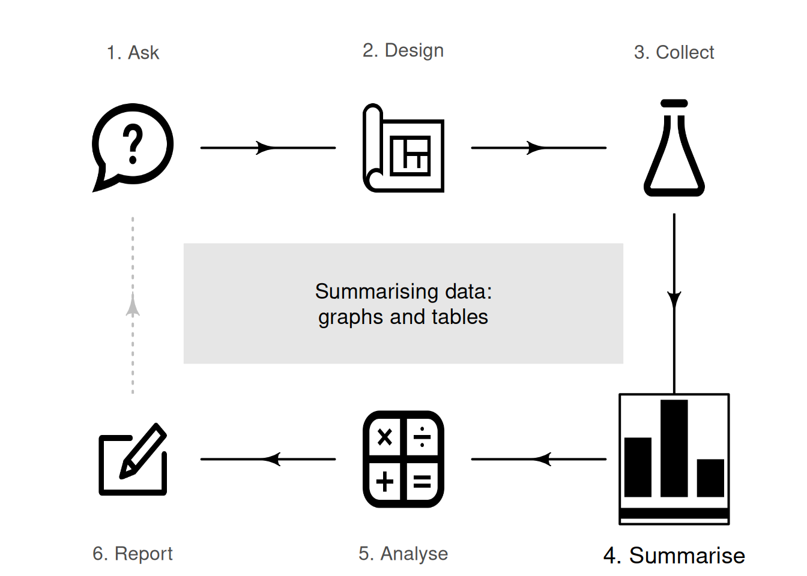
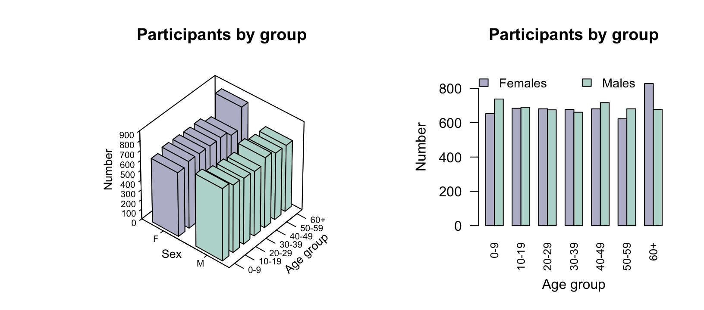
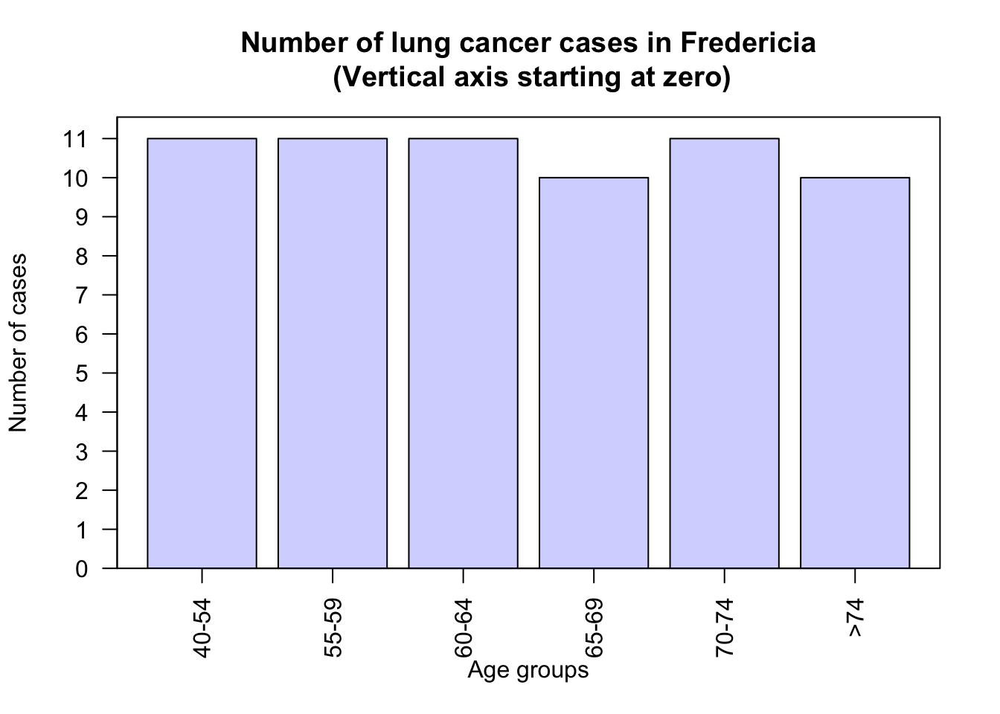
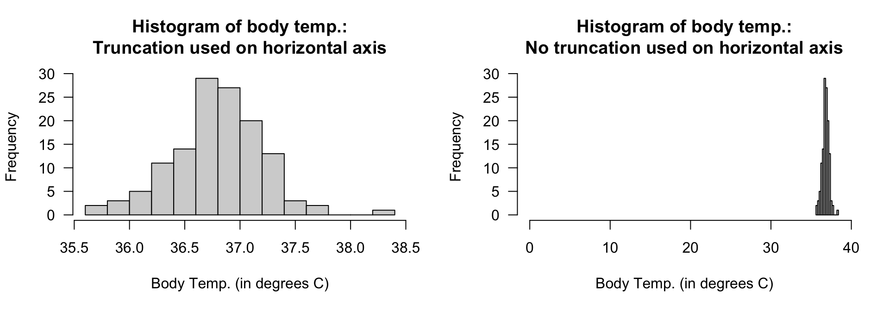
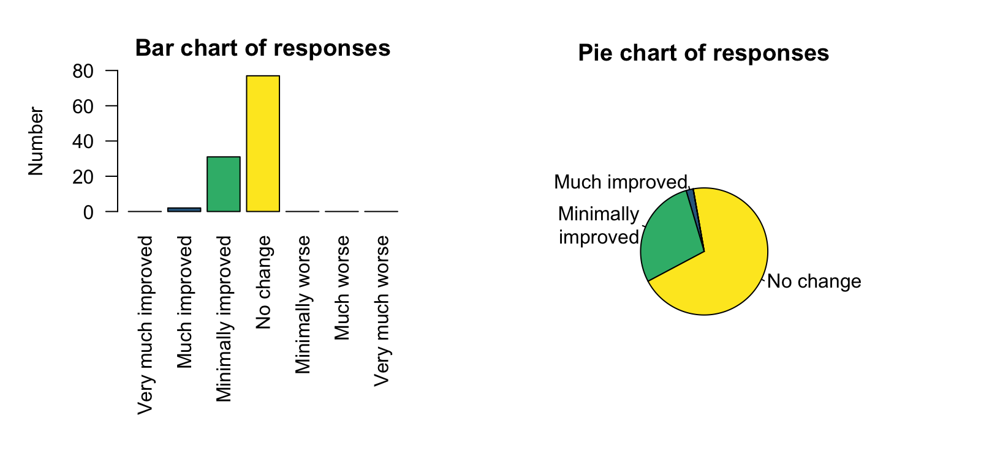
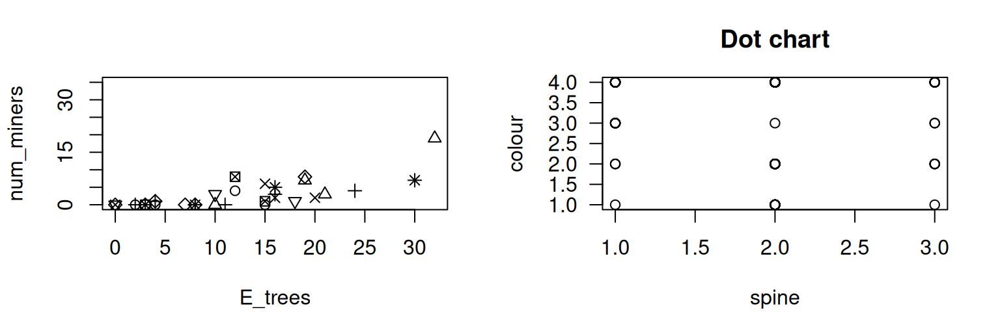
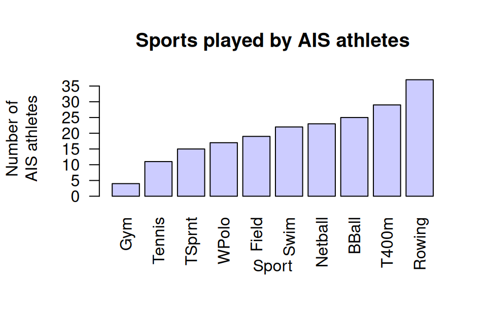
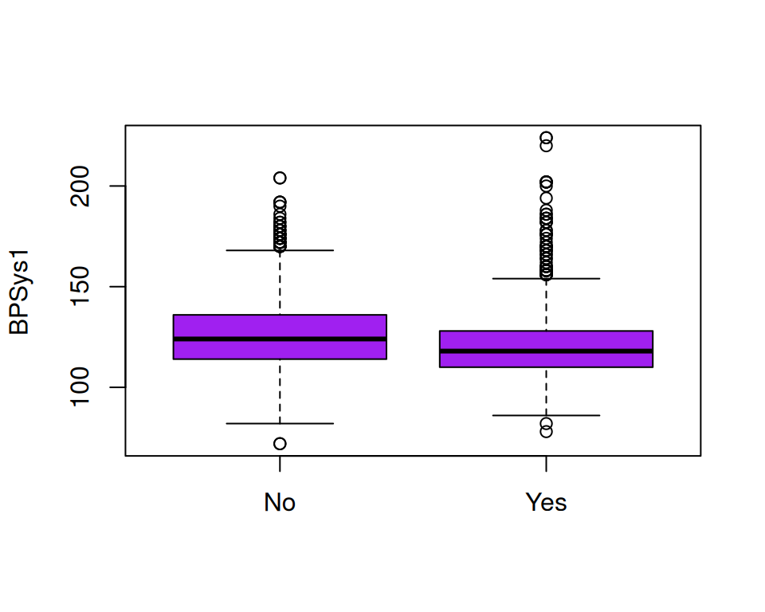

# More details about tables and graphs {#SummariseComments}

<!-- Introductions; easier to separate by format -->

::: {.objectivesBox .objectives data-latex="{iconmonstr-target-4-240.png}"}
So far, you have learnt to ask an RQ, design a study, collect the data, describe the data, and summarise data.
**In this chapter**, you will learn to:

* construct clear and informative graphs.
* construct clear and informative tables.
:::

<!-- Define colours as appropriate -->

## Introduction {#MoreTablesGraphsIntro}

A summary of the data is important for understanding the data, and for planning the direction of the analysis.
In this chapter, we make some general comments for constructing graphs and tables.
Always remember:

::: {.importantBox .important data-latex="{iconmonstr-warning-8-240.png}"}
The purpose of a graph and a table is to display the information in the clearest, simplest possible way, to facilitate understanding the message(s) in the data.
:::

## More details about preparing graphs {#GraphsConstructing}
\index{Graphs!preparing}\index{Software output!graphs}\index{Graphs!using software}

Helping readers to understand the data is the goal of producing a graph.
You should be able to sketch graphs by hand, but *usually software is used to produce graphs*.\index{Computers and software}
Using a computer makes it easy to try different graphs, to change features of graphs, and to produce the best graph possible.
When creating graphs, ensure you:

* *do* make graphs clear and well-labelled.
* *do* add informative titles and axis labels.
* *do* add units of measurement where necessary.
* *do* add informative captions *below* the figure.
* *do* add units of measurement and axis labels where appropriate.
* *do* make sure text and details are easy to read.
* *do* ensure the axis scales are appropriate.
* *do* add any necessary explanations.
* *do* make it easy for readers to easily make the important comparisons, as far as possible.
* *do not* add artificial third dimensions, or other 'chart junk' [@su2008s]; see Sect.\ \@ref(ThirdDimensions).
* *do not* add optical illusions, such as an artificial third dimension.
* *do not* use distracting colours and fonts; only use different colours and fonts if necessary, and explain that purpose if it is not clear. 
* *do not* make errors.

Some specific problems to be aware of are discussed in the subsections that follows.

### Avoid unnecessary third dimensions {#ThirdDimensions}

Graphs should focus on clear communication.
One barrier to clear communication is using an unnecessary third dimension.
This is poor: such graphs can be misleading and hard to read [@siegrist1996use].

::: {.example #Bar2D3D name="Two- and three-dimensional plots"}
In the nhanes study [@data:NHANES3:Data], the age and sex of each participant were recorded.
Using Fig.\ \@ref(fig:Bar3D2D) (left panel), can you easily determine if more females or more males are present in each age group?

The artificial third dimension makes determining the heights of the bars hard.
In contrast, a side-by-side bar graph (Fig.\ \@ref(fig:Bar3D2D), right panel) makes it clear whether each age group has more females or more males.\index{Graphs!side-by-side bar chart}
:::

(ref:NHANES) Two plots of the nhanes participants, divided by age group and sex. Left: a three-dimensional bar chart. Right: a side-by-side bar chart.

(\#fig:Bar3D2D)(ref:NHANES)

### Avoid overplotting {#Overplotting}

Some plots, such as dot charts and scatterplots, may suffer from *overplotting*:\index{Overplotting} when multiple observations have the same (or nearly the same) values, and these cannot be distinguished on the graph.
Overplotting can especially be a problem when plotting *discrete* quantitative data.
In many cases (such as dot charts), points can be *jittered*\index{Overplotting!jittering} by adding a small amount of randomness to the observations, or *stacked*; see Example\ \@ref(exm:Dotchart2DGorillas).\index{Overplotting!stacking}
Jittering is the best option for scatterplots.
Overplotted points can change readers' impression of the data, since some observations are obscured and are effectively 'lost' to the reader.

### Take care when truncating axes  {#TruncatingAxes}

One common optical illusion occurs when the frequency (or percentage) axis does not start at zero.
This is a problem in graphs where the distance represented visually implies the frequency of those observations, as with the count (or percentage) axis in bar charts, dot charts, or histograms.
This is *not* a problem in, for example, boxplots and scatterplots, where the distance of points from zero do not visually imply any quantity of interest.

Sometimes, the axes may be truncated intentionally so the differences are easier to see.
In these cases, the reader should be alerted that the axes have been truncated for this reason.

::: {.example #VerticalTruncationOK name="Truncating is not appropriate"}
Consider data recording the number of lung cancer cases in Fredericia in various age groups [@data:andersen:1977].

The animation below shows a bar chart with the count (vertical axis) starting at zero (when the counts in each age group look similar), and then gradually changing where the vertical axis starts... so that the final bar chart make the number of cases in each age groups look very different.
The graph is visually misleading when the graph does not start at a count of zero, since the height of the bars from the axis visually implies the frequency of those observations.
:::

::: {.example #VerticalTruncation name="Truncating is appropriate"}
Consider data recording the body temperature of $n = 130$ people (@data:mackowiak:bodytemp, @data:Shoemaker1996:Temperature).
A histogram of the data (Fig.\ \@ref(fig:HistosTemp), left panel) clearly shows the distribution of body temperatures.

The vertical axis, displaying the counts, must start at zero since the bar heights visually imply a quantity of interest.
However, the horizontal axis starts at\ $35.5$^o^C, which does not create any problems as the *distances* from a temperature of\ $0$^o^C do not visually imply any quantity of interest.\index{Graphs!histogram}

In contrast, starting the horizontal axis at a temperature of\ $0$^o^C (Fig.\ \@ref(fig:HistosTemp), right panel) makes any details in the histogram difficult to see; the histogram is pointless.
:::

(\#fig:HistosTemp)Two histograms displaying the body temperature of $130$ people. Left: a well-constructed histogram. Right: a poorly-constructed histogram.

<iframe src="https://learningapps.org/watch?v=pgn3q7ptv22" style="border:0px;width:100%;height:500px" allowfullscreen="true" webkitallowfullscreen="true" mozallowfullscreen="true"></iframe>

### Take care when using pie charts {#PieChartProblems}
\index{Graphs!bar chart}\index{Graphs!pie chart}

As noted in Sect.\ \@ref(PieCharts), pie charts may be hard to read: humans compare *lengths* (bar and dot charts) better than *angles* (pie charts) [@data:Friel:Graphs].
Pie charts are also difficult to use with levels having zero or small counts.

::: {.example #PieSmallCounts name="Pie charts with small counts"}
@data:Solomon2002:ginkgo studied the use of ginkgo for memory enhancement.
Caregivers blinded\index{Blinding} to the treatment (ginkgo or placebo)\index{Placebo} reported the impact on subjects' memory.
The bar chart (Fig.\ \@ref(fig:PieSmallCounts), left panel), for subjects on the placebo, shows that four of the available categories had zero responses, and one had a very small number of responses (two).
The pie chart (right) make the small category difficult to see, and the categories with zero counts impossible to see.
:::

(\#fig:PieSmallCounts)Data with zeros and small counts are easy to see in a bar chart (left panel) and dot chart, but difficult to see in a pie chart (right panel).

## More details about preparing tables {#TablesConstructing}
\index{Tables!preparing}

A computer is helpful for constructing tables.
Using a computer also makes it easy to try different orientations or layouts.
As with graphs, the purpose of tables is to help readers understand the data.
When creating numerical summary tables, ensure you:

* *do* make tables clear and well-labelled.
* *do* use clear and informative row and column labels (as necessary).
* *do* add units of measurement where necessary.
* *do* add informative captions *above* the table.
* *do* add units of measurement and value labels where appropriate.
* *do* make sure text and details are easy to read.
* *do* round numbers appropriately (don't necessarily use all figures provided by software).
* *do* align numbers in the table by decimal point if possible, for easier reading and comparing.
* *do* construct the table to allow readers to easily make the important comparisons, as far as possible (space restriction may take precedence, for example).
* *do not* use distracting colours and fonts; only use different colours and fonts if necessary, and explain that purpose if it is not clear. 
* *do not* use vertical lines (in general), and use *very few* horizontal lines.
  Horizontal lines can be used to group columns (for example, see Table\ \@ref(tab:WaterAccessSummaryCommentsTable)).

## Example: water access {#WaterAcessSummary}

@lopez2022farmers recorded data about access to water in three rural communities in Cameroon (see Sects.\ \@ref(WaterAccessQual) and\ \@ref(WaterAccessQuant)).
The study could be used to determine associations to the incidence of diarrhoea in young children ($85$ households had children under\ $5$ years of age).
Relationships between the incidence of diarrhoea and some other variables appear in Figs.\ \@ref(fig:WaterAccessQualCompare) and\ \@ref(fig:WaterAccessCompareQuantFigs).
A summary table of information can also be constructed (Table\ \@ref(tab:WaterAccessSummaryCommentsTable)).

In this table, note that:

* quantitative and qualitative variables are summarised differently, but appropriately.
* units of measurements are given where appropriate (i.e., only for age).
* numbers in columns are aligned for easier reading and comparing.

<table>
<caption>(\#tab:WaterAccessSummaryCommentsTable)Numerical summary of the water-access data in $85$ households with children, according of whether children under $5$ years of age had reported diarrhoea in the last two weeks.</caption>
 <thead>
<tr>
<th style="empty-cells: hide;border-bottom:hidden;" colspan="1"></th>
<th style="border-bottom:hidden;padding-bottom:0; padding-left:3px;padding-right:3px;text-align: center; font-weight: bold; " colspan="2">
All households
</th>
<th style="border-bottom:hidden;padding-bottom:0; padding-left:3px;padding-right:3px;text-align: center; font-weight: bold; " colspan="2">
Reported diarrhoea
</th>
<th style="border-bottom:hidden;padding-bottom:0; padding-left:3px;padding-right:3px;text-align: center; font-weight: bold; " colspan="2">
No reported diarrhoea
</th>
</tr>
  <tr>
   <th style="text-align:left;font-weight: bold;">   </th>
   <th style="text-align:center;font-weight: bold;"> $n$ </th>
   <th style="text-align:center;font-weight: bold;"> Summary </th>
   <th style="text-align:center;font-weight: bold;"> $n$ </th>
   <th style="text-align:center;font-weight: bold;"> Summary </th>
   <th style="text-align:center;font-weight: bold;"> $n$ </th>
   <th style="text-align:center;font-weight: bold;"> Summary </th>
  </tr>
 </thead>
<tbody>
  <tr>
   <td style="text-align:left;font-weight: bold;"> Age$^a$ </td>
   <td style="text-align:center;font-weight: bold;"> $85$ </td>
   <td style="text-align:center;font-weight: bold;"> $37.0$   $( 28.0 )$ </td>
   <td style="text-align:center;font-weight: bold;"> $59$ </td>
   <td style="text-align:center;font-weight: bold;"> $35.0$   $( 22.5 )$ </td>
   <td style="text-align:center;font-weight: bold;"> $26$ </td>
   <td style="text-align:center;font-weight: bold;"> $46.5$ \ $( 28.5 )$ </td>
  </tr>
  <tr>
   <td style="text-align:left;font-weight: bold;"> Household size$^b$ </td>
   <td style="text-align:center;font-weight: bold;"> $85$ </td>
   <td style="text-align:center;font-weight: bold;"> $\phantom{0}7.0$   $( \phantom{0}6.0 )$ </td>
   <td style="text-align:center;font-weight: bold;"> $59$ </td>
   <td style="text-align:center;font-weight: bold;"> $\phantom{0}6.0$   $( \phantom{0}4.5 )$ </td>
   <td style="text-align:center;font-weight: bold;"> $26$ </td>
   <td style="text-align:center;font-weight: bold;"> $\phantom{0}8.5$ \ $( \phantom{0}7.8 )$ </td>
  </tr>
  <tr>
   <td style="text-align:left;font-weight: bold;"> Under 5s in household$^c$ </td>
   <td style="text-align:center;font-weight: bold;"> $85$ </td>
   <td style="text-align:center;font-weight: bold;"> $\phantom{0}2.0$   $( \phantom{0}2.0 )$ </td>
   <td style="text-align:center;font-weight: bold;"> $59$ </td>
   <td style="text-align:center;font-weight: bold;"> $\phantom{0}2.0$   $( \phantom{0}1.0 )$ </td>
   <td style="text-align:center;font-weight: bold;"> $26$ </td>
   <td style="text-align:center;font-weight: bold;"> $\phantom{0}2.0$ \ $( \phantom{0}1.8 )$ </td>
  </tr>
  <tr grouplength="3"><td colspan="7" style="border-bottom: 1px solid;"><strong>Region$^b$</strong></td></tr>
<tr>
   <td style="text-align:left;padding-left: 2em;" indentlevel="1"> Mbeng </td>
   <td style="text-align:center;"> $26$ </td>
   <td style="text-align:center;"> $30.6$\% </td>
   <td style="text-align:center;"> $14$ </td>
   <td style="text-align:center;"> $53.8$\% </td>
   <td style="text-align:center;"> $12$ </td>
   <td style="text-align:center;"> $46.2$\% </td>
  </tr>
  <tr>
   <td style="text-align:left;padding-left: 2em;" indentlevel="1"> Mbih </td>
   <td style="text-align:center;"> $28$ </td>
   <td style="text-align:center;"> $32.9$\% </td>
   <td style="text-align:center;"> $19$ </td>
   <td style="text-align:center;"> $67.9$\% </td>
   <td style="text-align:center;"> $\phantom{0}9$ </td>
   <td style="text-align:center;"> $32.1$\% </td>
  </tr>
  <tr>
   <td style="text-align:left;padding-left: 2em;" indentlevel="1"> Ntsingbeu </td>
   <td style="text-align:center;"> $31$ </td>
   <td style="text-align:center;"> $36.5$\% </td>
   <td style="text-align:center;"> $26$ </td>
   <td style="text-align:center;"> $83.9$\% </td>
   <td style="text-align:center;"> $\phantom{0}5$ </td>
   <td style="text-align:center;"> $16.1$\% </td>
  </tr>
  <tr grouplength="4"><td colspan="7" style="border-bottom: 1px solid;"><strong>Water source$^b$</strong></td></tr>
<tr>
   <td style="text-align:left;padding-left: 2em;" indentlevel="1"> Tap </td>
   <td style="text-align:center;"> $\phantom{0}6$ </td>
   <td style="text-align:center;"> $\phantom{0}7.1$\% </td>
   <td style="text-align:center;"> $\phantom{0}5$ </td>
   <td style="text-align:center;"> $83.3$\% </td>
   <td style="text-align:center;"> $\phantom{0}1$ </td>
   <td style="text-align:center;"> $16.7$\% </td>
  </tr>
  <tr>
   <td style="text-align:left;padding-left: 2em;" indentlevel="1"> Bore </td>
   <td style="text-align:center;"> $56$ </td>
   <td style="text-align:center;"> $65.9$\% </td>
   <td style="text-align:center;"> $40$ </td>
   <td style="text-align:center;"> $71.4$\% </td>
   <td style="text-align:center;"> $16$ </td>
   <td style="text-align:center;"> $28.6$\% </td>
  </tr>
  <tr>
   <td style="text-align:left;padding-left: 2em;" indentlevel="1"> Well </td>
   <td style="text-align:center;"> $10$ </td>
   <td style="text-align:center;"> $11.8$\% </td>
   <td style="text-align:center;"> $\phantom{0}5$ </td>
   <td style="text-align:center;"> $50.0$\% </td>
   <td style="text-align:center;"> $\phantom{0}5$ </td>
   <td style="text-align:center;"> $50.0$\% </td>
  </tr>
  <tr>
   <td style="text-align:left;padding-left: 2em;" indentlevel="1"> River </td>
   <td style="text-align:center;"> $13$ </td>
   <td style="text-align:center;"> $15.3$\% </td>
   <td style="text-align:center;"> $\phantom{0}9$ </td>
   <td style="text-align:center;"> $69.2$\% </td>
   <td style="text-align:center;"> $\phantom{0}4$ </td>
   <td style="text-align:center;"> $30.8$\% </td>
  </tr>
  <tr grouplength="2"><td colspan="7" style="border-bottom: 1px solid;"><strong>Education$^b$</strong></td></tr>
<tr>
   <td style="text-align:left;padding-left: 2em;" indentlevel="1"> Primary or less </td>
   <td style="text-align:center;"> $38$ </td>
   <td style="text-align:center;"> $44.7$\% </td>
   <td style="text-align:center;"> $27$ </td>
   <td style="text-align:center;"> $71.1$\% </td>
   <td style="text-align:center;"> $11$ </td>
   <td style="text-align:center;"> $28.9$\% </td>
  </tr>
  <tr>
   <td style="text-align:left;padding-left: 2em;" indentlevel="1"> Secondary or higher </td>
   <td style="text-align:center;"> $47$ </td>
   <td style="text-align:center;"> $55.3$\% </td>
   <td style="text-align:center;"> $32$ </td>
   <td style="text-align:center;"> $68.1$\% </td>
   <td style="text-align:center;"> $15$ </td>
   <td style="text-align:center;"> $31.9$\% </td>
  </tr>
  <tr grouplength="2"><td colspan="7" style="border-bottom: 1px solid;"><strong>Has livestock$^b$</strong></td></tr>
<tr>
   <td style="text-align:left;padding-left: 2em;" indentlevel="1"> No </td>
   <td style="text-align:center;"> $20$ </td>
   <td style="text-align:center;"> $23.5$\% </td>
   <td style="text-align:center;"> $17$ </td>
   <td style="text-align:center;"> $85.0$\% </td>
   <td style="text-align:center;"> $\phantom{0}3$ </td>
   <td style="text-align:center;"> $15.0$\% </td>
  </tr>
  <tr>
   <td style="text-align:left;padding-left: 2em;" indentlevel="1"> Yes </td>
   <td style="text-align:center;"> $65$ </td>
   <td style="text-align:center;"> $76.5$\% </td>
   <td style="text-align:center;"> $42$ </td>
   <td style="text-align:center;"> $64.6$\% </td>
   <td style="text-align:center;"> $23$ </td>
   <td style="text-align:center;"> $35.4$\% </td>
  </tr>
</tbody>
<tfoot>
<tr>
<td style = 'padding: 0; border:0;' colspan='100%'>a Quantitative variables are summarised using medians and IQR.</td>
</tr>
<tr>
<td style = 'padding: 0; border:0;' colspan='100%'>b Qualitative variables are summarised using counts and percentages.</td>
</tr>
</tfoot>
</table>

The table summarises the *sample*, but RQs are about the *population*.
For example, one relational RQ could be:

>  Is the percentage of households with children under\ $5$ years of age having diarrhoea the same for households that do and do not keep livestock?

Since the observed sample is one of countless possible samples that may have been selected, answering RQs about the population is not straightforward.
In the observed sample, $85.0$% of households that *did not* keep livestock reported diarrhoea in children under\ $5$, while $64.6$% of households that *did* keep livestock reported diarrhoea in children under\ $5$.
That is, a difference is seen *in the sample*; but RQs ask about the *population*.

Broadly, two possible reasons could explain why the *sample* percentages of households reporting diarrhoea in children are different:

1. *The **population** percentages are the same*. 
The *sample* percentages are *different* simply because of the households selected in this particular sample.
Another sample, with different households, might produce different sample percentages.
*Sampling variation explains the difference in the sample percentages*.
2. *The **population** percentages are different*.
The difference between the *sample* percentages reflects this difference between the *population* percentages.

The difficulty is knowing which of these reasons ('hypotheses')\index{Hypotheses} is the most likely explanation for the difference between the sample percentages.
This question is of prime importance as it answers the RQ.\spacex
Tools for answering these questions are considered later in this book.

## Quick review questions {#SummaryCommentsQuickReview}

::: {.webex-check .webex-box}
Are the following statements *true* or *false*?

1. Graphs usually have their captions *under* the figure. \tightlist
<select class='webex-select'><option value='blank'></option><option value='answer'>TRUE</option><option value=''>FALSE</option></select>
1. Graphs should use as many colours as possible.
<select class='webex-select'><option value='blank'></option><option value=''>TRUE</option><option value='answer'>FALSE</option></select>
1. Graphs should usually be carefully created using computer software.
<select class='webex-select'><option value='blank'></option><option value='answer'>TRUE</option><option value=''>FALSE</option></select>
1. Tables should have plenty of horizontal and vertical lines.
<select class='webex-select'><option value='blank'></option><option value=''>TRUE</option><option value='answer'>FALSE</option></select>
1. Tables usually have their captions *under* the table.
<select class='webex-select'><option value='blank'></option><option value=''>TRUE</option><option value='answer'>FALSE</option></select>
:::

## Exercises {#SummariseCommentsExercises}

[Answers to odd-numbered exercises] are given at the end of the book. 

::: {.exercise #Graphs123}
What would be the best graph for displaying the data for these situations?

1. Researchers record the pH of water and the temperature of the water, in various creeks in the north island of New Zealand, to explore the relationship between pH and temperature.

<label><input type="radio" autocomplete="off" name="radio_TTKPAMQUIM" value=""></input> A bar chart</label><label><input type="radio" autocomplete="off" name="radio_TTKPAMQUIM" value=""></input> A histogram</label><label><input type="radio" autocomplete="off" name="radio_TTKPAMQUIM" value=""></input> A boxplot</label><label><input type="radio" autocomplete="off" name="radio_TTKPAMQUIM" value=""></input> A histogram of the differences</label><label><input type="radio" autocomplete="off" name="radio_TTKPAMQUIM" value="answer"></input> A scatterplot</label><label><input type="radio" autocomplete="off" name="radio_TTKPAMQUIM" value=""></input> A side-by-side bar chart</label>

2. Researchers measure the difference between each swimmers' fastest $100\ms$ time and their fastest $200\ms$ time.
The researchers were interested in the average time *difference*.

<label><input type="radio" autocomplete="off" name="radio_LSGAKATJJR" value=""></input> A bar chart</label><label><input type="radio" autocomplete="off" name="radio_LSGAKATJJR" value=""></input> A histogram</label><label><input type="radio" autocomplete="off" name="radio_LSGAKATJJR" value=""></input> A boxplot</label><label><input type="radio" autocomplete="off" name="radio_LSGAKATJJR" value="answer"></input> A histogram of the differences</label><label><input type="radio" autocomplete="off" name="radio_LSGAKATJJR" value=""></input> A scatterplot</label><label><input type="radio" autocomplete="off" name="radio_LSGAKATJJR" value=""></input> A side-by-side bar chart</label>

3. A research study examined the way in which students usually came to university (bus; private car; carpooling; etc.) and their program of study.

<label><input type="radio" autocomplete="off" name="radio_SETJWOAHLI" value=""></input> A bar chart</label><label><input type="radio" autocomplete="off" name="radio_SETJWOAHLI" value=""></input> A histogram</label><label><input type="radio" autocomplete="off" name="radio_SETJWOAHLI" value=""></input> A boxplot</label><label><input type="radio" autocomplete="off" name="radio_SETJWOAHLI" value=""></input> A histogram of the differences</label><label><input type="radio" autocomplete="off" name="radio_SETJWOAHLI" value=""></input> A scatterplot</label><label><input type="radio" autocomplete="off" name="radio_SETJWOAHLI" value="answer"></input> A side-by-side bar chart</label>

:::

::: {.exercise #Graphs456}
What would be the best graph for displaying the data for these situations?

1. Researchers record the number of times a specific recycling bin is used each day at a shopping centre, over many days.

<label><input type="radio" autocomplete="off" name="radio_HBDUJIUPTI" value=""></input> A bar chart</label><label><input type="radio" autocomplete="off" name="radio_HBDUJIUPTI" value="answer"></input> A histogram</label><label><input type="radio" autocomplete="off" name="radio_HBDUJIUPTI" value=""></input> A boxplot</label><label><input type="radio" autocomplete="off" name="radio_HBDUJIUPTI" value=""></input> A histogram of the differences</label><label><input type="radio" autocomplete="off" name="radio_HBDUJIUPTI" value=""></input> A scatterplot</label><label><input type="radio" autocomplete="off" name="radio_HBDUJIUPTI" value=""></input> A side-by-side bar chart</label>

2. Researchers measure the difference between heart rate before and two hours after drinking a cup of coffee.
The researchers were interested in the average increase in heart rate.

<label><input type="radio" autocomplete="off" name="radio_AMBDXFPPOC" value=""></input> A bar chart</label><label><input type="radio" autocomplete="off" name="radio_AMBDXFPPOC" value=""></input> A histogram</label><label><input type="radio" autocomplete="off" name="radio_AMBDXFPPOC" value=""></input> A boxplot</label><label><input type="radio" autocomplete="off" name="radio_AMBDXFPPOC" value="answer"></input> A histogram of the differences</label><label><input type="radio" autocomplete="off" name="radio_AMBDXFPPOC" value=""></input> A scatterplot</label><label><input type="radio" autocomplete="off" name="radio_AMBDXFPPOC" value=""></input> A side-by-side bar chart</label>

3. A research study recorded the diet of students (vegan; vegetarian; other) and the cost of groceries in the previous week, for many students.
The researchers were exploring if there was any relationship between diet and cost of groceries.

<label><input type="radio" autocomplete="off" name="radio_BGZNXQVSAV" value=""></input> A bar chart</label><label><input type="radio" autocomplete="off" name="radio_BGZNXQVSAV" value=""></input> A histogram</label><label><input type="radio" autocomplete="off" name="radio_BGZNXQVSAV" value="answer"></input> A boxplot</label><label><input type="radio" autocomplete="off" name="radio_BGZNXQVSAV" value=""></input> A histogram of the differences</label><label><input type="radio" autocomplete="off" name="radio_BGZNXQVSAV" value=""></input> A scatterplot</label><label><input type="radio" autocomplete="off" name="radio_BGZNXQVSAV" value=""></input> A side-by-side bar chart</label>

:::

::: {.exercise #GraphsLimeTrees}
@data:ForestBiomass2017 recorded these variables for $385$\ lime trees in Russia:
the foliage biomass (in\ kg; the response variable);
the tree diameter (in\ cm; the explanatory variable);
the age of the tree (in\ years); and
the origin of the tree (one of Coppice, Natural, or Planted).

The purpose of the study is to estimate the foliage biomass from the tree diameter, in the presence of some extraneous variables.
What graphs would be useful?
:::

::: {.exercise #GraphNitrogenInSoil}
@data:Lane2002:GLMsoilscience recorded the soil nitrogen after applying different fertiliser doses.
The researchers recorded:

* the fertiliser dose, in kilograms of nitrogen per hectare; 
* the soil nitrogen, in kilograms of nitrogen per hectare; and
* the fertiliser source; one of 'inorganic' or 'organic'.

What graphs would be useful for understanding the data?
:::

::: {.exercise #GraphNoisyMiners}
@data:Maron:eucthreshold counted the number of noisy miners (an Australian bird) and eucalyptus trees in random quadrats.
Critique the graph (not given by @data:Maron:eucthreshold!) of the data (Fig.\ \@ref(fig:MinerCrabPlot), left panel).
:::

(\#fig:MinerCrabPlot)Left: the number of noisy miners and the number of eucalyptus trees. Right: a scatterplot of the colour of female horseshoe crabs and the condition of their spines.

::: {.exercise #GraphHorseshoeCrabs}
@data:brockmann:crabs recorded, among other variables, the colour of the carapace ('Light medium', 'Medium', 'Dark medium' or 'Dark') and the condition of the carapace ('Both OK', 'One OK', 'None OK') of $n = 173$ female horseshoe crabs.
Critique the scatterplot (Fig.\ \@ref(fig:MinerCrabPlot), right panel) used to explore the data.
:::

::: {.exercise #GraphsMADRS}
@data:Danielsson2014:Depression examined the change in madrs (a *quantitative* scale measuring level of depression) and treatment group (whether each person was treated using: exercise; body awareness; or advice).

1. What is the response variable?
1. What is the explanatory variable?
1. What graphs would be useful for exploring the data and the relationships of interest?
:::

::: {.exercise #GraphsSkewBar}
A study of high-performance athletes at the *Australian Institute of Sport* (AIS) [@data:Telford1991:sexsportsize] recorded numerous variables about athletes.
A plot for the sports played by the athletes is shown in Fig.\ \@ref(fig:AISSportBarchart).
How would you describe the data: left skewed, right skewed, approximately symmetrical?
Or something else?
:::

(\#fig:AISSportBarchart)Sports played by athletes in the AIS study.

::: {.exercise #GraphsTyping}
[*Dataset*: `Typing`]
The `Typing` dataset [@pinet2022typing] contains four variables: typing speed (`mTS`), typing accuracy (`mAcc`), age (`Age`), and sex (`Sex`) for $1\,301$\ students.
Produce graphs necessary for understanding the data, making sure to explain what they reveal.

Does the mean typing speed or mean accuracy appear to differ by the age or sex of the student? 
What other questions could be useful to ask about the data?
:::

::: {.exercise #WriteExercisesNHANES}
[*Dataset*: `NHANES`]
Consider the nhanes data.
In preparing a paper about this study, suppose Fig.\ \@ref(fig:ResultsPlot) and Tables\ \@ref(tab:ResultsTable) were produced.
Critique these.
:::

\begin{figure}
\begin{minipage}{0.45\textwidth}
\captionof{table}{A table of results\label{tab:ResultsTable}.}
\fontsize{8}{12}\selectfont
\begin{@empty}

\begin{tabular}{lll}
\toprule
  & \textbf{Mean} & \textbf{Std dev.}\\
\midrule
\textbf{Current smoker} & $206.6$ & $46$\\
\textbf{Current non-smoker} & $214.64$ & $48.7945$\\
\textbf{Difference} & $8.03$ & \\
\bottomrule
\end{tabular}
\end{@empty}
\end{minipage}
\hspace{0.1\textwidth}
\begin{minipage}{0.45\textwidth}%

\captionof{figure}{A boxplot\label{fig:ResultsPlot}.}
\end{minipage}
\end{figure}

<table>
<caption>(\#tab:ResultsTable)A table of results.</caption>
 <thead>
  <tr>
   <th style="text-align:left;">   </th>
   <th style="text-align:left;"> Mean </th>
   <th style="text-align:left;"> Std dev. </th>
  </tr>
 </thead>
<tbody>
  <tr>
   <td style="text-align:left;"> Current smoker </td>
   <td style="text-align:left;"> $206.6$ </td>
   <td style="text-align:left;"> $46$ </td>
  </tr>
  <tr>
   <td style="text-align:left;"> Current non-smoker </td>
   <td style="text-align:left;"> $214.64$ </td>
   <td style="text-align:left;"> $48.7945$ </td>
  </tr>
  <tr>
   <td style="text-align:left;"> Difference </td>
   <td style="text-align:left;"> $8.03$ </td>
   <td style="text-align:left;">  </td>
  </tr>
</tbody>
</table>

<!-- The figure for LaTeX is in the minipage (combined with data table), so only need show it for the HTML -->

(\#fig:ResultsPlot)A boxplot.

<!-- QUICK REVIEW ANSWERS -->
<!--
::: {.EOCanswerBox .EOCanswer data-latex="{iconmonstr-check-mark-14-240.png}"}
**Answers to *Quick review* questions:**
**1.** True.
**2.** False. Use different colours only if they have a purpose (and explain that purpose if it is not clear).
**3.** True.
**4.** False: very few vertical lines (if any); minimum of horizontal lines.
**5.** False.
:::
-->

