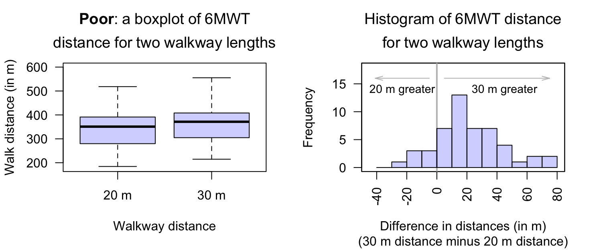
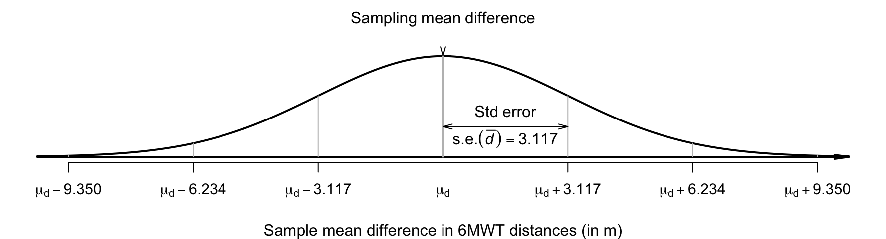
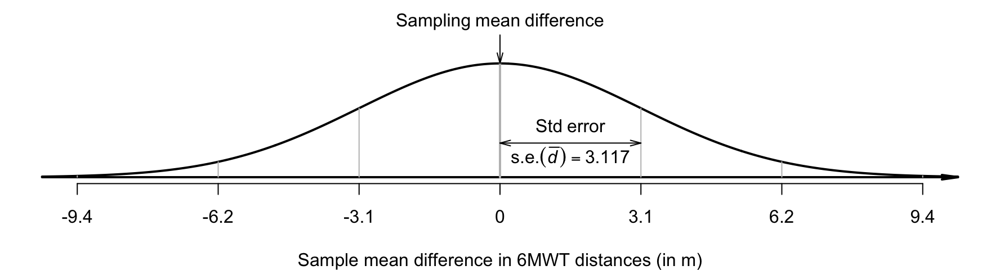
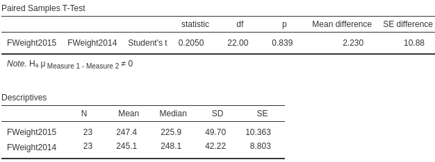
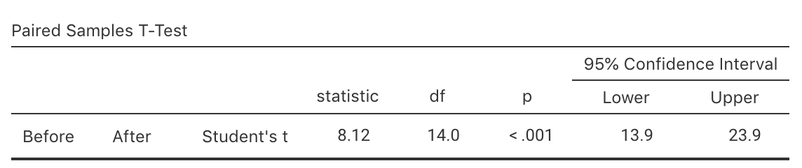
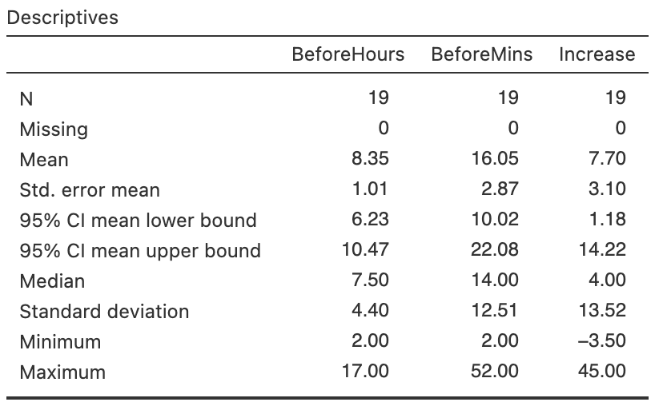
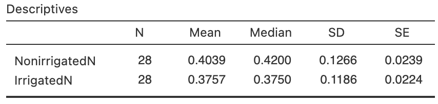

# Mean differences (paired data): CIs and tests {#AnalysisPaired}
\index{Research question!relational}\index{Mean difference}


<!-- Introductions; easier to separate by format -->

::: {.objectivesBox .objectives data-latex="{iconmonstr-target-4-240.png}"}
You have learnt to ask an RQ, design a study, classify and summarise the data, construct confidence intervals, and conduct hypothesis tests.
**In this chapter**, you will learn to:

* identify situations where mean differences are appropriate.
* construct confidence intervals for a mean difference.
* conduct hypothesis tests for the mean difference with paired data.
* determine whether the conditions for using these methods apply in a given situation.
:::


<!-- Define colours as appropriate -->


## Introduction: six-minute walk test {#PairedIntro}

The six-minute walk test (6MWT) measures how far subjects can walk in six minutes, and is used as a simple, low-cost evaluation of fitness and other health-related measures.
The recommended setting for the test is usually a walkway of at least\ $30\ms$.
@saiphoklang2022comparison measured the 6MWT distance when the same subjects used *both*\ $20\ms$ and\ $30\ms$\ walkways.

The comparison is *within* individuals (Sect.\ \@ref(RQsRepeatedMeasures));\index{Comparison!within individuals} this is a *repeated-measures* study.
Each subject has a *pair* of 6MWT measurements, and the study produced *paired data*
(below),
the topic of this chapter.\index{Data!paired}\index{Study types!paired}


\begin{table} \centering \centering\caption{(\#tab:Data6MWT)The six-minute walk test (6MWT) distance, for walkways of $20\ms$\ and $30\ms$\ length. These are the first five and the last five of the $50$ total observations. (A negative difference means the $20\ms$\ distance is greater than the $30\ms$\ distance.)}

\fontsize{8}{10}\selectfont
\begin{tabular}[t]{cccc}
\toprule
\multicolumn{1}{c}{\textbf{ }} & \multicolumn{3}{c}{\textbf{Distance walked (in m)}} \\
\cmidrule(l{3pt}r{3pt}){2-4}
\textbf{Person} & \textbf{$20\ms$\ w'way} & \textbf{$30\ms$\ w'way} & \textbf{Diff.}\\
\midrule
$1$ & $272.1$ & $281.6$ & $\phantom{0}\phantom{0}9.5$\\
$2$ & $425.3$ & $454.4$ & $\phantom{0}29.0$\\
$3$ & $338.2$ & $330.0$ & $\phantom{0}\phantom{0}\llap{$-{}$}8.2$\\
$4$ & $240.0$ & $271.0$ & $\phantom{0}31.0$\\
$5$ & $518.3$ & $555.3$ & $\phantom{0}37.0$\\
$\vdots$ & $\vdots$ & $\vdots$ & $\vdots$\\
\bottomrule
\end{tabular} \quad 
\begin{tabular}[t]{cccc}
\toprule
\multicolumn{1}{c}{\textbf{ }} & \multicolumn{3}{c}{\textbf{Distance walked (in m)}} \\
\cmidrule(l{3pt}r{3pt}){2-4}
\textbf{Person} & \textbf{20\ms\ w'way} & \textbf{30\ms\ w'way} & \textbf{Diff.}\\
\midrule
$\vdots$ & $\vdots$ & $\vdots$ & $\vdots$\\
$46$ & $245.2$ & $245.2$ & $53.2$\\
$47$ & $184.4$ & $184.4$ & $34.0$\\
$48$ & $400.0$ & $400.0$ & $13.9$\\
$49$ & $344.8$ & $344.8$ & $39.4$\\
$50$ & $285.3$ & $285.3$ & $12.6$\\
\bottomrule
\end{tabular}
\end{table}


```{=html}
<div class="datatables html-widget html-fill-item" id="htmlwidget-26ead8f3a2beb51c18fe" style="width:100%;height:auto;"></div>
<script type="application/json" data-for="htmlwidget-26ead8f3a2beb51c18fe">{"x":{"filter":"none","vertical":false,"caption":"<caption>The six-minute walk test (6MWT) distance, for walkways of $20\\ms$ and $30\\ms$ length. (A negative difference means the $20\\ms$ distance is greater than the $30\\ms$ distance.)<\/caption>","fillContainer":false,"data":[["1","2","3","4","5","6","7","8","9","10","11","12","13","14","15","16","17","18","19","20","21","22","23","24","25","26","27","28","29","30","31","32","33","34","35","36","37","38","39","40","41","42","43","44","45","46","47","48","49","50"],[272.1,425.32,338.17,240,518.29,357.13,225.52,391.18,374.17,260,409.68,420,326.78,372.69,400.58,380.16,226.49,299.94,321.81,468.66,357.68,373,396.56,262.76,314.67,365.15,364.12,279.75,221.8,240,260,250.17,289.76,384.33,373.55,391.18,330.55,310.58,435.55,314.24,371.57,392.15,428.23,320,375.22,245.22,184.39,400,344.8,285.33],[281.56,454.35,330,271,555.3,378.11,227.3,370.15,424,273.91,407.56,448.54,338.58,422.46,440.6,390,214.71,364,305.06,498.34,390,390.36,397.96,269.93,342.38,378.13,380.58,304.82,235.79,227,295.55,315.19,304.9,400.88,413.82,400.16,339.67,330,508.92,345.37,446.56,408.13,441.2,343.97,372.7,298.46,218.34,413.87,384.22,297.89],[78,72,77,80,54,60,78,72,67,72,53,64,66,65,58,65,78,79,75,63,63,73,70,69,76,66,60,77,76,66,76,64,80,66,62,77,80,76,62,65,70,61,55,72,66,66,64,68,72,80],[9.460000000000001,29.03,-8.17,31,37.01,20.98,1.78,-21.03,49.83,13.91,-2.12,28.54,11.8,49.77,40.02,9.84,-11.78,64.06,-16.75,29.68,32.32,17.36,1.4,7.17,27.71,12.98,16.46,25.07,13.99,-13,35.55,65.02,15.14,16.55,40.27,8.98,9.119999999999999,19.42,73.37,31.13,74.98999999999999,15.98,12.97,23.97,-2.52,53.24,33.95,13.87,39.42,12.56]],"container":"<table class=\"display\">\n  <thead>\n    <tr>\n      <th>Subject<\/th>\n      <th>Distance (20 m walkway)<\/th>\n      <th>Distance (30 m walkway)<\/th>\n      <th>Age<\/th>\n      <th>Difference<\/th>\n    <\/tr>\n  <\/thead>\n<\/table>","options":{"searching":false,"columnDefs":[{"className":"dt-right","targets":[1,2,3,4]},{"name":" ","targets":0},{"name":"Dist20","targets":1},{"name":"Dist30","targets":2},{"name":"Age","targets":3},{"name":"Diff","targets":4}],"order":[],"autoWidth":false,"orderClasses":false}},"evals":[],"jsHooks":[]}</script>
```


::: {.importantBox .important data-latex="{iconmonstr-warning-8-240.png}"}
Some differences are *negative*.
This does *not* mean a negative distance.
Since the differences are computed as the $30\ms$\ distance minus the $20\ms$\ distance, a negative difference means the $20\ms$\ distance is a larger value than the $30\ms$\ distance.
:::


## Paired data {#PairedData}
\index{Data!paired}

<!-- The RQ is a special case of a *repeated-measures RQs* (Sect.\ \@ref(RQsRepeatedMeasures)),\index{Research question!repeated-measures} where each unit of analysis has just two observations. -->
The data
above
are *paired*.\index{Data!paired}
Computing the *differences* or *changes* between the pairs of observations makes sense, since the values for each pair belong to the same unit of analysis (the same person, in this case).

Pairing data, when appropriate, is useful because individuals can vary substantially, and pairing means that extraneous variables\index{Variables!extraneous} (potentially, *confounding* variables)\index{Variables!confounding} are held constant for those paired observations.
For example, each pair of measurements in
the data above
are recorded for the same person, so both measurements are recorded for someone of the same age, same sex, and with the same physical attributes.

Pairing is a form of blocking\index{Blocking} (Sect.\ \@ref(ManagingConfounding)).
Pairing is a good design strategy when the individuals in the pair are the same, or are very similar, for many extraneous variables.
(For example, the pair may comprise two different people, of the same sex, with similar age, height and weight.)
Pairing often involves taking two measurements from the *same* individuals, as in
the data above.


::: {.definition #PairedData name="Paired data"}
*Paired data* occurs when the outcome is compared for two different, distinct situations for each unit of analysis.
:::


Paired studies appear in many situations; for example, when:

* heart rate is measured for each twin in a pair (the twin-pair is the 'individual'), one of whom exercises regularly and one who does not.
  Pairing the twins is reasonable, given the shared genetics (and probably childhood environments also).
The *difference* between the hearts rates of the twins can be recorded for each pair.
* the body temperature of dogs (the 'individuals') is measured using *both* rectal and ear thermometers for each dog.
  The *difference* between the two recorded temperatures from the thermometers for each dog is recorded.
* blood pressure is recorded from some individuals (Group\ A) after receiving Drug\ A, and from another group of individuals (Group\ B) after receiving Drug\ B.
  Each person in Group\ A is matched with someone in Group\ B of the same sex, similar age and similar weight (e.g., in one of the pairs, both individuals are male, about $30$\ years-of-age, and weighing about $95\kgs$).
  The *difference* between the blood pressure measurements for the individual in Group\ A and the matched person in Group\ B is recorded for each pair.
* the number of campers is recorded at many national parks (the 'individuals') on the first weekend in summer, and on the first weekend in winter.
  The *difference* in camper numbers for each national park between these time points is recorded.

Many of these examples can be extended to beyond two measurements.
For instance, temperatures can be compared on each dog using three different types of thermometers.
In this chapter, only *pairs* of measurements are studied, and only for quantitative variables.


## Summarising the data {#SummarisingPairedCI}

For the 6MWT study, the distance is measured for the same subjects for two different walkway distances.
Each subject receives two measurements, and the *difference* between the distances walked for each individual is computed.\index{Mean difference}


Since the data are paired, an appropriate graph is a histogram of the differences (Sect.\ \@ref(HistoDiffPlot)); specifically, $30\ms$\ distance minus the $20\ms$\ distance.
A boxplot comparing 6MWT distance for both walkway lengths (that is, *not* pairing the data) shows the distribution of distances, and the median distances, are very similar (Fig.\ \@ref(fig:ComparePairedBoxplotsHistogram), left panel).
Any difference in individuals' 6MWT distances is difficult to see and detect.
In addition, linking the $20\ms$ and $30\ms$ distances that belong together for each individual patient is not possible.

However, using a histogram of the differences\index{Graphs!histogram of differences} makes the individuals' differences easier to see (Fig.\ \@ref(fig:ComparePairedBoxplotsHistogram), right panel).
The histogram also makes it easy to see that some subjects walked further with a $20\ms$\ walkway, and some further for a $30\ms$\ walkway.
Individually graphing the distances for both walkway distances may also be useful too (e.g., using two histograms), but a graph of the differences is *crucial*, as the RQ is about those differences.
A case-profile plot (Sect.\ \@ref(CaseProfilePlot)) is also appropriate, but is difficult to read for these data because sample size is large (a line is needed for each of the $50$\ units of analysis).


(ref:WalkwayPlots) Plots of the 6MWT data. Left: graphing the data *incorrectly* as unpaired. Right: a histogram of 6MWT distances changes ($30\ms$\ walkway distance *minus* $20\ms$\ walkway distance; the vertical grey line represents no change in distance).

<div class="figure" style="text-align: center">

<p class="caption">(\#fig:ComparePairedBoxplotsHistogram)(ref:WalkwayPlots)</p>
</div>


The 6MWT distances for each walkway length can be summarised individually (the first two rows of Table\ \@ref(tab:SMWTSummary)) using the methods of Chap.\ \@ref(OneMeanConfInterval), using software (Fig.\ \@ref(fig:SMWTNumericalOutput)).
All statistics are slightly different for the two walkway distances; in particular, the mean\ $30\ms$ walkway distance is slightly larger.
However, since the RQ is about the difference between the distances, a numerical summary of the *differences* is essential (third row of Table\ \@ref(tab:SMWTSummary), based on Fig.\ \@ref(fig:SMWTNumericalOutput)).
Notice that the third row of information is computed from the values in the **Diff.** column in
the data above,
not by (for instance) finding the difference between the standard deviations in the first two rows.


<table>
<caption>(\#tab:SMWTSummary)The numerical summary of the 6MWT data.</caption>
 <thead>
  <tr>
   <th style="text-align:left;font-weight: bold;">   </th>
   <th style="text-align:center;font-weight: bold;"> Mean </th>
   <th style="text-align:center;font-weight: bold;"> Median </th>
   <th style="text-align:center;font-weight: bold;"> Std deviation </th>
   <th style="text-align:center;font-weight: bold;"> Std error </th>
   <th style="text-align:center;font-weight: bold;"> Sample size </th>
  </tr>
 </thead>
<tbody>
  <tr>
   <td style="text-align:left;"> 20m walkway distance (in m) </td>
   <td style="text-align:center;"> $337.82$ </td>
   <td style="text-align:center;"> $351.0$ </td>
   <td style="text-align:center;"> $71.801$ </td>
   <td style="text-align:center;"> $10.154$ </td>
   <td style="text-align:center;"> $50$ </td>
  </tr>
  <tr>
   <td style="text-align:left;"> 30m walkway distance (in m) </td>
   <td style="text-align:center;"> $359.85$ </td>
   <td style="text-align:center;"> $371.4$ </td>
   <td style="text-align:center;"> $77.250$ </td>
   <td style="text-align:center;"> $10.925$ </td>
   <td style="text-align:center;"> $50$ </td>
  </tr>
  <tr>
   <td style="text-align:left;"> Difference (in m) </td>
   <td style="text-align:center;"> $\phantom{0}22.03$ </td>
   <td style="text-align:center;"> $\phantom{0}17.0$ </td>
   <td style="text-align:center;"> $22.039$ </td>
   <td style="text-align:center;"> $\phantom{0}3.117$ </td>
   <td style="text-align:center;"> $50$ </td>
  </tr>
</tbody>
</table>


<div class="figure" style="text-align: center">

<p class="caption">(\#fig:SMWTNumericalOutput)The 6MWT data: numerical summary software output for each group (top), and the CI and test results (bottom).</p>
</div>


The differences (i.e., the **Diff.**\ column in 
the data given in Sect.\ \@ref(PairedIntro))
can be treated like a single sample of data (Table\ \@ref(tab:PairedNotation)), with the notation adapted accordingly:

* $\mu_d$: the mean *difference* in the *population* (in m).
* $\bar{d}$: the mean *difference* in the *sample* (in m).
* $s_d$: the *sample* standard deviation of the *differences* (in m).
* $n$: the number of *differences*.


<table>
<caption>(\#tab:PairedNotation)The notation used for mean differences (paired data) compared to the notation used for one sample mean.</caption>
 <thead>
  <tr>
   <th style="text-align:left;font-weight: bold;">   </th>
   <th style="text-align:center;font-weight: bold;"> One sample mean </th>
   <th style="text-align:center;font-weight: bold;"> Mean difference </th>
  </tr>
 </thead>
<tbody>
  <tr>
   <td style="text-align:left;"> The observations: </td>
   <td style="text-align:center;"> Values: $x$ </td>
   <td style="text-align:center;"> Differences: $d$ </td>
  </tr>
  <tr>
   <td style="text-align:left;"> Population mean: </td>
   <td style="text-align:center;"> $\mu$ </td>
   <td style="text-align:center;"> $\mu_d$ </td>
  </tr>
  <tr>
   <td style="text-align:left;"> Sample mean: </td>
   <td style="text-align:center;"> $\bar{x}$ </td>
   <td style="text-align:center;"> $\bar{d}$ </td>
  </tr>
  <tr>
   <td style="text-align:left;"> Standard deviation: </td>
   <td style="text-align:center;"> $s$ </td>
   <td style="text-align:center;"> $s_d$ </td>
  </tr>
  <tr>
   <td style="text-align:left;"> Standard error of $\bar{x}$: </td>
   <td style="text-align:center;"> $\displaystyle\text{s.e.}(\bar{x}) = \frac{s}{\sqrt{n}}$ </td>
   <td style="text-align:center;"> $\displaystyle\text{s.e.}(\bar{d}) = \frac{s_d}{\sqrt{n}}$ </td>
  </tr>
  <tr>
   <td style="text-align:left;"> Sample size: </td>
   <td style="text-align:center;"> Number of *observations*: $n$ </td>
   <td style="text-align:center;"> Number of *differences*: $n$ </td>
  </tr>
</tbody>
</table>


## Confidence intervals for $\mu_d$  {#MeanDiffCI}
\index{Sampling distribution!paired quantitative data}\index{Confidence intervals!paired quantitative data|(}\index{Sampling distribution!mean difference}\index{Confidence intervals!mean difference|(}


The data in
Sect.\ \@ref(PairedIntro)
can be used to answer this repeated-measures, estimation RQ:

> For Thai patients with chronic obstructive pulmonary disease, what is the mean difference between the 6MWT distance when subjects use a\ $20\ms$ walkway and a\ $30\ms$ walkway?

Every possible sample of $n = 50$ subjects comprises different people, and hence produces different 6MWT distances for\ $20\ms$ and\ $30\ms$ walkways.
For this reason, the 6MWT distance summaries in Table\ \@ref(tab:SMWTSummary) include standard errors.
Since the 6MWT distance varies from sample to sample for each person, the *differences* between the distances for each person varies from sample to sample too, and also have a *sampling distribution*.


::: {.definition #DEFSamplingDistributionDbar name="Sampling distribution of a sample mean difference"}
The *sampling distribution of a sample mean difference* is (when certain conditions are met; Sect.\ \@ref(ValiditySampleMeanDiff)) described by:

* an approximate normal distribution,
* centred around the *sampling mean* whose value is the population mean *difference*\ $\mu_d$,
* with a standard deviation, called the standard error of the difference, of 
$\displaystyle\text{s.e.}(\bar{d}) = \frac{s_d}{\sqrt{n}}$,

where\ $n$ is the number of differences, and\ $s_d$ is the standard deviation of the individual differences in the sample.
:::


<!-- ```{r PairedNotation} -->
<!-- DiffNotation <- array(dim = c(6, 2)) -->
<!-- colnames(DiffNotation) <- c(	"One sample mean",  -->
<!--                              "Mean difference") -->
<!-- rownames(DiffNotation) <- c(	"The observations:", -->
<!--                              "Sample mean:", -->
<!--                              "Standard deviation:", -->
<!--                              "Standard error of $\\bar{x}$:", -->
<!--                              "Sample size:", -->
<!--                              "Confidence interval:") -->


<!-- if( knitr::is_latex_output() ) { -->
<!--   DiffNotation[1, ] <- c(	"Values: $x$",  -->
<!--                           "Differences: $d$") -->
<!--   DiffNotation[2, ] <- c(	"$\\bar{x}$",		 -->
<!--                           "$\\bar{d}$") -->
<!--   DiffNotation[3, ] <- c(	"$s$", 			 -->
<!--                           "$s_d$") -->
<!--   DiffNotation[4, ] <- c(	"$\\displaystyle\\text{s.e.}(\\bar{x}) = \\frac{s}{\\sqrt{n}}$", -->
<!--                           "$\\displaystyle\\text{s.e.}(\\bar{d}) = \\frac{s_d}{\\sqrt{n}}$") -->
<!--   DiffNotation[5, ] <- c(	"Number of \\emph{observations}: $n$", -->
<!--                           "Number of \\emph{differences}: $n$") -->
<!--   DiffNotation[6, ] <- c(	"$\\bar{x}\\pm\\big(\\text{multiplier}\\times \\text{s.e.}(\\bar{x})\\big)$", -->
<!--                           "$\\bar{d}\\pm\\big(\\text{multiplier}\\times \\text{s.e.}(\\bar{d})\\big)$") -->

<!--   kable( DiffNotation, -->
<!--          format = "latex", -->
<!--          booktabs = TRUE, -->
<!--          align = c("c", "c"), -->
<!--          longtable = FALSE, -->
<!--          escape = FALSE, -->
<!--          col.names = colnames(DiffNotation), -->
<!--          caption = "The notation used for mean differences (paired data) compared to the notation used for one sample mean.") %>% -->
<!--     kable_styling(font_size = 8) %>% -->
<!--     row_spec(0, bold = TRUE)  -->
<!-- } -->
<!-- if( knitr::is_html_output() ) { -->

<!--   DiffNotation[1, ] <- c(	"Values: $x$", 	 -->
<!--                           "Differences: $d$") -->
<!--   DiffNotation[2, ] <- c(	"$\\bar{x}$",		 -->
<!--                           "$\\bar{d}$") -->
<!--   DiffNotation[3, ] <- c(	"$s$", 			 -->
<!--                           "$s_d$") -->
<!--   DiffNotation[4, ] <- c(	"$\\displaystyle\\text{s.e.}(\\bar{x}) = \\frac{s}{\\sqrt{n}}$", -->
<!--                           "$\\displaystyle\\text{s.e.}(\\bar{d}) = \\frac{s_d}{\\sqrt{n}}$") -->
<!--   DiffNotation[5, ] <- c(	"Number of *observations*: $n$", -->
<!--                           "Number of *differences*: $n$") -->
<!--   DiffNotation[6, ] <- c(	"$\\bar{x}\\pm\\big(\\text{multiplier}\\times \\text{s.e.}(\\bar{x})\\big)$", -->
<!--                           "$\\bar{d}\\pm\\big(\\text{multiplier}\\times \\text{s.e.}(\\bar{d})\\big)$") -->

<!--   kable( DiffNotation, -->
<!--                 format = "html", -->
<!--                 booktabs = TRUE, -->
<!--                 longtable = FALSE, -->
<!--                 align = c("c", "c"), -->
<!--                 col.names = colnames(DiffNotation), -->
<!--                 caption = "The notation used for mean differences (paired data) compared to the notation used for one sample mean.") %>% -->
<!--     row_spec(0, bold = TRUE)  -->
<!-- } -->
<!-- ``` -->


For the 6MWT data, the sample mean differences\ $\bar{d}$ are described by (Fig.\ \@ref(fig:SMWTSamplingDist)):

* approximate normal distribution,
* with a sampling mean whose value is\ $\mu_{{d}}$,
* with a *standard error* of
\begin{equation}
\text{s.e.}(\bar{d}) =  \frac{22.039}{\sqrt{50}} = 3.117.
(\#eq:StdErrorDifferences)
\end{equation}


<div class="figure" style="text-align: center">

<p class="caption">(\#fig:SMWTSamplingDist)The sampling distribution is a normal distribution; it describes how the sample mean difference between the 6MWT distances varies in samples of size $n = 50$.</p>
</div>


The CI for the mean difference has the same form as for a single mean (Chap.\ \@ref(OneMeanConfInterval)).
The $95$%\ confidence interval (CI) for\ $\mu_d$ is
$$
  \bar{d} \pm \big(\text{multiplier} \times\text{s.e.}(\bar{d})\big).
$$
As usual when the sampling distribution has an approximate normal distribution, an approximate $95$%\ CI uses the approximate multiplier of\ $2$ (from the $68$--$95$--$99.7$ rule).
This is the same as the CI for\ $\bar{x}$ if the differences are treated as the data.

For the 6MWT data, the approximate $95$% CI is:
$$
  22.03 \pm (2 \times 3.117),
$$
or $22.03\pm 6.234\ms$ (so the *margin of error* is\ $6.234\ms$).
Equivalently, the CI is from $22.03 - 6.234 = 15.796\ms$, up to $22.03 + 6.234 = 28.264\ms$.
We write:

> The mean difference in the 6MWT distances when using a\ $20\ms$ and\ $30\ms$ walkway is\ $22.03\ms$ ($\text{s.e.} = 3.117$; $n = 50$), with an approximate $95$%\ CI from\ $15.80\ms$ to\ $28.26\ms$, further for a $30\ms$\ walkway.

The CI means that the reasonable values for the population mean difference in 6MTW distances are between\ $15.80\ms$ and\ $28.26\ms$.
Alternatively, we are $95$%\ confident that the population mean difference between the 6MWT distances is between\ $15.80\ms$ and\ $28.26\ms$ (further for $30\ms$\ walkway).
A difference of this magnitude probably has practical importance.\index{Practical importance}
Also notice that the *direction* of the difference is given: 'further for $30\ms$\ walkway'.


<iframe src="https://learningapps.org/watch?v=piue8vvyk22" style="border:0px;width:100%;height:600px" allowfullscreen="true" webkitallowfullscreen="true" mozallowfullscreen="true"></iframe>


Statistical software\index{Software output!mean differences} produces *exact* $95$%\ CIs, which may be slightly different from the *approximate* $95$%\ CI (recall: the $68$--$95$--$99.7$ rule gives *approximate* multipliers).
For the 6MWT data, the *approximate* and *exact* $95$%\ CIs are the same to one decimal place (Fig.\ \@ref(fig:SMWTNumericalOutput)).
We write:

> The mean difference in the 6MWT distances when using a\ $20\ms$ and\ $30\ms$ walkway is $22.03\ms$ ($\text{s.e.} = 3.117$; $n = 50$), with a $95$%\ CI from\ $15.76\ms$ to\ $28.29\ms$ further for a $30\ms$\ walkway.
\index{Confidence intervals!paired quantitative data|)}
\index{Confidence intervals!mean difference|)}

## Hypothesis tests for $\mu_d$: $t$-test  {#MeanDiffTest}
\index{Sampling distribution!paired quantitative data}\index{Hypothesis testing!paired quantitative data|(}\index{Sampling distribution!mean difference}\index{Hypothesis testing!mean difference|(}


The data in
Sect.\ \@ref(PairedIntro)
can be used to answer this repeated-measures, decision-making RQ:

> For Thai patients with chronic obstructive pulmonary disease, is there a mean increase in 6MWT distance using a\ $30\ms$ walkway compared to a $20\ms$ walkway?

In Sect.\ \@ref(PairedIntro), the differences were defined as the $30\ms$\ distance minus the $20\ms$\ distance, which is consistent with the wording in this RQ. 
This RQ asks if the mean walking distance is, in general, a smaller value when subjects use a\ $20\ms$ walkway compared to a\ $30\ms$ walkway (that is how *positive* differences eventuate).
The *parameter* is the *population mean difference* in 6MWT, $\mu_d$. 
Note that the RQ is worded as one-tailed.

The *null* hypothesis is that 'there is *no mean change* in 6MWT, in the population':

* $H_0$: $\mu_d = 0$.

This hypothesis, which we initially *assume* to be true, postulates that the mean reduction may not be zero in the sample, due to sampling variation.

Since the RQ asks specifically if the mean distance is *smaller* for a $20\ms$ walkway, the alternative hypothesis is *one-tailed* (Sect.\ \@ref(AboutHypotheses)).
According to how the differences have been defined, the alternative hypothesis is:

* $H_1$: $\mu_d > 0$ (i.e., one-tailed).

This hypothesis says that the mean change in the population is *greater than* zero, because of the wording of the RQ, and because of how the differences were defined.
If the differences were defined in the opposite way (as 'the $20\ms$\ distance minus the $30\ms$\ distance') then the alternative hypothesis would be $\mu_d < 0$, which has the same *meaning*.

The sampling distribution, as described in Sect.\ \@ref(def:DEFSamplingDistributionDbar), still applies, where $\mu_d$ is assumed to be the value given in $H_0$ (see Fig.\ \@ref(fig:SMWTSamplingDistHT)):

* an approximate normal distribution,
* centred around the *sampling mean* whose value is the population mean *difference*\ $\mu_d = 0$ (from $H_0$),
* with a standard deviation of $\displaystyle\text{s.e.}(\bar{d}) = 3.117$ (from Equation\ \@ref(eq:StdErrorDifferences)).

The sample mean difference can be located on the sampling distribution by computing the $t$-score:\index{Hypothesis testing!mean difference}\index{Test statistic!t@$t$-score}
$$
t
= \frac{\bar{d} - \mu_{d}}{\text{s.e.}(\bar{d})}
= \frac{22.026 - 0}{3.117} = 7.07,
$$
following the ideas in Equation\ \@ref(eq:tscore).
Software displays the same $t$-score (Fig.\ \@ref(fig:SMWTNumericalOutput)).
This is a *huge* $t$-score.


<div class="figure" style="text-align: center">

<p class="caption">(\#fig:SMWTSamplingDistHT)The sampling distribution is a normal distribution; it describes how the sample mean difference between the 6MWT distances varies in samples of size $n = 50$.</p>
</div>


A $P$-value determines if the sample data are consistent with the assumption (Table\ \@ref(tab:PvaluesInterpretation)).
Since $t = 7.07$, and since $t$-scores are like $z$-scores, the *one*-tailed $P$-value will be very small (based on the $68$--$95$--$99.7$ rule).\index{68@$68$--$95$--$99.7$ rule}
Software (Fig.\ \@ref(fig:SMWTNumericalOutput)) reports that the *two*-tailed $P$-value is less than\ $0.0001$.
Hence, the *one*-tailed $P$-value is less than $0.0001/2 = 0.00005$.


::: {.importantBox .important data-latex="{iconmonstr-warning-8-240.png}"}
The software clarifies *how* the differences have been computed.
At the left of the output (Fig.\ \@ref(fig:SMWTNumericalOutput)), the order implies the differences are found as `Dist30` (the $30\ms$ walk distance) minus `Dist20` (the $20\ms$ walk distance), the same as our definition.
:::


<iframe src="https://learningapps.org/watch?v=pj3pt56fk22" style="border:0px;width:100%;height:500px" allowfullscreen="true" webkitallowfullscreen="true" mozallowfullscreen="true"></iframe>


The one-tailed $P$-value is less than\ $0.00005$, suggesting very strong evidence (Table\ \@ref(tab:PvaluesInterpretation)) to support $H_1$.
A conclusion requires an *answer to the RQ*, a summary of the *evidence* leading to that conclusion, and some *summary statistics*:

> Very strong evidence exists in the sample (paired $t = 7.07$; one-tailed $P < 0.0005$) of a mean reduction in 6MWT for a $20\ms$ walkway compared to a $30\ms$ walkway (mean reduction: $22.03\ms$; $95$% CI: $15.76\ms$ to\ $28.29\ms$; $n = 50$).

Note that the direction of the difference is provided.


::: {.importantBox .important data-latex="{iconmonstr-warning-8-240.png}"}
Saying 'there is evidence of a difference' is insufficient.
You must state *which* measurement is, on average, higher (that is, what the differences *mean*).
:::
\index{Hypothesis testing!paired quantitative data|)}
\index{Hypothesis testing!mean difference|)}


## Statistical validity conditions {#ValiditySampleMeanDiff}
\index{Sampling distribution!mean difference}\index{Statistical validity (for inference)!mean differences}\index{Sampling distribution!paired quantitative data}

As with any CI and hypothesis test, these results apply under certain conditions.
The conditions under which the results are statistically valid for paired data are similar to those for one sample mean, rephrased for differences.

The CI and test for a mean difference is *statistically valid* if *either* of these is true:

* when $n \ge 25$.
  (If the distribution of the differences is highly skewed, the sample size may need to be larger.)
* when $n < 25$, *and* the sample data come from a *population* with a normal distribution.

The sample size of\ $25$ is a rough figure; some books give other values (such as\ $30$).

This condition ensures that the *distribution of the sample mean differences has an approximate normal distribution* (so that, for example, the $68$--$95$--$99.7$ rule can be used).
Provided the sample size is larger than about\ $25$, this will be approximately true *even if* the distribution of the differences in the population does not have a normal distribution.
That is, when $n \ge 25$ the sample mean differences generally have an approximate normal distribution, even if the differences themselves don't have a normal distribution.
The units of analysis are also assumed to be *independent* (e.g., from a simple random sample).

If the statistical validity conditions are not met, other methods (e.g., non-parametric methods\index{Non-parametric statistics} [@conover2003practical]; resampling methods\index{Resampling methods} [@efron2021computer]) may be used.
For paired qualitative data, McNemar's test can be used [@conover2003practical].


::: {.example #StatisticalValidityWeightGain name="Statistical validity"}
For the 6MWT data, the sample size is $n = 50$, so the results are statistically valid.
Neither the differences *in the population*, nor the distances *in the population* for the individual walkway lengths, need to follow a normal distribution.
:::


## Example: invasive plants {#PairedInvasivePlants}

Skypilot is an alpine wildflower native to the Colorado Rocky Mountains (USA).
In recent years, a willow shrub (*Salix*) has been encroaching on skypilot territory and, because willow often flowers early, @kettenbach2017shrub studied whether the willow may 'negatively affect pollination regimes of resident alpine wildflower species' (p.\ $6\,965$).

Data for both species was collected at $n = 25$ different sites, so the data are *paired* by site (Sect.\ \@ref(PairedIntro)).\index{Data!paired}
The data are shown in
Sect.\ \@ref(CompareWithinInvasivePlants).
The parameter is\ $\mu_d$, the population mean *difference* in day of first flowering for skypilot, less the day of first flowering for willow.
A *positive* value for the difference means that the skypilot values are larger, and hence that willow flowered first.
The RQ is:

> In the Colorado Rocky Mountains, is there a mean difference between first-flowering day for the native skypilot and encroaching willow?

The hypotheses are
$$
\text{$H_0$: $\mu_d = 0$}\quad\text{and}\quad\text{$H_1$: $\mu_d\ne 0$},
$$
where the alternative hypothesis is two-tailed, and $\mu_d$ is the mean difference between first-flowering day for the native skypilot and encroaching willow.


::: {.tipBox .tip data-latex="{iconmonstr-info-6-240.png}"}
Explaining *how* the differences are computed is important.
The differences here are skypilot minus willow first-flowering days.

However, the differences could be computed as willow minus skypilot first-flowering days.
*Either is fine*, as long as you remain consistent.
The *meaning* of any conclusions will be the same.  
:::


The data are summarised graphically in Fig.\ \@ref(fig:FloweringPlots) and numerically (Table\ \@ref(tab:FloweringSummaryHT), after rounding) using software output (Fig.\ \@ref(fig:FloweringjamoviHT)).


<div class="figure" style="text-align: center">

<p class="caption">(\#fig:FloweringjamoviHT)Software output for the flowering-day data.</p>
</div>


<table>
<caption>(\#tab:FloweringSummaryHT)The day of first flowering for encroaching willow and native skypilot.</caption>
 <thead>
  <tr>
   <th style="text-align:left;font-weight: bold;">   </th>
   <th style="text-align:center;font-weight: bold;"> Mean </th>
   <th style="text-align:center;font-weight: bold;"> Standard deviation </th>
   <th style="text-align:center;font-weight: bold;"> Standard error </th>
   <th style="text-align:center;font-weight: bold;"> Sample size </th>
  </tr>
 </thead>
<tbody>
  <tr>
   <td style="text-align:left;"> Willow (encroaching) </td>
   <td style="text-align:center;"> $189.40$ </td>
   <td style="text-align:center;"> $12.200$ </td>
   <td style="text-align:center;"> $2.440$ </td>
   <td style="text-align:center;"> $25$ </td>
  </tr>
  <tr>
   <td style="text-align:left;"> Skypilot (native) </td>
   <td style="text-align:center;"> $190.76$ </td>
   <td style="text-align:center;"> $13.062$ </td>
   <td style="text-align:center;"> $2.612$ </td>
   <td style="text-align:center;"> $25$ </td>
  </tr>
  <tr>
   <td style="text-align:left;"> Differences </td>
   <td style="text-align:center;"> $\phantom{0}\phantom{0}1.36$ </td>
   <td style="text-align:center;"> $\phantom{0}4.698$ </td>
   <td style="text-align:center;"> $0.940$ </td>
   <td style="text-align:center;"> $25$ </td>
  </tr>
</tbody>
</table>

The standard error of the mean difference is $\text{s.e.}(\bar{d}) = 0.9396$ (Fig.\ \@ref(fig:FloweringjamoviHT) or Table\ \@ref(tab:FloweringSummaryHT)).
The sampling distribution for $\bar{d}$ has a normal distribution, centred around $\mu_d$ with a standard deviation of $\text{s.e.}(\bar{d}) = 0.9396$.

The approximate $95$%\ CI for the mean difference is
$$
1.36 \pm ( 2\times 0.9396),
$$
or from $-0.52$ to\ $3.24$\ days.
The exact $95$% CI (Fig.\ \@ref(fig:FloweringjamoviHT)) is $-0.58$ to\ $3.30$\ days; the difference is because the approximate CI uses the *approximate* multiplier of\ $2$ from the $68$--$95$--$99.7$ rule.

The value of the test statistic (i.e., the $t$-score) is
\begin{align*}
t 
= \frac{\bar{d} - \mu_d}{\text{s.e.}(\bar{d})}
= \frac{1.36 - 0}{0.9396} = 1.45,
\end{align*}
as in the output.
This is a relatively small value of\ $t$, so a large $P$-value is expected using the $68$--$95$--$99.7$ rule.
Indeed, the output shows that $P = 0.161$: there is *no evidence* of a mean difference in first-flowering day (i.e., the sample mean difference could reasonably be explained by sampling variation if $\mu_d = 0$).

Since *positive* differences mean that willow flowers earlier, we write (using the exact CI):

> No evidence exists ($t = 1.45$; two-tailed $P = 0.161$) that the day of first-flowering is different for the encroaching willow and the native skypilot (mean difference: $1.36$ days earlier for willow; approximate $95$%\ CI between $0.52$\ days earlier for skypilot to $3.24$\ days earlier for willow; $n = 25$).

The CI is statistically valid since $n = 25$.


::: {.importantBox .important data-latex="{iconmonstr-warning-8-240.png}"}
Be clear in your conclusion about *how* the differences are computed.
Make sure to interpret the test and CI consistently with how the differences are defined.
:::


:::: {.importantBox .important data-latex="{iconmonstr-warning-8-240.png}"}
We *do not* say whether the evidence supports the null hypothesis.
We assume the null hypothesis is true, so we state how strong the evidence is to support the alternative hypothesis.
The current sample presents no evidence to contradict the assumption (but future evidence may emerge).
:::


## Example: chamomile tea {#ChamomileTea-Paired}

@rafraf2015effectiveness studied patients with Type\ 2 diabetes mellitus (T2DM).
They randomly allocated $32$\ patients into a control group (who drank hot water), and another $32$\ patients to receive chamomile tea (p.\ 164):\index{Control}\index{Blinding!researchers}

> The study was blinded so that the allocation of the intervention or control group was concealed from the researchers and statistician [...]
> The intervention group ($n = 32$) consumed one cup of chamomile tea [...] three times a day immediately after meals (breakfast, lunch, and dinner) for $8$\ weeks. 
> The control group ($n = 32$) consumed an equivalent volume of warm water during the $8$-week period...

The total glucose (TG) was measured for each individual both *before* the intervention and *after* eight weeks on the intervention (a within-individuals comparison)\index{Comparison!within individuals}}, in both the control and treatment groups (a between-individuals comparison)\index{Comparison!between individuals}}.
The data are not available, so no graphical summary of the data can be produced; however, the article gives a data summary (motivating Table\ \@ref(tab:TGsummaryTable)).


(ref:TGsummary) The total glucose (TG; in mg.dL$^{-1}$) for two groups: those who drank chamomile tea, and those who drank hot water (the control group). The **Reduction** columns summarise the reduction in TG for each group.

<table>
<caption>(\#tab:TGsummaryTable)(ref:TGsummary)</caption>
 <thead>
<tr>
<th style="empty-cells: hide;border-bottom:hidden;" colspan="2"></th>
<th style="border-bottom:hidden;padding-bottom:0; padding-left:3px;padding-right:3px;text-align: center; font-weight: bold; " colspan="2"><div style="border-bottom: 1px solid #ddd; padding-bottom: 5px; ">Baseline</div></th>
<th style="border-bottom:hidden;padding-bottom:0; padding-left:3px;padding-right:3px;text-align: center; font-weight: bold; " colspan="2"><div style="border-bottom: 1px solid #ddd; padding-bottom: 5px; ">After 8 weeks</div></th>
<th style="border-bottom:hidden;padding-bottom:0; padding-left:3px;padding-right:3px;text-align: center; font-weight: bold; " colspan="3"><div style="border-bottom: 1px solid #ddd; padding-bottom: 5px; ">Reduction</div></th>
</tr>
  <tr>
   <th style="text-align:left;font-weight: bold;">   </th>
   <th style="text-align:center;font-weight: bold;"> $n$ </th>
   <th style="text-align:center;font-weight: bold;"> Mean </th>
   <th style="text-align:center;font-weight: bold;"> Std dev. </th>
   <th style="text-align:center;font-weight: bold;"> Mean </th>
   <th style="text-align:center;font-weight: bold;"> Std dev. </th>
   <th style="text-align:center;font-weight: bold;"> Mean </th>
   <th style="text-align:center;font-weight: bold;"> Std dev. </th>
   <th style="text-align:center;font-weight: bold;"> Std error </th>
  </tr>
 </thead>
<tbody>
  <tr>
   <td style="text-align:left;"> Chamomile tea </td>
   <td style="text-align:center;"> $\phantom{0}32$ </td>
   <td style="text-align:center;"> $\phantom{0}203.00$ </td>
   <td style="text-align:center;"> $\phantom{0}54.96$ </td>
   <td style="text-align:center;"> $\phantom{0}164.37$ </td>
   <td style="text-align:center;"> $\phantom{0}50.70$ </td>
   <td style="text-align:center;"> $\phantom{0}38.62$ </td>
   <td style="text-align:center;"> $\phantom{0}30.37$ </td>
   <td style="text-align:center;"> $\phantom{0}\phantom{0}5.37$ </td>
  </tr>
  <tr>
   <td style="text-align:left;"> Control </td>
   <td style="text-align:center;"> $\phantom{0}32$ </td>
   <td style="text-align:center;"> $\phantom{0}178.25$ </td>
   <td style="text-align:center;"> $\phantom{0}53.06$ </td>
   <td style="text-align:center;"> $\phantom{0}185.37$ </td>
   <td style="text-align:center;"> $\phantom{0}52.59$ </td>
   <td style="text-align:center;"> $\phantom{0}{-7.12}$ </td>
   <td style="text-align:center;"> $\phantom{0}36.66$ </td>
   <td style="text-align:center;"> $\phantom{0}\phantom{0}6.48$ </td>
  </tr>
  <tr>
   <td style="text-align:left;"> Difference </td>
   <td style="text-align:center;">  </td>
   <td style="text-align:center;"> $\phantom{0}\phantom{0}24.75$ </td>
   <td style="text-align:center;">  </td>
   <td style="text-align:center;"> $\phantom{0}\phantom{0}21.00$ </td>
   <td style="text-align:center;">  </td>
   <td style="text-align:center;"> $\phantom{0}45.74$ </td>
   <td style="text-align:center;">  </td>
   <td style="text-align:center;">  </td>
  </tr>
</tbody>
</table>


Is there a mean reduction in TG in either group?
Estimates of the mean reduction in each group can be found by constructing a CI for each group.
First, the standard errors for each reduction are needed:

* \makebox[31mm][l]{Tea-drinking group:}  $\text{s.e.}(\bar{d}) = 30.37/\sqrt{32} = 5.37$.
* \makebox[31mm][l]{Control group:}       $\text{s.e.}(\bar{d}) = 36.66/\sqrt{32} = 6.48$.

Then the approximate $95$% CIs are:

* \makebox[31mm][l]{Tea-drinking group:} $38.62\pm (2\times 5.37)$, or from\ $27.88$ to\ $49.36\mgs.\xdLs^{-1}$.
* \makebox[31mm][l]{Control group:} $-7.12\pm (2\times 6.48)$, or from\ $-20.08$ to\ $5.84\mgs.\xdLs^{-1}$.

(A *negative reduction* in TG means an *increase* in TG.)
The first CI suggests that the population mean difference is almost certainly larger than zero; the second suggests that a population mean difference of zero could reasonably have produced the sample data.

Of course, the sample mean differences in TG may be non-zero due to sampling variation.
So, the following repeated-measures RQs can be asked:

> * For patients with T2DM, is there a mean *change* in TG after eight weeks drinking *chamomile tea*?
> * For patients with T2DM, is there a mean *change* in TG after eight weeks drinking *hot water*?

Then, the hypotheses are (where $\mu_d$ represent the mean change in TG (in\ mg.dL^$-1$^) after eight weeks):

* \makebox[31mm][l]{Tea-drinking group:}  $H_0$:\ $\mu_d = 0$\quad\ vs\ $H_1$:\ $\mu_d \ne 0$.
* \makebox[31mm][l]{Control group:}       $H_0$:\ $\mu_d = 0$\quad\ vs\ $H_1$:\ $\mu_d \ne 0$.

The two test statistics are:
$$
  t_T = \frac{38.62 - 0}{5.37} = 7.19\qquad\text{and}\qquad t_W = \frac{-7.12 - 0}{6.48} = -1.10,
$$
where the subscripts\ $T$ and\ $W$ refer to the tea and hot-water groups respectively.
The $t$-score for the tea-drinking group is *huge*, so the two-tailed $P$-value will be *very small* using the $68$--$95$--$99.7$ rule, and certainly smaller than\ $0.001$.
This means that there is evidence that chamomile tea had an impact on the mean change in\ TG.

In contrast, the $t$-score for the water-drinking group is *small*, so the two-tailed $P$-value will be *large* using the $68$--$95$--$99.7$ rule, and certainly larger than\ $0.10$.
This means there is no evidence that placebo\index{Placebo} treatment (hot water) had any impact on mean change in TG (as one might expect for a placebo).


We write:

> There is very strong evidence ($t = 7.19$; two-tailed $P < 0.001$) of a mean change in TG for the chamomile-drinking groups (mean reduction: $38.62\mgs.\xdLs^{-1}$; approx. $95$%\ CI: $27.88$ to\ $49.36\mgs.\xdLs^{-1}$; $n = 32$), but *no* evidence ($t = -1.10$; two-tailed $P > 0.10$) of a mean change in the hot-water drinking group (mean reduction: $-7.12\mgs.\xdLs^{-1}$; approx. $95$%\ CI: $-20.08$ and\ $5.84\mgs.\xdLs^{-1}$; $n = 32$).

The intervals have a $95$%\ chance of straddling the population mean reduction in TG.\spacex
The sample sizes are larger than\ $25$, so the results are statistically valid.

These hypothesis tests have allowed decisions to be made about each group individually.
However, the two groups ultimately need to be *compared*; this is considered in Sect.\ \@ref(ChamomileTea-TwoMeans).


<iframe src="https://learningapps.org/watch?v=pj3pt56fk22" style="border:0px;width:100%;height:500px" allowfullscreen="true" webkitallowfullscreen="true" mozallowfullscreen="true"></iframe>


## Chapter summary {#Chap29-Summary}

To compute a confidence interval (CI) for a mean difference, compute the sample mean difference,\ $\bar{d}$, and identify the sample size\ $n$.
Then compute the standard error, which quantifies how much the value of\ $\bar{d}$ varies across all possible samples:
$$
\text{s.e.}(\bar{d})
=
\frac{ s_d }{\sqrt{n}},
$$
where\ $s_d$ is the sample standard deviation.
The *margin of error* is (multiplier${}\times{}$standard error), where the multiplier is\ $2$ for an approximate $95$%\ CI (using the $68$--$95$--$99.7$ rule).
Then the CI is:
$$
\bar{d} \pm \left( \text{multiplier}\times\text{standard error} \right).
$$
The statistical validity conditions should also be checked.


These steps are used to test a hypothesis about a population mean difference $\mu_d$.

* Write the null hypothesis ($H_0$) and the alternative hypothesis ($H_1$); initially *assume* the value of\ $\mu_d$ in the null hypothesis to be true.
* Describe the *sampling distribution*, which describes what to *expect*  from the sample mean difference based on this assumption: under certain statistical validity conditions, the sample mean difference varies with:
  *  an approximate normal distribution,
  *  with sampling mean whose value is the value of\ $\mu_d$ (from\ $H_0$), and
  *  having a standard deviation of $\displaystyle \text{s.e.}(\bar{d}) =\frac{s_d}{\sqrt{n}}$.
* Compute the value of the *test statistic*:
$$
t = \frac{ \bar{d} - \mu}{\text{s.e.}(\bar{d})},
$$
where\ $\mu_d$ is the hypothesised value given in the null hypothesis.
* The $t$-value is like a $z$-score, and so an approximate *$P$-value* can be estimated using the $68$--$95$--$99.7$ rule, or found using software.
  Use the $P$-value to make a decision, and write a conclusion.
* Check the statistical validity conditions.


The following short video may help explain some of these concepts:


<div style="text-align:center;">

```{=html}
<video src="./videos/PairedTTest.mp4" width="550" controls="controls" loop="loop" style="padding:5px; border: 2px solid gray;"></video>
```
</div>


## Quick review questions {#Chap34-QuickReview}

::: {.webex-check .webex-box}
@bacho2019effects compared joint pain in stroke patients receiving a supervised exercise treatment.
The same participants ($n = 34$) were assessed *before* and *after* treatment.
The mean *improvement* in joint pain after $13$\ weeks was\ $1.27$ (with a standard error of\ $0.57$) measured using a standardised tool.

Are the following statements *true* or *false*?

1. For paired data, the mean of the *differences* is treated like the mean of a single variable.\tightlist  
<select class='webex-select'><option value='blank'></option><option value='answer'>TRUE</option><option value=''>FALSE</option></select>
1. An appropriate graph for displaying these data is a histogram of the differences.  
<select class='webex-select'><option value='blank'></option><option value='answer'>TRUE</option><option value=''>FALSE</option></select>
1. The *population* mean difference is denoted $\mu_d$.  
<select class='webex-select'><option value='blank'></option><option value='answer'>TRUE</option><option value=''>FALSE</option></select>
1. The standard error of the sample mean difference is denoted $s_d$.  
<select class='webex-select'><option value='blank'></option><option value=''>TRUE</option><option value='answer'>FALSE</option></select>
1. Only 'before and after' studies can be paired. \tightlist
<select class='webex-select'><option value='blank'></option><option value=''>TRUE</option><option value='answer'>FALSE</option></select>
1. The null hypothesis is about the *population* mean difference.
<select class='webex-select'><option value='blank'></option><option value='answer'>TRUE</option><option value=''>FALSE</option></select>
1. The value of the test statistic is $2.23$.
<select class='webex-select'><option value='blank'></option><option value='answer'>TRUE</option><option value=''>FALSE</option></select>
1. The approximate value of the two-tailed $P$-value is very small.
<select class='webex-select'><option value='blank'></option><option value='answer'>TRUE</option><option value=''>FALSE</option></select>
1. The 'test statistic' for this test is a $t$-score.
<select class='webex-select'><option value='blank'></option><option value='answer'>TRUE</option><option value=''>FALSE</option></select>
:::


## Exercises {#TestPairedMeansExercises}

[Answers to odd-numbered exercises] are given at the end of the book. 


::: {.exercise #MeanDiffWhichPaired}
Which (if any) of these scenarios are *paired*?

1. Heart rate is measured for each individual when sitting and when standing.
(Some individuals have their heart rate recorded first while sitting, and some first while standing.)
Each person receives two measurements, and the *difference* in heart rate between sitting and standing is recorded.
1. The mean protein concentrations were compared in sea turtles before and after being rehabilitated  [@data:March2018:turtles].
:::


::: {.exercise #MeanDiffWhichPaired2}
Which (if any) of these scenarios are *paired*?

1. The mean HDL cholesterol concentration is recorded for a group of males and a group of females, and the means compared.
1. Heart rate was recorded for $36$\ people, both before and after exercise, to determine how much the average heart rate increases.
:::


::: {.exercise #MeanDiffGDiffsA}
A group of primary school children was asked to complete a certain task on both a personal computer (PC) and using a tablet computer.

If the differences were defined as the time to complete the task on the PC, minus the time to complete the same task on a tablet (one difference for each child), what do the differences *mean*?
:::


::: {.exercise #MeanDiffGDiffsB}
Suppose water quality was recorded $500\ms$ upstream and $500\ms$ downstream of $28$\ different copper mines.

If the differences were defined as the pH downstream minus the water pH upstream for each river, what do the differences *mean*?
:::


::: {.exercise #MeanDiffFlowering}
Suppose, in the example of Sect.\ \@ref(PairedInvasivePlants), the differences were defined as the day of first flowering for willow, less the day of first flowering for skypilot.
Write down, and interpret the meaning of, the approximate $95$%\ CI for the mean difference in first-flowering times.
:::


::: {.exercise #MeanDiffTea}
Suppose, in the example of Sect.\ \@ref(ChamomileTea-Paired), the differences were defined as *increase* in total glucose (TG).
Write down, and interpret the meaning of the approximate $95$%\ CI for the mean increase in TG for the tea-drinking group.
:::


::: {.exercise #MeanDiffGrowingSquash}
[*Dataset*: `Fruit`]
@mukherjee2019diversity studied the effect of rainfall on growing Chayote squash (*Sechium edule*).
They compared the size of the fruit in a year with normal rainfall (2015) compared to a dry year (2014) on $24$ farms:

> For Chayote squash grown in Bangalore, what is the mean difference in fruit weight between a normal and dry year?

Ten fruits were gathered from each farm in both years, and the average (mean) weight of the fruit recorded for the farm.
Since the same farms are used in both years, the data are *paired* 
(below).
Data is missing for Farm\ 20 in the dry year (2014), so there are $n = 23$ differences.


```{=html}
<div class="datatables html-widget html-fill-item" id="htmlwidget-7e4a109ffa76f7da90d2" style="width:100%;height:auto;"></div>
<script type="application/json" data-for="htmlwidget-7e4a109ffa76f7da90d2">{"x":{"filter":"none","vertical":false,"caption":"<caption>The average weight of fruits (in g) in two different years, from $24$ farms. One observation is missing for Farm 20. The change is computed as the normal year minus dry year.<\/caption>","fillContainer":false,"data":[["1","2","3","4","5","6","7","8","9","10","11","12","13","14","15","16","17","18","19","20","21","22","23","24"],[1,2,3,4,5,6,7,8,9,10,11,12,13,14,15,16,17,18,19,20,21,22,23,24],[367.75,238.25,271.25,286.27,259.2,196.23,283.7,252.05,253.7,279.8,206.05,222,285.5,171.5,186.75,219.55,198.15,248.1,231.55,null,257.5,230.7,260.5,231.85],[371.05,218.85,217.55,221.7,268.95,194.85,293,264.15,218.45,225.4,225.9,222.85,282.25,266,206.2,194.6,346.75,304.55,263.2,223.7,258.75,248.95,155.95,219.3],[3.3,-19.4,-53.7,-64.56999999999999,9.75,-1.38,9.300000000000001,12.1,-35.25,-54.4,19.85,0.85,-3.25,94.5,19.45,-24.95,148.6,56.45,31.65,null,1.25,18.25,-104.55,-12.55]],"container":"<table class=\"display\">\n  <thead>\n    <tr>\n      <th> <\/th>\n      <th>Farm<\/th>\n      <th>Dry<\/th>\n      <th>Normal<\/th>\n      <th>Change (in g)<\/th>\n    <\/tr>\n  <\/thead>\n<\/table>","options":{"searching":false,"columnDefs":[{"className":"dt-right","targets":[1,2,3,4]},{"orderable":false,"targets":0},{"name":" ","targets":0},{"name":"Farm","targets":1},{"name":"FWeight2014","targets":2},{"name":"FWeight2015","targets":3},{"name":"Change","targets":4}],"order":[],"autoWidth":false,"orderClasses":false}},"evals":[],"jsHooks":[]}</script>
```


<div class="figure" style="text-align: center">

<p class="caption">(\#fig:FruitDescriptivesjamovi)Software output for the fruit data.</p>
</div>


1. What is the *unit of analysis*?\index{Units of analysis}
   What is the *units of observation*?\index{Units of observation}
1. What is the advantage of using the same $24$\ farms twice each?
1. Construct a suitable graph to display the differences.
1. Create a numerical summary table for the data (use Fig.\ \@ref(fig:FruitDescriptivesjamovi)).
1. What is the parameter?
   Carefully describe what it means.
1. Write down the hypotheses.
1. Sketch the sampling distribution.
1. Compute the $t$-score.
1. Determine the $P$-value.
1. Construct an approximate $95$%\ CI for the mean difference in fruit weight.
1. Are the test and the CI statistically valid?
1. Write a conclusion.
:::


::: {.exercise #TestPairedMeansCaptopril}
[*Dataset*: `Captopril`]
In a study of hypertension [@data:hand:handbook; @data:macgregor:essential], $n = 15$ patients were given a drug (Captopril) and their systolic blood pressure measured (in mm\ Hg) immediately before and two hours after being given the drug.

The aim is to see if there is evidence of a *reduction* in blood pressure after taking Captopril.
Use the data (Table\ \@ref(tab:CICaptoprilData)) and the software output (Fig.\ \@ref(fig:Captoriljamovi)) to answer these questions.

1. Explain why it is probably more sensible to compute differences as the *Before* minus the *After* measurements. 
What do the differences *mean* when computed this way?
1. What is the advantage of using the same patients for both the before and after measurements, rather than one group for before measurements and a different group of people for after measurements?
1. What is the parameter?
Carefully describe what it means.
1. Construct a suitable graph to display the differences.
1. Write down the hypotheses.
1. Sketch the sampling distribution.
1. Write down the $t$-score.
1. Write down the $P$-value.
1. Write down the *exact* $95$%\ CI using the computer output (Fig.\ \@ref(fig:Captoriljamovi)). 
1. Compute an *approximate* $95$%\ CI for the mean difference.
1. Why are the two CIs different?
1. Write a conclusion.
1. Are the CI and test statistically valid?
:::


<div class="figure" style="text-align: center">

<p class="caption">(\#fig:Captoriljamovi)Software output for the Captopril data.</p>
</div>


::: {.exercise #TestPairedMeansTasteOfBroccoli}
People often struggle to eat the recommended intake of vegetables.
@data:Fritts2018:Vegetables explored ways to increase vegetable intake in teens.
Teens rated the taste of raw broccoli, and raw broccoli served with a specially-made dip.

Each teen ($n = 100$) had a *pair* of measurements: the taste rating of the broccoli *with* and *without* dip.
Taste was assessed using a '$100\mms$\ visual analogue scale', where a *higher* score means a *better* taste.
In summary:

* for raw broccoli, the mean taste rating was\ $56.0$ (with a standard deviation of\ $26.6$);
<!-- %  (SDs); so if $n = 100$ we'd get SE: 2.647 -->
* for raw broccoli served with dip, the mean taste rating was\ $61.2$ (with a standard deviation of\ $28.7$).

Because the data are paired, the *differences* are the best way to describe the data.
The mean difference in the ratings was\ $5.2$, with standard error of\ $3.06$. 
<!-- (working backwards from the $t$-score). Looks like $n = 101$. -->

1. Construct a suitable numerical summary table.
1. What does a positive difference mean?
1. Perform a hypothesis test to see if the use of dip *increases* the mean taste rating.
1. Compute the approximate $95$%\ CI for the mean difference in taste ratings.
1. Are the CI and test statistically valid?
:::
<!-- (working backwards from the $t$-score). Looks like $n=101$. n=100...? -->


::: {.exercise #TestPairedMeansSmokingAndExercise}
@data:Allen2018:Smoking examined the effect of exercise on smoking.
Men and women were assessed on their 'intention to smoke', both before and after exercise for each subject (using two quantitative questionnaires).
Smokers ('smoking at least five cigarettes per day') aged\ $18$ to\ $40$ were enrolled for the study.
For the $23$\ women in the study, the mean intention to smoke after exercise *reduced* by\ $0.66$ (with a standard error of\ $0.37$).
(Larger values for 'intention to smoke' mean a greater intent to smoke.)

1. Perform a hypothesis test to determine if there is evidence of a population mean *reduction* in intention-to-smoke for women after exercising.
1. Find an approximate $95$% CI for the population mean reduction in intention to smoke for women after exercising.
1. Are the CI and test statistically valid?
:::


::: {.exercise #TestPairedMeansFerritin}
[*Dataset*: `Ferritin`]
In a study [@cressie1984use] conducted at the Adelaide Children's Hospital (p.\ 107; emphasis added):

> ... a group of beta thalassemia patients [...] were treated by a continuous infusion of desferrioxamine, in order to *reduce* their ferritin content...


Using the data 
shown below,
conduct a hypothesis test to determine if there is evidence that the treatment reduces the ferritin content, as intended.
Make sure to include a $95$%\ CI in the conclusion.
:::

<table>
<caption>(\#tab:FerritinTable)The ferritin content (in $\microgs.\xLs$) for $20$\ thalassemia patients at the Adelaide Children's Hospital (first ten observations).</caption>
 <thead>
  <tr>
   <th style="text-align:center;"> September </th>
   <th style="text-align:center;"> March </th>
   <th style="text-align:center;"> Reduction </th>
  </tr>
 </thead>
<tbody>
  <tr>
   <td style="text-align:center;"> $\phantom{0}6630$ </td>
   <td style="text-align:center;"> $\phantom{0}5100$ </td>
   <td style="text-align:center;"> $\phantom{0}\phantom{0}1530$ </td>
  </tr>
  <tr>
   <td style="text-align:center;"> $\phantom{0}4590$ </td>
   <td style="text-align:center;"> $\phantom{0}3510$ </td>
   <td style="text-align:center;"> $\phantom{0}\phantom{0}1080$ </td>
  </tr>
  <tr>
   <td style="text-align:center;"> $\phantom{0}3510$ </td>
   <td style="text-align:center;"> $\phantom{0}6600$ </td>
   <td style="text-align:center;"> $\phantom{0}{-3090}$ </td>
  </tr>
  <tr>
   <td style="text-align:center;"> $\phantom{0}6375$ </td>
   <td style="text-align:center;"> $\phantom{0}8000$ </td>
   <td style="text-align:center;"> $\phantom{0}{-1625}$ </td>
  </tr>
  <tr>
   <td style="text-align:center;"> $\phantom{0}2500$ </td>
   <td style="text-align:center;"> $\phantom{0}2800$ </td>
   <td style="text-align:center;"> $\phantom{0}\phantom{0}{-300}$ </td>
  </tr>
  <tr>
   <td style="text-align:center;"> $\phantom{0}1400$ </td>
   <td style="text-align:center;"> $\phantom{0}2860$ </td>
   <td style="text-align:center;"> $\phantom{0}{-1460}$ </td>
  </tr>
  <tr>
   <td style="text-align:center;"> $\phantom{0}4580$ </td>
   <td style="text-align:center;"> $\phantom{0}3640$ </td>
   <td style="text-align:center;"> $\phantom{0}\phantom{0}\phantom{0}940$ </td>
  </tr>
  <tr>
   <td style="text-align:center;"> $\phantom{0}6885$ </td>
   <td style="text-align:center;"> $\phantom{0}9030$ </td>
   <td style="text-align:center;"> $\phantom{0}{-2145}$ </td>
  </tr>
  <tr>
   <td style="text-align:center;"> $\phantom{0}4200$ </td>
   <td style="text-align:center;"> $\phantom{0}4420$ </td>
   <td style="text-align:center;"> $\phantom{0}\phantom{0}{-220}$ </td>
  </tr>
  <tr>
   <td style="text-align:center;"> $\phantom{0}5600$ </td>
   <td style="text-align:center;"> $\phantom{0}7910$ </td>
   <td style="text-align:center;"> $\phantom{0}{-2310}$ </td>
  </tr>
</tbody>
</table>


::: {.exercise #StressSurgeryHT}
[*Dataset*: `Stress`]
The concentration of beta-endorphins in the blood is a sign of stress.
@hoaglin2011exploring measured the beta-endorphin concentration for $19$\ patients about to undergo surgery [@data:hand:handbook].
Each patient had their beta-endorphin concentrations measured $12$--$14\hs$ before surgery, and also $10\mins$ before surgery (in fmol.mL^$-1$^).

A numerical summary (Table\ \@ref(tab:StressDescriptivesjamoviHT)) was produced from output.

1. Use the output to test the RQ.
1. Use the software output in Fig.\ \@ref(fig:StressDescriptivesjamovi) to construct an *approximate* $95$%\ CI for the *increase* in beta-endorphin concentrations as surgery gets closer.
1. Use the software output in Fig.\ \@ref(fig:StressDescriptivesjamovi) to write down the *exact* $95$%\ CI for the *increase* in beta-endorphin concentrations as surgery gets closer.
1. Why is there a difference between the two CIs?
1. Are the CI and test statistically valid?
:::

<table>
<caption>(\#tab:StressDescriptivesjamoviHT)The surgery-stress data.</caption>
 <thead>
  <tr>
   <th style="text-align:left;">   </th>
   <th style="text-align:right;"> Means </th>
   <th style="text-align:right;"> Std.deviation </th>
   <th style="text-align:right;"> Std.Error </th>
   <th style="text-align:right;"> Sample.size </th>
  </tr>
 </thead>
<tbody>
  <tr>
   <td style="text-align:left;font-weight: bold;font-weight: bold;"> 12--14 h before surgery </td>
   <td style="text-align:right;font-weight: bold;"> $\phantom{0}8.35$ </td>
   <td style="text-align:right;font-weight: bold;"> $\phantom{0}4.40$ </td>
   <td style="text-align:right;font-weight: bold;"> $1.01$ </td>
   <td style="text-align:right;font-weight: bold;"> $19$ </td>
  </tr>
  <tr>
   <td style="text-align:left;font-weight: bold;"> 10 min before surgery </td>
   <td style="text-align:right;"> $16.05$ </td>
   <td style="text-align:right;"> $12.51$ </td>
   <td style="text-align:right;"> $2.87$ </td>
   <td style="text-align:right;"> $19$ </td>
  </tr>
  <tr>
   <td style="text-align:left;font-weight: bold;"> Increase </td>
   <td style="text-align:right;"> $\phantom{0}7.70$ </td>
   <td style="text-align:right;"> $13.52$ </td>
   <td style="text-align:right;"> $3.10$ </td>
   <td style="text-align:right;"> $19$ </td>
  </tr>
</tbody>
</table>


<div class="figure" style="text-align: center">

<p class="caption">(\#fig:StressDescriptivesjamovi)Software output for the surgery-stress data.</p>
</div>


::: {.exercise #MeanDiffCOVIDCI}
A study of $n = 213$ Spanish health students [@romero2020physical] measured (among other variables) the number of minutes of vigorous physical activity (PA) performed by students weekly *before* and *during* the <span style="font-variant:small-caps;">covid</span>-19 lockdown (from March\ to April\ 2020 in Spain).
Since the *before* and *during* lockdown were both measured on *each* participant, the data are *paired*.
The data are summarised in Table\ \@ref(tab:COVIDsummaryTable).

1. Explain what the differences *mean*.
1. Compute the standard error of the differences.
1. Perform a hypothesis test to determine if mean minutes of vigorous PA changed from before to during the lockdowns.
:::

(ref:COVIDtable) Summary information for the <span style="font-variant:small-caps;">covid</span>-lockdown exercise data for $n = 214$ Spanish students: weekly minutes of vigorous physical activity.

<table>
<caption>(\#tab:COVIDsummaryTable)(ref:COVIDtable)</caption>
 <thead>
  <tr>
   <th style="text-align:left;">   </th>
   <th style="text-align:center;"> Mean (mins) </th>
   <th style="text-align:center;"> Std dev. (mins) </th>
  </tr>
 </thead>
<tbody>
  <tr>
   <td style="text-align:left;"> Before lockdown </td>
   <td style="text-align:center;"> $28.47$ </td>
   <td style="text-align:center;"> $54.13$ </td>
  </tr>
  <tr>
   <td style="text-align:left;"> During lockdown </td>
   <td style="text-align:center;"> $30.66$ </td>
   <td style="text-align:center;"> $30.04$ </td>
  </tr>
  <tr>
   <td style="text-align:left;"> Increase </td>
   <td style="text-align:center;"> $\phantom{0}2.68$ </td>
   <td style="text-align:center;"> $51.30$ </td>
  </tr>
</tbody>
</table>


::: {.exercise #MeanDiffStudentEatingHabits}
What happens when students start university?
Many students will be responsible for their own meals for the first time, so some may forgo healthy foods for convenient, but less healthy, foods.
Alternatively, some may not be able to afford sufficient or healthy food.
Exercise regimes may also change.

@levitsky2004freshman recorded some students' weights as they began university, and then *the same* students' weight some later time.
They asked the RQ:

> For Cornell University students, what is the *mean weight change* in students after $12$ weeks at university?

The data collected to answer this RQ are shown
below [@DASL:WeightChange].

1. Use the software output (Fig.\ \@ref(fig:WeightGainOutput)) to compute an *approximate* $95$%\ CI for the weight *gain* from Weeks\ $1$ to\ $12$.
2. Use the software output to write down an *exact* $95$%\ CI for the weight *gain* from Weeks\ $1$ to\ $12$.
3. Comment on the two CIs.
4. Are the CIs statistically valid?
5. Conduct a hypothesis tests to determine if there is a change in mean weight from Weeks\ $1$ to\ $12$.
6. Do you think the weight gain would be of practical importance?


\begin{table} \centering \centering\caption{(\#tab:DataWeightChange)The student weight-change data, showing the weight of students in Week\ 1 at university, in Week\ 12, and the weight gain (all in kg). These are the first five and the last five of the $68$ total observations. (A negative weight gain means a weight loss.)}

\fontsize{8}{10}\selectfont
\begin{tabular}[t]{cccc}
\toprule
\multicolumn{1}{c}{\textbf{ }} & \multicolumn{3}{c}{\textbf{Weight (in kg)}} \\
\cmidrule(l{3pt}r{3pt}){2-4}
\textbf{Student} & \textbf{Week 1} & \textbf{Week 12} & \textbf{Weight gain}\\
\midrule
$1$ & $77.0$ & $75.6$ & $\phantom{0}\llap{$-{}$}1.4$\\
$2$ & $49.5$ & $50.0$ & $\phantom{0}0.5$\\
$3$ & $60.3$ & $61.2$ & $\phantom{0}0.9$\\
$4$ & $51.8$ & $53.6$ & $\phantom{0}1.8$\\
$5$ & $67.5$ & $69.8$ & $\phantom{0}2.3$\\
$\vdots$ & $\vdots$ & $\vdots$ & $\vdots$\\
\bottomrule
\end{tabular} \enskip 
\begin{tabular}[t]{cccc}
\toprule
\multicolumn{1}{c}{\textbf{ }} & \multicolumn{3}{c}{\textbf{Weight (in kg)}} \\
\cmidrule(l{3pt}r{3pt}){2-4}
\textbf{Student} & \textbf{Week 1} & \textbf{Week 12} & \textbf{Weight gain}\\
\midrule
$\vdots$ & $\vdots$ & $\vdots$ & $\vdots$\\
$64$ & $69.8$ & $71.1$ & $\phantom{0}1.3$\\
$65$ & $72.0$ & $72.4$ & $\phantom{0}0.4$\\
$66$ & $51.8$ & $53.6$ & $\phantom{0}1.8$\\
$67$ & $75.2$ & $76.5$ & $\phantom{0}1.3$\\
$68$ & $59.0$ & $59.0$ & $\phantom{0}0.0$\\
\bottomrule
\end{tabular}
\end{table}


```{=html}
<div class="datatables html-widget html-fill-item" id="htmlwidget-1992c4f0c665ac3a7661" style="width:100%;height:auto;"></div>
<script type="application/json" data-for="htmlwidget-1992c4f0c665ac3a7661">{"x":{"filter":"none","vertical":false,"caption":"<caption>Weight at 1 and 12 weeks after the start of semester (in kg). (A negative weight gain means a weight loss.)<\/caption>","fillContainer":false,"data":[["1","2","3","4","5","6","7","8","9","10","11","12","13","14","15","16","17","18","19","20","21","22","23","24","25","26","27","28","29","30","31","32","33","34","35","36","37","38","39","40","41","42","43","44","45","46","47","48","49","50","51","52","53","54","55","56","57","58","59","60","61","62","63","64","65","66","67","68"],["Student 1","Student 2","Student 3","Student 4","Student 5","Student 6","Student 7","Student 8","Student 9","Student 10","Student 11","Student 12","Student 13","Student 14","Student 15","Student 16","Student 17","Student 18","Student 19","Student 20","Student 21","Student 22","Student 23","Student 24","Student 25","Student 26","Student 27","Student 28","Student 29","Student 30","Student 31","Student 32","Student 33","Student 34","Student 35","Student 36","Student 37","Student 38","Student 39","Student 40","Student 41","Student 42","Student 43","Student 44","Student 45","Student 46","Student 47","Student 48","Student 49","Student 50","Student 51","Student 52","Student 53","Student 54","Student 55","Student 56","Student 57","Student 58","Student 59","Student 60","Student 61","Student 62","Student 63","Student 64","Student 65","Student 66","Student 67","Student 68"],[77,49.5,60.3,51.8,67.5,46.8,63.9,54,64.8,70.2,51.3,54.5,54.9,54,51.8,49.5,63.9,57.1,45.9,56.2,70.7,53.6,50.9,54,60.8,66.59999999999999,49.5,72,99,59.4,65.2,63.5,71.09999999999999,60.8,66.59999999999999,73.8,61.6,89.09999999999999,54.9,65.7,67.5,84.2,42.3,47.2,57.1,63.9,63,48.1,46.8,50,72,60.3,68,57.1,47.7,83.2,56.2,56.2,69.8,53.1,67,67,54.9,69.8,72,51.8,75.2,59],[75.59999999999999,50,61.2,53.6,69.8,47.7,66.59999999999999,55.8,66.59999999999999,69.3,51.3,55.4,56.7,51.8,53.1,50.9,65.7,57.1,47.2,56.2,71.09999999999999,56.7,51.3,57.6,62.6,67.5,50.4,73.40000000000001,100.8,59.9,66.2,63.5,72,60.3,67.5,74.2,62.1,90.40000000000001,55.8,65.7,68,86.40000000000001,43.2,47.2,58.5,64.8,64.40000000000001,48.1,47.2,50.4,72.90000000000001,60.3,68,58.5,48.6,84.59999999999999,57.6,56.7,71.09999999999999,54,67.5,67,54.5,71.09999999999999,72.40000000000001,53.6,76.5,59],[-1.4,0.5,0.9,1.8,2.3,0.9,2.7,1.8,1.8,-0.9,0,0.9,1.8,-2.2,1.3,1.4,1.8,0,1.3,0,0.4,3.1,0.4,3.6,1.8,0.9,0.9,1.4,1.8,0.5,1,0,0.9,-0.5,0.9,0.4,0.5,1.3,0.9,0,0.5,2.2,0.9,0,1.4,0.9,1.4,0,0.4,0.4,0.9,0,0,1.4,0.9,1.4,1.4,0.5,1.3,0.9,0.5,0,-0.4,1.3,0.4,1.8,1.3,0]],"container":"<table class=\"display\">\n  <thead>\n    <tr>\n      <th> <\/th>\n      <th>Student<\/th>\n      <th>Week 1<\/th>\n      <th>Week 12<\/th>\n      <th>Weight gain<\/th>\n    <\/tr>\n  <\/thead>\n<\/table>","options":{"searching":false,"columnDefs":[{"className":"dt-right","targets":[2,3,4]},{"orderable":false,"targets":0},{"name":" ","targets":0},{"name":"Student","targets":1},{"name":"Week1","targets":2},{"name":"Week12","targets":3},{"name":"GainWt","targets":4}],"order":[],"autoWidth":false,"orderClasses":false}},"evals":[],"jsHooks":[]}</script>
```


<div class="figure" style="text-align: center">

<p class="caption">(\#fig:WeightGainOutput)The weight-gain data: software output.</p>
</div>
:::


::: {.exercise #PairedCIExercisesAnorexia}
[*Dataset*: `Anorexia`]
Young girls with anorexia ($n = 29$) received cognitive behavioural treatment (@data:hand:handbook), and their weight before and after treatment were recorded.
In summary:

* Before the treatment, the mean weight was $82.69$\ pounds ($s = 4.845$\ pounds);
* After the treatment, the mean weight was $85.70$\ pounds ($s = 8.352$\ pounds).

The mean weight gain per girls was\ $3.01$\ pounds, with a standard deviation of\ $7.31$\ pounds.
Find an approximate $95$%\ CI for the population mean weight gain. 
Do you think the treatment had any meaningful impact on the mean weight gain of the girls, based solely on these data?
:::


::: {.exercise #PairedCIExercisesSoilN}
[*Dataset*: `SoilCN`]
@lambie2021microbial compared the percentage nitrogen (%N) in soils from intensively-grazed irrigated and non-irrigated pastures.
The researchers *paired*\index{Comparison!within individuals} similar irrigated and non-irrigated sites (p.\ 338):

> The irrigated and non-irrigated pairs within each site were within\ $100\ms$ of each other and were on the same soil, landform and usually the same farm with the same farm management...

One RQ in the study was:

> For intensively grazed pastures sites, is there a mean reduction in percentage soil nitrogen (%N) when sites are irrigated, compared to non-irrigated?

The data are shown in
the table below.
Use the data to answer the RQ.


```{=html}
<div class="datatables html-widget html-fill-item" id="htmlwidget-dbc7a4aaa3a5ef17861b" style="width:100%;height:auto;"></div>
<script type="application/json" data-for="htmlwidget-dbc7a4aaa3a5ef17861b">{"x":{"filter":"none","vertical":false,"caption":"<caption>The percentage total nitrogen in irrigated and non-irrigated soils in $n = 28$ sites.<\/caption>","fillContainer":false,"data":[["1","2","3","4","5","6","7","8","9","10","11","12","13","14","15","16","17","18","19","20","21","22","23","24"],[1,2,3,4,5,6,7,8,9,10,11,12,13,14,15,16,17,18,19,20,21,22,23,24],[367.75,238.25,271.25,286.27,259.2,196.23,283.7,252.05,253.7,279.8,206.05,222,285.5,171.5,186.75,219.55,198.15,248.1,231.55,null,257.5,230.7,260.5,231.85],[371.05,218.85,217.55,221.7,268.95,194.85,293,264.15,218.45,225.4,225.9,222.85,282.25,266,206.2,194.6,346.75,304.55,263.2,223.7,258.75,248.95,155.95,219.3],[3.3,-19.4,-53.7,-64.56999999999999,9.75,-1.38,9.300000000000001,12.1,-35.25,-54.4,19.85,0.85,-3.25,94.5,19.45,-24.95,148.6,56.45,31.65,null,1.25,18.25,-104.55,-12.55]],"container":"<table class=\"display\">\n  <thead>\n    <tr>\n      <th> <\/th>\n      <th>Site<\/th>\n      <th>Irrigated<\/th>\n      <th>Not irrigated<\/th>\n      <th>Reduction<\/th>\n    <\/tr>\n  <\/thead>\n<\/table>","options":{"searching":false,"columnDefs":[{"className":"dt-right","targets":[1,2,3,4]},{"orderable":false,"targets":0},{"name":" ","targets":0},{"name":"Farm","targets":1},{"name":"FWeight2014","targets":2},{"name":"FWeight2015","targets":3},{"name":"Change","targets":4}],"order":[],"autoWidth":false,"orderClasses":false}},"evals":[],"jsHooks":[]}</script>
```


<div class="figure" style="text-align: center">

<p class="caption">(\#fig:Nitrogenjamovi)Software output for the nitrogen data. In the top table, the difference is implied as non-irrigated minus irrigated.</p>
</div>
:::


:::{.exercise #PairedCIJumping}
[*Dataset*: `Jumping`]
@hebert2023effect recorded double-legged jumping distance for $80$ healthy people, when they wore both shoes and were barefoot (Exercise\ \@ref(exr:CompareWithinJumping)).
Use the data to form a $95$%\ CI to estimate the mean distance people can jump further when barefoot.
:::


:::{.exercise #PairedCIWCTennis}
[*Dataset*: `WCTennis`]
@alberca2022sprint recorded the push time (the time between a shot and resetting) for French wheelchair tennis players, while holding a racquet and not holding a racquet (Table\ \@ref(tab:WCTennis); @alberca2022sprintDATA).
Use the data to form a $95$%\ CI to estimate the mean difference between push times with and without a racquet.
:::


<!-- QUICK REVIEW ANSWERS -->
<!--
::: {.EOCanswerBox .EOCanswer data-latex="{iconmonstr-check-mark-14-240.png}"}
**Answers to *Quick review* questions:**
**1.** True.
**2.** True.
**3.** True.
**4.** False. 
**5.** False. 
**6.** True. 
**7.** True. 
**8.** True.
**9.** True.
:::
-->

