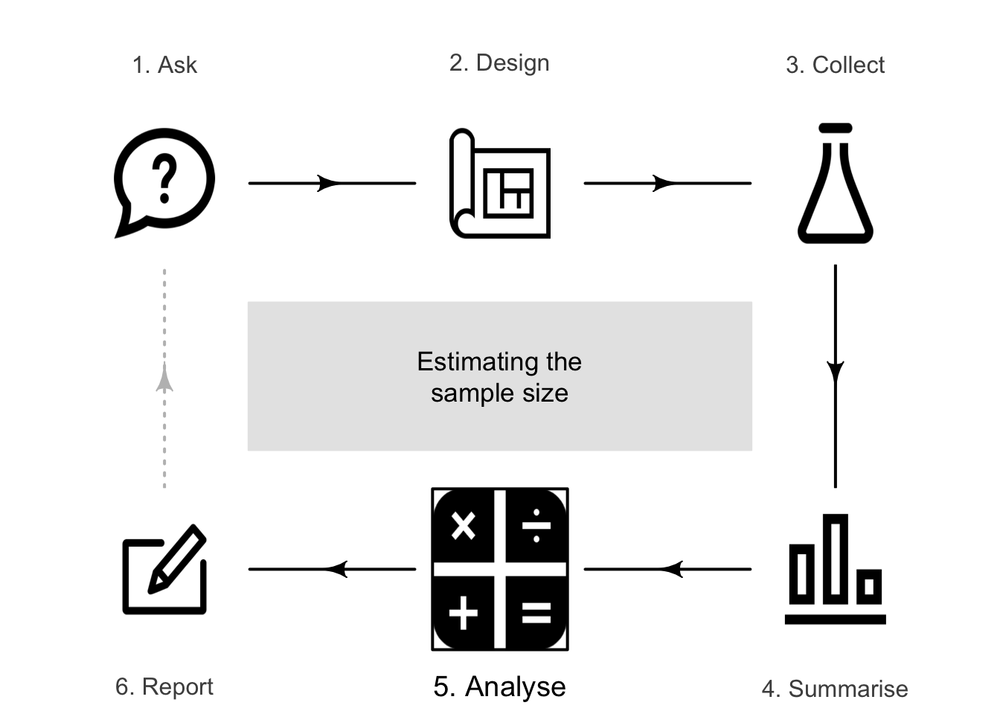
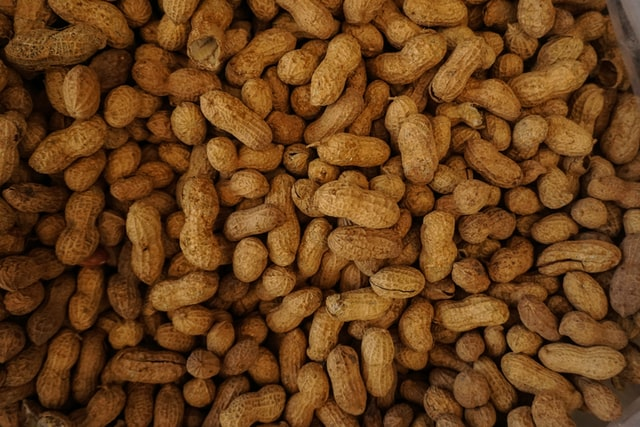

# Finding sample sizes for CIs {#EstimatingSampleSize}


::: {.objectivesBox .objectives data-latex="{iconmonstr-target-4-240.png}"}
You have learnt to ask an RQ, design a study, classify and summarise the data, construct confidence intervals, and conduct hypothesis tests.
**In this chapter**, you will learn to:

* estimate the sample size for producing a CI of given width for a proportion, mean, mean difference, difference between two means, and difference between two proportions.
* explain issues relevant to estimating sample sizes.

:::





<!-- Define colours as appropriate -->


## Introduction {#SampleSizeIntroduction}
\index{Sample size estimation}

A confidence interval (CI) is an interval which gives a range of values of the parameter that could plausibly have produced the observed value of the statistic.\index{Confidence intervals}
All else being equal, a *larger* sample size gives a *more precise* estimate of the parameter (Sect.\ \@ref(PrecisionAccuracy));\index{Precision} that is, a *narrower* CI.
After all, that's why larger samples are preferred over smaller samples: they provide more *precise* estimates.


:::{.example #SampleSizeImpact name="Impact of sample size on CIs"}
Suppose we wish to estimate an unknown proportion, and find that $\hat{p} = 0.52$ from a sample of size $n = 25$.
The approximate $95$%\ CI is $0.52 \pm 0.200$ (so the *margin of error* is\ $0.200$).

If the estimate of $\hat{p} = 0.52$ was found from a sample of size $n = 100$ (rather than $n = 25$), a more precise estimate should be expected.
The approximate $95$%\ CI is $0.52\pm 0.100$; the margin of error is\ $0.100$, so the estimate is indeed more precise.

If the estimate of $\hat{p} = 0.52$ was found from a sample of size $n = 400$, the approximate $95$%\ CI is $0.52\pm 0.050$; the margin of error is\ $0.050$ (which is more precise again).

At each step, the sample size was four times as large, but the margin of error was halved.
:::


The approximate width of the CI changes for various sample sizes (all else being equal).
Try changing the sample size in the interaction below (Fig.\ \@ref(fig:SampleSizeCI)).
Observe that:

* greater precision (*smaller* CI width) is obtained using *larger* sample sizes.
* for *small* sample sizes (say, smaller than $15$), precision greatly increases with small increases in the sample size.
* for *large* sample sizes (say, greater than $30$), precision improves only slightly when the sample size is increased.


<div class="figure" style="text-align: center">

```{=html}
<div id="htmlwidget-a9901ac77a1ed603d288" style="width:500px;height:300px;" class="plotly html-widget"></div>
<script type="application/json" data-for="htmlwidget-a9901ac77a1ed603d288">{"x":{"visdat":{"7545b0fb9f":["function () ","plotlyVisDat"]},"cur_data":"7545b0fb9f","attrs":{"7545b0fb9f":{"marker":{"color":"blue","size":8},"alpha_stroke":1,"sizes":[10,100],"spans":[1,20],"x":[0.052786404500042072,0.5,0.94721359549995787],"y":[1,1,1],"type":"scatter","mode":"lines","visible":true,"name":"n: 5","hoverinfo":"name","line":{"color":"blue"},"showlegend":false,"inherit":true},"7545b0fb9f.1":{"marker":{"color":"blue","size":8},"alpha_stroke":1,"sizes":[10,100],"spans":[1,20],"x":[0.091751709536136927,0.5,0.90824829046386313],"y":[1,1,1],"type":"scatter","mode":"lines","visible":false,"name":"n: 6","hoverinfo":"name","line":{"color":"blue"},"showlegend":false,"inherit":true},"7545b0fb9f.2":{"marker":{"color":"blue","size":8},"alpha_stroke":1,"sizes":[10,100],"spans":[1,20],"x":[0.1220355269907728,0.5,0.8779644730092272],"y":[1,1,1],"type":"scatter","mode":"lines","visible":false,"name":"n: 7","hoverinfo":"name","line":{"color":"blue"},"showlegend":false,"inherit":true},"7545b0fb9f.3":{"marker":{"color":"blue","size":8},"alpha_stroke":1,"sizes":[10,100],"spans":[1,20],"x":[0.14644660940672627,0.5,0.85355339059327373],"y":[1,1,1],"type":"scatter","mode":"lines","visible":false,"name":"n: 8","hoverinfo":"name","line":{"color":"blue"},"showlegend":false,"inherit":true},"7545b0fb9f.4":{"marker":{"color":"blue","size":8},"alpha_stroke":1,"sizes":[10,100],"spans":[1,20],"x":[0.16666666666666669,0.5,0.83333333333333326],"y":[1,1,1],"type":"scatter","mode":"lines","visible":false,"name":"n: 9","hoverinfo":"name","line":{"color":"blue"},"showlegend":false,"inherit":true},"7545b0fb9f.5":{"marker":{"color":"blue","size":8},"alpha_stroke":1,"sizes":[10,100],"spans":[1,20],"x":[0.18377223398316206,0.5,0.816227766016838],"y":[1,1,1],"type":"scatter","mode":"lines","visible":false,"name":"n: 10","hoverinfo":"name","line":{"color":"blue"},"showlegend":false,"inherit":true},"7545b0fb9f.6":{"marker":{"color":"blue","size":8},"alpha_stroke":1,"sizes":[10,100],"spans":[1,20],"x":[0.19848865542223637,0.5,0.80151134457776363],"y":[1,1,1],"type":"scatter","mode":"lines","visible":false,"name":"n: 11","hoverinfo":"name","line":{"color":"blue"},"showlegend":false,"inherit":true},"7545b0fb9f.7":{"marker":{"color":"blue","size":8},"alpha_stroke":1,"sizes":[10,100],"spans":[1,20],"x":[0.21132486540518708,0.5,0.78867513459481287],"y":[1,1,1],"type":"scatter","mode":"lines","visible":false,"name":"n: 12","hoverinfo":"name","line":{"color":"blue"},"showlegend":false,"inherit":true},"7545b0fb9f.8":{"marker":{"color":"blue","size":8},"alpha_stroke":1,"sizes":[10,100],"spans":[1,20],"x":[0.22264990188738543,0.5,0.77735009811261457],"y":[1,1,1],"type":"scatter","mode":"lines","visible":false,"name":"n: 13","hoverinfo":"name","line":{"color":"blue"},"showlegend":false,"inherit":true},"7545b0fb9f.9":{"marker":{"color":"blue","size":8},"alpha_stroke":1,"sizes":[10,100],"spans":[1,20],"x":[0.2327387580875756,0.5,0.7672612419124244],"y":[1,1,1],"type":"scatter","mode":"lines","visible":false,"name":"n: 14","hoverinfo":"name","line":{"color":"blue"},"showlegend":false,"inherit":true},"7545b0fb9f.10":{"marker":{"color":"blue","size":8},"alpha_stroke":1,"sizes":[10,100],"spans":[1,20],"x":[0.2418011102528389,0.5,0.7581988897471611],"y":[1,1,1],"type":"scatter","mode":"lines","visible":false,"name":"n: 15","hoverinfo":"name","line":{"color":"blue"},"showlegend":false,"inherit":true},"7545b0fb9f.11":{"marker":{"color":"blue","size":8},"alpha_stroke":1,"sizes":[10,100],"spans":[1,20],"x":[0.25,0.5,0.75],"y":[1,1,1],"type":"scatter","mode":"lines","visible":false,"name":"n: 16","hoverinfo":"name","line":{"color":"blue"},"showlegend":false,"inherit":true},"7545b0fb9f.12":{"marker":{"color":"blue","size":8},"alpha_stroke":1,"sizes":[10,100],"spans":[1,20],"x":[0.25746437496366703,0.5,0.74253562503633297],"y":[1,1,1],"type":"scatter","mode":"lines","visible":false,"name":"n: 17","hoverinfo":"name","line":{"color":"blue"},"showlegend":false,"inherit":true},"7545b0fb9f.13":{"marker":{"color":"blue","size":8},"alpha_stroke":1,"sizes":[10,100],"spans":[1,20],"x":[0.26429773960448411,0.5,0.73570226039551589],"y":[1,1,1],"type":"scatter","mode":"lines","visible":false,"name":"n: 18","hoverinfo":"name","line":{"color":"blue"},"showlegend":false,"inherit":true},"7545b0fb9f.14":{"marker":{"color":"blue","size":8},"alpha_stroke":1,"sizes":[10,100],"spans":[1,20],"x":[0.27058426612943826,0.5,0.7294157338705618],"y":[1,1,1],"type":"scatter","mode":"lines","visible":false,"name":"n: 19","hoverinfo":"name","line":{"color":"blue"},"showlegend":false,"inherit":true},"7545b0fb9f.15":{"marker":{"color":"blue","size":8},"alpha_stroke":1,"sizes":[10,100],"spans":[1,20],"x":[0.27639320225002106,0.5,0.72360679774997894],"y":[1,1,1],"type":"scatter","mode":"lines","visible":false,"name":"n: 20","hoverinfo":"name","line":{"color":"blue"},"showlegend":false,"inherit":true},"7545b0fb9f.16":{"marker":{"color":"blue","size":8},"alpha_stroke":1,"sizes":[10,100],"spans":[1,20],"x":[0.28178210976400764,0.5,0.71821789023599236],"y":[1,1,1],"type":"scatter","mode":"lines","visible":false,"name":"n: 21","hoverinfo":"name","line":{"color":"blue"},"showlegend":false,"inherit":true},"7545b0fb9f.17":{"marker":{"color":"blue","size":8},"alpha_stroke":1,"sizes":[10,100],"spans":[1,20],"x":[0.28679928364438956,0.5,0.71320071635561044],"y":[1,1,1],"type":"scatter","mode":"lines","visible":false,"name":"n: 22","hoverinfo":"name","line":{"color":"blue"},"showlegend":false,"inherit":true},"7545b0fb9f.18":{"marker":{"color":"blue","size":8},"alpha_stroke":1,"sizes":[10,100],"spans":[1,20],"x":[0.29148558594292523,0.5,0.70851441405707472],"y":[1,1,1],"type":"scatter","mode":"lines","visible":false,"name":"n: 23","hoverinfo":"name","line":{"color":"blue"},"showlegend":false,"inherit":true},"7545b0fb9f.19":{"marker":{"color":"blue","size":8},"alpha_stroke":1,"sizes":[10,100],"spans":[1,20],"x":[0.29587585476806844,0.5,0.70412414523193156],"y":[1,1,1],"type":"scatter","mode":"lines","visible":false,"name":"n: 24","hoverinfo":"name","line":{"color":"blue"},"showlegend":false,"inherit":true},"7545b0fb9f.20":{"marker":{"color":"blue","size":8},"alpha_stroke":1,"sizes":[10,100],"spans":[1,20],"x":[0.29999999999999999,0.5,0.69999999999999996],"y":[1,1,1],"type":"scatter","mode":"lines","visible":false,"name":"n: 25","hoverinfo":"name","line":{"color":"blue"},"showlegend":false,"inherit":true},"7545b0fb9f.21":{"marker":{"color":"blue","size":8},"alpha_stroke":1,"sizes":[10,100],"spans":[1,20],"x":[0.30388386486181596,0.5,0.69611613513818404],"y":[1,1,1],"type":"scatter","mode":"lines","visible":false,"name":"n: 26","hoverinfo":"name","line":{"color":"blue"},"showlegend":false,"inherit":true},"7545b0fb9f.22":{"marker":{"color":"blue","size":8},"alpha_stroke":1,"sizes":[10,100],"spans":[1,20],"x":[0.30754991027012474,0.5,0.69245008972987532],"y":[1,1,1],"type":"scatter","mode":"lines","visible":false,"name":"n: 27","hoverinfo":"name","line":{"color":"blue"},"showlegend":false,"inherit":true},"7545b0fb9f.23":{"marker":{"color":"blue","size":8},"alpha_stroke":1,"sizes":[10,100],"spans":[1,20],"x":[0.3110177634953864,0.5,0.68898223650461365],"y":[1,1,1],"type":"scatter","mode":"lines","visible":false,"name":"n: 28","hoverinfo":"name","line":{"color":"blue"},"showlegend":false,"inherit":true},"7545b0fb9f.24":{"marker":{"color":"blue","size":8},"alpha_stroke":1,"sizes":[10,100],"spans":[1,20],"x":[0.31430466182294814,0.5,0.68569533817705186],"y":[1,1,1],"type":"scatter","mode":"lines","visible":false,"name":"n: 29","hoverinfo":"name","line":{"color":"blue"},"showlegend":false,"inherit":true},"7545b0fb9f.25":{"marker":{"color":"blue","size":8},"alpha_stroke":1,"sizes":[10,100],"spans":[1,20],"x":[0.31742581416494464,0.5,0.68257418583505536],"y":[1,1,1],"type":"scatter","mode":"lines","visible":false,"name":"n: 30","hoverinfo":"name","line":{"color":"blue"},"showlegend":false,"inherit":true},"7545b0fb9f.26":{"marker":{"color":"blue","size":8},"alpha_stroke":1,"sizes":[10,100],"spans":[1,20],"x":[0.32039469797322506,0.5,0.67960530202677494],"y":[1,1,1],"type":"scatter","mode":"lines","visible":false,"name":"n: 31","hoverinfo":"name","line":{"color":"blue"},"showlegend":false,"inherit":true},"7545b0fb9f.27":{"marker":{"color":"blue","size":8},"alpha_stroke":1,"sizes":[10,100],"spans":[1,20],"x":[0.32322330470336313,0.5,0.67677669529663687],"y":[1,1,1],"type":"scatter","mode":"lines","visible":false,"name":"n: 32","hoverinfo":"name","line":{"color":"blue"},"showlegend":false,"inherit":true},"7545b0fb9f.28":{"marker":{"color":"blue","size":8},"alpha_stroke":1,"sizes":[10,100],"spans":[1,20],"x":[0.32592234404430215,0.5,0.6740776559556978],"y":[1,1,1],"type":"scatter","mode":"lines","visible":false,"name":"n: 33","hoverinfo":"name","line":{"color":"blue"},"showlegend":false,"inherit":true},"7545b0fb9f.29":{"marker":{"color":"blue","size":8},"alpha_stroke":1,"sizes":[10,100],"spans":[1,20],"x":[0.32850141485749118,0.5,0.67149858514250882],"y":[1,1,1],"type":"scatter","mode":"lines","visible":false,"name":"n: 34","hoverinfo":"name","line":{"color":"blue"},"showlegend":false,"inherit":true},"7545b0fb9f.30":{"marker":{"color":"blue","size":8},"alpha_stroke":1,"sizes":[10,100],"spans":[1,20],"x":[0.3309691490542967,0.5,0.66903085094570325],"y":[1,1,1],"type":"scatter","mode":"lines","visible":false,"name":"n: 35","hoverinfo":"name","line":{"color":"blue"},"showlegend":false,"inherit":true},"7545b0fb9f.31":{"marker":{"color":"blue","size":8},"alpha_stroke":1,"sizes":[10,100],"spans":[1,20],"x":[0.33333333333333337,0.5,0.66666666666666663],"y":[1,1,1],"type":"scatter","mode":"lines","visible":false,"name":"n: 36","hoverinfo":"name","line":{"color":"blue"},"showlegend":false,"inherit":true},"7545b0fb9f.32":{"marker":{"color":"blue","size":8},"alpha_stroke":1,"sizes":[10,100],"spans":[1,20],"x":[0.33560101269464271,0.5,0.66439898730535729],"y":[1,1,1],"type":"scatter","mode":"lines","visible":false,"name":"n: 37","hoverinfo":"name","line":{"color":"blue"},"showlegend":false,"inherit":true},"7545b0fb9f.33":{"marker":{"color":"blue","size":8},"alpha_stroke":1,"sizes":[10,100],"spans":[1,20],"x":[0.33777857886923746,0.5,0.66222142113076254],"y":[1,1,1],"type":"scatter","mode":"lines","visible":false,"name":"n: 38","hoverinfo":"name","line":{"color":"blue"},"showlegend":false,"inherit":true},"7545b0fb9f.34":{"marker":{"color":"blue","size":8},"alpha_stroke":1,"sizes":[10,100],"spans":[1,20],"x":[0.33987184619491284,0.5,0.66012815380508716],"y":[1,1,1],"type":"scatter","mode":"lines","visible":false,"name":"n: 39","hoverinfo":"name","line":{"color":"blue"},"showlegend":false,"inherit":true},"7545b0fb9f.35":{"marker":{"color":"blue","size":8},"alpha_stroke":1,"sizes":[10,100],"spans":[1,20],"x":[0.341886116991581,0.5,0.658113883008419],"y":[1,1,1],"type":"scatter","mode":"lines","visible":false,"name":"n: 40","hoverinfo":"name","line":{"color":"blue"},"showlegend":false,"inherit":true},"7545b0fb9f.36":{"marker":{"color":"blue","size":8},"alpha_stroke":1,"sizes":[10,100],"spans":[1,20],"x":[0.3438262381113939,0.5,0.6561737618886061],"y":[1,1,1],"type":"scatter","mode":"lines","visible":false,"name":"n: 41","hoverinfo":"name","line":{"color":"blue"},"showlegend":false,"inherit":true},"7545b0fb9f.37":{"marker":{"color":"blue","size":8},"alpha_stroke":1,"sizes":[10,100],"spans":[1,20],"x":[0.34569665003790806,0.5,0.65430334996209194],"y":[1,1,1],"type":"scatter","mode":"lines","visible":false,"name":"n: 42","hoverinfo":"name","line":{"color":"blue"},"showlegend":false,"inherit":true},"7545b0fb9f.38":{"marker":{"color":"blue","size":8},"alpha_stroke":1,"sizes":[10,100],"spans":[1,20],"x":[0.34750142966739533,0.5,0.65249857033260472],"y":[1,1,1],"type":"scatter","mode":"lines","visible":false,"name":"n: 43","hoverinfo":"name","line":{"color":"blue"},"showlegend":false,"inherit":true},"7545b0fb9f.39":{"marker":{"color":"blue","size":8},"alpha_stroke":1,"sizes":[10,100],"spans":[1,20],"x":[0.34924432771111819,0.5,0.65075567228888187],"y":[1,1,1],"type":"scatter","mode":"lines","visible":false,"name":"n: 44","hoverinfo":"name","line":{"color":"blue"},"showlegend":false,"inherit":true},"7545b0fb9f.40":{"marker":{"color":"blue","size":8},"alpha_stroke":1,"sizes":[10,100],"spans":[1,20],"x":[0.35092880150001404,0.5,0.64907119849998596],"y":[1,1,1],"type":"scatter","mode":"lines","visible":false,"name":"n: 45","hoverinfo":"name","line":{"color":"blue"},"showlegend":false,"inherit":true},"7545b0fb9f.41":{"marker":{"color":"blue","size":8},"alpha_stroke":1,"sizes":[10,100],"spans":[1,20],"x":[0.35255804384510286,0.5,0.64744195615489719],"y":[1,1,1],"type":"scatter","mode":"lines","visible":false,"name":"n: 46","hoverinfo":"name","line":{"color":"blue"},"showlegend":false,"inherit":true},"7545b0fb9f.42":{"marker":{"color":"blue","size":8},"alpha_stroke":1,"sizes":[10,100],"spans":[1,20],"x":[0.35413500850210544,0.5,0.64586499149789456],"y":[1,1,1],"type":"scatter","mode":"lines","visible":false,"name":"n: 47","hoverinfo":"name","line":{"color":"blue"},"showlegend":false,"inherit":true},"7545b0fb9f.43":{"marker":{"color":"blue","size":8},"alpha_stroke":1,"sizes":[10,100],"spans":[1,20],"x":[0.35566243270259357,0.5,0.64433756729740643],"y":[1,1,1],"type":"scatter","mode":"lines","visible":false,"name":"n: 48","hoverinfo":"name","line":{"color":"blue"},"showlegend":false,"inherit":true},"7545b0fb9f.44":{"marker":{"color":"blue","size":8},"alpha_stroke":1,"sizes":[10,100],"spans":[1,20],"x":[0.35714285714285715,0.5,0.64285714285714279],"y":[1,1,1],"type":"scatter","mode":"lines","visible":false,"name":"n: 49","hoverinfo":"name","line":{"color":"blue"},"showlegend":false,"inherit":true},"7545b0fb9f.45":{"marker":{"color":"blue","size":8},"alpha_stroke":1,"sizes":[10,100],"spans":[1,20],"x":[0.3585786437626905,0.5,0.64142135623730945],"y":[1,1,1],"type":"scatter","mode":"lines","visible":false,"name":"n: 50","hoverinfo":"name","line":{"color":"blue"},"showlegend":false,"inherit":true}},"layout":{"width":500,"height":300,"margin":{"b":40,"l":60,"t":25,"r":10},"title":"The effect of the sample size","showlegend":false,"autosize":false,"xaxis":{"domain":[0,1],"automargin":true,"title":"Confidence interval","range":[0,1]},"yaxis":{"domain":[0,1],"automargin":true,"title":" ","showticklabels":false,"showline":false,"showgrid":false},"sliders":[{"currentvalue":{"prefix":"Sample size: "},"x":0,"y":-0.5,"steps":[{"args":["visible",[true,false,false,false,false,false,false,false,false,false,false,false,false,false,false,false,false,false,false,false,false,false,false,false,false,false,false,false,false,false,false,false,false,false,false,false,false,false,false,false,false,false,false,false,false,false]],"method":"restyle","label":5},{"args":["visible",[false,true,false,false,false,false,false,false,false,false,false,false,false,false,false,false,false,false,false,false,false,false,false,false,false,false,false,false,false,false,false,false,false,false,false,false,false,false,false,false,false,false,false,false,false,false]],"method":"restyle","label":6},{"args":["visible",[false,false,true,false,false,false,false,false,false,false,false,false,false,false,false,false,false,false,false,false,false,false,false,false,false,false,false,false,false,false,false,false,false,false,false,false,false,false,false,false,false,false,false,false,false,false]],"method":"restyle","label":7},{"args":["visible",[false,false,false,true,false,false,false,false,false,false,false,false,false,false,false,false,false,false,false,false,false,false,false,false,false,false,false,false,false,false,false,false,false,false,false,false,false,false,false,false,false,false,false,false,false,false]],"method":"restyle","label":8},{"args":["visible",[false,false,false,false,true,false,false,false,false,false,false,false,false,false,false,false,false,false,false,false,false,false,false,false,false,false,false,false,false,false,false,false,false,false,false,false,false,false,false,false,false,false,false,false,false,false]],"method":"restyle","label":9},{"args":["visible",[false,false,false,false,false,true,false,false,false,false,false,false,false,false,false,false,false,false,false,false,false,false,false,false,false,false,false,false,false,false,false,false,false,false,false,false,false,false,false,false,false,false,false,false,false,false]],"method":"restyle","label":10},{"args":["visible",[false,false,false,false,false,false,true,false,false,false,false,false,false,false,false,false,false,false,false,false,false,false,false,false,false,false,false,false,false,false,false,false,false,false,false,false,false,false,false,false,false,false,false,false,false,false]],"method":"restyle","label":11},{"args":["visible",[false,false,false,false,false,false,false,true,false,false,false,false,false,false,false,false,false,false,false,false,false,false,false,false,false,false,false,false,false,false,false,false,false,false,false,false,false,false,false,false,false,false,false,false,false,false]],"method":"restyle","label":12},{"args":["visible",[false,false,false,false,false,false,false,false,true,false,false,false,false,false,false,false,false,false,false,false,false,false,false,false,false,false,false,false,false,false,false,false,false,false,false,false,false,false,false,false,false,false,false,false,false,false]],"method":"restyle","label":13},{"args":["visible",[false,false,false,false,false,false,false,false,false,true,false,false,false,false,false,false,false,false,false,false,false,false,false,false,false,false,false,false,false,false,false,false,false,false,false,false,false,false,false,false,false,false,false,false,false,false]],"method":"restyle","label":14},{"args":["visible",[false,false,false,false,false,false,false,false,false,false,true,false,false,false,false,false,false,false,false,false,false,false,false,false,false,false,false,false,false,false,false,false,false,false,false,false,false,false,false,false,false,false,false,false,false,false]],"method":"restyle","label":15},{"args":["visible",[false,false,false,false,false,false,false,false,false,false,false,true,false,false,false,false,false,false,false,false,false,false,false,false,false,false,false,false,false,false,false,false,false,false,false,false,false,false,false,false,false,false,false,false,false,false]],"method":"restyle","label":16},{"args":["visible",[false,false,false,false,false,false,false,false,false,false,false,false,true,false,false,false,false,false,false,false,false,false,false,false,false,false,false,false,false,false,false,false,false,false,false,false,false,false,false,false,false,false,false,false,false,false]],"method":"restyle","label":17},{"args":["visible",[false,false,false,false,false,false,false,false,false,false,false,false,false,true,false,false,false,false,false,false,false,false,false,false,false,false,false,false,false,false,false,false,false,false,false,false,false,false,false,false,false,false,false,false,false,false]],"method":"restyle","label":18},{"args":["visible",[false,false,false,false,false,false,false,false,false,false,false,false,false,false,true,false,false,false,false,false,false,false,false,false,false,false,false,false,false,false,false,false,false,false,false,false,false,false,false,false,false,false,false,false,false,false]],"method":"restyle","label":19},{"args":["visible",[false,false,false,false,false,false,false,false,false,false,false,false,false,false,false,true,false,false,false,false,false,false,false,false,false,false,false,false,false,false,false,false,false,false,false,false,false,false,false,false,false,false,false,false,false,false]],"method":"restyle","label":20},{"args":["visible",[false,false,false,false,false,false,false,false,false,false,false,false,false,false,false,false,true,false,false,false,false,false,false,false,false,false,false,false,false,false,false,false,false,false,false,false,false,false,false,false,false,false,false,false,false,false]],"method":"restyle","label":21},{"args":["visible",[false,false,false,false,false,false,false,false,false,false,false,false,false,false,false,false,false,true,false,false,false,false,false,false,false,false,false,false,false,false,false,false,false,false,false,false,false,false,false,false,false,false,false,false,false,false]],"method":"restyle","label":22},{"args":["visible",[false,false,false,false,false,false,false,false,false,false,false,false,false,false,false,false,false,false,true,false,false,false,false,false,false,false,false,false,false,false,false,false,false,false,false,false,false,false,false,false,false,false,false,false,false,false]],"method":"restyle","label":23},{"args":["visible",[false,false,false,false,false,false,false,false,false,false,false,false,false,false,false,false,false,false,false,true,false,false,false,false,false,false,false,false,false,false,false,false,false,false,false,false,false,false,false,false,false,false,false,false,false,false]],"method":"restyle","label":24},{"args":["visible",[false,false,false,false,false,false,false,false,false,false,false,false,false,false,false,false,false,false,false,false,true,false,false,false,false,false,false,false,false,false,false,false,false,false,false,false,false,false,false,false,false,false,false,false,false,false]],"method":"restyle","label":25},{"args":["visible",[false,false,false,false,false,false,false,false,false,false,false,false,false,false,false,false,false,false,false,false,false,true,false,false,false,false,false,false,false,false,false,false,false,false,false,false,false,false,false,false,false,false,false,false,false,false]],"method":"restyle","label":26},{"args":["visible",[false,false,false,false,false,false,false,false,false,false,false,false,false,false,false,false,false,false,false,false,false,false,true,false,false,false,false,false,false,false,false,false,false,false,false,false,false,false,false,false,false,false,false,false,false,false]],"method":"restyle","label":27},{"args":["visible",[false,false,false,false,false,false,false,false,false,false,false,false,false,false,false,false,false,false,false,false,false,false,false,true,false,false,false,false,false,false,false,false,false,false,false,false,false,false,false,false,false,false,false,false,false,false]],"method":"restyle","label":28},{"args":["visible",[false,false,false,false,false,false,false,false,false,false,false,false,false,false,false,false,false,false,false,false,false,false,false,false,true,false,false,false,false,false,false,false,false,false,false,false,false,false,false,false,false,false,false,false,false,false]],"method":"restyle","label":29},{"args":["visible",[false,false,false,false,false,false,false,false,false,false,false,false,false,false,false,false,false,false,false,false,false,false,false,false,false,true,false,false,false,false,false,false,false,false,false,false,false,false,false,false,false,false,false,false,false,false]],"method":"restyle","label":30},{"args":["visible",[false,false,false,false,false,false,false,false,false,false,false,false,false,false,false,false,false,false,false,false,false,false,false,false,false,false,true,false,false,false,false,false,false,false,false,false,false,false,false,false,false,false,false,false,false,false]],"method":"restyle","label":31},{"args":["visible",[false,false,false,false,false,false,false,false,false,false,false,false,false,false,false,false,false,false,false,false,false,false,false,false,false,false,false,true,false,false,false,false,false,false,false,false,false,false,false,false,false,false,false,false,false,false]],"method":"restyle","label":32},{"args":["visible",[false,false,false,false,false,false,false,false,false,false,false,false,false,false,false,false,false,false,false,false,false,false,false,false,false,false,false,false,true,false,false,false,false,false,false,false,false,false,false,false,false,false,false,false,false,false]],"method":"restyle","label":33},{"args":["visible",[false,false,false,false,false,false,false,false,false,false,false,false,false,false,false,false,false,false,false,false,false,false,false,false,false,false,false,false,false,true,false,false,false,false,false,false,false,false,false,false,false,false,false,false,false,false]],"method":"restyle","label":34},{"args":["visible",[false,false,false,false,false,false,false,false,false,false,false,false,false,false,false,false,false,false,false,false,false,false,false,false,false,false,false,false,false,false,true,false,false,false,false,false,false,false,false,false,false,false,false,false,false,false]],"method":"restyle","label":35},{"args":["visible",[false,false,false,false,false,false,false,false,false,false,false,false,false,false,false,false,false,false,false,false,false,false,false,false,false,false,false,false,false,false,false,true,false,false,false,false,false,false,false,false,false,false,false,false,false,false]],"method":"restyle","label":36},{"args":["visible",[false,false,false,false,false,false,false,false,false,false,false,false,false,false,false,false,false,false,false,false,false,false,false,false,false,false,false,false,false,false,false,false,true,false,false,false,false,false,false,false,false,false,false,false,false,false]],"method":"restyle","label":37},{"args":["visible",[false,false,false,false,false,false,false,false,false,false,false,false,false,false,false,false,false,false,false,false,false,false,false,false,false,false,false,false,false,false,false,false,false,true,false,false,false,false,false,false,false,false,false,false,false,false]],"method":"restyle","label":38},{"args":["visible",[false,false,false,false,false,false,false,false,false,false,false,false,false,false,false,false,false,false,false,false,false,false,false,false,false,false,false,false,false,false,false,false,false,false,true,false,false,false,false,false,false,false,false,false,false,false]],"method":"restyle","label":39},{"args":["visible",[false,false,false,false,false,false,false,false,false,false,false,false,false,false,false,false,false,false,false,false,false,false,false,false,false,false,false,false,false,false,false,false,false,false,false,true,false,false,false,false,false,false,false,false,false,false]],"method":"restyle","label":40},{"args":["visible",[false,false,false,false,false,false,false,false,false,false,false,false,false,false,false,false,false,false,false,false,false,false,false,false,false,false,false,false,false,false,false,false,false,false,false,false,true,false,false,false,false,false,false,false,false,false]],"method":"restyle","label":41},{"args":["visible",[false,false,false,false,false,false,false,false,false,false,false,false,false,false,false,false,false,false,false,false,false,false,false,false,false,false,false,false,false,false,false,false,false,false,false,false,false,true,false,false,false,false,false,false,false,false]],"method":"restyle","label":42},{"args":["visible",[false,false,false,false,false,false,false,false,false,false,false,false,false,false,false,false,false,false,false,false,false,false,false,false,false,false,false,false,false,false,false,false,false,false,false,false,false,false,true,false,false,false,false,false,false,false]],"method":"restyle","label":43},{"args":["visible",[false,false,false,false,false,false,false,false,false,false,false,false,false,false,false,false,false,false,false,false,false,false,false,false,false,false,false,false,false,false,false,false,false,false,false,false,false,false,false,true,false,false,false,false,false,false]],"method":"restyle","label":44},{"args":["visible",[false,false,false,false,false,false,false,false,false,false,false,false,false,false,false,false,false,false,false,false,false,false,false,false,false,false,false,false,false,false,false,false,false,false,false,false,false,false,false,false,true,false,false,false,false,false]],"method":"restyle","label":45},{"args":["visible",[false,false,false,false,false,false,false,false,false,false,false,false,false,false,false,false,false,false,false,false,false,false,false,false,false,false,false,false,false,false,false,false,false,false,false,false,false,false,false,false,false,true,false,false,false,false]],"method":"restyle","label":46},{"args":["visible",[false,false,false,false,false,false,false,false,false,false,false,false,false,false,false,false,false,false,false,false,false,false,false,false,false,false,false,false,false,false,false,false,false,false,false,false,false,false,false,false,false,false,true,false,false,false]],"method":"restyle","label":47},{"args":["visible",[false,false,false,false,false,false,false,false,false,false,false,false,false,false,false,false,false,false,false,false,false,false,false,false,false,false,false,false,false,false,false,false,false,false,false,false,false,false,false,false,false,false,false,true,false,false]],"method":"restyle","label":48},{"args":["visible",[false,false,false,false,false,false,false,false,false,false,false,false,false,false,false,false,false,false,false,false,false,false,false,false,false,false,false,false,false,false,false,false,false,false,false,false,false,false,false,false,false,false,false,false,true,false]],"method":"restyle","label":49},{"args":["visible",[false,false,false,false,false,false,false,false,false,false,false,false,false,false,false,false,false,false,false,false,false,false,false,false,false,false,false,false,false,false,false,false,false,false,false,false,false,false,false,false,false,false,false,false,false,true]],"method":"restyle","label":50}]}],"hovermode":"closest"},"source":"A","config":{"modeBarButtonsToAdd":["hoverclosest","hovercompare"],"showSendToCloud":false},"data":[{"marker":{"color":"blue","size":8,"line":{"color":"rgba(31,119,180,1)"}},"x":[0.052786404500042072,0.5,0.94721359549995787],"y":[1,1,1],"type":"scatter","mode":"lines+markers","visible":true,"name":"n: 5","hoverinfo":["name","name","name"],"line":{"color":"blue"},"showlegend":false,"error_y":{"color":"rgba(31,119,180,1)"},"error_x":{"color":"rgba(31,119,180,1)"},"xaxis":"x","yaxis":"y","frame":null},{"marker":{"color":"blue","size":8,"line":{"color":"rgba(255,127,14,1)"}},"x":[0.091751709536136927,0.5,0.90824829046386313],"y":[1,1,1],"type":"scatter","mode":"lines+markers","visible":false,"name":"n: 6","hoverinfo":["name","name","name"],"line":{"color":"blue"},"showlegend":false,"error_y":{"color":"rgba(255,127,14,1)"},"error_x":{"color":"rgba(255,127,14,1)"},"xaxis":"x","yaxis":"y","frame":null},{"marker":{"color":"blue","size":8,"line":{"color":"rgba(44,160,44,1)"}},"x":[0.1220355269907728,0.5,0.8779644730092272],"y":[1,1,1],"type":"scatter","mode":"lines+markers","visible":false,"name":"n: 7","hoverinfo":["name","name","name"],"line":{"color":"blue"},"showlegend":false,"error_y":{"color":"rgba(44,160,44,1)"},"error_x":{"color":"rgba(44,160,44,1)"},"xaxis":"x","yaxis":"y","frame":null},{"marker":{"color":"blue","size":8,"line":{"color":"rgba(214,39,40,1)"}},"x":[0.14644660940672627,0.5,0.85355339059327373],"y":[1,1,1],"type":"scatter","mode":"lines+markers","visible":false,"name":"n: 8","hoverinfo":["name","name","name"],"line":{"color":"blue"},"showlegend":false,"error_y":{"color":"rgba(214,39,40,1)"},"error_x":{"color":"rgba(214,39,40,1)"},"xaxis":"x","yaxis":"y","frame":null},{"marker":{"color":"blue","size":8,"line":{"color":"rgba(148,103,189,1)"}},"x":[0.16666666666666669,0.5,0.83333333333333326],"y":[1,1,1],"type":"scatter","mode":"lines+markers","visible":false,"name":"n: 9","hoverinfo":["name","name","name"],"line":{"color":"blue"},"showlegend":false,"error_y":{"color":"rgba(148,103,189,1)"},"error_x":{"color":"rgba(148,103,189,1)"},"xaxis":"x","yaxis":"y","frame":null},{"marker":{"color":"blue","size":8,"line":{"color":"rgba(140,86,75,1)"}},"x":[0.18377223398316206,0.5,0.816227766016838],"y":[1,1,1],"type":"scatter","mode":"lines+markers","visible":false,"name":"n: 10","hoverinfo":["name","name","name"],"line":{"color":"blue"},"showlegend":false,"error_y":{"color":"rgba(140,86,75,1)"},"error_x":{"color":"rgba(140,86,75,1)"},"xaxis":"x","yaxis":"y","frame":null},{"marker":{"color":"blue","size":8,"line":{"color":"rgba(227,119,194,1)"}},"x":[0.19848865542223637,0.5,0.80151134457776363],"y":[1,1,1],"type":"scatter","mode":"lines+markers","visible":false,"name":"n: 11","hoverinfo":["name","name","name"],"line":{"color":"blue"},"showlegend":false,"error_y":{"color":"rgba(227,119,194,1)"},"error_x":{"color":"rgba(227,119,194,1)"},"xaxis":"x","yaxis":"y","frame":null},{"marker":{"color":"blue","size":8,"line":{"color":"rgba(127,127,127,1)"}},"x":[0.21132486540518708,0.5,0.78867513459481287],"y":[1,1,1],"type":"scatter","mode":"lines+markers","visible":false,"name":"n: 12","hoverinfo":["name","name","name"],"line":{"color":"blue"},"showlegend":false,"error_y":{"color":"rgba(127,127,127,1)"},"error_x":{"color":"rgba(127,127,127,1)"},"xaxis":"x","yaxis":"y","frame":null},{"marker":{"color":"blue","size":8,"line":{"color":"rgba(188,189,34,1)"}},"x":[0.22264990188738543,0.5,0.77735009811261457],"y":[1,1,1],"type":"scatter","mode":"lines+markers","visible":false,"name":"n: 13","hoverinfo":["name","name","name"],"line":{"color":"blue"},"showlegend":false,"error_y":{"color":"rgba(188,189,34,1)"},"error_x":{"color":"rgba(188,189,34,1)"},"xaxis":"x","yaxis":"y","frame":null},{"marker":{"color":"blue","size":8,"line":{"color":"rgba(23,190,207,1)"}},"x":[0.2327387580875756,0.5,0.7672612419124244],"y":[1,1,1],"type":"scatter","mode":"lines+markers","visible":false,"name":"n: 14","hoverinfo":["name","name","name"],"line":{"color":"blue"},"showlegend":false,"error_y":{"color":"rgba(23,190,207,1)"},"error_x":{"color":"rgba(23,190,207,1)"},"xaxis":"x","yaxis":"y","frame":null},{"marker":{"color":"blue","size":8,"line":{"color":"rgba(31,119,180,1)"}},"x":[0.2418011102528389,0.5,0.7581988897471611],"y":[1,1,1],"type":"scatter","mode":"lines+markers","visible":false,"name":"n: 15","hoverinfo":["name","name","name"],"line":{"color":"blue"},"showlegend":false,"error_y":{"color":"rgba(31,119,180,1)"},"error_x":{"color":"rgba(31,119,180,1)"},"xaxis":"x","yaxis":"y","frame":null},{"marker":{"color":"blue","size":8,"line":{"color":"rgba(255,127,14,1)"}},"x":[0.25,0.5,0.75],"y":[1,1,1],"type":"scatter","mode":"lines+markers","visible":false,"name":"n: 16","hoverinfo":["name","name","name"],"line":{"color":"blue"},"showlegend":false,"error_y":{"color":"rgba(255,127,14,1)"},"error_x":{"color":"rgba(255,127,14,1)"},"xaxis":"x","yaxis":"y","frame":null},{"marker":{"color":"blue","size":8,"line":{"color":"rgba(44,160,44,1)"}},"x":[0.25746437496366703,0.5,0.74253562503633297],"y":[1,1,1],"type":"scatter","mode":"lines+markers","visible":false,"name":"n: 17","hoverinfo":["name","name","name"],"line":{"color":"blue"},"showlegend":false,"error_y":{"color":"rgba(44,160,44,1)"},"error_x":{"color":"rgba(44,160,44,1)"},"xaxis":"x","yaxis":"y","frame":null},{"marker":{"color":"blue","size":8,"line":{"color":"rgba(214,39,40,1)"}},"x":[0.26429773960448411,0.5,0.73570226039551589],"y":[1,1,1],"type":"scatter","mode":"lines+markers","visible":false,"name":"n: 18","hoverinfo":["name","name","name"],"line":{"color":"blue"},"showlegend":false,"error_y":{"color":"rgba(214,39,40,1)"},"error_x":{"color":"rgba(214,39,40,1)"},"xaxis":"x","yaxis":"y","frame":null},{"marker":{"color":"blue","size":8,"line":{"color":"rgba(148,103,189,1)"}},"x":[0.27058426612943826,0.5,0.7294157338705618],"y":[1,1,1],"type":"scatter","mode":"lines+markers","visible":false,"name":"n: 19","hoverinfo":["name","name","name"],"line":{"color":"blue"},"showlegend":false,"error_y":{"color":"rgba(148,103,189,1)"},"error_x":{"color":"rgba(148,103,189,1)"},"xaxis":"x","yaxis":"y","frame":null},{"marker":{"color":"blue","size":8,"line":{"color":"rgba(140,86,75,1)"}},"x":[0.27639320225002106,0.5,0.72360679774997894],"y":[1,1,1],"type":"scatter","mode":"lines+markers","visible":false,"name":"n: 20","hoverinfo":["name","name","name"],"line":{"color":"blue"},"showlegend":false,"error_y":{"color":"rgba(140,86,75,1)"},"error_x":{"color":"rgba(140,86,75,1)"},"xaxis":"x","yaxis":"y","frame":null},{"marker":{"color":"blue","size":8,"line":{"color":"rgba(227,119,194,1)"}},"x":[0.28178210976400764,0.5,0.71821789023599236],"y":[1,1,1],"type":"scatter","mode":"lines+markers","visible":false,"name":"n: 21","hoverinfo":["name","name","name"],"line":{"color":"blue"},"showlegend":false,"error_y":{"color":"rgba(227,119,194,1)"},"error_x":{"color":"rgba(227,119,194,1)"},"xaxis":"x","yaxis":"y","frame":null},{"marker":{"color":"blue","size":8,"line":{"color":"rgba(127,127,127,1)"}},"x":[0.28679928364438956,0.5,0.71320071635561044],"y":[1,1,1],"type":"scatter","mode":"lines+markers","visible":false,"name":"n: 22","hoverinfo":["name","name","name"],"line":{"color":"blue"},"showlegend":false,"error_y":{"color":"rgba(127,127,127,1)"},"error_x":{"color":"rgba(127,127,127,1)"},"xaxis":"x","yaxis":"y","frame":null},{"marker":{"color":"blue","size":8,"line":{"color":"rgba(188,189,34,1)"}},"x":[0.29148558594292523,0.5,0.70851441405707472],"y":[1,1,1],"type":"scatter","mode":"lines+markers","visible":false,"name":"n: 23","hoverinfo":["name","name","name"],"line":{"color":"blue"},"showlegend":false,"error_y":{"color":"rgba(188,189,34,1)"},"error_x":{"color":"rgba(188,189,34,1)"},"xaxis":"x","yaxis":"y","frame":null},{"marker":{"color":"blue","size":8,"line":{"color":"rgba(23,190,207,1)"}},"x":[0.29587585476806844,0.5,0.70412414523193156],"y":[1,1,1],"type":"scatter","mode":"lines+markers","visible":false,"name":"n: 24","hoverinfo":["name","name","name"],"line":{"color":"blue"},"showlegend":false,"error_y":{"color":"rgba(23,190,207,1)"},"error_x":{"color":"rgba(23,190,207,1)"},"xaxis":"x","yaxis":"y","frame":null},{"marker":{"color":"blue","size":8,"line":{"color":"rgba(31,119,180,1)"}},"x":[0.29999999999999999,0.5,0.69999999999999996],"y":[1,1,1],"type":"scatter","mode":"lines+markers","visible":false,"name":"n: 25","hoverinfo":["name","name","name"],"line":{"color":"blue"},"showlegend":false,"error_y":{"color":"rgba(31,119,180,1)"},"error_x":{"color":"rgba(31,119,180,1)"},"xaxis":"x","yaxis":"y","frame":null},{"marker":{"color":"blue","size":8,"line":{"color":"rgba(255,127,14,1)"}},"x":[0.30388386486181596,0.5,0.69611613513818404],"y":[1,1,1],"type":"scatter","mode":"lines+markers","visible":false,"name":"n: 26","hoverinfo":["name","name","name"],"line":{"color":"blue"},"showlegend":false,"error_y":{"color":"rgba(255,127,14,1)"},"error_x":{"color":"rgba(255,127,14,1)"},"xaxis":"x","yaxis":"y","frame":null},{"marker":{"color":"blue","size":8,"line":{"color":"rgba(44,160,44,1)"}},"x":[0.30754991027012474,0.5,0.69245008972987532],"y":[1,1,1],"type":"scatter","mode":"lines+markers","visible":false,"name":"n: 27","hoverinfo":["name","name","name"],"line":{"color":"blue"},"showlegend":false,"error_y":{"color":"rgba(44,160,44,1)"},"error_x":{"color":"rgba(44,160,44,1)"},"xaxis":"x","yaxis":"y","frame":null},{"marker":{"color":"blue","size":8,"line":{"color":"rgba(214,39,40,1)"}},"x":[0.3110177634953864,0.5,0.68898223650461365],"y":[1,1,1],"type":"scatter","mode":"lines+markers","visible":false,"name":"n: 28","hoverinfo":["name","name","name"],"line":{"color":"blue"},"showlegend":false,"error_y":{"color":"rgba(214,39,40,1)"},"error_x":{"color":"rgba(214,39,40,1)"},"xaxis":"x","yaxis":"y","frame":null},{"marker":{"color":"blue","size":8,"line":{"color":"rgba(148,103,189,1)"}},"x":[0.31430466182294814,0.5,0.68569533817705186],"y":[1,1,1],"type":"scatter","mode":"lines+markers","visible":false,"name":"n: 29","hoverinfo":["name","name","name"],"line":{"color":"blue"},"showlegend":false,"error_y":{"color":"rgba(148,103,189,1)"},"error_x":{"color":"rgba(148,103,189,1)"},"xaxis":"x","yaxis":"y","frame":null},{"marker":{"color":"blue","size":8,"line":{"color":"rgba(140,86,75,1)"}},"x":[0.31742581416494464,0.5,0.68257418583505536],"y":[1,1,1],"type":"scatter","mode":"lines+markers","visible":false,"name":"n: 30","hoverinfo":["name","name","name"],"line":{"color":"blue"},"showlegend":false,"error_y":{"color":"rgba(140,86,75,1)"},"error_x":{"color":"rgba(140,86,75,1)"},"xaxis":"x","yaxis":"y","frame":null},{"marker":{"color":"blue","size":8,"line":{"color":"rgba(227,119,194,1)"}},"x":[0.32039469797322506,0.5,0.67960530202677494],"y":[1,1,1],"type":"scatter","mode":"lines+markers","visible":false,"name":"n: 31","hoverinfo":["name","name","name"],"line":{"color":"blue"},"showlegend":false,"error_y":{"color":"rgba(227,119,194,1)"},"error_x":{"color":"rgba(227,119,194,1)"},"xaxis":"x","yaxis":"y","frame":null},{"marker":{"color":"blue","size":8,"line":{"color":"rgba(127,127,127,1)"}},"x":[0.32322330470336313,0.5,0.67677669529663687],"y":[1,1,1],"type":"scatter","mode":"lines+markers","visible":false,"name":"n: 32","hoverinfo":["name","name","name"],"line":{"color":"blue"},"showlegend":false,"error_y":{"color":"rgba(127,127,127,1)"},"error_x":{"color":"rgba(127,127,127,1)"},"xaxis":"x","yaxis":"y","frame":null},{"marker":{"color":"blue","size":8,"line":{"color":"rgba(188,189,34,1)"}},"x":[0.32592234404430215,0.5,0.6740776559556978],"y":[1,1,1],"type":"scatter","mode":"lines+markers","visible":false,"name":"n: 33","hoverinfo":["name","name","name"],"line":{"color":"blue"},"showlegend":false,"error_y":{"color":"rgba(188,189,34,1)"},"error_x":{"color":"rgba(188,189,34,1)"},"xaxis":"x","yaxis":"y","frame":null},{"marker":{"color":"blue","size":8,"line":{"color":"rgba(23,190,207,1)"}},"x":[0.32850141485749118,0.5,0.67149858514250882],"y":[1,1,1],"type":"scatter","mode":"lines+markers","visible":false,"name":"n: 34","hoverinfo":["name","name","name"],"line":{"color":"blue"},"showlegend":false,"error_y":{"color":"rgba(23,190,207,1)"},"error_x":{"color":"rgba(23,190,207,1)"},"xaxis":"x","yaxis":"y","frame":null},{"marker":{"color":"blue","size":8,"line":{"color":"rgba(31,119,180,1)"}},"x":[0.3309691490542967,0.5,0.66903085094570325],"y":[1,1,1],"type":"scatter","mode":"lines+markers","visible":false,"name":"n: 35","hoverinfo":["name","name","name"],"line":{"color":"blue"},"showlegend":false,"error_y":{"color":"rgba(31,119,180,1)"},"error_x":{"color":"rgba(31,119,180,1)"},"xaxis":"x","yaxis":"y","frame":null},{"marker":{"color":"blue","size":8,"line":{"color":"rgba(255,127,14,1)"}},"x":[0.33333333333333337,0.5,0.66666666666666663],"y":[1,1,1],"type":"scatter","mode":"lines+markers","visible":false,"name":"n: 36","hoverinfo":["name","name","name"],"line":{"color":"blue"},"showlegend":false,"error_y":{"color":"rgba(255,127,14,1)"},"error_x":{"color":"rgba(255,127,14,1)"},"xaxis":"x","yaxis":"y","frame":null},{"marker":{"color":"blue","size":8,"line":{"color":"rgba(44,160,44,1)"}},"x":[0.33560101269464271,0.5,0.66439898730535729],"y":[1,1,1],"type":"scatter","mode":"lines+markers","visible":false,"name":"n: 37","hoverinfo":["name","name","name"],"line":{"color":"blue"},"showlegend":false,"error_y":{"color":"rgba(44,160,44,1)"},"error_x":{"color":"rgba(44,160,44,1)"},"xaxis":"x","yaxis":"y","frame":null},{"marker":{"color":"blue","size":8,"line":{"color":"rgba(214,39,40,1)"}},"x":[0.33777857886923746,0.5,0.66222142113076254],"y":[1,1,1],"type":"scatter","mode":"lines+markers","visible":false,"name":"n: 38","hoverinfo":["name","name","name"],"line":{"color":"blue"},"showlegend":false,"error_y":{"color":"rgba(214,39,40,1)"},"error_x":{"color":"rgba(214,39,40,1)"},"xaxis":"x","yaxis":"y","frame":null},{"marker":{"color":"blue","size":8,"line":{"color":"rgba(148,103,189,1)"}},"x":[0.33987184619491284,0.5,0.66012815380508716],"y":[1,1,1],"type":"scatter","mode":"lines+markers","visible":false,"name":"n: 39","hoverinfo":["name","name","name"],"line":{"color":"blue"},"showlegend":false,"error_y":{"color":"rgba(148,103,189,1)"},"error_x":{"color":"rgba(148,103,189,1)"},"xaxis":"x","yaxis":"y","frame":null},{"marker":{"color":"blue","size":8,"line":{"color":"rgba(140,86,75,1)"}},"x":[0.341886116991581,0.5,0.658113883008419],"y":[1,1,1],"type":"scatter","mode":"lines+markers","visible":false,"name":"n: 40","hoverinfo":["name","name","name"],"line":{"color":"blue"},"showlegend":false,"error_y":{"color":"rgba(140,86,75,1)"},"error_x":{"color":"rgba(140,86,75,1)"},"xaxis":"x","yaxis":"y","frame":null},{"marker":{"color":"blue","size":8,"line":{"color":"rgba(227,119,194,1)"}},"x":[0.3438262381113939,0.5,0.6561737618886061],"y":[1,1,1],"type":"scatter","mode":"lines+markers","visible":false,"name":"n: 41","hoverinfo":["name","name","name"],"line":{"color":"blue"},"showlegend":false,"error_y":{"color":"rgba(227,119,194,1)"},"error_x":{"color":"rgba(227,119,194,1)"},"xaxis":"x","yaxis":"y","frame":null},{"marker":{"color":"blue","size":8,"line":{"color":"rgba(127,127,127,1)"}},"x":[0.34569665003790806,0.5,0.65430334996209194],"y":[1,1,1],"type":"scatter","mode":"lines+markers","visible":false,"name":"n: 42","hoverinfo":["name","name","name"],"line":{"color":"blue"},"showlegend":false,"error_y":{"color":"rgba(127,127,127,1)"},"error_x":{"color":"rgba(127,127,127,1)"},"xaxis":"x","yaxis":"y","frame":null},{"marker":{"color":"blue","size":8,"line":{"color":"rgba(188,189,34,1)"}},"x":[0.34750142966739533,0.5,0.65249857033260472],"y":[1,1,1],"type":"scatter","mode":"lines+markers","visible":false,"name":"n: 43","hoverinfo":["name","name","name"],"line":{"color":"blue"},"showlegend":false,"error_y":{"color":"rgba(188,189,34,1)"},"error_x":{"color":"rgba(188,189,34,1)"},"xaxis":"x","yaxis":"y","frame":null},{"marker":{"color":"blue","size":8,"line":{"color":"rgba(23,190,207,1)"}},"x":[0.34924432771111819,0.5,0.65075567228888187],"y":[1,1,1],"type":"scatter","mode":"lines+markers","visible":false,"name":"n: 44","hoverinfo":["name","name","name"],"line":{"color":"blue"},"showlegend":false,"error_y":{"color":"rgba(23,190,207,1)"},"error_x":{"color":"rgba(23,190,207,1)"},"xaxis":"x","yaxis":"y","frame":null},{"marker":{"color":"blue","size":8,"line":{"color":"rgba(31,119,180,1)"}},"x":[0.35092880150001404,0.5,0.64907119849998596],"y":[1,1,1],"type":"scatter","mode":"lines+markers","visible":false,"name":"n: 45","hoverinfo":["name","name","name"],"line":{"color":"blue"},"showlegend":false,"error_y":{"color":"rgba(31,119,180,1)"},"error_x":{"color":"rgba(31,119,180,1)"},"xaxis":"x","yaxis":"y","frame":null},{"marker":{"color":"blue","size":8,"line":{"color":"rgba(255,127,14,1)"}},"x":[0.35255804384510286,0.5,0.64744195615489719],"y":[1,1,1],"type":"scatter","mode":"lines+markers","visible":false,"name":"n: 46","hoverinfo":["name","name","name"],"line":{"color":"blue"},"showlegend":false,"error_y":{"color":"rgba(255,127,14,1)"},"error_x":{"color":"rgba(255,127,14,1)"},"xaxis":"x","yaxis":"y","frame":null},{"marker":{"color":"blue","size":8,"line":{"color":"rgba(44,160,44,1)"}},"x":[0.35413500850210544,0.5,0.64586499149789456],"y":[1,1,1],"type":"scatter","mode":"lines+markers","visible":false,"name":"n: 47","hoverinfo":["name","name","name"],"line":{"color":"blue"},"showlegend":false,"error_y":{"color":"rgba(44,160,44,1)"},"error_x":{"color":"rgba(44,160,44,1)"},"xaxis":"x","yaxis":"y","frame":null},{"marker":{"color":"blue","size":8,"line":{"color":"rgba(214,39,40,1)"}},"x":[0.35566243270259357,0.5,0.64433756729740643],"y":[1,1,1],"type":"scatter","mode":"lines+markers","visible":false,"name":"n: 48","hoverinfo":["name","name","name"],"line":{"color":"blue"},"showlegend":false,"error_y":{"color":"rgba(214,39,40,1)"},"error_x":{"color":"rgba(214,39,40,1)"},"xaxis":"x","yaxis":"y","frame":null},{"marker":{"color":"blue","size":8,"line":{"color":"rgba(148,103,189,1)"}},"x":[0.35714285714285715,0.5,0.64285714285714279],"y":[1,1,1],"type":"scatter","mode":"lines+markers","visible":false,"name":"n: 49","hoverinfo":["name","name","name"],"line":{"color":"blue"},"showlegend":false,"error_y":{"color":"rgba(148,103,189,1)"},"error_x":{"color":"rgba(148,103,189,1)"},"xaxis":"x","yaxis":"y","frame":null},{"marker":{"color":"blue","size":8,"line":{"color":"rgba(140,86,75,1)"}},"x":[0.3585786437626905,0.5,0.64142135623730945],"y":[1,1,1],"type":"scatter","mode":"lines+markers","visible":false,"name":"n: 50","hoverinfo":["name","name","name"],"line":{"color":"blue"},"showlegend":false,"error_y":{"color":"rgba(140,86,75,1)"},"error_x":{"color":"rgba(140,86,75,1)"},"xaxis":"x","yaxis":"y","frame":null}],"highlight":{"on":"plotly_click","persistent":false,"dynamic":false,"selectize":false,"opacityDim":0.20000000000000001,"selected":{"opacity":1},"debounce":0},"shinyEvents":["plotly_hover","plotly_click","plotly_selected","plotly_relayout","plotly_brushed","plotly_brushing","plotly_clickannotation","plotly_doubleclick","plotly_deselect","plotly_afterplot","plotly_sunburstclick"],"base_url":"https://plot.ly"},"evals":[],"jsHooks":[]}</script>
```

<p class="caption">(\#fig:SampleSizeCI)The approximate 95% confidence interval for various sample sizes.</p>
</div>


That is, improving precision gets more difficult as sample sizes get larger: large gains in precision are made by moderately increasing small sample sizes, but only small gains in precision are made by large increases in already-large sample sizes. 


::: {.importantBox .important data-latex="{iconmonstr-warning-8-240.png}"}
Remember that the sample size is the number of *units of analysis*.
:::


## General ideas {#SampleSizeIdeas}

If larger samples give more precise estimates, should the largest sample possible always be used?
Not necessarily; using large samples also has disadvantages: 

* as seen above, very large sample sizes only slightly improve precision.
* studies with larger samples sizes take longer to complete.
* studies with larger samples sizes are more expensive.
* ethics committees aim to keep sample sizes as small as possible, so that:\index{Ethics}
  * the environment is impacted as little as possible.
  * the fewest possible animals are harmed.
  * the fewest possible people are harmed or inconvenienced.
  * resources, time and money are not wasted.


::: {.example #Biochar name="The cost of research"}
@farrar2021biochar studied the residual effect of organic biochar compound fertilisers (BCFs) *two years* after application.
This study required planting turmeric in pots using soil previously treated with BCFs.

After the turmeric was grown, the concentration of potassium, phosphorus and nitrogen---as well as many trace minerals---was determined from the soil in *every* pot.
In addition, *every* turmeric plant was analysed for the number of shoots, the leaf mass fraction, and foliar nutrient information.

Every pot that is used has a substantial cost, both in terms of time and money.
Using more pots increases precision, but also increases costs and the time to complete the study.
:::


Determining the sample size to use in a study is a trade-off between the advantages of increasing precision, and the challenges of cost, time, and remaining ethical (Chap.\ \@ref(Ethics)).
In addition, *how* the sample is obtained is important: random samples give more *accurate* samples (Sect.\ \@ref(PrecisionAccuracy)) than non-random samples.
That is, the sample size is not the only issue to consider; *how* the sample is obtained (i.e., random; non-random) is also important.

For these reasons, researchers usually identify a margin of error that is meaningful (i.e., of practical importance)\index{Practical importance} in the context of their study, to help identify an appropruarte sample size.


:::{.example #SampleSizeMError name="Practical importance in sample size calculations"}
In a weight-loss study, estimating the weight loss with a precision of\ $1\gs$ is far more precise than is necessary: a weight loss of\ $1\gs$ has no practical importance, but would require a massive sample size to detect.\index{Practical importance}

In contrast, the sample size needed to detect a mean weight loss with a precision of\ $50\kgs$ would be far smaller.
However, a weight loss so great is of no practical importance either, as most people who are looking to lose weight are hoping to lose far less than\ $50\kgs$.

The researchers may decide that a weight loss of\ $5\kgs$ is sufficient to be of practical importance, and determine the sample size based on this value. 
:::


In this chapter, we learn how to compute the (approximate) minimum sample size needed to obtain a given precision (i.e., for a given *margin of error*\index{Margin of error}) for a $95$%\ CI.
The estimation of sample sizes for constructing a CI is studied for these situations:

* estimating a proportion in Sect.\ \@ref(SampleSizeProportions).
* estimating a mean in Sect.\ \@ref(SampleSizeOneMean).
* estimating a mean difference in Sect.\ \@ref(SampleSizeMeanDifferences).
* estimating a difference between two means in Sect.\ \@ref(SampleSizeDifferenceTwoMeans).
* estimating a difference between two proportions in Sect.\ \@ref(SampleSizeDifferenceTwoProportions).

The formulas given in this chapter only apply for *forming $95$%\ CIs*, and are very *conservative*: they will probably give *minimum* samples sizes that are a little *too large*, but that is better than being too small.

To ensure that the required targets are met, the results from the sample size calculation should always be rounded up.
In addition, sample sizes slightly larger than calculated are often used, to allow for *drop-outs*:\index{Drop outs} animals or plants that die; people who can no longer be contacted; and so on.


::: {.importantBox .important data-latex="{iconmonstr-warning-8-240.png}"}
Always *round up* the result of the sample size calculation.
:::


<iframe src="https://learningapps.org/watch?v=pfduds6kt22" style="border:0px;width:100%;height:500px" allowfullscreen="true" webkitallowfullscreen="true" mozallowfullscreen="true"></iframe>


## Sample size for estimating one proportion {#SampleSizeProportions}
\index{Sample size estimation!one proportion}

In Sect.\ \@ref(Female-Coffee-Drinkers), a CI was formed for the *population* proportion of female college students in the United States that drink coffee daily [@data:Kelpin2018:AlcoholCoffee].
From a sample of $n = 360$, the CI was $0.1694 \pm 0.0395$ (i.e., the *margin of error* is\ $0.0395$), or from\ $0.130$ to\ $0.209$.

To obtain a more precise estimate (i.e., a narrower CI), a larger sample is needed, but how much larger?
For instance, suppose we would like a CI with margin of error of\ $0.02$ (rather than\ $0.0395$).
What size sample is needed?


:::{.definition #SampleSizeProportion name="Sample size: proportion"}
Conservatively, the size of the *simple random sample* needed *for a $95$%\ CI for a proportion* with a specified margin of error is *at least*
$$
   \frac{1}{(\text{Margin of error})^2}.
$$
:::

For the coffee-drinking situation above, at least $\displaystyle 1\div (0.02^2) = 2\ 500$ female college students in the US is needed.
This is a substantial increase from the original sample size of\ $360$.


::: {.example #SampleSizep name="Sample size calculations for one proportion"}
To estimate the population proportion of South Africans that smoke, within\ $0.07$ with $95$%\ confidence, at least
$$
  \frac{1}{(\text{Margin of error})^2} { = \frac{1}{0.07^2}}
$$
people are needed; *at least* $n = 204.08$ people.
In practice, *at least* $205$\ people are needed to achieve this desired level of precision (that is, *always round up* in sample size calculations).
:::


The following short video may help explain some of these concepts:


<iframe width="560" height="315" src="https://www.youtube.com/embed/-fflEggczG4" frameborder="0" allow="accelerometer; encrypted-media; gyroscope; picture-in-picture"></iframe>


## Sample size for estimating one mean {#SampleSizeOneMean}
\index{Sample size estimation!one mean}

Estimating a mean depends on the variation in the observations.
If the data have a small amount of variation, estimating the mean requires a smaller sample size as most observations are similar.

<!-- ```{r SampleSizeCIWidthMean, fig.align="center", out.width = "65%", fig.cap='The approximate width of a $95$\\%\ CI for a mean, when various size samples are used. No values are given on the vertical axis, as the actual values depend on the value of the standard deviation, $s$', fig.height = 4.5} -->
<!-- ME <- function(n, s = 1){ -->
<!--   1.96 * 2 * s / sqrt( n ) -->
<!-- } -->
<!-- n <- seq(5, 50, by = 1) -->

<!-- par( mfrow = c(1, 1), -->
<!--      mar = c(4, 5, 5, 3), # LINES on each side of plot -->
<!--      oma = c(1, 1, 1, 1) ) # OUTER margins, between plots and edges of canvas -->


<!-- plot( x = c( min(n), max(n) ),  -->
<!--       y = c(-2, 2), -->
<!--       type = "n", -->
<!--       pch = 19, -->
<!--       las = 1, -->
<!--       axes = FALSE, -->
<!--       xlim = c(0, 50), -->
<!--       ylim <- c(-1.9, 1.9), -->
<!--       xlab = "Sample size", -->
<!--       ylab = "Estimates", -->
<!--       main = "The width of CI by sample size\n(for estimating a mean)") -->
<!-- axis(side = 1) -->
<!-- box() -->
<!-- abline(h = 0, -->
<!--        lwd = 1, -->
<!--        col = "grey") -->
<!-- lines(n, -->
<!--       0 + ME(n), -->
<!--       type = "b", -->
<!--       pch = 19, -->
<!--       cex = 0.75, -->
<!--       col = plot.colour, -->
<!--       lty = 1, -->
<!--       lwd = 2) -->
<!-- lines(n, -->
<!--       0.0 - ME(n), -->
<!--       type = "b", -->
<!--       pch = 19, -->
<!--       cex = 0.75, -->
<!--       col = plot.colour, -->
<!--       lty = 1, -->
<!--       lwd = 2) -->
<!-- text(10, -->
<!--      0.0, -->
<!--      srt = 90, -->
<!--      "Approximate width\nof 95%\ CI") -->

<!-- n.example <- 10 -->
<!-- arrows(n.example, -->
<!--        0.0 + ME(n.example), -->
<!--        n.example, -->
<!--        0.0 - ME(n.example), -->
<!--        length = 0.1, -->
<!--        angle = 15, -->
<!--        lwd = 2, -->
<!--        code = 3, # Draw arrowhead at both ends -->
<!--        col = "black") -->
<!-- mtext(expression(" "*Mean*","~bar(italic(x))), -->
<!--       side = 4, -->
<!--       las = 1) -->
<!-- ``` -->


:::{.definition #SampleSizeMean name="Sample size: mean"}
Conservatively, the size of the *simple random sample* needed *for a $95$%\ CI for the mean* with a specified margin of error is *at least*
$$
   \left( \frac{2 \times s}{\text{Margin of error}}\right)^2,
$$
where $s$ is an estimate of the standard deviation in the population.
:::


The formula requires a value for the sample standard deviation, $s$.
But if we don't have a sample yet, how can we have a value for the standard deviation of the *sample* to use?
An approximate value for\ $s$ is used, which can come from:

* the value of\ $s$ from the results of a pilot study (Sect.\ \@ref(Protocols)).\index{Pilot study}
* the results of a similar study, where the value\ $s$ there can be used (see Example\ \@ref(exm:SampleSizePeanuts)).


<div style="float:right; width: 222x; border: 1px; padding:10px">

</div>


::: {.example #SampleSizePeanuts name="Sample size estimation for one mean"}
Sect.\ \@ref(Cadmium-In-Peanuts) discusses a study about the mean cadmium concentrations in peanuts in the United States, where $s = 0.0460$\ ppm [@data:Blair2017:Peanuts].

To estimate the mean cadmium concentration in *Canadian* peanuts, within\ $0.005$\ ppm with $95$%\ confidence, this value for\ $s$ can be used.
Then:
$$
   \left( \frac{2 \times 0.0460}{0.005}\right)^2 = 338.56;
$$ 
we would need at least $339$\ Canadian peanuts.
:::


## Sample size for estimating a mean difference {#SampleSizeMeanDifferences}
\index{Sample size estimation!mean difference}

The ideas in the previous section also work for computing sample sizes for estimating *mean differences*, since the differences can be treated like a single sample.


:::{.definition #SampleSizeMeanDiff name="Sample size: mean difference"}
Conservatively, the size of the *simple random sample* needed *for a $95$%\ CI for the mean difference* with a specified margin of error is *at least*
$$
   \left( \frac{2 \times s_d}{\text{Margin of error}}\right)^2,
$$
where\ $s_d$ is an estimate of the standard deviation of the population differences.
:::


Again, an approximate value for $s_d$ can come from a pilot study (Sect.\ \@ref(Protocols)),\index{Pilot study} or from the results of a similar study.


::: {.example #SampleSizeWeightGain name="Sample size estimation for mean differences"}
In Sect.\ \@ref(MeanDiffCI), a CI is computed for the difference between the distances walked in $6\mins$ (the six-minute walk test, 6MWT), using a $20\ms$ and\ $30\ms$ walkway [@saiphoklang2022comparison], for $50$\ Thai patients.
The *approximate* $95$%\ CI is from\ $15.80\ms$ to\ $28.26\ms$, further for a $30\ms$\ walkway (i.e., the margin of error is\ $6.234\ms$).

Suppose we wanted to estimate the mean difference in the 6MWT distances for Malaysian patients; we could use the value of\ $s$ from this study (i.e., $s = 22.03920$).
Also, suppose we wanted a precision of\ $4\ms$ (that is, the margin of error is\ $4$).
For this *more precise* estimate, we would need a *larger sample*.
So compute:
$$
   \left( \frac{2 \times 22.03920}{4}\right)^2 = 121.43;
$$ 
we would need at least $122$\ patients, after rounding up.
:::


## Sample size for estimating a difference between two means {#SampleSizeDifferenceTwoMeans}
\index{Sample size estimation!difference between means}

A formula for computing sample sizes for estimating the *difference between two means* is simple if we make two assumptions:

* the sample size in both groups being compared is the same.
* the standard deviation in both groups being compared is the same.

Formulas are available for computing sample sizes without these restrictions, but are more complicated than that given here.
Again, an approximate value for $s$ can come from a pilot study (Sect.\ \@ref(Protocols)),\index{Pilot study} or from the results of a similar study.


:::{.definition #SampleSizeDiffBetweenTwomeans name="Sample size: difference between two means"}
Conservatively, the size of the *simple random sample* needed *for a $95$%\ CI for the difference between two means* with a specified margin of error is *at least*
$$
   2\times \left( \frac{2 \times s}{\text{Margin of error}}\right)^2
$$
for *each* sample, where\ $s$ is an estimate of the common standard deviation in the population for both groups.
:::


::: {.example #SampleSizeSpeeds name="Sample size estimation for difference between means"}
In Sect.\ \@ref(SpeedSignage), a CI is computed for difference between the mean speeds of cars before and after signage was added [@ma2019impacts].
Suppose we wanted to estimate the difference between the mean reaction times within\ $5\kms$.h^$-1$^.

In Sect.\ \@ref(SpeedSignage), the two groups (before and after signage added) produced standard deviations of\ $13.194$ and\ $13.134$ (which are very similar).
We decide to use $s = 13.15$ in the sample-size calculation as the common value of\ $s$:
$$
   2 \times \left( \frac{2 \times 13.15}{5}\right)^2 = 55.335.
$$ 
We would need to measure the speed of at least\ $56$ cars before signage was added, and another\ $56$ cars after the addition of signage (rounding up the result).
:::


## Sample size for estimating a difference between proportions {#SampleSizeDifferenceTwoProportions}
\index{Sample size estimation!difference between proportions}

A formula for computing sample sizes for estimating the *difference between two proportions* is simple if we assume the sample size in both groups being compared is the same.
Formulas are available for computing sample sizes without this restriction, but are more complicated than that given here.


:::{.definition #SampleSizeDiffBetweenTwoProportions name="Sample size: difference between two proportions"}
Conservatively, the size of the *simple random sample* needed *for a $95$%\ CI for the difference between two proportions* with a specified margin of error is *at least*
$$
   \frac{2}{(\text{Margin of error})^2}
$$
for *each* sample.
:::


::: {.example #SampleSizeTurtleNests name="Sample size estimation for difference between proportions"}
In Sect.\ \@ref(TurtleNests), a CI is computed for difference between the proportion of infected turtles nests, comparing natural and relocated nests [@candan2021first].
Suppose we wanted to estimate the difference between the proportion of infected nests within\ $0.15$.

We compute:
$$
   \frac{2}{0.15^2} = 88.89.
$$ 
We would need to record data from at least\ $89$ natural nests and\ $89$ relocated nests.
:::


## More details about these sample size calculations {#SampleSizeOtherIssues}

The above calculations form just one part of the information needed to make the final decision about the necessary sample size.
For example, the *cost* (time and money) of taking the samples has not been considered.

The calculations in this chapter assume a *simple random sample* will be used, which is often unreasonable.
Other, more complex, formulas are available for computing sample sizes for other random-sampling schemes (such as stratified samples).
However, the above calculations give an approximate *minimum* sample size required.
In addition, the calculations in this chapter are only for producing $95$%\ CI. 

In practice, researchers often start with a slightly larger sample than calculated to allow for drop-outs\index{Drop outs} (e.g., plants die, or people withdraw from the study).


## Example: emergency residential aged care {#SampleSizeExample}

@dwyer2021residential studied residential aged care residents in Australia needing emergency care and recorded, among other information, the average age of such residents ($\bar{x} = 85$; $s = 7.3$) and the proportion of calls related to falls ($\hat{p} = 0.156$).

Suppose a similar study was to be conducted in New Zealand.
The aim was to estimate the mean age of residents within $2$ years of age, and the proportion of incidents related to falls within\ $0.10$.

Using the value of\ $s$ from Australia, the sample size required to meet the age requirement is at least
$$
  n = \left(\frac{2\times s}{\text{Margin of error}}\right)^2 = \left(\frac{2\times 7.3}{2}\right)^2 = 53.29,
$$
or at least $54$\ residents (rounding up).
The sample size required to meet the falls requirement is at least
$$
  n = \frac{1}{(\text{Margin of error}^2)} = \frac{1}{0.1^2} = 100.
$$
Since the same subjects are needed for both estimates, at least $100$\ residents are needed.


## Chapter summary

Estimating a sample size is a compromise between the precision of the estimate, and the need to remain ethical and reduce costs.
All else being equal, making a sample size four times as large results in a CI half as wide.
This means that large gains in precision are made by increasing small sample sizes, but only small gains are made by increasing already-large sample sizes.


## Quick review questions {#Chap30-QuickReview}

::: {.webex-check .webex-box}
Are the following statements *true* or *false*?

1. A *larger* sample size produces a *more accurate* estimate of the parameter, all else being equal. \tightlist  
<select class='webex-select'><option value='blank'></option><option value=''>TRUE</option><option value='answer'>FALSE</option></select>
1. A *larger* sample size produces a *more random* sample.  
<select class='webex-select'><option value='blank'></option><option value=''>TRUE</option><option value='answer'>FALSE</option></select>
1. We should *always* take the *largest* possible sample size.  
<select class='webex-select'><option value='blank'></option><option value=''>TRUE</option><option value='answer'>FALSE</option></select>
:::


## Exercises {#EstimatingSampleSizeExercises}

[Answers to odd-numbered exercises] are given at the end of the book. 


::: {.exercise #SampleSizeNarrow1}
To obtain a *narrower* CI, is a larger or smaller sample size necessary (all else being equal)?
:::


::: {.exercise #SampleSizeNarrow2}
Does a *narrow* CI imply a *precise* estimate, or an *accurate* estimate of the parameter?
:::


::: {.exercise #SampleSizeMean1}
Suppose we need to estimate a population *mean* (with $95$% confidence), using $s = 1\kgs$.

1. What size sample is needed to estimate the population mean within\ $0.4\kgs$?
1. What size sample is needed to estimate the population mean within\ $0.2\kgs$ (that is, the CI will be *half* as wide as in the first calculation)?
1. What size sample is needed to estimate the population mean within\ $0.1\kgs$ (that is, the CI will be *a quarter* as wide as in the first calculation)?
1. To get a CI *half* as wide, how many *times* more units of analysis are needed?
1. To get a CI *a quarter* as wide, how many *times* more units of analysis are needed?
1. Would a *smaller* or *larger* sample be needed to estimate the population mean within\ $0.4\kgs$, with $99$% confidence?
   Explain.
:::


::: {.exercise #SampleSizeTwoMean2}
Suppose we need to estimate a difference between two population *means* (with $95$%\ confidence), using $s = 8\cms$.

1. What size samples are needed to estimate the difference between the population means within\ $4\cms$?
1. What size samples are needed to estimate the difference between the population means within\ $2\cms$ (that is, the CI will be *half* as wide as in the first calculation)?
1. What size samples are needed to estimate the difference between the population means within\ $1\cms$ (that is, the CI will be *a quarter* as wide as in the first calculation)?
1. To get a CI *half* as wide, how many *times* more units of analysis are needed?
1. To get a CI *a quarter* as wide, how many *times* more units of analysis are needed?
1. Would a *smaller* or *larger* sample be needed to estimate the population mean within\ $4\cms$, with $99$% confidence?
   Explain.
:::


::: {.exercise #SampleSizePropEating}
@data:Mann12017:UniStudents studied of the eating habits of university students in Canada (Sect.\ \@ref(exr:CIOneProportionSnacking)).
They estimated the proportion of Canadian students that ate a sufficient number of servings of grains each day.

Suppose we wished to repeat the study but for *New Zealand* university students; that is, we seek an estimate of the population proportion of New Zealand students that eat a sufficient number of servings of grains each day (with $95$% confidence).

1. What size sample is needed to estimate the proportion within\ $0.01$? 
2. What size sample is needed to estimate the proportion within\ $0.02$? 
3. What size sample is needed to estimate the proportion within\ $0.10$?
4. Do you think this study would be costly, in terms of time and money?
:::


::: {.exercise #SampleSizeOneProportionAustSmokers}
We wish to estimate the population proportion of Kenyans that smoke.

1. Suppose we wish our $95$%\ CI to have a margin of error of\ $0.05$. 
   How many Kenyans would need to be surveyed?
1. Suppose we wish our $95$%\ CI to have a margin of error of\ $0.025$; that is, we wish to *halve* the width of the interval above. 
   How many Kenyans would need to be surveyed? 
1. How many *times* as many Kenyans are needed to *halve* the width of the CI?
:::


::: {.exercise #SampleSizeMeanLungCapacity}
@data:Tager:FEV measured the lung capacity of $11$-year-old girls in East Boston, using the *forced expiratory volume* (FEV) of the children (Exercise\ \@ref(exr:CIOneMeanLungCapacityInChildren)).
Suppose we wished to repeat the study, and find a $95$%\ CI for the mean FEV for $11$-year-old *Australian* girls.

Since Australian and American children might be somewhat similar, we could use, as an approximation, the standard deviation from that study: $s = 0.43$\Ls.

1. What size sample is needed to estimate the mean within\ $0.02\Ls$? 
2. What size sample is needed to estimate the mean within\ $0.05\Ls$? 
3. What size sample is needed to estimate the mean within\ $0.10\Ls$?
4. Suppose we wished to find $99$% (not\ $95$%) CI for the mean FEV for $11$-year-old *Australian* girls, within\ $0.10\Ls$.
   Would this sample size be *larger* or *smaller* than the sample size found for a $95$%\ CI (also within\ $0.10\Ls$)?
5. Do you think this study would be costly, in terms of time and money?
:::


::: {.exercise #SampleSizeOneMeanBloodLossSampleSize}
@data:Williams2007:BloodLoss asked paramedics ($n = 199$) to estimate the amount of blood loss on four different surfaces.
When the actual amount of blood spill on concrete was\ $1\,000\mLs$, the mean guess was\ $846.4\mLs$ (with a standard deviation of\ $651.1\mLs$).
For a different study:

1. how many paramedics are needed to estimate the mean with a precision of\ $50\mLs$?
1. how many paramedics are needed to estimate the mean with a precision of\ $25\mLs$?
1. how many times greater does the sample size need to be to *halve* the width of the margin of error?
:::


::: {.exercise #SampleSizeInvasivePlants}
Skypilot is an alpine wildflower native to the Colorado Rocky Mountains (USA).
In recent years, a willow shrub has been encroaching on skypilot territory and, because willow often flowers early, @kettenbach2017shrub studied whether the willow may 'negatively affect pollination regimes of resident alpine wildflower species' (p.\ $6\,965$).
Data for both species was collected at $25$\ different sites, so the data are *paired* by site.
The 'first-flowering day' is the number of days since the start of the year (e.g., January\ $12$ is 'day\ $12$') when flowers were first observed.

Suppose a similar paired study was to be conducted on skypilot growing in Sierra Nevada, California.
Using the software output in Fig.\ \@ref(fig:Floweringjamovi):

1. determine the sample size needed to estimate the mean difference in first-flowering day within two days.
1. determine the sample size needed to estimate the mean difference in first-flowering day within three days.
:::


::: {.exercise #SampleSizeCaptopril}
@data:macgregor:essential studied treating hypertension with Captopril.
Patients had their systolic blood pressure measured (in mm\ Hg) immediately *before* and two hours *after* being given the drug.
A pilot study showed that the difference between the two measurements had a standard deviation of about\ $9\mms$ Hg.

1. Determine the sample size needed to estimate the mean reduction in *systolic* blood pressure within\ $2\mms$ Hg.
1. Determine the sample size needed to estimate the mean reduction in *diastolic* blood pressure within\ $1.5\mms$ Hg.
:::


::: {.exercise #SampleSizeWhales}
@agbayani2020growth studied gray whales (*Eschrichtius robustus*) and measured (among other variables) the length of whales at birth.
Summary information is shown in Table\ \@ref(tab:WhaleInfo).
Suppose another research study wanted to study sperm whales, which have an approximately similar size.

1. Determine the sample size needed to estimate the difference between the mean lengths for female and male sperm whales at birth,  within\ $0.15\ms$.
1. Determine the sample size needed to estimate the difference between the mean lengths for female and male sperm whales at birth, within\ $0.10\ms$.
1. Determine the sample size needed to estimate the difference between the mean lengths for female and male *goldfish* at birth, within\ $1\mms$.
:::


::: {.exercise #SampleSizePneumonia}
Suppose researchers are trialling a new drug to reduce the recovery time (compared to standard treatments) after contracting pneumonia.
They conduct a pilot study, and find the standard deviation of the duration of the symptoms, in both groups, is about $s = 1.25$ days. 

1. What size sample is needed to estimate the difference between the mean recovery times between the two treatments within\ $1$\ day.
1. What size sample is needed to estimate the difference between the mean recovery times between the two treatments within\ $0.5$\ days.
:::


::: {.exercise #SampleSizeHAttack}
Table\ \@ref(tab:HAttackData) summarises the data from a study of the incidents of in-hospital heart attacks for people admitted following an earlier heart attack.
To estimate the difference between the proportion of patients having an in-hospital heart attack (between patients with a low body temperature and patients with a high body temperature) within\ $0.03$, what size samples are needed?
:::


::: {.exercise #SampleSizeSunglasses}
Exercise\ \@ref(exr:TestOddsRatioSunglasses) describes a study comparing the proportion of females and males who wore sunglasses in Brisbane, Australia [@data:Dexter2019:SunProtection].
Suppose we wished to make a similar comparison for people in Auckland, estimating the difference in the proportions within\ $0.07$.
How many females and males would be needed?
:::


<!-- QUICK REVIEW ANSWERS -->
<!--
::: {.EOCanswerBox .EOCanswer data-latex="{iconmonstr-check-mark-14-240.png}"}
\textbf{Answers to \textit{Quick review} questions:}
**1.** False.
**2.** False.
**3.** False.
:::
-->


