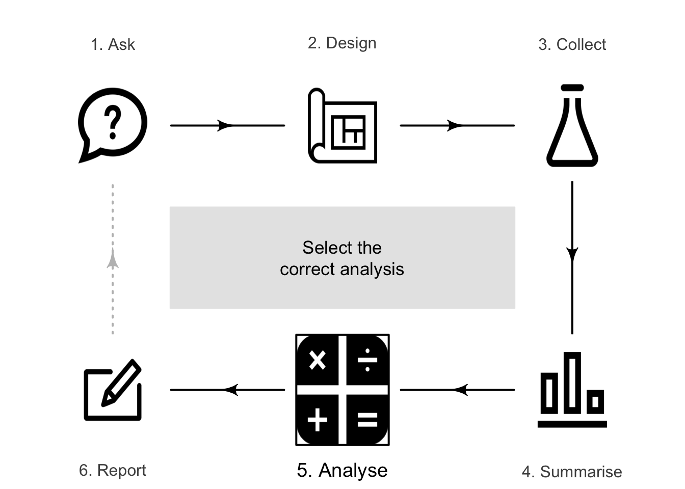

# Selecting an analysis {#SelectTest}
\index{Hypothesis testing!selecting}\index{Confidence intervals!selecting}


<!-- Introductions; easier to separate by format -->

::: {.objectivesBox .objectives data-latex="{iconmonstr-target-4-240.png}"}
So far, you have learnt about the research process, including analysing data using confidence intervals and conducting hypothesis tests.
**In this chapter**, you will learn to:

*   select the correct analysis.
:::





<!-- Define colours as appropriate -->


## About selecting an appropriate analysis {#AboutSelectingAnalysis}

Selecting the correct CI or hypothesis test can be challenging, and this book only describes a few possible scenarios.
For the situations studied in this book, identifying the *type* of RQ (e.g., descriptive or correlational), and the *number* and *type* of variables (qualitative or quantitative) is important (Table\ \@ref(tab:InferenceTestCI2)).
*Appendix\ \@ref(StatisticsAndParameters)* may also prove useful.


<table class="table table-striped" style="margin-left: auto; margin-right: auto;">
<caption>(\#tab:InferenceTestCI2)Analysis scenarios studied.</caption>
 <thead>
<tr>
<th style="border-bottom:hidden;padding-bottom:0; padding-left:3px;padding-right:3px;text-align: center; font-weight: bold; " colspan="2"><div style="border-bottom: 1px solid #ddd; padding-bottom: 5px; ">Summaries</div></th>
<th style="border-bottom:hidden;padding-bottom:0; padding-left:3px;padding-right:3px;text-align: center; font-weight: bold; " colspan="2"><div style="border-bottom: 1px solid #ddd; padding-bottom: 5px; ">Analysis</div></th>
</tr>
  <tr>
   <th style="text-align:left;"> Graphical display </th>
   <th style="text-align:left;"> Numerical summary </th>
   <th style="text-align:left;"> Confidence interval </th>
   <th style="text-align:left;"> Hypothesis test </th>
  </tr>
 </thead>
<tbody>
  <tr grouplength="1"><td colspan="4" style="border-bottom: 1px solid;"><em>Descriptive RQ: proportion in one sample (i.e., one qualitative variable)</em></td></tr>
<tr>
   <td style="text-align:left;width: 25mm; padding-left: 2em;" indentlevel="1"> [Bar charts; pie chart](#GraphsOneQual) </td>
   <td style="text-align:left;width: 25mm; "> [Counts; percentages; odds](#NumericalQual) </td>
   <td style="text-align:left;width: 25mm; "> [CI for one mean](#CIOneProportion) </td>
   <td style="text-align:left;width: 25mm; "> [One-sample $z$-test](#TestOneProportion) </td>
  </tr>
  <tr grouplength="1"><td colspan="4" style="border-bottom: 1px solid;"><em>Descriptive RQ: mean of one sample (i.e., one quantitative variable)</em></td></tr>
<tr>
   <td style="text-align:left;width: 25mm; padding-left: 2em;" indentlevel="1"> [Histogram; stemplot; dot chart](#GraphsOneQuant) </td>
   <td style="text-align:left;width: 25mm; "> [Means, medians; Std dev., IQR; outliers](#NumericalQuant) </td>
   <td style="text-align:left;width: 25mm; "> [CI for one mean](#OneMeanConfInterval) </td>
   <td style="text-align:left;width: 25mm; "> [One-sample $t$-test](#TestOneMean) </td>
  </tr>
  <tr grouplength="1"><td colspan="4" style="border-bottom: 1px solid;"><em>Repeated-measures RQ: paired quantitative data</em></td></tr>
<tr>
   <td style="text-align:left;width: 25mm; padding-left: 2em;" indentlevel="1"> [Histogram of *differences*](#HistoDiffPlot); [case-profile](#CaseProfilePlot) </td>
   <td style="text-align:left;width: 25mm; "> [Mean, std dev. etc. of *differences*](#NumericalQuant) </td>
   <td style="text-align:left;width: 25mm; "> [CI for mean difference](#AnalysisPaired) </td>
   <td style="text-align:left;width: 25mm; "> [$t$-test for mean differences](#AnalysisPaired) </td>
  </tr>
  <tr grouplength="1"><td colspan="4" style="border-bottom: 1px solid;"><em>Relational RQs: comparing quantitative variables</em></td></tr>
<tr>
   <td style="text-align:left;width: 25mm; padding-left: 2em;" indentlevel="1"> [Error bar chart](#ErrorBarCharts) </td>
   <td style="text-align:left;width: 25mm; "> [Mean and std error of the difference; mean, std dev. etc. of *each* group](#NumericalQuant) </td>
   <td style="text-align:left;width: 25mm; "> [CI of the difference between two means](#AnalysisTwoMeans) </td>
   <td style="text-align:left;width: 25mm; "> [$t$-test for the difference between two means](#AnalysisTwoMeans) </td>
  </tr>
  <tr grouplength="1"><td colspan="4" style="border-bottom: 1px solid;"><em>Relational RQs: comparing qualitative variables</em></td></tr>
<tr>
   <td style="text-align:left;width: 25mm; padding-left: 2em;" indentlevel="1"> [Side-by-side bar chart; stacked bar chart](#TwoQualVars) </td>
   <td style="text-align:left;width: 25mm; "> [Odds; OR; percentages](#NumericalQual) </td>
   <td style="text-align:left;width: 25mm; "> [CI for ORs; CI for difference between two proportions](#AnalysisOddsRatio) </td>
   <td style="text-align:left;width: 25mm; "> [$\chi^2$-test for OR; $z$-test for difference between two proportions](#AnalysisOddsRatio) </td>
  </tr>
  <tr grouplength="1"><td colspan="4" style="border-bottom: 1px solid;"><em>Correlational RQs</em></td></tr>
<tr>
   <td style="text-align:left;width: 25mm; padding-left: 2em;" indentlevel="1"> [Scatterplot](#TwoQualVars) </td>
   <td style="text-align:left;width: 25mm; "> [Correlation coefficient; $R^2$](#NumericalQual) </td>
   <td style="text-align:left;width: 25mm; "> [CI for correlation coefficient; CI for regression parameters](#CorrelationRegression) </td>
   <td style="text-align:left;width: 25mm; "> [Test for correlation; $t$-test for regression parameters](#CorrelationRegression) </td>
  </tr>
</tbody>
</table>


:::{.example name="Selecting an analysis"}
@bjornsson2021effect studied whether the 'presence of a prehospital physician improves survival from cardiac arrest' (p.\ 227).
They studied 471 cardiac arrests: $200$ treated by prehospital physicians (2004 to\ 2007), and $271$ treated by emergency medical technicians (2008 to\ 2014). 

For each cardiac admission (the unit of analysis), two variables are recorded.
*Whether a prehospital physician is present* (the explanatory variable) is qualitative with two levels (Yes; No).
*Whether a patient survived* (the response variable) is qualitative with two levels (Yes; No).
They compared the survival proportions for the two scenarios; this is a *relational RQ*.

To study the *proportion* of survivors for each scenario, a $z$-test for the difference between proportions (and corresponding CI) would be used.
Alternatively, a $\chi^2$-test for comparing the odds of survival (and a CI for the OR) could also be used.
:::


:::{.example name="Selecting an analysis"}
@lyons2023female studied the relationship between the ball release speed (BRS) and the height of female cricket players, and BRS and arm length.
Since they are exploring the relationship between two *pairs of quantitative variables*, both RQs are correlational RQs.

If the relationships are approximately linear (determined by examining the two scatterplots), a test for correlations (and corresponding CI) would be used, for one each relationship to be studied.
Alternatively, a linear regression model could be fitted (one for each relationship), and a test for the *slope* of the fitted regression equation (and corresponding CI) could be conducted.
:::


:::{.example name="Selecting an analysis"}
@hitt2023lead studied the impact of soil lead levels in New Orleans (USA) neighbourhoods on northern mockingbirds (p.\ 2):

> We tested the hypothesis that nestling mockingbird lead levels in blood and feathers differ with respect to neighborhood soil lead levels...

They compared the mean lead concentration in blood, for birds in neighbourhoods with *low* and with *high* lead levels. 
They also compared the mean lead concentration in feathers, for birds in neighbourhoods with *low* and *high* lead levels.
These are both *relational RQs*.

For each bird (the unit of analysis), three variables were recorded.
The *lead levels* (the explanatory variable) is qualitative with two levels: high lead-level neighbourhoods, and low lead-level neighbourhoods.
The *blood lead concentrations* (one response variable) is quantitative (continuous).
The *lead concentrations in feathers* (another response variable) is quantitative (continuous).

To study the difference between the mean lead concentrations in the two groups, a two-sample $t$-test for the difference between the means (and the corresponding CI) is needed (provided the statistical validity assumptions are met).
One test is needed for comparing blood lead concentrations, and another for comparing concentrations in feathers.
:::


## Exercises {#SelectTestExercises}

[Answers to odd-numbered exercises] are given at the end of the book. 


:::{.exercise #SamplingDistributionA}
Identify which of these statistics *do not* have a sampling distribution well-modelled by a normal distribution.
Explain your answer.

1. The difference between two sample means $\bar{x}_1 - \bar{x}_2$, with samples of size $n_1 = 55$ and $n_2 = 61$, but slightly right-skewed distributions of the data for each sample.
1. The sample slope in a regression equation $b_1$, with an approximate linear relationship between the variables, approximately constant variation in the values of\ $y$, and $n = 24$.
1. The sample OR, with both samples of size $n = 43$.
:::


:::{.exercise #SamplingDistributionB}
Identify which of these statistics *do not* have a sampling distribution well-modelled by a normal distribution.
Explain your answer.

1. The sample mean of a set of differences $\bar{d}$, with a sample of $n = 32$ difference, but the distribution of the differences are slightly right-skewed.
1. The sample correlation coefficient\ $r$, with an approximate linear relationship between the variables, approximately constant variation in the values of\ $y$, and $n = 29$.
1. The sample proportion\ $\hat{p}$, with $n = 26$ and $\hat{p} = 0.154$.
:::


:::{.exercise #Method1}
Suppose researchers compare the mean number of hours of exercise per week for the same British office workers, both in summer and in winter, to study the mean change.  

What methods would be a suitable for creating a summary and performing analyses?
:::

:::{.exercise #Method2}
@castro2019sun estimated the difference between the mean number of hours of sunlight exposure per day for physical education teachers and non-physical education teachers in Spain. 

What methods would be a suitable for creating a summary and performing analyses?
:::

:::{.exercise #Method3}
Suppose researchers wanted to study the proportion of koalas that live in regions with tree canopies of different heights (classified as Class\ 1 (highest canopy height) to Class\ 4 (lowest canopy height)) in the 'core' areas (areas of intensive use and feeding) and non-core areas (based on @mitchell2023remote). 

What methods would be a suitable for creating a summary and performing analyses?
:::

:::{.exercise #Method4}
@data:Chen2018:crocodiles studied the relationship between the mass and the length of crocodile eggs.

What methods would be a suitable for creating a summary and performing analyses?
:::


:::{.exercise #Method5}
@meadley2021comparison studied the *relationship* between maximal aerobic capacity (VO~2peak~) while swimming, and the maximal aerobic capacity while running, in helicopter rescue paramedics.

What methods would be a suitable for creating a summary and performing analyses?
:::


:::{.exercise #Method6}
Suppose researchers are wanting to *estimate* the difference between the mean number of hours spent on social media for Indian people aged over\ $30$, to people aged\ $30$ and under.  

What methods would be a suitable for creating a summary and performing analyses?
:::


The following short video may help explain some of these concepts. Note that the test for correlation and regression have not yet been covered in this book (but they will be in the next few chapters).


<div style="text-align:center;">

```{=html}
<video src="./videos/SelectTest.mp4" width="550" controls="controls" loop="loop" style="padding:5px; border: 2px solid gray;"></video>
```
</div>


